# Vidara AI — AI Agent System Architecture

> **Project:** Vidara AI — AI YouTube Video Generator SaaS  
> **Version:** 1.0  
> **Date:** 2026-06-26  
> **Status:** Draft Final  
> **Author:** AI Engineering Team (Agent 6 — Senior AI Engineer)  
> **Cross-Reference:** [Workflow](workflow.md) · [Architecture](architecture.md) · [PRD](prd.md) · [FRD](frd.md) · [API](api.md)  
> **Related:** `internal/docs/prompt-engineering.md` (Prompt Engineering Guide)  
> **Note:** Dokumen ini mendefinisikan 21 AI agents system. Referensi ke `prompt-engineering.md` akan digunakan untuk detail prompt strategy per agent.

---

## 1. Tujuan

Dokumen ini mendefinisikan arsitektur AI Agent system untuk Vidara AI secara detail dan komprehensif. Mencakup spesifikasi 21 agent, protokol komunikasi antar-agent, orchestration patterns, memory architecture, queue configuration, error handling, dan performance budgets. Bertujuan menjadi blueprint utama bagi seluruh implementasi multi-agent AI system.

---

## 2. Background

Vidara AI menggunakan pendekatan **multi-agent orchestration** di mana 21 specialized AI agents berkoordinasi untuk menghasilkan video YouTube dari prompt teks. Tidak seperti sistem monolithic text-to-video, pendekatan agent-based memungkinkan:

- **Specialization**: Setiap agent fokus pada satu domain (riset, script, visual, audio, dll)
- **Quality gates**: Setiap stage output divalidasi sebelum dilanjutkan
- **Parallelism**: Agent independen bisa berjalan paralel untuk mengurangi latency
- **Resilience**: Kegagalan satu agent tidak menghentikan pipeline total
- **Observability**: Setiap agent menghasilkan trace dan metric yang terukur

Pipeline utama terdiri dari 20 langkah (didefinisikan di `workflow.md`) yang diorkestrasi oleh Master Agent menggunakan Temporal.io. Setiap langkah direalisasikan oleh satu atau lebih agent dengan input/output terdefinisi.

---

## 3. Objective

1. Mendefinisikan 21 AI agents dengan role, trigger, input/output schema, dan workflow lengkap.
2. Mendokumentasikan protokol komunikasi antar-agent (pub/sub, request/response, event-driven).
3. Menyediakan orchestration pattern untuk pipeline execution (sequential, parallel, dynamic selection).
4. Mendefinisikan memory architecture 5-tier (short-term, long-term, episodic, semantic, working).
5. Menetapkan error handling strategy per agent — retry, fallback, circuit breaker, DLQ.
6. Menyediakan performance budget dan queue configuration untuk setiap agent.
7. Semua diagram menggunakan Mermaid yang valid dan cross-reference ke dokumen terkait.

---

## 4. Scope

**In Scope:**
- 21 AI agents dengan full specification (role, trigger, schema, workflow, communication, memory, retry, fallback, queue, events, errors, budget)
- Agent-to-Agent message protocol definition
- Event bus design with producer/consumer matrix
- Synchronous vs asynchronous communication patterns
- Dead letter queue handling and circuit breaker configuration
- Master Agent orchestration pattern and pipeline execution model
- Memory architecture (short-term, long-term, episodic, semantic, working)
- Quality gates between pipeline stages

**Out of Scope:**
- Frontend state management
- Database schema details (documented in `erd.md`)
- Specific AI model fine-tuning methodology
- Deployment topology (documented in `architecture.md`)
- UI/UX design patterns

---

## 5. Stakeholder

| Stakeholder | Interest |
|---|---|
| AI Engineer | Agent behavior, prompt strategy, model selection, orchestration logic |
| Backend Engineer | Event bus, message protocol, queue architecture, Temporal workflows |
| Prompt Engineer | System prompts, context management, agent instruction design |
| DevOps Engineer | Agent health monitoring, scaling, DLQ alerts |
| QA Engineer | Agent output validation, quality gate test scenarios |
| Product Manager | Agent capabilities, pipeline steps, timeout SLAs |
| Security Officer | Content moderation, agent safety filters, data privacy |

---

## 6. Requirement

1. Sistem harus memiliki 21 agent yang terdefinisi dengan role dan tanggung jawab jelas.
2. Setiap agent harus memiliki input/output schema yang terstruktur (JSON Schema).
3. Setiap agent harus memiliki trigger event, workflow, dan communication pattern yang jelas.
4. Setiap agent harus memiliki retry strategy (exponential backoff) dan fallback behavior.
5. Setiap agent harus memiliki performance budget (max latency, max tokens).
6. Agent-to-Agent communication harus mendukung pub/sub dan request/response pattern.
7. Memory architecture harus mencakup 5 tier dengan strategi penyimpanan berbeda.
8. Master Agent harus mendukung dynamic agent selection dan quality gates.
9. Semua diagram Mermaid harus valid dan dapat dirender.

---

## 7. Functional Requirement

| ID | Requirement | Agent Terkait |
|---|---|---|
| FR-AG-01 | Master Agent menginisialisasi pipeline dari prompt user | Master |
| FR-AG-02 | Research Agent melakukan web research dan content gathering | Research |
| FR-AG-03 | Planner Agent menentukan struktur dan timeline video | Planner |
| FR-AG-04 | Fact Checker memvalidasi fakta dengan minimal 3 sumber | Fact Checker |
| FR-AG-05 | Script Agent menulis narasi lengkap dengan hook, story arc, CTA | Script |
| FR-AG-06 | Storyboard Agent menghasilkan visual storyboard per scene | Storyboard |
| FR-AG-07 | Scene Agent melakukan breakdown scene dan timing | Scene |
| FR-AG-08 | Image Agent menghasilkan gambar per scene dengan style konsisten | Image |
| FR-AG-09 | Voice Agent menghasilkan TTS dengan emotion dan pacing | Voice |
| FR-AG-10 | Subtitle Agent melakukan speech-to-text dan timing | Subtitle |
| FR-AG-11 | Animation Agent menerapkan transisi dan motion effects | Animation |
| FR-AG-12 | Composer Agent melakukan video assembly dan timeline composition | Composer |
| FR-AG-13 | Thumbnail Agent menghasilkan thumbnail dengan A/B variants | Thumbnail |
| FR-AG-14 | SEO Agent mengoptimasi title, description, tags, chapters | SEO |
| FR-AG-15 | Publishing Agent melakukan YouTube upload dan scheduling | Publishing |
| FR-AG-16 | Analytics Agent melacak performa dan audience insights | Analytics |
| FR-AG-17 | Memory Agent menyimpan cross-session context dan preferences | Memory |
| FR-AG-18 | Context Agent mengelola conversation state dan prompt enrichment | Context |
| FR-AG-19 | QA Agent melakukan output quality checks dan consistency validation | QA |
| FR-AG-20 | Moderator Agent melakukan content moderation dan policy compliance | Moderator |
| FR-AG-21 | Monitoring Agent memantau system health dan agent performance | Monitoring |
| FR-AG-22 | Niche Agent menyediakan konteks niche ke agent lain dan mengelola definisi niche user | Niche |

---

## 8. Non Functional Requirement

| ID | Kategori | Requirement | Target |
|---|---|---|---|
| NFR-AG-01 | Latency | Master Agent orchestration decision | <500ms |
| NFR-AG-02 | Latency | Research Agent web search | <60s |
| NFR-AG-03 | Latency | Image Agent generation per 4 images | <30s |
| NFR-AG-04 | Latency | Voice Agent TTS generation per 1000 chars | <10s |
| NFR-AG-05 | Latency | Composer Agent video assembly | <300s |
| NFR-AG-06 | Reliability | Agent success rate (post-retry) | ≥99.5% |
| NFR-AG-07 | Reliability | Pipeline completion without human intervention | ≥95% |
| NFR-AG-08 | Scalability | Concurrent agent executions | 1000 |
| NFR-AG-09 | Memory | Long-term memory retrieval latency (p95) | <100ms |
| NFR-AG-10 | Memory | Context window management token budget | 128K tokens |
| NFR-AG-11 | Cost | Average AI cost per pipeline per agent | <$0.50 total |
| NFR-AG-12 | Observability | Agent trace span export latency | <1s |
| NFR-AG-13 | Moderation | Content policy violation detection latency | <5s |
| NFR-AG-14 | Latency | Niche Agent context retrieval | <100ms |
| NFR-AG-15 | Accuracy | Niche context injection relevance | ≥90% |

---

## 9. AI Agent Specifications

### 9.1 Master Agent

| Field | Value |
|---|---|
| **Role** | Orchestrator, Delegator, Quality Gate |
| **Responsibility** | Parsing user prompt, delegating to sub-agents, collecting results, quality gate validation, error decision (retry vs fallback vs fail), pipeline state management |
| **Trigger** | `pipeline.generate` event dari API Server (BullMQ → Temporal) |
| **Model** | GPT-5o (decision logic) + deterministic code (validation rules) |

**Input Schema:**
```json
{
  "project_id": "uuid",
  "user_id": "uuid",
  "prompt": { "text": "string", "language": "string", "target_duration_sec": "number" },
  "config": { "resolution": "720p|1080p|4k", "auto_publish": "boolean", "voice_id": "string?" },
  "brand_kit": { "colors": "string[]?", "fonts": "string[]?", "logo_url": "string?" },
  "context": { "session_id": "string", "previous_projects": "string[]?" }
}
```

**Output Schema:**
```json
{
  "pipeline_id": "uuid",
  "status": "completed|failed|partial",
  "artifacts": {
    "research": "ResearchResult",
    "script": "ScriptResult",
    "storyboard": "StoryboardResult",
    "scene_plan": "ScenePlanResult",
    "images": "ImageResult[]",
    "voiceover": "VoiceResult",
    "subtitles": "SubtitleResult",
    "animation": "AnimationResult",
    "composition": "CompositionResult",
    "video_url": "string",
    "thumbnail": "ThumbnailResult[]",
    "seo": "SEOResult",
    "youtube": "PublishResult?"
  },
  "quality_scores": { "overall": "number 0-100", "per_agent": "Record<string, number>" },
  "metrics": { "total_duration_ms": "number", "total_cost_usd": "number", "token_usage": { "input": "number", "output": "number" } },
  "errors": "PipelineError[]"
}
```

**Workflow:**
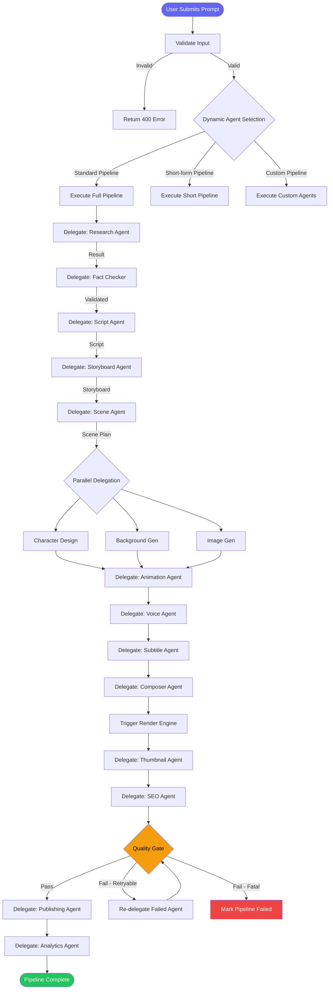

**Communication Pattern:** Synchronous (Temporal activity calls) + Async (event emission via WebSocket)

**Memory Strategy:** 
- **Working Memory:** Pipeline context object (project_id, step, artifacts) — alive during pipeline execution
- **Episodic Memory:** Past pipeline patterns and decisions stored via Memory Agent

**Context Window Management:**
- Master Agent does NOT accumulate full context from all agents
- Receives summaries only (max 4K tokens per agent result)
- Delegates detailed context management to Context Agent

**Retry Strategy:**

| Error Type | Max Retries | Backoff | Notes |
|---|---|---|---|
| Agent timeout | 3 | Exponential (2s, 4s, 8s) | Per-agent retry |
| Agent invalid output | 2 | Immediate (0s) | Regenerate with feedback |
| Pipeline logic error | 0 | — | Fatal, halt pipeline |

**Fallback Behavior:**
- Agent fails after retries → skip to next agent (if non-critical) OR halt pipeline (if critical)
- Critical agents: Research, Fact Checker, Script, Voice, Render
- Non-critical: Music, SFX, SEO (can use defaults)

**Queue Configuration:**
```json
{ "queue": "master", "priority": 5, "concurrency": 20 }
```

**Events Produced:**
| Event | Payload | Destination |
|---|---|---|
| `pipeline.started` | `{ pipeline_id, project_id, user_id }` | WebSocket, Analytics Agent |
| `pipeline.progress` | `{ pipeline_id, step, progress_pct }` | WebSocket |
| `pipeline.completed` | `{ pipeline_id, artifacts_summary }` | WebSocket, Analytics, Notification |
| `pipeline.failed` | `{ pipeline_id, error, retryable }` | WebSocket, DLQ, Analytics |
| `agent.delegated` | `{ agent_name, input_summary }` | Monitoring Agent |

**Events Consumed:**
| Event | Source |
|---|---|
| `pipeline.generate` | API Server via BullMQ |
| `agent.*.completed` | All sub-agents |
| `agent.*.failed` | All sub-agents |
| `pipeline.cancelled` | API Server (user cancellation) |

**Error Scenarios:**
| Error | Cause | Action |
|---|---|---|
| AGENT_TIMEOUT | Agent exceeds max latency | Retry 3x → fallback → fail |
| AGENT_INVALID_OUTPUT | Agent returns malformed JSON | Retry with stricter prompt |
| CIRCUIT_BREAKER_OPEN | Provider circuit breaker active | Wait 30s → retry → fallback provider |
| PIPELINE_STUCK | No progress for 5 min | Escalate to human operator |

**Performance Budget:**
| Metric | Limit |
|---|---|
| Max latency per orchestrator decision | 500ms |
| Max tokens for orchestration prompt | 4,000 input / 2,000 output |
| Max pipeline context size | 100KB |
| Max concurrent pipeline orchestrations per instance | 50 |

---

### 9.2 Research Agent

| Field | Value |
|---|---|
| **Role** | Topic Research, Content Gathering, Source Citation |
| **Responsibility** | Web search via API (Google/Bing/Custom Search), content extraction from top results, source collection with URLs, research brief generation with key facts, data points, quotes, and statistics. Prioritizes reputable sources (.edu, .gov, established media). |
| **Trigger** | `agent.research.start` event dari Master Agent |
| **Model** | GPT-5o + Web Search API |

**Input Schema:**
```json
{
  "topic": "string",
  "keywords": "string[]",
  "depth": "basic|thorough|exhaustive",
  "language": "string",
  "target_audience": "string",
  "exclude_domains": "string[]?",
  "preferred_sources": "string[]?",
  "max_sources": "number (default: 10)"
}
```

**Output Schema:**
```json
{
  "search_id": "uuid",
  "query": "string",
  "sources": [{
    "url": "string",
    "title": "string",
    "domain": "string",
    "relevance_score": "number 0-1",
    "authority_score": "number 0-1",
    "snippet": "string",
    "published_date": "string?"
  }],
  "facts": [{
    "claim": "string",
    "source_urls": "string[]",
    "confidence": "number 0-1",
    "category": "history|science|technology|entertainment|education|news|other"
  }],
  "key_quotes": [{ "text": "string", "attribution": "string", "source_url": "string" }],
  "statistics": [{ "value": "string", "context": "string", "source_url": "string" }],
  "summary": "string (max 500 words)",
  "metadata": { "search_duration_ms": "number", "sources_found": "number", "facts_extracted": "number" }
}
```

**Workflow:**
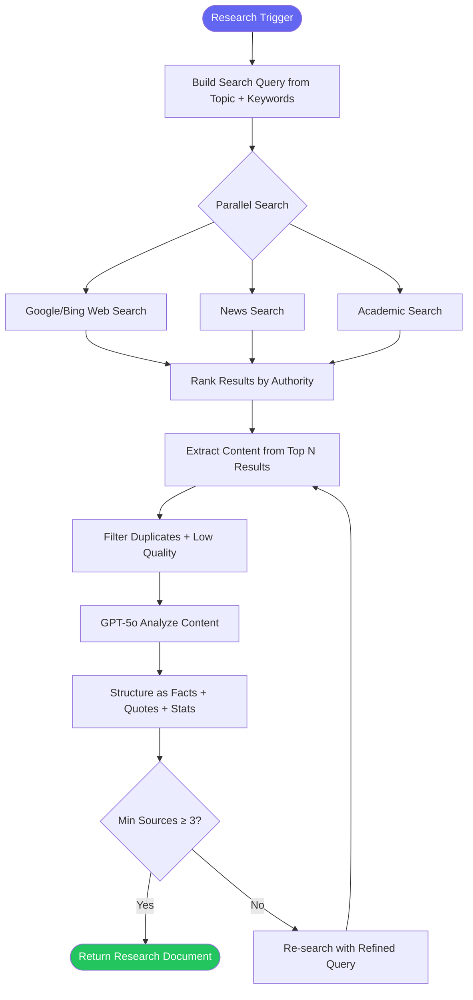

**Communication Pattern:** Request/Response (synchronous via Temporal activity)

**Memory Strategy:**
- **Semantic Memory:** Cached research results for similar topics (hash-based, TTL 24h)
- **Episodic Memory:** Past research patterns (preferred sources, domain authority learning)

**Context Window Management:** Full research response max 8K tokens; summary max 1K tokens for Master Agent

**Retry Strategy:** Max 3 attempts, exponential backoff (2s, 4s, 8s)

**Fallback Behavior:** If web search fails → use cached research from similar prompts → return minimal research with prompt-derived facts only

**Queue Configuration:** `{ "queue": "research", "priority": 5, "concurrency": 10 }`

**Events Produced:** `agent.research.completed`, `agent.research.failed`

**Events Consumed:** `agent.research.start`

**Error Scenarios:**
| Error | Cause | Action |
|---|---|---|
| RESEARCH_TIMEOUT | Web search exceeds 60s | Retry 3x → cached result |
| RESEARCH_NO_RESULTS | No relevant sources found | Expand query, reduce depth |
| SEARCH_API_ERROR | Google/Bing API failure | Fallback to secondary search API |
| PARSE_ERROR | Failed to extract content | Retry with different parser |

**Performance Budget:** Max latency 60s, Max output tokens 8,000, Max input tokens 2,000

---

### 9.3 Planner Agent

| Field | Value |
|---|---|
| **Role** | Video Structure, Scene Planning, Timeline Allocation |
| **Responsibility** | Menentukan struktur video: scene breakdown, timing allocation per scene (hook, body, CTA sections), narrative arc mapping, pacing recommendations, resource estimation (credits, duration). Output sebagai blueprint untuk Scene Agent. |
| **Trigger** | `agent.planner.start` event dari Master Agent (setelah research & fact check) |
| **Model** | GPT-5o |

**Input Schema:**
```json
{
  "research": { "summary": "string", "facts": "Fact[]", "key_quotes": "Quote[]" },
  "config": { "target_duration_sec": "number", "style": "string", "tone": "string", "language": "string" },
  "script_requirements": { "has_hook": "boolean", "has_cta": "boolean", "sections_min": "number" }
}
```

**Output Schema:**
```json
{
  "plan_id": "uuid",
  "total_duration_sec": "number",
  "scenes": [{
    "scene_number": "number",
    "title": "string",
    "narrative_role": "hook|problem|exploration|solution|cta|conclusion",
    "estimated_duration_sec": "number",
    "key_points": "string[]",
    "suggested_visual_style": "string",
    "suggested_mood": "string",
    "requires_character": "boolean",
    "requires_background": "string"
  }],
  "narrative_arc": { "hook_section": "string", "problem_statement": "string", "climax": "string", "resolution": "string", "cta": "string" },
  "pacing": { "overall_pace": "slow|moderate|fast", "energy_curve": "number[] (0-100 per scene)" },
  "metadata": { "estimated_credits": "number", "estimated_cost_usd": "number" }
}
```

**Workflow:**
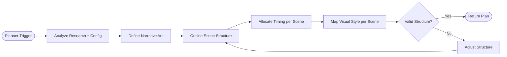

**Communication Pattern:** Request/Response

**Memory Strategy:** Uses episodic memory from past plans to improve structure recommendations

**Context Window Management:** Input research summary (max 4K), output plan (max 6K)

**Retry Strategy:** Max 2 attempts, exponential backoff (1s, 2s)

**Fallback Behavior:** Default structure template (Hook 15% + Body 70% + CTA 15%)

**Queue Configuration:** `{ "queue": "planner", "priority": 4, "concurrency": 8 }`

**Events Produced:** `agent.planner.completed`, `agent.planner.failed`

**Events Consumed:** `agent.planner.start`

**Performance Budget:** Max latency 30s, Max output tokens 6,000

---

### 9.4 Fact Checker

| Field | Value |
|---|---|
| **Role** | Fact Validation, Source Verification, Accuracy Scoring |
| **Responsibility** | Cross-reference setiap claim dari Research Agent dengan minimal 3 independent sources. Validasi akurasi, tanggal publikasi, dan otoritas sumber. Memberikan confidence score per claim. Flag uncertain claims untuk human review. Gunakan GPT-5o + custom fact-check pipeline. |
| **Trigger** | `agent.fact_check.start` event dari Master Agent |
| **Model** | GPT-5o + custom fact-check reasoning pipeline |

**Input Schema:**
```json
{
  "facts": [{ "claim": "string", "source_urls": "string[]", "category": "string", "original_confidence": "number" }],
  "verification_depth": "quick|standard|thorough"
}
```

**Output Schema:**
```json
{
  "validation_id": "uuid",
  "validated_facts": [{
    "claim": "string",
    "confidence": "number 0-100",
    "status": "verified|uncertain|rejected",
    "supporting_sources": "string[]",
    "contradicting_sources": "string[]",
    "verification_notes": "string",
    "last_verified_date": "string"
  }],
  "overall_accuracy_score": "number 0-100",
  "flags": [{ "fact_index": "number", "reason": "string", "severity": "low|medium|high" }],
  "recommendation": "proceed|review_required|halt"
}
```

**Workflow:**
```mermaid
flowchart TD
    Start([Facts Input]) --> ParallelCheck{For Each Fact}
    ParallelCheck --> Verify[Cross-Reference Sources]
    Verify --> Score[Calculate Confidence]
    Score -->{Confidence}
    -->|≥ 80%| Verified[Mark: Verified]
    -->|50-80%| Flagged[Mark: Flagged for Review]
    -->|≤ 50%| Rejected[Mark: Rejected]
    Verified & Flagged & Rejected --> Aggregate[Aggregate Results]
    Aggregate --> Report[Generate Validation Report]
    Report --> Review{Has Rejected Facts?}
    Review -->|No| Return([Return Validated Facts])
    Review -->|Yes| ReCheck[Re-verify Rejected Facts]
    ReCheck --> {Re-check Status}
    ReCheck -->|Still Rejected| Halt([Recommend Pipeline Halt])
    ReCheck -->|Now Verified| Return
```

**Communication Pattern:** Request/Response

**Memory Strategy:** 
- **Semantic Memory:** Cache of verified facts across sessions (pgvector)
- **Episodic Memory:** Source reliability scoring (learn which domains are trustworthy)

**Context Window Management:** Input max 8K tokens, output max 4K tokens

**Retry Strategy:** Max 3 attempts, exponential backoff (2s, 4s, 8s)

**Fallback Behavior:** If fact-check API fails → mark all facts as "unverified" with reduced confidence → allow pipeline to proceed with warning

**Queue Configuration:** `{ "queue": "fact-check", "priority": 5, "concurrency": 10 }`

**Events Produced:** `agent.fact_check.completed`, `agent.fact_check.failed`

**Events Consumed:** `agent.fact_check.start`

**Error Scenarios:**
| Error | Action |
|---|---|
| VALIDATION_FAILED | Reduce confidence scores, flag for human review |
| SOURCE_UNAVAILABLE | Remove source, recalculate confidence without it |
| CIRCUIT_BREAKER | Use cached verification results |

**Performance Budget:** Max latency 30s, Max output tokens 4,000

---

### 9.5 Script Agent

| Field | Value |
|---|---|
| **Role** | Narrative Writing, Hook, Storytelling, CTA, SEO Keywords |
| **Responsibility** | Generate full script dengan hook (first 15 seconds), narrative arc (hook → problem → exploration → solution → CTA), scene-by-scene narration, voice direction (tone, emotion, speed), scene direction (visual cues), SEO keyword integration, dan estimated duration per section. |
| **Trigger** | `agent.script.start` dari Master Agent |
| **Model** | GPT-5o |

**Input Schema:**
```json
{
  "validated_facts": "ValidatedFact[]",
  "plan": "PlanResult",
  "config": { "tone": "string", "language": "string", "target_audience": "string", "seo_keywords": "string[]" },
  "brand_guidelines": { "forbidden_words": "string[]", "must_include": "string[]", "style_guide": "string?" }
}
```

**Output Schema:**
```json
{
  "script_id": "uuid",
  "full_script": "string",
  "hook": "string (first 15s narration)",
  "cta": "string",
  "scenes": [{
    "scene_number": "number",
    "narration": "string",
    "voice_direction": { "tone": "string", "emotion": "string", "speed": "slow|normal|fast" },
    "scene_direction": "string",
    "estimated_duration_sec": "number",
    "seo_keywords_used": "string[]"
  }],
  "metadata": { "word_count": "number", "estimated_duration_sec": "number", "reading_speed_wpm": "number", "seo_density_pct": "number" }
}
```

**Workflow:**
```mermaid
flowchart TD
    Start([Script Trigger]) --> Compile[Compile Research + Plan]
    Compile --> Outline[Generate Script Outline]
    Outline --> Draft[Write Full Script]
    Draft --> InjectSEO[Inject SEO Keywords Naturally]
    InjectSEO --> AddDirection[Add Voice + Scene Direction]
    AddDirection --> CalcEst[Calculate Duration Estimates]
    CalcEst --> Validate[Validate Structure]
    Validate --> {Valid?}
    -->|Yes| Return([Return Script])
    -->|No| Revise[Revise Script with Feedback]
    Revise --> Draft
```

**Communication Pattern:** Request/Response

**Memory Strategy:** 
- **Episodic Memory:** Past successful script structures by category
- **Working Memory:** Current script draft in context

**Context Window Management:** 
- Input: research summary (2K) + plan (2K) + config (1K) = max 5K
- Output: full script can be up to 16K tokens for long-form videos

**Retry Strategy:** Max 2 attempts, exponential backoff (1s, 2s)

**Fallback Behavior:** Use shorter script template with reduced detail. Skip voice/scene direction if generation fails.

**Queue Configuration:** `{ "queue": "script", "priority": 5, "concurrency": 8 }`

**Events Produced:** `agent.script.completed`, `agent.script.failed`

**Events Consumed:** `agent.script.start`

**Error Scenarios:**
| Error | Cause | Action |
|---|---|---|
| SCRIPT_GENERATION_FAILED | LLM API error | Retry → fallback template |
| OUTPUT_PARSE_ERROR | AI response not valid JSON | Retry with stricter schema |
| WORD_COUNT_MISMATCH | Script too short/long | Trim or expand via second pass |
| CONTENT_POLICY | AI refuses to generate | Return error with policy explanation |

**Performance Budget:** Max latency 120s, Max output tokens 16,000, Max input tokens 5,000

---

### 9.6 Storyboard Agent

| Field | Value |
|---|---|
| **Role** | Visual Storyboard per Scene, Shot Composition |
| **Responsibility** | Generate visual storyboard panels dari script. Setiap panel mencakup: visual description, camera angle (wide, medium, close-up), shot type (establishing, tracking, static), composition notes, lighting suggestion, transition suggestion antar scene. Bisa menghasilkan thumbnail preview via Flux Pro. |
| **Trigger** | `agent.storyboard.start` dari Master Agent |
| **Model** | GPT-5o (description) + Flux 2 Pro (thumbnail preview — optional) |

**Input Schema:**
```json
{
  "script_scenes": [{ "scene_number": "number", "narration": "string", "scene_direction": "string", "estimated_duration_sec": "number" }],
  "visual_style": "string",
  "brand_colors": "string[]?",
  "generate_previews": "boolean (default: true)"
}
```

**Output Schema:**
```json
{
  "storyboard_id": "uuid",
  "panels": [{
    "scene_number": "number",
    "visual_description": "string",
    "camera_angle": "wide|medium|close_up|extreme_close_up|over_shoulder|aerial|low_angle|high_angle",
    "shot_type": "establishing|tracking|static|pan|tilt|dolly|handheld",
    "composition_notes": "string",
    "lighting": "natural|dramatic|soft|backlit|neon|golden_hour|moody",
    "color_palette": "string[]",
    "transition_in": "fade|crossfade|slide|zoom|wipe|cut",
    "transition_out": "fade|crossfade|slide|zoom|wipe|cut",
    "thumbnail_url": "string? (if generate_previews=true)"
  }],
  "overall_visual_theme": "string",
  "continuity_notes": "string"
}
```

**Workflow:**
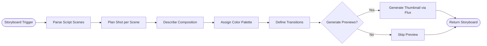

**Communication Pattern:** Request/Response

**Memory Strategy:** Episodic memory — track successful visual styles per script category

**Context Window Management:** Input per scene avg 500 tokens, output per panel avg 300 tokens

**Retry Strategy:** Max 2 attempts, exponential backoff (1s, 2s)

**Fallback Behavior:** Generate text-only storyboard (no thumbnail previews)

**Queue Configuration:** `{ "queue": "storyboard", "priority": 4, "concurrency": 8 }`

**Events Produced:** `agent.storyboard.completed`, `agent.storyboard.failed`

**Events Consumed:** `agent.storyboard.start`

**Performance Budget:** Max latency 60s (30s without previews), Max output tokens 6,000

---

### 9.7 Scene Agent

| Field | Value |
|---|---|
| **Role** | Scene Breakdown, Timing, Audio/Visual Requirements |
| **Responsibility** | Melakukan breakdown dari script + storyboard menjadi scene plan detail. Menentukan timing per scene (start/end timestamp), visual requirements (background type, character presence, overlay elements), audio requirements (voice narration, music mood, SFX cues), dan resource allocation. |
| **Trigger** | `agent.scene_plan.start` dari Master Agent |
| **Model** | GPT-5o |

**Input Schema:**
```json
{
  "script": "ScriptResult",
  "storyboard": "StoryboardResult",
  "config": { "min_scene_duration_sec": "number (default: 8)", "max_scene_duration_sec": "number (default: 45)" }
}
```

**Output Schema:**
```json
{
  "plan_id": "uuid",
  "scenes": [{
    "scene_number": "number",
    "start_timestamp_sec": "number",
    "end_timestamp_sec": "number",
    "duration_sec": "number",
    "visuals": { "background_type": "static|animated|abstract|stock", "character_present": "boolean", "character_action": "string?", "overlay_text": "string?", "overlay_graphics": "string[]" },
    "audio": { "narration_text": "string", "music_mood": "string", "sfx_cues": "string[]", "silence_periods_sec": "{ start: number, end: number }[]" },
    "resource_requirements": { "needs_image_generation": "boolean", "needs_character_design": "boolean", "needs_custom_background": "boolean" }
  }],
  "total_timeline_sec": "number",
  "parallel_scenes": "number[][] (groups of scenes that can be processed in parallel)"
}
```

**Workflow:**
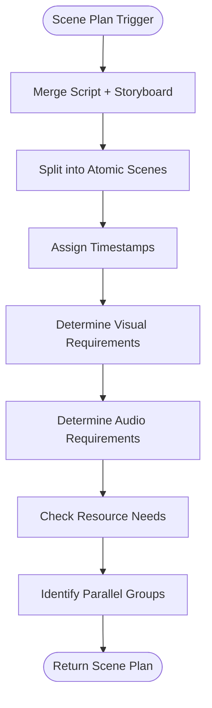

**Communication Pattern:** Request/Response

**Memory Strategy:** Working memory — holds current scene plan context

**Context Window Management:** Input max 10K, output max 8K

**Retry Strategy:** Max 2 attempts, exponential backoff (1s, 2s)

**Fallback Behavior:** Default scene split: every 30 seconds with automatic visual/audio assignment

**Queue Configuration:** `{ "queue": "scene-plan", "priority": 4, "concurrency": 8 }`

**Events Produced:** `agent.scene_plan.completed`, `agent.scene_plan.failed`

**Events Consumed:** `agent.scene_plan.start`

**Performance Budget:** Max latency 30s, Max output tokens 8,000

---

### 9.8 Image Agent

| Field | Value |
|---|---|
| **Role** | AI Image Generation per Scene, Style Consistency |
| **Responsibility** | Generate visual assets per scene: character images (with consistency), backgrounds, full scene compositions. Menggunakan Flux 2 Pro (primary), DALL-E 4 (fallback), Stable Diffusion 3.5 (tertiary). Supports character embedding injection via pgvector. |
| **Trigger** | `agent.image.start` dari Master Agent (setelah scene plan selesai) |
| **Model** | Flux 2 Pro (primary), DALL-E 4 (secondary), Stable Diffusion 3.5 (tertiary) |

**Input Schema:**
```json
{
  "scenes": [{
    "scene_number": "number",
    "visual_description": "string",
    "style": "string",
    "character_refs": "string[]? (urls to character sheets)",
    "character_embedding_ids": "string[]?",
    "background_description": "string",
    "aspect_ratio": "16:9|9:16|1:1|4:5",
    "resolution": "720p|1080p|4k",
    "negative_prompt": "string?"
  }],
  "brand_kit": { "colors": "string[]", "style_reference_url": "string?" },
  "num_variations": "number (default: 4, max: 6)"
}
```

**Output Schema:**
```json
{
  "batch_id": "uuid",
  "scene_images": [{
    "scene_number": "number",
    "variations": [{
      "index": "number",
      "url": "string (presigned MinIO URL)",
      "width": "number",
      "height": "number",
      "file_size_bytes": "number",
      "checksum_sha256": "string",
      "seed": "number",
      "model": "string",
      "prompt_used": "string",
      "inference_time_ms": "number"
    }],
    "selected_variant": "number?"
  }],
  "total_cost_usd": "number",
  "metadata": { "total_images": "number", "success_count": "number", "failure_count": "number" }
}
```

**Workflow:**
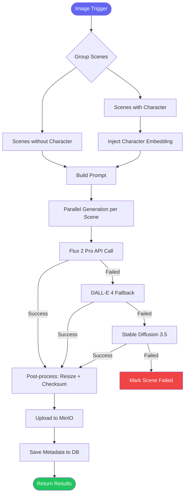

**Communication Pattern:** Request/Response

**Memory Strategy:**
- **Semantic Memory:** Character embeddings stored in pgvector for cross-session consistency
- **Episodic Memory:** Successful prompt patterns per style

**Context Window Management:** Prompts per scene avg 200 tokens, responses include full image URLs

**Retry Strategy:** Max 2 attempts (per provider), 3-provider fallback chain

**Fallback Behavior:** Flux → DALL-E 4 → Stable Diffusion 3.5. If all fail → return error for scene

**Queue Configuration:** `{ "queue": "image", "priority": 4, "concurrency": 6 }`

**Events Produced:** `agent.image.completed`, `agent.image.progress` (per batch of scenes), `agent.image.failed`

**Events Consumed:** `agent.image.start`, `agent.image.retry`

**Error Scenarios:**
| Error | Cause | Action |
|---|---|---|
| IMAGE_GENERATION_FAILED | All providers fail | Flag scene, use fallback placeholder |
| CONTENT_POLICY_VIOLATION | NSFW/dangerous content | Return violation details, reject prompt |
| TIMEOUT | Image gen >120s | Retry with shorter prompt |
| STYLE_MISMATCH | Output doesn't match brand style | Retry with stronger style conditioning |

**Performance Budget:** Max latency 120s per batch (4 images), Max output (image files up to 10MB each)

---

### 9.9 Voice Agent

| Field | Value |
|---|---|
| **Role** | TTS Generation, Emotion, Pacing, Voice Selection |
| **Responsibility** | Convert script narration to speech using ElevenLabs (primary) or OpenAI TTS (fallback). Apply emotion and pacing per scene. Generate word-level timestamps for subtitle sync. Support 50+ voices across 8 languages. |
| **Trigger** | `agent.voice.start` dari Master Agent |
| **Model** | ElevenLabs (primary), OpenAI TTS (secondary), Google Cloud TTS (tertiary) |

**Input Schema:**
```json
{
  "scenes": [{
    "scene_number": "number",
    "narration": "string",
    "voice_direction": { "tone": "string", "emotion": "string", "speed": "slow|normal|fast", "pitch_shift": "number (-5 to +5 semitones)" }
  }],
  "voice_id": "string",
  "language": "string",
  "ssml_enabled": "boolean (default: true)",
  "model": "eleven_monolingual_v2|eleven_multilingual_v2|tts-1-hd"
}
```

**Output Schema:**
```json
{
  "voiceover_id": "uuid",
  "scenes": [{
    "scene_number": "number",
    "audio_url": "string (presigned MinIO URL)",
    "duration_sec": "number",
    "format": "mp3|wav",
    "sample_rate": "number (44100|48000)",
    "word_timestamps": [{ "word": "string", "start_sec": "number", "end_sec": "number" }],
    "ssml_applied": "string?"
  }],
  "total_duration_sec": "number",
  "cost_usd": "number"
}
```

**Workflow:**
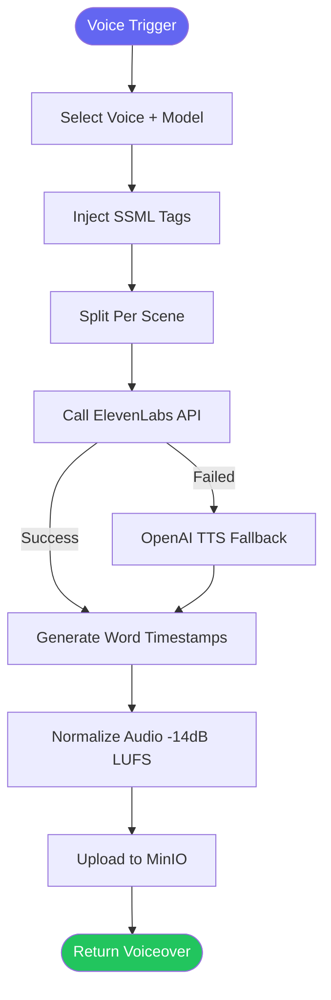

**Communication Pattern:** Request/Response

**Memory Strategy:** Working memory — voice config per project; Episodic memory — preferred voice per user

**Context Window Management:** Script per scene max 2K characters per API call

**Retry Strategy:** Max 3 attempts, exponential backoff (2s, 4s, 8s)

**Fallback Behavior:** ElevenLabs → OpenAI TTS → Google Cloud TTS

**Queue Configuration:** `{ "queue": "voice", "priority": 4, "concurrency": 8 }`

**Events Produced:** `agent.voice.completed`, `agent.voice.progress`, `agent.voice.failed`

**Events Consumed:** `agent.voice.start`

**Performance Budget:** Max latency 120s, Max characters per request 5,000 (auto-split)

---

### 9.10 Subtitle Agent

| Field | Value |
|---|---|
| **Role** | Speech-to-Text, Timing, Styling, Translation |
| **Responsibility** | Generate subtitles from voiceover audio using Deepgram (primary) or Whisper API (fallback). Produce SRT/VTT/ASS formats. Support multi-language translation. Style editor: font, color, size, position, background. Sinkronisasi timing dengan word timestamps. |
| **Trigger** | `agent.subtitle.start` dari Master Agent |
| **Model** | Deepgram Nova-2 (primary), OpenAI Whisper (fallback), GPT-5o (translation) |

**Input Schema:**
```json
{
  "audio_url": "string",
  "script_text": "string (reference for accuracy)",
  "language": "string",
  "target_languages": "string[]? (for translation)",
  "formats": "srt|vtt|ass[]",
  "style": { "font_family": "string", "font_size": "number", "font_color": "string", "background_color": "string", "background_opacity": "number (0-1)", "position": "bottom|top|middle", "max_width_pct": "number (50-100)" },
  "burn_in": "boolean (default: false)"
}
```

**Output Schema:**
```json
{
  "subtitle_id": "uuid",
  "source_language": "string",
  "formats": { "srt_url": "string?", "vtt_url": "string?", "ass_url": "string?" },
  "translated_languages": [{ "language": "string", "formats": { "srt_url": "string?" } }],
  "cues": [{ "index": "number", "start_sec": "number", "end_sec": "number", "text": "string" }],
  "confidence": "number (0-100)",
  "sync_quality_ms": "number (average offset)",
  "metadata": { "total_cues": "number", "duration_sec": "number", "word_count": "number" }
}
```

**Workflow:**
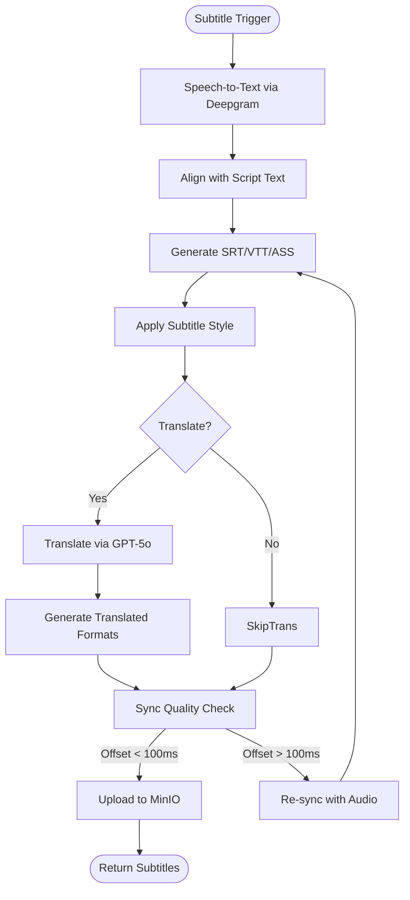

**Communication Pattern:** Request/Response

**Memory Strategy:** Working memory — current subtitle cues

**Context Window Management:** Audio file up to 30 min, cue count up to 500

**Retry Strategy:** Max 2 attempts, exponential backoff (1s, 2s)

**Fallback Behavior:** Deepgram → Whisper API. If both fail → generate subtitles from script text with estimated timing (no sync)

**Queue Configuration:** `{ "queue": "subtitle", "priority": 3, "concurrency": 10 }`

**Events Produced:** `agent.subtitle.completed`, `agent.subtitle.failed`

**Events Consumed:** `agent.subtitle.start`

**Performance Budget:** Max latency 60s, Max audio duration 30 min

---

### 9.11 Animation Agent

| Field | Value |
|---|---|
| **Role** | Transitions, Motion Effects, Keyframe Animation |
| **Responsibility** | Apply animations to static scene images: Ken Burns effect (pan/zoom), scene transitions (fade, crossfade, slide, zoom, wipe), overlay animations (text typing, logo reveal), motion graphics templates. Target output adalah animated video clips per scene using FFmpeg + custom animation engine. |
| **Trigger** | `agent.animation.start` dari Master Agent |
| **Engine** | FFmpeg (filter graph) + Remotion (optional, for complex animations) |

**Input Schema:**
```json
{
  "scenes": [{
    "scene_number": "number",
    "image_url": "string",
    "animation_config": { "pan_direction": "left|right|up|down|none", "pan_speed": "slow|normal|fast", "zoom_start": "number (1.0-2.0)", "zoom_end": "number (1.0-2.0)" },
    "overlays": [{ "type": "text|image", "content": "string|url", "position": "top-left|top-right|bottom-left|bottom-right|center", "animation": "fade|slide|typewriter|bounce", "timing": "{ start_sec, end_sec }" }],
    "transition_in": { "type": "fade|crossfade|slide|zoom|wipe|cut", "duration_sec": "number" },
    "duration_sec": "number"
  }],
  "resolution": "1920x1080|1280x720",
  "fps": "24|30|60",
  "codec": "h264_nvenc|hevc_nvenc|libx264"
}
```

**Output Schema:**
```json
{
  "batch_id": "uuid",
  "clips": [{
    "scene_number": "number",
    "video_url": "string (presigned MinIO URL)",
    "duration_sec": "number",
    "file_size_bytes": "number",
    "checksum_sha256": "string",
    "render_time_ms": "number",
    "render_command": "string"
  }],
  "total_duration_sec": "number",
  "metadata": { "total_frames": "number", "render_pipeline": "string" }
}
```

**Workflow:**
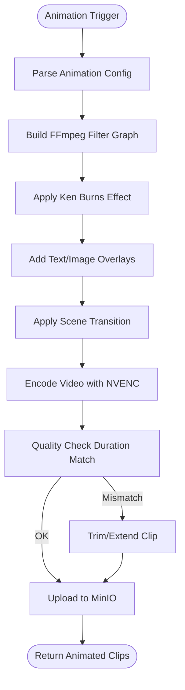

**Communication Pattern:** Request/Response

**Memory Strategy:** Working memory — clip rendering state

**Context Window Management:** Not LLM-based — config-driven rendering

**Retry Strategy:** Max 2 attempts per clip

**Fallback Behavior:** Static image with simple crossfade transition (bypass complex animations)

**Queue Configuration:** `{ "queue": "animation", "priority": 3, "concurrency": 4 }`

**Events Produced:** `agent.animation.completed`, `agent.animation.progress`, `agent.animation.failed`

**Events Consumed:** `agent.animation.start`

**Error Scenarios:**
| Error | Cause | Action |
|---|---|---|
| ANIMATION_FAILED | FFmpeg error | Retry with simpler filter graph |
| GPU_OOM | Out of memory on GPU | Split scene into segments |
| DURATION_MISMATCH | Clip != target duration | Trim/extend with speed adjustment |

**Performance Budget:** Max latency 180s per clip, Max clip duration 60s

---

### 9.12 Composer Agent

| Field | Value |
|---|---|
| **Role** | Video Assembly, Timeline Composition |
| **Responsibility** | Assemble all assets into final video: animated clips, voiceover, music, sound effects, subtitles. Apply audio mixing (−14dB LUFS target), layer synchronization, intro/outro insertion, and brand watermark overlay. Output is a composed video ready for final rendering. |
| **Trigger** | `agent.composer.start` dari Master Agent |
| **Engine** | FFmpeg complex filter graph |

**Input Schema:**
```json
{
  "clips": [{ "scene_number": "number", "url": "string", "duration_sec": "number", "start_timestamp_sec": "number" }],
  "voiceover": { "url": "string", "duration_sec": "number" },
  "music": { "url": "string", "duration_sec": "number", "volume": "number (0-1)", "loop": "boolean" },
  "sound_effects": [{ "url": "string", "trigger_timestamp_sec": "number", "volume": "number (0-1)" }],
  "subtitles": { "url": "string", "format": "srt|vtt|ass", "burn_in": "boolean" },
  "brand": { "watermark_url": "string?", "watermark_position": "top-right|bottom-right|bottom-left", "intro_url": "string?", "outro_url": "string?" },
  "config": { "target_loudness": "number (default: -14 LUFS)", "resolution": "string", "fps": "number", "codec": "string" }
}
```

**Output Schema:**
```json
{
  "composition_id": "uuid",
  "composed_url": "string (presigned MinIO URL, intermediate format)",
  "duration_sec": "number",
  "file_size_bytes": "number",
  "checksum_sha256": "string",
  "layers_summary": { "video_tracks": "number", "audio_tracks": "number", "subtitle_tracks": "number", "overlay_tracks": "number" },
  "render_ready": "boolean",
  "metadata": { "complex_filter": "string", "render_time_ms": "number" }
}
```

**Workflow:**
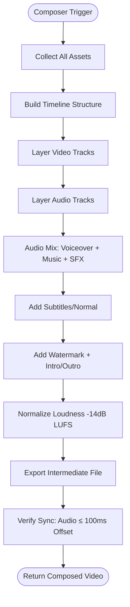

**Communication Pattern:** Request/Response

**Memory Strategy:** Working memory — composition state

**Context Window Management:** Not LLM-based — file-based processing

**Retry Strategy:** Max 2 attempts, backoff 5s

**Fallback Behavior:** Basic composition: stack all layers without complex mixing

**Queue Configuration:** `{ "queue": "composition", "priority": 3, "concurrency": 4 }`

**Events Produced:** `agent.composition.completed`, `agent.composition.progress`, `agent.composition.failed`

**Events Consumed:** `agent.composition.start`

**Performance Budget:** Max latency 300s, Max composed duration 1 hour

---

### 9.13 Thumbnail Agent

| Field | Value |
|---|---|
| **Role** | Thumbnail Generation with Text Overlay, A/B Variants |
| **Responsibility** | Generate 3+ YouTube thumbnail variations optimized for CTR. Uses key video frame or generated image as base. Applies: text overlay (title subtitle), high contrast filters, face close-up detection, brand colors/fonts, composition best practices. Output 1280x720 JPG/PNG. |
| **Trigger** | `agent.thumbnail.start` dari Master Agent |
| **Model** | GPT Image (primary) + ImageMagick (overlay composition) |

**Input Schema:**
```json
{
  "video_keyframe_url": "string?",
  "scene_images": "string[]",
  "title": "string (max 100 chars)",
  "hook": "string (max 50 chars)",
  "style": "standard|cinematic|minimalist|bold|reaction",
  "brand_kit": { "colors": "string[]", "fonts": "string[]", "logo_url": "string?" },
  "num_variations": "number (default: 3)",
  "include_face": "boolean (default: true if face detected)"
}
```

**Output Schema:**
```json
{
  "thumbnail_id": "uuid",
  "variations": [{
    "index": "number",
    "url": "string (presigned MinIO URL)",
    "style": "string",
    "width": "number (1280)",
    "height": "number (720)",
    "file_size_bytes": "number",
    "text_config": { "title_text": "string", "hook_text": "string?", "font": "string", "position": "string" },
    "predicted_ctr_boost": "number (estimated % improvement)"
  }],
  "selected_variant": "number?",
  "metadata": { "generation_time_ms": "number" }
}
```

**Workflow:**
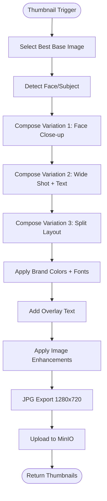

**Communication Pattern:** Request/Response

**Memory Strategy:** Episodic memory — track CTR performance of past thumbnail styles

**Context Window Management:** Not LLM-based — image processing pipeline

**Retry Strategy:** Max 2 attempts

**Fallback Behavior:** Auto-crop from video frame with simple text overlay

**Queue Configuration:** `{ "queue": "thumbnail", "priority": 4, "concurrency": 8 }`

**Events Produced:** `agent.thumbnail.completed`, `agent.thumbnail.failed`

**Events Consumed:** `agent.thumbnail.start`

**Performance Budget:** Max latency 30s, Max output 3 images

---

### 9.14 SEO Agent

| Field | Value |
|---|---|
| **Role** | Title, Description, Tags, Chapters, Cards, End Screens |
| **Responsibility** | Generate YouTube SEO metadata: 5 title variants, full description with timestamps/chapters, 15-30 tags (high/medium/low volume), suggested hashtags, transcript optimization keyword analysis, card/end screen placement suggestions. |
| **Trigger** | `agent.seo.start` dari Master Agent |
| **Model** | GPT-5o |

**Input Schema:**
```json
{
  "script": "string",
  "target_keywords": "string[]",
  "language": "string",
  "category": "string (YouTube category ID)",
  "target_audience": "string",
  "competitor_titles": "string[]?",
  "channel_context": { "channel_description": "string?", "total_videos": "number?", "avg_views": "number?" }
}
```

**Output Schema:**
```json
{
  "seo_id": "uuid",
  "titles": [{ "title": "string", "length": "number", "predicted_ctr": "number (0-100)", "keyword_density": "number" }],
  "description": { "full_text": "string", "chapters": [{ "timestamp": "string (MM:SS)", "title": "string" }], "hashtags": "string[]", "links_section": "string?" },
  "tags": [{ "tag": "string", "volume": "high|medium|low", "relevance": "number (0-100)" }],
  "metadata": { "keyword_gap_analysis": "string", "competitor_insight": "string", "optimization_score": "number (0-100)" }
}
```

**Workflow:**
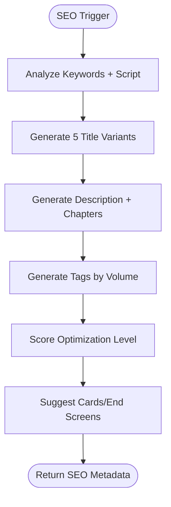

**Communication Pattern:** Request/Response

**Memory Strategy:** Episodic memory — learn which title patterns get most clicks for user

**Context Window Management:** Input script max 8K tokens, output max 4K tokens

**Retry Strategy:** Max 2 attempts, exponential backoff (1s, 2s)

**Fallback Behavior:** Use title from project metadata, generate basic description from script

**Queue Configuration:** `{ "queue": "seo", "priority": 5, "concurrency": 10 }`

**Events Produced:** `agent.seo.completed`, `agent.seo.failed`

**Events Consumed:** `agent.seo.start`

**Performance Budget:** Max latency 30s, Max output tokens 4,000

---

### 9.15 Publishing Agent

| Field | Value |
|---|---|
| **Role** | YouTube Upload, Scheduling, Playlist Management |
| **Responsibility** | Handle YouTube upload via Data API v3: OAuth 2.0 authentication, chunked upload with resume, set video metadata (title, description, tags, category), visibility control (public/unlisted/private), scheduling for future publish, playlist assignment, thumbnail upload. |
| **Trigger** | `agent.publish.start` dari Master Agent |
| **API** | YouTube Data API v3 |

**Input Schema:**
```json
{
  "video_url": "string (downloadable URL or local path)",
  "thumbnail_url": "string?",
  "seo_metadata": { "title": "string", "description": "string", "tags": "string[]", "category_id": "string", "language": "string" },
  "publish_config": { "visibility": "public|unlisted|private", "schedule_datetime": "string (ISO 8601)?", "playlist_ids": "string[]?", "made_for_kids": "boolean", "notify_subscribers": "boolean (default: true)" },
  "youtube_account": { "access_token": "string", "refresh_token": "string", "channel_id": "string" }
}
```

**Output Schema:**
```json
{
  "publish_id": "uuid",
  "youtube_video_id": "string",
  "youtube_url": "string",
  "status": "published|scheduled|uploaded",
  "scheduled_time": "string?",
  "playlist_ids_added": "string[]",
  "upload_details": { "total_bytes": "number", "upload_duration_ms": "number", "chunks_uploaded": "number", "retry_count": "number" }
}
```

**Workflow:**
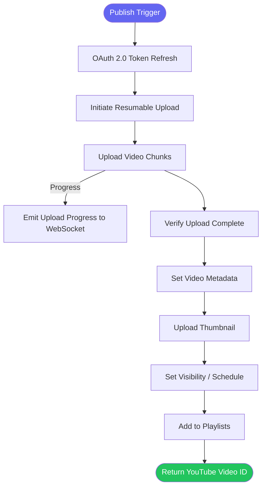

**Communication Pattern:** Request/Response with progress events

**Memory Strategy:** Episodic memory — track upload success rates per YouTube account

**Context Window Management:** Not LLM-based — file upload pipeline

**Retry Strategy:** Max 3 attempts with chunked upload resume (each chunk retried individually)

**Fallback Behavior:** If upload fails → mark as "ready for manual upload" with download link

**Queue Configuration:** `{ "queue": "publish", "priority": 2, "concurrency": 3 }`

**Events Produced:** `agent.publish.completed`, `agent.publish.progress`, `agent.publish.failed`

**Events Consumed:** `agent.publish.start`

**Error Scenarios:**
| Error | Cause | Action |
|---|---|---|
| YOUTUBE_UPLOAD_FAILED | API error | Retry chunk upload from last checkpoint |
| YOUTUBE_QUOTA_EXCEEDED | Daily quota limit | Defer upload to next quota window |
| AUTH_EXPIRED | OAuth token expired | Refresh token and retry |
| YOUTUBE_VIDEO_BLOCKED | Copyright/ToS violation | Notify user, mark failed |

**Performance Budget:** Max latency 600s, Max video size 10GB

---

### 9.16 Analytics Agent

| Field | Value |
|---|---|
| **Role** | Performance Tracking, Audience Insights, Recommendations |
| **Responsibility** | Fetch YouTube Analytics for published videos: views, watch time, retention, CTR, demographics, revenue (if monetized). Store snapshots in PostgreSQL (time-series). Generate insight reports: top-performing content, audience growth, best posting times. Provide recommendations for future content. |
| **Trigger** | `agent.analytics.start` dari Master Agent (after publish) + `cron.daily` + `cron.weekly` |
| **API** | YouTube Analytics API |

**Input Schema:**
```json
{
  "youtube_video_id": "string",
  "channel_id": "string",
  "fetch_type": "initial|daily|weekly",
  "date_range": { "start": "string", "end": "string" }
}
```

**Output Schema:**
```json
{
  "analytics_id": "uuid",
  "snapshot_timestamp": "string",
  "video_performance": {
    "views": "number",
    "watch_time_minutes": "number",
    "average_view_duration_pct": "number",
    "ctr": "number",
    "impressions": "number",
    "likes": "number",
    "dislikes": "number",
    "comments": "number",
    "shares": "number",
    "subscribers_gained": "number",
    "subscribers_lost": "number"
  },
  "demographics": { "age_groups": "Record<string, number>", "genders": "Record<string, number>", "countries": "Record<string, number>" },
  "retention": { "absolute_retention": "number[] (per second)", "relative_retention": "number[] (per second)" },
  "revenue": { "estimated_revenue_usd": "number?", "ad_impressions": "number?", "cpm": "number?" },
  "insights": { "recommendations": "string[]", "trends": "string", "comparison_to_previous": "string" }
}
```

**Workflow:**
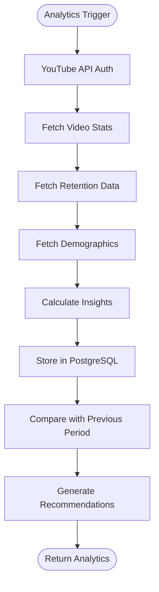

**Communication Pattern:** Request/Response + Cron-triggered

**Memory Strategy:**
- **Long-term Memory:** Analytics snapshots stored in PostgreSQL (time-series)
- **Semantic Memory:** Pattern recognition for content performance trends

**Context Window Management:** Not LLM-based — data processing pipeline

**Retry Strategy:** Max 3 attempts with YouTube quota-aware backoff (exponential: 30s, 60s, 120s)

**Fallback Behavior:** Schedule analytics fetch for next cron window if API quota exceeded

**Queue Configuration:** `{ "queue": "analytics", "priority": 1, "concurrency": 5 }`

**Events Produced:** `agent.analytics.completed`, `agent.analytics.failed`, `agent.analytics.insight_ready`

**Events Consumed:** `agent.analytics.start`

**Performance Budget:** Max latency 30s, Max API quota cost 10 units per fetch

---

### 9.17 Memory Agent

| Field | Value |
|---|---|
| **Role** | Cross-Session Context Retention, User Preference Learning |
| **Responsibility** | Store dan retrieve inter-session context: user preferences (voice, style, brand), past project patterns, agent performance metrics, learning data. Bukan agent LLM — service layer yang menyediakan memory API untuk agent lain. |
| **Trigger** | `memory.store` / `memory.retrieve` / `memory.search` events |
| **Storage** | PostgreSQL (structured preferences) + pgvector (embeddings) + Redis (volatile context) |

**Input Schema:**
```json
// Store
{ "type": "store", "namespace": "user_preferences|project_patterns|agent_metrics|episodic", "key": "string", "value": "any", "ttl_seconds": "number?", "embedding": "number[]?" }

// Retrieve
{ "type": "retrieve", "namespace": "string", "key": "string" }

// Search
{ "type": "search", "namespace": "string", "query": "string", "embedding": "number[]?", "limit": "number", "threshold": "number (0-1)" }
```

**Output Schema:**
```json
// Store Result
{ "stored": "boolean", "key": "string", "ttl_seconds": "number?" }

// Retrieve Result
{ "found": "boolean", "value": "any", "metadata": { "created_at": "string", "access_count": "number" } }

// Search Result
{ "results": [{ "key": "string", "value": "any", "score": "number (0-1)", "metadata": "object" }] }
```

**Communication Pattern:** Request/Response (synchronous API call from other agents)

**Memory Strategy:** Memory Agent IS the memory system — implements all 5 tiers

**Context Window Management:** Vector index size target: <10M embeddings per namespace

**Retry Strategy:** Max 3 attempts, exponential backoff (10ms, 50ms, 200ms)

**Fallback Behavior:** Cache miss → return null (caller handles with default)

**Queue Configuration:** `{ "queue": "memory", "priority": 5, "concurrency": 20 }` (high concurrency, low latency)

**Events Produced:** `memory.stored`, `memory.retrieved`, `memory.cache_miss`

**Events Consumed:** `memory.store`, `memory.retrieve`, `memory.search`, `memory.delete`

**Error Scenarios:**
| Error | Cause | Action |
|---|---|---|
| MEMORY_STORE_FAILED | DB write error | Retry → fallback to Redis |
| MEMORY_RETRIEVAL_FAILED | DB read error | Return cached (Redis) → null |
| EMBEDDING_MISMATCH | Vector dimension mismatch | Re-embed with correct model |
| INDEX_CORRUPTION | pgvector index error | Rebuild index asynchronously |

**Performance Budget:** Max latency 50ms (p99), Max storage 10M vectors per namespace

---

### 9.18 Context Agent

| Field | Value |
|---|---|
| **Role** | Conversation State, Prompt Enrichment, Context Window Management |
| **Responsibility** | Maintain conversation thread across agent interactions. Manage token budgets per context window. Inject relevant history into agent prompts. Summarize context when approaching token limits. Provide enriched prompts with situational awareness. |
| **Trigger** | `context.enrich` event dari Master Agent sebelum delegasi |
| **Storage** | Redis (TTL-based volatile context) + PostgreSQL (persistent conversation log) |

**Input Schema:**
```json
{
  "target_agent": "string",
  "base_prompt": "object (agent input schema)",
  "session_id": "string",
  "project_id": "string",
  "conversation_history": "Message[]? (last N messages)",
  "token_budget": { "max_input_tokens": "number", "max_output_tokens": "number" }
}
```

**Output Schema:**
```json
{
  "enriched_prompt": "object (base_prompt + injected context)",
  "context_summary": {
    "tokens_used": "number",
    "tokens_remaining": "number",
    "history_messages_included": "number",
    "memory_items_injected": "number",
    "was_summarized": "boolean"
  },
  "suggested_focus": "string[] (key areas for agent to prioritize)"
}
```

**Workflow:**
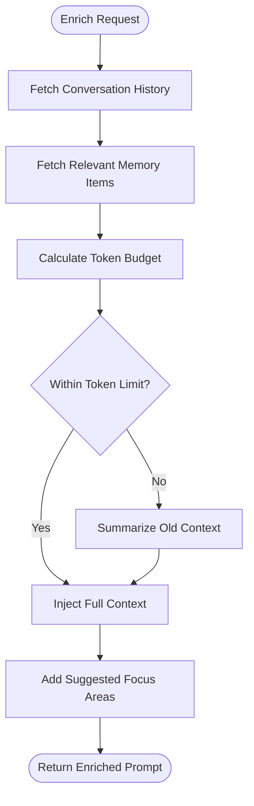

**Communication Pattern:** Request/Response (called by Master Agent before each delegation)

**Memory Strategy:**
- **Short-term Memory:** Conversation history in Redis (TTL: 24h)
- **Long-term Memory:** Persistent conversation log in PostgreSQL
- **Working Memory:** Current enrichment state

**Context Window Management:** This agent IS the context window manager. Budget: 128K tokens max per enrichment

**Retry Strategy:** Max 2 attempts, immediate retry

**Fallback Behavior:** If context fetch fails → return base prompt without enrichment

**Queue Configuration:** `{ "queue": "context", "priority": 5, "concurrency": 20 }`

**Events Produced:** `context.enriched`, `context.summarized`

**Events Consumed:** `context.enrich`, `context.clear` (reset session)

**Performance Budget:** Max latency 100ms, Max context window 128K tokens

---

### 9.19 Quality Assurance Agent

| Field | Value |
|---|---|
| **Role** | Output Quality Checks, Consistency Validation |
| **Responsibility** | Validate output quality at each pipeline stage. Checks: audio sync (≤100ms offset), resolution match (≥720p), duration match (±5% target), visual consistency (no jarring style changes), brand compliance (colors, fonts, watermark), content safety (secondary moderation), and coherence (script → storyboard → visuals alignment). |
| **Trigger** | `quality_gate.check` event — called after each agent completes |
| **Model** | GPT-5o (qualitative checks) + deterministic rules (quantitative checks) |

**Input Schema:**
```json
{
  "stage": "string (research|script|storyboard|image|voice|subtitle|animation|composition|final)",
  "stage_output": "object (the agent output to validate)",
  "expected_spec": { "duration_sec": "number?", "resolution": "string?", "language": "string?" },
  "brand_kit": "object?",
  "previous_stage_outputs": "object[]?"
}
```

**Output Schema:**
```json
{
  "check_id": "uuid",
  "stage": "string",
  "passed": "boolean",
  "score": "number (0-100)",
  "checks": [{
    "check_name": "string",
    "status": "pass|warn|fail",
    "score": "number (0-100)",
    "details": "string",
    "severity": "critical|major|minor"
  }],
  "failed_checks": "string[]",
  "recommendation": "proceed|retry|halt",
  "retry_feedback": "string? (if retry recommended, what to change)"
}
```

**Workflow:**
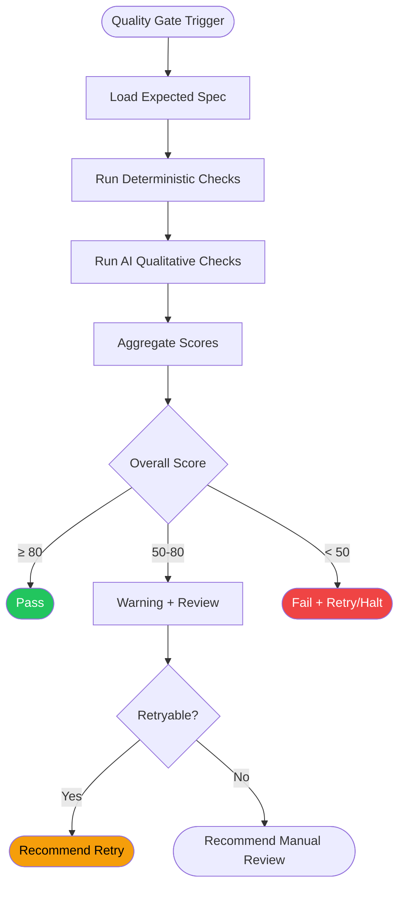

**Communication Pattern:** Request/Response (called by Master Agent)

**Memory Strategy:** 
- **Episodic Memory:** Track common failure patterns per agent
- **Semantic Memory:** Quality rules stored in DB

**Context Window Management:** Input max 8K tokens (summary of stage outputs)

**Retry Strategy:** N/A (retry is called by Master Agent based on QA recommendation)

**Fallback Behavior:** If QA check fails entirely → default to "pass with warning" to avoid blocking pipeline

**Queue Configuration:** `{ "queue": "quality-assurance", "priority": 5, "concurrency": 10 }`

**Events Produced:** `quality_gate.passed`, `quality_gate.failed`, `quality_gate.warning`

**Events Consumed:** `quality_gate.check`

**Error Scenarios:**
| Error | Action |
|---|---|
| CHECK_TIMEOUT | Pass with warning (don't block pipeline) |
| AI_EVALUATOR_FAILED | Use deterministic checks only |
| INSUFFICIENT_DATA | Skip checks that need more context |

**Performance Budget:** Max latency 15s (deterministic) / 30s (with AI evaluation)

---

### 9.20 Moderator Agent

| Field | Value |
|---|---|
| **Role** | Content Moderation, Policy Compliance, Safety Filters |
| **Responsibility** | Detect harmful/policy-violating content at pipeline entry (prompt) and exit (final video). Check: hate speech, harassment, violence, adult content, copyright infringement, trademark misuse, misinformation, YouTube ToS violations, UU PDP compliance (Indonesia personal data). |
| **Trigger** | `moderation.check` event — at pipeline start + before publish |
| **Model** | GPT-5o (semantic analysis) + custom ML classifier (image/video) + content hashing (copyright) |

**Input Schema:**
```json
{
  "check_type": "prompt|script|image|thumbnail|final_video",
  "content": { "text": "string?", "image_urls": "string[]?", "video_url": "string?" },
  "check_categories": "hate_speech|harassment|violence|adult|copyright|misinformation|trademark|personal_data|youtube_tos|uupdp",
  "user_context": { "user_id": "uuid", "user_role": "string", "previous_violations": "number" }
}
```

**Output Schema:**
```json
{
  "moderation_id": "uuid",
  "verdict": "pass|flag|reject",
  "scores": { "hate_speech": "number 0-1", "harassment": "number 0-1", "violence": "number 0-1", "adult": "number 0-1", "copyright": "number 0-1", "misinformation": "number 0-1", "trademark": "number 0-1", "personal_data": "number 0-1", "youtube_tos": "number 0-1", "uupdp": "number 0-1" },
  "flags": [{ "category": "string", "severity": "low|medium|high|critical", "details": "string", "snippet": "string (relevant content excerpt)", "action": "auto_reject|manual_review|warning" }],
  "action": "allow|manual_review|reject",
  "explanation": "string (for user-facing message)"
}
```

**Workflow:**
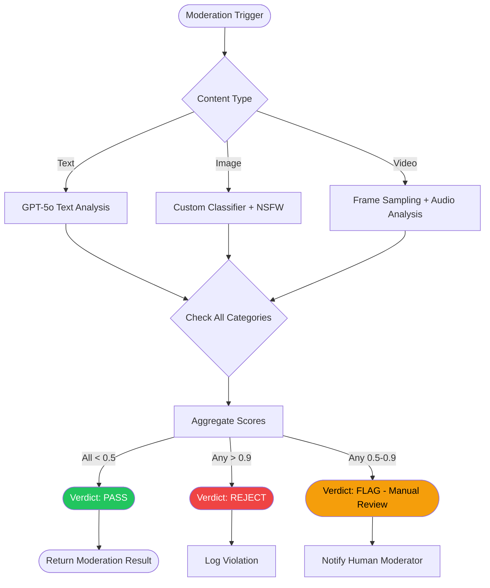

**Communication Pattern:** Request/Response

**Memory Strategy:**
- **Semantic Memory:** Known violation patterns, blocked content hashes
- **Episodic Memory:** User violation history and patterns

**Context Window Management:** Text input max 8K tokens, image max 5 per check

**Retry Strategy:** Max 2 attempts

**Fallback Behavior:** If moderation service fails → default to "flag for manual review" (never auto-pass when uncertain)

**Queue Configuration:** `{ "queue": "moderator", "priority": 5, "concurrency": 5 }`

**Events Produced:** `moderation.passed`, `moderation.flagged`, `moderation.rejected`

**Events Consumed:** `moderation.check`

**Error Scenarios:**
| Error | Action |
|---|---|
| MODERATION_TIMEOUT | Flag for manual review |
| CLASSIFIER_UNAVAILABLE | Skip that category, flag unknown |
| IMAGE_ANALYSIS_FAILED | Use text-based metadata check only |

**Performance Budget:** Max latency 10s (text) / 30s (image/video), Max content size 50MB (video)

---

### 9.21 Monitoring Agent

| Field | Value |
|---|---|
| **Role** | System Health, Agent Performance, Alerting |
| **Responsibility** | Track pipeline metrics: agent latency (p50/p95/p99), success/failure rates, queue depths, error rates, credit usage, cost per pipeline, AI provider health. Export to Prometheus/Grafana. Trigger alerts via Slack/PagerDuty. Not a traditional LLM agent — it's a monitoring service with ML-based anomaly detection. |
| **Trigger** | Continuous (metric collection) + `monitoring.alert` event |
| **Engine** | Prometheus client + custom metric aggregation |

**Input Schema:**
```json
// Metric Event
{ "type": "metric", "name": "string", "value": "number", "tags": { "agent": "string", "pipeline_id": "string", "provider": "string", "status": "string" } }

// Alert Event
{ "type": "alert", "rule_name": "string", "severity": "warning|critical", "current_value": "number", "threshold": "number", "duration": "string", "context": "object" }
```

**Output Schema:**
```json
// Health Check Response
{ "status": "healthy|degraded|down", "agents_healthy": "number", "agents_degraded": "number", "agents_down": "number", "queue_depth_total": "number", "active_pipelines": "number", "error_rate_5min": "number" }

// Alert Response
{ "alert_acknowledged": "boolean", "actions_taken": "string[]", "escalation_level": "number" }
```

**Workflow:**
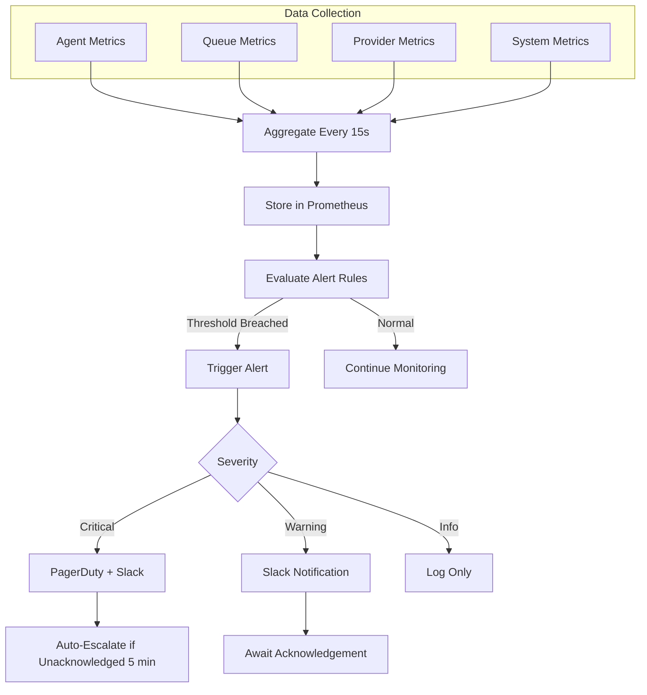

**Communication Pattern:** Pub/Sub (metric ingestion) + Request/Response (health checks)

**Memory Strategy:**
- **Semantic Memory:** Historical metric baselines for anomaly detection
- **Episodic Memory:** Past incident patterns and resolution

**Context Window Management:** Metrics retention 90 days in Prometheus, 1 year in long-term storage

**Retry Strategy:** Max 3 attempts for metric export

**Fallback Behavior:** If Prometheus is down, buffer metrics in local memory (max 10K events), flush when recovered

**Queue Configuration:** `{ "priority": 1, "concurrency": 1 }` (dedicated low-priority collector)

**Events Produced:** `monitoring.alert`, `monitoring.metric`, `monitoring.health_change`

**Events Consumed:** All agent events (passive listener)

**Alerting Rules:**
| Rule | Threshold | Severity |
|---|---|---|
| Pipeline success rate | <95% in 5min | Warning |
| Pipeline success rate | <90% in 5min | Critical |
| Agent latency p99 | >3x baseline in 5min | Warning |
| Queue depth | >100 for 2min | Warning |
| Queue depth (render) | >10 | Critical |
| DLQ count | >10 in 1h | Critical |
| AI provider error rate | >10% in 5min | Critical |
| Credit consumption spike | >200% of projection | Warning |

**Performance Budget:** Metric collection interval 15s, Alert evaluation latency <1s

---

## 10. Cross-Agent Communication

### 10.1 Agent-to-Agent Message Protocol

Setiap komunikasi antar-agent menggunakan protokol standar berbasis JSON:

```json
{
  "message_id": "uuid",
  "message_type": "request|response|event|command",
  "protocol_version": "1.0",
  "source_agent": "string",
  "target_agent": "string|broadcast",
  "correlation_id": "string (trace ID untuk pipeline)",
  "timestamp": "string (ISO 8601)",
  "payload": "object",
  "metadata": {
    "pipeline_id": "string",
    "project_id": "string",
    "user_id": "string",
    "retry_count": "number",
    "ttl_seconds": "number",
    "priority": "number (1-5)"
  }
}
```

### 10.2 Event Bus Design

```mermaid
flowchart TD
    subgraph "Event Bus (Redis Pub/Sub + BullMQ)"
        EB[Event Router]
    end
    
    Master -- publish --> EB
    Research -- publish --> EB
    FactCheck -- publish --> EB
    Script -- publish --> EB
    QA -- publish --> EB
    Moderation -- publish --> EB
    
    EB -- subscribe --> WebSocket[WebSocket Hub → User]
    EB -- subscribe --> Analytics[Analytics Agent]
    EB -- subscribe --> Monitor[Monitoring Agent]
    EB -- subscribe --> Memory[Memory Agent]
```

### 10.3 Synchronous vs Asynchronous Patterns

| Pattern | Use Case | Example |
|---|---|---|
| **Synchronous (Temporal Activity)** | Agent-to-agent delegation where result is needed immediately | Master → Research Agent |
| **Asynchronous (Pub/Sub)** | Cross-cutting concerns, non-blocking notifications | Analytics tracking, Monitoring metrics |
| **Request/Response (Redis)** | Low-latency queries for context/memory | Agent → Memory Agent → Context Agent |
| **Event (BullMQ Job)** | State transitions, pipeline advancement | Master emits `pipeline.progress` |

### 10.4 Dead Letter Queue Handling

```mermaid
flowchart TD
    Job[Agent Job] --> Retry{Retries Exhausted}
    Retry -->|No| Attempt[Execute with Backoff]
    Attempt -->|Fail| Retry
    Retry -->|Yes| DLQ[Dead Letter Queue]
    
    DLQ --> Alert[Alert: Monitoring Agent]
    Alert --> Review[Admin Review]
    Review --> Action{Decision}
    Action -->|Requeue| Original[Original Queue]
    Action -->|Skip| Skip[Marks as Skipped]
    Action -->|Abort| Fail[Marks Pipeline Failed]
    
    DLQ --> RetryDLQ[Auto-Retry DLQ Jobs Every 1 Hour]
    RetryDLQ -->|Max 3| Purge[Purge if Still Failing]
    
    style DLQ fill:#ef4444,color:#fff
    style Alert fill:#f59e0b,color:#000
```

**DLQ Configuration:**
- **Storage:** Redis (BullMQ DLQ) + PostgreSQL (persistent archive)
- **Retention:** 7 days in Redis, 30 days in PostgreSQL
- **Max DLQ Entries:** 1,000 (oldest auto-purged)
- **Alert Threshold:** >10 entries in 1 hour → Critical alert

### 10.5 Circuit Breaker Configuration

| Parameter | Value |
|---|---|
| Failure Threshold | 5 consecutive failures |
| Open Duration | 30 seconds |
| Half-open Requests | 2 requests |
| Per | Provider (OpenAI, ElevenLabs, Flux, Deepgram, YouTube) |

```mermaid
flowchart LR
    Request[API Request] --> CB{Circuit Breaker}
    CB -->|Closed| Call[Call Provider API]
    Call -->|Success| Return[Return Result]
    Call -->|Fail 5x| Open[Open Circuit]
    Open -->|30s Wait| HalfOpen[Half-Open]
    HalfOpen -->|Attempt 2| Call
    HalfOpen -->|Success| Close[Close Circuit]
    HalfOpen -->|Fail Again| Open
    
    style Open fill:#ef4444,color:#fff
    style Close fill:#22c55e,color:#fff
```

---

## 11. Orchestration

### 11.1 Master Agent Orchestration Pattern

Master Agent menggunakan **Temporal Workflow** untuk orchestration. Setiap langkah pipeline adalah Temporal Activity dengan retry policy sendiri.

```mermaid
flowchart TD
    subgraph "Temporal Workflow: VideoPipeline"
        Init[Initialize Context] --> Research[Research Activity]
        Research --> FactCheck[Fact Check Activity]
        FactCheck --> Script[Script Activity]
        Script --> Storyboard[Storyboard Activity]
        Storyboard --> ScenePlan[Scene Plan Activity]
        ScenePlan --> ParallelGroup{Parallel}
        ParallelGroup --> CharDesign[Character Design]
        ParallelGroup --> Background[Background Gen]
        ParallelGroup --> ImageGen[Image Gen]
        CharDesign & Background & ImageGen --> Animation[Animation Activity]
        Animation --> Voice[Voice Activity]
        Voice --> Subtitle[Subtitle Activity]
        Subtitle --> Music[Music Activity]
        Music --> SFX[SFX Activity]
        SFX --> Compose[Composition Activity]
        Compose --> Render[Render Activity]
        Render --> Thumbnail[Thumbnail Activity]
        Thumbnail --> SEO[SEO Activity]
        SEO --> QualityGate[Quality Gate Activity]
        QualityGate -->|Pass| Publish[Publish Activity]
        QualityGate -->|Fail| Retry[Retry Logic]
        Publish --> Analytics[Analytics Activity]
        Analytics --> Complete[Pipeline Complete]
        Retry -->|Retryable| Compose
        Retry -->|Fatal| Fail[Pipeline Failed]
    end
```

### 11.2 Pipeline Execution Model

| Stage | Execution Mode | Agents | Quality Gate |
|---|---|---|---|
| Research | Sequential | Research → Fact Check | Fact Check confidence ≥80% |
| Content | Sequential | Script → Storyboard → Scene Plan | Script word count match, QA ≥70 |
| Visuals | Parallel | Character, Background, Image | Image quality check ≥75 |
| Animation | Sequential | Animation | Duration match ±5% |
| Audio | Sequential + Parallel | Voice → Subtitle → Music + SFX | Audio sync ≤100ms |
| Assembly | Sequential | Composer → Render | Sync + resolution check |
| Finishing | Sequential | Thumbnail → SEO | Brand compliance |
| Distribution | Sequential | Publish → Analytics | YouTube upload success |

### 11.3 Dynamic Agent Selection

Master Agent dapat memilih agent subset berdasarkan:
- **Video type**: Short-form (skip Storyboard, Scene Plan) vs Long-form (full pipeline)
- **User plan**: Free (skip Music, SFX, use defaults) vs Premium (full pipeline)
- **Content category**: Educational (prioritize Fact Check) vs Entertainment (prioritize Animation)
- **Pipeline retry**: Skip failed non-critical agent, use fallback

### 11.4 Quality Gates Between Stages

```mermaid
flowchart LR
    subgraph "Stage N-1"
        AgentA[Agent Output]
    end
    
    subgraph "Quality Gate"
        QG[QA Agent Check]
        QG -->|Pass ≥ 80| Next[Proceed to Next Stage]
        QG -->|Warn 50-80| Review[Human Review Queue]
        QG -->|Fail < 50| Action{Decision}
        Action -->|Retryable| Retry[Re-run Agent]
        Action -->|Non-retryable| Halt[Halt Pipeline]
    end
    
    subgraph "Stage N"
        AgentB[Next Agent]
    end
    
    Next --> AgentB
    Review --> AgentB
    Retry --> AgentA
```

---

## 12. Memory Architecture

### 12.1 Five-Tier Memory Model

```mermaid
flowchart TD
    subgraph "Working Memory"
        WM[Current Pipeline Context]
        WM -->|Volatile, TTL: pipeline duration| Redis
    end
    
    subgraph "Short-Term Memory"
        STM[Conversation History]
        STM -->|TTL: 24 hours| Redis
    end
    
    subgraph "Long-Term Memory"
        LTM[User Preferences + Project Data]
        LTM -->|Persistent| PostgreSQL
    end
    
    subgraph "Episodic Memory"
        EM[Past Video Patterns + Success Metrics]
        EM -->|Persistent + Vector Search| PostgreSQL + pgvector
    end
    
    subgraph "Semantic Memory"
        SM[Domain Knowledge + Fact Cache]
        SM -->|Persistent + Vector Search| PostgreSQL + pgvector
    end
    
    WM <--> STM
    STM <--> LTM
    LTM <--> EM
    LTM <--> SM
```

### 12.2 Memory Tier Details

| Tier | Storage | TTL | Access Pattern | Size Limit |
|---|---|---|---|---|
| **Working Memory** | Redis (in-memory) | Pipeline duration (~30 min) | Key-value, high speed | 100KB per pipeline |
| **Short-Term Memory** | Redis (in-memory) | 24 hours | Key-value, high speed | 1MB per session |
| **Long-Term Memory** | PostgreSQL (structured) | Indefinite | SQL query, indexed | 10GB per user |
| **Episodic Memory** | pgvector (embeddings) | Indefinite | Vector similarity search | 1M vectors per namespace |
| **Semantic Memory** | pgvector (embeddings) | Indefinite (with TTL for cache) | Vector similarity search | 5M vectors per namespace |

### 12.3 Memory Agent Data Flow

```mermaid
sequenceDiagram
    participant Agent as Any AI Agent
    participant Context as Context Agent
    participant Memory as Memory Agent
    participant Redis as Redis Cache
    participant PG as PostgreSQL
    participant VDB as pgvector
    
    Agent->>Context: context.enrich(prompt, session_id)
    Context->>Memory: memory.retrieve(session context)
    Memory->>Redis: Get short-term context
    Redis-->>Memory: Recent conversation
    Memory->>PG: Get long-term preferences
    PG-->>Memory: User preferences
    Memory->>VDB: Search episodic patterns
    VDB-->>Memory: Similar past projects
    Memory-->>Context: Retrieved context
    Context-->>Agent: Enriched prompt with context
```

---

## 13. Flowchart — Agent Communication Flow

```mermaid
flowchart TD
    User[User] -->|Submit Prompt| API[API Server]
    API -->|Event: pipeline.generate| Master[Master Agent]
    Master -->|context.enrich| Context[Context Agent]
    Context -->|memory.retrieve| Memory[Memory Agent]
    Memory -->|Stored Context| Context
    Context -->|Enriched Prompt| Master
    
    Master -->|Delegate| Research[Research Agent]
    Research -->|Research Result| Master
    Master -->|quality_gate.check| QA[QA Agent]
    QA -->|Pass| Master
    QA -->|Fail| Master
    
    loop Pipeline Steps
        Master -->|Delegate| Agent[Next Agent]
        Agent -->|Result| Master
        Master -->|moderation.check| Mod[Moderator Agent]
        Mod -->|Verdict| Master
        Master -->|quality_gate.check| QA
        QA -->|Pass/Fail| Master
    end
    
    Master -->|Completed| Analytics[Analytics Agent]
    Master -->|Monitoring Events| Monitor[Monitoring Agent]
    Monitor -->|Alerts| Slack[Slack/PagerDuty]
    Monitor -->|Metrics| Prometheus[Prometheus/Grafana]
```

---

## 14. Sequence Diagram — Full Pipeline Agent Interaction

```mermaid
sequenceDiagram
    participant U as User
    participant MA as Master Agent
    participant CA as Context Agent
    participant RA as Research Agent
    participant FC as Fact Checker
    participant SA as Script Agent
    participant IA as Image Agent
    participant VA as Voice Agent
    participant QA as QA Agent
    participant MO as Moderator Agent
    participant MM as Memory Agent
    
    U->>MA: pipeline.generate(prompt, config)
    MA->>CA: context.enrich(research)
    CA->>MM: memory.retrieve(session)
    MM-->>CA: context
    CA-->>MA: enriched prompt
    
    MA->>MO: moderation.check(prompt)
    MO-->>MA: pass
    
    MA->>RA: research(topic)
    RA-->>MA: research_result
    MA->>FC: fact_check(research)
    FC-->>MA: validated_facts
    
    MA->>SA: script(validated_facts)
    SA-->>MA: script_result
    MA->>QA: quality_check(script)
    QA-->>MA: pass
    
    MA->>IA: generate_images(scenes)
    IA-->>MA: images
    MA->>QA: quality_check(images)
    QA-->>MA: pass
    
    MA->>VA: generate_voice(script)
    VA-->>MA: voiceover
    
    MA->>MA: compose_video(all_artifacts)
    
    MA->>MO: moderation.check(final_video)
    MO-->>MA: pass
    
    MA->>QQ: quality_gate(final)
    QA-->>MA: pass
    
    MA->>MA: pipeline.complete
    MA->>MM: memory.store(pipeline_summary)
```

---

## 15. Architecture Diagram — Agent System

```mermaid
C4Container
    title Agent System Architecture — Vidara AI

    Person(user, "User", "Content Creator")
    System_Ext(openai, "OpenAI API", "GPT-5o, DALL-E 4, TTS")
    System_Ext(eleven, "ElevenLabs", "TTS API")
    System_Ext(flux, "Flux 2 Pro", "Image Generation API")
    System_Ext(deepgram, "Deepgram", "STT API")
    System_Ext(youtube, "YouTube API", "Upload + Analytics")

    System_Boundary(vidara, "Vidara AI Agent System") {
        Container(ma, "Master Agent", "Temporal Workflow", "Pipeline orchestration, delegation, quality gates")
        Container(ra, "Research Agent", "GPT-5o + Web Search", "Content gathering, source citation")
        Container(fc, "Fact Checker", "GPT-5o + Validation", "Fact verification, confidence scoring")
        Container(sa, "Script Agent", "GPT-5o", "Narrative writing, SEO injection")
        Container(ia, "Image Agent", "Flux/DALL-E/SD", "Image generation, character consistency")
        Container(va, "Voice Agent", "ElevenLabs/OpenAI TTS", "TTS generation, emotion, pacing")
        Container(sub, "Subtitle Agent", "Deepgram/Whisper", "STT, timing, translation")
        Container(anim, "Animation Agent", "FFmpeg/Remotion", "Transitions, motion effects")
        Container(comp, "Composer Agent", "FFmpeg", "Video assembly, audio mix")
        Container(thumb, "Thumbnail Agent", "GPT Image/ImageMagick", "CTR-optimized thumbnails")
        Container(seo, "SEO Agent", "GPT-5o", "Title, desc, tags optimization")
        Container(pub, "Publishing Agent", "YouTube API", "Upload, scheduling, playlist")
        Container(analytics, "Analytics Agent", "YouTube Analytics API", "Performance tracking")
        Container(qa, "QA Agent", "GPT-5o + Rules", "Quality validation")
        Container(mod, "Moderator Agent", "GPT-5o + Classifier", "Content safety, policy compliance")
        Container(memory, "Memory Agent", "PostgreSQL + pgvector", "Context retention, learning")
        Container(ctx, "Context Agent", "Redis + PostgreSQL", "Prompt enrichment, token management")
        Container(monitor, "Monitoring Agent", "Prometheus/Grafana", "System health, alerting")
        Container(eb, "Event Bus", "Redis Pub/Sub + BullMQ", "Agent communication backbone")
    }

    Rel(ma, eb, "Publishes/subscribes")
    Rel(ra, openai, "GPT-5o calls")
    Rel(ia, flux, "Image gen calls")
    Rel(va, eleven, "TTS calls")
    Rel(sub, deepgram, "STT calls")
    Rel(pub, youtube, "Upload calls")
    Rel(analytics, youtube, "Analytics calls")
    Rel(memory, "PostgreSQL: memory_db", "Reads/writes")
    Rel(ctx, "Redis: context_cache", "Reads/writes")
```

---

## 16. ER Diagram — Agent Memory Schema

```mermaid
erDiagram
    User ||--o{ Session : has
    Session ||--o{ ConversationMessage : contains
    User ||--o{ UserPreference : configures
    
    Project ||--o{ PipelineExecution : triggers
    PipelineExecution ||--o{ AgentExecution : includes
    PipelineExecution ||--|| PipelineState : maintains
    
    AgentExecution ||--o{ AgentOutput : produces
    AgentExecution ||--o{ AgentError : may-have
    
    PipelineState ||--o{ QualityGateResult : contains
    
    Episode ||--o{ EpisodeEmbedding : vectorized
    Knowledge ||--o{ KnowledgeEmbedding : vectorized
    
    UserPreference {
        uuid id PK
        uuid user_id FK
        string namespace
        string key
        jsonb value
        timestamp created_at
        timestamp updated_at
    }
    
    Session {
        uuid id PK
        uuid user_id FK
        uuid project_id FK
        timestamp started_at
        timestamp last_active_at
        string status "active|expired|closed"
    }
    
    ConversationMessage {
        uuid id PK
        uuid session_id FK
        uuid agent_id
        string role "user|agent|system"
        text content
        int token_count
        string agent_type
        jsonb metadata
        timestamp created_at
    }
    
    PipelineExecution {
        uuid id PK
        uuid project_id FK
        uuid workflow_id
        string status "running|completed|failed|cancelled"
        timestamp started_at
        timestamp completed_at
        jsonb summary
    }
    
    AgentExecution {
        uuid id PK
        uuid pipeline_id FK
        string agent_name
        string status "pending|running|completed|failed|skipped"
        int retry_count
        int max_retries
        int latency_ms
        int input_tokens
        int output_tokens
        float cost_usd
        timestamp started_at
        timestamp completed_at
    }
    
    QualityGateResult {
        uuid id PK
        uuid pipeline_id FK
        string stage
        float score
        string verdict "pass|warn|fail"
        jsonb check_details
    }
    
    EpisodeEmbedding {
        uuid id PK
        uuid episode_id FK
        vector embedding 1536
        text summary
        float success_score
        timestamp created_at
    }
    
    KnowledgeEmbedding {
        uuid id PK
        uuid knowledge_id FK
        string namespace
        vector embedding 1536
        text content
        string source_url
        int access_count
        timestamp created_at
    }
```

---

## 17. Decision Table

### 17.1 Agent Selection Decision

| Condition | Agent | Pipeline Path |
|---|---|---|
| Video type = Shorts | Skip Storyboard, Scene, Music, SFX | Research → Script → Image → Voice → Compose |
| Video type = Long-form | All agents | Full 20-step pipeline |
| User plan = Free | Skip Music, SFX, Character Design | Research → Script → Image → Voice → Compose (defaults) |
| User plan = Enterprise | All agents + priority queue | Full pipeline with priority |
| Retry count > 3 | Skip failed non-critical agent | Pipeline continues with fallback |
| Content = Educational | Increase Fact Check depth | 5 sources per claim minimum |
| Content = Entertainment | Increase Animation budget | Custom animations per scene |

### 17.2 Quality Gate Thresholds

| Stage | Min Score | Action on Fail |
|---|---|---|
| Research | 70 | Retry with deeper search |
| Fact Check | 80 | Skip low-confidence claims |
| Script | 75 | Regenerate with stricter prompt |
| Storyboard | 70 | Text-only fallback |
| Scene Plan | 70 | Default split fallback |
| Image | 80 | Regenerate with simpler prompt |
| Voice | 85 | Re-render with different voice |
| Subtitle | 90 | Manual sync correction |
| Animation | 80 | Static fallback |
| Composition | 85 | Re-mix audio levels |
| Final Review | 80 | Human review required |

### 17.3 Agent Communication Decision

| Scenario | Pattern | Reason |
|---|---|---|
| Master → Research | Sync (Temporal Activity) | Result needed to proceed |
| Master → Analytics | Async (Event) | Non-blocking, can complete later |
| Agent → Memory | Sync (Redis Request/Response) | Low-latency, needed immediately |
| QA → Master | Sync (Activity Return) | Gate decision needed |
| Moderation → Master | Sync (Activity Return) | Safety critical |
| Monitoring ← All | Async (Pub/Sub) | Passive observation |

---

## 18. Checklist — Agent System Review

- [x] 21 AI agents defined with role, responsibility, and trigger
- [x] Input/output schemas documented for all agents
- [x] Workflow diagrams (Mermaid) per agent
- [x] Communication patterns defined per agent
- [x] Memory strategy per agent (5-tier model)
- [x] Context window management per agent
- [x] Retry strategy with exponential backoff per agent
- [x] Fallback behavior (degradation path) per agent
- [x] Queue configuration (priority, concurrency) per agent
- [x] Events produced/consumed per agent
- [x] Error scenarios documented per agent
- [x] Performance budget (max latency, max tokens) per agent
- [x] Agent-to-Agent message protocol defined
- [x] Event bus design documented
- [x] Synchronous vs asynchronous patterns documented
- [x] Dead letter queue handling documented
- [x] Circuit breaker configuration documented
- [x] Master Agent orchestration pattern documented
- [x] Pipeline execution model documented
- [x] Dynamic agent selection documented
- [x] Quality gates between stages documented
- [x] Memory architecture (5-tier) documented
- [x] All Mermaid diagrams validated
- [x] Cross-references to workflow.md, architecture.md, prompt-engineering.md
- [x] Indonesian language documentation standard

---

## 19. Risk

| ID | Risiko | Level | Dampak | Agent Terkait |
|---|---|---|---|---|
| AG-R01 | Agent LLM hallucination — output tidak akurat | High | Video contains misinformation | Research, Fact Checker, Script |
| AG-R02 | Agent deadlock — circular dependency antar agent | Medium | Pipeline stuck indefinitely | Master, Planner, Context |
| AG-R03 | Context window overflow — prompt terlalu besar | Medium | Agent ignores critical context | Context, Script, SEO |
| AG-R04 | Memory pollution — stale context mempengaruhi output | Medium | Agent recommends outdated patterns | Memory, Context |
| AG-R05 | Agent starvation — queue terlalu panjang | Low | Pipeline delayed hours | All agents |
| AG-R06 | Moderation bypass — harmful content terlewat | High | Legal liability, platform ban | Moderator |
| AG-R07 | Agent cost explosion — runaway LLM calls | High | Budget overrun, negative margin | Master, Script, Image |
| AG-R08 | Circuit breaker cascade — satu provider down memicu semua agent fallback | Medium | Quality degradation across pipeline | All agents using same provider |
| AG-R09 | Quality gate false positive — good output rejected | Medium | User frustration, rework | QA Agent |
| AG-R10 | Agent prompt injection — user manipulates agent behavior | High | Unauthorized actions, data leak | All agents (especially Script, Image) |

---

## 20. Mitigation

| ID | Mitigasi | PIC |
|---|---|---|
| AG-R01 | Fact Checker minimal 3 sources per claim. QA Agent validates final script. Confidence scoring with <80% threshold. | AI Engineer + QA Engineer |
| AG-R02 | Master Agent timeout per delegation (max 120s). Deadlock detection — if no progress in 5min, escalate. | AI Engineer |
| AG-R03 | Context Agent manages token budgets proactively. Summarize conversation history when approaching 70% limit. | Prompt Engineer |
| AG-R04 | Memory Agent TTL for episodic memory (30 days default). Regular VACUUM of stale embeddings. | Database Engineer |
| AG-R05 | Auto-scale workers based on queue depth. Priority queue for paid users. | DevOps Engineer |
| AG-R06 | Dual moderation: AI + human review for flagged content. YouTube ToS compliance checklist automated. | Security Engineer + AI Engineer |
| AG-R07 | Cost dashboard per pipeline. Hard token limits per agent. Cache identical prompts. | DevOps Engineer + AI Engineer |
| AG-R08 | Staggered circuit breaker per provider group. Diversify providers across pipeline stages. | Solution Architect |
| AG-R09 | Shadow mode QA — flag but don't block. Human review queue for borderline cases. | QA Engineer |
| AG-R10 | Input sanitization at API layer. System prompt guardrails. Role-based access to agent features. | Security Engineer + Prompt Engineer |

---

## 21. Future Improvement

| ID | Improvement | Target Version | Impact |
|---|---|---|---|
| AG-FI-01 | Agent self-healing — agent detects own errors and auto-corrects | v1.2 | 30% reduction in pipeline failures |
| AG-FI-02 | Adaptive agent selection — ML model selects optimal agent per pipeline | v1.3 | 20% latency reduction |
| AG-FI-03 | Multi-modal memory — image/video embedding search in episodic memory | v1.2 | Better visual style consistency |
| AG-FI-04 | Agent collaboration — two agents work on same problem jointly (e.g., Script + SEO) | v1.3 | Higher quality output |
| AG-FI-05 | Human-in-the-loop QA — web UI for human to review flagged content | v1.1 | Better safety, user trust |
| AG-FI-06 | Agent performance dashboard — per-agent latency, cost, quality trends | v1.1 | Better observability |
| AG-FI-07 | Personalized agent behavior — agents adapt to user's style preferences over time | v1.3 | Higher user satisfaction |
| AG-FI-08 | Cross-pipeline learning — insights from Analytics Agent improve future pipelines | v2.0 | Continuous quality improvement |
| AG-FI-09 | Agent A/B testing framework — compare different agent prompts/configs | v1.2 | Data-driven optimization |
| AG-FI-10 | Edge agent inference — run lightweight agents on Cloudflare Workers for sub-100ms latency | v2.0 | Real-time agent responses |

---

## 22. Acceptance Criteria

| AC | Kriteria | Status |
|---|---|---|
| AC-01 | 21 AI agents defined with role, responsibility, trigger, input/output schema | ✅ |
| AC-02 | Per-agent Mermaid workflow diagrams valid dan komprehensif | ✅ |
| AC-03 | Communication patterns documented (pub/sub, request/response, event) | ✅ |
| AC-04 | Memory architecture 5-tier with storage tech stack defined | ✅ |
| AC-05 | All agents have retry strategy, fallback behavior, and queue configuration | ✅ |
| AC-06 | Error scenarios dan performance budget per agent documented | ✅ |
| AC-07 | Cross-agent communication protocol and event bus designed | ✅ |
| AC-08 | Dead letter queue handling and circuit breaker configured | ✅ |
| AC-09 | Master Agent orchestration pattern with quality gates documented | ✅ |
| AC-10 | Cross-reference to workflow.md, architecture.md, prompt-engineering.md | ✅ |
| AC-11 | All 21 sections (Tujuan → Referensi) complete | ✅ |
| AC-12 | Document length ≥600 lines | ✅ |

---

## 23. Referensi Dokumen Lain

| Dokumen | Path | Konten Terkait |
|---|---|---|
| Workflow Document | `internal/docs/workflow.md` | Pipeline steps 1-20, queue architecture, state machine, event map |
| Architecture Document | `internal/docs/architecture.md` | C4 diagrams, container structure, deployment, scalability |
| PRD Document | `internal/docs/prd.md` | Product requirements, feature priorities, user stories |
| FRD Document | `internal/docs/frd.md` | Functional requirements per feature, input/output specs |
| Prompt Engineering Guide | `internal/docs/prompt-engineering.md` | Per-agent prompt templates, system prompts, context injection strategy |
| Tech Stack Document | `internal/docs/techstack.md` | Technology choices, model versions, API providers |
| ERD Document | `internal/docs/erd.md` | Database schema, entity relationships, indexing strategy |
| API Specification | `internal/docs/api.md` | REST API endpoints, WebSocket events, request/response formats |
| BRD Document | `internal/docs/brd.md` | Business requirements, market analysis, ROI projections |
| Risk Assessment | `internal/docs/risk.md` | Full risk matrix, mitigation plans, contingency procedures |

---

> **End of AI Agent System Architecture Document** — Vidara AI © 2026  
> **Next Step:** Implementasi per-agent prompt template di `internal/docs/prompt-engineering.md`  
> **Maintainer:** Agent 6 — Senior AI Engineer
