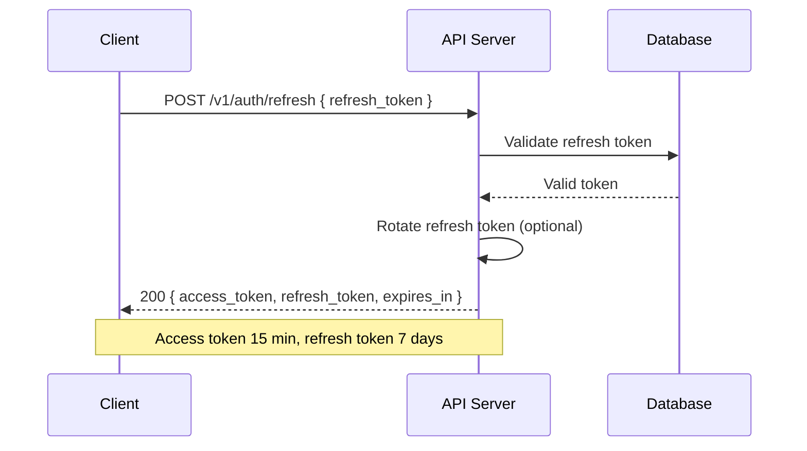
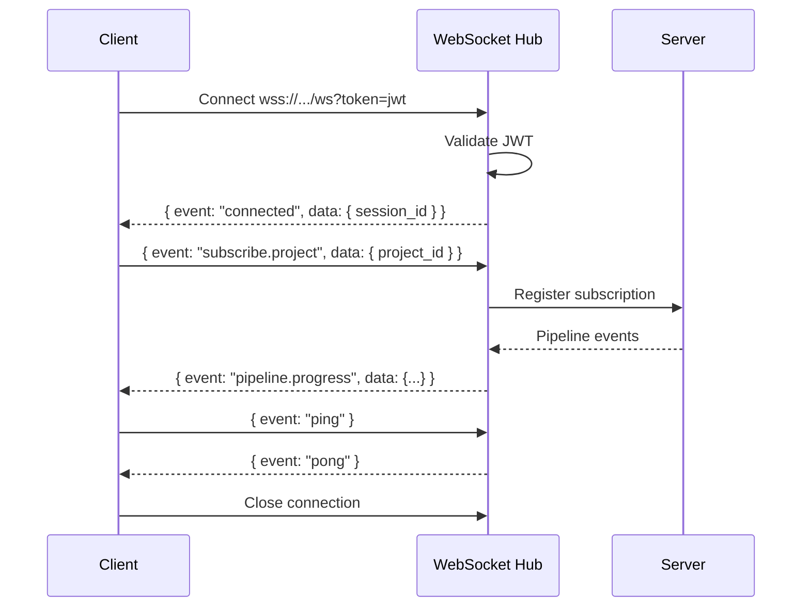

# API Specification — Vidara AI

> **Project:** Vidara AI — AI YouTube Video Generator SaaS  
> **Author:** Platform Engineering Team  
> **Last Updated:** 2026-06-26  
> **Status:** Draft  
> **Cross-Reference:** [Architecture](architecture.md) · [Agents](AGENTS.md) · [PRD](prd.md) · [FRD](../frd.md)

---

## 1. Tujuan

Dokumen ini mendefinisikan spesifikasi API untuk Vidara AI. Mencakup RESTful endpoints, WebSocket events, authentication, rate limiting, error handling, pagination, versioning strategy, dan rencana SDK. Bertujuan menjadi contract tunggal antara frontend, backend, dan third-party integrators.

---

## 2. Background

Vidara AI membutuhkan API yang melayani frontend Nuxt 4, background workers (Temporal/BullMQ), third-party developers via API Key, serta real-time updates via WebSocket. API harus consistent, well-documented, dan mendukung evolusi tanpa breaking changes. Desain mengikuti RESTful best practices dengan JSON envelope standard.

---

## 3. Objective

1. Mendefinisikan seluruh endpoint API dengan request/response format.
2. Menstandarisasi authentication, error codes, pagination, dan rate limiting.
3. Mendokumentasikan WebSocket events untuk real-time communication.
4. Menyediakan referensi implementasi untuk frontend dan third-party developers.
5. Menetapkan versioning strategy dan migration path.

---

## 4. Scope

**In Scope:**
- RESTful endpoints (Auth, Organizations, Workspaces, Projects, Videos, Scenes, Scripts, Prompts, Images, Voices, Subtitles, Assets, Templates, Render Jobs, YouTube, Billing, Admin)
- WebSocket events (job progress, agent updates, notifications)
- Authentication (JWT Bearer + API Key)
- Rate limiting strategy
- Error codes and response format
- Pagination (cursor-based)
- API versioning (URL-based)

**Out of Scope:**
- Internal service-to-service API (gRPC)
- Database queries and schema
- Frontend component API
- Third-party provider APIs

---

## 5. Stakeholder

| Stakeholder | Interest |
|---|---|
| Frontend Engineer | API contracts, WebSocket events, error handling |
| Backend Engineer | Endpoint implementation, validation, auth |
| Third-Party Developer | API Key auth, rate limits, SDK |
| QA Engineer | Test scenarios, contract testing |
| DevOps Engineer | Rate limiting infra, monitoring |
| Product Manager | Feature coverage, versioning |

---

## 6. Requirement

1. Semua endpoint harus menggunakan JSON envelope standard.
2. Authentication via JWT Bearer token (user) atau API Key (machine).
3. Pagination menggunakan cursor-based (bukan offset-based).
4. Error response harus memiliki custom error code + human-readable message.
5. Rate limiting per-user, per-API-key, dan per-endpoint.
6. WebSocket events harus memiliki event name, payload, dan timestamp.
7. Semua endpoint harus memiliki OpenAPI 3.1 specification.

---

## 7. API Design

**Style:** RESTful (primary) + WebSocket (real-time)

**Base URL:** `https://api.vidara.ai/v1`

**Protocol:** HTTPS (TLS 1.3 minimum)

**Content-Type:** `application/json` (request & response)

**WebSocket Endpoint:** `wss://api.vidara.ai/v1/ws`

---

## 8. Authentication

### 8.1 JWT Bearer Token

| Parameter | Value |
|---|---|
| Token Type | JWT (RS256) |
| Access Token Expiry | 15 menit |
| Refresh Token Expiry | 7 hari |
| Header | `Authorization: Bearer <token>` |

### 8.2 API Key

| Parameter | Value |
|---|---|
| Header | `X-API-Key: <key>` |
| Scopes | `read`, `write`, `admin` |
| Rate Limit | Per key: 100 req/min (default), 1000 req/min (enterprise) |

### 8.3 Token Refresh Flow



---

## 9. Rate Limiting

### 9.1 Tiers

| Tier | Default Limit | Burst | Window |
|---|---|---|---|
| Free | 30 req/min | 50 | 1 menit sliding |
| Pro | 100 req/min | 200 | 1 menit sliding |
| Business | 500 req/min | 1000 | 1 menit sliding |
| Enterprise | Custom | Custom | Custom |

### 9.2 Response Headers

```
X-RateLimit-Limit: 100
X-RateLimit-Remaining: 87
X-RateLimit-Reset: 1623456789
Retry-After: 45
```

### 9.3 Limit Types

- Per-user (JWT subject)
- Per-API-key
- Per-endpoint group
- Per-IP (fallback untuk unauthenticated)

---

## 10. Response Format — Standard JSON Envelope

### 10.1 Success Response

```json
{
  "success": true,
  "data": { ... },
  "meta": {
    "request_id": "req_abc123",
    "timestamp": "2026-06-26T12:00:00Z",
    "version": "v1"
  }
}
```

### 10.2 Error Response

```json
{
  "success": false,
  "error": {
    "code": "VALIDATION_ERROR",
    "message": "Title must be between 3 and 100 characters",
    "details": [
      { "field": "title", "message": "Minimum 3 characters" }
    ]
  },
  "meta": {
    "request_id": "req_def456",
    "timestamp": "2026-06-26T12:00:00Z",
    "version": "v1"
  }
}
```

### 10.3 Paginated Response

```json
{
  "success": true,
  "data": [ ... ],
  "pagination": {
    "cursor": "eyJpZCI6IjEyMyJ9",
    "has_more": true,
    "total": 250,
    "limit": 20
  },
  "meta": { ... }
}
```

---

## 11. Error Codes

### 11.1 Standard HTTP Codes

| Code | Description |
|---|---|
| 200 | OK |
| 201 | Created |
| 204 | No Content |
| 400 | Bad Request |
| 401 | Unauthorized |
| 403 | Forbidden |
| 404 | Not Found |
| 409 | Conflict |
| 422 | Unprocessable Entity |
| 429 | Too Many Requests |
| 500 | Internal Server Error |
| 502 | Bad Gateway |
| 503 | Service Unavailable |

### 11.2 Custom Error Codes

| Code | HTTP Status | Description |
|---|---|---|
| AUTH_INVALID_TOKEN | 401 | Token expired or invalid |
| AUTH_INSUFFICIENT_SCOPE | 403 | API Key scope insufficient |
| AUTH_REFRESH_EXPIRED | 401 | Refresh token expired |
| VALIDATION_ERROR | 422 | Request body validation failed |
| RESOURCE_NOT_FOUND | 404 | Resource does not exist |
| RESOURCE_CONFLICT | 409 | Resource already exists |
| RATE_LIMIT_EXCEEDED | 429 | Rate limit hit |
| QUOTA_EXCEEDED | 403 | Plan quota exhausted |
| CREDITS_INSUFFICIENT | 402 | Not enough credits |
| PIPELINE_BUSY | 409 | Pipeline already running |
| PIPELINE_FAILED | 500 | Pipeline execution failed |
| YOUTUBE_AUTH_REQUIRED | 401 | YouTube OAuth not connected |
| YOUTUBE_QUOTA_EXCEEDED | 429 | YouTube API quota exceeded |
| PROVIDER_ERROR | 502 | AI provider returned error |
| PROVIDER_TIMEOUT | 504 | AI provider timeout |
| PAYMENT_REQUIRED | 402 | Subscription required |
| INTERNAL_ERROR | 500 | Unexpected server error |

---

## 12. Pagination — Cursor-Based

### 12.1 Request

| Parameter | Type | Description |
|---|---|---|
| `limit` | integer | Max items per page (1-100, default 20) |
| `cursor` | string | Opaque cursor from previous response |
| `sort` | string | Sort field (default `created_at`) |
| `order` | string | `asc` or `desc` (default `desc`) |

### 12.2 Response

```json
{
  "data": [...],
  "pagination": {
    "cursor": "base64encodedcursor",
    "has_more": true,
    "total": 250,
    "limit": 20
  }
}
```

### 12.3 First Request

```
GET /v1/projects?limit=20
```

### 12.4 Subsequent Requests

```
GET /v1/projects?limit=20&cursor=eyJpZCI6IjEyMyJ9
```

---

## 13. API Versioning

**Strategy:** URL-based versioning (`/v1/`, `/v2/`)

**Version Lifecycle:**

| Phase | Duration | Description |
|---|---|---|
| Preview | 30 days | Beta endpoint, may change |
| Stable | 12 months | Fully supported |
| Deprecated | 6 months | Warning header, still functional |
| Sunset | — | Returns 410 Gone |

**Deprecation Header:**
```
Sunset: Sat, 26 Dec 2027 00:00:00 GMT
Deprecation: true
```

---

## 14. WebSocket Events

**Endpoint:** `wss://api.vidara.ai/v1/ws`

**Authentication:** JWT token as query parameter: `wss://api.vidara.ai/v1/ws?token=<jwt>`

### 14.1 Event Format

```json
{
  "event": "pipeline.progress",
  "data": { ... },
  "timestamp": "2026-06-26T12:00:00Z",
  "request_id": "req_abc123"
}
```

### 14.2 Event Types

| Event | Direction | Description |
|---|---|---|
| `pipeline.started` | Server → Client | Pipeline started |
| `pipeline.progress` | Server → Client | Step progress update |
| `pipeline.completed` | Server → Client | Pipeline finished |
| `pipeline.failed` | Server → Client | Pipeline failed |
| `agent.status` | Server → Client | Agent heartbeat |
| `agent.output` | Server → Client | Agent generated output |
| `render.progress` | Server → Client | Render progress % |
| `render.completed` | Server → Client | Render finished |
| `upload.progress` | Server → Client | YouTube upload progress |
| `upload.completed` | Server → Client | YouTube upload done |
| `notification` | Server → Client | System notification |
| `project.updated` | Server → Client | Project data changed |
| `credits.updated` | Server → Client | Credit balance changed |
| `error` | Server → Client | Server-side error |

### 14.3 Client → Server Events

| Event | Description |
|---|---|
| `subscribe.project` | Subscribe to project updates |
| `unsubscribe.project` | Unsubscribe from project |
| `ping` | Keepalive heartbeat |

### 14.4 Connection Lifecycle



---

## 15. Endpoints — Auth

Base: `/v1/auth`

| Method | Endpoint | Description | Auth |
|---|---|---|---|
| POST | `/v1/auth/register` | Register new user | None |
| POST | `/v1/auth/login` | Login with email/password | None |
| POST | `/v1/auth/logout` | Logout & invalidate tokens | JWT |
| POST | `/v1/auth/refresh` | Refresh access token | None |
| POST | `/v1/auth/forgot-password` | Send reset password email | None |
| POST | `/v1/auth/reset-password` | Reset password with token | None |
| GET | `/v1/auth/oauth/:provider` | OAuth2 redirect (google, github) | None |
| POST | `/v1/auth/oauth/:provider/callback` | OAuth2 callback | None |
| GET | `/v1/auth/me` | Get current user profile | JWT |
| PATCH | `/v1/auth/me` | Update profile | JWT |
| POST | `/v1/auth/email/verify` | Verify email address | JWT |
| POST | `/v1/auth/email/resend` | Resend verification email | JWT |

### Register

```
POST /v1/auth/register
```

**Request:**
```json
{
  "email": "user@example.com",
  "password": "Str0ng!Pass",
  "name": "John Doe",
  "provider": "email"
}
```

**Response (201):**
```json
{
  "success": true,
  "data": {
    "user_id": "usr_abc123",
    "email": "user@example.com",
    "name": "John Doe",
    "access_token": "eyJhbG...",
    "refresh_token": "eyJhbG...",
    "expires_in": 900
  }
}
```

### Login

```
POST /v1/auth/login
```

**Request:**
```json
{
  "email": "user@example.com",
  "password": "Str0ng!Pass"
}
```

**Response (200):** Same as register (with tokens).

### Forgot Password

```
POST /v1/auth/forgot-password
```

**Request:**
```json
{
  "email": "user@example.com"
}
```

**Response (200):**
```json
{
  "success": true,
  "data": { "message": "Reset link sent to email" }
}
```

---

## 16. Endpoints — Organizations

Base: `/v1/organizations`

| Method | Endpoint | Description | Auth |
|---|---|---|---|
| POST | `/v1/organizations` | Create organization | JWT |
| GET | `/v1/organizations` | List user's organizations | JWT |
| GET | `/v1/organizations/:id` | Get organization details | JWT |
| PATCH | `/v1/organizations/:id` | Update organization | JWT |
| DELETE | `/v1/organizations/:id` | Delete organization | JWT |
| GET | `/v1/organizations/:id/members` | List members | JWT |
| POST | `/v1/organizations/:id/members` | Invite member | JWT |
| PATCH | `/v1/organizations/:id/members/:userId` | Update member role | JWT |
| DELETE | `/v1/organizations/:id/members/:userId` | Remove member | JWT |
| GET | `/v1/organizations/:id/invites` | List pending invites | JWT |
| POST | `/v1/organizations/:id/invites` | Create invite | JWT |
| DELETE | `/v1/organizations/:id/invites/:inviteId` | Revoke invite | JWT |
| PATCH | `/v1/organizations/:id/settings` | Update organization settings | JWT |

### Create Organization

```
POST /v1/organizations
```

**Request:**
```json
{
  "name": "My Studio",
  "slug": "my-studio",
  "tax_id": "1234567890",
  "billing_email": "billing@mystudio.com"
}
```

**Response (201):**
```json
{
  "success": true,
  "data": {
    "id": "org_abc123",
    "name": "My Studio",
    "slug": "my-studio",
    "tier": "free",
    "created_at": "2026-06-26T12:00:00Z"
  }
}
```

### Invite Member

```
POST /v1/organizations/:id/members
```

**Request:**
```json
{
  "email": "collab@example.com",
  "role": "editor"
}
```

**Response (201):**
```json
{
  "success": true,
  "data": {
    "invite_id": "inv_abc123",
    "email": "collab@example.com",
    "role": "editor",
    "status": "pending",
    "expires_at": "2026-07-03T12:00:00Z"
  }
}
```

---

## 17. Endpoints — Workspaces

Base: `/v1/workspaces`

| Method | Endpoint | Description | Auth |
|---|---|---|---|
| POST | `/v1/workspaces` | Create workspace | JWT |
| GET | `/v1/workspaces` | List workspaces | JWT |
| GET | `/v1/workspaces/:id` | Get workspace | JWT |
| PATCH | `/v1/workspaces/:id` | Update workspace | JWT |
| DELETE | `/v1/workspaces/:id` | Delete workspace | JWT |
| GET | `/v1/workspaces/:id/members` | List workspace members | JWT |
| POST | `/v1/workspaces/:id/members` | Add member | JWT |
| PATCH | `/v1/workspaces/:id/members/:userId` | Update member role | JWT |
| DELETE | `/v1/workspaces/:id/members/:userId` | Remove member | JWT |
| PATCH | `/v1/workspaces/:id/settings` | Update workspace settings | JWT |

### Create Workspace

```
POST /v1/workspaces
```

**Request:**
```json
{
  "organization_id": "org_abc123",
  "name": "Content Team",
  "slug": "content-team",
  "default_role": "editor"
}
```

**Response (201):**
```json
{
  "success": true,
  "data": {
    "id": "ws_abc123",
    "organization_id": "org_abc123",
    "name": "Content Team",
    "slug": "content-team",
    "default_role": "editor",
    "created_at": "2026-06-26T12:00:00Z"
  }
}
```

---

## 18. Endpoints — Projects

Base: `/v1/projects`

| Method | Endpoint | Description | Auth |
|---|---|---|---|
| POST | `/v1/projects` | Create project | JWT |
| GET | `/v1/projects` | List projects | JWT |
| GET | `/v1/projects/:id` | Get project details | JWT |
| PATCH | `/v1/projects/:id` | Update project | JWT |
| DELETE | `/v1/projects/:id` | Delete project | JWT |
| POST | `/v1/projects/:id/generate` | Start video generation | JWT |
| GET | `/v1/projects/:id/status` | Get generation status | JWT |
| POST | `/v1/projects/:id/cancel` | Cancel generation | JWT |
| POST | `/v1/projects/:id/archive` | Archive project | JWT |
| POST | `/v1/projects/:id/restore` | Restore archived project | JWT |
| GET | `/v1/projects/:id/timeline` | Get project timeline | JWT |

### Create Project

```
POST /v1/projects
```

**Request:**
```json
{
  "workspace_id": "ws_abc123",
  "title": "Sejarah Majapahit",
  "description": "Dokumenter 8 menit tentang kerajaan Majapahit",
  "prompt": "Buat video dokumenter 8 menit tentang sejarah Kerajaan Majapahit...",
  "language": "id",
  "target_duration_seconds": 480, // Durasi standar: 360s (6 min), 480s (8 min), 900s (15 min)
  "aspect_ratio": "16:9",
  "resolution": "1080p",
  "type": "longform"
}
```

**Response (201):**
```json
{
  "success": true,
  "data": {
    "id": "prj_abc123",
    "workspace_id": "ws_abc123",
    "title": "Sejarah Majapahit",
    "status": "draft",
    "created_at": "2026-06-26T12:00:00Z"
  }
}
```

### Generate Video

```
POST /v1/projects/:id/generate
```

**Response (202):**
```json
{
  "success": true,
  "data": {
    "project_id": "prj_abc123",
    "status": "queued",
    "pipeline_id": "pipe_abc123",
    "estimated_duration_seconds": 900,
    "credits_estimated": 45,
    "queued_at": "2026-06-26T12:00:00Z"
  }
}
```

### Get Status

```
GET /v1/projects/:id/status
```

**Response (200):**
```json
{
  "success": true,
  "data": {
    "project_id": "prj_abc123",
    "status": "processing",
    "pipeline": {
      "current_step": "script",
      "progress_pct": 35,
      "steps": [
        { "name": "research", "status": "completed", "duration_ms": 45000 },
        { "name": "fact_check", "status": "completed", "duration_ms": 12000 },
        { "name": "script", "status": "running", "duration_ms": 8000 },
        { "name": "storyboard", "status": "pending" },
        { "name": "scene_planning", "status": "pending" },
        { "name": "character_design", "status": "pending" },
        { "name": "background", "status": "pending" },
        { "name": "image_generation", "status": "pending" },
        { "name": "animation", "status": "pending" },
        { "name": "voiceover", "status": "pending" },
        { "name": "subtitle", "status": "pending" },
        { "name": "music", "status": "pending" },
        { "name": "sound_effects", "status": "pending" },
        { "name": "composition", "status": "pending" },
        { "name": "rendering", "status": "pending" },
        { "name": "thumbnail", "status": "pending" },
        { "name": "seo", "status": "pending" },
        { "name": "quality_gate", "status": "pending" }
      ]
    },
    "updated_at": "2026-06-26T12:05:00Z"
  }
}
```

---

## 19. Endpoints — Videos

Base: `/v1/videos`

| Method | Endpoint | Description | Auth |
|---|---|---|---|
| GET | `/v1/videos` | List videos (completed projects) | JWT |
| GET | `/v1/videos/:id` | Get video details | JWT |
| GET | `/v1/videos/:id/download` | Get download URL | JWT |
| GET | `/v1/videos/:id/preview` | Get preview URL | JWT |
| DELETE | `/v1/videos/:id` | Delete video | JWT |
| POST | `/v1/videos/:id/render` | Re-render video | JWT |
| POST | `/v1/videos/:id/cancel-render` | Cancel active render | JWT |

### Get Video Details

```
GET /v1/videos/:id
```

**Response (200):**
```json
{
  "success": true,
  "data": {
    "id": "vid_abc123",
    "project_id": "prj_abc123",
    "title": "Sejarah Majapahit",
    "status": "completed",
    "duration_seconds": 480,
    "resolution": "1080p",
    "format": "mp4",
    "file_size_bytes": 245000000,
    "download_url": "https://storage.vidara.ai/videos/abc123/final.mp4?...",
    "preview_url": "https://storage.vidara.ai/videos/abc123/preview.mp4?...",
    "thumbnail_url": "https://storage.vidara.ai/videos/abc123/thumbnail.jpg?...",
    "youtube_url": null,
    "created_at": "2026-06-26T12:00:00Z",
    "completed_at": "2026-06-26T12:15:00Z"
  }
}
```

---

## 20. Endpoints — Scenes

Base: `/v1/projects/:projectId/scenes`

| Method | Endpoint | Description | Auth |
|---|---|---|---|
| POST | `/v1/projects/:projectId/scenes` | Create scene | JWT |
| GET | `/v1/projects/:projectId/scenes` | List scenes | JWT |
| GET | `/v1/projects/:projectId/scenes/:id` | Get scene | JWT |
| PATCH | `/v1/projects/:projectId/scenes/:id` | Update scene | JWT |
| DELETE | `/v1/projects/:projectId/scenes/:id` | Delete scene | JWT |
| POST | `/v1/projects/:projectId/scenes/reorder` | Reorder scenes | JWT |
| POST | `/v1/projects/:projectId/scenes/:id/duplicate` | Duplicate scene | JWT |

### Create Scene

```
POST /v1/projects/:projectId/scenes
```

**Request:**
```json
{
  "sequence_order": 5,
  "name": "Opening",
  "narration_text": "Pada abad ke-13...",
  "duration_seconds": 30,
  "transition_type": "fade",
  "style_config": {
    "mood": "epic",
    "color_palette": ["#gold", "#maroon", "#cream"]
  }
}
```

**Response (201):**
```json
{
  "success": true,
  "data": {
    "id": "scn_abc123",
    "project_id": "prj_abc123",
    "sequence_order": 5,
    "name": "Opening",
    "duration_seconds": 30,
    "created_at": "2026-06-26T12:00:00Z"
  }
}
```

---

## 21. Endpoints — Scripts

Base: `/v1/projects/:projectId/scripts`

| Method | Endpoint | Description | Auth |
|---|---|---|---|
| POST | `/v1/projects/:projectId/scripts/generate` | Generate script | JWT |
| GET | `/v1/projects/:projectId/scripts` | Get current script | JWT |
| PATCH | `/v1/projects/:projectId/scripts/:id` | Edit script sections | JWT |
| GET | `/v1/projects/:projectId/scripts/:id/versions` | List script versions | JWT |
| GET | `/v1/projects/:projectId/scripts/:id/versions/:versionId` | Get version | JWT |
| POST | `/v1/projects/:projectId/scripts/:id/compare` | Compare two versions | JWT |

### Generate Script

```
POST /v1/projects/:projectId/scripts/generate
```

**Request:**
```json
{
  "tone": "educational",
  "target_audience": "general",
  "include_hook": true,
  "include_cta": true,
  "keywords": ["majapahit", "sejarah indonesia", "kerajaan hindu buddha"]
}
```

**Response (200):**
```json
{
  "success": true,
  "data": {
    "id": "scr_abc123",
    "full_script": "Pada abad ke-13...",
    "word_count": 1200,
    "estimated_duration_seconds": 480,
    "tone": "educational",
    "sections": [
      { "type": "hook", "text": "...", "duration_seconds": 15 },
      { "type": "intro", "text": "...", "duration_seconds": 45 },
      { "type": "body", "text": "...", "duration_seconds": 360 },
      { "type": "conclusion", "text": "...", "duration_seconds": 30 },
      { "type": "cta", "text": "...", "duration_seconds": 30 }
    ],
    "created_at": "2026-06-26T12:00:00Z"
  }
}
```

---

## 22. Endpoints — Prompts

Base: `/v1/prompts`

| Method | Endpoint | Description | Auth |
|---|---|---|---|
| POST | `/v1/prompts` | Create prompt | JWT |
| GET | `/v1/prompts` | List prompts | JWT |
| GET | `/v1/prompts/:id` | Get prompt | JWT |
| PATCH | `/v1/prompts/:id` | Update prompt | JWT |
| DELETE | `/v1/prompts/:id` | Delete prompt | JWT |
| GET | `/v1/prompts/library` | Browse prompt library | JWT |
| GET | `/v1/prompts/categories` | List prompt categories | JWT |

### Create Prompt

```
POST /v1/prompts
```

**Request:**
```json
{
  "name": "Educational Explainer",
  "category": "education",
  "prompt_template": "Buat video {{duration}} menit tentang {{topic}} dengan gaya {{style}}", // duration: 6, 8, atau 15 menit
  "variables": ["duration", "topic", "style"],
  "is_public": false,
  "tags": ["educational", "explainer"]
}
```

---

## 23. Endpoints — Images

Base: `/v1/images`

| Method | Endpoint | Description | Auth |
|---|---|---|---|
| POST | `/v1/images/generate` | Generate image | JWT |
| GET | `/v1/images/:id` | Get image details | JWT |
| DELETE | `/v1/images/:id` | Delete image | JWT |
| POST | `/v1/images/upload` | Upload custom image | JWT |
| POST | `/v1/images/:id/edit` | Edit image (inpaint/outpaint) | JWT |
| POST | `/v1/images/:id/upscale` | Upscale image | JWT |
| POST | `/v1/images/:id/remove-background` | Remove background | JWT |

### Generate Image

```
POST /v1/images/generate
```

**Request:**
```json
{
  "project_id": "prj_abc123",
  "scene_id": "scn_abc123",
  "prompt": "Candi Borobudur saat matahari terbit, style sinematik",
  "style": "cinematic",
  "aspect_ratio": "16:9",
  "negative_prompt": "blurry, low quality, distortion",
  "variations": 4
}
```

**Response (200):**
```json
{
  "success": true,
  "data": {
    "id": "img_abc123",
    "variations": [
      { "url": "https://storage.vidara.ai/images/abc123/v1.jpg", "width": 1920, "height": 1080 },
      { "url": "https://storage.vidara.ai/images/abc123/v2.jpg", "width": 1920, "height": 1080 }
    ],
    "selected_variation": null,
    "created_at": "2026-06-26T12:00:00Z"
  }
}
```

---

## 24. Endpoints — Voices

Base: `/v1/voices`

| Method | Endpoint | Description | Auth |
|---|---|---|---|
| GET | `/v1/voices` | List available voices | JWT |
| GET | `/v1/voices/:id` | Get voice details | JWT |
| POST | `/v1/voices/generate` | Generate voiceover | JWT |
| POST | `/v1/voices/:id/preview` | Preview voice sample | JWT |

### List Voices

```
GET /v1/voices?language=id&tier=premium
```

**Response (200):**
```json
{
  "success": true,
  "data": [
    {
      "id": "vce_001",
      "name": "Aria",
      "gender": "female",
      "language": "en",
      "tier": "premium",
      "provider": "elevenlabs",
      "styles": ["neutral", "excited", "serious", "warm"],
      "preview_url": "https://storage.vidara.ai/voices/preview/aria.mp3"
    }
  ]
}
```

### Generate Voiceover

```
POST /v1/voices/generate
```

**Request:**
```json
{
  "project_id": "prj_abc123",
  "scene_id": "scn_abc123",
  "voice_id": "vce_001",
  "text": "Narasi teks untuk voiceover...",
  "speed": 1.0,
  "emotion": "educational",
  "pauses": [{ "position_sec": 5.5, "duration_sec": 0.5 }]
}
```

---

## 25. Endpoints — Subtitles

Base: `/v1/subtitles`

| Method | Endpoint | Description | Auth |
|---|---|---|---|
| POST | `/v1/projects/:projectId/subtitles/generate` | Generate subtitles | JWT |
| GET | `/v1/projects/:projectId/subtitles` | Get subtitles | JWT |
| PATCH | `/v1/projects/:projectId/subtitles` | Edit subtitles | JWT |
| PATCH | `/v1/projects/:projectId/subtitles/style` | Update subtitle style | JWT |
| POST | `/v1/projects/:projectId/subtitles/translate` | Translate subtitles | JWT |

### Generate Subtitles

```
POST /v1/projects/:projectId/subtitles/generate
```

**Request:**
```json
{
  "source_language": "id",
  "format": "srt",
  "burn_in": false,
  "style": {
    "font_family": "Inter",
    "font_size": 24,
    "color": "#FFFFFF",
    "background_color": "#00000080",
    "position": "bottom_center"
  }
}
```

---

## 26. Endpoints — Assets

Base: `/v1/assets`

| Method | Endpoint | Description | Auth |
|---|---|---|---|
| POST | `/v1/assets/upload` | Upload asset | JWT |
| GET | `/v1/assets` | List assets | JWT |
| GET | `/v1/assets/:id` | Get asset | JWT |
| DELETE | `/v1/assets/:id` | Delete asset | JWT |
| PATCH | `/v1/assets/:id` | Update asset metadata | JWT |
| GET | `/v1/assets/search` | Search assets | JWT |

### Upload Asset

```
POST /v1/assets/upload
```

**Request:** `multipart/form-data`

| Field | Type | Description |
|---|---|---|
| `file` | binary | Asset file |
| `workspace_id` | string | Workspace ID |
| `type` | string | `image`, `video`, `audio`, `font`, `logo` |
| `tags` | string[] | Search tags |

---

## 27. Endpoints — Templates

Base: `/v1/templates`

| Method | Endpoint | Description | Auth |
|---|---|---|---|
| POST | `/v1/templates` | Create template | JWT |
| GET | `/v1/templates` | List templates | JWT |
| GET | `/v1/templates/:id` | Get template | JWT |
| PATCH | `/v1/templates/:id` | Update template | JWT |
| DELETE | `/v1/templates/:id` | Delete template | JWT |
| POST | `/v1/templates/:id/apply` | Apply template to project | JWT |
| GET | `/v1/templates/categories` | List categories | JWT |

---

## 28. Endpoints — Render Jobs

Base: `/v1/render-jobs`

| Method | Endpoint | Description | Auth |
|---|---|---|---|
| GET | `/v1/render-jobs` | List render jobs | JWT |
| GET | `/v1/render-jobs/:id` | Get job status | JWT |
| POST | `/v1/render-jobs/:id/cancel` | Cancel render job | JWT |
| PATCH | `/v1/render-jobs/:id/priority` | Update job priority | JWT |
| GET | `/v1/render-jobs/queue` | Get queue status | JWT/Admin |

### Get Queue Status

```
GET /v1/render-jobs/queue
```

**Response (200):**
```json
{
  "success": true,
  "data": {
    "total_queued": 12,
    "total_active": 4,
    "total_completed_today": 87,
    "total_failed_today": 3,
    "avg_wait_time_ms": 45000,
    "avg_render_time_ms": 120000,
    "active_jobs": [
      { "id": "rj_001", "project_id": "prj_abc", "progress": 45, "priority": "high" }
    ]
  }
}
```

---

## 29. Endpoints — YouTube

Base: `/v1/youtube`

| Method | Endpoint | Description | Auth |
|---|---|---|---|
| GET | `/v1/youtube/auth` | Get OAuth URL | JWT |
| POST | `/v1/youtube/auth/callback` | Handle OAuth callback | JWT |
| GET | `/v1/youtube/status` | Get connection status | JWT |
| DELETE | `/v1/youtube/disconnect` | Disconnect YouTube | JWT |
| POST | `/v1/projects/:id/publish` | Upload video | JWT |
| POST | `/v1/projects/:id/schedule` | Schedule upload | JWT |
| GET | `/v1/projects/:id/analytics` | Get video analytics | JWT |

### Publish to YouTube

```
POST /v1/projects/:id/publish
```

**Request:**
```json
{
  "visibility": "public",
  "title": "Sejarah Majapahit: Dari Awal Hingga Runtuh",
  "description": "Video dokumenter ini membahas...\n\n⌛ CHAPTERS:\n0:00 - Intro\n1:30 - Awal Berdiri\n...",
  "tags": ["majapahit", "sejarah", "indonesia"],
  "category_id": "27",
  "playlist_id": null,
  "made_for_kids": false,
  "language": "id"
}
```

**Response (200):**
```json
{
  "success": true,
  "data": {
    "youtube_video_id": "abc123def45",
    "youtube_url": "https://youtube.com/watch?v=abc123def45",
    "visibility": "public",
    "published_at": "2026-06-26T12:00:00Z"
  }
}
```

### Get Analytics

```
GET /v1/projects/:id/analytics?days=30
```

**Response (200):**
```json
{
  "success": true,
  "data": {
    "youtube_video_id": "abc123def45",
    "views": 12500,
    "watch_time_hours": 1041.7,
    "retention_rate": 0.62,
    "ctr": 0.085,
    "avg_view_duration_seconds": 300,
    "likes": 450,
    "comments": 28,
    "subscribers_gained": 120,
    "traffic_sources": {
      "youtube_search": 0.45,
      "suggested": 0.3,
      "direct": 0.15,
      "external": 0.1
    }
  }
}
```

---

## 30. Endpoints — Billing

Base: `/v1/billing`

| Method | Endpoint | Description | Auth |
|---|---|---|---|
| GET | `/v1/billing/plans` | List subscription plans | None |
| GET | `/v1/billing/subscription` | Get current subscription | JWT |
| POST | `/v1/billing/subscription` | Create/update subscription | JWT |
| DELETE | `/v1/billing/subscription` | Cancel subscription | JWT |
| GET | `/v1/billing/invoices` | List invoices | JWT |
| GET | `/v1/billing/invoices/:id` | Get invoice | JWT |
| GET | `/v1/billing/credits` | Get credit balance | JWT |
| POST | `/v1/billing/credits/purchase` | Purchase credits | JWT |
| GET | `/v1/billing/usage` | Get usage report | JWT |

### List Plans

```
GET /v1/billing/plans
```

**Response (200):**
```json
{
  "success": true,
  "data": [
    {
      "id": "plan_free",
      "name": "Free",
      "price_cents": 0,
      "interval": "month",
      "features": {
        "max_projects_per_month": 1,
        "max_duration_seconds": 300,
        "max_resolution": "720p",
        "watermark": true,
        "youtube_publish": false,
        "team_members": 1
      }
    },
    {
      "id": "plan_pro",
      "name": "Pro",
      "price_cents": 2900,
      "interval": "month",
      "features": {
        "max_projects_per_month": 30,
        "max_duration_seconds": 900,
        "max_resolution": "1080p",
        "watermark": false,
        "youtube_publish": true,
        "team_members": 3
      }
    }
  ]
}
```

---

## 31. Endpoints — Admin

Base: `/v1/admin`

| Method | Endpoint | Description | Auth |
|---|---|---|---|
| GET | `/v1/admin/users` | List all users | JWT+Admin |
| GET | `/v1/admin/users/:id` | Get user details | JWT+Admin |
| PATCH | `/v1/admin/users/:id` | Update user (suspend/ban) | JWT+Admin |
| GET | `/v1/admin/audit-log` | Query audit log | JWT+Admin |
| GET | `/v1/admin/monitoring` | System health dashboard | JWT+Admin |
| GET | `/v1/admin/metrics` | Platform metrics | JWT+Admin |
| PATCH | `/v1/admin/settings` | Update system settings | JWT+Admin |
| POST | `/v1/admin/maintenance` | Toggle maintenance mode | JWT+Admin |

### System Monitoring

```
GET /v1/admin/monitoring
```

**Response (200):**
```json
{
  "success": true,
  "data": {
    "api": { "status": "healthy", "requests_1m": 450, "p95_latency_ms": 120 },
    "database": { "status": "healthy", "connections": 45, "max_connections": 200, "replication_lag_ms": 50 },
    "redis": { "status": "healthy", "memory_usage_pct": 45, "hit_rate_pct": 92 },
    "queue": { "bullmq_pending": 15, "temporal_pending": 8, "dead_letters": 1 },
    "workers": { "active": 12, "idle": 3, "failed": 0 },
    "storage": { "minio_used_gb": 2340, "minio_free_gb": 10000, "r2_backup_status": "synced" },
    "ai_providers": {
      "openai": { "status": "healthy", "p95_latency_ms": 850, "error_rate_pct": 0.5 },
      "elevenlabs": { "status": "healthy", "p95_latency_ms": 1200, "error_rate_pct": 1.2 },
      "runway": { "status": "healthy", "p95_latency_ms": 3000, "error_rate_pct": 2.1 }
    }
  }
}
```

---

## 32. Endpoints — Niche Management

| Method | Endpoint | Description | Auth |
|---|---|---|---|
| `GET` | `/v1/workspaces/{workspace_id}/niches` | List all niches in workspace | JWT |
| `POST` | `/v1/workspaces/{workspace_id}/niches` | Create new niche | JWT |
| `GET` | `/v1/workspaces/{workspace_id}/niches/{niche_id}` | Get niche details | JWT |
| `PATCH` | `/v1/workspaces/{workspace_id}/niches/{niche_id}` | Update niche | JWT |
| `DELETE` | `/v1/workspaces/{workspace_id}/niches/{niche_id}` | Delete niche (soft) | JWT |
| `POST` | `/v1/workspaces/{workspace_id}/niches/{niche_id}/set-default` | Set as default niche | JWT |

### Create Niche

```
POST /v1/workspaces/{workspace_id}/niches
```

**Request Body:**
```json
{
  "name": "Sejarah Nusantara",
  "description": "Video edukasi sejarah kerajaan dan budaya Indonesia",
  "keywords": ["sejarah", "kerajaan", "nusantara", "budaya", "indonesia"],
  "target_audience": { "age_range": "18-40", "interests": ["sejarah", "edukasi"], "language": "id" },
  "default_style": { "tone": "educational", "visual_style": "cinematic", "music_mood": "epic", "pace": "moderate" },
  "visual_preferences": { "color_palette": ["#8B4513", "#D2691E"], "font_preference": "serif", "image_style": "historical" },
  "brand_kit_id": "uuid_optional"
}
```

**Response (201):**
```json
{
  "success": true,
  "data": {
    "id": "nic_abc123",
    "workspace_id": "ws_abc123",
    "name": "Sejarah Nusantara",
    "slug": "sejarah-nusantara",
    "description": "Video edukasi sejarah kerajaan dan budaya Indonesia",
    "keywords": ["sejarah", "kerajaan", "nusantara", "budaya", "indonesia"],
    "target_audience": { "age_range": "18-40", "interests": ["sejarah", "edukasi"], "language": "id" },
    "is_default": false,
    "is_active": true,
    "created_at": "2026-06-26T10:00:00Z"
  }
}
```

### List Niches

```
GET /v1/workspaces/{workspace_id}/niches?page=1&per_page=20
```

**Response (200):**
```json
{
  "success": true,
  "data": [
    {
      "id": "nic_abc123",
      "name": "Sejarah Nusantara",
      "slug": "sejarah-nusantara",
      "keywords": ["sejarah", "kerajaan", "nusantara"],
      "is_default": true,
      "project_count": 15,
      "created_at": "2026-06-26T10:00:00Z"
    }
  ],
  "pagination": { "page": 1, "per_page": 20, "total": 3, "total_pages": 1 }
}
```

---

## 34. SDK/Client — Future Plan

| Language | Status | Target Version |
|---|---|---|
| TypeScript/JavaScript | Planned | v1.0 |
| Python | Planned | v1.1 |
| Go | Planned | v2.0 |
| Rust | Backlog | v2.0 |

**SDK Features:**
- Auto-retry with exponential backoff
- TypeScript type definitions
- WebSocket client built-in
- Rate limit awareness
- File upload helpers
- OAuth flow helpers

---

## 35. Endpoint Coverage Matrix

| Domain | Endpoints | Auth | Rate Limit Tier |
|---|---|---|---|
| Auth | 12 | Mixed (none/JWT) | 10 req/min (unauthenticated) |
| Organizations | 13 | JWT | 100 req/min |
| Workspaces | 9 | JWT | 100 req/min |
| Projects | 11 | JWT | 60 req/min |
| Videos | 6 | JWT | 60 req/min |
| Scenes | 7 | JWT | 60 req/min |
| Scripts | 6 | JWT | 30 req/min |
| Prompts | 7 | JWT | 60 req/min |
| Images | 7 | JWT | 30 req/min |
| Voices | 4 | JWT | 30 req/min |
| Subtitles | 5 | JWT | 30 req/min |
| Assets | 6 | JWT | 60 req/min |
| Templates | 7 | JWT | 60 req/min |
| Render Jobs | 4 | JWT | 30 req/min |
| YouTube | 6 | JWT | 30 req/min |
| Billing | 9 | JWT | 30 req/min |
| Admin | 8 | JWT+Admin | 100 req/min |
| WebSocket | 1 | JWT | N/A |

**Total Endpoints:** 117

---

## 36. API Consistency Rules

1. **Resource IDs** — Prefix per resource: `usr_`, `org_`, `ws_`, `prj_`, `scn_`, `scr_`, `vid_`, `img_`, `vce_`, `asst_`, `tpl_`, `rj_`, `inv_`
2. **Timestamps** — ISO 8601 UTC (`2026-06-26T12:00:00Z`)
3. **Sorting** — `sort=field_name&order=asc|desc`
4. **Filtering** — `status=active&type=video` (exact match), `q=keyword` (search)
5. **Batch Operations** — `POST /v1/:resource/batch` with `{ operations: [{ method, path, body }] }`
6. **Idempotency** — `Idempotency-Key` header for mutating endpoints
7. **Compression** — `Content-Encoding: gzip` / `br` (Brotli)
8. **Cache** — `ETag` + `If-None-Match` for GET endpoints

---

## 37. Security & Compliance

| Requirement | Implementation |
|---|---|
| Transport | TLS 1.3 minimum, HSTS, HPKP |
| Auth | JWT RS256, refresh rotation, API Key SHA-256 |
| Rate Limit | Sliding window (Redis), per-key + per-user + per-IP |
| CORS | Whitelist origins, configurable per API Key |
| CSP | Strict Content-Security-Policy headers |
| WebSocket | Origin check, token auth, connection timeout 30s |
| Audit | All mutating requests logged (actor, action, resource, IP, UA) |
| Body Limit | POST/PUT max 10MB, file upload max 1GB (signed URL) |
| Data Privacy | All PII encrypted at rest, auto-delete after retention period |

---

## 38. Future Improvement

| Item | Target Version | Impact |
|---|---|---|
| GraphQL endpoint (read-only queries) | v2.0 | Flexible data fetching |
| Server-Sent Events (SSE) for non-WebSocket clients | v1.1 | Fallback real-time |
| OpenAPI 3.1 auto-generated docs UI | v1.0 | Developer experience |
| Webhook system with retry | v1.1 | Third-party integration |
| Rate limit tiers configurable per API Key | v1.2 | Enterprise flexibility |
| API changelog feed | v1.0 | Developer communication |

---

## 39. Acceptance Criteria

| AC | Kriteria | Status |
|---|---|---|
| AC-01 | Semua 117 endpoints documented with request/response | ✅ |
| AC-02 | Authentication (JWT + API Key) fully specified | ✅ |
| AC-03 | Rate limiting tiers documented per-endpoint | ✅ |
| AC-04 | Error codes cover all failure scenarios | ✅ |
| AC-05 | Cursor-based pagination format defined | ✅ |
| AC-06 | WebSocket events documented with format | ✅ |
| AC-07 | Versioning strategy and deprecation policy defined | ✅ |
| AC-08 | Security headers and compliance requirements listed | ✅ |

---

## 40. Referensi

| Dokumen | Path |
|---|---|
| Architecture Document | `internal/docs/architecture.md` |
| Agent Team Profile | `internal/docs/AGENTS.md` |
| Product Requirement Document | `internal/docs/prd.md` |
| Functional Requirement Document | `internal/docs/frd.md` |
| Tech Stack Document | `internal/docs/techstack.md` |
| BRD Document | `internal/docs/brd.md` |
| Deployment Guide | `internal/docs/deployment.md` |

---

> **End of API Specification** — Vidara AI © 2026
