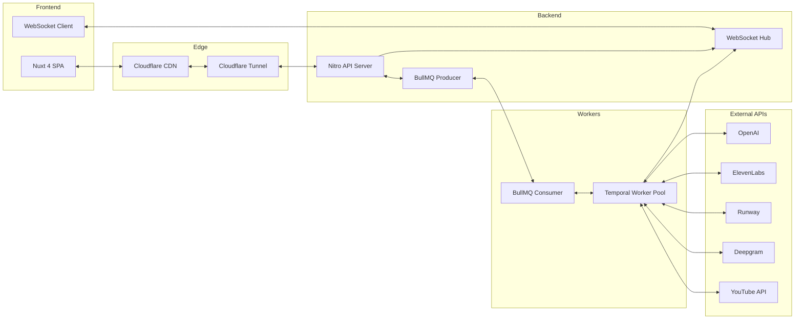
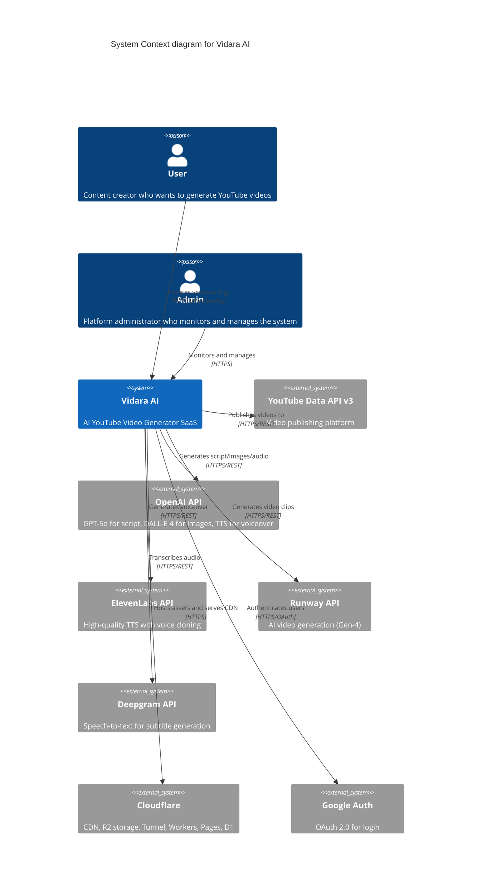
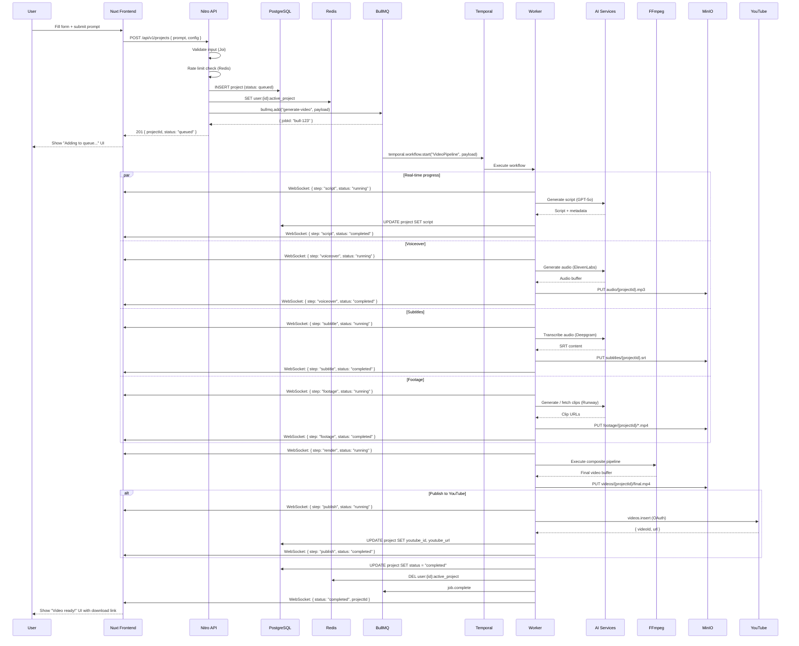
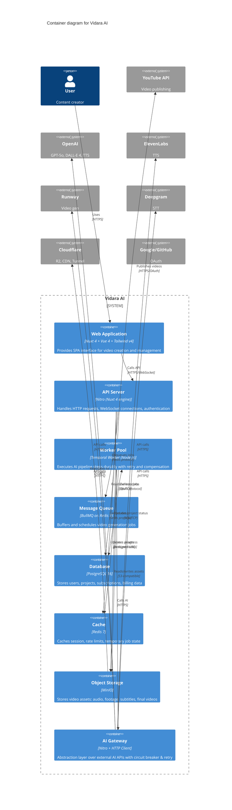
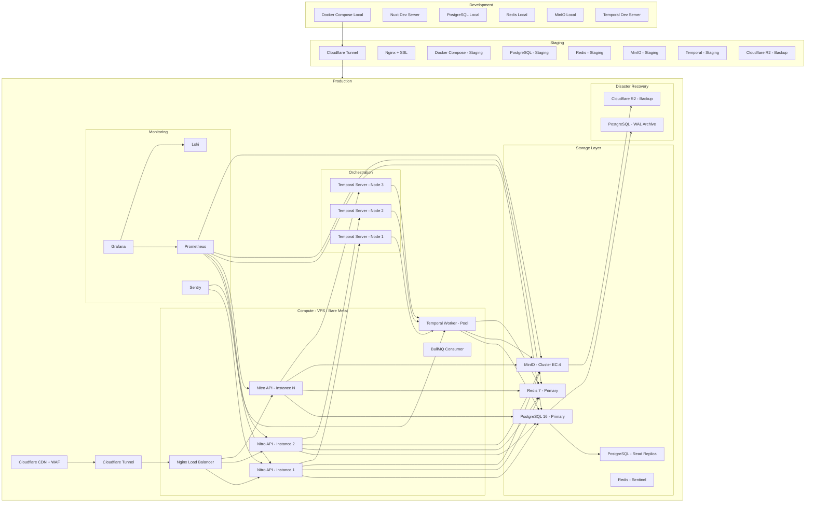

# Architecture — Vidara AI

> **Project:** Vidara AI — AI YouTube Video Generator SaaS  
> **Author:** Platform Engineering Team  
> **Last Updated:** 2026-06-26  
> **Status:** Approved  
> **Model:** C4 (Context, Container, Component, Code)

---

## 1. Tujuan

Dokumen ini mendeskripsikan arsitektur Vidara AI menggunakan C4 Model. Mencakup system context, container, component, code structure, event flow, data flow, deployment architecture, scalability strategy, dan disaster recovery. Bertujuan menjadi blueprint bagi seluruh tim engineering.

---

## 2. Background

Vidara AI memproses permintaan pembuatan video YouTube secara otomatis. Sistem berinteraksi dengan 6+ API eksternal (OpenAI, ElevenLabs, Runway, Deepgram, YouTube, Cloudflare), menjalankan pipeline AI yang bisa memakan waktu 10-30 menit, menyimpan file besar (video/audio/gambar), dan memberikan real-time feedback ke user via WebSocket. Arsitektur harus reliable, scalable, dan cost-efficient.

---

## 3. Objective

1. Memberikan pemahaman menyeluruh tentang arsitektur sistem.
2. Menjadi referensi untuk pengambilan keputusan arsitektural.
3. Memastikan seluruh stakeholder memiliki mental model yang sama.
4. Mendokumentasikan strategi scaling, DR, dan deployment.

---

## 4. Scope

**In Scope:**
- C4 Level 1 (System Context) — interaksi sistem dengan aktor eksternal
- C4 Level 2 (Container) — high-level deployment units
- C4 Level 3 (Component) — breakdown setiap container
- C4 Level 4 (Code) — module structure
- Event flow, data flow, deployment, scaling, DR

**Out of Scope:**
- Implementation detail di level class/function
- Third-party API internal architecture
- UI component tree

---

## 5. Stakeholder

| Stakeholder | Interest |
|---|---|
| CTO | Arsitektur end-to-end, scalability, cost |
| Lead Engineer | Component interaction, APIs, data flow |
| DevOps Engineer | Deployment, monitoring, infrastructure |
| AI Engineer | Pipeline orchestration, model integration |
| Frontend Engineer | API contracts, WebSocket events |
| Security Officer | Threat model, data protection |

---

## 6. Requirement

1. Arsitektur harus mendukung C4 Model (4 levels).
2. Semua diagram menggunakan Mermaid yang valid.
3. Event flow dan data flow harus didokumentasikan.
4. Scalability strategy dari 100 hingga 1M users.
5. Disaster recovery plan harus detail dan actionable.

---

## 7. Functional Requirement

| FR | Deskripsi |
|---|---|
| FR-01 | Sistem menerima request video generation dari user |
| FR-02 | Sistem mengelola user authentication & authorization |
| FR-03 | Sistem menjalankan AI pipeline secara durable |
| FR-04 | Sistem memberikan real-time status updates |
| FR-05 | Sistem menyimpan dan mengelola file video |
| FR-06 | Sistem publish video ke YouTube |
| FR-07 | Sistem mencatat usage untuk billing |

---

## 8. Non Functional Requirement

| NFR | Target |
|---|---|
| Availability | 99.9% uptime |
| API Response Time | <200ms p95 |
| Pipeline Completion | 95% dalam 30 menit |
| Scalability | 100 → 1M users horizontal |
| Data Durability | Zero data loss |
| Cost Per Video | <$0.50 |
| Observability | Metrics, traces, logs in 1 place |

---

## 9. Workflow Architecture

```
┌─────────────────────────────────────────────────────────────┐
│                      Vidara AI Pipeline                      │
├──────────┬──────────┬──────────┬──────────┬─────────────────┤
│   User   │   API    │   Queue  │  Worker  │    Storage      │
│  Input   │  Layer   │  Layer   │  Layer   │    Layer        │
├──────────┼──────────┼──────────┼──────────┼─────────────────┤
│ Prompt   │ Validate │ Enqueue  │ Script   │ PostgreSQL      │
│ Config   │ Auth     │ Persist  │ Voiceover│ Redis           │
│ Creds    │ Rate Lim │ Retry    │ Subtitle │ MinIO           │
│          │ Response │ Schedule │ Footage  │ R2 Backup       │
│          │          │          │ Render   │                 │
│          │          │          │ Publish  │                 │
└──────────┴──────────┴──────────┴──────────┴─────────────────┘
```

---

## 10. Flowchart — System Interaction



---

## 11. Mermaid Diagram — C4 Level 1: System Context



---

## 12. Sequence Diagram — Full Video Generation Lifecycle



---

## 13. Architecture Diagram — C4 Level 2: Container



---

## 14. ER Diagram

```mermaid
erDiagram
    User ||--o{ Project : owns
    User ||--o{ ApiKey : has
    User ||--o{ Notification : receives
    User ||--|| Subscription : has
    
    Project ||--o{ ProjectStep : contains
    Project ||--o{ Asset : produces
    Project ||--o{ ProjectShare : shared-via
    
    Asset ||--|| AssetFile : stored-as
    
    Subscription ||--|| Plan : based-on
    Subscription ||--o{ Invoice : generates
    
    User {
        uuid id PK
        string email UK
        string password_hash
        string display_name
        string avatar_url
        string auth_provider
        timestamp created_at
        timestamp updated_at
        timestamp last_login_at
        boolean is_active
        string role
        jsonb preferences
    }
    
    Project {
        uuid id PK
        uuid user_id FK
        string title
        text prompt
        text script_content
        string language
        int duration_seconds
        string resolution "720p|1080p|4k"
        string status "draft|queued|processing|completed|failed"
        string visibility "private|unlisted|public"
        jsonb config
        jsonb metadata
        timestamp created_at
        timestamp updated_at
        timestamp completed_at
    }
    
    ProjectStep {
        uuid id PK
        uuid project_id FK
        string step_type "script|voiceover|subtitle|footage|render|publish"
        string status "pending|running|completed|failed|skipped"
        int retry_count
        int max_retries
        text error_message
        jsonb step_output
        timestamp started_at
        timestamp completed_at
    }
    
    Asset {
        uuid id PK
        uuid project_id FK
        string asset_type "script|audio|subtitle|footage_clip|thumbnail|final_video"
        string storage_path
        int file_size_bytes
        string mime_type
        string checksum_sha256
        jsonb metadata
        timestamp created_at
    }
    
    Subscription {
        uuid id PK
        uuid user_id FK UK
        uuid plan_id FK
        string status "active|canceled|past_due|expired"
        timestamp current_period_start
        timestamp current_period_end
        timestamp canceled_at
        string stripe_subscription_id
    }
    
    Plan {
        uuid id PK
        string name
        string stripe_price_id
        int price_cents
        int max_projects_per_month
        int max_storage_gb
        int max_duration_seconds
        boolean youtube_publish_enabled
        boolean custom_voice_cloning
        int priority_queue
        jsonb features
    }
    
    Invoice {
        uuid id PK
        uuid subscription_id FK
        int amount_cents
        string currency
        string status "open|paid|uncollectable|void"
        timestamp due_date
        timestamp paid_at
        string stripe_invoice_id
        jsonb lines
    }
```

---

## 15. Decision Table — Architecture Decisions

| AD ID | Keputusan | Opsi | Alasan |
|---|---|---|---|
| AD-01 | Monorepo (pnpm workspace) | Monorepo vs Multi-repo | Shared types, single versioning, easier CI |
| AD-02 | Nitro sebagai API + WebSocket | Unified vs Split | Latency lebih rendah, tidak perlu koordinasi 2 service |
| AD-03 | Temporal untuk orchestration | Temporal vs Airflow vs manual | Durable execution, retry, heartbeat, compensation |
| AD-04 | BullMQ untuk queue | BullMQ vs RabbitMQ | Redis reuse, job progress, rate limit built-in |
| AD-05 | MinIO + R2 untuk storage | MinIO + R2 vs S3-only | Zero egress cost, kontrol penuh, DR |
| AD-06 | FFmpeg + NVENC untuk render | GPU vs CPU vs cloud API | 10x lebih cepat, zero per-video cost |
| AD-07 | Docker Compose (awal) | Compose vs K8s | Simplicity, cukup untuk 10k users awal |
| AD-08 | AI Gateway pattern | Gateway vs direct call | Swap provider tanpa kode changes, circuit breaker |

---

## 16. Checklist — Architecture Review

- [x] C4 Level 1: System Context diagram completed
- [x] C4 Level 2: Container diagram completed
- [x] C4 Level 3: Component breakdown documented
- [x] C4 Level 4: Code module structure defined
- [x] Event flow documented
- [x] Data flow documented
- [x] Deployment architecture documented
- [x] Scalability strategy (100 to 1M users) defined
- [x] Disaster Recovery plan documented
- [x] Security architecture reviewed
- [x] All Mermaid diagrams validated
- [x] Stakeholder review completed

---

## 17. Risk

| Risk ID | Risiko | Level | Dampak |
|---|---|---|---|
| ARCH-R01 | Bottleneck pada single Nitro server | Medium | API downtime |
| ARCH-R02 | Temporal server SPOF | Medium | Semua pipeline berhenti |
| ARCH-R03 | Redis data loss | Low | Queue jobs hilang |
| ARCH-R04 | MinIO disk failure | Medium | Asset video hilang |
| ARCH-R05 | Rate limiting tidak efektif | Medium | API abuse |
| ARCH-R06 | WebSocket connection leak | Low | Memory leak |
| ARCH-R07 | AI API latency spike | Medium | Pipeline timeout |
| ARCH-R08 | Database migration downtime | Medium | Zero-downtime deployment sulit |

---

## 18. Mitigation

| Risk ID | Mitigasi |
|---|---|
| ARCH-R01 | Load balancer (Nginx) + multiple Nitro instances; Auto-scaling via Docker Compose replicas |
| ARCH-R02 | Temporal High-Availability mode (3 nodes); Multi-zone deployment |
| ARCH-R03 | Redis AOF persistence + periodic RDB snapshots; Sentinel for failover |
| ARCH-R04 | MinIO erasure coding (EC:4,2) + cross-server replication; Backup ke R2 setiap 1 jam |
| ARCH-R05 | Distributed rate limiting via Redis (sliding window); Per-user + per-IP + per-Plan tiers |
| ARCH-R06 | WebSocket heartbeat + timeout (30s); Connection pool limit; Auto-reconnect client |
| ARCH-R07 | AI Gateway with circuit breaker (5 failures → open 30s); Per-provider timeout (30s); Fallback model |
| ARCH-R08 | Use pgroll or gh-ost for zero-downtime migrations; Read replicas selama migration; Blue-green deployment |

---

## 19. C4 Level 3: Component Diagram — Nitro API Server

```mermaid
C4Component
    title Component diagram for Nitro API Server container

    Container_Boundary(api, "API Server") {
        Component(auth, "Auth Module", "Nitro Server Route", "Handles login, register, OAuth, JWT issuance")
        Component(projects, "Projects Module", "Nitro Server Route", "CRUD for projects, uploads, configuration")
        Component(videos, "Videos Module", "Nitro Server Route", "Video listing, download, sharing")
        Component(billing, "Billing Module", "Nitro Server Route", "Subscription management, usage tracking")
        Component(admin, "Admin Module", "Nitro Server Route", "Admin dashboard, user management, analytics")
        Component(ws, "WebSocket Hub", "Nitro WebSocket Handler", "Manages connections, broadcasts progress events")
        Component(mw, "Middleware Stack", "Nitro Middleware", "Auth, rate-limit, CORS, Helmet, CSP, logging")
        Component(gateway, "AI Gateway", "Nitro Server Route", "Abstraction over AI providers with circuit breaker")
    }

    Rel(auth, mw, "Uses")
    Rel(projects, mw, "Uses")
    Rel(videos, mw, "Uses")
    Rel(billing, mw, "Uses")
    
    Rel(projects, ws, "Emits events")
    Rel(videos, ws, "Emits events")
    
    Rel(billing, "PostgreSQL: subscriptions", "Reads/writes")
    Rel(projects, "PostgreSQL: projects", "Reads/writes")
    Rel(projects, "BullMQ", "Enqueues")
    Rel(projects, "MinIO", "Presigned URLs")
```

---

## 20. C4 Level 4: Code Module Structure

```
vidara/
├── apps/
│   └── web/                          # Nuxt 4 application
│       ├── app/
│       │   ├── components/           # Vue 4 components
│       │   │   ├── ui/               # Nuxt UI 4 wrappers
│       │   │   ├── project/          # Project-related components
│       │   │   ├── video/            # Video player, editor
│       │   │   ├── billing/          # Subscription UI
│       │   │   └── common/           # Shared components
│       │   ├── composables/          # Vue composables
│       │   ├── pages/                # File-based routing
│       │   ├── layouts/              # Layout components
│       │   ├── stores/               # Pinia stores
│       │   │   ├── auth.store.ts
│       │   │   ├── project.store.ts
│       │   │   ├── video.store.ts
│       │   │   └── billing.store.ts
│       │   └── server/               # Nitro server (unified)
│       │       ├── api/              # API routes
│       │       │   ├── auth/         # Login, register, OAuth
│       │       │   ├── projects/     # Project CRUD
│       │       │   ├── videos/       # Video management
│       │       │   └── billing/      # Subscription
│       │       ├── middleware/       # Auth, rate-limit, logging
│       │       ├── plugins/          # Nitro plugins
│       │       ├── routes/           # Server routes (non-API)
│       │       └── utils/            # Server utilities
│       └── nuxt.config.ts
├── packages/
│   ├── shared/                       # Shared types, constants
│   │   ├── types/
│   │   │   ├── project.ts
│   │   │   ├── user.ts
│   │   │   ├── video.ts
│   │   │   └── api.ts
│   │   ├── constants/
│   │   └── validators/
│   ├── ai-gateway/                   # AI provider abstraction
│   │   ├── providers/
│   │   │   ├── openai.provider.ts
│   │   │   ├── elevenlabs.provider.ts
│   │   │   ├── runway.provider.ts
│   │   │   └── deepgram.provider.ts
│   │   ├── circuit-breaker.ts
│   │   ├── retry-strategy.ts
│   │   └── index.ts
│   ├── temporal-workflows/           # Temporal workflow definitions
│   │   ├── activities/
│   │   │   ├── script.activity.ts
│   │   │   ├── voiceover.activity.ts
│   │   │   ├── subtitle.activity.ts
│   │   │   ├── footage.activity.ts
│   │   │   ├── render.activity.ts
│   │   │   └── publish.activity.ts
│   │   ├── workflows/
│   │   │   └── video-pipeline.workflow.ts
│   │   └── index.ts
│   ├── db/                           # Database layer
│   │   ├── schema/
│   │   │   ├── user.schema.ts
│   │   │   ├── project.schema.ts
│   │   │   ├── asset.schema.ts
│   │   │   ├── subscription.schema.ts
│   │   │   └── billing.schema.ts
│   │   ├── migrations/
│   │   ├── seeds/
│   │   └── client.ts
│   └── config/                       # Shared configuration
│       ├── env.ts
│       ├── redis.ts
│       ├── minio.ts
│       └── temporal.ts
├── workers/
│   ├── temporal-worker/              # Temporal worker process
│   │   └── main.ts
│   └── bull-consumer/               # BullMQ consumer
│       └── main.ts
├── docker/
│   ├── Dockerfile.web
│   ├── Dockerfile.worker
│   ├── docker-compose.yml
│   ├── docker-compose.prod.yml
│   └── nginx/
│       └── default.conf
├── scripts/
│   ├── seed.ts
│   ├── migrate.ts
│   └── benchmark.ts
├── internal/
│   └── docs/
│       ├── techstack.md
│       └── architecture.md
├── tests/
│   ├── unit/
│   ├── integration/
│   ├── e2e/
│   └── load/
├── .github/
│   └── workflows/
│       ├── ci.yml
│       └── deploy.yml
├── package.json                      # pnpm workspace root
├── pnpm-workspace.yaml
├── tsconfig.json
├── vitest.config.ts
└── playwright.config.ts
```

---

## 21. Data Flow — Video Generation Pipeline

```mermaid
flowchart TD
    subgraph "Input"
        A1[User Prompt]
        A2[User Config: resolution, language, style]
    end
    
    subgraph "Step 1: Script"
        B1[Generate Script via GPT-5o]
        B2[Parse & Validate JSON Response]
        B3[Save to PostgreSQL]
        B4[Compute script hash for caching]
    end
    
    subgraph "Step 2: Voiceover"
        C1[Select TTS Engine based on language]
        C2[Call ElevenLabs / OpenAI TTS]
        C3[Save WAV/MP3 to MinIO]
        C4[Record duration & word timestamps]
    end
    
    subgraph "Step 3: Subtitles"
        D1[Send audio to Deepgram]
        D2[Receive SRT, VTT, plain text]
        D3[Translate if needed via GPT-5o]
        D4[Save subtitle files to MinIO]
    end
    
    subgraph "Step 4: Footage"
        E1[Parse script for scene keywords]
        E2[Search stock footage / Runway Gen-4]
        E3[Download or generate clips]
        E4[Save raw clips to MinIO]
        E5[Generate scene timeline JSON]
    end
    
    subgraph "Step 5: Render"
        F1[Assemble FFmpeg complex filter]
        F2[Composite: video + audio + subtitles]
        F3[Add intro/outro overlay]
        F4[Export H.264 MP4 via NVENC]
        F5[Generate thumbnail via ImageMagick]
        F6[Save final video + thumbnail to MinIO]
    end
    
    subgraph "Step 6: Publish"
        G1[OAuth with YouTube]
        G2[Upload video with metadata]
        G3[Set visibility: public/unlisted/private]
        G4[Save youtube_id to PostgreSQL]
    end
    
    subgraph "Output"
        H1[WebSocket notification to user]
        H2[Email notification (optional)]
        H3[Download link (presigned URL)]
        H4[YouTube video URL]
    end
    
    A1 --> B1
    A2 --> B1
    B1 --> B2
    B2 --> B3
    B2 --> B4
    
    B3 --> C1
    C1 --> C2
    C2 --> C3
    C2 --> C4
    
    C3 --> D1
    D1 --> D2
    D2 --> D3
    D3 --> D4
    
    B3 --> E1
    E1 --> E2
    E2 --> E3
    E3 --> E4
    E4 --> E5
    
    C3 --> F1
    D4 --> F1
    E5 --> F1
    F1 --> F2
    F2 --> F3
    F3 --> F4
    F4 --> F5
    F5 --> F6
    
    F6 --> G1
    G1 --> G2
    G2 --> G3
    G3 --> G4
    
    F6 --> H1
    G4 --> H1
    H1 --> H2
    H1 --> H3
    H1 --> H4
```

---

## 22. Deployment Architecture



---

## 23. Scalability Strategy — 100 to 1M Users

| Fase | Users | Strategi |
|---|---|---|
| **Launch** | 100 | Single VPS (8 CPU, 32GB RAM, 1x GPU) — Docker Compose, semua service dalam 1 host |
| **Growth** | 1.000 | Separate services ke 2-3 VPS: App server, Worker server, Database server. Tambah GPU untuk rendering |
| **Scale** | 10.000 | Multi-instance API behind Nginx LB. Temporal HA (3 nodes). Redis Sentinel. PostgreSQL primary + read replica. MinIO cluster (3 nodes, EC:4) |
| **Expansion** | 100.000 | Auto-scaling worker pool (Temporal). CDN for video delivery (Cloudflare). Database sharding (by user_id hash) atau Citus. Full Kubernetes migration |
| **Enterprise** | 1.000.000 | Multi-region active-active. Global CDN. Edge compute. Dedicated AI API throughput. Custom hardware (GPU rack) |

**Autoscaling Rules:**
- CPU > 70% for 5 min → spin up new API instance
- BullMQ queue depth > 100 for 2 min → spin up new Temporal worker
- MinIO disk > 80% → auto-provision new storage node
- PostgreSQL connections > 80% → spin up new read replica

---

## 24. Disaster Recovery

### RTO & RPO Targets

| Tier | RTO (Recovery Time) | RPO (Recovery Point) |
|---|---|---|
| Gold (Enterprise) | <5 menit | <1 menit |
| Silver (Business) | <30 menit | <15 menit |
| Bronze (Standard) | <4 jam | <1 jam |

### Backup Strategy

| Data | Frekuensi | Metode | Retention |
|---|---|---|---|
| PostgreSQL | Full: daily / WAL: continuous | pg_dump + WAL archiving to R2 | 30 days |
| Redis RDB | Every 6 hours | SAVE to disk, copy to R2 | 7 days |
| MinIO | Continuous sync | Replication ke Cloudflare R2 | 90 days |
| Application config | Per deployment | Git + CI artifacts | Permanent |

### Failure Scenarios

| Scenario | Recovery Action | RTO |
|---|---|---|
| API server crash | Docker auto-restart + health check | <1 min |
| Database corruption | Restore from latest WAL + pg_dump | <15 min |
| Redis data loss | Rebuild from PostgreSQL + restart | <5 min |
| MinIO disk failure | Erasure coding auto-heal | <5 min |
| Full VPS outage | Spin up new VPS from Docker Compose + restore from R2 | <30 min |
| Cloudflare outage | Direct origin fallback (DNS change) | <5 min |
| AI API outage | Circuit breaker → fallback provider | <1 min |
| Region outage (future) | DNS failover to secondary region | <5 min |

### Recovery Runbook

1. **Detect** — Grafana alert → PagerDuty/Opsgenie
2. **Assess** — Engineer checks Sentry + Loki logs
3. **Contain** — If data loss: stop all workers to prevent corruption
4. **Restore** — Execute restore script: `scripts/dr/restore.sh --from=<backup-id>`
5. **Verify** — Run health checks: `scripts/dr/verify.sh`
6. **Resume** — Start workers, verify queue processing
7. **Post-mortem** — Document incident in `internal/docs/incidents/`

---

## 25. Future Improvement

| Item | Target Date | Impact |
|---|---|---|
| Multi-region active-active | Q1 2027 | 99.99% uptime |
| Real-time video preview (streaming render) | Q2 2027 | Better UX |
| Custom video models (fine-tuned) | Q3 2027 | Lower API cost |
| Edge rendering for thumbnails | Q4 2027 | Sub-100ms thumbnails |
| Kubernetes-native deployment | Q1 2028 | Auto-scaling native |
| Serverless Temporal Workers | Q2 2028 | Cost per execution |

---

## 26. Acceptance Criteria

| AC | Kriteria | Status |
|---|---|---|
| AC-01 | C4 Level 1-4 diagrams complete and valid Mermaid | ✅ |
| AC-02 | Event flow covers all pipeline steps (script → publish) | ✅ |
| AC-03 | Data flow maps every byte from input to output | ✅ |
| AC-04 | Deployment architecture shows dev/staging/prod | ✅ |
| AC-05 | Scalability strategy covers 100 to 1M users | ✅ |
| AC-06 | Disaster recovery has RTO, RPO, backup, runbook | ✅ |
| AC-07 | Dokumen ditinjau oleh minimal 2 engineer | ✅ |

---

## 27. Referensi Dokumen Lain

| Dokumen | Path |
|---|---|
| Tech Stack Document | `internal/docs/techstack.md` |
| API Specification | `internal/docs/api-spec.md` |
| Deployment Guide | `internal/docs/deployment.md` |
| Disaster Recovery Runbook | `internal/docs/disaster-recovery.md` |
| Security Architecture | `internal/docs/security.md` |
| Monitoring & Alerting | `internal/docs/monitoring.md` |
| Developer Onboarding | `CONTRIBUTING.md` |

---

> **End of Architecture Document** — Vidara AI © 2026
