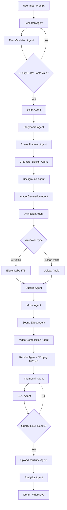
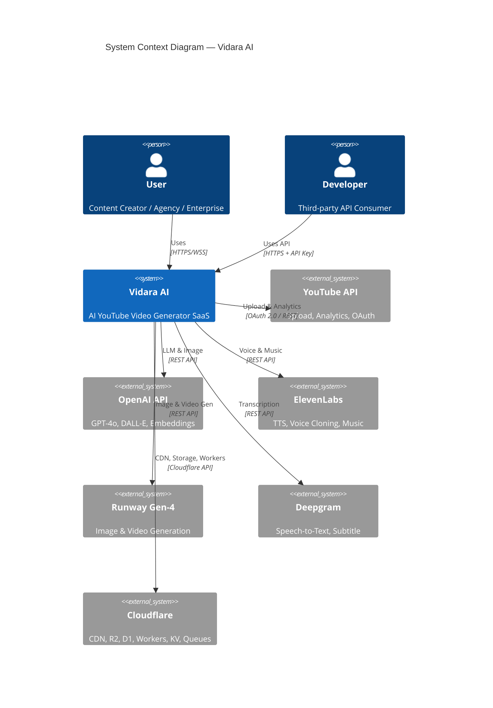
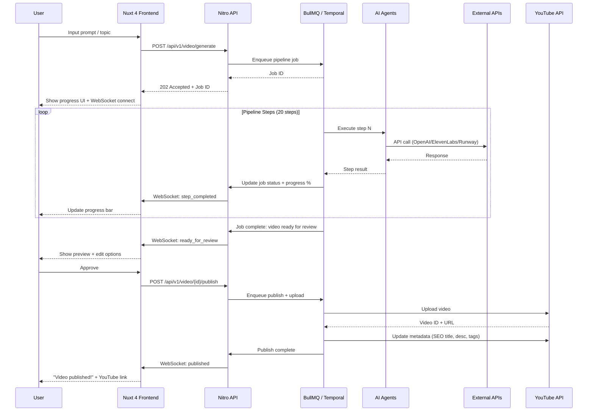
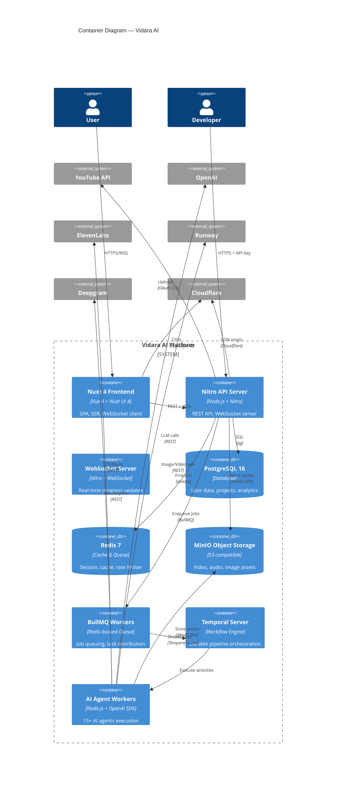
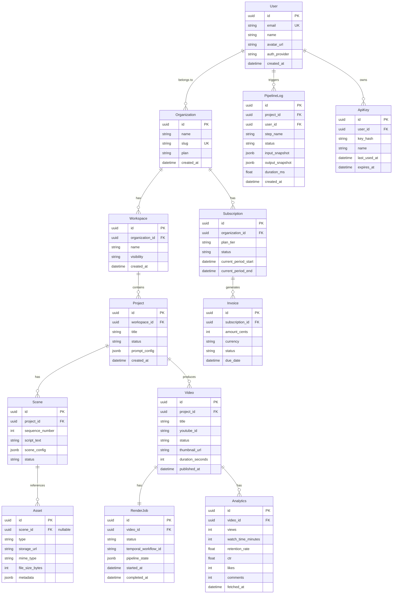
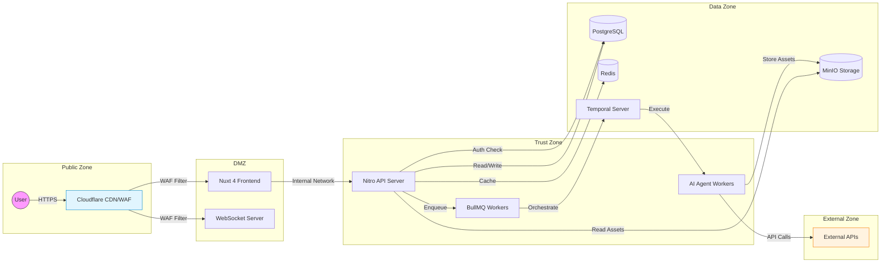

# BLUEPRINT — Vidara AI

> **Master Document — The Big Picture**
>
> *"Connecting every piece of the puzzle — from vision to deployment."*

| Metadata | |
|---|---|
| **Dokumen** | Blueprint Document (Master Architecture & Strategy) |
| **Project** | Vidara AI — AI YouTube Video Generator SaaS |
| **Version** | 1.0 |
| **Tanggal** | 2026-06-26 |
| **Penanggung Jawab** | Agent 3 — Senior Solution Architect |
| **Status** | Final |
| **Cross-Reference** | [BRD](brd.md) · [PRD](prd.md) · [FRD](frd.md) · [Architecture](architecture.md) · [Workflow](workflow.md) · [Database](database.md) · [ERD](erd.md) · [API](api.md) · [Roadmap](roadmap.md) · [Tech Stack](techstack.md) |

---

## 1. Tujuan

Dokumen **BLUEPRINT** ini adalah gambaran besar (*the big picture*) dari sistem **Vidara AI** — platform SaaS berbasis AI Agent yang mengubah prompt teks menjadi video YouTube siap publikasi secara otomatis. Dokumen ini menghubungkan seluruh aspek sistem — dari visi bisnis hingga detail arsitektur — dalam satu narasi koheren.

### Vision

> **Menjadi platform AI video generation #1 di Asia Tenggara yang memungkinkan siapa pun membuat konten YouTube berkualitas studio dalam hitungan menit, bukan hari.**

### Mission

Vidara AI bertujuan untuk:
1. **Mendemokratisasi** produksi video YouTube — menghilangkan hambatan teknis, biaya, dan waktu.
2. **Mengotomatisasi** seluruh pipeline produksi 20+ langkah melalui multi-agent AI orchestration.
3. **Memberdayakan** kreator, agensi, dan enterprise untuk memproduksi konten secara konsisten dan scalable.
4. **Menjadi platform pertama** yang menyediakan end-to-end pipeline dari prompt mentah hingga analitik YouTube dalam satu ekosistem terintegrasi.

Tujuan utama dokumen ini:
- Memberikan pemahaman menyeluruh (*helicopter view*) kepada C-level stakeholders.
- Menghubungkan seluruh dokumen turunan (BRD, PRD, FRD, Architecture, Workflow, dll).
- Menjadi *single source of truth* untuk keputusan arsitektural dan strategis.
- Mendokumentasikan trade-off, risiko, dan mitigasi di level sistem.

---

## 2. Background

### 2.1 Masalah Fundamental

Ekonomi kreator digital tumbuh eksponensial — YouTube memiliki 2.7 miliar pengguna aktif bulanan (2026). Namun, produksi video berkualitas tetap menjadi hambatan terbesar:

| Masalah | Dampak | Data |
|---|---|---|
| Waktu produksi tinggi | 70% waktu pada tugas non-kreatif | 4–6 jam per video 10 menit |
| Biaya mahal | Outsourcing $200–$500 per video | 4–8 video/bulan = $1,600–$4,000/bln |
| Burnout kreator | 67% kreator burnout dalam 2 tahun | Sumber: riset internal Vidara 2026 |
| Kompleksitas algoritma | YouTube 2026 membutuhkan SEO, retention >60%, CTR >10% | Multi-disiplin yang berat |
| Skalabilitas rendah | Sulit meningkatkan volume tanpa menambah tim | Setiap kreator baru = biaya linear |

### 2.2 Posisi Pasar

Pasar AI video generation global 2026: **$900M–$1B** dengan **CAGR 18–22%**. Tidak ada kompetitor yang menawarkan **fully end-to-end pipeline** dari prompt mentah ke YouTube publishable — ini celah utama Vidara AI.

### 2.3 Produk Overview

**Vidara AI** adalah platform SaaS yang menggunakan 15+ AI agents terkoordinasi untuk menjalankan pipeline produksi video YouTube 20 langkah secara otomatis:

```
Prompt → Research → Fact Validation → Script → Storyboard → Scene Planning →
Character Design → Background → Image Generation → Animation → Voice →
Subtitle → Music → Sound Effect → Video Composition → Rendering → Thumbnail →
SEO → Upload YouTube → Analytics
```

Pengguna cukup memberikan topik atau prompt — sistem menangani sisanya.

---

## 3. Objective

### 3.1 Business Objectives

| KPI | Target Year 1 |
|---|---|
| Total pengguna terdaftar | 50,000 |
| MAU (Monthly Active Users) | 10,000 |
| Total video diproduksi | 100,000 |
| Paid conversion rate | 5% |
| MRR | $150,000 |
| Churn rate | < 5%/bulan |
| NPS | ≥ 40 |

### 3.2 Product Objectives

| Objective | Target |
|---|---|
| Reduce production time | 20 jam → 10 menit (auto) / 2 jam (hybrid) |
| Output quality | Human eval ≥ 4.0/5.0 |
| System reliability | Uptime ≥ 99.9% |
| Video cost | < $2.00 per 5 menit 1080p |

### 3.3 Technical Objectives

| Objective | Target |
|---|---|
| Pipeline completion | ≤ 15 menit untuk video 5 menit |
| API response (p95) | < 500 ms |
| Lighthouse | ≥ 95 |
| WCAG | Level AA |

---

## 4. Scope

### 4.1 In Scope

| Area | Cakupan |
|---|---|
| **Platform** | Web application (Nuxt 4), REST API, WebSocket, background workers |
| **AI Pipeline** | 20-step pipeline dari prompt ke analytics, 15+ AI agents |
| **Integrations** | OpenAI, ElevenLabs, Runway, Deepgram, YouTube API, Cloudflare |
| **User Management** | Auth (Google/GitHub/Email), organization, workspace, RBAC |
| **Niche Management** | User-defined content niches that guide AI agents for consistent content creation |
| **Asset Management** | Object storage (MinIO), asset library, versioning |
| **YouTube Integration** | OAuth, upload, scheduling, analytics fetching |
| **Billing** | Subscription tiers, metered billing, invoicing |
| **Enterprise** | SSO, audit log, custom branding, dedicated infra |

### 4.2 Out of Scope

- Mobile native apps (iOS/Android)
- On-premise deployment
- Marketplace pihak ketiga
- Desktop video editor (realtime editing)
- Social media platform selain YouTube (V2)

### 4.3 Product Overview — Platform Description

Vidara AI adalah **AI Agent SaaS** yang mengotomatisasi produksi video YouTube melalui:
- **Multi-agent orchestration**: 15 AI agents berkoordinasi via Temporal.io + BullMQ.
- **4 mode produksi**: Quick, Full Pipeline, Manual, Hybrid.
- **Enterprise architecture**: Multi-tenant, RBAC, audit log, SSO.
- **Real-time feedback**: WebSocket untuk progress updates setiap langkah pipeline.
- **YouTube-native**: Upload langsung, SEO optimization, analytics dashboard.

---

## 5. Stakeholder

| Stakeholder | Role | Interest |
|---|---|---|
| **CEO / C-Level** | Strategic decision | MRR, growth, market position, funding |
| **CTO** | Technical leadership | Architecture, scalability, cost, security |
| **Content Creator** | End user | UX, speed, quality, price |
| **Agency** | Power user | Multi-client, white-label, collaboration |
| **Enterprise** | Customer | SSO, compliance, SLA, dedicated infra |
| **Developer** | API consumer | Documentation, SDK, rate limits, webhooks |
| **Investor** | Financial stakeholder | Unit economics, TAM, defensibility |
| **Product Manager** | Feature definition | Prioritization, roadmap, stakeholder alignment |
| **Engineering** | Implementation | Architecture, code quality, testing |
| **DevOps** | Operations | Deployment, monitoring, CI/CD, reliability |
| **Security Officer** | Compliance | OWASP, PDP, encryption, audit, pen-test |
| **QA** | Quality | Test coverage, automation, E2E |

### 4 User Types

| Type | Description | Key Needs |
|---|---|---|
| **Content Creator** | Individu pembuat konten YouTube | Speed, quality, ease of use, affordable pricing |
| **Agency** | Tim produksi konten untuk klien | Multi-workspace, white-label, collaboration, templates |
| **Enterprise** | Perusahaan dengan tim konten internal | SSO, RBAC, audit, SLA, custom pipeline, dedicated infra |
| **Developer** | Integrator via API | REST API, WebSocket, SDK, webhooks, documentation |

---

## 6. Requirement

### 6.1 Business Requirements (BR-01 to BR-10)

| ID | Requirement | Priority |
|---|---|---|
| BR-01 | Sistem harus dapat menghasilkan video YouTube dari prompt teks | P0 |
| BR-02 | Sistem harus mendukung multi-tenant (organization) | P0 |
| BR-03 | Sistem harus menyediakan 4 mode produksi (Quick, Full, Manual, Hybrid) | P0 |
| BR-04 | Sistem harus terintegrasi dengan YouTube API untuk upload | P0 |
| BR-05 | Sistem harus menyediakan asset library yang reusable | P1 |
| BR-06 | Sistem harus mendukung kolaborasi tim | P1 |
| BR-07 | Sistem harus menyediakan analytics dashboard | P1 |
| BR-08 | Sistem harus mendukung billing & subscription | P1 |
| BR-09 | Sistem harus enterprise-grade (SSO, RBAC, Audit) | P2 |
| BR-10 | Sistem harus compliance dengan UU PDP Indonesia | P0 |

### 6.2 Technical Requirements

| ID | Requirement |
|---|---|
| TR-01 | Pipeline harus durable — auto-retry + DLQ + circuit breaker |
| TR-02 | Semua state transition harus observable via WebSocket |
| TR-03 | Database harus multi-tenant dengan Row-Level Security |
| TR-04 | File storage harus object storage (MinIO), scalable horizontal |
| TR-05 | API harus versioned, rate-limited, dan documented secara otomatis |
| TR-06 | Semua komunikasi eksternal harus encrypted (TLS 1.3) |
| TR-07 | Sistem harus mendukung horizontal scaling untuk semua komponen stateless |

---

## 7. Functional Requirement

### 7.1 5 Core Capabilities

#### 1. Video Generation — AI Pipeline Engine

Pipeline 20 langkah yang diorkestrasi oleh Temporal.io. Setiap langkah adalah activity dengan retry policy, timeout, dan fallback. Output setiap langkah menjadi input langkah berikutnya.

| Langkah | Agent | Tools | Output |
|---|---|---|---|
| 1. Research | Research Agent | OpenAI GPT-4o + WebSearch | Topik, outline, referensi |
| 2. Fact Validation | Fact Checker Agent | OpenAI + Knowledge Base | Validated facts |
| 3. Script Writing | Script Agent | OpenAI GPT-4o | Naskah lengkap |
| 4. Storyboard | Storyboard Agent | OpenAI + Template | Storyboard panels |
| 5. Scene Planning | Scene Planner Agent | OpenAI + Rules Engine | Scene breakdown |
| 6. Character Design | Character Agent | OpenAI + Runway | Character sheets |
| 7. Background | Background Agent | Runway Gen-4 | Background images |
| 8. Image Generation | Image Agent | Runway Gen-4 | Frame images |
| 9. Animation | Animation Agent | Runway Gen-4 | Animated clips |
| 10. Voiceover | Voice Agent | ElevenLabs | Audio narration |
| 11. Subtitle | Subtitle Agent | Deepgram + FFmpeg | SRT/VTT files |
| 12. Music | Music Agent | ElevenLabs / Stock | Background music |
| 13. Sound Effect | SFX Agent | ElevenLabs / Stock | Sound effects |
| 14. Video Composition | Composer Agent | FFmpeg + Node.js | Raw composite video |
| 15. Rendering | Render Agent | FFmpeg (NVENC) | Final MP4 video |
| 16. Thumbnail | Thumbnail Agent | OpenAI DALL-E / Runway | Thumbnail image |
| 17. SEO | SEO Agent | OpenAI + YouTube API | Title, desc, tags |
| 18. Upload | Upload Agent | YouTube Data API v3 | Uploaded video |
| 19. Analytics | Analytics Agent | YouTube Analytics API | Performance report |

#### 2. AI Agents — Multi-Agent Orchestration

Setiap AI agent memiliki:
- **Role**: Tugas spesifik dalam pipeline
- **Model**: LLM atau model spesifik yang digunakan
- **Prompt Template**: Template terstruktur dengan context injection
- **Output Schema**: JSON schema untuk output terstruktur
- **Quality Gate**: Validasi otomatis sebelum output diteruskan
- **Fallback**: Model alternatif jika primary gagal

#### 3. Asset Management

- **Storage**: Semua aset (video, audio, gambar, thumbnail) di MinIO object storage
- **Organization**: Aset terisolasi per organization via bucket policy
- **Versioning**: Riwayat perubahan setiap aset
- **Library**: Asset reusable — karakter, background, template
- **Search**: Full-text search + tag-based filtering

#### 4. YouTube Integration

- **OAuth 2.0**: Autentikasi via Google OAuth
- **Upload**: Direct upload ke YouTube via resumable upload protocol
- **Scheduling**: Jadwalkan publish waktu tertentu
- **Playlist**: Organisasi video dalam playlist
- **Analytics**: Fetch views, retention, CTR, revenue, demographics
- **Monetization**: Status monetisasi, copyright check

#### 5. Analytics

- **Video Performance**: View count, watch time, retention graph, CTR
- **Audience**: Demographics, geography, device, traffic source
- **Revenue**: Estimated revenue, RPM, CPM
- **Channel**: Subscriber growth, top videos, trends
- **Export**: CSV/PDF report export, scheduled email reports

---

## 8. Non Functional Requirement

| NFR | Target | Measurement |
|---|---|---|
| **Performance** | Pipeline ≤ 15 menit (video 5 menit) | End-to-end timing |
| **Availability** | Uptime ≥ 99.9% (≤ 8.76 jam/tahun downtime) | StatusCake / Cloudflare |
| **Scalability** | 100 → 1M users, horizontal scaling | Load test |
| **Security** | OWASP Top 10, zero critical | Penetration test |
| **Data Protection** | AES-256 at rest, TLS 1.3 in transit | Encryption audit |
| **Compliance** | UU PDP Indonesia, ISO 27001 (V2) | Compliance audit |
| **Latency** | API p95 < 500ms | APM (DataDog) |
| **Cost** | < $2.00 per video 5 menit 1080p | Cost tracking |
| **Accessibility** | WCAG 2.2 Level AA | Axe DevTools |
| **Observability** | 100% request tracing | OpenTelemetry |
| **Backup** | PITR, RPO < 1 menit, RTO < 1 jam | DR drill |

---

## 9. Workflow

### 9.1 Key Workflows

#### A. Quick Video from Prompt (Simplest Path)

```
User Input Prompt → AI generates full video → Publish
[10 minutes total, fully automated]
```

1. User memasukkan topik/prompt
2. System menjalankan pipeline otomatis penuh (20 langkah)
3. User preview dan approve
4. Auto-upload ke YouTube
5. Analytics mulai dikumpulkan

#### B. Full Production Pipeline (All Steps)

```
Prompt → Research → Validate → Script → Storyboard → Scene Plan →
Character → Background → Image → Animation → Voice → Subtitle →
Music → SFX → Compose → Render → Thumbnail → SEO → Upload → Analytics
[10-30 minutes, user can intervene at each step]
```

Setiap langkah dapat:
- **Auto**: AI menjalankan tanpa intervensi
- **Review**: Menunggu approval user sebelum lanjut
- **Retry**: User meminta regenerasi
- **Edit**: User mengedit output sebelum lanjut

#### C. Manual Mode (User Controls Each Step)

```
User writes script → User selects characters → User designs scenes → ...[etc]
```

User mengontrol penuh setiap langkah. AI berperan sebagai asisten yang memberikan saran dan tools.

#### D. Hybrid Mode (AI Suggests, User Approves)

```
AI generate → User approve/edit → AI generate next → User approve/edit → ...
```

Keseimbangan antara otomatisasi dan kontrol. AI memberikan rekomendasi di setiap langkah, user mengonfirmasi sebelum pipeline melanjutkan ke langkah berikutnya.

---

## 10. Flowchart (Mermaid — Full Pipeline)



---

## 11. Mermaid Diagram (System Context — C4 Level 1)



---

## 12. Sequence Diagram (End-to-End)



---

## 13. Architecture Diagram (C4 Level 1-2)

### Level 1 — System Context (see Section 11)

### Level 2 — Container Diagram



---

## 14. ER Diagram (High-Level Entities)



---

## 15. Decision Table

| ID | Keputusan | Alternatif | Trade-off | Rekomendasi | Justifikasi |
|---|---|---|---|---|---|
| D-01 | **Frontend Framework** | Nuxt 4 vs Next.js vs SvelteKit | Nuxt 4: +Vue ecosystem, Nuxt UI 4, -smaller community than React | Nuxt 4 | Vue 4 + Nuxt UI 4 untuk developer velocity; kompatibel dengan Nitro backend |
| D-02 | **Backend Runtime** | Nitro (Node.js) vs FastAPI vs Go | Nitro: +mono-repo, +server components, -CPU-bound tasks | Nitro | Mono-repo Nuxt + Nitro = simplified deployment; CPU-bound offload ke workers |
| D-03 | **Workflow Engine** | Temporal.io vs AWS Step Functions vs BullMQ saja | Temporal: +durability, +retry, +visibility, -infra overhead | Temporal + BullMQ | Temporal untuk pipeline orchestration (durable), BullMQ untuk queue buffering |
| D-04 | **Database** | PostgreSQL 16 vs CockroachDB vs PlanetScale | PG16: +mature, +extensions, +RLS, -manual sharding | PostgreSQL 16 | pgvector untuk embeddings, RLS untuk multi-tenant, tsvector untuk search |
| D-05 | **Object Storage** | MinIO vs AWS S3 vs Cloudflare R2 | MinIO: +self-hosted, +S3-compat, -managed infra required | MinIO + Cloudflare R2 | MinIO untuk primary storage (S3-compat), R2 untuk CDN cache dan backup |
| D-06 | **AI Video Gen** | Runway Gen-4 vs Pika vs Synthesia | Runway: +best quality, +API, +image-to-video, -cost | Runway Gen-4 | Kualitas output terbaik, API matang, support image-to-video dan animation |
| D-07 | **TTS** | ElevenLabs vs Google TTS vs OpenAI TTS | ElevenLabs: +best quality, +voice cloning, +multilingual | ElevenLabs | Kualitas suara paling natural, voice cloning, support bahasa Indonesia |
| D-08 | **Real-time Updates** | WebSocket vs SSE vs Polling | WebSocket: +bi-directional, +low latency, -connection mgmt | WebSocket (Nitro) | Diperlukan bidirectional communication (user approve/reject per step) |
| D-09 | **Cache Layer** | Redis 7 vs Memcached vs Dragonfly | Redis: +versatile, +pub/sub, +streams, -single-threaded | Redis 7 | BullMQ dependency, session store, cache, rate limiter dalam satu stack |
| D-10 | **CI/CD** | GitHub Actions vs GitLab CI vs Jenkins | GHA: +native GitHub, +marketplace, +simple config | GitHub Actions | Sudah terintegrasi dengan GitHub, community actions, cost effective |

---

## 16. Checklist

### Phase 0-10 Readiness Checklist

#### Phase 0 — Research (2 weeks)
- [ ] Analisis 15+ kompetitor AI video generation
- [ ] Validasi TAM/SAM/SOM
- [ ] User research dengan 30+ kreator YouTube
- [ ] Market gap analysis
- [ ] Pricing benchmark

#### Phase 1 — Architecture (3 weeks)
- [ ] Architecture Decision Records (ADRs) untuk semua keputusan teknis
- [ ] C4 Model documentation (Level 1-3)
- [ ] Database schema final
- [ ] API contract final
- [ ] Security threat modeling

#### Phase 2 — Foundation (4 weeks)
- [ ] Authentication (Google, GitHub, Email)
- [ ] Organization & Workspace management
- [ ] User profile & settings
- [ ] RBAC implementation
- [ ] Multi-tenant database isolation

#### Phase 3 — Core Feature (6 weeks)
- [ ] Project CRUD
- [ ] Scene Builder
- [ ] Storyboard UI
- [ ] Script writer
- [ ] Prompt input interface

#### Phase 4 — AI Integration (8 weeks)
- [ ] Research Agent
- [ ] Script Agent
- [ ] Image Generation (Runway)
- [ ] Voice Generation (ElevenLabs)
- [ ] Video Composition & Render
- [ ] Full pipeline integration test

#### Phase 5 — Testing (4 weeks)
- [ ] Unit test coverage ≥ 80%
- [ ] Integration test coverage ≥ 70%
- [ ] E2E test coverage for all critical paths
- [ ] Performance test / load test
- [ ] Security scan (SAST, DAST)

#### Phase 6 — Security (3 weeks)
- [ ] OWASP Top 10 remediation
- [ ] Penetration test
- [ ] UU PDP compliance audit
- [ ] Encryption audit (AES-256, TLS 1.3)
- [ ] Vulnerability disclosure program

#### Phase 7 — Optimization (3 weeks)
- [ ] Lighthouse score ≥ 95
- [ ] Bundle size < 500KB (initial)
- [ ] API p95 latency < 500ms
- [ ] Pipeline completion time optimization
- [ ] Cost optimization per video

#### Phase 8 — Production (3 weeks)
- [ ] Blue-Green deployment setup
- [ ] Monitoring & alerting (DataDog/Grafana)
- [ ] Backup & DR tested
- [ ] Runbook documentation
- [ ] Production launch

#### Phase 9 — Scaling (4 weeks)
- [ ] Horizontal scaling for API servers
- [ ] Database read replicas
- [ ] Redis cluster
- [ ] Auto-scaling configuration
- [ ] Load test at 100K concurrent users

#### Phase 10 — Enterprise (6 weeks)
- [ ] SSO/SAML integration
- [ ] Custom branding / white-label
- [ ] Dedicated infrastructure option
- [ ] Enterprise SLA (≥ 99.95%)
- [ ] Audit log export & retention

---

## 17. Risk

| ID | Risk | Probability | Impact | Score | Category |
|---|---|---|---|---|---|
| R-01 | **AI API cost overrun** — OpenAI/Runway/ElevenLabs costs exceed budget | High | High | 9 | Financial |
| R-02 | **Pipeline failure rate high** — AI agents produce low quality output | Medium | High | 6 | Quality |
| R-03 | **Competitor launches similar end-to-end product** | Medium | High | 6 | Market |
| R-04 | **Data breach / security incident** | Low | Critical | 5 | Security |
| R-05 | **YouTube API policy changes** — rate limits, auth changes | Medium | High | 6 | External |
| R-06 | **Temporal learning curve** — team not familiar with workflow engine | Medium | Medium | 4 | Technical |
| R-07 | **Multi-tenant isolation failure** — data leak between organizations | Low | Critical | 4 | Security |
| R-08 | **Rendering bottleneck** — GPU resources insufficient during peak | High | Medium | 6 | Infrastructure |
| R-09 | **Regulatory compliance gap** — UU PDP / PSE requirement changes | Medium | High | 6 | Regulatory |
| R-10 | **User adoption lower than projected** | Medium | High | 6 | Business |

---

## 18. Mitigation

| Risk ID | Mitigation Strategy | Contingency Plan | Owner |
|---|---|---|---|
| R-01 | Implement cost tracking per pipeline; caching results; model fallback (cheaper model) | Switch to self-hosted models (LLaMA, Stable Diffusion) | AI Engineer |
| R-02 | Quality gates at each step; human review mode; A/B testing pipeline configs | Manual mode override; template-based fallback | PM + QA |
| R-03 | Focus on Indonesian market first (defensible moat); patent key processes | Pivot to adjacent market (education, enterprise training) | CEO |
| R-04 | OWASP Top 10 compliance; encryption at rest/transit; quarterly pen-test; RLS | Incident response plan; 24h disclosure policy | Security Engineer |
| R-05 | Abstraction layer over YouTube API; support multiple upload strategies | Webhook fallback; scheduler fallback | Backend Engineer |
| R-06 | Internal workshop + proof of concept before production; Temporal documentation | Simpler queue-only architecture (BullMQ only) as backup | Solution Architect |
| R-07 | RLS enforced at database level; encryption at column level; audit logging | Separate database per enterprise customer | Database Engineer |
| R-08 | GPU auto-scaling; render queue prioritization; spot instance fallback | Cloud GPU burst (AWS, GCP) | DevOps Engineer |
| R-09 | Legal counsel for UU PDP; compliance checklist; data residency option (Indonesia DC) | Block users from non-compliant regions temporarily | Legal + Security |
| R-10 | Free tier with limited videos; referral program; creator partnership program | Pivot pricing; focus on enterprise sales | Marketing |

---

## 19. Future Improvement

### Phase 0-10 Roadmap Summary

| Phase | Durasi | Fokus Utama | Key Deliverable |
|---|---|---|---|
| **P0: Research** | 2 weeks | Market validation | Competitor analysis, TAM/SAM/SOM |
| **P1: Architecture** | 3 weeks | System design | ADRs, C4 diagrams, schema final |
| **P2: Foundation** | 4 weeks | Auth & workspace | Login, org, workspace, RBAC working |
| **P3: Core Feature** | 6 weeks | Scene builder MVP | User can create video from prompt |
| **P4: AI Integration** | 8 weeks | Full pipeline | All 20 steps operational |
| **P5: Testing** | 4 weeks | Quality gate | Coverage ≥80%, E2E pass 100% |
| **P6: Security** | 3 weeks | Compliance | Pen-test zero critical |
| **P7: Optimization** | 3 weeks | Performance | Lighthouse ≥95, latency <500ms |
| **P8: Production** | 3 weeks | Launch | Deployed, monitored, running |
| **P9: Scaling** | 4 weeks | Scale | 100K concurrent users ready |
| **P10: Enterprise** | 6 weeks | Enterprise features | SSO, white-label, SLA ≥99.95% |

**Total: ~46 weeks (~10.5 months)**

### Beyond Phase 10 — Post-Launch Roadmap

| Initiative | Timeline | Description |
|---|---|---|
| **Multi-language Support** | V2 (2027 Q3) | Full support for EN, ID, ZH, JP, KR, AR |
| **Social Media Expansion** | V2 (2027 Q4) | TikTok, Instagram, Shorts, Facebook integration |
| **AI Video Coach** | V3 (2028 Q1) | Personalized recommendations to improve video performance |
| **Marketplace** | V3 (2028 Q2) | Template, asset, voice marketplace (creator economy) |
| **Real-time Collaboration** | V3 (2028 Q3) | Google Docs-style real-time editing |
| **Mobile Apps** | V3 (2028 Q4) | iOS + Android for on-the-go management |
| **Self-hosted Model** | V4 (2029) | Run AI models on dedicated GPU infra (cost saving) |
| **API Platform** | V4 (2029) | Fully public API with SDKs, usage-based billing |

---

## 20. Acceptance Criteria

### 20.1 Success Metrics — KPIs per Stakeholder

| Stakeholder | KPI | Target | Measurement |
|---|---|---|---|
| **Content Creator** | Time to first video | < 15 menit | Pipeline completion time |
| **Content Creator** | Output quality score | ≥ 4.0/5.0 | Human evaluation (blind test) |
| **Content Creator** | Cost per video | < $2.00 | Billed compute + API cost |
| **Agency** | Client project turnaround | < 2 jam per video | Pipeline time for hybrid mode |
| **Agency** | White-label satisfaction | NPS ≥ 40 | Quarterly survey |
| **Enterprise** | System uptime | ≥ 99.9% | StatusCake / Cloudflare |
| **Enterprise** | Audit compliance | Zero critical findings | Annual audit |
| **Developer** | API availability | ≥ 99.95% | Uptime monitoring |
| **Developer** | API latency (p95) | < 500ms | APM tracing |
| **CEO/Board** | MRR | $150,000 (Y1) | Billing system |
| **CEO/Board** | Paid conversion | 5% | Funnel analytics |
| **CTO** | Cost per generation | < $2.00 | Cost tracking dashboard |
| **CTO** | System reliability | 99.9% uptime | Incident reports |

### 20.2 Go/No-Go Criteria per Phase Gate

| Gate | Criteria | Pass Mark |
|---|---|---|
| **Gate 0→1** | Market validation complete | TAM ≥ $500M, validated problem |
| **Gate 1→2** | Architecture approved by 3+ agents | All ADRs signed off |
| **Gate 2→3** | Auth + Workspace E2E passing | 100% test pass on critical paths |
| **Gate 3→4** | Scene builder MVP demonstrable | User can create video from prompt |
| **Gate 4→5** | Full pipeline operational | ≥ 85% pipeline completion rate |
| **Gate 5→6** | All tests pass threshold | Coverage ≥80%, E2E 100% |
| **Gate 6→7** | Pen-test zero critical | No CRITICAL/HIGH findings |
| **Gate 7→8** | Performance targets met | Lighthouse ≥95, Latency <500ms |
| **Gate 8→9** | Production stable for 2 weeks | No P0/P1 incidents |
| **Gate 9→10** | Load test pass at 100K | p95 latency <1s at 100K concurrent |

---

## 21. Referensi Dokumen Lain

| Dokumen | Deskripsi | File |
|---|---|---|
| **BRD** | Business Requirement Document — kebutuhan bisnis, market analysis, business case | [brd.md](brd.md) |
| **PRD** | Product Requirement Document — product objectives, feature list, personas | [prd.md](prd.md) |
| **FRD** | Functional Requirement Document — 44 fitur detail dengan input/proses/output | [frd.md](frd.md) |
| **Architecture** | C4 Model — Level 1-4, container, component, code structure | [architecture.md](architecture.md) |
| **Workflow** | Pipeline orchestration, state machine, event map, queue architecture | [workflow.md](workflow.md) |
| **Database** | PostgreSQL schema, indexing, partitioning, migration, backup | [database.md](database.md) |
| **ERD** | Entity Relationship Diagram visual, class diagram, data flow | [erd.md](erd.md) |
| **API** | REST endpoints, WebSocket events, auth, rate limiting, error codes | [api.md](api.md) |
| **Roadmap** | Phase 0-10 detail, milestone, resource planning, risk per phase | [roadmap.md](roadmap.md) |
| **Tech Stack** | Technology choices with justifications, alternatives, trade-offs | [techstack.md](techstack.md) |
| **AGENTS** | Agent team profile, roles, decision protocol | [AGENTS.md](AGENTS.md) |

### Integration Points — External Services Reference

| Service | Purpose | Integration Type | Auth Method |
|---|---|---|---|
| **OpenAI** | GPT-4o (LLM), DALL-E (Image), Embeddings | REST API | API Key |
| **ElevenLabs** | TTS, Voice Cloning, Music Generation | REST API | API Key |
| **Runway Gen-4** | Image Generation, Video Generation, Animation | REST API | API Key + OAuth |
| **Deepgram** | Speech-to-Text, Subtitle Generation | REST API + WebSocket | API Key |
| **YouTube Data API v3** | Upload, metadata update, analytics fetch | REST API | OAuth 2.0 |
| **YouTube Analytics API** | Video performance, audience data | REST API | OAuth 2.0 |
| **Cloudflare R2** | Object storage (CDN-cached) | S3-compatible API | Access Key |
| **Cloudflare CDN** | Static asset delivery, DDoS protection | DNS + Proxy | API Token |
| **Cloudflare Workers** | Edge compute (webhook handlers, auth) | Workers Runtime | API Token |
| **Google OAuth** | User authentication | OAuth 2.0 | Client ID + Secret |
| **GitHub OAuth** | User authentication | OAuth 2.0 | Client ID + Secret |
| **Stripe** | Subscription billing, invoicing | REST API + Webhook | API Key |
| **Resend / SendGrid** | Email notifications | REST API | API Key |
| **DataDog / Grafana** | Monitoring, APM, logging, alerting | Agent + API | API Key |

### Security Boundary — Trust Zones



### Scalability Approach

| Layer | Strategy | How |
|---|---|---|
| **Frontend** | Horizontal scaling via Cloudflare + auto-scaling containers | Stateless, CDN-cached assets |
| **API Server** | Horizontal scaling behind load balancer | Stateless Nitro instances; session in Redis |
| **WebSocket** | Redis Pub/Sub for cross-instance message relay | Every WS instance subscribes to Redis channels |
| **Workers** | Horizontal scaling; each queue can have N consumers | BullMQ worker concurrency; Temporal task queue |
| **Database** | Read replicas + connection pooling (PgBouncer) | Writes to primary, reads distributed to replicas |
| **Cache** | Redis Cluster for data sharding | Key-based sharding; sentinel for HA |
| **Object Storage** | MinIO in distributed mode (erasure coding) | n/2+1 nodes for fault tolerance |
| **GPU Rendering** | Dedicated render farm with auto-scaling | FFmpeg NVENC on GPU instances; queue-based |

### Monitoring & Observability

| Layer | Tools | Metrics |
|---|---|---|
| **Application** | DataDog APM / OpenTelemetry | Request latency, error rate, throughput |
| **Infrastructure** | Grafana + Prometheus | CPU, memory, disk, network per container |
| **Pipeline** | Temporal Web UI + custom dashboard | Step duration, success rate, retry count |
| **Queue** | BullMQ Dashboard + Redis Insight | Queue depth, processing time, failure rate |
| **Business** | Metabase / Superset | MRR, signups, videos generated, cost per video |
| **Alerts** | PagerDuty + Slack | P0: down; P1: latency spike; P2: error rate >1% |
| **Logging** | Loki / DataDog Logs | Centralized structured logging (JSON) |
| **Tracing** | OpenTelemetry + Jaeger | Distributed tracing across all services |

### Business Model — Subscription Tiers

| Feature | Free | Creator | Agency | Enterprise |
|---|---|---|---|---|
| **Price** | $0 | $29/month | $99/month | Custom |
| **Videos/month** | 3 | 30 | 100 | Unlimited |
| **Max video length** | 3 min / 6 min | 8 min / 15 min | 30 min | 60 min |
| **Quality** | 720p | 1080p | 4K | 4K+ |
| **AI Pipeline** | Quick only | Full + Hybrid | Full + Hybrid + Manual | All modes |
| **Voice Cloning** | No | 1 voice | 5 voices | Unlimited |
| **Custom Characters** | No | 5 | 20 | Unlimited |
| **Team Members** | 1 | 3 | 10 | Unlimited |
| **White-label** | No | No | Yes | Yes |
| **SSO/SAML** | No | No | No | Yes |
| **API Access** | No | 1K req/day | 10K req/day | Custom |
| **Audit Log** | No | 30 days | 90 days | 365 days |
| **Support** | Community | Email | Priority | 24/7 Dedicated |
| **SLA** | None | 99.5% | 99.9% | 99.95% |

---

> **End of Blueprint Document**
>
> *This document is the master reference for Vidara AI. All other documents (BRD, PRD, FRD, Architecture, Workflow, Database, ERD, API, Roadmap, Tech Stack) are derivatives of this blueprint. Any architectural or strategic decision must be traceable back to this document.*
