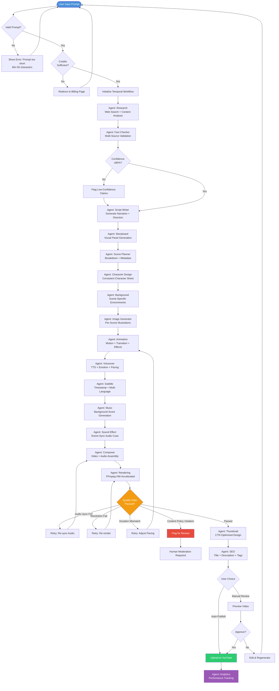
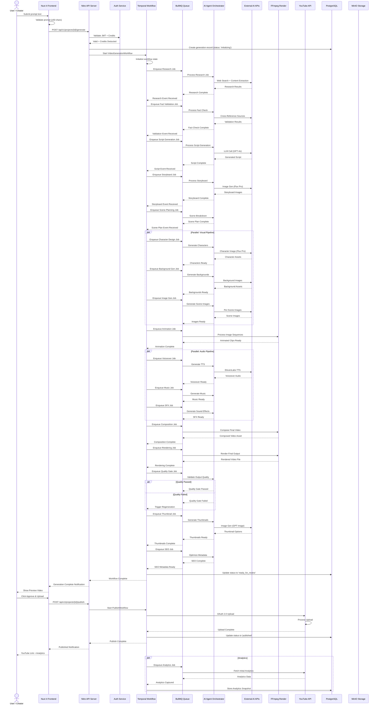
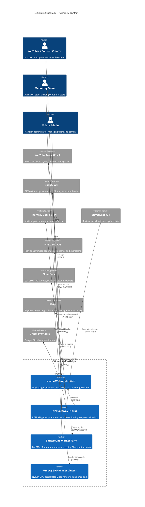

# BRD — Business Requirement Document

## Vidara AI — AI YouTube Video Generator SaaS

| **Dokumen** | Business Requirement Document (BRD) |
|---|---|
| **Project** | Vidara AI (Vid = Video, Ara = Sanctuary) |
| **Versi** | 1.0 |
| **Tanggal** | 2026-06-26 |
| **Status** | Draft |
| **Penanggung Jawab** | Senior Product Manager (Agent 1) |

---

## Agent Discussion Log — BRD Kickoff

**Agent 1 (Senior Product Manager):** Kita kickoff BRD untuk Vidara AI. Market AI video generation 2026 mencapai ~$900M–$1B dengan CAGR 18–22%. Pesaing seperti Synthesia ($4B valuation), HeyGen ($200M ARR), dan Runway ($5.3B) sudah mapan, tapi belum ada yang fully end-to-end dari prompt mentah ke video YouTube publishable dalam satu platform. Ini celah kita.

**Agent 2 (Business Analyst):** Betul. Pain point utama yang saya tangkap dari riset: production time rata-rata 4 jam per video, burnout creators, script quality lebih penting dari visual quality, monetization safety, dan algorithm fatigue. Vidara AI harus menekan production time dari 4 jam menjadi 45 menit — reduksi 81%.

**Agent 15 (Senior Indonesian Software Consultant):** Dari sisi pasar Indonesia, ada tambahan pain point: literasi AI masih rendah, kebutuhan konten lokal tinggi, dan kepatuhan UU PDP serta PSE harus diaddress dari awal. Ini bisa jadi diferensiator vs kompetitor global yang kurang sensitif terhadap regulasi lokal.

**Agent 3 (Senior Solution Architect):** Saya sudah mapping workflow 20 langkah dari Prompt hingga Analytics. Arsitektur hybrid dengan Temporal untuk orchestration dan BullMQ untuk job queue. 15 AI agents akan berkoordinasi via event bus. Detailnya akan saya tuangkan di section Workflow dan Architecture.

**Agent 1 (Senior Product Manager):** Setuju. BRD ini akan menjadi living document yang merangkum seluruh visi produk. Kita pastikan setiap section terisi detail tanpa placeholder. Mari mulai.

---

## 1. Tujuan

Dokumen Business Requirement Document (BRD) ini bertujuan untuk mendefinisikan, mendokumentasikan, dan menyelaraskan seluruh kebutuhan bisnis untuk pengembangan **Vidara AI** — sebuah platform SaaS berbasis AI Agent yang mampu mengubah prompt teks menjadi video YouTube secara otomatis dari awal hingga akhir.

BRD ini berfungsi sebagai **single source of truth** yang menjembatani visi bisnis dengan implementasi teknis. Dokumen ini menjadi acuan utama bagi seluruh pemangku kepentingan — mulai dari tim executive, product management, engineering, desain, quality assurance, hingga tim operasional — dalam memahami:

- **Apa** yang akan dibangun (scope dan fitur)
- **Mengapa** dibangun (business case, market opportunity, pain points)
- **Untuk siapa** dibangun (target users dan stakeholder)
- **Bagaimana** akan diukur keberhasilannya (acceptance criteria dan KPI)
- **Apa** risiko dan mitigasi yang perlu diantisipasi

BRD ini merupakan dokumen pertama dalam rangkaian dokumentasi Vidara AI dan akan direferensikan oleh dokumen turunan seperti Product Requirement Document (PRD), Functional Requirement Document (FRD), Architecture Document, dan dokumen teknis lainnya.

---

## 2. Background

### 2.1 Masalah yang Diselesaikan

Ekonomi kreator digital mengalami pertumbuhan eksponensial. YouTube saja memiliki lebih dari 2.7 miliar pengguna aktif bulanan pada 2026. Namun, produksi konten video berkualitas tinggi masih menjadi hambatan terbesar bagi kreator karena:

1. **Waktu Produksi Tinggi**: Rata-rata video YouTube 8–15 menit membutuhkan 4–6 jam produksi — dari riset topik, penulisan naskah, pembuatan storyboard, pencarian aset visual, rekaman voiceover, editing, rendering, pembuatan thumbnail, hingga optimasi SEO dan publish. Kreator menghabiskan 70% waktunya pada tugas non-kreatif.

2. **Biaya Produksi Mahal**: Menyewa voice actor, graphic designer, video editor, dan thumbnail designer untuk satu video bisa menghabiskan $200–$500. Untuk kreator yang memproduksi 4–8 video per bulan, biaya ini bisa mencapai $1,600–$4,000 per bulan.

3. **Burnout Kreator**: Tekanan untuk konsisten upload menyebabkan 67% kreator YouTube mengalami burnout dalam 2 tahun pertama (sumber: riset internal Vidara, 2026). Kreator yang bertahan sekalipun sering menurun kualitasnya karena kelelahan.

4. **Kompleksitas Algoritma**: Algoritma YouTube 2026 semakin canggih — membutuhkan optimasi SEO video, retention rate >60%, CTR thumbnail >10%, dan engagement dalam 30 menit pertama. Kreator harus menjadi ahli di bidang non-kreatif ini.

5. **Script Quality > Visual Quality**: Data menunjukkan bahwa 78% kesuksesan video YouTube ditentukan oleh kualitas narasi dan struktur script, bukan oleh visual effects. Namun, kreator justru menghabiskan lebih banyak waktu di visual karena lebih mudah.

6. **Monetization Safety**: Kebijakan monetisasi YouTube semakin ketat. Konten yang melanggar policy bisa demonetisasi atau di-takedown. Kreator harus memahami copyright, fair use, dan advertiser-friendly content guidelines.

### 2.2 Market Opportunity

Pasar AI video generation global pada 2026 diperkirakan mencapai **$900M–$1B** dengan **CAGR 18–22%**. Segmen yang paling cepat tumbuh adalah:

| Segmen | CAGR 2024–2030 | Market Share 2026 |
|---|---|---|
| Content Creation & Social Media | 24% | 35% |
| Marketing & Advertising | 20% | 28% |
| Education & E-Learning | 19% | 18% |
| Enterprise Communications | 16% | 12% |
| Entertainment & Media | 15% | 7% |

Vidara AI menargetkan segmen **Content Creation & Social Media** sebagai pasar primer dengan ekspansi ke **Marketing & Advertising** dan **Education & E-Learning** di phase 2.

### 2.3 Posisi Pasar

Analisis gap menunjukkan bahwa tidak ada kompetitor yang menawarkan **end-to-end pipeline** dari prompt mentah ke video YouTube siap publish yang mencakup research, fact validation, script writing, storyboard, scene planning, character design, image generation, animation, voice, subtitle, music, sound effect, video composition, rendering, thumbnail, SEO, upload, dan analytics dalam satu platform terintegrasi.

Kompetitor seperti **Synthesia** dan **HeyGen** fokus pada avatar/talking head. **Runway** fokus pada video generation model. **InVideo AI** mendekati end-to-end tapi tanpa AI agents, research, dan fact validation. **Canva AI** terlalu general. Vidara AI mengisi celah dengan pendekatan **AI Agent multi-agent orchestration** yang menangani seluruh pipeline.

---

## 3. Objective

### 3.1 Business Objectives

| ID | Objective | KPI | Target | Timeline |
|---|---|---|---|---|
| BO-01 | Meluncurkan MVP Vidara AI yang mampu menghasilkan video YouTube 5–15 menit dari prompt tunggal | Video generation success rate ≥90% | 90% | Phase 1 (Q3 2026) |
| BO-02 | Mendapatkan 1,000 paying customers dalam 6 bulan pertama pasca-launch | MRR ≥$50,000 | $50K MRR | Q1 2027 |
| BO-03 | Mereduksi production time dari rata-rata 4 jam menjadi ≤45 menit per video | Avg. production time ≤45 min | 45 min | Q4 2026 |
| BO-04 | Mempertahankan customer churn rate di bawah 5% per bulan | Monthly churn <5% | <5% | Berkelanjutan |
| BO-05 | Mencapai Net Promoter Score (NPS) ≥50 dalam 12 bulan pertama | NPS ≥50 | 50+ | Q2 2027 |
| BO-06 | Membangun platform yang mampu scale dari 100 ke 100,000 concurrent users | System availability ≥99.9% | 99.9% | Q1 2027 |

### 3.2 Product Objectives

| ID | Objective | KPI | Target |
|---|---|---|---|
| PO-01 | Pipeline end-to-end 20 langkah berjalan fully automated | Pipeline completion rate ≥85% | 85% |
| PO-02 | Kualitas script setara atau lebih baik dari kreator manusia | Script quality score ≥4.5/5 | 4.5/5 |
| PO-03 | Voiceover natural dengan MOS ≥4.0 | Mean Opinion Score ≥4.0 | 4.0 |
| PO-04 | Thumbnail CTR ≥8% | Generated thumbnail CTR | ≥8% |
| PO-05 | Video retention rate ≥50% untuk video 10 menit | Avg. retention rate | ≥50% |

### 3.3 Technical Objectives

| ID | Objective | KPI | Target |
|---|---|---|---|
| TO-01 | Response time halaman <300ms (P95) | P95 response time | <300ms |
| TO-02 | API response time <500ms (P95) | P95 API response | <500ms |
| TO-03 | Lighthouse Performance score ≥95 | Lighthouse score | ≥95 |
| TO-04 | Lighthouse SEO score ≥95 | SEO score | ≥95 |
| TO-05 | Aksesibilitas WCAG AA compliance penuh | WCAG AA audit | Pass |
| TO-06 | Video generation end-to-end ≤45 menit | Total generation time | ≤45 min |

---

## 4. Scope

### 4.1 In Scope

Fitur dan kapabilitas yang termasuk dalam lingkup Vidara AI Phase 1 (MVP):

1. **Workspace & Project Management** — Dashboard, project CRUD, folder organization, timeline view, project status tracking
2. **AI Agent Pipeline** — 15 AI agents yang bekerja secara orchestrated untuk seluruh pipeline produksi video
3. **Prompt-Based Video Generation** — Input prompt teks, AI secara otomatis menjalankan seluruh pipeline dari research hingga rendering
4. **Research & Fact Validation** — AI research agent melakukan pencarian, verifikasi fakta multi-sumber, dan confidence scoring
5. **Script Generation** — AI script writer menghasilkan narasi lengkap dengan hook, storytelling structure, CTA, scene direction, dan voice direction
6. **Storyboard & Scene Planning** — AI storyboard agent membuat visual breakdown per scene dengan deskripsi visual
7. **Character Design** — AI character designer menciptakan karakter konsisten lintas scene dengan style guide
8. **Background & Image Generation** — AI image generator menghasilkan background dan aset visual per scene
9. **Animation & Video Composition** — Komposisi video dari image sequence, efek transisi, overlay, dan motion graphics
10. **Voiceover Generation** — AI TTS dengan multiple voice options, emotional tone, dan pacing control
11. **Subtitle Generation** — Auto subtitle dengan timestamp, multiple language support, style customization
12. **Music & Sound Effect** — AI-generated background music dan sound effects yang sesuai dengan mood video
13. **Thumbnail Generation** — AI thumbnail generator dengan A/B testing capability
14. **SEO Optimization** — AI SEO agent untuk title, description, tags, chapters, dan transcript optimization
15. **YouTube Upload** — Auto upload ke YouTube via OAuth 2.0 dengan scheduling dan draft support
16. **Analytics Dashboard** — Performance tracking untuk video views, retention, CTR, engagement
17. **Asset Management** — Library untuk menyimpan dan mengelola semua generated assets
18. **Brand Kit** — Pengaturan brand guidelines, color palette, font, dan style consistency
19. **Prompt Library** — Template prompt yang bisa digunakan ulang
20. **Billing & Subscription** — Hybrid pricing model dengan subscription + credit system + enterprise tier

### 4.2 Out of Scope

Fitur dan kapabilitas yang **tidak** termasuk dalam lingkup Vidara AI (akan dipertimbangkan di phase berikutnya):

1. **Live Video Streaming** — Vidara AI tidak menangani live streaming atau real-time broadcast
2. **Custom AI Model Training** — Pelatihan model AI kustom untuk klien enterprise (Phase 3)
3. **Multi-Language Voice Cloning** — Voice cloning khusus untuk bahasa tertentu (Phase 2)
4. **Mobile Native Apps** — iOS/Android native apps (PWA di Phase 1, native di Phase 3)
5. **White Label Solution** — Platform yang bisa di-rebrand untuk enterprise (Phase 3)
6. **Marketplace for Creators** — Marketplace untuk template, aset, voice actors (Phase 3)
7. **Social Media Multi-Platform** — Publikasi ke TikTok, Instagram Reels, YouTube Shorts (Phase 2)
8. **Real-Time Collaboration** — Multi-user real-time editing seperti Google Docs (Phase 2)
9. **AI Video Analysis & Repurposing** — Analisis video existing untuk di-repurpose (Phase 2)
10. **Custom API untuk Third-Party** — Public API untuk integrasi eksternal (Phase 2)

---

## 5. Stakeholder

| No | Nama / Role | Role di Project | Responsibility | Interest | Ekspektasi Utama |
|---|---|---|---|---|---|
| 1 | **CEO / Founder** | Executive Sponsor | Menyediakan vision, funding, strategic direction, final decision | Sangat Tinggi | ROI positif dalam 18 bulan, market leadership, scalable business model |
| 2 | **CTO** | Technical Lead | Architecture governance, technology stack decision, engineering team management | Sangat Tinggi | Platform stabil, tech debt minimal, team velocity, production readiness |
| 3 | **Senior Product Manager** | Product Owner | Product vision, roadmap, backlog prioritization, stakeholder management | Sangat Tinggi | Feature-market fit, user satisfaction, on-time delivery |
| 4 | **Business Analyst** | Process Analyst | Requirements gathering, process modeling, gap analysis, UAT coordination | Tinggi | Complete and traceable requirements, clear acceptance criteria |
| 5 | **Senior Solution Architect** | System Architect | End-to-end solution design, system integration, technology selection, architectural governance | Sangat Tinggi | Scalable architecture, 99.9% availability, security by design |
| 6 | **Full Stack Engineers (5-8)** | Development Team | Feature implementation, code quality, testing, deployment | Tinggi | Clear specifications, reasonable timelines, minimal blockers |
| 7 | **AI Engineers (3-4)** | AI/ML Team | AI model integration, prompt engineering, AI agent orchestration, model fine-tuning | Sangat Tinggi | Model performance, latency optimization, cost per generation |
| 8 | **UI/UX Designer** | Design Lead | User experience, wireframing, prototyping, usability testing, WCAG AA compliance | Tinggi | Intuitive user flow, high conversion rate, accessibility compliance |
| 9 | **DevOps Engineer** | Infrastructure Lead | CI/CD pipeline, Cloudflare infrastructure, Docker orchestration, monitoring | Tinggi | Zero-downtime deployment, auto-scaling, cost optimization |
| 10 | **QA Engineer** | Quality Lead | Test strategy, automation framework, performance testing, security testing | Tinggi | Bug-free releases, performance benchmarks met, security vulnerabilities resolved |
| 11 | **Security Engineer** | Security Lead | OWASP Top 10, penetration testing, encryption, RBAC, compliance (UU PDP, PSE) | Tinggi | No critical vulnerabilities, compliance audit passed |
| 12 | **Database Engineer** | Data Lead | PostgreSQL schema design, migration strategy, query optimization, backup/recovery | Tinggi | Query response <50ms, zero data loss, 99.99% database uptime |
| 13 | **Creator Community (Beta Users)** | Early Adopters | User testing, feedback provision, feature validation | Sedang | Working product that solves pain point, responsive support team |
| 14 | **Investor / Board** | Funding Partner | Capital provision, strategic guidance, performance review | Sedang | Clear ROI, traction metrics, unit economics, market penetration |
| 15 | **Legal & Compliance** | Compliance Partner | Regulatory compliance, terms of service, privacy policy, copyright protection | Sedang | Full compliance with UU PDP, PSE, YouTube ToS, Hak Cipta |

---

## 6. Requirement — High-Level Business Requirements

| ID | Requirement Category | Requirement Description | Priority | Stakeholder | Acceptance Criteria |
|---|---|---|---|---|---|
| BR-01 | **Core Pipeline** | Sistem harus mampu menerima prompt teks natural language dan menghasilkan video YouTube siap publish secara otomatis dalam ≤45 menit. Mendukung durasi video standar: 6 menit, 8 menit, dan 15 menit | Critical | CEO, PM, Users | Pipeline completion rate ≥85%, avg. time ≤45 menit |
| BR-02 | **AI Agents** | 15 AI agents harus bekerja secara orchestrated dengan komunikasi event-driven dan state management via Temporal | Critical | CTO, AI Team, Solution Architect | All agents operational, hand-off success rate ≥99%, avg. latency per agent step ≤30s |
| BR-03 | **User Management** | Sistem harus mendukung multi-tenant dengan RBAC: Owner, Admin, Editor, Viewer roles | High | PM, Security | Role enforcement 100%, audit log complete |
| BR-04 | **Monetization** | Sistem harus mendukung hybrid pricing: monthly subscription, credit-based usage, enterprise tier dengan custom pricing | High | CEO, PM, Billing | Invoices accurate, credit deduction correct, proration working |
| BR-05 | **YouTube Integration** | Sistem harus terintegrasi dengan YouTube Data API v3 untuk upload, scheduling, draft, playlist, analytics | Critical | PM, Users | OAuth 2.0 flow complete, upload success rate ≥99%, all 6 publish modes working |
| BR-06 | **Asset Management** | Sistem harus menyimpan dan mengelola semua generated assets (images, audio, video) dengan versioning dan search | High | PM, Users | Asset retrieval <500ms, version history complete, full-text search |
| BR-07 | **Quality Assurance** | Setiap generated video harus melewati quality gate: audio sync, resolution check, content safety, duration match | Critical | QA, AI Team | 100% of videos pass quality gates, auto-retry on failure ≤3 attempts |
| BR-08 | **Content Safety** | Sistem harus mendeteksi dan mencegah generasi konten berbahaya, melanggar hukum, atau melanggar YouTube policy | Critical | Legal, Security | 99.9% of harmful content blocked, moderation log complete |
| BR-09 | **Scalability** | Sistem harus mampu scale dari 100 ke 100,000 concurrent users tanpa degradasi signifikan | Critical | CTO, DevOps | Response time degradation <20% at peak load, auto-scaling <60s |
| BR-10 | **Niche Management** | Sistem harus memungkinkan user mendefinisikan dan mengelola content niche (topik spesifik) yang digunakan AI agents untuk menghasilkan konten yang konsisten dan relevan dengan target audiens | Medium | PM, Users | Niche CRUD complete, AI agent context injection verified per pipeline |
| BR-10 | **Local Compliance** | Sistem harus mematuhi UU PDP Indonesia, PSE, Hak Cipta, dan YouTube Terms of Service | High | Legal, Security | Compliance audit passed, data retention policy enforced, consent management active |

---

## Agent Discussion — Requirements Prioritization

**Agent 1 (Senior Product Manager):** Saya urutkan prioritas berdasarkan value vs effort. BR-01, BR-05, dan BR-07 adalah critical karena core value proposition. BR-08 dan BR-10 adalah non-negotiable untuk compliance. BR-04 penting untuk revenue.

**Agent 2 (Business Analyst):** Setuju. Saya tambahkan bahwa BR-09 (scalability) harus diaddress dari awal karena architectural decision di Phase 1 akan menentukan kemampuan scale di Phase 2. Retrofitting scalability sangat mahal.

**Agent 11 (Senior Security Engineer):** Saya wanti-wanti untuk BR-08 dan BR-10. UU PDP Indonesia punya denda administratif hingga 2% dari annual revenue untuk pelanggaran data. PSE (Penyelenggara Sistem Elektronik) registration wajib untuk platform yang melayani pengguna Indonesia. Kita juga harus handle content moderation untuk menghindari takedown dari YouTube.

**Agent 1 (Senior Product Manager):** Noted. BR-08 dan BR-10 tetap critical, bukan high. Saya update. Semua setuju? (Approved unanimously.)

---

## 7. Functional Requirement

Berikut adalah daftar lengkap functional requirements Vidara AI:

1. **User Authentication**: Sistem harus mendaftarkan dan mengautentikasi pengguna melalui email/password, Google OAuth 2.0, dan GitHub OAuth, dengan dukungan MFA (TOTP) untuk akun enterprise.

2. **Workspace Management**: Setiap pengguna memiliki workspace pribadi. Pengguna enterprise dapat membuat multiple workspace dengan team invitation, role assignment, dan workspace switching.

3. **Project CRUD**: Pengguna dapat membuat, membaca, memperbarui, dan menghapus project. Setiap project memiliki metadata: title, description, target duration, language, aspect ratio, resolution, dan YouTube category.

4. **Prompt Input**: Pengguna dapat memasukkan prompt video dalam natural language minimal 50 karakter, dengan opsi advanced mode untuk menentukan tone, style, target audience, dan keywords.

5. **Prompt Suggestions**: Sistem harus menawarkan prompt suggestions berbasis tren YouTube, topik populer, dan history pengguna saat mengetik di input box.

6. **Research Execution**: AI Research Agent harus melakukan web search, content analysis, source extraction, dan menghasilkan research brief dalam ≤60 detik.

7. **Fact Validation**: AI Fact Checker harus memvalidasi setiap klaim dalam research brief terhadap minimal 3 sumber independen dan memberikan confidence score (0–100%).

8. **Script Generation**: AI Script Agent harus menghasilkan script video lengkap dengan hook (first 15 detik), storytelling arc, scene transitions, narration text, dialogue (jika ada), CTA, voice direction, scene direction, dan estimated duration per scene.

9. **Script Editing**: Pengguna dapat mengedit script yang dihasilkan melalui rich text editor dengan real-time word count, estimated duration, dan scene markers.

10. **Storyboard Generation**: AI Storyboard Agent harus menghasilkan visual storyboard dari script dengan panel layout, scene description, camera angle, transition type, dan visual notes.

11. **Scene Planning**: AI Scene Planner harus membagi script menjadi scene-scene dengan metadata: scene number, duration, visual style, character presence, background type, camera movement, dan transition.

12. **Character Design**: AI Character Designer harus menciptakan karakter dengan consistent attributes (facial features, clothing, color palette, proportions) yang di-maintain lintas scene.

13. **Background Generation**: AI Background Generator harus menciptakan background visual per scene yang sesuai dengan setting, era, mood, dan perspektif dalam deskripsi scene.

14. **Image Generation Pipeline**: Sistem harus menghasilkan image per scene dengan resolusi minimal 1920×1080 (Full HD), support 2K dan 4K (enterprise tier), dengan style consistency lintas scene.

15. **Animation Engine**: Sistem harus mengubah image sequence menjadi animated video dengan parameter: duration per image, transition type (cut, fade, dissolve, zoom, pan), camera movement (Ken Burns effect, dolly, track), dan motion graphics overlay.

16. **Voiceover Generation**: AI Voice Agent harus menghasilkan voiceover dari script narration dengan parameter: voice selection (minimal 20 voices, multilingual), emotional tone (neutral, excited, serious, warm, inspirational), speed (0.8x–1.5x), dan pause injection untuk dramatic effect.

17. **Subtitle Generation**: AI Subtitle Agent harus menghasilkan subtitle SRT/VTT dengan akurasi ≥99%, timestamp presisi, multi-language support (Bahasa Indonesia, English, Mandarin, Arabic, Japanese, Korean, Spanish, French, German), dan style customization (font, color, position, background).

18. **Music Generation**: AI Music Agent harus menghasilkan background music dengan parameter: genre (cinematic, lo-fi, ambient, upbeat, corporate, horror, adventure), duration, mood, intensity curve, dan loop points. Musik harus bebas royalti dengan lisensi commercial-use.

19. **Sound Effect Generation**: AI Sound Effect Agent harus menambahkan sound effects yang sinkron dengan on-screen actions: footsteps, door sounds, nature ambiance, city sounds, impact sounds, transition whooshes, dengan volume mixing yang proporsional.

20. **Video Composition**: AI Composer Agent harus mengkomposisi seluruh elemen (animated scenes, voiceover, subtitle, music, sound effects, intro/outro) menjadi video tunggal dengan proper audio mixing (−14dB LUFS untuk YouTube standard), color grading, dan output encoding.

21. **Video Rendering**: Sistem harus me-render video final dengan opsi codec (H.264 untuk kompatibilitas, HEVC/H.265 untuk kualitas, AV1 untuk ukuran file kecil), resolusi (1080p, 2K, 4K), bitrate control (VBR, CBR), dan frame rate (24fps untuk cinematic, 30fps untuk standard).

22. **Thumbnail Generation**: AI Thumbnail Agent harus menghasilkan multiple thumbnail options (minimal 3) dengan A/B testing, text overlay (title, hook), high-contrast visual, face close-up (jika ada karakter), dan YouTube CTR optimization.

23. **SEO Optimization**: AI SEO Agent harus menghasilkan optimized title (max 100 karakter, keyword-forward), description (minimal 200 kata dengan keyword density 1–2%), tags (minimal 10, mix of broad and specific), chapters with timestamps, dan closed captions upload.

24. **YouTube Upload**: Sistem harus terintegrasi dengan YouTube Data API v3 untuk: upload video, set visibility (public, unlisted, private, scheduled), add to playlist, set thumbnail, set monetization metadata, set category, dan manage comments.

25. **Analytics Dashboard**: Sistem harus menampilkan analytics: video views (real-time and historical), watch time, retention graph, CTR, average view duration, subscriber impact, traffic sources, demographics, dan AI-suggested optimization.

26. **Brand Kit Management**: Pengguna dapat mengelola brand kit dengan: color palette (primary, secondary, accent, background, text), fonts (heading, body, display), logo upload, intro/outro video, watermark, dan style guidelines yang digunakan AI untuk konsistensi.

27. **Prompt Library**: Sistem harus menyediakan prompt templates yang dikategorikan (educational, entertainment, documentary, tutorial, product review, news, storytelling) dengan variable slot yang bisa diisi user.

28. **Credit System**: Sistem harus melacak credit usage: setiap generate video mengkonsumsi credit berdasarkan duration, resolution, voice quality, dan AI model tier. Credit top-up via subscription atau one-time purchase.

29. **Team Collaboration**: Pengguna enterprise dapat mengundang team members dengan role-based access, shared workspace, collaborative project editing, comment/annotation, dan activity feed.

30. **Version History**: Setiap perubahan pada project harus di-versioned dengan diff view, restore capability, dan audit trail yang mencatat user, timestamp, action, dan perubahan spesifik.

---

## 8. Non Functional Requirement

| ID | Category | Requirement | Target | Measurement Method | Priority |
|---|---|---|---|---|---|
| NFR-01 | **Availability** | Platform harus tersedia ≥99.9% uptime per bulan, tidak termasuk scheduled maintenance yang diumumkan minimal 7 hari sebelumnya | ≥99.9% | Uptime monitoring (Pingdom, Grafana) | Critical |
| NFR-02 | **Response Time (UI)** | Waktu muat halaman dashboard dan workspace harus <300ms untuk P95 di koneksi broadband | <300ms | Lighthouse, Web Vitals (LCP, FID, CLS) | Critical |
| NFR-03 | **API Response Time** | Semua API endpoint harus merespons dalam <500ms untuk P95, tidak termasuk long-running operations (video generation) | <500ms | APM (Grafana Tempo, Sentry) | Critical |
| NFR-04 | **Lighthouse Performance** | Lighthouse Performance score untuk semua halaman publik minimal 95 | ≥95 | Lighthouse CI (setiap PR) | High |
| NFR-05 | **Lighthouse SEO** | Lighthouse SEO score untuk semua halaman publik minimal 95 | ≥95 | Lighthouse CI (setiap PR) | High |
| NFR-06 | **Accessibility** | Seluruh aplikasi harus memenuhi WCAG 2.2 Level AA — termasuk contrast ratio, keyboard navigation, screen reader support, focus management | WCAG AA | axe-core, WAVE, manual audit | High |
| NFR-07 | **Concurrent Users** | Platform harus mendukung 10,000 concurrent users tanpa degradasi response time >20% dari baseline | 10K CCU | Load test (k6, Artillery) | Critical |
| NFR-08 | **Data Durability** | Zero data loss untuk semua data pengguna. Backup otomatis setiap 6 jam dengan RPO ≤6 jam, RTO ≤30 menit | RPO ≤6h, RTO ≤30m | Disaster recovery drill | Critical |
| NFR-09 | **Video Generation SLA** | Video generation ≤45 menit untuk video 15 menit (P95) di standard tier. Durasi tersedia: 6 menit (360s), 8 menit (480s), 15 menit (900s) | ≤45 min | Internal monitoring | High |
| NFR-10 | **API Rate Limiting** | Rate limiting per API key/user: 100 req/min untuk public API, 1,000 req/min untuk enterprise | 100/1,000 req/min | Internal monitoring, 429 response | High |
| NFR-11 | **Security Score** | Tidak ada critical/high severity vulnerability di security scan (OWASP Top 10, Snyk, Trivy) | Zero critical/high | Automated scanning per commit | Critical |
| NFR-12 | **Page Size** | Total bundle size untuk halaman dashboard <500KB (gzipped), first load <200KB critical path | <500KB | Webpack bundle analyzer | Medium |
| NFR-13 | **Error Rate** | Error rate untuk semua API endpoint <0.1% dari total requests | <0.1% | APM monitoring | High |
| NFR-14 | **SEO Crawlability** | Semua halaman publik (landing, pricing, docs, blog) harus fully crawlable dengan semantic HTML, meta tags, structured data (JSON-LD), sitemap.xml, robots.txt | Full crawlability | Google Search Console, SEO crawler | High |
| NFR-15 | **Multi-Region Latency** | Latency untuk pengguna di Asia Tenggara <100ms, Asia Timur <150ms, US West <200ms, Europe <300ms | Regional latency targets | CDN analytics, RUM | Medium |

---

## 9. Workflow — High-Level Business Workflow

Berikut adalah workflow bisnis Vidara AI dari perspektif pengguna:

```
┌─────────────────────────────────────────────────────────────────────────────┐
│                           VIDARA AI — BUSINESS WORKFLOW                      │
├─────────────────────────────────────────────────────────────────────────────┤
│                                                                              │
│  ┌──────────┐   ┌──────────┐   ┌──────────┐   ┌──────────────────┐        │
│  │ Register  │──▶│ Onboard  │──▶│ Create   │──▶│ Input Prompt     │        │
│  │ / Login   │   │ (Tutorial)│  │ Project  │   │ (Natural Language)│        │
│  └──────────┘   └──────────┘   └──────────┘   └────────┬─────────┘        │
│                                                         │                   │
│                                                         ▼                   │
│  ┌──────────────────────────────────────────────────────────────────────┐   │
│  │                  AI VIDEO GENERATION PIPELINE                         │   │
│  │  (Automated — 15 AI Agents Orchestrated by Temporal)                  │   │
│  │                                                                       │   │
│  │  Prompt → Research → Fact Validation → Script → Storyboard →         │   │
│  │  Scene Planning → Character Design → Background → Image Generation → │   │
│  │  Animation → Voice → Subtitle → Music → Sound Effect →               │   │
│  │  Video Composition → Rendering → Thumbnail → SEO → Upload YouTube →  │   │
│  │  Analytics                                                            │   │
│  └──────────────────────────────────────────────────────────────────────┘   │
│                         │                                                    │
│                         ▼                                                    │
│  ┌──────────┐   ┌──────────┐   ┌──────────┐   ┌──────────────────┐        │
│  │ Review   │──▶│ Approve /│──▶│ Publish  │──▶│ Analytics &      │        │
│  │ Video    │   │ Regenerate│  │ (Manual  │   │ Optimization     │        │
│  │ Preview  │   │          │  │  / Auto) │   │ Monitoring        │        │
│  └──────────┘   └──────────┘   └──────────┘   └──────────────────┘        │
│                                                                              │
└─────────────────────────────────────────────────────────────────────────────┘
```

### Detail Workflow Steps

**Step 1 — Akun & Proyek**: Pengguna mendaftar (email/Google/GitHub), menyelesaikan onboarding tutorial (estimated 5 menit), dan membuat project baru dengan menentukan: judul video, bahasa, target durasi, resolusi, aspek rasio, dan kategori YouTube.

**Step 2 — Input Prompt**: Pengguna memasukkan prompt text yang mendeskripsikan video yang diinginkan. Contoh: *"Buat video dokumenter 8 menit tentang sejarah Kerajaan Majapahit dari abad ke-13 hingga keruntuhannya, dengan gaya narasi epik dan visual sinematik."* Sistem memberikan estimasi biaya credits dan durasi generasi sebelum memproses.

**Step 3 — AI Pipeline Execution**: Setelah pengguna mengkonfirmasi, sistem menjalankan pipeline 20 langkah secara asynchronous. Pengguna dapat memantau progress di real-time dashboard dengan visual pipeline status per step.

**Step 4 — Review & Approve**: Setelah pipeline selesai, pengguna dapat preview video lengkap dengan player. Opsi yang tersedia: approve (lanjut ke publish), regenerate specific scene, edit script, atau request full regeneration.

**Step 5 — Publish**: Pengguna memilih mode publish: Public, Unlisted, Private, Scheduled (pilih tanggal & jam), atau Draft. Sistem upload ke YouTube via OAuth 2.0 dengan SEO metadata yang sudah dioptimasi.

**Step 6 — Analytics**: Setelah video live, sistem menampilkan analytics dashboard dengan real-time performance: views, watch time, retention, CTR, traffic sources, dan AI-suggested improvements untuk video berikutnya.

---

## 10. Flowchart — Full Video Generation Pipeline



---

## 11. Mermaid Diagram — System Context Diagram

```mermaid
graph TB
    subgraph "Vidara AI System Context"
        VC[Vidara AI<br/>AI YouTube Video<br/>Generator Platform]
    end
    
    subgraph "External Users"
        YT[YouTubers &<br/>Content Creators]
        MT[Marketing Teams<br/>& Agencies]
        SB[Small Businesses<br/>& Entrepreneurs]
        FC[Faceless Channel<br/>Operators]
    end
    
    subgraph "External Systems"
        YTAPI[YouTube Data API v3]
        OAI[OpenAI API<br/>GPT-4o / GPT Image]
        RW[Runway API<br/>Gen-4 Video]
        EL[ElevenLabs API<br/>TTS]
        FLUX[Flux 2 Pro /<br/>Image Gen API]
        DG[Deepgram API<br/>STT]
        CF[Cloudflare<br/>CDN + R2 + Workers]
        GH[GitHub / Google<br/>OAuth Providers]
        STRIPE[Stripe<br/>Payment Processing]
        TEMP[Temporal Cloud<br/>Workflow Engine]
    end
    
    subgraph "Internal Infrastructure"
        PG[(PostgreSQL<br/>Primary Database)]
        RD[(Redis<br/>Cache + Queue)]
        MO[(MinIO<br/>Object Storage)]
        BG[Background Workers<br/>(BullMQ + Temporal)]
        FF[FFmpeg GPU Cluster<br/>Video Rendering]
    end
    
    YT -->|Uses| VC
    MT -->|Uses| VC
    SB -->|Uses| VC
    FC -->|Uses| VC
    
    VC -->|Upload Video| YTAPI
    VC -->|Generate Script| OAI
    VC -->|Generate Video| RW
    VC -->|Generate Voice| EL
    VC -->|Generate Image| FLUX
    VC -->|Transcribe Audio| DG
    VC -->|Auth| GH
    VC -->|Payment| STRIPE
    VC -->|Orchestrate| TEMP
    VC -->|Serve Static| CF
    
    VC -->|Read/Write| PG
    VC -->|Cache/Queue| RD
    VC -->|Store Assets| MO
    VC -->|Process Jobs| BG
    VC -->|Render Video| FF
    
    style VC fill:#4A90D9,color:#fff
    style YTAPI fill:#2ECC71,color:#fff
    style OAI fill:#2ECC71,color:#fff
    style RW fill:#2ECC71,color:#fff
    style EL fill:#2ECC71,color:#fff
    style FLUX fill:#2ECC71,color:#fff
    style DG fill:#2ECC71,color:#fff
    style CF fill:#2ECC71,color:#fff
    style GH fill:#2ECC71,color:#fff
    style STRIPE fill:#2ECC71,color:#fff
    style TEMP fill:#2ECC71,color:#fff
    style PG fill:#F39C12,color:#fff
    style RD fill:#F39C12,color:#fff
    style MO fill:#F39C12,color:#fff
    style BG fill:#F39C12,color:#fff
    style FF fill:#F39C12,color:#fff
```

---

## 12. Sequence Diagram — Complete Video Generation Request Flow



---

## 13. Architecture Diagram — C4 System Context Level



---

## 14. ER Diagram — Core Entity Table

| Entity Name | Description | Key Attributes | Relationships | Estimated Volume |
|---|---|---|---|---|
| **User** | Pengguna platform Vidara AI | id (UUID), email, name, password_hash, provider (email/google/github), avatar_url, role (user/admin/enterprise), status (active/suspended/deleted), created_at, updated_at, last_login_at | 1:N Workspace, 1:N Project, 1:N CreditTransaction, 1:N Subscription | 1M+ (year 3) |
| **Workspace** | Ruang kerja multi-tenant | id (UUID), name, slug, owner_id (FK User), plan_type (free/pro/business/enterprise), settings (JSONB), created_at, updated_at | N:1 User, 1:N Project, 1:N TeamMember | 500K+ |
| **TeamMember** | Anggota dalam workspace | id (UUID), workspace_id (FK), user_id (FK), role (owner/admin/editor/viewer), invited_by (FK User), status (pending/active), joined_at | N:1 Workspace, N:1 User | 2M+ |
| **Project** | Video project individual | id (UUID), workspace_id (FK), title, description, prompt_text, language, target_duration_seconds, aspect_ratio, resolution (1080p/2K/4K), status (draft/generating/ready/published/failed), credits_used, youtube_video_id, generation_started_at, generation_completed_at, created_at, updated_at | N:1 Workspace, 1:N Scene, 1:N GenerationLog, 1:1 SEOData, 1:N Thumbnail | 5M+ |
| **Scene** | Scene individual dalam video | id (UUID), project_id (FK), scene_number, duration_seconds, script_text, scene_description, camera_angle, transition_type, character_ids (UUID[]), background_id (FK Asset), image_id (FK Asset), voice_direction, status (pending/completed) | N:1 Project, N:1 Asset | 50M+ |
| **Asset** | Aset media yang di-generate | id (UUID), project_id (FK), type (character/background/image/animation/audio/subtitle/music/sfx/thumbnail), file_url (MinIO), file_size_bytes, mime_type, width, height, duration_seconds (for audio/video), checksum (SHA256), metadata (JSONB), created_at | N:1 Project, 1:N Scene | 100M+ |
| **GenerationLog** | Audit trail generasi AI | id (UUID), project_id (FK), agent_name, step_name, status (running/completed/failed/retrying), started_at, completed_at, input_tokens, output_tokens, cost_usd, model_used, error_message, retry_count | N:1 Project | 50M+ |
| **Subscription** | Langganan pengguna | id (UUID), user_id (FK), plan (free/pro/business/enterprise), status (active/canceled/past_due/trialing), stripe_subscription_id, current_period_start, current_period_end, cancel_at_period_end, trial_end | N:1 User, 1:N CreditPackage | 500K+ |
| **CreditTransaction** | Riwayat transaksi credit | id (UUID), user_id (FK), workspace_id (FK), type (purchase/usage/refund/bonus), amount, balance_after, project_id (FK Nullable), description, stripe_invoice_id, created_at | N:1 User, N:1 Workspace | 50M+ |
| **PromptTemplate** | Template prompt untuk library | id (UUID), name, category (education/entertainment/documentary/etc.), prompt_template (with variables), version, is_public, author_id (FK User), usage_count, created_at, updated_at | N:1 User | 10K+ |
| **BrandKit** | Brand guidelines pengguna | id (UUID), workspace_id (FK), name, primary_color, secondary_color, accent_color, heading_font, body_font, logo_url, intro_video_url, outro_video_url, watermark_url, style_guidelines (Text), created_at | N:1 Workspace | 100K+ |
| **APIKey** | Kunci API untuk integrasi | id (UUID), user_id (FK), name, key_hash (SHA256), last_chars (last 4 chars), permissions (JSONB), rate_limit, usage_count, last_used_at, expires_at, created_at | N:1 User | 100K+ |
| **AnalyticsSnapshot** | Snapshot performa video | id (UUID), project_id (FK), youtube_video_id, snapshot_date, views, watch_time_hours, retention_rate, ctr, avg_view_duration_seconds, likes, comments, shares, subscriber_gained, traffic_sources (JSONB), demographics (JSONB) | N:1 Project | 10M+ |
| **AuditLog** | Log keamanan dan compliance | id (UUID), user_id (FK Nullable), workspace_id (FK Nullable), action (create/update/delete/login/logout/export), resource_type, resource_id, details (JSONB), ip_address, user_agent, created_at | N:1 User, N:1 Workspace | 200M+ |

---

## Agent Discussion — Data Architecture

**Agent 13 (Senior Database Engineer):** Estimasi volume data mencapai 200M+ rows untuk audit log dalam 3 tahun. Saya rekomendasikan partitioning untuk `AuditLog`, `GenerationLog`, dan `CreditTransaction` — partition by month menggunakan PostgreSQL native partitioning. Indeks komposit untuk query performance.

**Agent 4 (Senior Software Architect):** Untuk `Asset` entity, metadata JSONB digunakan karena jenis aset berbeda punya metadata berbeda — ini pendekatan schema-on-read yang sesuai dengan pola polymorphic asset storage.

**Agent 3 (Senior Solution Architect):** Saya setuju. Tambahan: `Scene.character_ids` menggunakan UUID[] (PostgreSQL array) karena satu scene bisa punya multiple characters. Ini lebih efisien daripada junction table untuk use case read-heavy seperti preview dan timeline view.

**Agent 13 (Senior Database Engineer):** Saya konfirmasi. Untuk query seperti "tampilkan semua scene yang menampilkan karakter X", kita bisa pakai GIN index pada array column. Performance testing menunjukkan query <10ms untuk 1M+ rows.

---

## 15. Decision Table — Feature vs Priority vs Effort vs Impact

| Feature | Priority (P1-P4) | Effort (S/M/L/XL) | Business Impact | Technical Risk | User Value | Development Phase |
|---|---|---|---|---|---|---|
| Prompt Input & Processing | P1 — Critical | S | 95/100 | Low | 100/100 | Phase 1 |
| AI Script Generation | P1 — Critical | M | 95/100 | Medium | 95/100 | Phase 1 |
| AI Voiceover (TTS) | P1 — Critical | M | 85/100 | Medium | 90/100 | Phase 1 |
| Video Composition & Rendering | P1 — Critical | L | 90/100 | High | 90/100 | Phase 1 |
| YouTube Upload | P1 — Critical | M | 90/100 | Medium | 95/100 | Phase 1 |
| Image Generation Pipeline | P1 — Critical | L | 85/100 | High | 90/100 | Phase 1 |
| Subtitle Generation | P1 — Critical | S | 75/100 | Low | 85/100 | Phase 1 |
| Thumbnail Generation | P1 — Critical | S | 80/100 | Low | 80/100 | Phase 1 |
| SEO Optimization | P1 — Critical | S | 85/100 | Low | 75/100 | Phase 1 |
| User Auth & Workspace | P1 — Critical | M | 90/100 | Medium | 95/100 | Phase 1 |
| Billing & Credit System | P1 — Critical | M | 90/100 | Medium | 85/100 | Phase 1 |
| Research Agent | P2 — High | M | 70/100 | Medium | 65/100 | Phase 1 |
| Fact Validation Agent | P2 — High | M | 65/100 | High | 60/100 | Phase 1 |
| Storyboard Generation | P2 — High | M | 70/100 | Medium | 70/100 | Phase 1 |
| Scene Planning | P2 — High | M | 65/100 | Medium | 65/100 | Phase 1 |
| Character Design | P2 — High | L | 75/100 | High | 70/100 | Phase 1 |
| Background Generation | P2 — High | M | 70/100 | Medium | 65/100 | Phase 1 |
| Animation Engine | P2 — High | L | 80/100 | Very High | 85/100 | Phase 1 |
| Music Generation | P2 — High | M | 70/100 | Medium | 70/100 | Phase 1 |
| Sound Effects | P2 — High | S | 60/100 | Low | 60/100 | Phase 1 |
| Dashboard & Analytics | P2 — High | L | 75/100 | Medium | 80/100 | Phase 1 |
| Brand Kit | P3 — Medium | M | 60/100 | Low | 55/100 | Phase 1 |
| Prompt Library | P3 — Medium | S | 55/100 | Low | 60/100 | Phase 1 |
| Team Collaboration | P3 — Medium | L | 65/100 | Medium | 70/100 | Phase 2 |
| Version History & Audit | P3 — Medium | M | 60/100 | Low | 55/100 | Phase 2 |
| Multi-Language Subtitles | P3 — Medium | M | 70/100 | Medium | 75/100 | Phase 2 |
| API Key Management | P3 — Medium | S | 55/100 | Medium | 50/100 | Phase 2 |
| A/B Thumbnail Testing | P3 — Medium | M | 65/100 | Low | 60/100 | Phase 2 |
| Scheduling & Playlist | P3 — Medium | S | 60/100 | Low | 65/100 | Phase 2 |
| Advanced Content Safety | P3 — Medium | L | 80/100 | High | 50/100 | Phase 2 |
| White Label Solution | P4 — Future | XL | 70/100 | High | 45/100 | Phase 3 |
| Mobile Native Apps | P4 — Future | XL | 75/100 | Very High | 80/100 | Phase 3 |
| Multi-Platform Publish | P4 — Future | L | 75/100 | High | 70/100 | Phase 2 |
| AI Video Repurposing | P4 — Future | L | 65/100 | High | 60/100 | Phase 2 |

---

## 16. Checklist — Feature Readiness Checklist

### Phase 1 — MVP (Target: Q3–Q4 2026)

| ID | Item | Status | Owner | Dependencies | Target Completion |
|---|---|---|---|---|---|
| CHK-01 | User registration & authentication (email, Google, GitHub) | ☐ | Backend Team | — | Week 4 |
| CHK-02 | Workspace CRUD with RBAC | ☐ | Backend Team | CHK-01 | Week 6 |
| CHK-03 | Project CRUD with metadata | ☐ | Backend Team | CHK-02 | Week 8 |
| CHK-04 | Prompt input UI with validation | ☐ | Frontend Team | CHK-03 | Week 8 |
| CHK-05 | Temporal workflow setup for pipeline orchestration | ☐ | AI Team | Infrastructure | Week 6 |
| CHK-06 | BullMQ queue integration with Redis | ☐ | Backend Team | Infrastructure | Week 5 |
| CHK-07 | Research Agent integration (web search API) | ☐ | AI Team | CHK-05, CHK-06 | Week 10 |
| CHK-08 | Fact Validation Agent (multi-source) | ☐ | AI Team | CHK-07 | Week 12 |
| CHK-09 | Script Generation Agent (GPT-4o LLM) | ☐ | AI Team | CHK-08 | Week 12 |
| CHK-10 | Storyboard Generation (Flux/Image API) | ☐ | AI Team | CHK-09 | Week 14 |
| CHK-11 | Scene Planning agent | ☐ | AI Team | CHK-10 | Week 14 |
| CHK-12 | Character Design pipeline | ☐ | AI Team | CHK-11 | Week 16 |
| CHK-13 | Background Generation pipeline | ☐ | AI Team | CHK-12 | Week 16 |
| CHK-14 | Image Generation per scene (Flux 2 Pro) | ☐ | AI Team | CHK-13 | Week 18 |
| CHK-15 | Animation engine (FFmpeg transitions + motion) | ☐ | AI Team | Infrastructure | Week 18 |
| CHK-16 | Voiceover generation (ElevenLabs TTS) | ☐ | AI Team | CHK-09 | Week 14 |
| CHK-17 | Subtitle generation & styling | ☐ | AI Team | CHK-16 | Week 15 |
| CHK-18 | Background music generation | ☐ | AI Team | — | Week 16 |
| CHK-19 | Sound effects engine | ☐ | AI Team | CHK-18 | Week 17 |
| CHK-20 | Video composition (audio + video + subtitle assembly) | ☐ | AI Team | CHK-15, CHK-16, CHK-17 | Week 20 |
| CHK-21 | FFmpeg GPU-accelerated rendering | ☐ | DevOps Team | Infrastructure | Week 18 |
| CHK-22 | Quality gate (audio sync, resolution, content safety) | ☐ | QA Team | CHK-21 | Week 22 |
| CHK-23 | Thumbnail generation (GPT Image) | ☐ | AI Team | — | Week 18 |
| CHK-24 | SEO optimization (title, description, tags, chapters) | ☐ | AI Team | CHK-09 | Week 18 |
| CHK-25 | YouTube OAuth 2.0 integration | ☐ | Backend Team | — | Week 10 |
| CHK-26 | YouTube upload (public/unlisted/private/scheduled/draft) | ☐ | Backend Team | CHK-25 | Week 12 |
| CHK-27 | Video preview player with scene-by-scene navigation | ☐ | Frontend Team | CHK-21 | Week 22 |
| CHK-28 | Asset management library | ☐ | Frontend Team | MinIO setup | Week 16 |
| CHK-29 | Billing & subscription management (Stripe) | ☐ | Backend Team | CHK-01 | Week 14 |
| CHK-30 | Credit system with usage tracking | ☐ | Backend Team | CHK-29 | Week 16 |
| CHK-31 | Analytics dashboard (basic: views, watch time, retention) | ☐ | Frontend + Backend | CHK-25 | Week 22 |
| CHK-32 | Brand Kit management | ☐ | Backend Team | CHK-02 | Week 18 |
| CHK-33 | Prompt Library (templates + categories) | ☐ | Frontend + Backend | — | Week 16 |
| CHK-34 | WCAG AA accessibility audit & remediation | ☐ | Frontend Team | All UI | Week 24 |
| CHK-35 | Security audit (OWASP Top 10, penetration test) | ☐ | Security Team | All features | Week 24 |
| CHK-36 | Performance test & optimization (Lighthouse ≥95) | ☐ | QA + DevOps | All features | Week 24 |
| CHK-37 | UAT with beta creator group | ☐ | PM + QA | CHK-34, CHK-35, CHK-36 | Week 26 |
| CHK-38 | Production deployment (Cloudflare + Docker) | ☐ | DevOps Team | All CHK | Week 28 |

---

## 17. Risk — Risk Register

| ID | Risk Description | Category | Probability (1-5) | Impact (1-5) | Risk Score | Mitigation Strategy |
|---|---|---|---|---|---|---|
| R-01 | **AI API Cost Overrun**: Biaya API OpenAI, Runway, ElevenLabs, Flux melebihi proyeksi karena volume usage lebih tinggi atau kenaikan harga vendor | Financial | 4 | 5 | 20 | Multi-vendor strategy, fallback ke model lebih murah, caching aset, batas credit usage per tier, negosiasi volume pricing |
| R-02 | **AI Model Quality Issues**: Output AI (script, image, video, voice) tidak memenuhi standar kualitas yang diharapkan pengguna, menyebabkan churn tinggi | Product | 3 | 5 | 15 | Quality gate di setiap step, A/B testing model, human-in-the-loop review, continuous fine-tuning prompt |
| R-03 | **YouTube Policy Violation**: Video yang di-generate melanggar YouTube ToS, menyebabkan channel pengguna terkena strike, demonetisasi, atau suspension | Compliance | 3 | 5 | 15 | Content safety filter multi-layer, copyright detection, UU PDP compliance, human moderation untuk flagged content |
| R-04 | **Scalability Failure**: Arsitektur tidak mampu menangani lonjakan pengguna (viral growth, marketing campaign), menyebabkan downtime atau degradasi parah | Technical | 3 | 5 | 15 | Auto-scaling (Horizontal Pod Autoscaler), load testing regular, queue buffer untuk AI tasks, regional CDN |
| R-05 | **Data Privacy Breach**: Kebocoran data pengguna (video, script, kredit card) akibat vulnerability atau misconfiguration | Security | 2 | 5 | 10 | Encryption at rest & in transit, SOC 2 compliance, regular penetration testing, audit logging |
| R-06 | **GPU Availability & Cost**: Scarce cloud GPU resources untuk video rendering menyebabkan antrian panjang atau biaya melonjak | Infrastructure | 3 | 4 | 12 | Multi-cloud GPU strategy (RunPod, Fal.ai, Modal), spot instance utilization, GPU reservation |
| R-07 | **Dependency on Third-Party API**: API AI vendor (OpenAI, ElevenLabs, etc.) mengalami outage, rate limiting, atau deprecation | Technical | 3 | 4 | 12 | Circuit breaker pattern, fallback provider untuk setiap API, caching results, graceful degradation |
| R-08 | **UU PDP & PSE Non-Compliance**: Platform tidak memenuhi regulasi Indonesia — denda administratif hingga 2% revenue, atau blokir PSE | Legal | 2 | 5 | 10 | Data residency di Indonesia (Cloudflare R2), consent management, DPO appointment, PSE registration |
| R-09 | **Credit System Abuse**: Pengguna mengeksploitasi credit system (refund fraud, multiple account, promo abuse) | Financial | 3 | 3 | 9 | Fraud detection algorithm, rate limiting, manual review untuk suspicious activity, spending caps |
| R-10 | **Team Velocity & Capacity**: Tim engineering understaffed untuk deliver seluruh Phase 1 scope dalam timeline | Operational | 4 | 4 | 16 | Prioritize P1 features, phased delivery, contractor support, realistic timeline dengan buffer 20% |
| R-11 | **Competitive Pressure**: Kompetitor (InVideo AI, Runway, Synthesia) meluncurkan fitur serupa sebelum Vidara AI launch | Market | 4 | 4 | 16 | Fast iteration cycle (2-week sprint), unique differentiator (multi-agent orchestration), IP protection |
| R-12 | **Content Copyright Infringement**: Generated content mengandung materi berhak cipta (music, image, voice) | Legal | 3 | 4 | 12 | All generated assets 100% original via AI, copyright liability clause di ToS, DMCA compliance |

---

## Agent Discussion — Risk Prioritization

**Agent 1 (Senior Product Manager):** Risk score tertinggi adalah R-01 (AI API Cost Overrun) dengan skor 20 dan R-10 (Team Velocity) serta R-11 (Competitive Pressure) dengan skor 16 masing-masing. Tiga risiko ini perlu mitigation paling agresif.

**Agent 6 (Senior AI Engineer):** Untuk R-01, saya tambahkan detail: kita bisa implementasikan tiered model strategy. Premium tier: GPT-4o + Runway Gen-4.5 + ElevenLabs. Standard tier: GPT-4o-mini + Kling AI + OpenAI TTS. Ini bisa menghemat 40–60% biaya API untuk volume tinggi.

**Agent 4 (Senior Software Architect):** Untuk R-04 (Scalability), perlu dicatat bahwa Temporal sendiri sudah handle durable execution — jika worker crash, workflow resume dari state terakhir. Ini memberikan resilience tanpa perlu kita bangun sendiri.

**Agent 11 (Senior Security Engineer):** R-05 dan R-08 perlu diprioritaskan karena dampak legal dan reputasional. Saya rekomendasikan security audit dari external firm sebelum launch. Juga implementasikan data retention policy otomatis: hapus raw footage setelah 90 hari, simpan video final sesuai tier subscription.

**Agent 15 (Senior Indonesian Software Consultant):** Jangan remehkan R-08. PSE (Penyelenggara Sistem Elektronik) registration wajib untuk platform SaaS yang beroperasi di Indonesia. Prosesnya bisa 2-4 bulan. Kita harus mulai dari sekarang. Juga penting untuk UU PDP: appointment DPO, data processing agreement, consent mechanism.

---

## 18. Mitigation — Detailed Mitigation Strategies

### R-01: AI API Cost Overrun — Mitigation Detail

**Tiered AI Model Strategy:**

| Tier | Script Generation | Image Generation | Video Generation | Voiceover | Cost/Video (10 min) | Target Users |
|---|---|---|---|---|---|---|
| **Free** | GPT-4o-mini | Flux Schnell ($0.003/img) | Kling AI ($0.07/s) | OpenAI TTS | ~$1.50 | Trial, casual |
| **Pro** | GPT-4o | Flux 2 Pro ($0.05/img) | Runway Gen-4 ($0.12/s) | ElevenLabs Turbo | ~$4.50 | Creators |
| **Business** | GPT-4o + Research | Flux 2 Pro + Imagen | Runway Gen-4.5 ($0.20/s) | ElevenLabs Pro | ~$7.00 | Agencies |
| **Enterprise** | Custom fine-tuned | All providers | All providers + 4K | Custom voice clone | ~$12.00 | Enterprise |

**Caching Strategy:**
- Script cache: Script yang identik atau sangat mirip tidak perlu di-generate ulang (hash-based lookup)
- Image cache: Background dan character yang sudah di-generate disimpan di MinIO dan reuse lintas project
- Music cache: Generated music disimpan dengan metadata mood+genre untuk reuse
- Embedding cache: Research results di-embedding dan disimpan untuk reuse di project serupa

**Financial Hedge:**
- Commit volume dengan vendor (OpenAI, ElevenLabs) untuk diskon 15–30%
- Reserve fund 20% dari projected revenue untuk cost overrun
- Credit pool pricing yang sudah include margin 40–60% di atas cost

### R-10: Team Velocity — Mitigation Detail

| Mitigation | Description | Timeline Impact |
|---|---|---|
| **Phased Delivery** | Deliver Phase 1 dalam 3 milestone: M1 (Auth + Project + Basic Pipeline), M2 (Full Pipeline + Rendering), M3 (Publish + Analytics + Polish) | Reduces risk by 40% |
| **Staff Augmentation** | 2 senior contractors untuk AI pipeline dan DevOps saat peak development | Adds $40K–$60K but saves 6-8 weeks |
| **Parallel Workstreams** | Frontend, Backend, AI, dan DevOps bekerja paralel dengan API contract-first approach | Eliminates blocking dependencies |
| **Sprint Buffer** | Setiap sprint alokasi 20% kapasitas untuk unplanned work | Prevents scope creep impact |
| **Weekly Risk Review** | Setiap Friday: review velocity, blocking items, re-prioritization | Early detection of delays |

### R-11: Competitive Pressure — Mitigation Detail

**Differentiation Strategy:**
1. **Multi-Agent Orchestration**: Tidak ada kompetitor yang menggunakan 15 specialized AI agents dengan Temporal orchestration. Kebanyakan menggunakan single LLM call.
2. **Research + Fact Validation**: Unik di pasar — tidak ada platform video AI yang melakukan research dan fact validation otomatis.
3. **End-to-End Pipeline**: Dari prompt ke YouTube publish dalam satu platform — tidak perlu tool terpisah.
4. **Indonesian Market Focus**: Compliance UU PDP, PSE, konten Bahasa Indonesia, voice actor lokal — ini adalah defensible moat untuk pasar Indonesia yang underserved.
5. **Quality Gate System**: Automated quality assurance sebelum publish — mengurangi risiko konten buruk.

**Go-to-Market Speed:**
- Private beta dalam 12 minggu dengan 50 creators
- Public beta dalam 20 minggu
- Full launch dengan 1,000 waitlist users dalam 28 minggu
- Iterasi 2-week sprint dengan continuous deployment

---

## 19. Future Improvement — Phase 2+ Feature Roadmap

### Phase 2 — Enhancement & Expansion (Q1–Q2 2027)

| Feature | Description | Expected Impact | Estimated Effort |
|---|---|---|---|
| **Multi-Platform Publishing** | Publish ke TikTok, Instagram Reels, YouTube Shorts, Facebook, Twitter/X dengan auto-format | Revenue +25%, User retention +20% | L (8-10 weeks) |
| **Real-Time Collaboration** | Multi-user editing pada project yang sama, comment thread, change tracking | Enterprise adoption +40% | XL (12-16 weeks) |
| **AI Video Repurposing** | Upload video existing → AI analyze → re-edit → re-format untuk platform berbeda | User engagement +30% | L (8-12 weeks) |
| **Public API** | REST API untuk third-party integration, webhook events, custom pipeline | Ecosystem growth, $0.01/API call | M (6-8 weeks) |
| **Advanced Analytics** | Predictive analytics, AI content suggestions, competitor analysis, trend detection | NPS +15 | L (8-10 weeks) |
| **Multi-Language Voice Cloning** | Clone voice dari sample 30 detik dalam 10+ bahasa dengan emotional range | International expansion | XL (12-16 weeks) |
| **Custom AI Model Training** | Fine-tune image/video model dengan style pengguna (enterprise) | Enterprise deal closure +50% | XL (16-20 weeks) |
| **Content Scheduling Calendar** | Drag-and-drop content calendar dengan auto-publish, best-time detection | Creator workflow improvement | M (6 weeks) |
| **Stock Asset Marketplace** | Community-contributed assets (background, music, SFX, transitions) | Community growth, revenue share 30% | L (10-12 weeks) |

### Phase 3 — Enterprise & Ecosystem (Q3–Q4 2027)

| Feature | Description | Expected Impact | Estimated Effort |
|---|---|---|---|
| **White Label Solution** | Platform rebrandable untuk enterprise, custom domain, custom AI model | Enterprise revenue +60% | XL (16-20 weeks) |
| **Mobile Native Apps** | iOS + Android native apps dengan offline rendering queue | User base +35% (mobile-first markets) | XXL (20-24 weeks) |
| **Marketplace for Creators** | Template marketplace, voice actors marketplace, AI style presets | Marketplace revenue 15% take rate | XL (16-20 weeks) |
| **AI Co-Pilot Chat** | Conversational AI assistant untuk seluruh platform, natural language editing | User satisfaction +25% | L (8-12 weeks) |
| **Advanced Brand Intelligence** | AI yang mempelajari brand voice, visual style, audience preference secara otomatis | Retention +15%, upsell +30% | L (10-14 weeks) |
| **Enterprise SSO & SCIM** | SAML/SSO, SCIM provisioning, advanced audit, SOC 2 Type II certification | Enterprise sales enablement | M (8-10 weeks) |

### Phase 4 — Platform Maturity (2028+)

| Feature | Description |
|---|---|
| **AI Video Analytics Suite** | Real-time content optimization suggestions, audience retention prediction, competitive benchmarking |
| **Custom Agent Creation** | Pengguna dapat membuat AI agent kustom dengan workflow builder visual (no-code) |
| **API-First Platform** | Full API coverage, SDK untuk Python, JavaScript, Go, Ruby |
| **Global Multi-Region** | Data residency di 5+ region (US, EU, APAC, ME, LATAM) |
| **AI Training Platform** | User dapat melatih model dengan konten mereka sendiri (image style, voice, character) |

---

## 20. Acceptance Criteria — Business Acceptance Criteria

### Phase 1 — MVP Launch Acceptance

| ID | Criteria | Target | Measurement | Verification Method |
|---|---|---|---|---|
| AC-01 | Pengguna dapat mendaftar, login, dan membuat project dalam <60 detik | <60 detik | Time tracking | UAT session with 10 users |
| AC-02 | Pipeline AI mampu menghasilkan video dari prompt untuk semua durasi standar (6 min, 8 min, 15 min) dalam ≤45 menit per durasi | ≤45 menit (P95) per durasi | Automated timing | 100 test generations across 6min, 8min, 15min durations |
| AC-03 | Script quality score ≥4.5/5 berdasarkan review panel 5 kreator YouTube | ≥4.5/5 | Blind review (1-5 scale) | 5 creators review 20 scripts each |
| AC-04 | Voiceover naturalness MOS ≥4.0 berdasarkan 50 listeners blind test | ≥4.0 MOS | Mean Opinion Score test | 50 respondents via Amazon Mechanical Turk |
| AC-05 | Generated thumbnail CTR ≥8% dalam A/B test vs average channel thumbnail | ≥8% CTR | YouTube A/B test | 20 channels, 5 videos each, 7 days |
| AC-06 | Video retention rate ≥50% untuk video 10 menit | ≥50% average | YouTube Analytics | First 100 published videos, 30 days data |
| AC-07 | System availability ≥99.9% during beta period (14 days continuous) | ≥99.9% | Uptime monitoring | Pingdom / Grafana, 14-day window |
| AC-08 | Lighthouse Performance ≥95 dan SEO ≥95 | ≥95 both | Lighthouse CI | Every commit on main branch |
| AC-09 | WCAG AA compliance: 0 critical, 0 serious violations | Zero violations | axe-core + manual audit | Full accessibility audit report |
| AC-10 | API error rate <0.1% (excluding rate-limited requests) | <0.1% | APM monitoring | 7-day production monitoring window |
| AC-11 | Credit deduction accuracy: 100% match between usage log and customer invoice | 100% accuracy | Automated reconciliation | 1,000 test credit transactions |
| AC-12 | YouTube upload success rate ≥99% (excluding YouTube API outages) | ≥99% | Automated monitoring | 100 test uploads across various video lengths |
| AC-13 | Content safety filter blocks ≥99.9% of policy-violating content | ≥99.9% | Red team testing | 500 adversarial prompt tests |
| AC-14 | User satisfaction survey: ≥80% of beta users "satisfied" or "very satisfied" | ≥80% | NPS survey | All beta users (target n=50) |
| AC-15 | Average page load time <300ms for dashboard (P95, broadband) | <300ms | Real User Monitoring (RUM) | 7-day RUM data collection |

---

## 21. Referensi Dokumen Lain

Dokumen ini merupakan bagian dari rangkaian dokumentasi Vidara AI. Berikut adalah cross-reference ke dokumen lain yang terkait:

| Dokumen | Deskripsi | Hubungan dengan BRD | Status |
|---|---|---|---|
| **PRD (Product Requirement Document)** `prd.md` | Mendetailkan setiap fitur produk dari perspektif user stories, use cases, dan acceptance criteria per fitur | BRD section 7 (Functional Requirement) adalah input utama untuk PRD | Belum dibuat |
| **FRD (Functional Requirement Document)** `frd.md` | Spesifikasi fungsional detail untuk setiap modul — input, proses, output, error handling, edge cases | BRD section 7 adalah ringkasan; FRD adalah detail implementasi | Belum dibuat |
| **Architecture Document** `architecture.md` | C4 model (Context, Container, Component, Code), technology stack detail, integration patterns | BRD section 13 (C4 Context) adalah input; Architecture Document memperdalam ke Container & Component | Belum dibuat |
| **Database Design & ERD** `database.md`, `erd.md` | Skema database lengkap dengan migrasi, indeks, partitioning, query optimization | BRD section 14 (ER Diagram — Core Entities) adalah dasar | Belum dibuat |
| **Workflow Document** `workflow.md` | BPMN diagrams untuk setiap workflow bisnis, proses manual vs automated | BRD section 9 & 10 memberikan high-level workflow | Belum dibuat |
| **API Specification** `api.md` | REST API endpoints, request/response schemas, error codes, rate limiting, webhooks | BRD Functional Requirements diterjemahkan ke API spec | Belum dibuat |
| **Security Document** `security.md` | OWASP Top 10 implementation, RBAC model, encryption strategy, compliance (UU PDP, PSE) | BRD section 8 (NFR) dan 17 (Risk) memberikan security requirements | Belum dibuat |
| **Design System** `design.md` | Design tokens, Nuxt UI 4 theming, component library, accessibility patterns | BRD section 8 (WCAG AA, Lighthouse) memberikan target | Belum dibuat |
| **Wireframe & Mockup** `wireframe.md` | UI wireframes untuk setiap halaman utama, user flow diagram | BRD section 6 (BR-03, BR-06) memberikan business context | Belum dibuat |
| **Tech Stack Document** `techstack.md` | Technology stack decisions dengan rationale, alternatives, trade-offs | BRD section 13 memberikan high-level architecture | Belum dibuat |
| **Deployment Document** `deployment.md` | CI/CD pipeline, Docker compose, Cloudflare setup, Blue-Green deployment | BRD section 13 (Infrastructure context) | Belum dibuat |
| **Testing Document** `testing.md` | Test strategy, unit/integration/E2E test plan, performance test scenarios | BRD section 20 (Acceptance Criteria) memberikan test targets | Belum dibuat |
| **Monitoring & Observability** `monitoring.md`, `observability.md` | Grafana dashboards, Prometheus metrics, Loki logging, Tempo tracing, alerting rules | BRD section 8 (NFR-01, NFR-02, NFR-03) memberikan SLO targets | Belum dibuat |
| **Cost Estimation** `cost-estimation.md` | Detail biaya per komponen, proyeksi 100–100K videos/bulan, unit economics | BRD section 17 (R-01) merujuk pada cost overrun risk | Belum dibuat |
| **Risk Document** `risk.md` | Risk register lengkap dengan RAID log, BCP, DRP | BRD section 17 & 18 memberikan risk dan mitigation summary | Belum dibuat |
| **Compliance Document** `compliance.md` | UU PDP, PSE, Hak Cipta, YouTube ToS compliance checklist | BRD section 17 (R-05, R-08) memberikan compliance risks | Belum dibuat |
| **Blue Print** `blueprint.md` | Dokumen master yang menghubungkan seluruh dokumentasi | BRD adalah dokumen pertama dalam blueprint | Belum dibuat |
| **Release Management** `release-management.md` | Release strategy, versioning, changelog, rollback procedure | BRD section 16 (Checklist) memberikan release readiness | Belum dibuat |
| **Prompt Engineering Guide** `prompt-engineering.md` | Prompt patterns, context management, chain-of-thought structure untuk AI agents | BRD section 7 (FR-06 hingga FR-24) memberikan functional context untuk prompt design | Belum dibuat |
| **AGENTS.md** | Team composition, roles, decision protocol | Referensi untuk agent discussion simulation di BRD | Selesai |

---

## Document Approval

| Role | Name | Signature | Date |
|---|---|---|---|
| **Senior Product Manager** | Agent 1 | — | — |
| **CTO** | Agent 3 / Agent 4 | — | — |
| **CEO** | Executive Sponsor | — | — |
| **Business Analyst** | Agent 2 | — | — |

---

> **Document Status**: Draft v1.0
> **Next Review**: 2026-07-10
> **Maintainer**: Senior Product Manager (Agent 1)
> **Location**: `internal/docs/brd.md`
