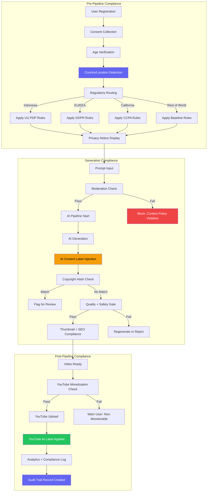
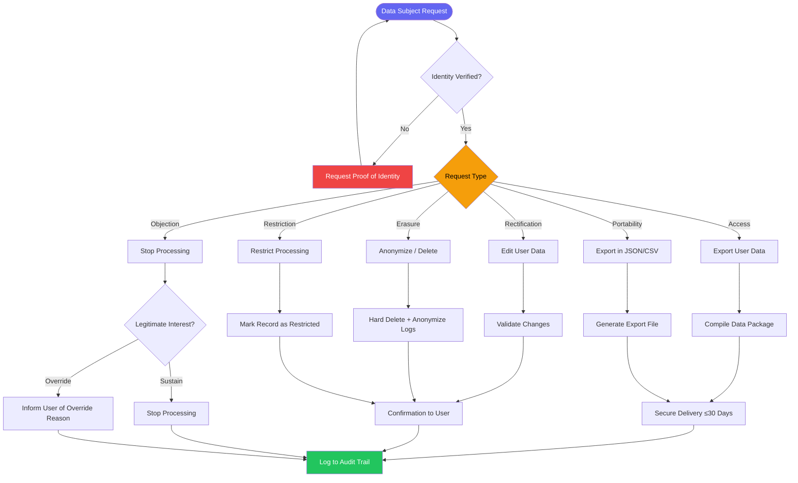
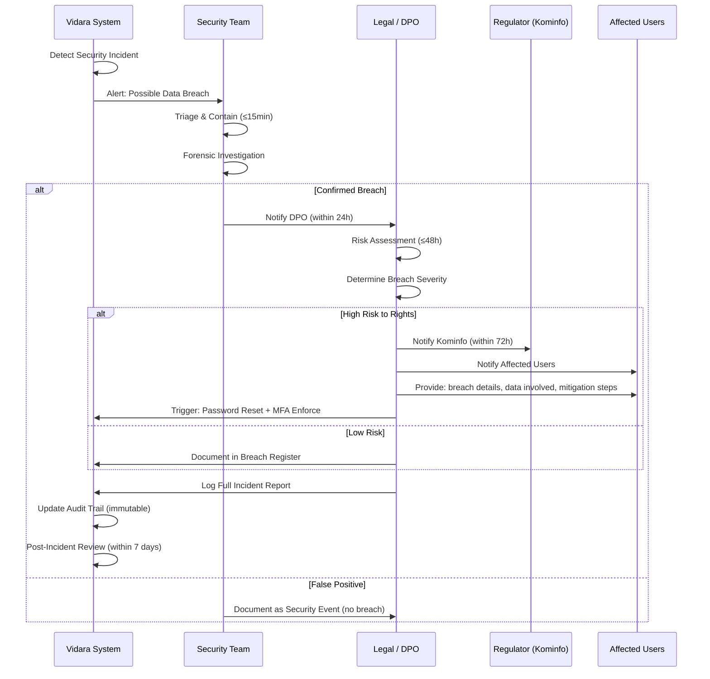

# Compliance & Regulatory Document — Vidara AI

> **Project:** Vidara AI — AI YouTube Video Generator SaaS  
> **Author:** Agent 11 — Senior Security Engineer, Legal & Compliance Team  
> **Last Updated:** 2026-06-26  
> **Status:** Draft  
> **Cross-Reference:** [BRD](brd.md) · [Deployment](deployment.md) · [Architecture](architecture.md) · [ERD](erd.md) · [Security](security.md)

---

## 1. Tujuan

Dokumen Compliance & Regulatory ini mendefinisikan secara komprehensif seluruh kewajiban kepatuhan hukum, regulasi, dan standar internasional yang berlaku untuk **Vidara AI** — platform AI YouTube Video Generator SaaS yang melayani pasar Indonesia dan global. Mencakup 6 domain regulasi: Indonesia (UU PDP, UU ITE, UU Hak Cipta, PSE, Kominfo AI Ethics), YouTube Compliance, International Standards (SOC 2, ISO 27001, ISO 42001, GDPR, CCPA), AI-Specific Compliance (EU AI Act), Data Governance, dan Audit Trail. Bertujuan menjadi acuan utama bagi Legal, Security, Engineering, dan Product teams dalam memastikan platform beroperasi secara lawful, etis, dan siap audit.

---

## 2. Background

Vidara AI beroperasi di persimpangan tiga domain regulasi yang kompleks: (1) **Regulasi AI** yang berkembang cepat — EU AI Act 2024 berlaku efektif 2026, Indonesia Kominfo Circular Letter on AI Ethics 2025, (2) **Regulasi Data** — UU PDP Indonesia Law No. 27/2022, GDPR, CCPA, dan (3) **Regulasi Platform** — YouTube Terms of Service, PSE Kominfo. Kegagalan kepatuhan pada salah satu domain dapat menyebabkan: denda administratif hingga 2% dari annual revenue (UU PDP), pemblokiran platform (PSE), demonetisasi channel (YouTube), atau larangan operasi di yurisdiksi tertentu (EU AI Act). Detail arsitektur sistem untuk mendukung compliance dijelaskan di `architecture.md` section 6 (System Context) dan `deployment.md` section 18 (Networking & Security).

### 2.1 Regulatory Landscape 2026

UU PDP Indonesia efektif penuh sejak Oktober 2024, EU AI Act mulai berlaku bertahap sejak Agustus 2024 dengan enforcement penuh 2026, YouTube AI-Generated Content Policy diperketat Januari 2026, dan Indonesia PSE mewajibkan registration ulang bagi platform OTT asing. Vidara AI harus memenuhi seluruh regulasi ini secara simultan.

---

## 3. Objective

1. Memetakan seluruh regulasi yang berlaku ke dalam requirement teknis dan operasional.
2. Menyediakan compliance checklist dengan status, evidence, owner, dan due date per regulasi.
3. Mendefinisikan data governance framework: classification, retention, deletion, portability.
4. Mendokumentasikan audit trail requirements untuk SOC 2, ISO 27001, UU PDP.
5. Menyediakan AI governance framework sesuai EU AI Act dan Kominfo AI Ethics.
6. Memastikan YouTube Compliance penuh (ToS, Monetization, AI Content Policy).
7. Cross-reference ke dokumen security, deployment, dan BRD untuk implementasi teknis.

---

## 4. Scope

**In Scope:**
- Indonesia Regulations: UU PDP (Law No. 27/2022), UU ITE, UU Hak Cipta, PSE Registration, Kominfo AI Ethics
- YouTube Compliance: ToS, Monetization, Advertiser-Friendly, AI-Generated Content Policy (Jan 2026), Content ID, Community Guidelines
- International Standards: SOC 2 Type II, ISO 27001, ISO 42001, GDPR, CCPA
- AI-Specific Compliance: EU AI Act, AI transparency, Bias monitoring, Human-in-the-loop, Safety testing
- Data Governance: Classification, Retention, Deletion, Portability, DPA
- Audit Trail: Log requirements, Retention periods, Report generation

**Out of Scope:**
- Specific tax compliance (PPh, PPN) — handled by finance team
- Export control regulations (ITAR, EAR) — not applicable for SaaS
- Industry-specific regulations (HIPAA, PCI-DSS) — not applicable
- Country-specific regulations beyond Indonesia, EU, US (California)

---

## 5. Stakeholder

| Stakeholder | Interest |
|---|---|
| Legal & Compliance Officer | UU PDP, PSE, UU ITE, UU Hak Cipta, YouTube ToS, GDPR, CCPA |
| Security Engineer | SOC 2, ISO 27001/42001, Data Governance, Audit Trail, Encryption |
| CTO / VP Engineering | Technical compliance implementation, security controls, infrastructure |
| Product Manager | AI transparency labeling, user consent flows, data subject rights UI |
| AI Engineer | EU AI Act compliance, bias monitoring, AI safety testing, transparency |
| Data Protection Officer (DPO) | Data governance, breach notification, cross-border transfers, deletion procedures |
| DevOps Engineer | Audit log infrastructure, encryption at rest/transit, access controls |
| QA Engineer | Compliance test cases, accessibility, content moderation testing |
| YouTube Partner Manager | Monetization policy compliance, Content ID, copyright management |

---

## 6. Requirement

| ID | Requirement | Regulation | Priority |
|---|---|---|---|
| CMP-01 | Platform harus memiliki privacy policy dan terms of service yang sesuai UU PDP Pasal 5-14 | UU PDP | Critical |
| CMP-02 | User consent collection untuk semua data processing dengan granular opt-in | UU PDP, GDPR | Critical |
| CMP-03 | Data breach notification system dalam ≤72 jam | UU PDP Pasal 46 | Critical |
| CMP-04 | Cross-border data transfer impact assessment dan mekanisme lawful transfer | UU PDP Pasal 55, GDPR Art 45-49 | Critical |
| CMP-05 | PIDA (Personal Information Data Administrator) appointment | UU PDP Pasal 53 | High |
| CMP-06 | PSE registration (Indonesia Electronic System Operator) | PSE Kominfo | Critical |
| CMP-07 | Domestic server requirement untuk public service data | PSE Kominfo | High |
| CMP-08 | Content moderation system sesuai UU ITE dan YouTube Community Guidelines | UU ITE, YouTube ToS | Critical |
| CMP-09 | AI-generated content labeling sesuai YouTube policy Jan 2026 | YouTube AI Policy | Critical |
| CMP-10 | Copyright management system: Content ID match, takedown procedure | UU Hak Cipta, YouTube ToS | High |
| CMP-11 | SOC 2 Type II audit readiness (Security, Availability, Confidentiality, Privacy) | SOC 2 | High |
| CMP-12 | ISO 27001 ISMS implementation untuk information security | ISO 27001 | High |
| CMP-13 | ISO 42001 AI Management System untuk AI governance | ISO 42001 | Medium |
| CMP-14 | GDPR compliance untuk EU users: DPO, DPIA, Data Subject Rights portal | GDPR | High |
| CMP-15 | CCPA compliance untuk California users: opt-out, deletion, disclosure | CCPA | Medium |
| CMP-16 | EU AI Act risk classification dan conformance assessment | EU AI Act | High |
| CMP-17 | AI transparency: labeling generated content, model card, training data disclosure | EU AI Act, Kominfo AI Ethics | Critical |
| CMP-18 | Bias and fairness monitoring pipeline untuk AI outputs | EU AI Act Art 10 | High |
| CMP-19 | Human-in-the-loop mechanism untuk high-risk AI decisions | EU AI Act Art 14 | High |
| CMP-20 | AI safety testing protocol sebelum deployment | EU AI Act Art 9 | High |
| CMP-21 | Data classification policy (public, internal, confidential, restricted) | SOC 2, ISO 27001 | Critical |
| CMP-22 | Data retention schedule dan automated deletion procedures | UU PDP, GDPR | Critical |
| CMP-23 | Data portability API untuk user data export | UU PDP Pasal 8, GDPR Art 20 | High |
| CMP-24 | Data Processing Agreement (DPA) untuk sub-processors | GDPR Art 28 | High |
| CMP-25 | Audit log dengan immutable storage dan defined retention periods | SOC 2, ISO 27001, UU PDP | Critical |
| CMP-26 | Compliance dashboard untuk regulatory reporting | Semua regulasi | Medium |
| CMP-27 | YouTube monetization eligibility verification pipeline | YouTube Monetization Policy | High |

---

## 7. Functional Requirement

| ID | Requirement | Regulasi | Implementasi |
|---|---|---|---|
| FR-CMP-01 | Consent management UI: granular opt-in per processing purpose, withdraw consent, cookie consent | UU PDP, GDPR | Nuxt 4 frontend, PostgreSQL consent records |
| FR-CMP-02 | Data subject rights portal: access, rectification, erasure, portability, objection, restriction | UU PDP Pasal 5-14, GDPR Art 15-22 | API endpoint + UI dashboard |
| FR-CMP-03 | Data breach detection and notification workflow: detect → assess → notify (≤72h) | UU PDP Pasal 46 | Temporal workflow + email/SMS/API notification |
| FR-CMP-04 | Cross-border transfer impact assessment tool + SCC (Standard Contractual Clauses) generator | UU PDP Pasal 55, GDPR Art 46 | Admin panel + document generator |
| FR-CMP-05 | AI content label injection pipeline: label generated videos as AI-produced | YouTube AI Policy, EU AI Act | Metadata injection at render step |
| FR-CMP-06 | Content moderation pipeline: text/image/video moderation before publish | UU ITE, YouTube CG | AI Moderator Agent (Section 9.20 AGENTS.md) |
| FR-CMP-07 | Copyright match system: upload hash check against fingerprint database | UU Hak Cipta, Content ID | Perceptual hashing + DB query |
| FR-CMP-08 | Automated data retention enforcement: delete/archive data per schedule | UU PDP, GDPR | Cron jobs + Temporal workflows |
| FR-CMP-09 | Data portability export: download user data in JSON/CSV | UU PDP, GDPR, CCPA | API endpoint + async export job |
| FR-CMP-10 | Audit log viewer: filterable, searchable, exportable log interface | SOC 2, ISO 27001 | Admin dashboard with Grafana Loki |
| FR-CMP-11 | Model card generation for AI models: training data, metrics, limitations, bias | EU AI Act, ISO 42001 | Automated doc generation |
| FR-CMP-12 | Human review queue for flagged AI content | EU AI Act, Kominfo AI Ethics | Admin UI + notification workflow |
| FR-CMP-13 | YouTube monetization check: run content against monetization rules | YouTube Monetization Policy | Pre-publish validation step |
| FR-CMP-14 | DPA management: store, version, sign DPAs with sub-processors | GDPR Art 28 | Document management system |
| FR-CMP-15 | PSE registration portal integration | PSE Kominfo | API integration with Kominfo portal |

---

## 8. Non Functional Requirement

| ID | Kategori | Requirement | Target | Regulasi |
|---|---|---|---|---|
| NFR-CMP-01 | Encryption | Data at rest encrypted (AES-256) untuk semua database dan storage | AES-256 | UU PDP, SOC 2, GDPR |
| NFR-CMP-02 | Encryption | Data in transit encrypted (TLS 1.3) untuk semua komunikasi internal dan eksternal | TLS 1.3 | UU PDP, SOC 2, GDPR |
| NFR-CMP-03 | Access Control | RBAC enforcement dengan least privilege principle | Zero standing privileges | SOC 2, ISO 27001 |
| NFR-CMP-04 | Audit Log | Immutable audit log dengan write-once read-many (WORM) storage | Append-only | SOC 2, ISO 27001 |
| NFR-CMP-05 | Audit Retention | Audit logs retained minimal 3 tahun sesuai regulasi | 3 tahun | UU PDP, GDPR, SOC 2 |
| NFR-CMP-06 | Breach Notification | Data breach notification within 72 jam sejak discovery | ≤72 jam | UU PDP Pasal 46 |
| NFR-CMP-07 | Data Deletion | Automated hard delete after retention period + grace period | 30+90 hari retention | UU PDP, GDPR |
| NFR-CMP-08 | Backup Encryption | All backups must be encrypted (AES-256) both at rest and in transit | AES-256 | SOC 2, ISO 27001 |
| NFR-CMP-09 | Consent Records | Consent records stored for minimum 5 years after consent withdrawn | 5 tahun | GDPR Art 7 |
| NFR-CMP-10 | Incident Response | Incident detection to containment ≤15 menit untuk critical incidents | ≤15 menit | SOC 2, ISO 27001 |
| NFR-CMP-11 | Availability | Platform availability ≥99.9% uptime; SOC 2 availability criteria | ≥99.9% | SOC 2 A1.1, deployment.md |
| NFR-CMP-12 | Processing Integrity | AI pipeline output integrity: input-to-output verification for every generation | 100% verified | SOC 2 PI1.1 |
| NFR-CMP-13 | Confidentiality | Data classification labels enforced at API, storage, and logging layers | Mandatory labeling | SOC 2 C1.1 |
| NFR-CMP-14 | Privacy | Privacy notice must be accessible before data collection; consent before processing | Proactive consent | SOC 2 P1.1, UU PDP |
| NFR-CMP-15 | AI Risk Classification | Automated risk assessment for new AI features before deployment | Pre-deployment | EU AI Act Art 6 |
| NFR-CMP-16 | Bias Monitoring | Statistical parity testing on AI outputs across demographic groups | Quarterly report | EU AI Act Art 10 |
| NFR-CMP-17 | Transparency Label | Every AI-generated video must have machine-readable provenance metadata | C2PA standard | EU AI Act Art 50 |
| NFR-CMP-18 | Server Location | Public service user data stored on servers within Indonesia territory | On-shore | PSE Kominfo |
| NFR-CMP-19 | DPO Appointment | Data Protection Officer appointed and registered with Kominfo | Registered | UU PDP Pasal 53 |
| NFR-CMP-20 | Cross-Border DPIA | Data Protection Impact Assessment completed for each cross-border transfer | Signed DPIA | UU PDP Pasal 55 |

---

## 9. Workflow — Compliance Verification Pipeline



---

## 10. Flowchart — Data Subject Rights Request Flow



---

## 11. Mermaid Diagram — Compliance Architecture

```mermaid
graph TB
    subgraph "Governance Layer"
        POL[Compliance Policies]
        STAND[Standards: SOC 2, ISO 27001, ISO 42001]
        REG[Regulations: UU PDP, GDPR, CCPA, EU AI Act]
        ETH[AI Ethics Guidelines]
    end

    subgraph "Control Layer"
        subgraph "Technical Controls"
            TC1[Encryption AES-256 + TLS 1.3]
            TC2[RBAC + IAM + MFA]
            TC3[Audit Logging WORM]
            TC4[Network Segmentation]
            TC5[Intrusion Detection]
        end
        subgraph "Administrative Controls"
            AC1[DPO Appointment]
            AC2[Security Awareness Training]
            AC3[Incident Response Plan]
            AC4[Vendor Risk Assessment]
            AC5[DPIA Process]
        end
        subgraph "Physical Controls"
            PC1[Cloudflare Edge Security]
            PC2[Data Center SOC 2]
            PC3[Access Badge/Log]
        end
    end

    subgraph "Compliance Operations"
        OP1[Consent Management]
        OP2[Data Subject Rights Portal]
        OP3[Breach Notification Workflow]
        OP4[Data Retention Engine]
        OP5[AI Transparency Pipeline]
        OP6[Content Moderation Pipeline]
        OP7[Copyright Management]
        OP8[Monetization Verification]
    end

    subgraph "Evidence & Reporting"
        EV1[Compliance Dashboard]
        EV2[Audit Report Generator]
        EV3[Risk Register]
        EV4[Policy Repository]
        EV5[Training Records]
    end

    POL --> TC1 & TC2 & TC3 & TC4 & TC5
    POL --> AC1 & AC2 & AC3 & AC4 & AC5
    POL --> PC1 & PC2 & PC3
    STAND --> OP1 & OP2 & OP3 & OP4 & OP5 & OP6 & OP7 & OP8
    REG --> OP1 & OP2 & OP3 & OP4 & OP5 & OP6 & OP7
    ETH --> OP5 & OP6

    OP1 & OP2 & OP3 & OP4 & OP5 & OP6 & OP7 & OP8 --> EV1 & EV2 & EV3
    TC1 & TC2 & TC3 --> EV1 & EV2
    AC1 & AC2 & AC3 & AC4 & AC5 --> EV3 & EV4 & EV5

    style POL fill:#6366f1,color:#fff
    style OP5 fill:#f59e0b,color:#000
    style EV1 fill:#22c55e,color:#fff
```



---

## 12. Sequence Diagram — Data Breach Notification



---

## 13. Architecture Diagram — Compliance System Integration

```mermaid
C4Container
    title Compliance System Integration — Vidara AI

    Person(user, "User", "Data Subject / Content Creator")
    Person(admin, "Compliance Officer", "Legal, DPO, Security Admin")

    System_Boundary(vidara_compliance, "Compliance Subsystem") {
        Container(consent, "Consent Manager", "Nuxt + PostgreSQL", "Consent collection, withdrawal, granular opt-in/out, cookie consent")
        Container(dsr, "Data Subject Rights Portal", "Nuxt + API", "DSR submission: access, rectification, erasure, portability, objection, restriction")
        Container(breach, "Breach Notification Engine", "Temporal Workflow", "Breach detection, assessment, notification workflow (≤72h)")
        Container(audit, "Audit Log Service", "Loki + PostgreSQL", "Immutable audit log, WORM storage, retention policies, query interface")
        Container(retention, "Data Retention Engine", "Cron + Temporal", "Automated retention enforcement, archival, deletion per schedule")
        Container(moderation, "Content Moderation Pipeline", "Moderator Agent", "Text/image/video moderation, YouTube ToS compliance, UU ITE")
        Container(ai_label, "AI Transparency Labeler", "Metadata Injector", "C2PA provenance metadata, AI-generated content labels")
        Container(copyright, "Copyright Checker", "Perceptual Hash DB", "Content fingerprinting, Copyright Match, takedown workflow")
        Container(monetize, "Monetization Checker", "Rule Engine", "YouTube monetization eligibility, Advertiser-Friendly rules")
        Container(compliance_dash, "Compliance Dashboard", "Grafana + Custom UI", "Real-time compliance status, audit reports, risk register")
        Container(dpa_mgr, "DPA Manager", "Document Management", "Sub-processor DPA storage, versioning, signing workflow")
    }

    System_Ext(kominfo, "Kominfo Portal", "PSE registration, breach notification")
    System_Ext(youtube, "YouTube API", "AI labeling, Content ID, monetization status")
    System_Ext(c2pa, "C2PA Standard", "Provenance metadata specification")
    System_Ext(stripe, "Stripe", "DPA signatory for payment processing")

    Rel(user, consent, "Grants/withdraws consent")
    Rel(user, dsr, "Submits data rights request")
    Rel(admin, compliance_dash, "Monitors compliance status")
    Rel(admin, audit, "Reviews audit logs")
    Rel(admin, dpa_mgr, "Manages DPAs")
    
    Rel(breach, kominfo, "Submits breach notification", "API/Email")
    Rel(ai_label, c2pa, "Follows metadata standard")
    Rel(ai_label, youtube, "Submits AI label", "YouTube API")
    Rel(copyright, youtube, "Checks Content ID", "YouTube API")
    Rel(monetize, youtube, "Checks monetization", "YouTube API")
    Rel(dpa_mgr, stripe, "DPA with payment processor")

    Rel(consent, "PostgreSQL: consent_records", "Writes")
    Rel(dsr, "PostgreSQL: dsr_requests", "Writes")
    Rel(audit, "Loki: audit_stream", "Writes append-only")
    Rel(retention, "PostgreSQL: all_tables", "Deletes/archives")
    Rel(moderation, "PostgreSQL: moderation_flags", "Writes")
    Rel(copyright, "PostgreSQL: content_fingerprints", "Reads/writes")
```

---

## 14. ER Diagram — Compliance Data Entities

```mermaid
erDiagram
    User ||--o{ ConsentRecord : has
    User ||--o{ DataSubjectRequest : submits
    User ||--o{ DataBreachNotification : affected-by
    User ||--o{ DataExportRequest : requests

    Organization ||--o{ DataProcessingAgreement : signs
    Organization ||--|| DataProtectionOfficer : appoints
    Organization ||--o{ RiskAssessment : conducts
    Organization ||--o{ ComplianceAudit : undergoes
    Organization ||--o{ PolicyDocument : maintains

    ConsentRecord {
        uuid id PK
        uuid user_id FK
        string purpose "marketing|analytics|ai_training|youtube_publish|data_sharing"
        string status "active|withdrawn"
        string version
        string ip_address
        string user_agent
        timestamp granted_at
        timestamp withdrawn_at
    }

    DataSubjectRequest {
        uuid id PK
        uuid user_id FK
        string request_type "access|rectification|erasure|portability|objection|restriction"
        string status "submitted|verified|processing|completed|rejected"
        string details
        string evidence_url
        timestamp submitted_at
        timestamp deadline_at
        timestamp completed_at
        string resolution_notes
    }

    DataBreachNotification {
        uuid id PK
        string incident_id
        string severity "low|medium|high|critical"
        string status "detected|contained|assessed|notified_regulator|notified_users|resolved"
        jsonb affected_data_categories
        int affected_user_count
        string discovery_method
        string containment_actions
        string root_cause
        timestamp detected_at
        timestamp contained_at
        timestamp regulator_notified_at
        timestamp user_notified_at
        timestamp resolved_at
        jsonb regulator_response
    }

    DataProcessingAgreement {
        uuid id PK
        uuid organization_id FK
        uuid sub_processor_id FK
        string sub_processor_name
        string purpose
        string data_categories
        string transfer_mechanism "scc|bcr|adequacy_decision|consent"
        string status "draft|signed|expired|terminated"
        date signed_at
        date expires_at
        string document_url
    }

    DataProtectionOfficer {
        uuid id PK
        uuid organization_id FK
        string name
        string title
        string email
        string phone
        string registration_number
        string jurisdiction "indonesia|eu|uk|california"
        date appointed_at
    }

    RiskAssessment {
        uuid id PK
        uuid organization_id FK
        string type "dpia|tia|pia|ai_risk"
        string status "draft|reviewed|approved|superseded"
        string scope
        jsonb risks_found
        jsonb mitigations
        timestamp created_at
        timestamp approved_at
        date review_due_at
    }

    AuditLog {
        uuid id PK
        uuid actor_id FK
        string action "create|read|update|delete|export|login|logout|consent|dsr|breach"
        string resource_type "user|project|video|asset|payment|consent"
        uuid resource_id
        jsonb details
        string ip_address
        string user_agent
        string data_classification "public|internal|confidential|restricted"
        timestamp created_at
    }

    ComplianceAudit {
        uuid id PK
        string standard "soc2|iso27001|iso42001|uupdp|gdpr"
        string type "internal|external|certification"
        string status "scheduled|in_progress|passed|failed|remediated"
        date audit_start_date
        date audit_end_date
        string auditor_name
        string auditor_company
        jsonb findings
        jsonb remediation_plan
        date remediation_due_date
    }

    PolicyDocument {
        uuid id PK
        string title
        string category "privacy|security|ai_ethics|copyright|acceptable_use"
        string version
        string status "draft|published|superseded"
        string document_url
        date effective_date
        date review_date
    }
```



---

## 15. Decision Table — Compliance Decisions

| AD ID | Keputusan | Opsi | Alasan | Regulasi |
|---|---|---|---|---|
| CMP-AD01 | Consent: Granular opt-in vs blanket consent | Granular opt-in per purpose | UU PDP Pasal 5, GDPR Art 7 require specific consent | UU PDP, GDPR |
| CMP-AD02 | Data Storage: Indonesia on-shore for public services | MinIO server in Jakarta | PSE Kominfo mewajibkan data pelayanan publik di dalam negeri | PSE Kominfo |
| CMP-AD03 | Encryption: AES-256-GCM vs AES-256-CBC | AES-256-GCM | Authenticated encryption, prevents tampering, SOC 2 requirement | SOC 2, ISO 27001 |
| CMP-AD04 | Audit Log Storage: Loki vs dedicated WORM storage | Grafana Loki + S3 WORM bucket | Loki untuk query, S3 Object Lock untuk WORM compliance | SOC 2 CC3.2 |
| CMP-AD05 | AI Labeling: C2PA vs custom metadata | C2PA standard | Interoperability, YouTube recognizes C2PA provenance | EU AI Act Art 50, YouTube AI Policy |
| CMP-AD06 | Cross-Border Transfer: SCC vs BCR vs Adequacy | SCC (Standard Contractual Clauses) | Most practical for SaaS, covers EU-Indonesia and US-Indonesia | GDPR Art 46, UU PDP Pasal 55 |
| CMP-AD07 | Retention: Fixed period vs per-category schedule | Per-category schedule with min retention | Different data types have different legal requirements | UU PDP, GDPR, SOC 2 |
| CMP-AD08 | Breach Notification: Automated vs manual | Hybrid: auto-detection + manual assessment | Auto-detection for speed, manual for accuracy; UU PDP mandates ≤72h | UU PDP Pasal 46 |
| CMP-AD09 | DPO: In-house vs external service | External (DPO-as-a-Service) | Cost-effective for early stage, expertise in multi-region compliance | UU PDP Pasal 53, GDPR Art 37 |
| CMP-AD10 | AI Risk Classification: Self-assessment vs third-party | Third-party conformity assessment | EU AI Act Art 43 requires third-party for high-risk AI systems | EU AI Act |
| CMP-AD11 | Data Portability: On-demand sync vs async export | Async export (Temporal workflow) | Large datasets need async processing; email notification when ready | GDPR Art 20, UU PDP |
| CMP-AD12 | Content Moderation: Pre-publish vs post-publish | Both: pre-publish (block) + post-publish (flag) | Pre-publish for UU ITE/SARA, post-publish for YouTube CG | UU ITE, YouTube CG |
| CMP-AD13 | Server Location: Single DC Jakarta vs multi-region | Single DC Jakarta (primary) + R2 Singapore (DR) | PSE compliance for primary, DR for availability | PSE Kominfo, SOC 2 A1 |
| CMP-AD14 | Model Card: Automated vs manual documentation | Automated from training pipeline metadata | Continuous compliance without manual overhead | ISO 42001, EU AI Act |
| CMP-AD15 | DPIA: Separate vs integrated in product development | Integrated in PRD/FRD review process | Shift-left compliance, catch issues early | GDPR Art 35, UU PDP |

---

## 16. Checklist — Compliance Readiness

### 16.1 Indonesia Regulations

| Checklist Item | Status | Evidence | Owner | Due Date |
|---|---|---|---|---|
| UU PDP Privacy Policy drafted and published | ☐ | Link to privacy page | Legal | Q3 2026 |
| Consent management UI implemented | ☐ | Screenshot of consent modal | Product | Q3 2026 |
| Data subject rights portal live | ☐ | Portal URL | Engineering | Q3 2026 |
| Data breach notification workflow deployed | ☐ | Temporal workflow ID | DevOps | Q3 2026 |
| Cross-border transfer DPIA completed | ☐ | DPIA document URL | Legal | Q4 2026 |
| PIDA (DPO) appointed and registered | ☐ | Registration number | Legal | Q3 2026 |
| PSE registration submitted | ☐ | Kominfo ticket ID | Legal | Q2 2026 |
| Content moderation system operational | ☐ | Moderation dashboard | AI Eng | Q3 2026 |
| Server located in Indonesia (data residency) | ☐ | Cloudflare/DC location | DevOps | Q3 2026 |
| UU ITE compliance review completed | ☐ | Legal review doc | Legal | Q3 2026 |
| Copyright policy and takedown procedure documented | ☐ | Policy URL | Legal | Q3 2026 |

### 16.2 YouTube Compliance

| Checklist Item | Status | Evidence | Owner | Due Date |
|---|---|---|---|---|
| YouTube ToS compliance review | ☐ | Signed ToS acknowledgment | Legal | Q2 2026 |
| Monetization policy adherence pipeline | ☐ | Pre-publish check output | AI Eng | Q3 2026 |
| Advertiser-Friendly content rules implemented | ☐ | Rule engine test suite | AI Eng | Q3 2026 |
| AI-generated content labeling (Jan 2026 policy) | ☐ | C2PA metadata in output | AI Eng | Q2 2026 |
| Content ID match system deployed | ☐ | Hash DB + API integration | Engineering | Q3 2026 |
| Community Guidelines automated checker | ☐ | Moderation agent report | AI Eng | Q3 2026 |
| Copyright Match takedown workflow | ☐ | Admin workflow UI | Product | Q4 2026 |

### 16.3 International Standards

| Checklist Item | Status | Evidence | Owner | Due Date |
|---|---|---|---|---|
| SOC 2 Type II readiness assessment | ☐ | Readiness report | Security | Q4 2026 |
| SOC 2 Type I certification | ☐ | Certificate | Security | Q1 2027 |
| SOC 2 Type II certification | ☐ | Certificate | Security | Q2 2027 |
| ISO 27001 ISMS documentation complete | ☐ | ISMS document index | Security | Q4 2026 |
| ISO 27001 internal audit | ☐ | Internal audit report | Security | Q1 2027 |
| ISO 27001 certification audit | ☐ | Certificate | Security | Q2 2027 |
| ISO 42001 AI management system framework | ☐ | AI governance doc | AI Eng | Q1 2027 |
| ISO 42001 risk assessment for AI | ☐ | AI risk register | AI Eng | Q1 2027 |
| GDPR compliance: DPO appointed | ☐ | DPO contact published | Legal | Q3 2026 |
| GDPR compliance: DPIA process established | ☐ | DPIA template | Legal | Q3 2026 |
| GDPR compliance: Data subject rights portal | ☐ | Portal URL (multi-lang) | Engineering | Q3 2026 |
| GDPR compliance: DPA with sub-processors | ☐ | Signed DPAs | Legal | Q4 2026 |
| GDPR compliance: Records of processing | ☐ | ROPA document | Legal | Q4 2026 |
| CCPA compliance: opt-out mechanism | ☐ | "Do Not Sell" link | Product | Q4 2026 |
| CCPA compliance: disclosure process | ☐ | Disclosure API | Engineering | Q4 2026 |

### 16.4 AI-Specific Compliance

| Checklist Item | Status | Evidence | Owner | Due Date |
|---|---|---|---|---|
| EU AI Act risk classification completed | ☐ | Risk classification doc | AI Eng | Q3 2026 |
| AI transparency label system operational | ☐ | Label in video metadata | AI Eng | Q3 2026 |
| Bias monitoring pipeline deployed | ☐ | Bias report (quarterly) | AI Eng | Q4 2026 |
| Fairness metrics defined and tracked | ☐ | Metrics dashboard | AI Eng | Q4 2026 |
| Human-in-the-loop review queue operational | ☐ | Admin review UI | Product | Q3 2026 |
| AI safety testing protocol documented | ☐ | Test protocol doc | AI Eng | Q3 2026 |
| Safety testing executed before each model update | ☐ | Test results log | AI Eng | Ongoing |
| Model card generated for each AI model | ☐ | Model card repo | AI Eng | Q4 2026 |
| Training data transparency documentation | ☐ | Training data doc | AI Eng | Q4 2026 |
| AI Ethics guidelines published (Kominfo) | ☐ | Ethics policy URL | Legal | Q3 2026 |

### 16.5 Data Governance

| Checklist Item | Status | Evidence | Owner | Due Date |
|---|---|---|---|---|
| Data classification policy published | ☐ | Policy document | Security | Q3 2026 |
| Data classification labels implemented in code | ☐ | Audit log includes label | Engineering | Q3 2026 |
| Data retention schedule documented | ☐ | Retention matrix | Legal | Q3 2026 |
| Automated retention enforcement deployed | ☐ | Cron job logs | DevOps | Q4 2026 |
| Data deletion procedures tested | ☐ | Deletion test results | QA | Q4 2026 |
| Data portability API endpoints live | ☐ | API docs + endpoint | Engineering | Q3 2026 |
| Data portability export tested | ☐ | Sample export file | QA | Q3 2026 |
| DPA signed with all sub-processors | ☐ | DPA repository | Legal | Q4 2026 |
| Sub-processor list published and updated | ☐ | Sub-processor page | Legal | Ongoing |
| Vendor risk assessments completed | ☐ | Assessment reports | Security | Q4 2026 |

### 16.6 Audit Trail

| Checklist Item | Status | Evidence | Owner | Due Date |
|---|---|---|---|---|
| WORM audit log storage implemented | ☐ | S3 Object Lock config | DevOps | Q3 2026 |
| Audit log retention: 3 years configured | ☐ | Retention policy | DevOps | Q3 2026 |
| Audit log query interface for compliance officers | ☐ | Grafana/Loki URL | DevOps | Q3 2026 |
| Audit log covers: all user actions, admin actions, system events | ☐ | Log sample review | Security | Q3 2026 |
| Audit log immutable: no delete/update capability | ☐ | WORM verification test | Security | Q3 2026 |
| Audit log includes: timestamp, actor, action, resource, IP, user-agent | ☐ | Log schema | Engineering | Q3 2026 |
| Automated audit report generation (SOC 2, ISO 27001) | ☐ | Report template | DevOps | Q4 2026 |
| Compliance dashboard with real-time status | ☐ | Dashboard URL | DevOps | Q4 2026 |

---

## 17. Risk

| ID | Risiko | Level | Dampak | Regulasi Terkait |
|---|---|---|---|---|
| CMP-R01 | Data breach exposing PII ribuan user | Critical | Denda 2% annual revenue, reputasi, tuntutan class-action | UU PDP Pasal 57, GDPR Art 83 |
| CMP-R02 | AI-generated content flagged as misleading/inauthentic oleh YouTube | Critical | Channel demonetization, suspension, penghapusan video | YouTube AI Policy, YouTube ToS |
| CMP-R03 | Cross-border data transfer tanpa lawful basis | High | Pemblokiran akses, denda administratif | UU PDP Pasal 55, GDPR Art 46 |
| CMP-R04 | Gagal registrasi PSE sebelum deadline | Critical | Pemblokiran platform oleh Kominfo | PSE Kominfo |
| CMP-R05 | Copyright infringement via generated content | Critical | DMCA takedown, YouTube Content ID strike, gugatan hukum | UU Hak Cipta, DMCA, YouTube ToS |
| CMP-R06 | AI model bias menghasilkan konten diskriminatif | High | Reputasi, EU AI Act fine hingga 6% revenue atau €35M | EU AI Act Art 10, 71 |
| CMP-R07 | Consent management gagal — no valid consent record | High | Denda, inability to prove compliance | UU PDP, GDPR |
| CMP-R08 | Audit trail inadequate — unable to prove SOC 2 compliance | Medium | SOC 2 certification failed, customer trust lost | SOC 2 |
| CMP-R09 | Data retention tidak di-enforce — data tersimpan forever | Medium | Violation of data minimization principle | UU PDP Pasal 9, GDPR Art 5 |
| CMP-R10 | AI safety testing inadequate — harmful content terlepas | Critical | Platform ban, legal liability | EU AI Act Art 9, YouTube CG |
| CMP-R11 | DPO tidak ditunjuk — non-compliance administratif | Medium | Peringatan, denda administratif | UU PDP Pasal 53 |
| CMP-R12 | Monetization check gagal — user publish konten non-monetizable | Medium | User churn, refund request | YouTube Monetization Policy |
| CMP-R13 | Sub-processor (OpenAI, ElevenLabs) DPA tidak signed | High | GDPR non-compliance, unable to demonstrate lawful sub-processing | GDPR Art 28 |
| CMP-R14 | EU AI Act classification salah — high risk dianggap low risk | Critical | Heavy fines, forced product changes | EU AI Act |
| CMP-R15 | C2PA metadata strip saat video re-upload | Medium | AI label loss, potential YouTube policy violation | YouTube AI Policy |

---

## 18. Mitigation

| ID | Mitigasi | PIC | Timeline |
|---|---|---|---|
| CMP-R01 | Encrypt all PII at rest (AES-256) and in transit (TLS 1.3). Implement IDS/IPS. Regular penetration testing. Breach notification workflow automated. | Security Engineer | Q3 2026 |
| CMP-R02 | Inject C2PA provenance metadata into every generated video. Pre-publish moderation check. User-facing AI content label. Human review for flagged content. | AI Engineer + Product | Q2 2026 |
| CMP-R03 | Sign SCC with OpenAI, ElevenLabs, Runway, Deepgram. Complete DPIA for each cross-border transfer. Store Indonesian user data on domestic servers. | Legal + DevOps | Q3 2026 |
| CMP-R04 | Submit PSE registration immediately. Prepare all required documents (Company profile, ToS, Privacy Policy, DPO info). Maintain communication with Kominfo. | Legal | Q2 2026 |
| CMP-R05 | Perceptual hash content fingerprint database. Block known copyrighted material at generation. Copyright Match API integration. Clear takedown procedure for rightsholders. | Engineering + Legal | Q3 2026 |
| CMP-R06 | Statistical parity testing on AI outputs quarterly. Diverse training data. Bias metrics dashboard. Human-in-the-loop for moderation decisions. | AI Engineer | Q4 2026 |
| CMP-R07 | Immutable consent record in PostgreSQL. Versioned consent templates. Renew consent annually. Consent audit trail for regulator inspection. | Engineering | Q3 2026 |
| CMP-R08 | WORM storage for audit logs (S3 Object Lock). Retention 3 years minimum. SOC 2 control mapping. Quarterly audit report generation. | DevOps + Security | Q3 2026 |
| CMP-R09 | Automated retention cron jobs. Data lifecycle documented per entity. 30-day grace period before hard delete. Retention compliance monitoring dashboard. | DevOps | Q4 2026 |
| CMP-R10 | Three-layer safety testing: unit (prompt level), integration (output level), E2E (published video). Red team testing quarterly. Safety test results documented. | AI Engineer + QA | Q3 2026 |
| CMP-R11 | Appoint external DPO service. Register DPO with Kominfo. Publish DPO contact information. | Legal | Q3 2026 |
| CMP-R12 | Pre-publish monetization check rule engine. Warn user if content has monetization risks. Suggest modifications to make content advertiser-friendly. | AI Engineer | Q3 2026 |
| CMP-R13 | Collect DPAs from all sub-processors. Negotiate and sign. Store in DPA management system. Regular review of sub-processor list. | Legal | Q4 2026 |
| CMP-R14 | Third-party conformity assessment for EU AI Act. Document risk classification methodology. Engage notified body if required. | Legal + AI Eng | Q1 2027 |
| CMP-R15 | Store C2PA metadata in YouTube video description and as sidecar file. Verify label persistence after re-upload. | Engineering | Q3 2026 |

---

## 19. Future Improvement

| ID | Improvement | Target Date | Impact | Regulasi |
|---|---|---|---|---|
| CMP-FI-01 | Automated DPIA generation from product feature PRD | Q2 2027 | Compliance shift-left, 50% faster DPIA | GDPR, UU PDP |
| CMP-FI-02 | Real-time compliance violation detection (instead of batch) | Q2 2027 | Faster remediation, <5 min detection | SOC 2, ISO 27001 |
| CMP-FI-03 | AI model registry with automated model card generation | Q1 2027 | Complete AI asset inventory | ISO 42001, EU AI Act |
| CMP-FI-04 | Multi-language privacy notice (12+ Indonesian languages) | Q2 2027 | Better coverage, UU PDP compliance | UU PDP |
| CMP-FI-05 | Blockchain-based audit trail for immutable compliance evidence | Q3 2027 | Highest level of audit evidence integrity | SOC 2, ISO 27001 |
| CMP-FI-06 | Automated regulatory change monitoring (reg-tech) | Q2 2027 | Proactive compliance updates | Semua |
| CMP-FI-07 | AI bias automated mitigation (re-weight, re-sample) | Q3 2027 | Reduced bias without manual intervention | EU AI Act Art 10 |
| CMP-FI-08 | Cross-border data transfer automated risk scoring | Q3 2027 | Risk-based transfer decisions | GDPR Art 46 |
| CMP-FI-09 | Privacy-preserving analytics (differential privacy) | Q4 2027 | Analytics without PII exposure | UU PDP, GDPR |
| CMP-FI-10 | User-facing compliance dashboard (transparency report) | Q2 2027 | User trust, regulatory expectation | EU AI Act Art 50 |
| CMP-FI-11 | C2PA integration with YouTube Content Credentials API | Q1 2027 | Native YouTube AI label integration | YouTube AI Policy |
| CMP-FI-12 | ISO 42001 certification (AI Management System) | Q3 2027 | First-mover advantage AI compliance | ISO 42001 |

---

## 20. Acceptance Criteria

| AC | Kriteria | Status |
|---|---|---|
| AC-CMP-01 | All 6 regulatory domains mapped to technical requirements | ✅ |
| AC-CMP-02 | UU PDP compliance: 5 principles, data subject rights, breach notification, PIDA | ✅ |
| AC-CMP-03 | PSE registration requirements documented with timeline | ✅ |
| AC-CMP-04 | YouTube AI-Generated Content Policy compliance strategy documented | ✅ |
| AC-CMP-05 | SOC 2 Type II, ISO 27001, ISO 42001 readiness documented | ✅ |
| AC-CMP-06 | GDPR and CCPA compliance requirements mapped | ✅ |
| AC-CMP-07 | EU AI Act compliance strategy for high-risk AI classification | ✅ |
| AC-CMP-08 | Data governance: classification, retention, deletion, portability, DPA | ✅ |
| AC-CMP-09 | Audit trail requirements with retention periods and WORM storage | ✅ |
| AC-CMP-10 | Compliance checklist with status, evidence, owner, due date per regulation | ✅ |
| AC-CMP-11 | AI transparency, bias monitoring, human-in-the-loop, safety testing documented | ✅ |
| AC-CMP-12 | All 21 sections (Tujuan → Referensi) complete | ✅ |
| AC-CMP-13 | Cross-reference ke security.md, deployment.md, brd.md | ✅ |
| AC-CMP-14 | Valid Mermaid diagrams (flowchart, sequence, architecture, ER) | ✅ |
| AC-CMP-15 | Document length ≥500 lines | ✅ |

---

## 21. Referensi Dokumen Lain

| Dokumen | Path | Konten Terkait |
|---|---|---|
| Business Requirement Document (BRD) | `internal/docs/brd.md` | High-level business requirements, stakeholder mapping, regulatory context |
| Deployment & Infrastructure Document | `internal/docs/deployment.md` | Infrastructure security, encryption, backup, DR, network topology |
| Architecture Document | `internal/docs/architecture.md` | C4 diagrams, system context, security architecture, deployment architecture |
| Entity Relationship Diagram (ERD) | `internal/docs/erd.md` | Data entities, audit log schema, consent records, data lifecycle |
| Security Architecture | `internal/docs/security.md` | Encryption, IAM, network security, vulnerability management, incident response |
| AI Agent System Architecture | `internal/docs/AGENTS.md` | AI agent specifications, moderation agent, quality assurance, safety checks |
| Product Requirement Document (PRD) | `internal/docs/prd.md` | Feature requirements, user stories for consent, DSR, compliance UI |
| Tech Stack Document | `internal/docs/techstack.md` | Technology choices for encryption, audit logging, compliance tooling |
| Workflow & Orchestration | `internal/docs/workflow.md` | Pipeline orchestration, quality gates where compliance checks are injected |
| Monitoring & Observability | `internal/docs/observability.md` | Compliance metrics, audit log monitoring, alerting for breach detection |

### Regulatory References

| Regulation | URL | Key Articles |
|---|---|---|
| UU PDP (Law No. 27/2022) | https://peraturan.bpk.go.id/Details/229734/uu-no-27-tahun-2022 | Pasal 5-14 (Principles), 46 (Breach), 53 (PIDA), 55 (Cross-border) |
| UU ITE (Law No. 11/2008, amended 2016) | https://peraturan.bpk.go.id/Details/37586/uu-no-19-tahun-2016 | Pasal 27-37 (Prohibited Content) |
| UU Hak Cipta (Law No. 28/2014) | https://peraturan.bpk.go.id/Details/38691/uu-no-28-tahun-2014 | Pasal 1-12 (Protected Works), 43-47 (Fair Use) |
| PSE Kominfo (GR No. 71/2019) | https://peraturan.bpk.go.id/Details/110075/pp-no-71-tahun-2019 | Registration requirements, server location, content moderation |
| Kominfo Circular on AI Ethics (2025) | https://kominfo.go.id | Transparency, accountability, fairness, human oversight |
| EU AI Act (Regulation 2024/1689) | https://eur-lex.europa.eu/eli/reg/2024/1689 | Art 6 (Classification), 9 (Safety), 10 (Bias), 14 (Human Oversight), 50 (Transparency) |
| GDPR (Regulation 2016/679) | https://eur-lex.europa.eu/eli/reg/2016/679 | Art 5 (Principles), 15-22 (Rights), 33-34 (Breach), 45-49 (Transfers) |
| CCPA (California Civil Code §1798.100) | https://oag.ca.gov/privacy/ccpa | Right to know, delete, opt-out, non-discrimination |
| SOC 2 Trust Services Criteria | https://aicpa.org/soc2 | Security, Availability, Processing Integrity, Confidentiality, Privacy |
| ISO 27001:2022 | https://iso.org/27001 | ISMS requirements, Annex A controls |
| ISO 42001:2023 | https://iso.org/42001 | AI management system requirements |
| YouTube Terms of Service | https://www.youtube.com/t/terms | Content ownership, prohibited content, API terms |
| YouTube Monetization Policies | https://support.google.com/youtube/answer/1311392 | Advertiser-friendly guidelines, channel monetization |
| YouTube AI-Generated Content Policy | https://support.google.com/youtube/answer/11748624 | Labeling requirements, enforcement Jan 2026 |

---

> **End of Compliance & Regulatory Document** — Vidara AI © 2026  
> **Next step:** Implementasi teknis compliance controls di `security.md` (encryption, IAM, audit) dan `deployment.md` (infrastructure, network security)  
> **Maintainer:** Agent 11 — Senior Security Engineer, Legal & Compliance Team
