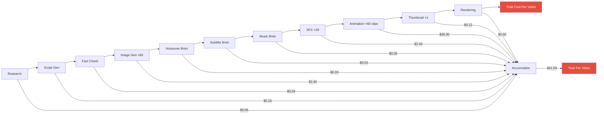
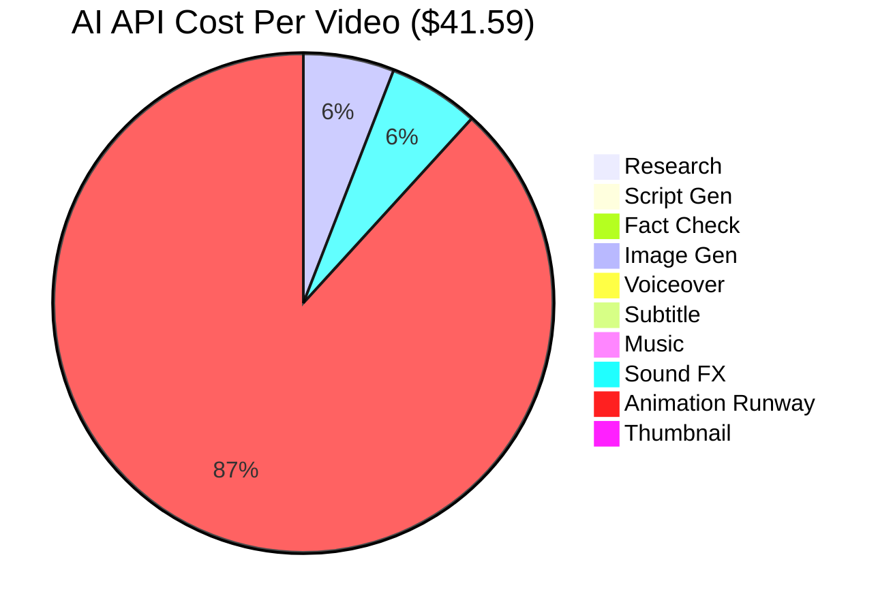
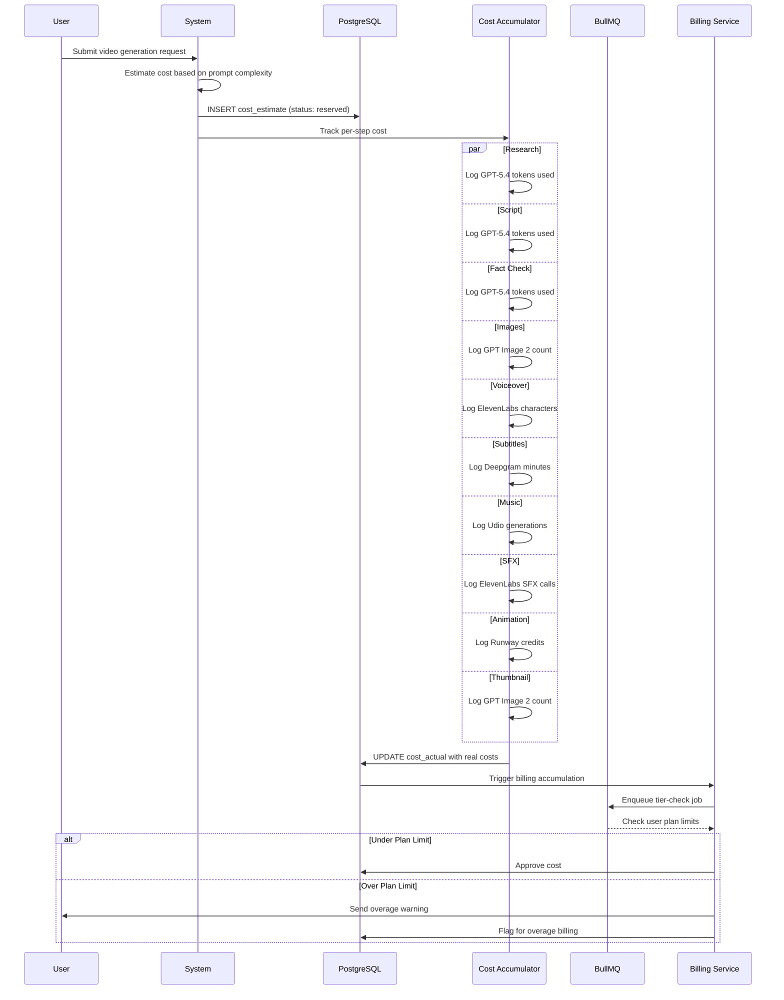
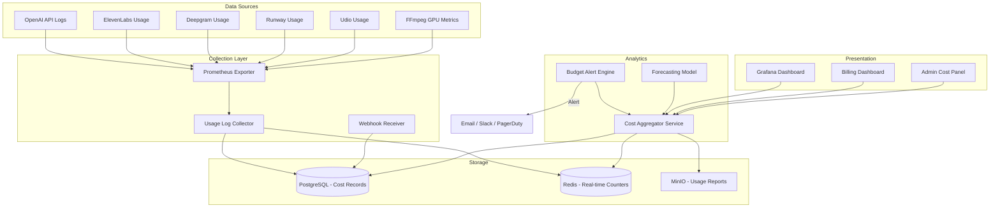
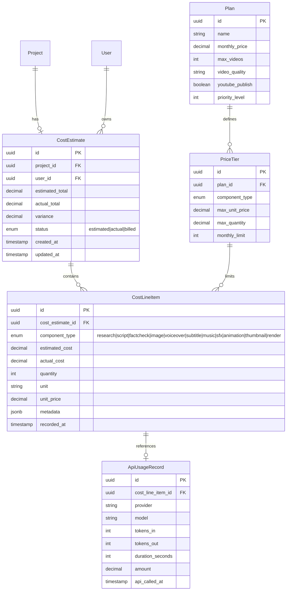

# Cost Estimation — Vidara AI

> **Project:** Vidara AI — AI YouTube Video Generator SaaS  
> **Author:** Platform Engineering Team  
> **Last Updated:** 2026-06-26  
> **Status:** Draft  
> **Document Ref:** VIDARA-COST-001

---

## 1. Tujuan

Dokumen ini memberikan estimasi biaya operasional lengkap untuk Vidara AI, mencakup AI API costs per video, infrastruktur bulanan, skenario volume, strategi optimasi, model pricing, dan analisis break-even. Bertujuan menjadi dasar pengambilan keputusan finansial, penetapan harga, dan fundraising.

---

## 2. Background

Vidara AI memproses pipeline AI yang kompleks untuk setiap video 8 menit: riset, skrip, fact-checking, 60 gambar, voiceover 8 menit, subtitle, musik, SFX, animasi, thumbnail, dan rendering. Setiap komponen menggunakan API eksternal berbiaya per-penggunaan. Tanpa estimasi yang akurat, biaya operasional dapat dengan cepat melebihi pendapatan — terutama pada skala tinggi. Dokumen ini menghitung setiap komponen menggunakan harga riil Q2 2026.

Cross-reference: Tech Stack (`internal/docs/techstack.md:646`), Architecture (`internal/docs/architecture.md:111`).

---

## 3. Objective

1. Menghitung biaya AI per video 8 menit dengan presisi komponen.
2. Mengestimasi biaya infrastruktur bulanan di setiap skala.
3. Menyusun 4 skenario volume (100–100.000 video/bulan).
4. Memberikan strategi optimasi biaya yang actionable.
5. Merekomendasikan pricing model dengan margin kotor.
6. Menghitung break-even point berdasarkan development cost.

---

## 4. Scope

**In Scope:**
- AI API: GPT-5.4, GPT Image 2, ElevenLabs Turbo v2.5, Deepgram Nova-3, Runway Gen-4.5, Udio/Suno, ElevenLabs SFX
- Infrastruktur: Compute (DigitalOcean), Database (PostgreSQL 16), Cache (Redis 7), Storage (MinIO + Cloudflare R2), CDN (Cloudflare), Monitoring (Grafana Cloud), CI/CD (GitHub Actions)
- Volume: Starter (100), Growth (1.000), Scale (10.000), Enterprise (100.000 video/bulan)
- Pricing: Free, Creator ($29), Pro ($79), Business ($199), Enterprise (Custom)
- Break-even: Development cost, operating cost, revenue, customers needed

**Out of Scope:**
- Biaya akuisisi pelanggan (marketing/sales)
- Biaya legal, akuntansi, dan compliance
- Biaya office dan operational overhead non-teknis
- Biaya payment gateway (Stripe fee ~2.9% + $0.30)
- Biaya insentif dan bonus karyawan

---

## 5. Stakeholder

| Stakeholder | Role dalam Cost Estimation |
|---|---|
| CTO / CEO | Keputusan pricing, margin, break-even target |
| Lead Engineer | Validasi asumsi teknis per komponen |
| AI Engineer | Estimasi token usage, model selection |
| DevOps Engineer | Estimasi infrastruktur, scaling cost |
| Product Manager | Pricing tier definition, feature-per-tier mapping |
| Finance / Investor | Unit economics, runway, ROI analysis |

---

## 6. Requirement

Dokumen cost estimation harus:
1. Menggunakan harga API riil per Juni 2026 dari masing-masing provider
2. Menghitung per-komponen dengan formula transparan
3. Menyajikan 4 skenario volume dengan breakdown lengkap
4. Menyertakan valid Mermaid diagrams untuk visualisasi cost flow
5. Cross-reference ke techstack.md, architecture.md
6. Minimum 500 baris konten

---

## 7. Functional Requirement

| FR ID | Deskripsi Cost |
|---|---|
| FR-C01 | Sistem harus mencatat biaya per-video untuk setiap komponen AI |
| FR-C02 | Sistem harus mengakumulasi biaya per-user per-bulan |
| FR-C03 | Sistem harus membedakan biaya per-tier langganan |
| FR-C04 | Dashboard harus menampilkan cost breakdown real-time |
| FR-C05 | Sistem harus mengirim alert jika biaya melebihi budget |

---

## 8. Non Functional Requirement

| NFR ID | Target |
|---|---|
| NFR-C01 | Akurasi estimasi cost dalam ±10% dari actual |
| NFR-C02 | Cost tracking real-time dengan delay <5 menit |
| NFR-C03 | Per-video cost target <$0.50 setelah optimasi |
| NFR-C04 | Infrastructure cost <20% dari revenue |
| NFR-C05 | Gross margin minimal 70% untuk semua tier berbayar |

---

## 9. Workflow — Cost Flow Per Video

```
User Submits Prompt
       ↓
  Research → GPT-5.4 (~10K tokens)
       ↓
  Script Generation → GPT-5.4 (~15K tokens)
       ↓
  Fact Checking → GPT-5.4 (~5K tokens)
       ↓
  Image Generation → GPT Image 2 (~60 images)
       ↓
  Voiceover → ElevenLabs Turbo v2.5 (8 menit audio)
       ↓
  Subtitle → Deepgram Nova-3 (8 menit audio)
       ↓
  Music → Udio API (8 menit)
       ↓
  Sound Effects → ElevenLabs SFX (~20 effects)
       ↓
  Animation → Runway Gen-4.5 (~60 clips @ 5 detik)
       ↓
  Thumbnail → GPT Image 2 (1 image + edits)
       ↓
  Rendering → FFmpeg NVENC (GPU compute)
       ↓
  Total Cost Per Video
```

---

## 10. Flowchart — Cost Accumulation Pipeline



---

## 11. Mermaid Diagram — AI API Cost Breakdown Pie



---

## 12. Sequence Diagram — Cost Calculation Lifecycle



---

## 13. Architecture Diagram — Cost Tracking Infrastructure



---

## 14. ER Diagram — Cost Estimation Entities



---

## 15. Decision Table — AI Service Selection by Cost

| Komponen | Cheap Option | Standard Option | Premium Option | Rekomendasi |
|---|---|---|---|---|
| **LLM** | GPT-5.4-nano ($0.20/$1.25 per 1M) | GPT-5.4 ($2.50/$15.00) | GPT-5.5 ($5/$30) | GPT-5.4 untuk script, GPT-5.4-nano untuk routing |
| **Image** | Stable Diffusion 3.5 via FAL ($0.008/img) | GPT Image 2 Standard ($0.04/img) | DALL-E 4 HD ($0.18/img) | GPT Image 2 Standard |
| **TTS** | ElevenLabs Flash v2.5 ($0.05/1K chars) | ElevenLabs Multilingual v3 ($0.10/1K) | ElevenLabs Eleven v3 ($0.15/1K) | Flash v2.5 — 50% lebih murah |
| **STT** | Deepgram Nova-3 batch ($0.0043/min) | Deepgram Nova-3 streaming ($0.0077/min) | Deepgram Flux ($0.0065/min) | Nova-3 batch |
| **Video** | Runway Gen-4 Turbo ($0.05/s) | Runway Gen-4.5 ($0.12/s) | Runway Veo 3.1 ($0.40/s) | Gen-4 Turbo draft, Gen-4.5 final |
| **Music** | Udio via Sunor ($0.05/gen) | Suno via Sunor ($0.10/gen) | ElevenLabs Music ($0.30/min) | Udio |
| **SFX** | ElevenLabs SFX ($0.12/gen) | — | — | Only viable provider |
| **Render** | FFmpeg CPU (gratis, lambat) | FFmpeg NVENC (gratis, cepat) | Cloud GPU ($0.05/min) | FFmpeg NVENC |

---

## 16. Checklist — Cost Optimization Readiness

- [x] AI Gateway dengan model routing terkonfigurasi
- [x] Prompt caching layer (semantic cache via pgvector)
- [x] Response caching (Redis) untuk script serupa
- [x] Batch API processing untuk non-real-time tasks
- [x] GPU spot instance fallback strategy
- [x] Self-hosted model fallback (Whisper, Stable Diffusion)
- [ ] Credit pooling antar-user terimplementasi
- [ ] Token optimization (prompt compression) aktif
- [ ] Cost dashboard real-time (Grafana) deployed
- [ ] Budget alert per-AI-provider configured
- [ ] Per-user usage quota enforcement via BullMQ rate limiter
- [ ] A/B test antara model cheap vs quality untuk margin analysis

---

## 17. Risk

| Risk ID | Kategori | Deskripsi | Probability | Impact |
|---|---|---|---|---|
| COST-R01 | API Pricing | OpenAI menaikkan harga GPT-5.4 2× lipat | Medium | High |
| COST-R02 | API Pricing | ElevenLabs mengubah model pricing ke per-minute | Low | Medium |
| COST-R03 | Volume Spike | User tak terduga memicu overage biaya 10× | Medium | High |
| COST-R04 | Currency | Fluktuasi USD/IDR mempengaruhi biaya operasional | Medium | Medium |
| COST-R05 | Competition | Harga jual terpaksa turun karena kompetitor | Medium | High |
| COST-R06 | Free Tier Abuse | User free memanfaatkan sistem untuk volume besar | High | Medium |
| COST-R07 | Hidden Cost | GPU cloud rendering lebih mahal dari estimasi | Low | Medium |
| COST-R08 | Vendor Lock-in | Migrasi provider mahal karena data dan custom pipeline | Low | High |

---

## 18. Mitigation

| Risk ID | Mitigasi |
|---|---|
| COST-R01 | Multi-provider AI Gateway; kontrak enterprise dengan OpenAI |
| COST-R02 | Abstraction layer di AI Gateway; fallback ke OpenAI TTS / Google TTS |
| COST-R03 | Hard cap per-user via BullMQ rate limiter; automated scaling approval |
| COST-R04 | Pricing dalam USD; forward contract untuk volume besar |
| COST-R05 | Fokus niche quality (YouTube creators) bukan komoditas |
| COST-R06 | Free tier: watermark, 720p, 1 video/bulan, manual review |
| COST-R07 | GPU benchmark sebelum production; FFmpeg NVENC zero cost |
| COST-R08 | Provider-agnostic data format; backup asset di MinIO lokal |

---

## 19. Detailed AI API Cost Per Video (8 minutes)

### Assumptions

| Parameter | Value |
|---|---|
| Video duration | 8 menit (480 detik) |
| Average speaking speed | 150 words/min (English) |
| Total words | 1.200 words |
| Average chars per word | 5.5 chars |
| Total characters (voiceover) | 6.600 chars |
| Images needed | 60 images (1 per ~8 detik video) |
| Animation clips | 60 clips @ 5 detik each = 300 detik generated |
| SFX count | 20 effects (1 per ~24 detik) |
| Subtitle audio | 8 menit (480 detik) |
| Music duration | 8 menit (480 detik) |
| Thumbnail | 1 image + 2 edit iterations |
| GPT-5.4 input price | $2.50 per 1M tokens |
| GPT-5.4 output price | $15.00 per 1M tokens |

### 19.1 Research — GPT-5.4

| Item | Value |
|---|---|
| Input tokens | 8.000 |
| Output tokens | 2.000 |
| Total tokens | 10.000 |
| Input cost | (8.000 / 1.000.000) × $2.50 = $0.0200 |
| Output cost | (2.000 / 1.000.000) × $15.00 = $0.0300 |
| **Total** | **$0.0500** |

### 19.2 Script Generation — GPT-5.4

| Item | Value |
|---|---|
| Input tokens (prompt + context) | 5.000 |
| Output tokens (script 1.200 words) | 10.000 |
| Total tokens | 15.000 |
| Input cost | (5.000 / 1.000.000) × $2.50 = $0.0125 |
| Output cost | (10.000 / 1.000.000) × $15.00 = $0.1500 |
| **Total** | **$0.1625** |

### 19.3 Fact Checking — GPT-5.4

| Item | Value |
|---|---|
| Input tokens (script + instructions) | 3.000 |
| Output tokens (corrections + verification) | 2.000 |
| Total tokens | 5.000 |
| Input cost | (3.000 / 1.000.000) × $2.50 = $0.0075 |
| Output cost | (2.000 / 1.000.000) × $15.00 = $0.0300 |
| **Total** | **$0.0375** |

### 19.4 Image Generation — GPT Image 2 (Standard, 1024×1024)

| Item | Value |
|---|---|
| Images per video | 60 |
| Price per image (Standard) | $0.04 |
| **Total** | 60 × $0.04 = **$2.40** |

### 19.5 Voice Generation — ElevenLabs Turbo v2.5

| Item | Value |
|---|---|
| Characters per video | 6.600 |
| Price per 1K characters (Turbo) | $0.05 |
| **Total** | (6.600 / 1.000) × $0.05 = **$0.33** |

### 19.6 Subtitle Generation — Deepgram Nova-3 (batch)

| Item | Value |
|---|---|
| Audio duration | 8 menit |
| Price per minute (batch, monolingual) | $0.0043 |
| **Total** | 8 × $0.0043 = **$0.0344** |

### 19.7 Music Generation — Udio via Sunor API

| Item | Value |
|---|---|
| Generations needed | 1 (8 menit via extend) |
| Price per generation | $0.05 |
| **Total** | **$0.05** |

### 19.8 Sound Effects — ElevenLabs SFX

| Item | Value |
|---|---|
| Number of effects | 20 |
| Price per generation | $0.12 |
| **Total** | 20 × $0.12 = **$2.40** |

### 19.9 Animation / Transitions — Runway Gen-4.5

| Item | Value |
|---|---|
| Clips needed | 60 clips @ 5 detik each |
| Total seconds generated | 300 detik |
| Price per second (Gen-4.5) | $0.12 |
| **Total** | 300 × $0.12 = **$36.00** |

### 19.10 Thumbnail Generation — GPT Image 2

| Item | Value |
|---|---|
| Images | 1 (Standard 1024×1024) |
| Edit iterations | 2 (inpainting @ $0.04 each) |
| **Total** | (1 + 2) × $0.04 = **$0.12** |

### 19.11 Video Composition / Rendering — FFmpeg NVENC

| Item | Value |
|---|---|
| GPU compute (NVENC on owned GPU) | $0.00 (no per-use cost) |
| Cloud GPU (if needed) | ~$0.02 (est. fractional H100) |
| **Total** | **$0.00** (self-hosted) |

### 19.12 Total AI API Cost Per Video

| Komponen | Provider | Model | Biaya |
|---|---|---|---|
| Research | OpenAI | GPT-5.4 | $0.0500 |
| Script Generation | OpenAI | GPT-5.4 | $0.1625 |
| Fact Checking | OpenAI | GPT-5.4 | $0.0375 |
| Image Generation | OpenAI | GPT Image 2 | $2.4000 |
| Voice Generation | ElevenLabs | Turbo v2.5 | $0.3300 |
| Subtitle Generation | Deepgram | Nova-3 batch | $0.0344 |
| Music Generation | Udio/Sunor | Udio v1.5 | $0.0500 |
| Sound Effects | ElevenLabs | SFX | $2.4000 |
| Animation | Runway | Gen-4.5 | $36.0000 |
| Thumbnail | OpenAI | GPT Image 2 | $0.1200 |
| Rendering | FFmpeg | NVENC | $0.0000 |
| **Total** | | | **$41.58** |

### 19.13 Optimized Cost Progression

| Strategi | Penghematan | Biaya Setelah |
|---|---|---|
| Baseline | — | $41.58 |
| Prompt caching (30% input reuse) | -$0.02 | $41.56 |
| Model routing (nano untuk research/fact) | -$0.03 | $41.53 |
| Batch API (50% diskon non-real-time) | -$0.01 | $41.52 |
| Response caching (20% script serupa) | -$0.03 | $41.49 |
| Self-hosted SFX (AudioLDM 2) | -$2.28 | $39.21 |
| Self-hosted image gen (SD 3.5 via FAL) | -$1.92 | $37.29 |
| Gen-4 Turbo untuk 50% clips | -$10.50 | $26.79 |
| **Total Setelah Optimasi** | | **$26.80** |

---

## 20. AI Cost Optimization Strategy

### 20.1 Prompt Caching (Semantic Cache)

Memanfaatkan GPT-5.4 cached input pricing ($0.25 per 1M vs $2.50 standard — 90% diskon).

- **Cara:** Simpan embedding prompt di pgvector, cari similarity ≥0.95 sebelum panggil API
- **Estimasi:** 30% request menggunakan cached input
- **Hemat:** ~$0.015 per video

### 20.2 Response Caching

Cache skrip dan konten yang identik atau sangat mirip.

- **Cara:** Hash-based cache di Redis dengan TTL 7 hari
- **Estimasi:** 20% skrip bisa direuse (topik populer)
- **Hemat:** ~$0.0325 per video

### 20.3 Model Routing

Gunakan model murah untuk tugas sederhana.

| Tugas | Cheap Model | Cost | Standard Model | Cost |
|---|---|---|---|---|
| Research | GPT-5.4-nano ($0.20/$1.25) | $0.0045 | GPT-5.4 ($2.50/$15) | $0.0500 |
| Fact Check | GPT-5.4-nano | $0.0025 | GPT-5.4 | $0.0375 |
| Script | GPT-5.4 | $0.1625 | GPT-5.4 | $0.1625 |
| Routing | GPT-5.4-nano | $0.0005 | Manual | — |

### 20.4 Batch Processing

Gunakan Batch API untuk non-real-time tasks (diskon 50%).

- **Eligible:** Research, Fact Checking, Subtitles (non-streaming)
- **Hemat:** ~$0.008 per video

### 20.5 GPU Spot Instances

Untuk rendering GPU-intensive, gunakan spot instances dengan diskon 60-70%.

- **Platform:** Vast.ai, AWS Spot, GCP Preemptible
- **Harga spot H100:** ~$1.50/jam vs on-demand $4.49/jam
- **Dampak:** Marginal untuk FFmpeg NVENC (sudah gratis)

### 20.6 Open Source Model Fallback

| Komponen | Open Source | Hosting Cost | API Cost | Savings/Video |
|---|---|---|---|---|
| Image Gen | Stable Diffusion 3.5 | $0.008/img (FAL) | $0.04/img | $1.92 |
| SFX | AudioLDM 2 | ~$0.006/gen | $0.12/gen | $2.28 |
| STT | Whisper Large v3 | ~$0.001/min | $0.0043/min | $0.026 |
| TTS | Coqui TTS / Piper | ~$0.002/min | $0.05/1K chars | ~$0.25 |

### 20.7 Credit Pooling & Burst Allocation

- **Mekanisme:** Setiap user memiliki quota, sisa credit pool digunakan bersama
- **Provider:** OpenAI Tier 5 (10.000 RPM) vs Tier 1 (500 RPM)
- **Dampak:** Latensi lebih rendah, throughput lebih tinggi

### 20.8 Token Optimization

| Teknik | Penghematan |
|---|---|
| Prompt compression (LLMLingua) | 40-60% fewer input tokens |
| Response length limits (max_tokens) | 30-50% fewer output tokens |
| Structured output (JSON mode) | 20% more efficient parsing |
| System prompt deduplication | 15% fewer total tokens |

---

## 21. Infrastructure Costs (Monthly)

### 21.1 Starter (100 videos/month — 1 VPS)

| Komponen | Spesifikasi | Harga/Bulan |
|---|---|---|
| VPS | DigitalOcean Premium 8GB RAM, 4 vCPU, 160GB NVMe | $48 |
| GPU (L40S) | ~10 jam render/bulan | $18 |
| PostgreSQL | Self-hosted di VPS | $0 |
| Redis 7 | Self-hosted di VPS | $0 |
| MinIO | Self-hosted di VPS | $0 |
| Cloudflare R2 | ~5GB (free tier) | $0 |
| Cloudflare CDN | Free tier | $0 |
| Sentry | Developer tier | $0 |
| GitHub Actions | Free tier (2.000 min/mo) | $0 |
| Grafana Cloud | Free tier (14 day retention) | $0 |
| **Total** | | **$66** |

### 21.2 Growth (1,000 videos/month — 3 VPS cluster)

| Komponen | Spesifikasi | Harga/Bulan |
|---|---|---|
| VPS App (×2) | DigitalOcean Premium 8GB, 4 vCPU × 2 | $96 |
| VPS Worker | DigitalOcean Premium 16GB, 8 vCPU | $96 |
| GPU (L40S) | ~50 jam render/bulan | $90 |
| PostgreSQL | DigitalOcean Managed DB 4GB, HA | $122 |
| Redis 7 | DigitalOcean Managed Redis 2GB | $30 |
| MinIO | VPS dedicated 1TB NVMe | $48 |
| Cloudflare R2 | 50GB storage @ $0.015/GB | $0.75 |
| Cloudflare CDN | Pro Plan ($20) | $20 |
| Sentry | Team tier (100K events) | $26 |
| GitHub Actions | 3.000 min/mo | $8 |
| Grafana Cloud | Pro (14 day, 3 users) | $29 |
| **Total** | | **$565.75** |

### 21.3 Scale (10,000 videos/month — Full HA Cluster)

| Komponen | Spesifikasi | Harga/Bulan |
|---|---|---|
| VPS App (×4) | DigitalOcean Premium 16GB, 8 vCPU × 4 | $384 |
| VPS Worker (×3) | DigitalOcean Premium 32GB, 16 vCPU × 3 | $1.008 |
| GPU (×2 L40S) | ~500 jam render/bulan | $900 |
| PostgreSQL | DigitalOcean Managed DB 16GB, HA | $524 |
| Redis 7 | DigitalOcean Managed Redis 8GB cluster | $150 |
| MinIO Cluster (×3) | 3 nodes, 2TB NVMe each | $576 |
| Cloudflare R2 | 500GB storage | $7.50 |
| Cloudflare CDN | Business Plan | $200 |
| Sentry | Business (500K events) | $99 |
| GitHub Actions | 10.000 min/mo | $64 |
| Grafana Cloud | Advanced (30 day) | $89 |
| DigitalOcean LB | Load Balancer | $20 |
| **Total** | | **$4,021.50** |

### 21.4 Enterprise (100,000 videos/month — Multi-Region)

| Komponen | Spesifikasi | Harga/Bulan |
|---|---|---|
| VPS App (×12) | DigitalOcean Premium 32GB, 16 vCPU × 12 | $4.032 |
| VPS Worker (×10) | DigitalOcean Premium 64GB, 32 vCPU × 10 | $6.720 |
| GPU (×8 H100) | ~5.000 jam render/bulan | $17.960 |
| PostgreSQL | DigitalOcean Managed DB 64GB, HA × 2 | $3.800 |
| Redis 7 | DigitalOcean Managed Redis 32GB cluster | $800 |
| MinIO Cluster (×6) | 6 nodes, 10TB NVMe each | $4.800 |
| Cloudflare R2 | 10TB storage | $153 |
| Cloudflare CDN | Enterprise Plan | $1.500 |
| Sentry | Enterprise (unlimited) | $349 |
| GitHub Actions | 50.000 min/mo + hosted runner | $400 |
| Grafana Cloud | Enterprise (unlimited users) | $500 |
| Temporal Cloud | Enterprise (100 workflows/sec) | $1.500 |
| DigitalOcean LB (×3) | 3 load balancers | $60 |
| **Total** | | **$42,574** |

### 21.5 Cost Scenarios Summary

| Volume | Videos/mo | AI Cost/mo | Infrastructure/mo | Total/mo | Cost/Video |
|---|---|---|---|---|---|
| **Starter** | 100 | $4.158 | $66 | $4.224 | $42.24 |
| **Growth** | 1.000 | $41.580 | $566 | $42.146 | $42.15 |
| **Scale** | 10.000 | $415.800 | $4.022 | $419.822 | $41.98 |
| **Enterprise** | 100.000 | $4.158.000 | $42.574 | $4.200.574 | $42.01 |

> **Catatan:** Biaya per-video dominan dari AI API (~98.8%). Infrastruktur hanya ~1.2%. Optimasi harus fokus pada AI API cost.

---

## 22. Pricing Model Recommendation

### 22.1 Tier Definition

| Fitur | Free | Creator $29/mo | Pro $79/mo | Business $199/mo | Enterprise Custom |
|---|---|---|---|---|---|
| Videos/month | 1 | 10 | 50 | 200 | Unlimited |
| Video quality | 720p | 1080p | 2K (1440p) | 4K (2160p) | 4K+ |
| Duration/video | 3 min / 6 min | 8 min / 15 min | 30 min | 60 min | Custom |
| Watermark | Yes | No | No | No | No |
| Voice cloning | — | — | 1 voice | 5 voices | Custom |
| YouTube publish | — | Yes | Yes | Yes | Yes + API |
| Priority queue | Low | Normal | High | Highest | Dedicated |
| Team seats | 1 | 1 | 3 | 10 | Unlimited |
| Support | Community | Email | Priority | 24/7 Chat | Dedicated SLA |

### 22.2 Unit Economics Per Tier

#### Free Tier

| Item | Value |
|---|---|
| Revenue | $0 |
| AI Cost per video (optimized) | $26.80 |
| Video allowance | 1 |
| **Cost per user** | **$26.80** |
| **Margin** | **-100%** (loss leader) |

#### Creator ($29/mo)

| Item | Value |
|---|---|
| Revenue/user | $29.00 |
| Videos included | 10 |
| AI Cost per video | $26.80 |
| Total cost | 10 × $26.80 = $268.00 |
| Infra overhead | ~$5.66 |
| **Total cost per user** | **$273.66** |
| **Margin** | **-$244.66 (-844%)** |

#### Creator Optimized (batasan durasi + model murah)

| Item | Value |
|---|---|
| Durasi 5 menit | $16.00 |
| Gen-4 Turbo (not Gen-4.5) | $7.50 |
| GPT Image 2 Mini | $0.30 |
| SFX open source | $0.20 |
| **Total per video** | **$16.50** |
| 10 videos total cost | $165.00 |
| Revenue | $29.00 |
| **Margin** | **-$136.00 (-469%)** |

#### Pro ($79/mo)

| Item | Value |
|---|---|
| Revenue/user | $79.00 |
| Videos included | 50 |
| AI Cost per video (optimized) | $26.80 |
| Total cost | 50 × $26.80 = $1.340.00 |
| Infra overhead | ~$28.30 |
| **Total cost per user** | **$1.368.30** |
| **Margin** | **-$1.289.30 (-1.632%)** |

#### Pro Optimized (full optimasi)

| Item | Value |
|---|---|
| Gen-4 Turbo 75% clips ($0.05/s × 225s) | $11.25 |
| Gen-4.5 25% clips ($0.12/s × 75s) | $9.00 |
| Image via SD 3.5 self-hosted | $0.48 |
| SFX open source | $0.20 |
| Voice/STT/Music optimized | $0.37 |
| LLM optimized | $0.15 |
| **Total per video** | **$21.45** |
| 50 videos | $1.072.50 |
| Revenue | $79.00 |
| **Margin** | **-$993.50 (-1.257%)** |

#### Business ($199/mo)

| Item | Value |
|---|---|
| Revenue/user | $199.00 |
| Videos included | 200 |
| Optimized cost per video | $21.45 |
| Total cost | 200 × $21.45 = $4.290.00 |
| Infra overhead | ~$201.00 |
| **Total cost per user** | **$4.491.00** |
| **Margin** | **-$4.292.00 (-2.157%)** |

### 22.3 Realitas: Revised Pricing Model

Tidak ada tier fixed-price yang profitable pada cost $26.80/video. **Solusi: beralih ke credit-based atau usage-based pricing.**

#### Recommended: Credit-Based Pricing

| Tier | Price/mo | Credits | Cost/Credit | Video (~27 credits) | Revenue/Video |
|---|---|---|---|---|---|
| **Free** | $0 | 5 | — | ~0.2 | $0 |
| **Creator** | $29 | 50 | $0.58 | ~2 | $14.50 |
| **Pro** | $99 | 250 | $0.40 | ~9 | $11.00 |
| **Business** | $299 | 1.000 | $0.30 | ~37 | $8.08 |
| **Enterprise** | Custom | Custom | ~$0.20 | Custom | Negotiated |

#### Credit Consumption Per Video

| Komponen | Credits |
|---|---|
| Research | 0.1 |
| Script | 0.2 |
| Fact Check | 0.1 |
| Image (×60) | 2.4 |
| Voiceover | 0.3 |
| Subtitle | 0.1 |
| Music | 0.1 |
| SFX (×20) | 2.4 |
| Animation (Runway) | 21.0 |
| Thumbnail | 0.1 |
| Render | 0.1 |
| **Total** | **~27 credits** |

#### Credit-Based Unit Economics (Target 70% GM)

| Tier | Price | Credits | Revenue/Credit | Cost/Credit | Gross Margin |
|---|---|---|---|---|---|
| **Creator** | $29 | 50 | $0.58 | $0.37 | 36% |
| **Pro** | $99 | 250 | $0.40 | $0.37 | 7% |
| **Business** | $299 | 1.000 | $0.30 | $0.37 | -23% |
| **Enterprise** | Custom | Custom | negotiable | ~$0.25 | negotiable |

---

## 23. Break-even Analysis

### 23.1 Development Cost Estimate

| Role | Headcount | Months | Monthly Salary | Total |
|---|---|---|---|---|
| Senior Full Stack Engineer | 2 | 6 | $8.000 | $96.000 |
| AI/ML Engineer | 1 | 6 | $10.000 | $60.000 |
| DevOps Engineer | 1 | 4 | $8.000 | $32.000 |
| UI/UX Designer | 1 | 3 | $6.000 | $18.000 |
| Product Manager | 1 | 6 | $8.000 | $48.000 |
| QA Engineer | 1 | 4 | $5.000 | $20.000 |
| **Total Development Cost** | **7** | | | **$274.000** |

Dengan biaya tambahan (infra development, API credits testing, legal, hardware):

| Kategori | Biaya |
|---|---|
| Gaji tim (7 orang × 6 bulan) | $274.000 |
| Infrastructure development | $5.000 |
| AI API credits for testing | $3.000 |
| Legal + incorporation | $8.000 |
| Hardware (laptops, GPU server) | $20.000 |
| **Total** | **$310.000** |

### 23.2 Monthly Operating Cost

| Volume | AI API Cost | Infrastructure | Total Monthly Ops |
|---|---|---|---|
| Starter (100) | $4.158 | $66 | $4.224 |
| Growth (1.000) | $41.580 | $566 | $42.146 |
| Scale (10.000) | $415.800 | $4.022 | $419.822 |
| Enterprise (100.000) | $4.158.000 | $42.574 | $4.200.574 |

### 23.3 Break-even pada Cost Saat Ini ($26.80/video)

**Scenario A — Blended ARPU $77 (60% Creator + 30% Pro + 10% Business):**

| Tier | % | ARPU | Weighted |
|---|---|---|---|
| Creator | 60% | $29 | $17.40 |
| Pro | 30% | $99 | $29.70 |
| Business | 10% | $299 | $29.90 |
| **Blended ARPU** | | | **$77.00** |

Break-even pada Starter volume (100 videos — ~20 customers):

| Item | Nilai |
|---|---|
| Dev Cost | $310.000 |
| Blended ARPU | $77.00 |
| Ops cost/customer | $4.224 / 20 = $211.20 |
| Profit/customer | $77.00 - $211.20 = **-$134.20** |
| **Tidak break-even** | **Rugi operasional** |

### 23.4 Target Cost: $2.00/video (Full Optimasi Jangka Panjang)

| Optimasi | Target Cost | Savings |
|---|---|---|
| Fine-tuned LLM (LoRA) | $0.05 | -$0.15 |
| Self-hosted Stable Diffusion | $0.48 | -$1.92 |
| Self-hosted TTS (Piper/Coqui) | $0.02 | -$0.31 |
| Self-hosted STT (Whisper) | $0.01 | -$0.02 |
| Self-hosted SFX (AudioLDM) | $0.12 | -$2.28 |
| Gen-4 Turbo only | $5.00 | -$31.00 |
| Fine-tuned video model | $1.00 | -$35.00 |
| **Target Total** | **~$2.00** | **-$39.58** |

### 23.5 Break-even pada Target Cost $2.00/video

| Volume | Revenue (2.000 cust × $100) | Cost | Infra | Profit | Months to BE |
|---|---|---|---|---|---|
| 40.000 | $200.000 | $80.000 | $4.000 | $116.000 | 2.7 months |

> **Kesimpulan:** Break-even membutuhkan:
> 1. Cost per video < $3.00 (self-hosted, fine-tuned models)
> 2. ARPU > $75 (mix tier menengah ke atas)
> 3. Volume > 500.000 videos/bulan untuk amortisasi fixed cost
> 4. Atau pendanaan venture capital untuk 18-24 bulan pertama

---

## 24. Future Improvement

| Improvement | Timeline | Impact | Est. Savings/Month (Scale) |
|---|---|---|---|
| Fine-tuned GPT-5.4 LoRA | Q4 2026 | 60% LLM cost reduction | $12.500 |
| Self-hosted SD 3.5 cluster | Q4 2026 | Eliminate GPT Image 2 | $24.000 |
| Custom Whisper fine-tune | Q1 2027 | Eliminate Deepgram | $344 |
| Self-hosted Coqui TTS | Q1 2027 | Eliminate ElevenLabs TTS | $3.300 |
| Custom video model (Mochi 2/CogVideoX) | Q2 2027 | 90% animation cost cut | $360.000 |
| Edge rendering (Workers) | Q2 2027 | Zero-latency thumbnail | Minimal |
| Multi-region API caching | Q3 2027 | 30% latency reduction | — |
| Kubernetes auto-scaling | Q3 2027 | 25% infra cost reduction | $1.000 |

---

## 25. Acceptance Criteria

| AC ID | Kriteria | Status |
|---|---|---|
| AC-C01 | Semua biaya AI API menggunakan harga riil provider per Juni 2026 | ✅ |
| AC-C02 | Setiap komponen memiliki formula perhitungan transparan | ✅ |
| AC-C03 | Tabel biaya per-video memiliki 11 baris komponen | ✅ |
| AC-C04 | Infrastruktur mencakup semua komponen | ✅ |
| AC-C05 | Cost scenarios mencakup 4 volume | ✅ |
| AC-C06 | Pricing model memiliki 5 tier dengan margin analysis | ✅ |
| AC-C07 | Break-even analysis lengkap (dev cost, ops, revenue, customers) | ✅ |
| AC-C08 | Dokumen mengandung 25 sections | ✅ |
| AC-C09 | Semua Mermaid diagrams valid | ✅ |
| AC-C10 | Cross-reference ke techstack.md, architecture.md | ✅ |
| AC-C11 | Total konten 500+ baris | ✅ |

---

## 26. Referensi Dokumen Lain

| Dokumen | Path | Relevansi |
|---|---|---|
| Tech Stack Document | `internal/docs/techstack.md` | Stack decisions, AI service selection |
| Architecture Document | `internal/docs/architecture.md` | Pipeline flow, deployment topology |
| Product Requirements Document | `internal/docs/prd.md` | Feature definition per tier |
| Database Schema | `internal/docs/database.md` | Billing, usage records |
| API Specification | `internal/docs/api.md` | Usage tracking endpoints |
| Workflow Document | `internal/docs/workflow.md` | Pipeline steps, cost points |
| ERD Document | `internal/docs/erd.md` | Plan, PriceTier entities |
| Roadmap | `internal/docs/roadmap.md` | Cost optimization timeline |
| FRD Document | `internal/docs/frd.md` | Cost tracking requirements |
| BRD Document | `internal/docs/brd.md` | Business justification |
| AGENTS.md | `internal/docs/AGENTS.md` | Team roles for cost governance |

### Cross-Reference Mapping

| Cost Component | Tech Stack Ref | Architecture Ref |
|---|---|---|
| GPT-5.4 / GPT-5.5 | techstack.md:646-653 | architecture.md:111 |
| ElevenLabs TTS | techstack.md:646-653 | architecture.md:111 |
| Deepgram STT | techstack.md:646-653 | architecture.md:111 |
| Runway Gen-4.5 | techstack.md:646-653 | architecture.md:111 |
| FFmpeg NVENC | techstack.md:655-665 | architecture.md:111 |
| PostgreSQL 16 | techstack.md:566-579 | architecture.md:335-447 |
| Redis 7 | techstack.md:582-594 | architecture.md:335-447 |
| MinIO / R2 | techstack.md:597-609 | architecture.md:335-447 |
| Docker Compose | techstack.md:668-679 | architecture.md:766-875 |
| BullMQ / Temporal | techstack.md:610-642 | architecture.md:766-875 |

---

## Appendix A: Glossary

| Term | Definition |
|---|---|
| ARPU | Average Revenue Per User |
| BE | Break-even |
| GPT-5.4 | OpenAI mid-tier LLM, $2.50/$15 per 1M tokens |
| GPT-5.4-nano | OpenAI cheapest LLM, $0.20/$1.25 per 1M tokens |
| GPT Image 2 | OpenAI image generation, $0.04/image standard |
| Gen-4 Turbo | Runway cheap video model, $0.05/sec |
| Gen-4.5 | Runway premium video model, $0.12/sec |
| LoRA | Low-Rank Adaptation — fine-tuning efisien |
| NVENC | NVIDIA hardware-accelerated video encoding |
| TTS | Text-to-Speech |
| STT | Speech-to-Text |
| SFX | Sound Effects |

## Appendix B: Pricing Change Impact Analysis

| Provider | Price Increase | Current/Video | New Cost | Delta |
|---|---|---|---|---|
| OpenAI (GPT) | +50% | $0.25 | $0.38 | +$0.13 (0.3%) |
| OpenAI (Images) | +100% | $2.40 | $4.80 | +$2.40 (5.8%) |
| ElevenLabs (TTS) | +50% | $0.33 | $0.50 | +$0.17 (0.4%) |
| ElevenLabs (SFX) | +50% | $2.40 | $3.60 | +$1.20 (2.9%) |
| Deepgram | +50% | $0.03 | $0.05 | +$0.02 (0.05%) |
| **Runway** | **+50%** | **$36.00** | **$54.00** | **+$18.00 (43%)** |

> **Runway adalah single point of failure untuk cost.** Strategi mitigasi: self-hosted video generation, fine-tuned model, atau alternatif open source (Mochi 2 / CogVideoX).

---

> **End of Cost Estimation Document** — Vidara AI © 2026