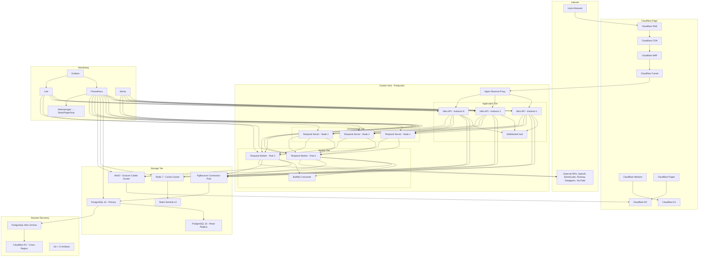
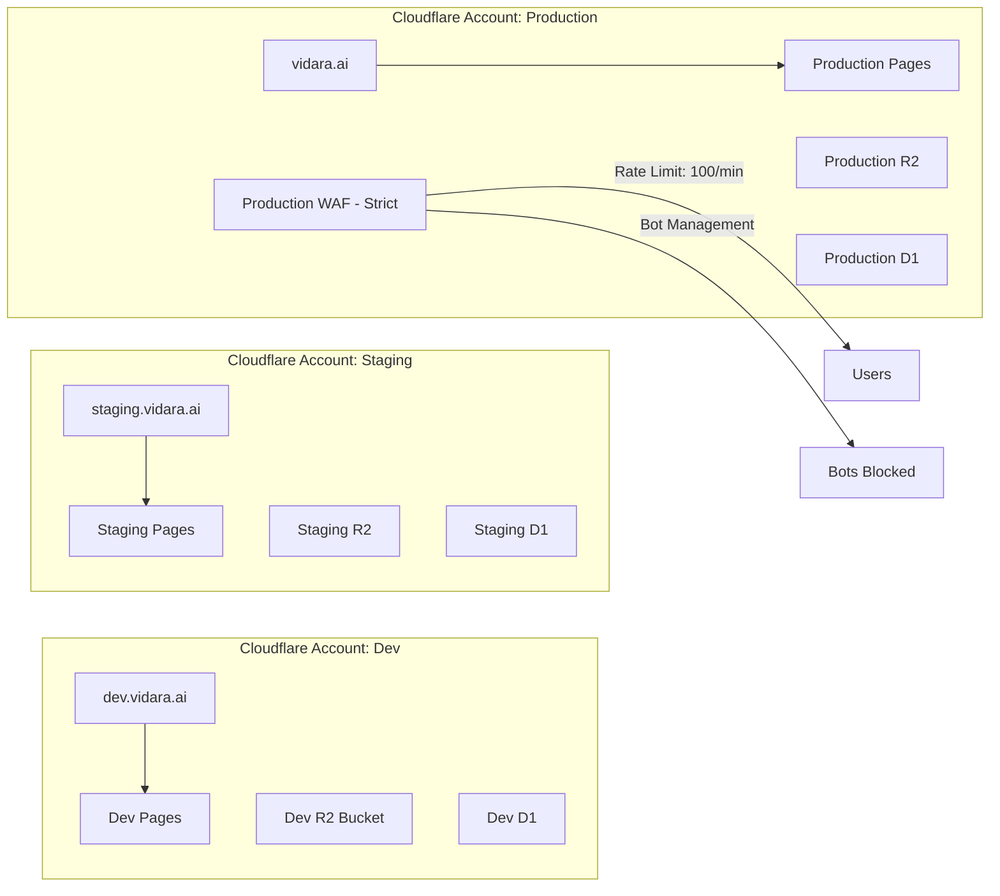
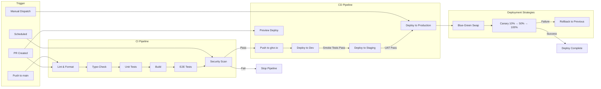
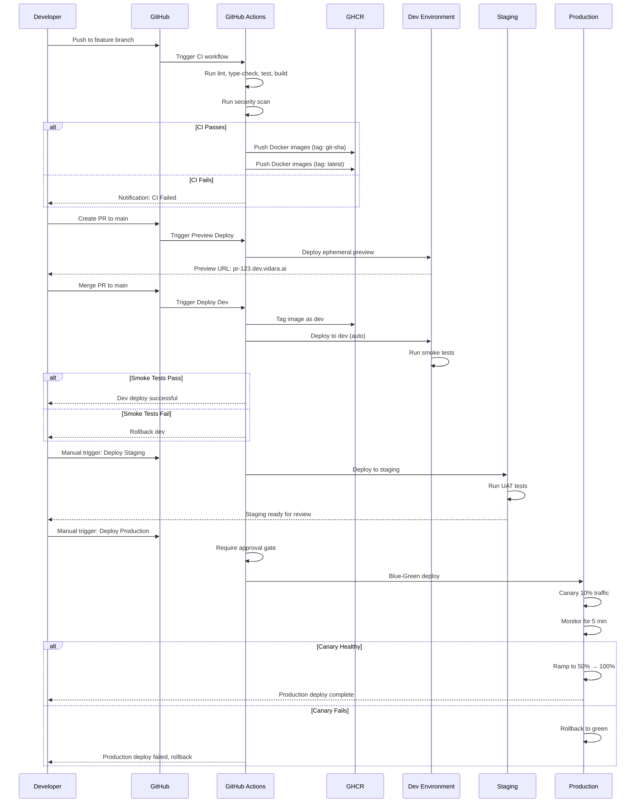
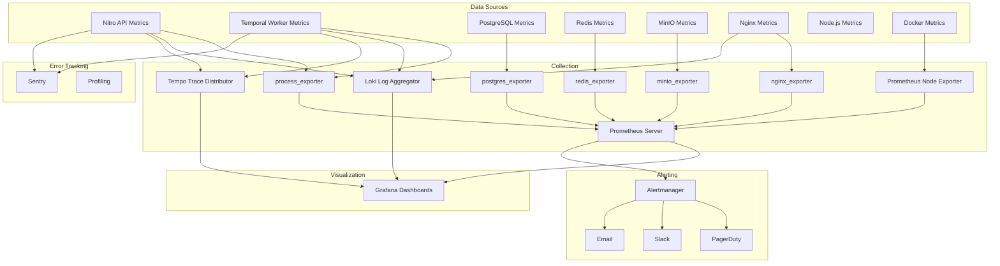
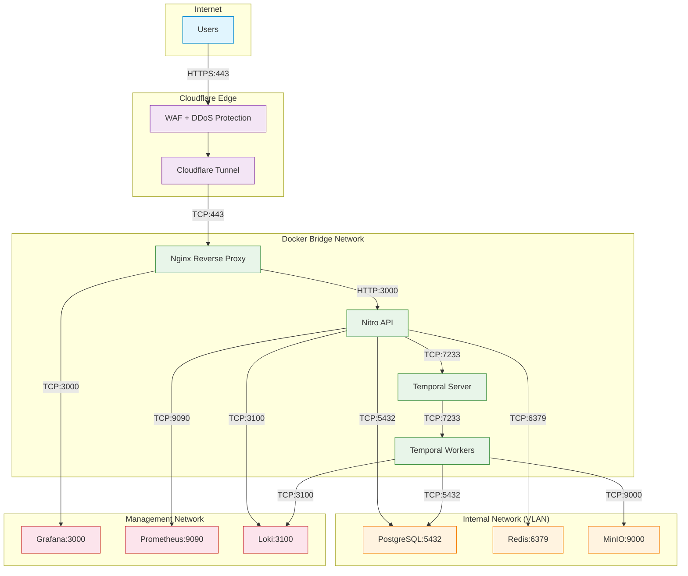

# Deployment & Infrastructure — Vidara AI

> **Project:** Vidara AI — AI YouTube Video Generator SaaS  
> **Author:** Agent 10 — Senior DevOps Engineer, Agent 14 — Senior Cloud Architect  
> **Last Updated:** 2026-06-26  
> **Status:** Final  
> **Cross-Reference:** [Architecture](architecture.md) · [Tech Stack](techstack.md) · [DevOps](devops.md) · [Database](database.md) · [Roadmap](roadmap.md)

---

## 1. Tujuan

Dokumen Deployment & Infrastructure ini mendefinisikan secara komprehensif arsitektur infrastruktur, strategi environment, konfigurasi Docker, pipeline CI/CD, setup Cloudflare, konfigurasi Nginx, deployment database, monitoring, backup, disaster recovery, dan scaling strategy untuk Vidara AI. Bertujuan menjadi blueprint bagi DevOps dan Cloud Engineering team dalam mengelola infrastruktur dari MVP (100 users) hingga enterprise scale (1M users).

---

## 2. Background

Vidara AI adalah platform SaaS yang memproses pipeline AI berat (10-30 menit per video), menyimpan file besar (GB-scale), memberikan real-time updates via WebSocket, dan berinteraksi dengan 6+ API eksternal. Infrastruktur harus reliable (99.9% uptime), scalable (100 → 1M users), cost-efficient (<$0.50/video), dan mendukung zero-downtime deployment. Detail arsitektur sistem dijelaskan di `architecture.md` section 22 (Deployment Architecture).

---

## 3. Objective

1. Menyediakan infrastruktur yang mendukung 99.9% availability.
2. Mendukung horizontal scaling dari 100 hingga 1M concurrent users.
3. Zero-downtime deployment melalui Blue-Green dan Canary strategy.
4. Disaster recovery dengan RTO < 1 jam dan RPO < 5 menit.
5. Monitoring end-to-end dengan Prometheus, Grafana, Loki, Sentry.
6. Cost optimization melalui Cloudflare R2 (zero egress) dan auto-scaling.

---

## 4. Scope

**In Scope:**
- Infrastructure architecture dengan Cloudflare, Docker, Nginx, PostgreSQL, Redis, MinIO, Temporal
- Environment strategy: dev, staging, production (separate Cloudflare accounts/domains)
- Docker setup: Dockerfile untuk Nuxt 4, workers; docker-compose.yml structure
- CI/CD pipeline: GitHub Actions (test → build → push → deploy)
- Cloudflare: Pages, Workers, R2, D1, Tunnel, WAF
- Nginx: reverse proxy, SSL, gzip, caching, CORS, security headers
- Database deployment: migration, PgBouncer, backup automation
- Monitoring: Prometheus, Grafana, Loki, Sentry
- Backup & Disaster Recovery
- Scaling: Horizontal pod autoscaling, read replicas, cache clustering

**Out of Scope:**
- Kubernetes migration (planned Phase 9)
- Multi-region active-active (planned Q1 2027)
- Serverless Temporal Workers (planned Q2 2028)

---

## 5. Stakeholder

| Stakeholder | Interest |
|---|---|
| CTO | Infrastruktur end-to-end, SLA, cost |
| DevOps Engineer | Deployment, monitoring, CI/CD, infrastructure management |
| Cloud Architect | Cloudflare setup, scaling, multi-region strategy |
| Security Engineer | WAF, DDoS protection, SSL, network security |
| Database Engineer | Database deployment, PgBouncer, backup, replication |
| Full Stack Engineer | Docker setup, deployment pipeline, environment parity |
| QA Engineer | Deployment testing, rollback verification |

---

## 6. Infrastructure Architecture



**Infrastructure Philosophy:**
- **Edge-first**: Cloudflare menangani DNS, CDN, WAF, DDoS protection, dan tunnel — traffic berbahaya tidak pernah mencapai origin
- **Single Docker host** untuk MVP (100 users), scaling ke multi-host Docker Swarm atau Kubernetes di Phase 9
- **Separation of concerns**: Application tier, worker tier, orchestration tier, storage tier — masing-masing bisa diskalakan independen
- **Zero egress**: MinIO primary storage + Cloudflare R2 backup menghilangkan biaya egress S3

---

## 7. Environment Strategy

### 7.1 Environment Matrix

| Environment | Domain | Cloudflare Account | Purpose | Deploy Trigger | Data |
|---|---|---|---|---|---|
| **Development** | dev.vidara.ai | Vidara Dev (free) | Local development & integration testing | Push to feature branch | Anonymized test data |
| **Staging** | staging.vidara.ai | Vidara Staging (pro) | Pre-production validation, UAT | Manual workflow from main | Synthetic data + subset of prod |
| **Production** | vidara.ai | Vidara Prod (business) | Live user traffic | Manual workflow with approval | Real user data |

### 7.2 Environment Isolation



### 7.3 Environment Configuration

Each environment gets its own:
- **Cloudflare account** — total isolation, no cross-environment blast radius
- **Docker Compose stack** — separate VPS or Docker Swarm namespace
- **Database cluster** — isolated PostgreSQL + Redis + MinIO
- **SSL certificates** — auto-provisioned via Cloudflare Origin CA + Let's Encrypt
- **Monitoring stack** — separate Grafana/Prometheus/Loki per environment
- **API keys** — separate keys for OpenAI, ElevenLabs, Runway, Deepgram (staging uses test/sandbox keys)

---

## 8. Docker Setup

### 8.1 Dockerfile for Nuxt 4 (Web + API)

```dockerfile
# Stage 1: Dependencies
FROM node:22-alpine AS deps
RUN apk add --no-cache libc6-compat
WORKDIR /app
COPY pnpm-lock.yaml ./
COPY package.json ./
RUN corepack enable && pnpm fetch --frozen-lockfile

# Stage 2: Build
FROM node:22-alpine AS builder
WORKDIR /app
COPY --from=deps /app/node_modules ./node_modules
COPY . .
RUN corepack enable && pnpm build

# Stage 3: Production
FROM node:22-alpine AS runner
RUN addgroup --system --gid 1001 nodejs && \
    adduser --system --uid 1001 nuxt
WORKDIR /app
COPY --from=builder /app/.output ./.output
COPY --from=builder /app/node_modules ./node_modules
COPY --from=builder /app/package.json ./

USER nuxt
EXPOSE 3000
ENV NODE_ENV=production
ENV NITRO_PORT=3000
ENV NITRO_HOST=0.0.0.0

HEALTHCHECK --interval=30s --timeout=3s --start-period=30s --retries=3 \
    CMD wget --no-verbose --tries=1 --spider http://localhost:3000/api/health || exit 1

CMD ["node", ".output/server/index.mjs"]
```

### 8.2 Dockerfile for Temporal Workers

```dockerfile
FROM node:22-alpine AS deps
RUN apk add --no-cache libc6-compat ffmpeg
WORKDIR /app
COPY pnpm-lock.yaml ./
COPY package.json ./
RUN corepack enable && pnpm fetch --frozen-lockfile

FROM node:22-alpine AS builder
WORKDIR /app
COPY --from=deps /app/node_modules ./node_modules
COPY . .
RUN corepack enable && pnpm build:workers

FROM node:22-alpine AS runner
RUN apk add --no-cache ffmpeg
RUN addgroup --system --gid 1001 nodejs && \
    adduser --system --uid 1001 worker
WORKDIR /app
COPY --from=builder /app/workers ./workers
COPY --from=builder /app/packages ./packages
COPY --from=builder /app/node_modules ./node_modules
COPY --from=builder /app/package.json ./

USER worker
ENV NODE_ENV=production

HEALTHCHECK --interval=30s --timeout=10s --start-period=60s --retries=3 \
    CMD node -e "require('http').get('http://localhost:9090/health',(r)=>{process.exit(r.statusCode===200?0:1)})" || exit 1

CMD ["node", "workers/temporal-worker/main.mjs"]
```

### 8.3 Docker Compose Structure

```yaml
# docker-compose.yml — Development
version: "3.9"

x-logging: &default-logging
  driver: "json-file"
  options:
    max-size: "10m"
    max-file: "3"

x-restart: &default-restart
  restart: unless-stopped

services:
  postgres:
    image: postgres:16-alpine
    <<: *default-restart
    ports: ["5432:5432"]
    environment:
      POSTGRES_DB: vidara_dev
      POSTGRES_USER: vidara
      POSTGRES_PASSWORD: ${DB_PASSWORD:-vidara_dev_pass}
    volumes:
      - pgdata:/var/lib/postgresql/data
      - ./docker/postgres/init.sql:/docker-entrypoint-initdb.d/init.sql
    healthcheck:
      test: ["CMD-SHELL", "pg_isready -U vidara"]
      interval: 10s
      timeout: 5s
      retries: 5
    logging: *default-logging

  redis:
    image: redis:7-alpine
    <<: *default-restart
    ports: ["6379:6379"]
    volumes:
      - redisdata:/data
    command: redis-server --appendonly yes --maxmemory 2gb --maxmemory-policy allkeys-lru
    healthcheck:
      test: ["CMD", "redis-cli", "ping"]
      interval: 10s
      timeout: 3s
      retries: 5
    logging: *default-logging

  minio:
    image: minio/minio:latest
    <<: *default-restart
    ports: ["9000:9000", "9001:9001"]
    environment:
      MINIO_ROOT_USER: ${MINIO_ROOT_USER:-vidara}
      MINIO_ROOT_PASSWORD: ${MINIO_ROOT_PASSWORD:-vidara_minio_pass}
      MINIO_DOMAIN: minio.vidara.local
    volumes:
      - miniodata:/data
    command: server /data --console-address ":9001"
    healthcheck:
      test: ["CMD", "curl", "-f", "http://localhost:9000/minio/health/live"]
      interval: 30s
      timeout: 10s
      retries: 5
    logging: *default-logging

  temporal:
    image: temporalio/auto-setup:1.24
    <<: *default-restart
    ports: ["7233:7233", "8233:8233"]
    environment:
      DB: postgresql
      DB_PORT: 5432
      POSTGRES_USER: vidara
      POSTGRES_PASSWORD: ${DB_PASSWORD:-vidara_dev_pass}
      POSTGRES_DB: temporal
      DYNAMIC_CONFIG_FILE_PATH: /etc/temporal/config/dynamic.yaml
    volumes:
      - ./docker/temporal:/etc/temporal/config
    depends_on:
      postgres:
        condition: service_healthy
    logging: *default-logging

  temporal-worker:
    build:
      context: .
      dockerfile: docker/Dockerfile.worker
    <<: *default-restart
    environment:
      NODE_ENV: development
      TEMPORAL_ADDRESS: temporal:7233
      REDIS_URL: redis://redis:6379
      DATABASE_URL: postgresql://vidara:${DB_PASSWORD:-vidara_dev_pass}@postgres:5432/vidara_dev
      MINIO_ENDPOINT: minio:9000
      MINIO_ACCESS_KEY: ${MINIO_ROOT_USER:-vidara}
      MINIO_SECRET_KEY: ${MINIO_ROOT_PASSWORD:-vidara_minio_pass}
    depends_on:
      temporal:
        condition: service_started
      redis:
        condition: service_healthy
      minio:
        condition: service_healthy
    volumes:
      - ./workers:/app/workers
      - ./packages:/app/packages
    logging: *default-logging

  api:
    build:
      context: .
      dockerfile: docker/Dockerfile.web
    <<: *default-restart
    ports: ["3000:3000"]
    environment:
      NODE_ENV: development
      DATABASE_URL: postgresql://vidara:${DB_PASSWORD:-vidara_dev_pass}@postgres:5432/vidara_dev
      REDIS_URL: redis://redis:6379
      MINIO_ENDPOINT: minio:9000
      MINIO_ACCESS_KEY: ${MINIO_ROOT_USER:-vidara}
      MINIO_SECRET_KEY: ${MINIO_ROOT_PASSWORD:-vidara_minio_pass}
      TEMPORAL_ADDRESS: temporal:7233
    depends_on:
      postgres:
        condition: service_healthy
      redis:
        condition: service_healthy
      minio:
        condition: service_healthy
    volumes:
      - ./apps/web:/app/apps/web
      - ./packages:/app/packages
    logging: *default-logging

  nginx:
    image: nginx:1.26-alpine
    <<: *default-restart
    ports: ["80:80", "443:443"]
    volumes:
      - ./docker/nginx/default.conf:/etc/nginx/conf.d/default.conf
      - ./docker/nginx/ssl:/etc/nginx/ssl
    depends_on:
      - api
    logging: *default-logging

volumes:
  pgdata:
  redisdata:
  miniodata:
```

### 8.4 Production Docker Compose Override

```yaml
# docker-compose.prod.yml — Production overrides
version: "3.9"

services:
  api:
    deploy:
      replicas: 3
      resources:
        limits:
          cpus: "2"
          memory: "4G"
        reservations:
          cpus: "1"
          memory: "2G"
    logging:
      driver: "loki"
      options:
        loki-url: "http://loki:3100/loki/api/v1/push"
        max-size: "10m"

  temporal-worker:
    deploy:
      replicas: 4
      resources:
        limits:
          cpus: "4"
          memory: "8G"
        reservations:
          cpus: "2"
          memory: "4G"

  postgres:
    deploy:
      resources:
        limits:
          cpus: "4"
          memory: "8G"

  redis:
    deploy:
      resources:
        limits:
          cpus: "2"
          memory: "4G"
```

---

## 9. CI/CD Pipeline

### 9.1 Pipeline Architecture



### 9.2 Pipeline Stages Detailed

| Stage | Tool | Duration | Description |
|---|---|---|---|
| Lint & Format | ESLint + Prettier | 30s | Code style consistency |
| Type-Check | TypeScript (tsc) | 60s | Type safety verification |
| Unit Tests | Vitest | 120s | Component/function level tests |
| Build | pnpm build | 180s | Nuxt 4 production build |
| E2E Tests | Playwright | 300s | Critical user flow testing |
| Security Scan | Trivy + Snyk + Gitleaks | 120s | CVE, SAST, secret detection |
| Push to Registry | Docker Buildx | 180s | Multi-arch image build & push |
| Deploy Dev | Cloudflare Pages + SSH | 60s | Auto-deploy to dev.vidara.ai |
| Deploy Staging | SSH + Docker Compose | 120s | Manual trigger, smoke tests |
| Deploy Production | Blue-Green via Nginx | 300s | Manual trigger with approval |

### 9.3 Delivery Pipeline Flow



---

## 10. Cloudflare Setup

### 10.1 Cloudflare Pages (Nuxt 4 Static + Serverless Functions)

| Feature | Configuration |
|---|---|
| Build command | `pnpm build` |
| Build output directory | `.output/public` |
| Node.js version | 22 |
| Environment variables | Set via Cloudflare Dashboard / wrangler.toml |
| Custom domains | vidara.ai, dev.vidara.ai, staging.vidara.ai |
| Auto-deploy | GitHub integration (PR previews) |
| Serverless functions | Nitro auto-generates Cloudflare-compatible functions |
| Cache rules | Static assets: 365 days; HTML: 60 seconds; API: bypass |

### 10.2 Cloudflare Workers (Edge Functions)

```toml
# wrangler.toml
name = "vidara-api-gateway"
main = "workers/gateway/index.ts"
compatibility_date = "2026-06-01"

routes = [
  { pattern = "api.vidara.ai/*", zone_id = "ZONE_ID" }
]

env = {
  PRODUCTION = {
    vars = { ENVIRONMENT = "production" }
  },
  STAGING = {
    vars = { ENVIRONMENT = "staging" }
  }
}

[[d1_databases]]
binding = "SESSION_DB"
database_name = "vidara-sessions"
database_id = "DB_ID"
```

| Worker | Purpose | Route |
|---|---|---|
| API Gateway | Authentication, rate limiting, request routing | `api.vidara.ai/*` |
| Rate Limiter | Distributed rate limiting per user/IP/plan | `api.vidara.ai/*` |
| Image Optimizer | On-the-fly image resizing, WebP conversion | `images.vidara.ai/*` |
| Cache Purger | CDN cache purging on content update | Internal |
| Health Checker | Endpoint monitoring (used by Cloudflare Health Checks) | `api.vidara.ai/health` |

### 10.3 Cloudflare R2 (Object Storage)

| Bucket | Purpose | Retention | Public Access |
|---|---|---|---|
| `vidara-videos-prod` | Final rendered videos | 90 days | Yes (presigned URLs) |
| `vidara-assets-prod` | Audio, subtitles, footage, thumbnails | 30 days | No |
| `vidara-backups-prod` | Database backups, WAL archives | 30 days | No |
| `vidara-logs-prod` | Infrastructure logs, audit trail | 7 days | No |

### 10.4 Cloudflare D1 (Edge Database)

| Database | Purpose | Size Limit |
|---|---|---|
| `vidara-sessions` | Session tokens, refresh token blacklist | 100 MB |
| `vidara-rate-limits` | Rate limit counters (sliding window) | 500 MB |
| `vidara-cache` | API response cache, script cache | 1 GB |

### 10.5 Cloudflare Tunnel

```yaml
# tunnel.yml
tunnel: vidara-prod-tunnel
credentials-file: /home/vidara/.cloudflared/credentials.json

ingress:
  - hostname: vidara.ai
    service: http://localhost:443
    originRequest:
      noTLSVerify: false
  - hostname: api.vidara.ai
    service: http://localhost:3000
    originRequest:
      noTLSVerify: false
  - hostname: "*.vidara.ai"
    service: http://localhost:3000
  - service: http_status:404
```

### 10.6 Cloudflare WAF Configuration

| Rule Name | Action | Description |
|---|---|---|
| Rate Limit — API | Block (100 req/min per IP) | Protect API endpoints |
| Rate Limit — Auth | Block (10 req/min per IP) | Brute force protection |
| Bot Fight Mode | Challenge | Block known bots |
| Country Block | Block | Block high-risk countries |
| SQLi / XSS | Block | OWASP Top 10 signatures |
| API Key Check | Block | Requests to /api/* without valid API key |
| Custom — Sensitive Endpoints | Challenge | /admin/*, /api/v1/billing/* |

---

## 11. Nginx Configuration

### 11.1 Reverse Proxy Configuration

```nginx
# /etc/nginx/conf.d/vidara.conf

upstream api_servers {
    least_conn;
    server api:3000 max_fails=3 fail_timeout=30s;
    server api:3001 max_fails=3 fail_timeout=30s;
    server api:3002 max_fails=3 fail_timeout=30s;
}

upstream websocket_servers {
    ip_hash;
    server api:3000;
    server api:3001;
    server api:3002;
}

server {
    listen 443 ssl http2;
    server_name vidara.ai api.vidara.ai;

    # SSL
    ssl_certificate /etc/nginx/ssl/cert.pem;
    ssl_certificate_key /etc/nginx/ssl/key.pem;
    ssl_protocols TLSv1.2 TLSv1.3;
    ssl_ciphers HIGH:!aNULL:!MD5;
    ssl_prefer_server_ciphers on;
    ssl_session_cache shared:SSL:10m;
    ssl_session_timeout 1h;

    # Security headers
    add_header Strict-Transport-Security "max-age=63072000; includeSubDomains; preload" always;
    add_header X-Content-Type-Options "nosniff" always;
    add_header X-Frame-Options "DENY" always;
    add_header X-XSS-Protection "1; mode=block" always;
    add_header Referrer-Policy "strict-origin-when-cross-origin" always;
    add_header Permissions-Policy "camera=(), microphone=(), geolocation=()" always;
    add_header Content-Security-Policy "default-src 'self'; script-src 'self' 'unsafe-inline'; style-src 'self' 'unsafe-inline'; img-src 'self' https: data:; media-src 'self' https:; connect-src 'self' https: wss:; font-src 'self' data:; frame-ancestors 'none';" always;

    # Gzip
    gzip on;
    gzip_vary on;
    gzip_proxied any;
    gzip_comp_level 6;
    gzip_min_length 256;
    gzip_types text/plain text/css text/xml application/json application/javascript image/svg+xml;

    # Cache static assets
    location /_nuxt/ {
        expires 365d;
        add_header Cache-Control "public, immutable";
        proxy_pass http://api_servers;
    }

    location /images/ {
        expires 30d;
        add_header Cache-Control "public, immutable";
        proxy_pass http://api_servers;
    }

    # API — no cache
    location /api/ {
        proxy_pass http://api_servers;
        proxy_http_version 1.1;
        proxy_set_header Host $host;
        proxy_set_header X-Real-IP $remote_addr;
        proxy_set_header X-Forwarded-For $proxy_add_x_forwarded_for;
        proxy_set_header X-Forwarded-Proto $scheme;

        # Rate limiting
        limit_req zone=api_limit burst=20 nodelay;
        limit_req_status 429;
    }

    # WebSocket
    location /ws/ {
        proxy_pass http://websocket_servers;
        proxy_http_version 1.1;
        proxy_set_header Upgrade $http_upgrade;
        proxy_set_header Connection "upgrade";
        proxy_set_header Host $host;
        proxy_set_header X-Real-IP $remote_addr;
        proxy_set_header X-Forwarded-For $proxy_add_x_forwarded_for;
        proxy_read_timeout 86400s;
        proxy_send_timeout 86400s;
    }

    # Health check
    location /health {
        access_log off;
        return 200 "healthy\n";
        add_header Content-Type text/plain;
    }

    # Deny access to sensitive files
    location ~ /\.(env|git|svn|htaccess|htpasswd) {
        deny all;
        return 404;
    }

    # Root — SPA fallback
    location / {
        proxy_pass http://api_servers;
        proxy_http_version 1.1;
        proxy_set_header Host $host;
        proxy_set_header X-Real-IP $remote_addr;
        proxy_set_header X-Forwarded-For $proxy_add_x_forwarded_for;
        proxy_set_header X-Forwarded-Proto $scheme;
    }
}

# HTTP → HTTPS redirect
server {
    listen 80;
    server_name vidara.ai api.vidara.ai;
    return 301 https://$host$request_uri;
}
```

### 11.2 Rate Limiting Zone

```nginx
# /etc/nginx/nginx.conf — inside http block
limit_req_zone $binary_remote_addr zone=api_limit:10m rate=100r/s;
limit_req_zone $http_authorization zone=auth_limit:10m rate=10r/m;
```

### 11.3 CORS Configuration

```nginx
# CORS headers for API responses
location /api/ {
    add_header Access-Control-Allow-Origin "https://vidara.ai" always;
    add_header Access-Control-Allow-Methods "GET, POST, PUT, DELETE, PATCH, OPTIONS" always;
    add_header Access-Control-Allow-Headers "Authorization, Content-Type, X-Requested-With" always;
    add_header Access-Control-Allow-Credentials "true" always;
    add_header Access-Control-Max-Age "86400" always;

    if ($request_method = OPTIONS) {
        add_header Content-Length 0;
        add_header Content-Type text/plain;
        return 204;
    }
}
```

---

## 12. Database Deployment

### 12.1 PostgreSQL

```ini
# postgresql.conf — Production tuned
listen_addresses = '*'
port = 5432
max_connections = 300
superuser_reserved_connections = 10

# Memory
shared_buffers = 8GB
effective_cache_size = 24GB
work_mem = 64MB
maintenance_work_mem = 1GB

# WAL
wal_level = replica
wal_buffers = 64MB
wal_writer_delay = 200ms
wal_compression = zstd
max_wal_size = 10GB
min_wal_size = 2GB
archive_mode = on
archive_command = 'aws s3 cp %p s3://vidara-backups-prod/wal/%f --endpoint-url https://r2.cloudflarestorage.com'
archive_timeout = 300

# Replication
max_replication_slots = 5
max_wal_senders = 5
hot_standby = on
hot_standby_feedback = on

# Planner
random_page_cost = 1.1
effective_io_concurrency = 200

# Parallelism
max_parallel_workers_per_gather = 4
max_parallel_workers = 8
parallel_tuple_cost = 0.01
parallel_setup_cost = 100

# Autovacuum
autovacuum_vacuum_scale_factor = 0.01
autovacuum_analyze_scale_factor = 0.005
autovacuum_vacuum_cost_limit = 2000
autovacuum_naptime = 30s

# Logging
log_destination = 'csvlog'
logging_collector = on
log_directory = '/var/log/postgresql'
log_filename = 'postgresql-%Y-%m-%d_%H%M%S.log'
log_min_duration_statement = 1000
log_checkpoints = on
log_connections = on
log_disconnections = on
log_lock_waits = on
log_temp_files = 0
```

### 12.2 PgBouncer Configuration

```ini
[databases]
vidara_prod = host=127.0.0.1 port=5432 dbname=vidara_prod pool_size=50
vidara_replica = host=127.0.0.1 port=5433 dbname=vidara_prod pool_size=100

[pgbouncer]
listen_addr = 0.0.0.0
listen_port = 6432
auth_type = scram-sha-256
auth_file = /etc/pgbouncer/userlist.txt
pool_mode = transaction
default_pool_size = 50
max_client_conn = 200
max_db_connections = 100
query_wait_timeout = 10
server_idle_timeout = 300
server_lifetime = 3600
client_tls_sslmode = require
client_tls_cert_file = /etc/ssl/certs/pgbouncer.crt
client_tls_key_file = /etc/ssl/private/pgbouncer.key
stats_period = 60
```

### 12.3 Migration Strategy

```bash
# Migration workflow
# 1. Backup current database
pg_dump -Fc -h localhost -U vidara vidara_prod > /backups/pre-migration-$(date +%Y%m%d).dump

# 2. Run migrations with pgroll (zero-downtime)
pgroll migrate --database-url "postgresql://vidara@localhost:6432/vidara_prod" \
    --migrations-dir ./packages/db/migrations \
    --mode expand-contract

# 3. Verify migration
pgroll status --database-url "postgresql://vidara@localhost:6432/vidara_prod"

# 4. Complete migration (remove old schema)
pgroll complete --database-url "postgresql://vidara@localhost:6432/vidara_prod"
```

Detailed database architecture and migration strategy is documented in `database.md`.

---

## 13. Monitoring Setup

### 13.1 Monitoring Architecture



### 13.2 Prometheus Exporters

| Exporter | Port | Metrics Collected |
|---|---|---|
| Node Exporter | 9100 | CPU, memory, disk, network, load |
| postgres_exporter | 9187 | Connections, queries, replication lag, cache hit ratio |
| redis_exporter | 9121 | Memory, hit rate, connected clients, commands/sec |
| minio_exporter | 9000 | Bucket sizes, operations, errors |
| nginx_exporter | 9113 | Requests/sec, active connections, upstream health |
| process_exporter | 9256 | Per-process CPU/memory for Node.js |

### 13.3 Grafana Dashboards

| Dashboard | Focus | Panels |
|---|---|---|
| **Vidara — API Overview** | API health, request rate, latency, errors | RPS, p50/p95/p99 latency, error rate, active connections |
| **Vidara — Pipeline Monitor** | Video generation pipeline health | Queue depth, pipeline success rate, avg duration, cost/video |
| **Vidara — Database** | PostgreSQL & Redis performance | Cache hit ratio, connection count, replication lag, slow queries |
| **Vidara — Infrastructure** | Docker hosts, networks, storage | CPU/memory per container, disk usage, network I/O |
| **Vidara — Business** | Revenue, usage, cost per user | MRR, active users, videos/day, API costs |
| **Vidara — SLO** | Service Level Objectives | Uptime, error budget, latency SLOs, availability SLO |

### 13.4 Sentry Configuration

| Property | Value |
|---|---|
| DSN | Per environment (dev/staging/prod) |
| Traces sample rate | 0.2 (production), 1.0 (development) |
| Profiling | Enabled for API server, Temporal workers |
| Release tracking | Git commit SHA |
| Error grouping | By error type + stack trace hash |
| Alert rules | Error count > 10/min → Slack, > 50/min → PagerDuty |

---

## 14. Backup Strategy

### 14.1 Backup Schedule

| Data | Frequency | Method | Retention | Storage | RPO |
|---|---|---|---|---|---|
| PostgreSQL — Full | Daily (03:00 UTC) | pg_dump -Fc | 30 days | R2: vidara-backups-prod | 24h |
| PostgreSQL — WAL | Continuous | archive_command to R2 | 7 days local + 30 days R2 | R2: vidara-backups-prod/wal | <5 min |
| PostgreSQL — Schema | Per migration | Migration SQL files | Permanent | Git + R2 | N/A |
| Redis RDB | Every 6 hours | SAVE + cp to R2 | 7 days | R2: vidara-backups-prod/redis | 6h |
| MinIO → R2 | Continuous | Bucket replication | 90 days | R2: vidara-videos-replica | <1 min |
| Application Config | Per deployment | Git + CI artifacts | Permanent | GitHub + R2 | N/A |
| Docker Volumes | Daily | docker volume backup | 7 days | R2: vidara-backups-prod/volumes | 24h |

### 14.2 Backup Script

```bash
#!/bin/bash
# scripts/backup/postgres-full.sh
set -euo pipefail

TIMESTAMP=$(date +%Y%m%d_%H%M%S)
BACKUP_DIR="/backups/postgres"
BACKUP_FILE="${BACKUP_DIR}/vidara_prod_${TIMESTAMP}.dump"
R2_BUCKET="s3://vidara-backups-prod/postgres"
R2_ENDPOINT="https://r2.cloudflarestorage.com"

# Create backup directory
mkdir -p "$BACKUP_DIR"

# Perform pg_dump
pg_dump -h localhost -U vidara \
    -Fc \
    --no-owner \
    --no-acl \
    --compress=9 \
    --jobs=4 \
    -f "$BACKUP_FILE" \
    vidara_prod

# Upload to R2
aws s3 cp "$BACKUP_FILE" "${R2_BUCKET}/$(date +%Y/%m/%d)/$(basename $BACKUP_FILE)" \
    --endpoint-url "$R2_ENDPOINT"

# Cleanup old local backups (keep 7 days)
find "$BACKUP_DIR" -name "*.dump" -mtime +7 -delete

# Verify backup integrity
pg_restore --list "$BACKUP_FILE" > /dev/null 2>&1 && \
    echo "Backup integrity verified: $BACKUP_FILE" || \
    echo "Backup integrity FAILED: $BACKUP_FILE"
```

### 14.3 Backup Verification

```bash
# Daily verification on staging
# 1. Restore to staging database
pg_restore -h staging-db -U vidara \
    --jobs=4 \
    --clean \
    --if-exists \
    -d vidara_staging_test \
    /backups/postgres/latest.dump

# 2. Run verification queries
psql -h staging-db -U vidara -d vidara_staging_test <<SQL
    SELECT 'users_count' as check, count(*) FROM users;
    SELECT 'projects_count' as check, count(*) FROM projects;
    SELECT 'invoices_total' as check, sum(amount_cents) FROM invoices;
    SELECT 'backup_date' as check, NOW() as value;
SQL

# 3. Report to Slack
curl -X POST -H "Content-Type: application/json" \
    -d '{"text":"✅ Backup restored and verified: '$(date)'"}' \
    "$SLACK_WEBHOOK_URL"
```

---

## 15. Disaster Recovery

### 15.1 RTO & RPO Targets

| Tier | RTO (Recoivery Time Objective) | RPO (Recovery Point Objective) |
|---|---|---|
| Standard (Free/Pro) | < 4 hours | < 1 hour |
| Business | < 30 minutes | < 15 minutes |
| Enterprise | < 5 minutes | < 1 minute |

### 15.2 Failure Scenarios & Recovery

| Scenario | Impact | Recovery Action | RTO | Responsibility |
|---|---|---|---|---|
| API server crash | Service unavailable | Docker auto-restart + health check | < 1 min | Automated |
| Database corruption | Data unavailable/corrupt | Restore from latest WAL + pg_dump | < 15 min | DevOps + DBA |
| Redis data loss | Session/cache lost | Rebuild from PostgreSQL + restart | < 5 min | Automated |
| MinIO disk failure | Asset access failure | Erasure coding auto-heal (EC:4) | < 5 min | Automated |
| Full host outage | Complete downtime | Spin up new VPS from backup | < 30 min | DevOps |
| Cloudflare outage | DNS/CDN down | Direct origin fallback (DNS change) | < 5 min | DevOps |
| AI API outage | Pipeline failure | Circuit breaker → fallback provider | < 1 min | Automated |
| Network partition | Service degraded | Multi-AZ deployment (future) | < 2 min | Cloud Architect |

### 15.3 Disaster Recovery Runbook

```bash
# scripts/dr/restore.sh
#!/bin/bash
# Usage: ./dr/restore.sh --from=<backup-timestamp> --target=<environment>

set -euo pipefail

FROM=${1#--from=}
TARGET=${2#--target=}

echo "=== DR Restore initiated: $(date) ==="
echo "Backup timestamp: $FROM"
echo "Target environment: $TARGET"

# Step 1: Stop all non-essential services
docker-compose -f docker-compose.prod.yml stop temporal-worker bull-consumer

# Step 2: Restore PostgreSQL
echo "Restoring PostgreSQL..."
aws s3 cp s3://vidara-backups-prod/postgres/$(date +%Y)/$(date +%m)/$(date +%d)/vidara_prod_${FROM}.dump \
    /tmp/restore.dump --endpoint-url https://r2.cloudflarestorage.com

pg_restore -h localhost -U vidara \
    --jobs=4 \
    --clean \
    --if-exists \
    -d vidara_prod \
    /tmp/restore.dump

# Step 3: Restore WAL for PITR
echo "Restoring WAL archives..."
aws s3 sync s3://vidara-backups-prod/wal/ /tmp/wal-restore/ \
    --endpoint-url https://r2.cloudflarestorage.com

# Step 4: Verify data integrity
echo "Verifying data integrity..."
psql -h localhost -U vidara -d vidara_prod -c "SELECT count(*) FROM users;"
psql -h localhost -U vidara -d vidara_prod -c "SELECT count(*) FROM projects WHERE status = 'processing';"

# Step 5: Restart services
docker-compose -f docker-compose.prod.yml start temporal-worker bull-consumer

# Step 6: Verify health
curl -f http://localhost:3000/api/health && echo "API Health: OK"
curl -f http://localhost:7233/health && echo "Temporal Health: OK"

echo "=== DR Restore complete: $(date) ==="
```

### 15.4 Disaster Recovery Drill Schedule

| Drill | Frequency | Duration | Scope |
|---|---|---|---|
| Database restore test | Weekly | 30 min | Staging environment |
| Full host failover | Monthly | 1 hour | Staging → production DR replica |
| MinIO data recovery | Monthly | 30 min | Restore from R2 backup |
| WAL archive recovery | Bi-weekly | 15 min | PITR validation |
| Cloudflare failover | Quarterly | 1 hour | Direct origin access test |
| Full DR exercise | Quarterly | 4 hours | All systems, production-like |

---

## 16. Scaling

### 16.1 Horizontal Pod Autoscaling

```yaml
# docker-compose.prod.yml — Auto-scaling config
services:
  api:
    deploy:
      replicas: 3
      resources:
        limits:
          cpus: "2"
          memory: "4G"
      restart_policy:
        condition: any
        delay: 5s
        max_attempts: 3
        window: 120s
      placement:
        constraints:
          - node.labels.role == application

  temporal-worker:
    deploy:
      replicas: 4
      resources:
        limits:
          cpus: "4"
          memory: "8G"
```

### 16.2 Autoscaling Rules

| Service | Metric | Threshold | Scale Out | Scale In |
|---|---|---|---|---|
| API (Nitro) | CPU | > 70% for 5 min | +1 instance (max 10) | < 40% for 10 min |
| API (Nitro) | Memory | > 80% for 5 min | +1 instance (max 10) | < 50% for 10 min |
| Temporal Worker | BullMQ queue depth | > 50 for 2 min | +1 worker (max 8) | < 10 for 5 min |
| Temporal Worker | CPU | > 75% for 5 min | +1 worker (max 8) | < 45% for 10 min |

### 16.3 Database Read Replicas

| Phase | Read Replicas | Purpose |
|---|---|---|
| Launch (100 users) | 0 | Single primary sufficient |
| Growth (1,000 users) | 1 | Analytics queries offloaded |
| Scale (10,000 users) | 2 | Dashboard + reporting + API reads |
| Expansion (100,000 users) | 4 | Geographic distribution + sharding |
| Enterprise (1M users) | 8+ | Per-region read replicas + Citus sharding |

### 16.4 Cache Cluster Scaling

```yaml
# Redis cluster topology
services:
  redis-primary:
    image: redis:7-alpine
    command: redis-server --appendonly yes --maxmemory 8gb

  redis-replica-1:
    image: redis:7-alpine
    command: redis-server --replicaof redis-primary 6379 --maxmemory 8gb

  redis-replica-2:
    image: redis:7-alpine
    command: redis-server --replicaof redis-primary 6379 --maxmemory 8gb

  redis-sentinel-1:
    image: redis:7-alpine
    command: redis-sentinel /etc/redis/sentinel.conf
```

| Phase | Redis Topology | Max Memory |
|---|---|---|
| Launch (100 users) | Single instance | 4 GB |
| Growth (1,000 users) | Primary + 1 replica + 3 Sentinels | 8 GB |
| Scale (10,000 users) | Cluster mode (3 shards, 2 replicas each) | 24 GB |
| Expansion (100,000 users) | Cluster mode (6 shards, 2 replicas each) | 48 GB |

### 16.5 Scaling Limits

| Component | Single Instance Limit | Scaling Strategy | Bottleneck |
|---|---|---|---|
| Nitro API | 5,000 req/s | Horizontal (behind Nginx LB) | Database connections |
| PostgreSQL | 500 concurrent connections | Read replicas + PgBouncer | WAL throughput |
| Redis | 100,000 ops/s | Cluster mode | Network bandwidth |
| MinIO | 1.5 GB/s throughput | Erasure coding + multi-node | Disk IOPS |
| Temporal | 10,000 workflows/s | HA cluster (3+ nodes) | Database |
| FFmpeg (GPU) | 2 concurrent renders | Queue-based, dedicated GPU | VRAM |

---

## 17. Environment Provisioning

### 17.1 New Environment Checklist

```bash
#!/bin/bash
# scripts/provision/environment.sh
# Usage: ./provision.sh --env=staging --domain=staging.vidara.ai

set -euo pipefail

ENV=${1#--env=}
DOMAIN=${2#--domain=}

echo "Provisioning environment: $ENV ($DOMAIN)"

# 1. Create VPS / VM
echo "[1/8] Provisioning VPS..."
# (cloud-init script)

# 2. Install Docker & dependencies
echo "[2/8] Installing Docker..."
apt-get update && apt-get install -y docker-ce docker-ce-cli containerd.io docker-compose-plugin

# 3. Configure Cloudflare Tunnel
echo "[3/8] Configuring Cloudflare Tunnel..."
cloudflared tunnel create vidara-$ENV
cloudflared tunnel route dns vidara-$ENV $DOMAIN

# 4. Setup environment variables
echo "[4/8] Setting up environment variables..."
cp .env.$ENV.example .env.$ENV
# (populate secrets from vault)

# 5. Deploy Docker stack
echo "[5/8] Deploying Docker stack..."
docker compose -f docker-compose.yml -f docker-compose.$ENV.yml up -d

# 6. Run database migrations
echo "[6/8] Running database migrations..."
docker compose exec -T api pnpm db:migrate

# 7. Setup monitoring
echo "[7/8] Setting up monitoring..."
docker compose -f docker-compose.monitoring.yml up -d

# 8. Verify deployment
echo "[8/8] Verifying deployment..."
curl -f https://$DOMAIN/api/health && echo "$ENV provisioned successfully!"
```

---

## 18. Networking & Security

### 18.1 Network Topology



### 18.2 Firewall Rules

| Direction | Source | Destination | Port | Protocol | Purpose |
|---|---|---|---|---|---|
| Inbound | Cloudflare IPs | Nginx | 443 | TCP | HTTPS traffic |
| Inbound | Cloudflare Tunnel | Nginx | 443 | TCP | Tunneled traffic |
| Inbound | Internal VPN | SSH | 22 | TCP | Admin access |
| Inbound | Prometheus | Node Exporter | 9100 | TCP | Metrics scrape |
| Inbound | Grafana | API | 3000 | TCP | Health checks |
| Outbound | All | PostgreSQL | 5432 | TCP | Database access |
| Outbound | All | Redis | 6379 | TCP | Cache access |
| Outbound | All | MinIO | 9000 | TCP | Object storage |
| Outbound | Workers | External APIs | 443 | TCP | OpenAI, ElevenLabs, etc. |
| Outbound | Workers | YouTube API | 443 | TCP | Video publish |

---

## 19. Cost Optimization

### 19.1 Monthly Cost Projection

| Component | Launch (100 users) | Growth (1,000 users) | Scale (10,000 users) |
|---|---|---|---|
| VPS / Cloud Host | $50/mo (1 VPS) | $200/mo (3 VPS) | $1,000/mo (10 VPS) |
| Cloudflare Pro | $20/mo | $200/mo (Business) | $200/mo (Business) |
| Cloudflare R2 | $5/mo (1 TB) | $15/mo (5 TB) | $50/mo (20 TB) |
| GPU Rendering | $0 (NVENC) | $0 (NVENC) | $150/mo (GPU pass-through) |
| PostgreSQL | Included | Included | $50/mo (managed replica) |
| Redis | Included | Included | $30/mo (managed cluster) |
| OpenAI API | $300/mo | $2,000/mo | $15,000/mo |
| ElevenLabs API | $100/mo | $500/mo | $3,000/mo |
| Runway API | $100/mo | $500/mo | $3,000/mo |
| Deepgram API | $50/mo | $200/mo | $1,000/mo |
| Monitoring (Grafana) | $0 (self-host) | $0 (self-host) | $50/mo (Grafana Cloud) |
| Sentry | $0 (self-host) | $26/mo (Team) | $110/mo (Business) |
| **Total** | **~$625/mo** | **~$3,641/mo** | **~$23,590/mo** |

### 19.2 Cost Saving Strategies

| Strategy | Saving | Implementation |
|---|---|---|
| R2 zero egress | $500+/mo | MinIO primary → R2 backup (no S3) |
| GPU over CPU render | 10x cost reduction | NVENC instead of software encoding |
| Cache identical prompts | 40% API cost reduction | Redis prompt cache + hash-based dedup |
| Batch AI requests | 15% API cost reduction | Combine multiple requests into one |
| Auto-scaling workers | 30% compute cost | Scale-to-zero during low traffic |
| Image optimization | 50% bandwidth saving | WebP/AVIF conversion at edge |

---

## 20. Runbooks

### 20.1 Deployment Runbook

```bash
# scripts/runbooks/deploy.sh
# Production deployment procedure

# Pre-deployment checklist
echo "=== Pre-deployment checks ==="
curl -f http://localhost:3000/api/health || exit 1
curl -f http://localhost:7233/health || exit 1
pg_isready -h localhost -U vidara || exit 1

# Backup database
echo "Running pre-deploy backup..."
./scripts/backup/postgres-full.sh

# Pull new images
echo "Pulling new images..."
docker compose -f docker-compose.prod.yml pull

# Blue-Green deployment
echo "Starting Blue-Green deployment..."
docker compose -f docker-compose.prod.yml up -d api-green

# Wait for health
echo "Waiting for green instance to be healthy..."
for i in {1..30}; do
    if curl -f http://localhost:3001/api/health; then
        echo "Green instance healthy!"
        break
    fi
    sleep 2
done

# Switch traffic
echo "Switching traffic to green..."
docker compose -f docker-compose.prod.yml exec nginx \
    sed -i 's/server api:3000/server api:3001/g' /etc/nginx/conf.d/default.conf
docker compose -f docker-compose.prod.yml exec nginx nginx -s reload

# Scale down blue
echo "Scaling down blue instance..."
docker compose -f docker-compose.prod.yml stop api-blue

# Run migrations
echo "Running database migrations..."
docker compose -f docker-compose.prod.yml exec api-green pnpm db:migrate

# Post-deployment verification
echo "=== Post-deployment checks ==="
curl -f http://localhost:3000/api/health || ./scripts/runbooks/rollback.sh
echo "Deployment complete!"
```

### 20.2 Rollback Runbook

```bash
# scripts/runbooks/rollback.sh
#!/bin/bash
set -euo pipefail

echo "=== ROLLBACK INITIATED: $(date) ==="

# 1. Stop new instances
docker compose -f docker-compose.prod.yml stop api-green

# 2. Restore old instances
docker compose -f docker-compose.prod.yml start api-blue

# 3. Restore Nginx config
docker compose -f docker-compose.prod.yml exec nginx \
    sed -i 's/server api:3001/server api:3000/g' /etc/nginx/conf.d/default.conf
docker compose -f docker-compose.prod.yml exec nginx nginx -s reload

# 4. Verify health
curl -f http://localhost:3000/api/health || echo "CRITICAL: API still unhealthy after rollback!"

# 5. Restore database (if migration caused issue)
if [ "${ROLLBACK_DB:-false}" = "true" ]; then
    echo "Restoring database from pre-deploy backup..."
    ./scripts/dr/restore.sh --from=pre-deploy --target=production
fi

# 6. Notify
echo "Rollback to previous version complete."
echo "Version: $(docker inspect api-blue | jq -r '.[0].Config.Image')"
```

---

## 21. Referensi Dokumen Lain

| Dokumen | Path |
|---|---|
| Architecture Document | `internal/docs/architecture.md` |
| Tech Stack Document | `internal/docs/techstack.md` |
| DevOps & CI/CD Document | `internal/docs/devops.md` |
| Database Document | `internal/docs/database.md` |
| Roadmap Document | `internal/docs/roadmap.md` |
| Workflow & Orchestration | `internal/docs/workflow.md` |
| API Specification | `internal/docs/api.md` |
| Security Architecture | `internal/docs/security.md` |
| Monitoring & Alerting | `internal/docs/monitoring.md` |
| Disaster Recovery Runbook | `internal/docs/disaster-recovery.md` |
| Docker Documentation | `https://docs.docker.com/` |
| Cloudflare Documentation | `https://developers.cloudflare.com/` |
| Nginx Documentation | `https://nginx.org/en/docs/` |
| PostgreSQL Documentation | `https://www.postgresql.org/docs/16/` |
| Temporal Documentation | `https://docs.temporal.io/` |

---

> **End of Deployment & Infrastructure Document** — Vidara AI © 2026
