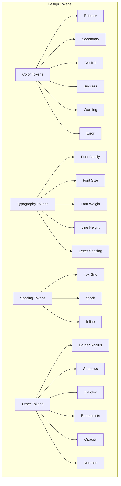
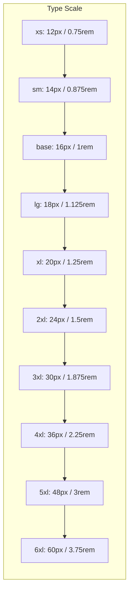
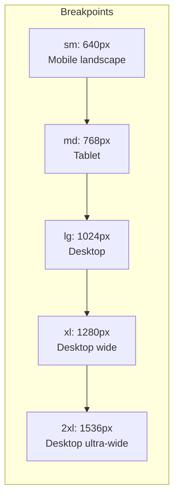
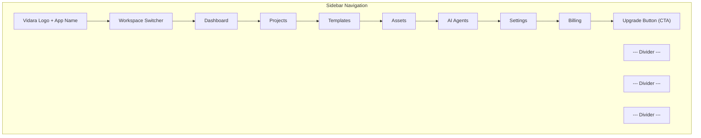
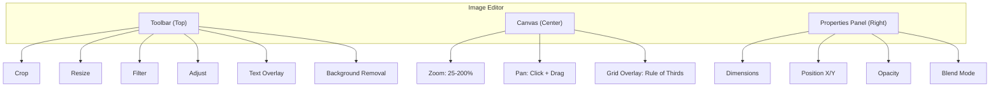
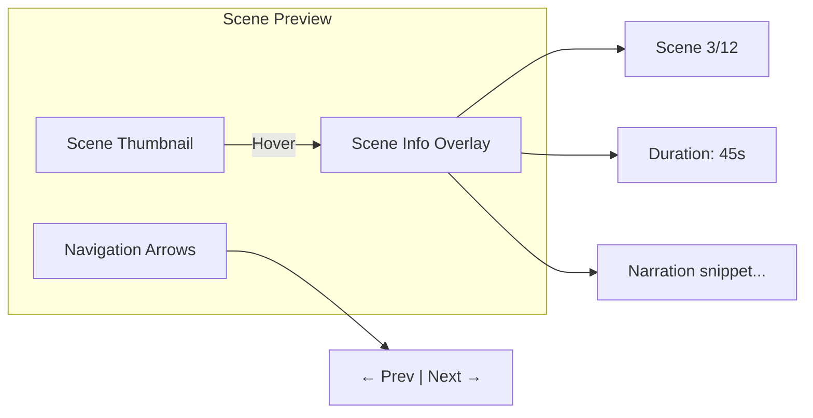
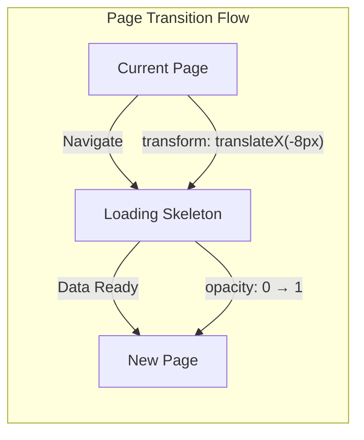
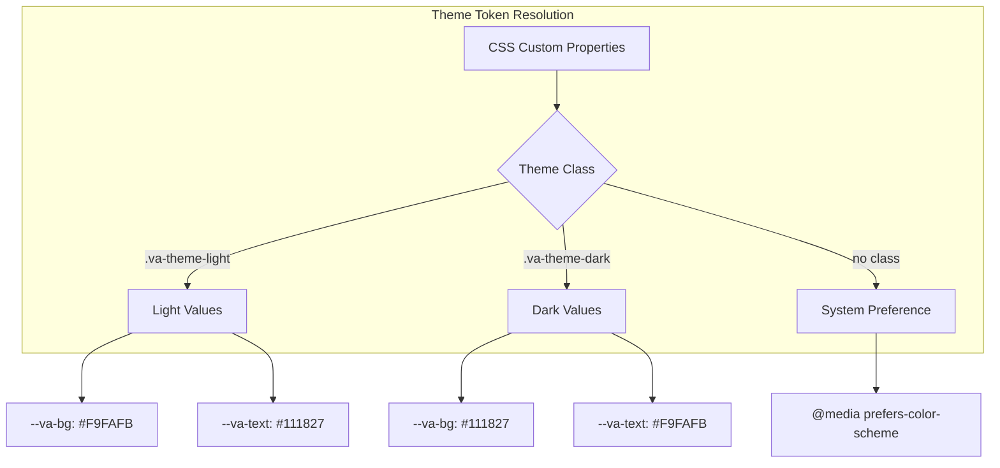

# Design System & UI/UX — Vidara AI

> **Project:** Vidara AI — AI YouTube Video Generator SaaS  
> **Author:** Agent 8 (Senior UI/UX Designer), Agent 9 (Senior Design System Engineer)  
> **Last Updated:** 2026-06-26  
> **Status:** Draft  
> **Cross-Reference:** [Tech Stack](../techstack.md) · [PRD](../prd.md) · [Architecture](../architecture.md) · [Wireframe](wireframe.md)

---

## 1. Design Philosophy

Vidara AI mengadopsi **Atomic Design Methodology** (Brad Frost) sebagai fondasi sistem desain, dikombinasikan dengan **Component-Driven Development** untuk memastikan konsistensi, scalability, dan maintainability.

### 1.1 Atomic Design Levels

| Level | Definisi | Contoh Vidara AI |
|---|---|---|
| **Atoms** | Elemen UI terkecil yang tidak bisa dipecah lagi | Button, Input, Label, Icon, Badge |
| **Molecules** | Kombinasi atoms yang membentuk unit fungsional | SearchBar (Input + Button + Icon), FormField (Label + Input + ErrorText) |
| **Organisms** | Kombinasi molecules yang membentuk section utuh | Sidebar, Topbar, ProjectCard, VideoTimeline |
| **Templates** | Layout structure yang mengatur posisi organisms | DashboardLayout, EditorLayout, SettingsLayout |
| **Pages** | Template + real content = halaman final | Dashboard Page, Video Editor Page, Script Editor Page |

### 1.2 Component-Driven Development

- **Single Responsibility**: Setiap component memiliki satu tanggung jawab yang jelas
- **Props-driven**: Konfigurasi melalui props, bukan CSS overrides
- **Composable**: Component kecil bisa dikomposisi menjadi component lebih besar
- **Nuxt UI 4 First**: Semua base component menggunakan Nuxt UI 4 sebagai foundation, kemudian di-extend untuk Vidara AI
- **Tree-shakeable**: Import hanya component yang digunakan

### 1.3 Design Principles

| Prinsip | Deskripsi |
|---|---|
| **Clarity over Creativity** | Utamakan kejelasan dan usability daripada eksperimen visual |
| **Progressive Disclosure** | Tampilkan informasi kompleks secara bertahap; jangan overwhelm user |
| **Consistent by Default** | Platform konsisten secara visual dan interaktif; exceptions harus justified |
| **Feedback Everywhere** | Setiap aksi user harus mendapat feedback visual <100ms |
| **Error Prevention > Error Recovery** | Cegah error sebelum terjadi dengan validation real-time |

---

## 2. Design Tokens

Design tokens adalah source of truth untuk semua keputusan visual. Diimplementasikan sebagai CSS Custom Properties dan di-export sebagai JSON untuk konsumsi multi-platform.

### 2.1 Token Categories



### 2.2 Token Naming Convention

`--va-{category}-{property}-{variant}`

Contoh:
- `--va-color-primary-500`
- `--va-typography-size-lg`
- `--va-spacing-4`
- `--va-radius-md`

---

## 3. Color System

### 3.1 Light Mode Palette

| Token | Hex | Usage |
|---|---|---|
| `--va-color-primary-50` | `#EEF2FF` | Background hover |
| `--va-color-primary-100` | `#E0E7FF` | Selected background |
| `--va-color-primary-200` | `#C7D2FE` | Border active |
| `--va-color-primary-300` | `#A5B4FC` | Icon primary |
| `--va-color-primary-400` | `#818CF8` | Hover state |
| `--va-color-primary-500` | `#6366F1` | **Default primary** |
| `--va-color-primary-600` | `#4F46E5` | Active/pressed |
| `--va-color-primary-700` | `#4338CA` | Text link |
| `--va-color-primary-800` | `#3730A3` | Dark bg accent |
| `--va-color-primary-900` | `#312E81` | Extreme dark |

| Token | Hex | Usage |
|---|---|---|
| `--va-color-secondary-50` | `#F0F9FF` | Background hover |
| `--va-color-secondary-500` | `#0EA5E9` | **Default secondary** |
| `--va-color-secondary-700` | `#0369A1` | Text link |

| Token | Hex | Usage |
|---|---|---|
| `--va-color-neutral-50` | `#F9FAFB` | Page background |
| `--va-color-neutral-100` | `#F3F4F6` | Card background |
| `--va-color-neutral-200` | `#E5E7EB` | Border default |
| `--va-color-neutral-300` | `#D1D5DB` | Border muted |
| `--va-color-neutral-400` | `#9CA3AF` | Placeholder text |
| `--va-color-neutral-500` | `#6B7280` | Text muted |
| `--va-color-neutral-600` | `#4B5563` | Text secondary |
| `--va-color-neutral-700` | `#374151` | Text body |
| `--va-color-neutral-800` | `#1F2937` | Text heading |
| `--va-color-neutral-900` | `#111827` | Text bold |

| Token | Hex | Usage |
|---|---|---|
| `--va-color-success-500` | `#10B981` | Success state |
| `--va-color-warning-500` | `#F59E0B` | Warning state |
| `--va-color-error-50` | `#FEF2F2` | Error bg light |
| `--va-color-error-500` | `#EF4444` | Error state |
| `--va-color-error-700` | `#B91C1C` | Error text |

### 3.2 Dark Mode Palette

| Light Token | Dark Token | Dark Hex |
|---|---|---|
| `neutral-50` | `neutral-900` | `#111827` |
| `neutral-100` | `neutral-800` | `#1F2937` |
| `neutral-200` | `neutral-700` | `#374151` |
| `neutral-700` | `neutral-200` | `#E5E7EB` |
| `neutral-800` | `neutral-100` | `#F3F4F6` |
| `neutral-900` | `neutral-50` | `#F9FAFB` |
| `primary-500` | `primary-400` | `#818CF8` |

### 3.3 Accessibility Contrast Ratios

Semua kombinasi warna memenuhi **WCAG AA minimum**:

| Kombinasi | Ratio | Pass AA (4.5:1) |
|---|---|---|
| `primary-600` (#4F46E5) on `neutral-50` (#F9FAFB) | 7.2:1 | ✅ |
| `neutral-700` (#374151) on `neutral-100` (#F3F4F6) | 10.5:1 | ✅ |
| `neutral-900` (#111827) on `neutral-50` (#F9FAFB) | 18.2:1 | ✅ |
| `primary-500` (#6366F1) on `neutral-800` (#1F2937) | 6.1:1 | ✅ (dark mode) |
| `neutral-100` (#F3F4F6) on `neutral-800` (#1F2937) | 9.8:1 | ✅ (dark mode) |
| `error-500` (#EF4444) on `neutral-50` (#F9FAFB) | 5.4:1 | ✅ |

Cross-reference: WCAG 2.2 Level AA compliance detail di [Section 19 — Accessibility](#19-accessibility).

---

## 4. Typography

### 4.1 Font Families

| Usage | Font | Fallback | Source |
|---|---|---|---|
| **Heading** | `Inter` | `system-ui, sans-serif` | Google Fonts |
| **Body** | `Inter` | `system-ui, sans-serif` | Google Fonts |
| **Mono** | `JetBrains Mono` | `monospace` | Google Fonts |
| **Display** | `Plus Jakarta Sans` | `Inter, sans-serif` | Google Fonts |

### 4.2 Type Scale



### 4.3 Font Weights & Line Heights

| Token | Weight | Line Height | Usage |
|---|---|---|---|
| `--va-font-light` | 300 | — | Display large text |
| `--va-font-regular` | 400 | 1.5 | Body text |
| `--va-font-medium` | 500 | 1.5 | Navigation, buttons |
| `--va-font-semibold` | 600 | 1.4 | Subheadings |
| `--va-font-bold` | 700 | 1.3 | Headings h2-h4 |
| `--va-font-extrabold` | 800 | 1.2 | Headings h1 |

### 4.4 Responsive Text Scale

| Element | Mobile | Tablet | Desktop |
|---|---|---|---|
| h1 | 2rem (32px) | 2.5rem (40px) | 3rem (48px) |
| h2 | 1.5rem (24px) | 1.75rem (28px) | 2rem (32px) |
| h3 | 1.25rem (20px) | 1.375rem (22px) | 1.5rem (24px) |
| body | 0.875rem (14px) | 0.9375rem (15px) | 1rem (16px) |
| small | 0.75rem (12px) | 0.75rem (12px) | 0.8125rem (13px) |

### 4.5 Typography Hierarchy

```
h1 — Page Title (Dashboard, Workspace)        — 3rem / Extrabold
h2 — Section Title (Recent Projects)           — 2rem / Bold
h3 — Card Title (Project Card)                 — 1.5rem / Semibold
h4 — Subsection Title (Scene Properties)       — 1.25rem / Semibold
body — Paragraph, Description                   — 1rem / Regular
body-sm — Metadata, Timestamps                  — 0.875rem / Regular
caption — Labels, Badge Text                    — 0.75rem / Medium
mono — Code, File Paths                        — 0.875rem / Regular (Mono)
```

---

## 5. Spacing & Layout Grid

### 5.1 4px Grid System

Semua spacing menggunakan kelipatan 4px (4px base grid).

| Token | Value | Rem | Usage |
|---|---|---|---|
| `--va-space-0` | 0px | 0 | Reset |
| `--va-space-1` | 4px | 0.25rem | Micro spacing |
| `--va-space-2` | 8px | 0.5rem | Tight spacing |
| `--va-space-3` | 12px | 0.75rem | Compact spacing |
| `--va-space-4` | 16px | 1rem | **Base spacing** |
| `--va-space-5` | 20px | 1.25rem | Comfortable |
| `--va-space-6` | 24px | 1.5rem | Section spacing |
| `--va-space-8` | 32px | 2rem | Large section |
| `--va-space-10` | 40px | 2.5rem | Page spacing |
| `--va-space-12` | 48px | 3rem | Page section |
| `--va-space-16` | 64px | 4rem | Major section |
| `--va-space-20` | 80px | 5rem | Hero spacing |

### 5.2 12-Column Grid System

```
┌─────────────────────────────────────────────────────────────┐
│       12-Column Responsive Grid (gap: 24px desktop)          │
├──┬──┬──┬──┬──┬──┬──┬──┬──┬──┬──┬──┬──┬──┬──┬──┬──┬──┬──┬──┤
│1 │2 │3 │4 │5 │6 │7 │8 │9 │10│11│12│  Gap varies by breakpoint│
├──┴──┴──┴──┴──┴──┴──┴──┴──┴──┴──┴──┴──────────────────────────┤
│  Column = (container_width - 11 * gap) / 12                   │
└─────────────────────────────────────────────────────────────┘
```

- **Container max-width**: 1280px (xl) untuk dashboard, 1536px (2xl) untuk editor
- **Gutter**: 24px desktop, 16px tablet, 12px mobile
- **Padding**: 32px side padding desktop, 16px mobile

### 5.3 Layout Composition Rules

| Pattern | Grid Columns | Usage |
|---|---|---|
| Single column | 12 | Dashboard, Settings |
| Two column (sidebar + main) | 3 + 9 | Workspace with sidebar |
| Two column (equal) | 6 + 6 | Split editors |
| Three column | 3 + 6 + 3 | Video Editor (sidebar + timeline + properties) |
| Full width | 12 | Landing page hero, Video preview |

---

## 6. Border Radius & Shadows

### 6.1 Border Radius

| Token | Value | Usage |
|---|---|---|
| `--va-radius-none` | 0px | Tables, lists |
| `--va-radius-sm` | 4px | Input fields, buttons small |
| `--va-radius-md` | 8px | Cards, buttons, modals |
| `--va-radius-lg` | 12px | Dialogs, drawers |
| `--va-radius-xl` | 16px | Large cards, containers |
| `--va-radius-2xl` | 24px | Full-screen modals |
| `--va-radius-full` | 9999px | Badges, pills, avatars |

### 6.2 Shadows

| Token | Value | Usage |
|---|---|---|
| `--va-shadow-sm` | `0 1px 2px 0 rgb(0 0 0 / 0.05)` | Cards default |
| `--va-shadow-md` | `0 4px 6px -1px rgb(0 0 0 / 0.1)` | Elevated cards |
| `--va-shadow-lg` | `0 10px 15px -3px rgb(0 0 0 / 0.1)` | Modals, drawers |
| `--va-shadow-xl` | `0 20px 25px -5px rgb(0 0 0 / 0.1)` | Full-screen overlays |
| `--va-shadow-ring` | `0 0 0 2px var(--va-color-primary-500)` | Focus ring |

### 6.3 Dark Mode Shadows

Dark mode shadows menggunakan warna dengan opacity lebih tinggi karena dark background:

| Token | Dark Value |
|---|---|
| `--va-shadow-sm` | `0 1px 2px 0 rgb(0 0 0 / 0.3)` |
| `--va-shadow-md` | `0 4px 6px -1px rgb(0 0 0 / 0.4)` |
| `--va-shadow-lg` | `0 10px 15px -3px rgb(0 0 0 / 0.5)` |

---

## 7. Z-Index System

| Token | Value | Usage |
|---|---|---|
| `--va-z-dropdown` | 50 | Dropdown menus |
| `--va-z-sticky` | 100 | Sticky headers |
| `--va-z-fixed` | 200 | Fixed navbar |
| `--va-z-modal-backdrop` | 300 | Modal backdrop |
| `--va-z-modal` | 400 | Modal dialog |
| `--va-z-popover` | 500 | Tooltips, popovers |
| `--va-z-toast` | 600 | Toast notifications |
| `--va-z-loader` | 700 | Full-screen loader |

---

## 8. Breakpoints & Responsive

### 8.1 Breakpoint Definitions



### 8.2 Responsive Strategy

| Breakpoint | Target | Layout |
|---|---|---|
| `<640px` | Mobile portrait | Single column, stacked navigation, collapsible sidebar |
| `640-768px` | Mobile landscape | Single column, bottom navigation |
| `768-1024px` | Tablet | 2-column grid, sidebar as overlay |
| `1024-1280px` | Desktop | 3-column grid (editor), sidebar visible |
| `1280-1536px` | Desktop wide | Max-width container, comfortable spacing |
| `>1536px` | Ultra-wide | Full-width editor, side-by-side panels |

### 8.3 Container Max-Widths

| Page Type | Container | Breakpoint Trigger |
|---|---|---|
| Landing, Marketing | `max-w-7xl` (1280px) | Centered, xl |
| Dashboard | `max-w-7xl` (1280px) | Centered, xl |
| Workspace | `max-w-7xl` (1280px) | Centered, xl |
| Editor pages | `max-w-full` | Full width |
| Settings | `max-w-3xl` (768px) | Centered, md |
| Auth pages | `max-w-md` (448px) | Centered, sm |

---

## 9. Iconography

- **Library**: Nuxt UI 4 default icon set (Heroicons v2 / Lucide)
- **Size**: 16px (sm), 20px (md), 24px (lg), 32px (xl)
- **Style**: Outline (default), Solid (selected/active states)
- **Color**: Inherit from text color or `currentColor`
- **Custom Icons**: SVG sprite for Vidara-specific icons (AI agent icons, video pipeline icons, brand mark)

### Icon Sizing Guidelines

| Context | Size |
|---|---|
| Inline with text | 16px |
| Navigation items | 20px |
| Action buttons | 20px |
| Empty state illustrations | 64-96px |
| AI agent avatars | 24-32px |

---

## 10. Component Library — Navigation

Semua component di-extend dari **Nuxt UI 4** base components menggunakan `extends` atau `theme` config.

### 10.1 Sidebar



| Variant | Description |
|---|---|
| `Sidebar` | Full sidebar with icons + labels (desktop) |
| `SidebarCollapsed` | Icons only (collapsed state) |
| `SidebarMobile` | Bottom sheet overlay (mobile) |
| `SidebarRail` | Slim rail on left edge, expands on hover |

### 10.2 Topbar

| Element | Description |
|---|---|
| Breadcrumbs | Current location (e.g. Projects > My Video > Script) |
| Search | Global search (`Cmd+K`) |
| Notifications | Bell icon with unread count |
| Profile | Avatar + dropdown (settings, logout) |
| Upgrade CTA | Pill button if on Free plan |

### 10.3 Breadcrumbs

- **Separator**: Chevron right icon (`/`)
- **Max items**: 4 (truncate middle with ellipsis)
- **Current page**: Non-clickable, `font-semibold`

### 10.4 Tabs

| Variant | Usage |
|---|---|
| `TabUnderline` | Page-level navigation (Settings tabs) |
| `TabPills` | Filter-type navigation (Pipeline steps) |
| `TabSegmented` | Toggle between views (Timeline/Storyboard) |

### 10.5 Steps (Stepper)

Digunakan di **Video Pipeline** untuk menunjukkan progress:

```
[1] Script  →  [2] Visuals  →  [3] Audio  →  [4] Compose  →  [5] Publish
  ✅             ⏳             ⬜             ⬜             ⬜
```

- **Completed**: Green checkmark + label
- **Active**: Primary color + pulse animation
- **Pending**: Gray circle + muted label
- **Error**: Red X + shake animation

---

## 11. Component Library — Data Display

### 11.1 Cards

| Variant | Usage |
|---|---|
| `Card` | Default card with padding, shadow, border |
| `CardHover` | Interactive card with hover lift animation |
| `CardClickable` | Clickable card with focus ring |
| `CardDraggable` | Draggable card with grip indicator |

**Card Anatomy:**
```
┌─────────────────────────────────┐
│  ┌─────┐                        │
│  │ Thumb│  Title                 │
│  │ nail │  Description           │
│  └─────┘  Metadata (date, type)  │
│  ─────────────────────────────── │
│  Actions: Edit / Delete / Share  │
└─────────────────────────────────┘
```

### 11.2 Tables

| Variant | Usage |
|---|---|
| `Table` | Default bordered table |
| `TableCompact` | Dense table for data-heavy views |
| `TableVirtual` | Virtual-scrolled table for 1000+ rows |

**Design Rules:**
- Header: sticky, `font-semibold`, `text-sm`
- Rows: alternating `neutral-50` / white
- Row height: 48px default, 40px compact
- Sortable columns: clickable header with sort icon

### 11.3 Stat Cards

```
┌──────────────┐  ┌──────────────┐  ┌──────────────┐  ┌──────────────┐
│  📊          │  │  🎬          │  │  ⏱️           │  │  💰          │
│  Total Views │  │  Videos      │  │  Avg Watch    │  │  Revenue     │
│  1,234,567   │  │  42          │  │  8:32         │  │  $2,450     │
│  ↑ 12%       │  │  ↑ 3 this wk │  │  ↑ 5%         │  │  ↑ 18%      │
└──────────────┘  └──────────────┘  └──────────────┘  └──────────────┘
```

- **Icon**: 32px circle with brand color background
- **Value**: `font-bold text-2xl`
- **Trend**: Arrow + percentage, green for positive, red for negative
- **Layout**: 4-column grid on desktop, 2-column on tablet, 1-column on mobile

### 11.4 Lists

| Variant | Usage |
|---|---|
| `List` | Simple vertical list |
| `ListItem` | Individual item with icon + label + action |
| `ListDraggable` | Reorderable list with drag handles |
| `ListVirtual` | Virtual-scrolled for 1000+ items |

### 11.5 Timelines

Digunakan di **Activity Feed** dan **Pipeline Progress**:

```
● [10:32] Script generated — View script →
● [10:28] Voiceover complete — Preview →
● [10:15] Image generation started
● [09:58] Pipeline initialized
```

- **Dot**: 8px circle, color-coded by event type
- **Line**: 2px solid, connecting dots
- **Time**: `text-sm text-neutral-400`

---

## 12. Component Library — Input

### 12.1 Text Fields

| Variant | Usage |
|---|---|
| `Input` | Default text input |
| `InputWithIcon` | Input with leading/trailing icon |
| `Textarea` | Multi-line text input |
| `TextareaAutoResize` | Auto-expanding textarea for scripts |
| `PromptInput` | Large prompt input with suggestions dropdown |

**Prompt Input Anatomy (AI Prompt Input):**
```
┌──────────────────────────────────────────────┐
│  ✨ Describe your video...                    │
│  "Buat video edukasi 8 menit tentang..."     │
│                                              │
│  🎯 Suggestions: Trending | Educational       │
│  [Generate Video] 🔒 45 credits              │
└──────────────────────────────────────────────┘
```

### 12.2 Selects

| Variant | Usage |
|---|---|
| `Select` | Native select (simple) |
| `SelectSearchable` | Search + filter options |
| `SelectMulti` | Multi-select with tags |
| `SelectCreatable` | Type to create new option |

### 12.3 Date & Time Pickers

| Variant | Usage |
|---|---|
| `DatePicker` | Single date selection |
| `DateRangePicker` | Date range for analytics |
| `DateTimePicker` | Date + time for YouTube schedule |
| `TimePicker` | Time selection |

### 12.4 Color Picker

Digunakan di **Brand Kit**:

- Swatch grid (preset colors from brand kit)
- Custom HEX input
- Eye dropper (browser API)
- Accessibility contrast indicator (AA/AAA pass/fail)

### 12.5 File Upload

| Variant | Usage |
|---|---|
| `FileUpload` | Single file with preview |
| `FileUploadMultiple` | Multiple files with list |
| `FileUploadDropzone` | Drag-and-drop zone |
| `FileUploadAsset` | Asset library upload with tagging |

**Dropzone Anatomy:**
```
┌──────────────────────────────────────┐
│  ┌───┐                               │
│  │ 📁│  Drag & drop files here       │
│  └───┘  or click to browse           │
│                                      │
│  Supported: PNG, JPG, MP4, MP3, WAV  │
│  Max: 500MB per file                 │
└──────────────────────────────────────┘
```

---

## 13. Component Library — Feedback

### 13.1 Alerts

| Variant | Icon | Color |
|---|---|---|
| `AlertInfo` | ℹ️ | Blue (secondary) |
| `AlertSuccess` | ✅ | Green (success) |
| `AlertWarning` | ⚠️ | Yellow (warning) |
| `AlertError` | ❌ | Red (error) |

- **Dismissible**: Optional close button
- **Action**: Optional CTA button
- **Timeout**: Auto-dismiss for toast variants (5s)

### 13.2 Toasts

| Position | Stacking | Usage |
|---|---|---|
| Top-right | Vertical stack (max 3) | General notifications |
| Bottom-center | Single | Progress notifications |
| Top-center | Single | Critical alerts |

### 13.3 Modals

| Variant | Width | Usage |
|---|---|---|
| `ModalSm` | 400px | Confirmations, short forms |
| `ModalMd` | 600px | Edit forms, settings |
| `ModalLg` | 800px | Project details, preview |
| `ModalXl` | 1024px | Video preview, full forms |
| `ModalFull` | Full screen | Image editor, thumbnail editor |

**Modal Anatomy:**
```
┌──────────────────────────────────────┐
│  Title                    [X] Close  │
│  ─────────────────────────────────── │
│  Content area (scrollable)           │
│                                      │
│                                      │
│  ─────────────────────────────────── │
│  [Cancel]              [Confirm]     │
└──────────────────────────────────────┘
```

### 13.4 Drawers

| Variant | Side | Width | Usage |
|---|---|---|---|
| `DrawerLeft` | Left | 320px | Navigation sidebar |
| `DrawerRight` | Right | 400px | Properties panel |
| `DrawerBottom` | Bottom | Full | Mobile actions |

### 13.5 Tooltips & Popovers

| Variant | Trigger | Usage |
|---|---|---|
| `Tooltip` | Hover (300ms delay) | Icon explanations |
| `Popover` | Click | Context menus |
| `PopoverHover` | Hover | Preview cards |

---

## 14. Component Library — Media

### 14.1 Image Editor



### 14.2 Video Player

| Feature | Description |
|---|---|
| Play/Pause | Spacebar shortcut |
| Seek | Click on timeline or drag handle |
| Speed | 0.5x, 0.75x, 1x, 1.25x, 1.5x, 2x |
| Quality | Auto, 720p, 1080p, 2K, 4K |
| Fullscreen | F key shortcut |
| Picture-in-Picture | PiP mode |
| Frame Step | Left/Right arrow keys (pause mode) |
| Markers | Add markers at timestamps for reference |

### 14.3 Waveform Viewer

Digunakan di **Voice Studio** untuk visualisasi audio:

- **Amplitude**: Vertical bars, real-time
- **Selection**: Click-drag to select segment
- **Zoom**: Horizontal scroll to zoom in/out
- **Markers**: Scene change markers on waveform
- **Sync**: Highlighted region corresponds to current script segment

### 14.4 Scene Preview



---

## 15. Component Library — AI

### 15.1 Prompt Input

Component utama untuk AI interaction:

| Part | Description |
|---|---|
| Input area | Large textarea with placeholder |
| Suggestion chips | Below input, clickable prompt templates |
| Model selector | Dropdown to switch AI model |
| Token counter | Live token count with limit warning |
| Generate button | Primary CTA with credit cost badge |
| History sidebar | Recent prompts for quick reuse |

### 15.2 Generation Progress

Pipeline progress visualization:

```
┌─────────────────────────────────────────────────────┐
│  ✨ Generating your video...                         │
│  ┌─────────────────────────────────────────────┐    │
│  │  [1] Research      ✅ Done (12s)             │    │
│  │  [2] Script        ✅ Done (45s)             │    │
│  │  [3] Visuals       ⏳ In progress... (62%)   │    │
│  │  [4] Audio         ⬜ Pending                │    │
│  │  [5] Compose       ⬜ Pending                │    │
│  │  [6] Publish       ⬜ Pending                │    │
│  └─────────────────────────────────────────────┘    │
│                                                     │
│  Total: 2m 14s  •  Credits used: 45                 │
└─────────────────────────────────────────────────────┘
```

### 15.3 Agent Activity Stream

Real-time log of AI agent activities:

```
┌────────────────────────────────────────────────────┐
│  🤖 Agent Activity                                 │
│  ───────────────────────────────────────────────── │
│  10:32:15 │ Script Agent │ Generating narrative...  │
│  10:32:18 │ Script Agent │ ✓ Hook generated        │
│  10:32:22 │ Image Agent  │ Drawing scene 3/12...   │
│  10:32:25 │ Voice Agent  │ Synthesizing speech...   │
│  10:32:30 │ Image Agent  │ ✓ Scene 3 complete      │
└────────────────────────────────────────────────────┘
```

### 15.4 AI Suggestion Panel

Panel samping yang muncul saat editing script/scene:

| Element | Description |
|---|---|
| Suggestion card | AI-generated alternative text |
| Accept/Reject | Quick action buttons |
| Regenerate | Request new suggestion |
| Feedback | Thumbs up/down for AI training |

---

## 16. Page Templates — Dashboard & Workspace

### 16.1 Dashboard Template

```
┌─────────────────────────────────────────────────────────────┐
│  Topbar: Breadcrumbs | Search | Notif | Profile | Upgrade    │
├──────────┬──────────────────────────────────────────────────┤
│  Sidebar │  ┌──────────┬──────────┬──────────┬──────────┐   │
│  Logo     │  │ Stat 1   │ Stat 2   │ Stat 3   │ Stat 4   │   │
│  ─────── │  └──────────┴──────────┴──────────┴──────────┘   │
│  Dashboard│                                                   │
│  Projects │  ┌───────────────────┐  ┌───────────────────┐    │
│  Templates│  │ Recent Activity   │  │ Pipeline Status    │    │
│  Assets   │  │ - timeline items -│  │ - progress bars -  │    │
│  ─────── │  └───────────────────┘  └───────────────────┘    │
│  AI Agents│                                                   │
│  Settings │  ┌───────────────────────────────────────────┐   │
│  Billing  │  │ Quick Actions                             │   │
│  ─────── │  │ [New Project] [Generate from Prompt]       │   │
│  Upgrade  │  │ [Upload Asset] [Invite Team]              │   │
└──────────┴──┴───────────────────────────────────────────┘───┘
```

### 16.2 Workspace Template (Project Grid)

```
┌─────────────────────────────────────────────────────────────┐
│  Workspace: "My Content"    [New Project] [Filter] [Sort]   │
├─────────────────────────────────────────────────────────────┤
│  [Folder: Q3 Campaign] [Folder: Tutorials] [+] New Folder   │
│  ───────────────────────────────────────────────────────────│
│  ┌─────────┐ ┌─────────┐ ┌─────────┐ ┌─────────┐           │
│  │ 🎬      │ │ 🎬      │ │ 🎬      │ │ 🎬      │           │
│  │ Project │ │ Project │ │ Project │ │ Project │           │
│  │ A       │ │ B       │ │ C       │ │ D       │           │
│  │ 08:32   │ │ 12:15   │ │ 📝 draft│ │ ✅ done │           │
│  └─────────┘ └─────────┘ └─────────┘ └─────────┘           │
│  ┌─────────┐ ┌─────────┐                                     │
│  │ 🎬      │ │ 📁      │                                     │
│  │ Project │ │ Empty   │                                     │
│  │ E       │ │ Folder  │                                     │
│  │ ⏳ gen.. │ │         │                                     │
│  └─────────┘ └─────────┘                                     │
└─────────────────────────────────────────────────────────────┘
```

---

## 17. Page Templates — Video Editor & Script Editor

### 17.1 Video Editor Template (Split Panel)

Layout tiga kolom untuk production view:

```
┌──────────────────────────────────────────────────────────────┐
│  Topbar: Project Name | [Save] [Preview] [Render] [Export]   │
├──────────┬────────────────────────────────┬──────────────────┤
│  Scene   │  Timeline + Preview            │  Properties      │
│  List    │                                │  Panel           │
│          │  ┌──────────────────────────┐  │                  │
│  Scene 1 │  │  Video Preview           │  │  Duration: 45s   │
│  Scene 2 │  │  (16:9 viewport)         │  │  Transition: Fade│
│  Scene 3 │  │                          │  │  Audio: -14dB   │
│  Scene 4 │  └──────────────────────────┘  │                  │
│  Scene 5 │                                │  ┌──────────────┐│
│  Scene 6 │  ┌──────────────────────────┐  │  │ Scene Props  ││
│  Scene 7 │  │  Timeline                │  │  │ - Image      ││
│  Scene 8 │  │  [=====▮=====▮=====▮===] │  │  │ - Voice      ││
│  + Add   │  │  0:00              3:25  │  │  │ - Subtitle   ││
│          │  └──────────────────────────┘  │  └──────────────┘│
└──────────┴────────────────────────────────┴──────────────────┘
```

### 17.2 Script Editor Template

```
┌──────────────────────────────────────────────────────────────┐
│  Script Editor — "How to Start a Podcast"                    │
│  [Edit] [Rewrite Section] [Generate] [AI Suggestions ✨]     │
├─────────────────────────┬────────────────────────────────────┤
│  Rich Text Editor       │  AI Suggestion Panel               │
│                         │                                    │
│  # How to Start a       │  ┌──────────────────────────────┐  │
│  Podcast in 2026        │  │ ✨ Suggestions                │  │
│                         │  │                              │  │
│  ## Hook (0:00-0:15)    │  │ • Add a stronger hook about  │  │
│  Did you know that      │  │   podcasting statistics      │  │
│  75% of podcast...      │  │ • Include a personal         │  │
│                         │  │   anecdote for connection    │  │
│  ## Section 1: Why...   │  │ • Shorten this paragraph     │  │
│  The first thing you    │  │   to 2 sentences             │  │
│  need to understand...  │  │                              │  │
│                         │  │ [Apply] [Dismiss] [↻ Regen]  │  │
│  Words: 850 | Est: 7min │  └──────────────────────────────┘  │
│  Tone: Educational      │                                    │
└─────────────────────────┴────────────────────────────────────┘
```

---

## 18. Page Templates — Scene Builder & Settings

### 18.1 Scene Builder Template (Storyboard View)

```
┌──────────────────────────────────────────────────────────────┐
│  Storyboard — "How to Start a Podcast" (12 scenes)          │
│  [Timeline View] [Grid View] [List View]  [+ Add Scene]     │
├──────────────────────────────────────────────────────────────┤
│  ┌──────┐  ┌──────┐  ┌──────┐  ┌──────┐  ┌──────┐          │
│  │ 🖼️   │  │ 🖼️   │  │ 🖼️   │  │ 🖼️   │  │ 🖼️   │          │
│  │Scene │  │Scene │  │Scene │  │Scene │  │Scene │          │
│  │ 1    │  │ 2    │  │ 3    │  │ 4    │  │ 5    │          │
│  │45s   │  │30s   │  │60s   │  │45s   │  │30s   │          │
│  │Fade  │  │Cross │  │Zoom  │  │Slide │  │Cut   │          │
│  └──────┘  └──────┘  └──────┘  └──────┘  └──────┘          │
│  ┌──────┐  ┌──────┐  ┌──────┐  ┌──────┐  ┌──────┐          │
│  │ 🖼️   │  │ 🖼️   │  │ 🖼️   │  │ 🖼️   │  │  +   │          │
│  │Scene │  │Scene │  │Scene │  │Scene │  │ Add  │          │
│  │ 6    │  │ 7    │  │ 8    │  │ 9    │  │Scene │          │
│  │30s   │  │45s   │  │30s   │  │60s   │  │      │          │
│  │ Fade │  │Cut   │  │Cross │  │Zoom  │  │      │          │
│  └──────┘  └──────┘  └──────┘  └──────┘  └──────┘          │
└──────────────────────────────────────────────────────────────┘
```

### 18.2 Settings Template (Tabbed)

```
┌──────────────────────────────────────────────────────────────┐
│  Settings                                                    │
│  [Profile] [Workspace] [Organization] [Niche] [Billing] [Security]   │
├──────────────────────────────────────────────────────────────┤
│  Profile Settings                                            │
│  ┌────────────────────────────────────────────────────────┐  │
│  │  Avatar: [🖼️ Upload]  Name: [________________]        │  │
│  │  Email: user@example.com  (verified ✅)                │  │
│  │  Language: [English ▼]   Theme: [Light ▼]             │  │
│  └────────────────────────────────────────────────────────┘  │
│                                                               │
│  Notification Preferences                                     │
│  ┌────────────────────────────────────────────────────────┐  │
│  │  ☑ Email notifications                                 │  │
│  │  ☑ In-app notifications                                │  │
│  │  ☐ Weekly digest                                       │  │
│  │  ☐ Marketing emails                                    │  │
│  └────────────────────────────────────────────────────────┘  │
│                                                               │
│  [Save Changes]                                               │
└──────────────────────────────────────────────────────────────┘
```

---

## 19. Accessibility

### 19.1 WCAG 2.2 Level AA Compliance

| Kriteria | Coverage | Implementation |
|---|---|---|
| **1.1.1 Non-text Content** (A) | ✅ | All icons have `aria-label` or `alt` text |
| **1.3.1 Info and Relationships** (A) | ✅ | Semantic HTML (`<nav>`, `<main>`, `<aside>`) |
| **1.4.1 Use of Color** (A) | ✅ | Color is not sole indicator; icons + text accompany |
| **1.4.3 Contrast (Minimum)** (AA) | ✅ | All text combos ≥4.5:1 ratio |
| **1.4.4 Resize Text** (AA) | ✅ | 200% zoom without loss of content |
| **1.4.11 Non-text Contrast** (AA) | ✅ | UI components ≥3:1 vs adjacent |
| **1.4.12 Text Spacing** (AA) | ✅ | No content loss with custom spacing |
| **2.1.1 Keyboard** (A) | ✅ | All interactive elements reachable via Tab |
| **2.1.2 No Keyboard Trap** (A) | ✅ | Escape from any component |
| **2.4.3 Focus Order** (A) | ✅ | Logical tab order |
| **2.4.7 Focus Visible** (AA) | ✅ | Always visible focus ring |
| **2.5.3 Label in Name** (A) | ✅ | Accessible labels match visible text |
| **3.2.1 On Focus** (A) | ✅ | No context change on focus |
| **3.3.2 Labels or Instructions** (A) | ✅ | All inputs have associated labels |
| **4.1.2 Name, Role, Value** (A) | ✅ | ARIA states and properties |

### 19.2 Keyboard Navigation

| Shortcut | Action | Scope |
|---|---|---|
| `Tab` / `Shift+Tab` | Navigate through focusable elements | Global |
| `Enter` / `Space` | Activate focused element | Global |
| `Escape` | Close modal/drawer/popover | Global |
| `Cmd+K` | Global search | Global |
| `Cmd+N` | New project | Dashboard |
| `Cmd+S` | Save current project | Editor |
| `Cmd+Z` | Undo | Editor |
| `←` / `→` | Previous/next scene | Scene Builder |
| `Space` | Play/pause video | Video Player |
| `F` | Toggle fullscreen | Video Player |

### 19.3 Screen Reader Support

- **Landmarks**: `<nav>`, `<main>`, `<aside>`, `<form>`, `<section>` with `aria-label`
- **Dynamic Updates**: `aria-live="polite"` for activity feed, progress updates
- **Status Messages**: `role="status"` for toast notifications
- **Alerts**: `role="alert"` for error messages
- **Drag & Drop**: `aria-grabbed`, `aria-dropeffect`, keyboard alternative via buttons

### 19.4 Focus Management

- **Focus Trap**: Modals, drawers trap focus within container
- **Focus Restoration**: Return focus to trigger element after modal close
- **Skip Link**: "Skip to main content" link at page top
- **Focus Indicator**: 2px solid primary color ring, never removed on `:focus-visible`

---

## 20. Animation & Motion

### 20.1 Motion Principles

| Principle | Application |
|---|---|
| **Purposeful** | Every animation serves a functional purpose |
| **Subtle** | Duration 150-300ms, easing `cubic-bezier(0.4, 0, 0.2, 1)` |
| **Consistent** | Same motion patterns for same component types |
| **Performant** | GPU-accelerated properties only (`transform`, `opacity`) |
| **Reduced Motion** | Respect `prefers-reduced-motion` media query |

### 20.2 Animation Types

| Type | Duration | Easing | Usage |
|---|---|---|---|
| Page transitions | 200-300ms | ease-in-out | Route changes |
| Micro-interactions | 100-200ms | ease-out | Button hover, card lift |
| Skeleton loading | 1.5s loop | linear | Content loading |
| Progress indicator | 300ms | ease-in-out | Pipeline progress |
| Modal enter/exit | 200ms | ease-out / ease-in | Modals, drawers |
| Toast enter/exit | 300ms | ease-out / ease-in | Notifications |
| Gesture feedback | 100ms | ease-out | Swipe, pinch |

### 20.3 Page Transitions



- **Forward navigation** (deeper): Slide left, fade in
- **Backward navigation** (back): Slide right, fade in
- **Tab switch**: Crossfade (no directional movement)

### 20.4 Micro-interactions

| Element | Interaction | Animation |
|---|---|---|
| Button | Hover | Scale 1.02, shadow increase |
| Button | Click | Scale 0.98 (press effect) |
| Card | Hover | TranslateY -2px, shadow elevation |
| Sidebar icon | Active | Scale pulse + color transition |
| Toggle switch | Toggle | 200ms slide + background color |
| Checkbox | Check | 150ms checkmark draw + scale |
| Progress bar | Update | Width transition 300ms ease |

### 20.5 Skeleton Loading

| Component | Skeleton Pattern |
|---|---|
| Card | Rectangle + 2 text lines, shimmer animation |
| Table | 5 rows of alternating rectangles |
| Stat Card | Icon circle + 2 text bars |
| Video Preview | 16:9 rectangle + control bar |
| Timeline | Horizontal bars with varying width |

### 20.6 Progress Indicators

| Type | Size | Usage |
|---|---|---|
| Linear indeterminate | 3px height top | Page loading |
| Linear determinate | 6px height | Pipeline progress |
| Circular | 24-40px | Action loading |
| Step progress | Multi-step | Pipeline stages |

### 20.7 Gesture Support

| Gesture | Action | Platform |
|---|---|---|
| Swipe left | Go back | Mobile |
| Swipe right | Open sidebar | Mobile |
| Pinch | Zoom timeline | Tablet/Desktop |
| Drag | Reorder scenes | All |
| Long press | Context menu | Mobile |

### 20.8 Reduced Motion

```css
@media (prefers-reduced-motion: reduce) {
  *, *::before, *::after {
    animation-duration: 0.01ms !important;
    transition-duration: 0.01ms !important;
  }
}
```

---

## 21. Dark Mode & Theming Architecture

### 21.1 Theme Strategy

- **Default**: System preference (`prefers-color-scheme`)
- **Override**: Manual toggle in Settings (Light/Dark/System)
- **Persistence**: Stored in localStorage + user preferences API
- **Scope**: Applied via `.va-theme-light` / `.va-theme-dark` class on `<html>`

### 21.2 Theme Token Mapping



### 21.3 Nuxt UI 4 Theming Integration

```javascript
// nuxt.config.ts — Theme customization
export default defineNuxtConfig({
  ui: {
    theme: {
      colors: {
        primary: 'indigo',
        secondary: 'sky',
        neutral: 'slate',
      },
      tokens: {
        light: {
          background: '{neutral.50}',
          surface: 'white',
          border: '{neutral.200}',
          text: '{neutral.900}',
        },
        dark: {
          background: '{neutral.900}',
          surface: '{neutral.800}',
          border: '{neutral.700}',
          text: '{neutral.50}',
        }
      }
    }
  }
})
```

---

## 22. Future Improvement

| Improvement | Timeline | Impact |
|---|---|---|
| Design token export to Figma via Tokens Studio | V1.1 | Design-engineering sync |
| Custom theme builder UI for Enterprise (white-label) | V1.2 | Enterprise sales |
| Motion design system documentation (Lottie/Rive) | V1.1 | Rich animations |
| Accessibility audit automation via axe-core in CI | V1.0 | Consistent quality |
| Component documentation via Storybook/Nuxt DevTools | V1.0 | Developer adoption |
| i18n for RTL languages (Arabic) | V2.0 | Market expansion |

---

## 23. Acceptance Criteria

| AC | Kriteria | Status |
|---|---|---|
| AC-01 | Design philosophy documented with Atomic Design methodology | ✅ |
| AC-02 | Design tokens defined for all visual properties | ✅ |
| AC-03 | Color system includes light & dark mode with WCAG contrast | ✅ |
| AC-04 | Typography scale with responsive definitions | ✅ |
| AC-05 | Component library covers navigation, data display, input, feedback, media, AI | ✅ |
| AC-06 | Page templates defined for all key views (Dashboard, Editor, Settings) | ✅ |
| AC-07 | Accessibility section covers WCAG AA, keyboard nav, screen reader | ✅ |
| AC-08 | Animation & motion guidelines with reduced motion support | ✅ |
| AC-09 | Cross-references to techstack.md, prd.md, architecture.md | ✅ |

---

## 24. Referensi Dokumen Lain

| Dokumen | Path |
|---|---|
| Wireframe & Layout | `internal/docs/wireframe.md` |
| Product Requirement Document | `internal/docs/prd.md` |
| Tech Stack Document | `internal/docs/techstack.md` |
| Architecture Document | `internal/docs/architecture.md` |
| Workflow & Orchestration | `internal/docs/workflow.md` |
| BRD Document | `internal/docs/brd.md` |
| FRD Document | `internal/docs/frd.md` |
| Nuxt UI 4 Documentation | `https://ui.nuxt.com` |
| WCAG 2.2 Specification | `https://www.w3.org/TR/WCAG22/` |

---

> **End of Design System & UI/UX Document** — Vidara AI © 2026
