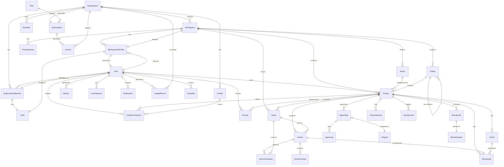
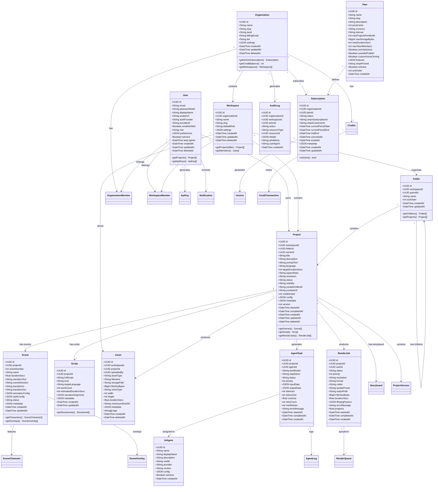
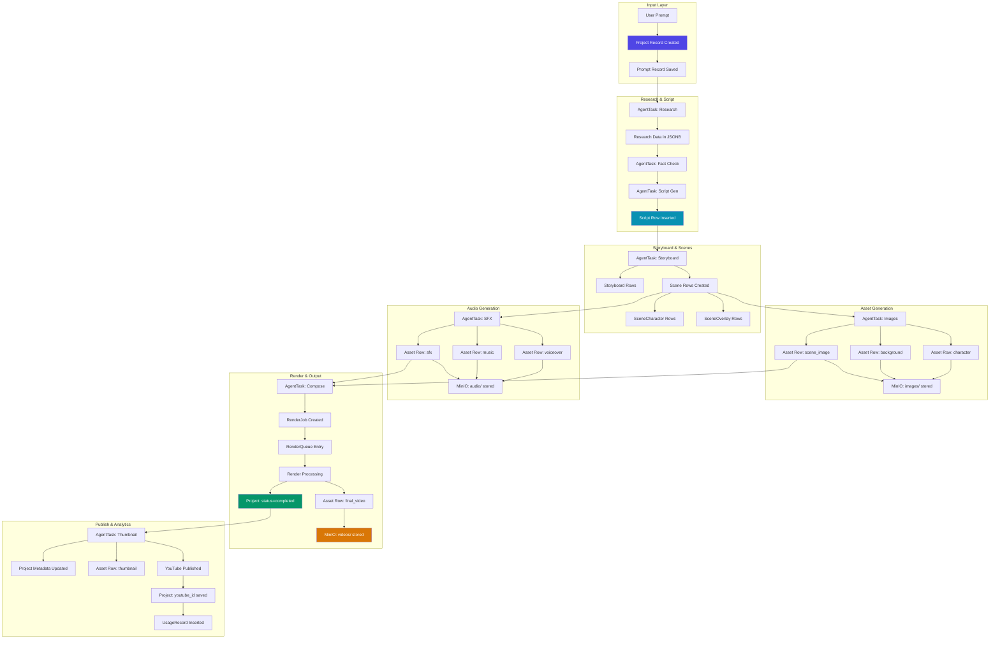

# Entity Relationship Diagram — Vidara AI

> **Project:** Vidara AI — AI YouTube Video Generator SaaS  
> **Author:** Agent 13 — Senior Database Engineer  
> **Last Updated:** 2026-06-26  
> **Status:** Approved  
> **Cross-Reference:** [Database](database.md) · [Architecture](architecture.md) · [Tech Stack](techstack.md)

---

## 1. Tujuan

Dokumen Entity Relationship Diagram (ERD) ini mendefinisikan seluruh entitas data Vidara AI, relasi antar entitas, atribut lengkap, index definitions, data flow, data lifecycle, dan strategi concurrency. Berfungsi sebagai visual reference bagi seluruh engineer untuk memahami struktur data platform dan bagaimana data bergerak melalui pipeline AI video generation.

---

## 2. Background

Vidara AI memiliki ~30 entitas data inti yang saling berelasi — dari user management, project/scene hierarchy, AI agent orchestration, asset storage, billing/subscription, hingga audit/compliance. Kompleksitas relasi memerlukan dokumentasi visual yang jelas menggunakan Mermaid ERD dan Class Diagram, serta dokumentasi tekstual yang detail untuk setiap aspek data.

Dokumen ini adalah turunan dari `database.md` dan menjadi referensi utama untuk:
- Developer yang mengimplementasikan query dan migrasi
- DevOps yang mengelola backup dan partitioning
- QA yang menulis test untuk data integrity
- Security Engineer yang mengimplementasikan RLS dan encryption

---

## 3. Objective

1. Menyediakan visual ERD yang valid dan comprehensif untuk seluruh entitas inti.
2. Mendefinisikan setiap entity dengan atribut, tipe, nullable, default, dan foreign keys.
3. Mendokumentasikan relasi one-to-many, many-to-many, dan self-referential.
4. Menjelaskan data flow dari input prompt hingga output video.
5. Mendefinisikan data lifecycle: create → process → store → archive → delete.
6. Mendokumentasikan strategi concurrency (optimistic locking, transaction isolation).

---

## 4. Scope

**In Scope:**
- Mermaid ER Diagram dari semua core entities
- Mermaid Class Diagram dari domain model
- Entity definitions table dengan full attribute specification
- Relationship mapping (1:N, M:N, self-referential)
- Index definitions dengan rationale
- Data pipeline flow diagram
- Data lifecycle state machine
- Concurrency strategy
- Migration strategy (seed, test, production data)

**Out of Scope:**
- Physical storage implementation (tablespace, file layout)
- Query optimization detail
- Replication configuration

---

## 5. Stakeholder

| Stakeholder | Interest |
|---|---|
| Full Stack Engineers | Entity attributes, relationships, query patterns |
| AI Engineers | Task/agent data flow, pipeline state persistence |
| DevOps Engineers | Data volume estimates, partitioning strategy |
| Solution Architect | Data integrity, cross-entity relationships |
| QA Engineers | Test data requirements, data validation rules |
| Product Managers | Entity capabilities mapping to features |

---

## 6. Requirement

| ID | Requirement |
|---|---|
| ER-01 | ERD harus mencakup semua entitas yang didefinisikan di `database.md` |
| ER-02 | Semua diagram Mermaid harus valid dan dapat dirender |
| ER-03 | Entity definitions table harus mencakup 100% atribut dengan tipe dan constraint |
| ER-04 | Data flow diagram harus mencakup pipeline prompt → video published |
| ER-05 | Concurrency strategy harus mencakup optimistic locking dan transaction isolation levels |
| ER-06 | Data lifecycle harus mencakup 5 fase: create, process, store, archive, delete |

---

## 7. Mermaid ER Diagram — All Core Entities



---

## 8. Mermaid Class Diagram — Domain Model



---

## 9. Entity Definitions — Complete Attribute Table

| Entity | Column | Type | Nullable | Default | FK | Notes |
|---|---|---|---|---|---|---|
| **users** | id | UUID | NO | gen_random_uuid() | PK | Primary key |
| | email | VARCHAR(255) | NO | — | | Unique, not encrypted (needed for communication) |
| | password_hash | VARCHAR(255) | YES | — | | Argon2 hash; NULL for OAuth users |
| | display_name | VARCHAR(100) | NO | — | | |
| | avatar_url | TEXT | YES | — | | |
| | auth_provider | VARCHAR(20) | NO | 'email' | | Enum: email, google, github |
| | provider_id | VARCHAR(255) | YES | — | | External OAuth provider user ID |
| | email_verified | BOOLEAN | NO | FALSE | | |
| | role | VARCHAR(20) | NO | 'user' | | Enum: user, admin, superadmin |
| | preferences | JSONB | NO | '{}' | | Theme, language, notification prefs |
| | is_active | BOOLEAN | NO | TRUE | | |
| | last_login_at | TIMESTAMPTZ | YES | — | | |
| | created_at | TIMESTAMPTZ | NO | NOW() | | |
| | updated_at | TIMESTAMPTZ | NO | NOW() | | Auto-updated via trigger |
| | deleted_at | TIMESTAMPTZ | YES | — | | Soft delete |

| **organizations** | id | UUID | NO | gen_random_uuid() | PK | |
| | name | VARCHAR(200) | NO | — | | |
| | slug | VARCHAR(100) | NO | — | | Unique |
| | tax_id | VARCHAR(50) | YES | — | | Indonesian NPWP |
| | billing_email | VARCHAR(255) | YES | — | | |
| | tier | VARCHAR(20) | NO | 'free' | | Enum: free, pro, business, enterprise |
| | settings | JSONB | NO | '{}' | | Security policies, defaults |

| **organization_members** | id | UUID | NO | gen_random_uuid() | PK | |
| | organization_id | UUID | NO | — | FK→organizations | CASCADE delete |
| | user_id | UUID | NO | — | FK→users | CASCADE delete |
| | role | VARCHAR(20) | NO | 'member' | | Enum: owner, admin, member, viewer |
| | invited_by | UUID | YES | — | FK→users | |
| | invited_at | TIMESTAMPTZ | YES | — | | |
| | joined_at | TIMESTAMPTZ | YES | — | | |
| | CONSTRAINT | UNIQUE(organization_id, user_id) | | | | |

| **workspaces** | id | UUID | NO | gen_random_uuid() | PK | |
| | organization_id | UUID | NO | — | FK→organizations | CASCADE delete |
| | name | VARCHAR(200) | NO | — | | |
| | slug | VARCHAR(100) | NO | — | | Unique per org |
| | default_role | VARCHAR(20) | NO | 'editor' | | Enum: admin, editor, viewer |
| | settings | JSONB | NO | '{}' | | |

| **workspace_members** | id | UUID | NO | gen_random_uuid() | PK | |
| | workspace_id | UUID | NO | — | FK→workspaces | CASCADE delete |
| | user_id | UUID | NO | — | FK→users | CASCADE delete |
| | role | VARCHAR(20) | NO | 'editor' | | Enum: owner, admin, editor, viewer |
| | invited_by | UUID | YES | — | FK→users | |
| | CONSTRAINT | UNIQUE(workspace_id, user_id) | | | | |

| **folders** | id | UUID | NO | gen_random_uuid() | PK | |
| | workspace_id | UUID | NO | — | FK→workspaces | CASCADE delete |
| | parent_id | UUID | YES | — | FK→folders | Self-referential |
| | name | VARCHAR(200) | NO | — | | |
| | sort_order | INTEGER | NO | 0 | | |

| **projects** | id | UUID | NO | gen_random_uuid() | PK | |
| | workspace_id | UUID | NO | — | FK→workspaces | CASCADE delete |
| | folder_id | UUID | YES | — | FK→folders | SET NULL |
| | owner_id | UUID | NO | — | FK→users | |
| | title | VARCHAR(300) | NO | — | | |
| | description | TEXT | YES | — | | |
| | prompt_text | TEXT | YES | — | | Original user prompt |
| | language | VARCHAR(10) | NO | 'en' | | |
| | target_duration_secs | INTEGER | YES | — | | |
| | aspect_ratio | VARCHAR(10) | NO | '16:9' | | Enum |
| | resolution | VARCHAR(10) | NO | '1080p' | | Enum: 720p, 1080p, 2k, 4k |
| | status | VARCHAR(20) | NO | 'draft' | | Enum |
| | visibility | VARCHAR(20) | NO | 'private' | | Enum: private, unlisted, public |
| | youtube_video_id | VARCHAR(50) | YES | — | | |
| | youtube_url | TEXT | YES | — | | |
| | credits_used | INTEGER | NO | 0 | | |
| | config | JSONB | NO | '{}' | | Resolution, codec, quality |
| | metadata | JSONB | NO | '{}' | | SEO data, tags |
| | version | INTEGER | NO | 1 | | Optimistic lock |
| | started_at | TIMESTAMPTZ | YES | — | | |
| | completed_at | TIMESTAMPTZ | YES | — | | |

| **scripts** | id | UUID | NO | gen_random_uuid() | PK | |
| | project_id | UUID | NO | — | FK→projects | UNIQUE, CASCADE |
| | full_script | TEXT | NO | — | | |
| | tone | VARCHAR(30) | NO | 'neutral' | | Enum |
| | target_language | VARCHAR(10) | NO | 'en' | | |
| | word_count | INTEGER | YES | — | | |
| | estimated_duration_secs | INTEGER | YES | — | | |
| | narration_segments | JSONB | NO | '[]' | | Timestamped segments |

| **storyboards** | id | UUID | NO | gen_random_uuid() | PK | |
| | project_id | UUID | NO | — | FK→projects | CASCADE delete |
| | scene_number | INTEGER | NO | — | | |
| | script_snippet | TEXT | YES | — | | |
| | visual_notes | TEXT | YES | — | | |
| | camera_angle | VARCHAR(50) | YES | — | | |
| | transition_type | VARCHAR(30) | NO | 'cut' | | Enum |
| | duration_secs | NUMERIC(6,2) | YES | — | | |
| | image_url | TEXT | YES | — | | |
| | CONSTRAINT | UNIQUE(project_id, scene_number) | | | | |

| **scenes** | id | UUID | NO | gen_random_uuid() | PK | |
| | project_id | UUID | NO | — | FK→projects | CASCADE delete |
| | scene_number | INTEGER | NO | — | | |
| | name | VARCHAR(200) | YES | — | | |
| | duration_secs | NUMERIC(6,2) | YES | — | | |
| | narration_text | TEXT | YES | — | | |
| | scene_direction | TEXT | YES | — | | |
| | transition_in | VARCHAR(30) | NO | 'cut' | | |
| | transition_out | VARCHAR(30) | NO | 'cut' | | |
| | animation_config | JSONB | NO | '{}' | | |
| | style_config | JSONB | NO | '{}' | | |
| | status | VARCHAR(20) | NO | 'pending' | | |
| | metadata | JSONB | NO | '{}' | | |
| | CONSTRAINT | UNIQUE(project_id, scene_number) | | | | |

| **scene_characters** | id | UUID | NO | gen_random_uuid() | PK | |
| | scene_id | UUID | NO | — | FK→scenes | CASCADE delete |
| | character_name | VARCHAR(100) | NO | — | | |
| | character_ref | TEXT | YES | — | | |
| | expression | VARCHAR(50) | YES | — | | |
| | position | VARCHAR(50) | YES | — | | |
| | scale | NUMERIC(3,2) | NO | 1.0 | | |

| **prompts** | id | UUID | NO | gen_random_uuid() | PK | |
| | project_id | UUID | YES | — | FK→projects | SET NULL |
| | user_id | UUID | NO | — | FK→users | |
| | title | VARCHAR(200) | YES | — | | |
| | system_prompt | TEXT | YES | — | | |
| | user_prompt | TEXT | NO | — | | |
| | parameters | JSONB | NO | '{}' | | |
| | compiled_prompt | TEXT | YES | — | | |
| | tokens_used | INTEGER | YES | — | | |
| | model_used | VARCHAR(100) | YES | — | | |

| **prompt_library** | id | UUID | NO | gen_random_uuid() | PK | |
| | workspace_id | UUID | YES | — | FK→workspaces | CASCADE delete |
| | author_id | UUID | NO | — | FK→users | |
| | name | VARCHAR(200) | NO | — | | |
| | description | TEXT | YES | — | | |
| | category | VARCHAR(50) | NO | — | | Enum |
| | prompt_template | TEXT | NO | — | | With variables |
| | variables | JSONB | NO | '[]' | | |
| | is_public | BOOLEAN | NO | FALSE | | |
| | usage_count | INTEGER | NO | 0 | | |

| **templates** | id | UUID | NO | gen_random_uuid() | PK | |
| | workspace_id | UUID | YES | — | FK→workspaces | SET NULL |
| | author_id | UUID | NO | — | FK→users | |
| | name | VARCHAR(200) | NO | — | | |
| | description | TEXT | YES | — | | |
| | category | VARCHAR(50) | YES | — | | |
| | thumbnail_url | TEXT | YES | — | | |
| | snapshot | JSONB | NO | — | | Full project snapshot |
| | is_public | BOOLEAN | NO | FALSE | | |
| | usage_count | INTEGER | NO | 0 | | |

| **assets** | id | UUID | NO | gen_random_uuid() | PK | |
| | workspace_id | UUID | NO | — | FK→workspaces | CASCADE delete |
| | project_id | UUID | YES | — | FK→projects | SET NULL |
| | uploaded_by | UUID | NO | — | FK→users | |
| | asset_type | VARCHAR(30) | NO | — | | Enum with 18 types |
| | filename | VARCHAR(500) | NO | — | | |
| | storage_path | TEXT | NO | — | | MinIO path |
| | file_size_bytes | BIGINT | YES | — | | |
| | mime_type | VARCHAR(100) | YES | — | | |
| | width | INTEGER | YES | — | | |
| | height | INTEGER | YES | — | | |
| | duration_secs | NUMERIC(8,2) | YES | — | | Audio/video |
| | checksum_sha256 | VARCHAR(64) | YES | — | | |
| | metadata | JSONB | NO | '{}' | | |
| | tags | TEXT[] | YES | — | | GIN indexed |
| | deleted_at | TIMESTAMPTZ | YES | — | | |

| **brand_kits** | id | UUID | NO | gen_random_uuid() | PK | |
| | organization_id | UUID | NO | — | FK→organizations | CASCADE delete |
| | name | VARCHAR(200) | NO | 'Default Brand' | | |
| | primary_color | VARCHAR(7) | NO | '#4F46E5' | | HEX |
| | secondary_color | VARCHAR(7) | NO | '#7C3AED' | | |
| | accent_color | VARCHAR(7) | NO | '#06B6D4' | | |
| | font_heading | VARCHAR(100) | NO | 'Inter' | | |
| | font_body | VARCHAR(100) | NO | 'Inter' | | |
| | logo_light_url | TEXT | YES | — | | |
| | logo_dark_url | TEXT | YES | — | | |
| | watermark_url | TEXT | YES | — | | |
| | watermark_config | JSONB | NO | '{}' | | Position, opacity, size |
| | default_voice_id | UUID | YES | — | FK→assets | |
| | style_guidelines | TEXT | YES | — | | |

| **ai_agents** | id | UUID | NO | gen_random_uuid() | PK | |
| | name | VARCHAR(100) | NO | — | | Unique |
| | display_name | VARCHAR(200) | YES | — | | |
| | description | TEXT | YES | — | | |
| | model | VARCHAR(100) | YES | — | | |
| | provider | VARCHAR(50) | NO | — | | |
| | version | VARCHAR(20) | YES | — | | |
| | config | JSONB | NO | '{}' | | |
| | is_active | BOOLEAN | NO | TRUE | | |

| **agent_tasks** | id | UUID | NO | gen_random_uuid() | PK | |
| | project_id | UUID | NO | — | FK→projects | CASCADE delete |
| | agent_id | UUID | NO | — | FK→ai_agents | |
| | workflow_id | VARCHAR(100) | YES | — | | Temporal workflow ID |
| | step_name | VARCHAR(100) | NO | — | | |
| | status | VARCHAR(20) | NO | 'pending' | | Enum |
| | priority | INTEGER | NO | 0 | | |
| | input_data | JSONB | YES | — | | |
| | output_data | JSONB | YES | — | | |
| | tokens_in | INTEGER | YES | — | | |
| | tokens_out | INTEGER | YES | — | | |
| | cost_usd | NUMERIC(10,6) | YES | — | | |
| | retry_count | INTEGER | NO | 0 | | |
| | max_retries | INTEGER | NO | 3 | | |
| | error_message | TEXT | YES | — | | |

| **agent_logs** | id | UUID | NO | gen_random_uuid() | PK | |
| | task_id | UUID | NO | — | FK→agent_tasks | CASCADE delete |
| | agent_id | UUID | NO | — | FK→ai_agents | |
| | level | VARCHAR(10) | NO | 'info' | | Enum: debug, info, warn, error |
| | message | TEXT | NO | — | | |
| | metadata | JSONB | NO | '{}' | | |

| **render_jobs** | id | UUID | NO | gen_random_uuid() | PK | |
| | project_id | UUID | NO | — | FK→projects | CASCADE delete |
| | user_id | UUID | NO | — | FK→users | |
| | status | VARCHAR(20) | NO | 'queued' | | Enum |
| | priority | INTEGER | NO | 0 | | Higher = first |
| | resolution | VARCHAR(10) | NO | '1080p' | | |
| | format | VARCHAR(10) | NO | 'mp4' | | Enum |
| | codec | VARCHAR(10) | NO | 'h264' | | |
| | quality_preset | VARCHAR(20) | NO | 'standard' | | Enum |
| | output_path | TEXT | YES | — | | |
| | file_size_bytes | BIGINT | YES | — | | |
| | duration_secs | NUMERIC(8,2) | YES | — | | |
| | progress | NUMERIC(5,2) | NO | 0 | | 0.00–100.00 |

| **plans** | id | UUID | NO | gen_random_uuid() | PK | |
| | name | VARCHAR(100) | NO | — | | Free, Pro, Business, Enterprise |
| | slug | VARCHAR(50) | NO | — | | Unique |
| | price_cents | INTEGER | NO | — | | |
| | currency | VARCHAR(3) | NO | 'USD' | | |
| | interval | VARCHAR(10) | NO | 'month' | | month, year |
| | max_projects_per_month | INTEGER | YES | — | | |
| | max_storage_bytes | BIGINT | YES | — | | |
| | features | JSONB | NO | '{}' | | Feature flags |

| **subscriptions** | id | UUID | NO | gen_random_uuid() | PK | |
| | organization_id | UUID | NO | — | FK→organizations | CASCADE delete |
| | plan_id | UUID | NO | — | FK→plans | |
| | status | VARCHAR(20) | NO | 'trialing' | | Enum |
| | stripe_subscription_id | VARCHAR(100) | YES | — | | |
| | stripe_customer_id | VARCHAR(100) | YES | — | | |
| | current_period_start | TIMESTAMPTZ | NO | — | | |
| | current_period_end | TIMESTAMPTZ | NO | — | | |

| **credits** | id | UUID | NO | gen_random_uuid() | PK | |
| | organization_id | UUID | NO | — | FK→organizations | CASCADE delete |
| | balance | INTEGER | NO | 0 | | |
| | total_purchased | INTEGER | NO | 0 | | |
| | total_used | INTEGER | NO | 0 | | |
| | version | INTEGER | NO | 1 | | Optimistic lock |
| | expires_at | TIMESTAMPTZ | YES | — | | |

| **credit_transactions** | id | UUID | NO | gen_random_uuid() | PK | |
| | credit_id | UUID | NO | — | FK→credits | CASCADE delete |
| | organization_id | UUID | NO | — | FK→organizations | |
| | user_id | UUID | NO | — | FK→users | |
| | type | VARCHAR(20) | NO | — | | Enum |
| | amount | INTEGER | NO | — | | |
| | balance_after | INTEGER | NO | — | | |

| **audit_logs** | id | UUID | NO | gen_random_uuid() | PK | Partitioned |
| | organization_id | UUID | YES | — | FK→organizations | |
| | actor_id | UUID | YES | — | FK→users | |
| | action | VARCHAR(50) | NO | — | | Enum |
| | resource_type | VARCHAR(50) | NO | — | | |
| | resource_id | UUID | YES | — | | |
| | details | JSONB | NO | '{}' | | |
| | ip_address | INET | YES | — | | |
| | user_agent | TEXT | YES | — | | |

| **niches** | id | UUID | NO | gen_random_uuid() | PK | |
| | workspace_id | UUID | NO | — | FK→workspaces | Unique composite (workspace_id, slug) |
| | name | VARCHAR(100) | NO | — | | Unique per workspace |
| | slug | VARCHAR(120) | NO | — | | URL-friendly |
| | description | TEXT | YES | NULL | | |
| | keywords | TEXT[] | NO | '{}' | | GIN indexed; min 3 keywords |
| | target_audience | JSONB | YES | NULL | | age_range, interests, language |
| | default_style | JSONB | YES | NULL | | tone, visual_style, music_mood, pace |
| | visual_preferences | JSONB | YES | NULL | | color_palette, font_preference |
| | reference_content | JSONB | YES | NULL | | [{ title, url, notes }] |
| | brand_kit_id | UUID | YES | NULL | FK→brand_kits | Optional link |
| | is_default | BOOLEAN | NO | FALSE | | Default niche for workspace |
| | is_active | BOOLEAN | NO | TRUE | | Soft delete |
| | project_count | INTEGER | NO | 0 | | Denormalized count |
| | created_at | TIMESTAMPTZ | NO | NOW() | | |
| | updated_at | TIMESTAMPTZ | NO | NOW() | | |

| **project_niches** | project_id | UUID | NO | — | FK→projects | Composite PK |
| | niche_id | UUID | NO | — | FK→niches | Composite PK |

---

## 10. Relationships

### 10.1 One-to-Many (1:N)

| Parent | Child | Foreign Key | Cascade |
|---|---|---|---|
| Organization | Workspace | organization_id | CASCADE |
| Organization | OrganizationMember | organization_id | CASCADE |
| Organization | BrandKit | organization_id | CASCADE |
| Organization | Invoice | organization_id | NO ACTION |
| Organization | UsageRecord | organization_id | CASCADE |
| Organization | Credits | organization_id | CASCADE |
| User | Project | owner_id | NO ACTION |
| User | ApiKey | user_id | CASCADE |
| User | Notification | user_id | CASCADE |
| User | UserSession | user_id | CASCADE |
| User | Prompt | user_id | NO ACTION |
| Workspace | Project | workspace_id | CASCADE |
| Workspace | Folder | workspace_id | CASCADE |
| Workspace | Asset | workspace_id | CASCADE |
| Folder | Project | folder_id | SET NULL |
| Project | Scene | project_id | CASCADE |
| Project | Script | project_id | CASCADE |
| Project | AgentTask | project_id | CASCADE |
| Project | RenderJob | project_id | CASCADE |
| Project | Asset | project_id | SET NULL |
| Scene | SceneCharacter | scene_id | CASCADE |
| Scene | SceneOverlay | scene_id | CASCADE |
| AgentTask | AgentLog | task_id | CASCADE |
| RenderJob | RenderQueue | job_id | CASCADE |
| Subscription | Invoice | subscription_id | CASCADE |
| Credits | CreditTransaction | credit_id | CASCADE |
| Plan | Subscription | plan_id | NO ACTION |

### 10.2 Many-to-Many (M:N via Junction Tables)

| Entity A | Junction | Entity B | Notes |
|---|---|---|---|
| User | organization_members | Organization | With role attribute |
| User | workspace_members | Workspace | With role attribute |
| Organization | organization_members | User | Membership with invited_by |

All M:N relationships in Vidara AI are implemented as junction tables with additional attributes (role, invited_by, joined_at), not pure link tables. This follows the "association with attributes" pattern.

### 10.3 Self-Referential

| Entity | Column | References | Meaning |
|---|---|---|---|
| Folder | parent_id | folders.id | Hierarchical folder nesting (up to 5 levels) |

### 10.4 One-to-One (1:1)

| Entity A | Entity B | Notes |
|---|---|---|
| Project | Script | project_id is UNIQUE in scripts |
| Project | Credits (via CASCADE) | One project → many transactions, but one credits balance per org |
| RenderJob | RenderQueue | Each job has exactly one queue entry |

---

## 11. Index Definitions — Complete With Rationale

| Table | Index Name | Columns | Type | Rationale |
|---|---|---|---|---|
| users | idx_users_email | email | B-tree (unique) | Login lookup by email |
| users | idx_users_provider | auth_provider | B-tree partial (WHERE is_active) | Filter active users by provider for admin |
| users | idx_users_last_login | last_login_at DESC | B-tree | Inactive user cleanup queries |
| projects | idx_projects_workspace | workspace_id | B-tree partial (WHERE deleted IS NULL) | Primary access pattern: list projects in workspace |
| projects | idx_projects_owner | owner_id | B-tree partial (WHERE deleted IS NULL) | User's project list |
| projects | idx_projects_status | status | B-tree partial (WHERE status IN ('queued','generating')) | Pipeline worker queries |
| projects | idx_projects_workspace_status | workspace_id, status | B-tree composite | Filtered project listing |
| projects | idx_projects_folder | folder_id | B-tree | Folder contents |
| projects | idx_projects_config | config | GIN | JSONB query support |
| projects | idx_projects_search | search_vector | GIN | Full-text search on title + description |
| scenes | idx_scenes_project | project_id | B-tree | All scenes for a project |
| scenes | idx_scenes_sequence | project_id, scene_number | B-tree composite (unique) | Ordered scene retrieval |
| scripts | idx_scripts_search | search_vector | GIN | Full-text search on script content |
| assets | idx_assets_workspace | workspace_id | B-tree | Asset listing per workspace |
| assets | idx_assets_project | project_id | B-tree | Assets per project |
| assets | idx_assets_type | asset_type | B-tree | Filter by asset type |
| assets | idx_assets_tags | tags | GIN | Array contains queries |
| assets | idx_assets_metadata | metadata | GIN | JSONB attribute search |
| agent_tasks | idx_agent_tasks_project | project_id | B-tree | All tasks for a project |
| agent_tasks | idx_agent_tasks_status | status | B-tree partial (WHERE status IN ('pending','running','retrying')) | Worker grabs next task |
| agent_tasks | idx_agent_tasks_agent_status | agent_id, status | B-tree composite | Per-agent task queue |
| agent_tasks | idx_agent_tasks_failed | created_at DESC | B-tree partial (WHERE status='failed' AND retry_count>=max_retries) | Dead task monitoring |
| agent_tasks | idx_agent_tasks_input | input_data | GIN | JSONB search on task inputs |
| render_jobs | idx_render_jobs_user | user_id | B-tree | User's render history |
| render_jobs | idx_render_jobs_status | status | B-tree partial (WHERE status IN ('queued','processing')) | Active jobs for workers |
| render_queue | idx_render_queue_position | priority DESC, queue_position ASC | B-tree partial (WHERE locked_by IS NULL) | Priority queue ordering |
| subscriptions | idx_subscriptions_org | organization_id | B-tree partial (WHERE status='active') | Active subscription lookup |
| subscriptions | idx_subscriptions_period | current_period_end | B-tree partial (WHERE status IN ('active','past_due')) | Expiry checks |
| notifications | idx_notifications_user | user_id, is_read, created_at DESC | B-tree composite | User notification feed |
| notifications | idx_notifications_unread | user_id, created_at DESC | B-tree partial (WHERE is_read=FALSE) | Unread count |
| audit_logs | idx_audit_logs_created | created_at | BRIN with pages_per_range=32 | Time-range scans on huge table |
| usage_records | idx_usage_records_recorded | recorded_at | BRIN with pages_per_range=32 | Date-range aggregations |
| activity_feed | idx_activity_feed_created | created_at | BRIN with pages_per_range=32 | Time-based feed queries |
| credit_transactions | idx_credit_transactions_org | organization_id | B-tree | Org credit history |
| credit_transactions | idx_credit_transactions_type | type | B-tree partial | Filter by transaction type |
| folders | idx_folders_workspace | workspace_id | B-tree | Folder tree per workspace |
| folders | idx_folders_parent | parent_id | B-tree | Child folder lookup |
| prompt_library | idx_prompt_library_workspace | workspace_id | B-tree | Workspace prompt library |
| prompt_library | idx_prompt_library_public | is_public, usage_count DESC | B-tree partial (WHERE is_public=TRUE) | Popular public prompts |

---

## 12. Data Flow — Pipeline Data Movement



---

## 13. Data Lifecycle

### 13.1 Lifecycle State Machine

```
                    ┌─────────────┐
                    │   CREATE    │
                    │  (INSERT)   │
                    └──────┬──────┘
                           │
                           ▼
                    ┌─────────────┐
                    │  PROCESS    │
                    │  (UPDATE)   │  ← Multiple status transitions
                    └──────┬──────┘
                           │
                           ▼
                    ┌─────────────┐
                    │   STORE     │
                    │  (FINAL)    │  ← Completed/Permanent state
                    └──────┬──────┘
                           │
                    ┌──────┴──────┐
                    │             │
                    ▼             ▼
             ┌──────────┐  ┌──────────┐
             │  ARCHIVE  │  │  DELETE  │
             │(Partition)│  │ (SOFT)   │
             └──────────┘  └──────────┘
```

### 13.2 Phase Details

| Phase | Description | Example | Duration |
|---|---|---|---|
| **Create** | Record inserted with initial state | Project created with status='draft' | Instant |
| **Process** | Record updated through state machine | Project: queued → generating → completed | 10–30 min |
| **Store** | Record reaches final stable state | Project: completed or published | Indefinite |
| **Archive** | Moved to cold storage or partition | audit_logs partition > 12 months old dropped to R2 cold storage | 12+ months |
| **Delete** | Soft delete (deleted_at) then hard delete | User requests data deletion; 30-day grace period | 30+ days |

### 13.3 Entity Lifecycle Rules

| Entity | Create Trigger | Final State | Archive | Delete |
|---|---|---|---|---|
| Project | User clicks "New Project" | published/failed | Never (retained for history) | Soft delete → 90 day hard delete |
| Asset | AI agent generates media | stored in MinIO | Orphan detection > 90 days | CASCADE with project |
| AuditLog | Every user action | stored | Partition drop after 365 days | Never (compliance) |
| AgentTask | Pipeline step starts | completed/failed | After 90 days | CASCADE with project |
| CreditTransaction | Purchase/usage | recorded | After 3 years (tax) | Never |
| Notification | System event | read/unread | After 30 days | CASCADE with user |
| Scene | AgentTask: storyboard | completed | CASCADE with project | CASCADE with project |
| AgentLog | Agent execution | stored | After 30 days | CASCADE with task |
| UserSession | Login | expired | After 7 days | On logout/expire |
| Invoice | Billing cycle | paid/void | After 5 years (tax) | Never |

---

## 14. Concurrency

### 14.1 Optimistic Locking

Entities with high write contention use `version` column for optimistic locking to prevent lost updates:

```sql
-- credits table uses version for optimistic lock
UPDATE credits
SET balance = balance - :amount,
    total_used = total_used + :amount,
    version = version + 1
WHERE id = :credit_id
  AND version = :current_version     -- Optimistic lock check
  AND balance >= :amount;            -- Business rule check

-- Returns 0 rows if version mismatch → application retries
```

| Entity | Version Column | Contention Reason |
|---|---|---|
| credits | version | Multiple concurrent deductions |
| projects | version | Concurrent pipeline updates |
| subscriptions | (use RLS + atomic UPDATE) | Billing webhooks |
| brand_kits | (use row lock) | Team concurrent edits |

### 14.2 Transaction Isolation Levels

| Operation | Isolation Level | Rationale |
|---|---|---|
| Credit deduction | `SERIALIZABLE` | Prevent double-spending |
| Subscription update | `REPEATABLE READ` | Prevent phantom billing events |
| Pipeline status update | `READ COMMITTED` | Default — sufficient for state machine |
| Dashboard queries | `READ COMMITTED` | Accept stale reads for performance |
| Analytics aggregation | `SERIALIZABLE` (snapshot) | Consistent report numbers |

### 14.3 Concurrency Patterns

```sql
-- SELECT FOR UPDATE (pessimistic lock for critical sections)
BEGIN;
SELECT balance FROM credits WHERE id = :id FOR UPDATE;
-- Check balance, compute new value
UPDATE credits SET balance = balance - :amount WHERE id = :id;
COMMIT;

-- Advisory lock for job queue
SELECT pg_advisory_xact_lock(:job_id_hash);
UPDATE render_queue SET locked_by = :worker_id WHERE id = :id;
-- Process job...
UPDATE render_jobs SET status = 'completed' WHERE id = :job_id;
```

### 14.4 Deadlock Prevention

1. **Consistent lock order**: Always lock resources in alphabetical order of table names.
2. **Lock timeout**: `SET lock_timeout = '5s'` to fail fast instead of hanging.
3. **Retry logic**: Application-level retry with exponential backoff (3 attempts).
4. **Short transactions**: Keep transactions under 100ms; pipeline updates use many small TXs.

---

## 15. Data Migration

### 15.1 Seed Data Strategy

```sql
-- Plans seed (production)
INSERT INTO plans (name, slug, price_cents, max_projects_per_month, features, sort_order)
VALUES
    ('Free', 'free', 0, 3, '{"max_720p":true,"watermark":true,"max_duration_secs":360}', 0),
    ('Pro', 'pro', 2900, 50, '{"max_1080p":true,"watermark":false,"youtube_publish":true,"max_duration_secs":900}', 1),
    ('Business', 'business', 9900, 500, '{"max_4k":true,"priority_queue":true,"team_members":10}', 2),
    ('Enterprise', 'enterprise', 0, -1, '{"custom":true,"dedicated_infra":true,"sso":true,"sla":"99.9%"}', 3);

-- AI Agents seed
INSERT INTO ai_agents (name, display_name, model, provider, config)
VALUES
    ('research', 'Research Agent', 'gpt-5o', 'openai', '{"timeout":60,"max_sources":20}'),
    ('fact-checker', 'Fact Checker', 'gpt-5o', 'openai', '{"min_confidence":0.8}'),
    ('script-writer', 'Script Writer', 'gpt-5o', 'openai', '{"max_tokens":8000}'),
    ('storyboard', 'Storyboard Agent', 'flux-pro', 'flux', '{"style":"cinematic"}'),
    ('image-generator', 'Image Generator', 'flux-pro', 'flux', '{"resolution":"1920x1080"}'),
    ('voiceover', 'Voiceover Agent', 'eleven_multilingual_v2', 'elevenlabs', '{"stability":0.5}'),
    ('subtitle', 'Subtitle Agent', 'nova-2', 'deepgram', '{"language":"en"}'),
    ('music', 'Music Agent', 'musicgen', 'meta', '{"duration_secs":120}'),
    ('composer', 'Composer Agent', 'ffmpeg', 'internal', '{"codec":"h264_nvenc"}'),
    ('thumbnail', 'Thumbnail Agent', 'dall-e-4', 'openai', '{"style":"youtube_ctr"}'),
    ('seo', 'SEO Agent', 'gpt-5o', 'openai', '{"youtube_best_practices":true}');
```

### 15.2 Test Data Strategy

```typescript
// packages/db/seeds/dev.seed.ts
import { faker } from '@faker-js/faker';

// Generate realistic test data:
// - 100 users with various auth providers
// - 20 organizations with mixed tiers
// - 500 projects in various states (draft, generating, completed, failed)
// - 5000 scenes across all projects
// - 15000 assets (images, audio, video)
// - 50000 agent tasks with logs
// - 20000 audit log entries across 3 months

export async function seedDevData(db: Kysely<DB>) {
    // Create users
    const userIds = await Promise.all(
        Array.from({ length: 100 }, async () => {
            return db.insertInto('users').values({
                email: faker.internet.email(),
                display_name: faker.person.fullName(),
                auth_provider: faker.helpers.arrayElement(['email', 'google', 'github']),
                email_verified: true,
                is_active: true,
            }).returning('id').executeTakeFirst();
        })
    );
    // ... additional seed data
}
```

### 15.3 Production Data Strategy

| Concern | Approach |
|---|---|
| **Schema migration** | Drizzle Kit migration files versioned in git; reviewed in PR |
| **Data backfill** | One-time SQL scripts in `packages/db/scripts/backfill/` |
| **Data reconciliation** | Periodic `ANALYZE` + consistency checks |
| **Anonymization** | `scripts/anonymize.sql` for copying prod to staging |
| **Rollback plan** | Every migration has a down migration; tested on staging |
| **Data validation** | CHECK constraints + application-level validators |
| **Monitoring** | pg_stat_user_tables for row counts; anomaly alerting |

### 15.4 Migration Workflow

```
Development:
  schema.ts → drizzle-kit generate → migration.sql → drizzle-kit push (dev DB)

Staging:
  migration.sql → drizzle-kit migrate (staging DB) → run seed → run integration tests

Production:
  pg_dump backup → migrate (read replica first) → migrate (primary) → verify
```

---

## 16. Decision Table — ERD/Data Decisions

| AD ID | Keputusan | Opsi | Alasan |
|---|---|---|---|
| ERD-AD01 | Soft delete (deleted_at) vs hard delete | Soft delete | Recovery capability, audit trail, cascading safety |
| ERD-AD02 | UUID vs ULID vs auto-increment | UUID v4 | Global uniqueness, no sequence coordination, sharding-ready |
| ERD-AD03 | JSONB vs separate columns for flexible attributes | JSONB | Schema-on-read, GIN indexable, no migration for new attributes |
| ERD-AD04 | Single Asset table vs type-specific tables | Single table with type discriminator | Polymorphic query simplicity, unified storage path, one index strategy |
| ERD-AD05 | Junction tables vs array columns for M:N | Junction tables | Referential integrity, additional attributes (role, date), indexable |
| ERD-AD06 | Version column vs no locking for credits | Version column (optimistic lock) | Prevent double-spending without pessimistic lock overhead |
| ERD-AD07 | Partition by range vs hash vs list | Range (monthly) | Time-series data queries are always date-range based |
| ERD-AD08 | Materialized view vs live query for dashboard | Materialized view with CONCURRENTLY refresh | Dashboard queries avoid expensive aggregations on every load |
| ERD-AD09 | tsvector search vs pgvector for search | tsvector (full-text) + pgvector (semantic future) | Both; tsvector for keyword, pgvector for semantic similarity (future) |
| ERD-AD10 | enum type vs VARCHAR with CHECK constraint | VARCHAR with CHECK | Easier migration, no need for ALTER TYPE, ORM-friendly |

---

## 17. Risk

| ID | Risiko | Level | Dampak |
|---|---|---|---|
| ERD-R01 | Orphaned assets after project delete | Medium | Storage waste |
| ERD-R02 | Optimistic lock failure cascade | Medium | Credit deduction retries |
| ERD-R03 | Partition key overflow (audit_logs partitions grow too many) | Low | Query planning overhead |
| ERD-R04 | JSONB schema drift (different apps write different structures) | Medium | Application errors |
| ERD-R05 | Asset storage path changes breaking references | High | Broken video playback |
| ERD-R06 | Missing indexes on new query patterns | Medium | Slow queries in production |
| ERD-R07 | Large JSONB documents (agent_tasks output_data) | Medium | Slow reads, storage bloat |
| ERD-R08 | Concurrent subscription status changes | Medium | Double billing or missed charges |

---

## 18. Mitigation

| ID | Mitigasi |
|---|---|
| ERD-R01 | Periodic orphan cleanup script; FK with SET NULL + application check; MinIO lifecycle policy for stale objects |
| ERD-R02 | Application retry with exponential backoff (3 attempts); circuit breaker after 10 failures/minute |
| ERD-R03 | Auto-create partitions 3 months ahead via pg_cron; drop partitions after 12 months to cold storage |
| ERD-R04 | Shared TypeScript type definitions in `packages/shared/types/`; JSON Schema validation at API layer; Zod validators |
| ERD-R05 | Asset storage path stored in a single column (storage_path); path structure documented: `{type}/{org_id}/{project_id}/{uuid}.{ext}`; migration path via URL rewriting |
| ERD-R06 | Query analysis in CI using `EXPLAIN ANALYZE`; pg_qualstats for missing index recommendations; weekly DBA review |
| ERD-R07 | Set `max_jsonb_document_size` warning at 100KB; store large data (images as base64) in MinIO, not JSONB; truncate agent_tasks.output_data after 30 days |
| ERD-R08 | Use `SERIALIZABLE` isolation for subscription updates; Stripe webhook idempotency; reconcile daily via cron |

---

## 19. Future Improvement

| Item | Target Date | Impact |
|---|---|---|
| pgvector extension for semantic scene search | Q4 2026 | Find similar scenes across projects |
| Logical replication to ClickHouse for analytics | Q1 2027 | Real-time OLAP without impacting OLTP |
| Foreign data wrapper for Stripe/YouTube data | Q2 2027 | Cross-database queries in Grafana |
| Database per organization for Enterprise tier | Q2 2027 | Maximum data isolation |
| Automatic index recommendation (pg_qualstats + hypopg) | Q3 2027 | Self-tuning index strategy |
| S3 Select for in-storage JSONB querying | Q4 2027 | Offload heavy JSONB queries from PostgreSQL |
| Hedgehog-style conflict-free replicated data types | Q4 2027 | Multi-region active-active replication |

---

## 20. Acceptance Criteria

| AC | Kriteria | Status |
|---|---|---|
| ERD-AC01 | Mermaid ER Diagram mencakup semua core entities dengan relasi lengkap | ✅ |
| ERD-AC02 | Mermaid Class Diagram mendefinisikan domain model dengan attribute + methods | ✅ |
| ERD-AC03 | Entity definitions table mencakup 100% columns dengan type, nullable, default, FK | ✅ |
| ERD-AC04 | Relationship mapping mencakup 1:N, M:N, dan self-referential | ✅ |
| ERD-AC05 | Index definitions mencakup semua index dengan tipe, kolom, dan rationale | ✅ |
| ERD-AC06 | Data flow diagram mencakup pipeline prompt → rendered video → published | ✅ |
| ERD-AC07 | Data lifecycle mencakup 5 fase: create, process, store, archive, delete | ✅ |
| ERD-AC08 | Concurrency strategy mencakup optimistic locking, transaction isolation, deadlock prevention | ✅ |
| ERD-AC09 | Migration strategy mencakup seed, test, production data | ✅ |
| ERD-AC10 | Dokumen direview oleh Solution Architect dan Database Engineer | ✅ |

---

## 21. Referensi Dokumen Lain

| Dokumen | Path |
|---|---|
| Database Design Document | `internal/docs/database.md` |
| Architecture Document | `internal/docs/architecture.md` |
| Tech Stack Document | `internal/docs/techstack.md` |
| Product Requirement Document | `internal/docs/prd.md` |
| Business Requirement Document | `internal/docs/brd.md` |
| API Specification | `internal/docs/api-spec.md` |
| Security Architecture | `internal/docs/security.md` |
| Deployment Guide | `internal/docs/deployment.md` |
| Mermaid ERD Syntax Reference | `https://mermaid.js.org/syntax/entityRelationshipDiagram.html` |
| PostgreSQL Documentation | `https://www.postgresql.org/docs/16/` |

---

> **End of ERD Document** — Vidara AI © 2026
