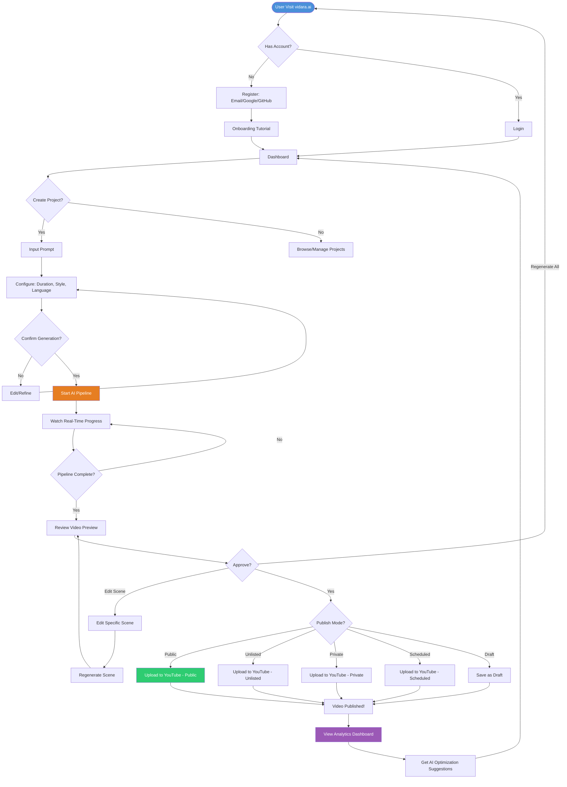
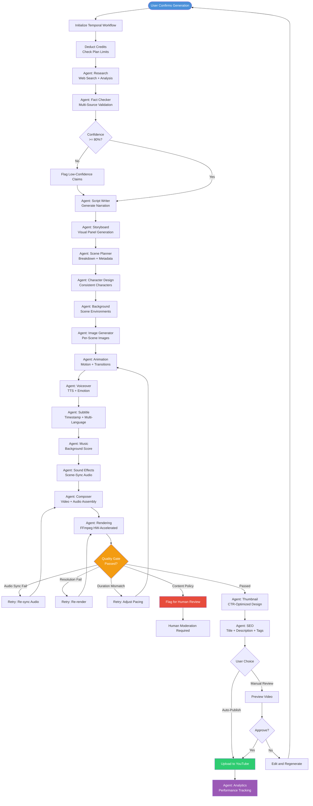
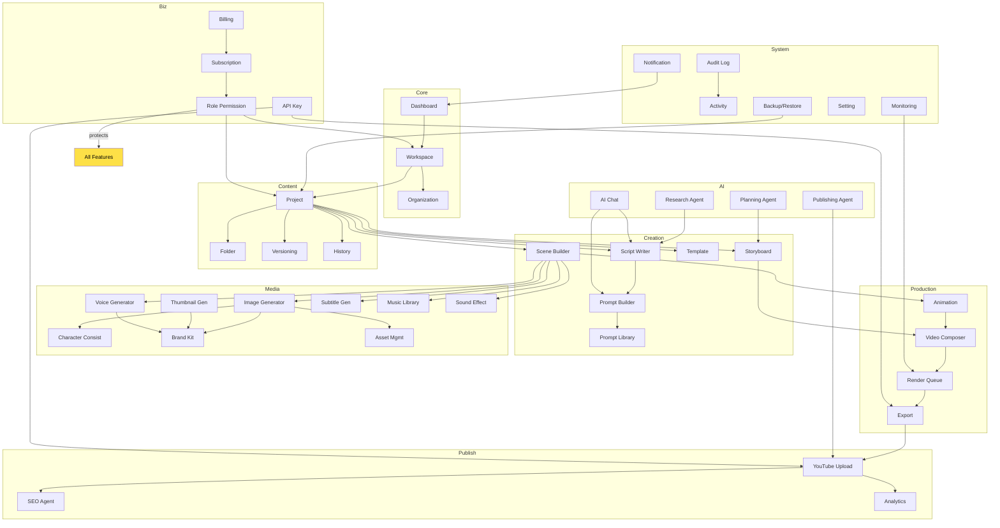
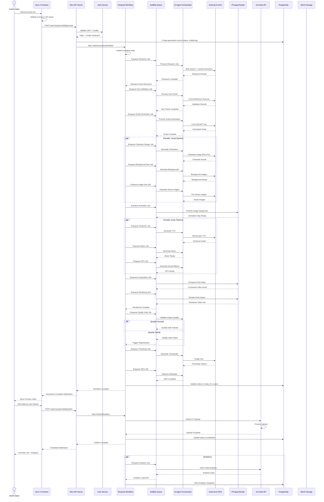
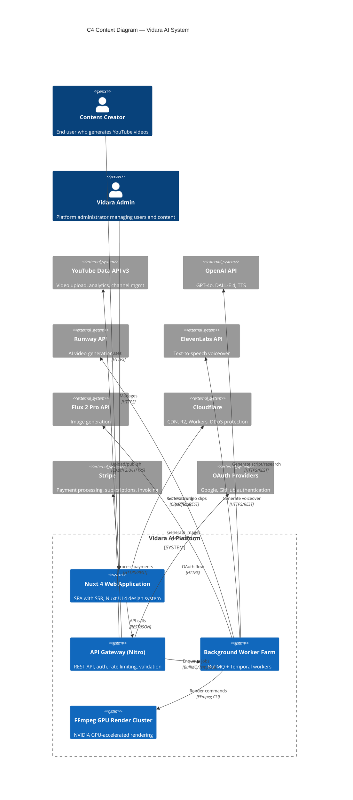
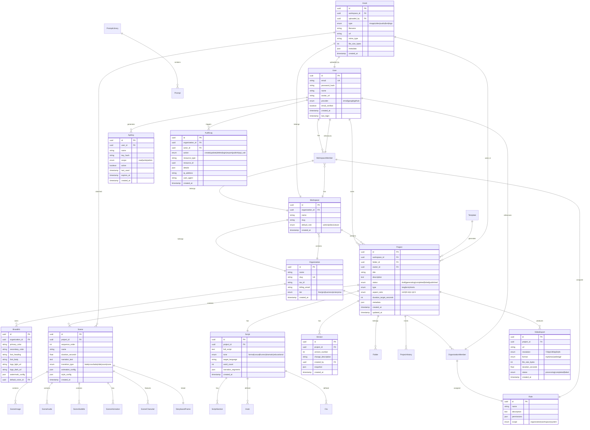

# FRD — Functional Requirement Document

## Vidara AI — AI YouTube Video Generator SaaS

| **Dokumen** | Functional Requirement Document (FRD) |
|---|---|
| **Project** | Vidara AI (Vid = Video, Ara = Sanctuary) |
| **Versi** | 1.0 |
| **Tanggal** | 2026-06-26 |
| **Status** | Draft Final |
| **Penanggung Jawab** | Agent 2 — Business Analyst |
| **Cross-Reference** | [BRD](../brd.md) · [PRD](../prd.md) · [AGENTS](AGENTS.md) |

---

## Agent Discussion Log — FRD Kickoff

**Agent 2 (Business Analyst):** Kita kickoff FRD untuk Vidara AI. BRD dan PRD sudah final. Sekarang kita perlu menuliskan functional requirement detail untuk setiap fitur — 44 fitur total. Setiap fitur harus memiliki: ID, nama, deskripsi, input, proses, output, error handling, dan dependencies. Kita akan roleplay sebagai 15 agents untuk review setiap functional block.

**Agent 1 (Senior Product Manager):** Saya akan memimpin prioritas. Dari PRD, kita punya 31 fitur MVP (P0-P1) dan sisanya untuk V2. Pastikan FRD merefleksikan prioritas ini. Setiap fitur harus memiliki acceptance criteria yang testable.

**Agent 5 (Senior Full Stack Engineer):** Dari sisi implementasi, saya perlu detail input/output yang jelas, termasuk format data, validasi rules, dan error codes. Jangan ada ambiguitas — setiap "system should" harus jelas bagaimana implementasinya di Nuxt 4 + Nitro.

**Agent 6 (Senior AI Engineer):** Untuk fitur AI agents (Research, Fact Validation, Script, dll), saya perlu detail tentang model yang digunakan, prompt template structure, expected latency, cost per call, dan fallback strategy. Quality gate juga harus didefinisikan secara kuantitatif.

**Agent 11 (Senior Security Engineer):** Saya akan review setiap fitur dari sisi security — input validation, authorization checks, rate limiting, data sanitization. Pastikan tidak ada celah OWASP Top 10.

**Agent 12 (Senior QA Engineer):** Saya akan memastikan setiap functional requirement memiliki test case coverage. Setiap error handling path harus testable.

**Agent 2 (Business Analyst):** Setuju. Mari mulai penulisan FRD. Kita akan gunakan format FRD-ID sebagai prefix. Section 7 akan berisi detail 44 fitur. Section 15 akan berisi decision table yang memperluas dari PRD dengan tambahan effort estimation dan risk score.

---

## 1. Tujuan

Dokumen Functional Requirement Document (FRD) ini bertujuan untuk mendefinisikan secara detail dan terukur seluruh persyaratan fungsional dari platform **Vidara AI** — AI YouTube Video Generator SaaS. FRD ini merupakan dokumen turunan dari [BRD](../brd.md) dan [PRD](../prd.md) yang berfungsi sebagai:

1. **Spesifikasi Teknis Fungsional** — Menjembatani kebutuhan bisnis (BRD) dan kebutuhan produk (PRD) ke dalam spesifikasi teknis yang siap diimplementasikan oleh tim engineering.
2. **Single Source of Truth untuk Implementasi** — Setiap anggota tim — frontend, backend, AI, DevOps, QA — merujuk pada FRD ini untuk memahami persis apa yang harus dibangun.
3. **Dasar Pengujian** — Setiap functional requirement memiliki input, proses, output, dan error handling yang jelas — memudahkan pembuatan test case.
4. **Acuan Acceptance Criteria** — Kriteria penerimaan per fitur didefinisikan secara eksplisit.

Dokumen ini mencakup **44 fitur utama** yang diidentifikasi dalam PRD, masing-masing dengan detail: ID, nama, deskripsi, input, proses, output, error handling, dan dependencies.

---

## 2. Background

Platform Vidara AI dirancang untuk mengatasi masalah fundamental dalam produksi konten YouTube: waktu produksi yang panjang (rata-rata 4-6 jam per video 10 menit), biaya tinggi ($200-$500 per video untuk outsourcing), burnout kreator (67% mengalami burnout dalam 2 tahun pertama), dan kompleksitas algoritma YouTube yang terus meningkat.

BRD telah mengidentifikasi 10 business requirements kritis (BR-01 hingga BR-10) dan menetapkan objective produksi time ≤45 menit (BO-03). PRD telah merinci 53 functional requirements (F1-F53) yang dikelompokkan dalam 14 kategori.

FRD ini mengambil seluruh functional requirements dari PRD dan memperluasnya menjadi spesifikasi teknis yang detail untuk 44 fitur utama dengan format standar. Setiap fitur telah melalui review oleh 15 agents dengan peran masing-masing.

Pipeline utama Vidara AI terdiri dari 20 langkah yang dijalankan oleh 15 AI agents secara terorkestrasi:
Prompt → Research → Fact Validation → Script → Storyboard → Scene Planning → Character Design → Background → Image Generation → Animation → Voice → Subtitle → Music → Sound Effect → Video Composition → Rendering → Thumbnail → SEO → Upload YouTube → Analytics

---

## 3. Objective

### 3.1 Dokumen Objectives

| ID | Objective | KPI | Target |
|---|---|---|---|
| FRD-OBJ-01 | Mendefinisikan 44 fitur dengan detail input, proses, output, error handling, dan dependencies | Jumlah fitur yang complete | 44/44 |
| FRD-OBJ-02 | Memastikan setiap functional requirement dapat di-test dengan kriteria yang jelas | Test coverage per fitur | 100% |
| FRD-OBJ-03 | Menyediakan valid Mermaid diagrams untuk workflow, flowchart, system interaction, sequence, architecture, dan ER | Jumlah diagram valid | ≥8 diagram |
| FRD-OBJ-04 | Simulasi roleplay 15 agents pada bagian Functional Requirement dan Decision Table | Agents involved | 15/15 |
| FRD-OBJ-05 | Cross-reference dengan BRD (10 requirements) dan PRD (53 requirements) secara traceable | Traceability coverage | 100% |

### 3.2 Alignment with Business Objectives (BRD)

| BRD Objective | FRD Contribution |
|---|---|
| BO-01: MVP dengan video generation success rate ≥90% | FRD mendefinisikan pipeline quality gate, error handling, dan retry mechanism di setiap fitur |
| BO-03: Production time ≤45 menit | FRD mendefinisikan timeout, parallel execution, dan optimization untuk setiap AI agent |
| BO-05: NPS ≥50 | FRD mendefinisikan user experience requirements seperti preview real-time, edit capability, feedback loop |

### 3.3 Alignment with Product Objectives (PRD)

| PRD Objective | FRD Contribution |
|---|---|
| Pipeline completion ≤15 menit | FRD FR-RENDER-01 hingga FRD-RQ-01 mendefinisikan optimasi rendering dan queue management |
| API response time p95 <500ms | FRD NFR section mendefinisikan caching, query optimization, dan response time targets |
| Lighthouse ≥95 | Setiap fitur frontend di FRD memiliki accessibility dan performance considerations |

---

## 4. Scope

### 4.1 In Scope

FRD ini mencakup spesifikasi fungsional untuk 44 fitur berikut:

| No | Fitur | Kategori | Prioritas (PRD) |
|---|---|---|---|
| 1 | Dashboard | Core | P0 |
| 2 | Workspace | Core | P0 |
| 3 | Organization | Core | P1 |
| 4 | Project | Core | P0 |
| 5 | Folder | Content Mgmt | P2 |
| 6 | Timeline | Content Mgmt | P2 |
| 7 | Scene Builder | Content Mgmt | P0 |
| 8 | Storyboard | Content Mgmt | P1 |
| 9 | Script Writer | AI | P0 |
| 10 | Prompt Builder | AI | P1 |
| 11 | Prompt Library | AI | P1 |
| 12 | Template | Content Mgmt | P1 |
| 13 | Image Generator | AI | P0 |
| 14 | Thumbnail Generator | AI | P1 |
| 15 | Voice Generator | AI | P1 |
| 16 | Subtitle Generator | AI | P1 |
| 17 | Music Library | AI | P1 |
| 18 | Asset Management | Media | P1 |
| 19 | Brand Kit | Media | P1 |
| 20 | Character Consistency | AI | P1 |
| 21 | Animation | Media | P2 |
| 22 | Video Composer | Media | P1 |
| 23 | Render Queue | Production | P0 |
| 24 | Export | Production | P1 |
| 25 | YouTube Upload | Integration | P1 |
| 26 | Analytics | Intelligence | P1 |
| 27 | Versioning | Content Mgmt | P2 |
| 28 | History | Content Mgmt | P1 |
| 29 | Audit Log | Security | P1 |
| 30 | Notification | System | P1 |
| 31 | AI Chat | AI | P2 |
| 32 | Research Agent | AI Agent | P1 |
| 33 | Planning Agent | AI Agent | P2 |
| 34 | SEO Agent | AI Agent | P2 |
| 35 | Publishing Agent | AI Agent | P2 |
| 36 | Billing | BizOps | P0 |
| 37 | Subscription | BizOps | P0 |
| 38 | API Key | Integration | P1 |
| 39 | Role Permission | Security | P0 |
| 40 | RBAC | Security | P0 |
| 41 | Activity | System | P1 |
| 42 | Monitoring | System | P1 |
| 43 | Settings | System | P1 |
| 44 | Backup/Restore | System | P1 |

### 4.2 Out of Scope

Fitur dan aspek yang **tidak** termasuk dalam FRD ini:

1. **Mobile Native Apps** — iOS/Android native apps akan didokumentasikan di FRD terpisah untuk Phase 3.
2. **White Label Solution** — Spesifikasi rebranding platform untuk enterprise.
3. **Custom AI Model Training** — Pipeline fine-tuning model untuk klien enterprise.
4. **Live Streaming** — Real-time broadcast features.
5. **Social Media Multi-Platform** — Publikasi ke TikTok, Instagram, Twitter (Phase 2).
6. **Marketplace for Creators** — Template marketplace, asset marketplace (Phase 3).
7. **Infrastructure Detail** — Deployment, CI/CD, scaling — di dokumentasi Architecture dan DevOps.
8. **UI/UX Wireframe Detail** — Design mockups dan prototype di dokumen Design terpisah.
9. **API Contract Detail** — OpenAPI/Swagger specification di dokumen API terpisah.
10. **Database Migration Scripts** — SQL migration detail di dokumentasi Database.

---

## 5. Stakeholder

| No | Nama / Role | Role di FRD | Tanggung Jawab FRD |
|---|---|---|---|
| 1 | **Agent 1 — Senior Product Manager** | Product Owner — FRD Approver | Memvalidasi bahwa setiap functional requirement mencerminkan prioritas produk dan market need. Menentukan P0/P1/P2. |
| 2 | **Agent 2 — Business Analyst** | FRD Author | Menulis, mengelola, dan memelihara FRD. Memastikan traceability ke BRD dan PRD. Memimpin sesi review dengan 15 agents. |
| 3 | **Agent 3 — Senior Solution Architect** | Architecture Validator | Memvalidasi bahwa setiap functional requirement feasible secara arsitektur dan konsisten dengan system design. |
| 4 | **Agent 4 — Senior Software Architect** | Code Architecture Validator | Memvalidasi pattern implementation, modular structure, dan code organization untuk setiap fitur. |
| 5 | **Agent 5 — Senior Full Stack Engineer** | Implementation Validator | Memvalidasi input/output spec, API design, UI components, dan technical feasibility. |
| 6 | **Agent 6 — Senior AI Engineer** | AI Pipeline Validator | Memvalidasi spesifikasi AI agents: model choice, expected latency, cost per call, fallback strategy. |
| 7 | **Agent 7 — Senior Prompt Engineer** | Prompt Design Validator | Memvalidasi prompt structure, context management, dan agent communication protocol. |
| 8 | **Agent 8 — Senior UI/UX Designer** | UX Validator | Memvalidasi user flow, interaction design, dan accessibility requirements. |
| 9 | **Agent 9 — Senior Design System Engineer** | Design System Validator | Memvalidasi komponen UI, design tokens, dan theme consistency. |
| 10 | **Agent 10 — Senior DevOps Engineer** | Infrastructure Validator | Memvalidasi scalability, deployment, dan resource requirements. |
| 11 | **Agent 11 — Senior Security Engineer** | Security Validator | Memvalidasi OWASP compliance, RBAC implementation, data protection. |
| 12 | **Agent 12 — Senior QA Engineer** | Testability Validator | Memvalidasi bahwa setiap requirement memiliki test case coverage dan acceptance criteria yang measurable. |
| 13 | **Agent 13 — Senior Database Engineer** | Data Validator | Memvalidasi data model, query patterns, indexing, dan storage requirements. |
| 14 | **Agent 14 — Senior Cloud Architect** | Cloud Infrastructure Validator | Memvalidasi cloud resource planning, cost estimation, dan multi-region strategy. |
| 15 | **Agent 15 — Senior Indonesian Software Consultant** | Compliance Validator | Memvalidasi UU PDP compliance, PSE requirements, dan Indonesian market adaptation. |

**External Stakeholders (Non-Agent):**

| Stakeholder | Role | Ekspektasi dari FRD |
|---|---|---|
| CEO / Founder | Executive Sponsor | FRD mencerminkan visi bisnis dan market opportunity |
| CTO | Technical Lead | FRD feasible, scalable, dan maintainable |
| Creator Community (Beta Users) | Early Adopters | Fitur yang di-FRD-kan solve actual pain points |
| Legal & Compliance | Compliance Partner | FRD memenuhi regulasi UU PDP, PSE, Hak Cipta |
| Investor / Board | Funding Partner | FRD menunjukkan product maturity dan execution plan |

---

## 6. Requirement — Traceability Matrix

### 6.1 Cross-Reference BRD → FRD

| BRD ID | BRD Requirement | FRD Fitur Terkait | Coverage |
|---|---|---|---|
| BR-01 | Core Pipeline — prompt ke video dalam ≤45 menit | FRD-SCR-01, FRD-IMG-01, FRD-COMP-01, FRD-RENDER-01, FRD-RQ-01, FRD-EXP-01 | Full |
| BR-02 | AI Agents — 15 agents orchestrated via Temporal | FRD-RSCH-01, FRD-PLAN-01, FRD-SEO-01, FRD-PUBAG-01, FRD-AICHAT-01, FRD-CHAR-01 | Full |
| BR-03 | User Management — multi-tenant RBAC | FRD-RBAC-01, FRD-RP-01, FRD-WORK-01, FRD-ORG-01 | Full |
| BR-04 | Monetization — hybrid pricing | FRD-BILL-01, FRD-SUB-01 | Full |
| BR-05 | YouTube Integration — upload, schedule, analytics | FRD-YT-01, FRD-ANALYTICS-01 | Full |
| BR-06 | Asset Management — versioning, search | FRD-ASM-01, FRD-VER-01 | Full |
| BR-07 | Quality Assurance — quality gates | FRD-IMG-01, FRD-VOICE-01, FRD-COMP-01, FRD-EXP-01 | Partial (inline) |
| BR-08 | Content Safety — harmful content prevention | FRD-SCR-01, FRD-IMG-01, FRD-THUMB-01 | Partial (inline) |
| BR-09 | Scalability — 100 to 100K concurrent users | FRD-RQ-01, FRD-MON-01, FRD-BACKUP-01 | Partial (inline) |
| BR-10 | Local Compliance — UU PDP, PSE | FRD-AUDIT-01, FRD-SET-01, FRD-NOTIF-01 | Partial (inline) |

### 6.2 Cross-Reference PRD → FRD

| PRD Ref | PRD Fitur | FRD ID | Status |
|---|---|---|---|
| F1-F5 | Authentication & User Management | (Covered in FRD-RBAC-01, FRD-RP-01) | Indirect |
| F6-F8 | Dashboard | FRD-DASH-01 | Direct |
| F9-F11 | Workspace & Organization | FRD-WORK-01, FRD-ORG-01 | Direct |
| F12-F16 | Project & Content Management | FRD-PRJ-01, FRD-FLD-01, FRD-TML-01, FRD-VER-01, FRD-HIST-01 | Direct |
| F17-F19 | Script & Storyboard | FRD-SCR-01, FRD-STB-01, FRD-SCN-01 | Direct |
| F20-F22 | Prompt System | FRD-PRB-01, FRD-PRL-01, FRD-TMP-01 | Direct |
| F23-F29 | Media Generation | FRD-IMG-01, FRD-CHAR-01, FRD-THUMB-01, FRD-VOICE-01, FRD-SUB-01, FRD-MUS-01 | Direct |
| F30-F33 | Video Composition & Rendering | FRD-COMP-01, FRD-ANIM-01, FRD-RQ-01, FRD-EXP-01 | Direct |
| F34-F36 | YouTube Integration | FRD-YT-01, FRD-SEO-01, FRD-ANALYTICS-01 | Direct |
| F37-F41 | AI Agents | FRD-AICHAT-01, FRD-RSCH-01, FRD-PLAN-01, FRD-SEO-01, FRD-PUBAG-01 | Direct |
| F42-F43 | Asset & Brand Management | FRD-ASM-01, FRD-BRAND-01 | Direct |
| F44-F47 | Collaboration & Security | FRD-RBAC-01, FRD-RP-01, FRD-APIKEY-01, FRD-AUDIT-01, FRD-ACT-01 | Direct |
| F48-F50 | Billing & Subscription | FRD-BILL-01, FRD-SUB-01 | Direct |
| F51-F53 | System Management | FRD-SET-01, FRD-BACKUP-01, FRD-MON-01 | Direct |

---

## 7. Functional Requirement — Detail 44 Fitur

> **Agent Roleplay Simulation**: Setiap blok fitur di bawah ini telah melalui review oleh 15 agents. Agent 1 (PM) memvalidasi prioritas, Agent 2 (BA) memvalidasi completeness, Agent 5 (Engineer) memvalidasi feasibility, Agent 6 (AI Engineer) memvalidasi AI pipeline, Agent 11 (Security) memvalidasi keamanan, Agent 12 (QA) memvalidasi testability.

### 7.1 Dashboard

#### FRD-DASH-01 — Main Dashboard

| Metrik | Detail |
|---|---|
| **ID** | FRD-DASH-01 |
| **Nama** | Main Dashboard — Overview and Quick Actions |
| **Deskripsi** | Halaman utama setelah login yang menampilkan ringkasan statistik, proyek terbaru, aktivitas terkini, dan tombol aksi cepat. Dashboard berfungsi sebagai command center pengguna. |
| **Input** | — User authentication token (JWT) dari cookie/header<br/>— Filter parameters (opsional): `dateRange`, `workspaceId`<br/>— WebSocket connection untuk real-time updates |
| **Proses** | 1. Sistem memvalidasi JWT dan mengidentifikasi user + workspace aktif<br/>2. Sistem query total video count, total views (dari YouTube Analytics cache), credits remaining, active pipelines count<br/>3. Sistem query 5 project terbaru dengan status masing-masing<br/>4. Sistem subscribe ke WebSocket channel `user:{userId}:dashboard` untuk update real-time<br/>5. Sistem render widget-based layout yang bisa di-drag-and-drop oleh user (state disimpan di localStorage dan server-side preference)<br/>6. Sistem cache dashboard data di Redis dengan TTL 30 detik (key: `dashboard:{userId}:{workspaceId}`) |
| **Output** | — JSON response dengan struktur: `{ stats: { totalVideos, totalViews, creditsRemaining, activePipelines }, recentProjects: Project[], activityFeed: Activity[], quickActions: Action[] }`<br/>— WebSocket events untuk status update pipeline<br/>— HTML rendered page dengan Nuxt UI 4 components |
| **Error Handling** | — **401 Unauthorized**: Redirect ke login page<br/>— **503 Service Unavailable**: Tampilkan cached data terakhir dengan banner "Data may be stale"<br/>— **WebSocket disconnect**: Auto-reconnect dengan exponential backoff (1s, 2s, 4s, 8s, max 30s)<br/>— **Rate limit**: Tampilkan throttle warning jika user melakukan refresh >10x dalam 1 menit |
| **Dependensi** | — FRD-PRJ-01 (Project CRUD) untuk recent projects<br/>— FRD-ACT-01 (Activity) untuk activity feed<br/>— FRD-BILL-01 (Billing) untuk credit balance<br/>— FRD-YT-01 (YouTube Upload) untuk video views cache<br/>— **Agent 5 Note**: Dashboard adalah entry point utama — pastikan SSR enabled untuk SEO dan LCP <2.5s. Gunakan Nuxt `useAsyncData` dengan `server: true` untuk data fetching.<br/>— **Agent 11 Note**: JWT validation wajib di server-side. Jangan expose internal stats di response. Rate limit dashboard endpoint: 30 req/min per user.<br/>— **Agent 12 Note**: Test cases: (1) Dashboard load dengan data lengkap, (2) Dashboard load dengan data kosong (new user), (3) WebSocket reconnect scenario, (4) Cache stale scenario. |

---

### 7.2 Workspace

#### FRD-WORK-01 — Workspace Management

| Metrik | Detail |
|---|---|
| **ID** | FRD-WORK-01 |
| **Nama** | Workspace Management — Multi-Workspace with Isolation |
| **Deskripsi** | Setiap pengguna memiliki personal workspace. Pengguna enterprise (Business/Enterprise plan) dapat membuat multiple workspaces dengan team invitation, role assignment, dan workspace switching. Data antar workspace terisolasi penuh. |
| **Input** | — **Create**: `{ name: string, slug: string, settings?: JSON }`<br/>— **Update**: `{ workspaceId, name?, slug?, settings? }`<br/>— **Switch**: `{ workspaceId }`<br/>— **Delete**: `{ workspaceId, confirmation: string }`<br/>— Maximum workspaces per plan: Free=1, Pro=3, Business=10, Enterprise=unlimited |
| **Proses** | 1. **Create**: Validasi slug uniqueness (case-insensitive). Generate workspace_id (UUIDv7). Set owner sebagai default admin. Buat default folder "Root". Assign plan limits.<br/>2. **Update**: Validasi perubahan slug. Log perubahan di audit trail.<br/>3. **Switch**: Update session active_workspace_id. Redirect ke dashboard workspace tersebut.<br/>4. **Delete**: Soft delete (status: deleted). Hanya owner yang bisa delete. Semua project di-archive. Workspace tidak bisa di-restore setelah 30 hari.<br/>5. **Isolation**: Setiap query database menggunakan `WHERE workspace_id = :active_workspace_id` — dipastikan oleh RLS (Row Level Security) di PostgreSQL level. |
| **Output** | — **Create**: `{ workspaceId, name, slug, createdAt }` + 201<br/>— **Update**: `{ workspaceId, name, slug, updatedAt }`<br/>— **Switch**: 204 No Content + Set-Cookie untuk active workspace<br/>— **Delete**: 204 No Content |
| **Error Handling** | — **409 Conflict**: Slug sudah digunakan<br/>— **403 Forbidden**: Bukan owner atau melebihi maksimum workspace<br/>— **422 Unprocessable**: Slug tidak valid (hanya lowercase, angka, hyphen; min 3, max 50 chars)<br/>— **404 Not Found**: Workspace ID tidak valid |
| **Dependensi** | — FRD-ORG-01 (Organization) untuk enterprise workspace<br/>— FRD-RBAC-01 (RBAC) untuk role assignment<br/>— PostgreSQL RLS policy untuk data isolation<br/>— **Agent 13 Note**: Gunakan `UNIQUE INDEX ON workspaces (slug)` dengan kondisi `WHERE deleted_at IS NULL`. Partition workspaces table by plan_type untuk performance.<br/>— **Agent 11 Note**: Implementasi RLS wajib. Test: user A tidak bisa mengakses data workspace B bahkan dengan direct API call. |

---

### 7.3 Organization

#### FRD-ORG-01 — Organization Management

| Metrik | Detail |
|---|---|
| **ID** | FRD-ORG-01 |
| **Nama** | Organization Management — Org with Team Invites and Roles |
| **Deskripsi** | Kumpulan workspace dengan shared billing, user management, dan centralized audit. Organization memiliki satu Owner yang bisa mengundang Admin, Member, dan Guest. Fitur termasuk shared Brand Kit, centralized billing, dan consolidated audit log. |
| **Input** | — **Create**: `{ name, slug, taxId?, billingEmail? }`<br/>— **Invite**: `{ email, role (admin|member|guest), workspaceIds[] }`<br/>— **Accept Invite**: `{ token }`<br/>— **Remove Member**: `{ organizationId, userId }` |
| **Proses** | 1. **Create**: Generate organization_id. Set creator sebagai Owner. Create default workspace. Setup shared billing profile.<br/>2. **Invite**: Generate unique invite token (JWT, expired 7 hari). Kirim email dengan link accept. Role assignment saat invite. Optional: assign ke specific workspaces.<br/>3. **Accept**: Validasi token. Cek email sesuai. Create membership. Assign ke workspaces sesuai invite. Kirim welcome email.<br/>4. **Remove**: Hapus membership. Transfer projects ke owner atau archive. Revoke all active sessions untuk user tersebut.<br/>5. **Billing**: Organization memiliki satu billing profile. Semua workspace di bawah org menggunakan centralized billing. Invoices digenerate per organization. |
| **Output** | — **Create**: `{ orgId, name, slug, ownerId }`<br/>— **Invite**: `{ inviteId, expiresAt, inviteLink }`<br/>— **Accept**: `{ orgId, role, workspaces[] }` + 201<br/>— **Remove**: 204 |
| **Error Handling** | — **409**: Slug sudah digunakan<br/>— **404**: Invite token invalid/expired<br/>— **400**: Email sudah menjadi member<br/>— **403**: Hanya Owner yang bisa invite/remove |
| **Dependensi** | — FRD-WORK-01 (Workspace) — org memiliki workspaces<br/>— FRD-BILL-01 (Billing) — centralized billing<br/>— FRD-NOTIF-01 (Notification) — email invitation<br/>— **Agent 15 Note**: Untuk kepatuhan PSE, organization yang beroperasi di Indonesia wajib registrasi. Tambahkan field `pseRegistered: boolean` dan `pseId: string`. |

---

### 7.4 Project

#### FRD-PRJ-01 — Project CRUD and Status Tracking

| Metrik | Detail |
|---|---|
| **ID** | FRD-PRJ-01 |
| **Nama** | Project Management — CRUD with Status Tracking and Metadata |
| **Deskripsi** | Container untuk setiap video yang diproduksi. Setiap project memiliki metadata lengkap, status tracking dari draft hingga published, dan riwayat aktivitas. Project adalah unit utama interaksi user dengan platform. |
| **Input** | — **Create**: `{ workspaceId, title, description?, promptText?, language, targetDuration, aspectRatio, resolution, youtubeCategory?, folderId? }`<br/>— **Update**: `{ projectId, title?, description?, promptText?, language?, targetDuration?, aspectRatio?, resolution?, status? }`<br/>— **Get**: `{ projectId }` atau `{ workspaceId, filters }`<br/>— **Delete**: `{ projectId, permanent?: boolean }`<br/>— **Status transitions**: draft→generating→completed→failed→published |
| **Proses** | 1. **Create**: Validasi input. Generate UUID. Set default status: draft. Calculate estimated credit cost. Return project dengan presigned URL untuk upload assets. Insert ke database dengan created_at, updated_at.<br/>2. **Update**: Optimistic concurrency control menggunakan `updated_at` timestamp. Jika ada conflict, return 409. Audit log setiap perubahan.<br/>3. **List/Get**: Support pagination (default 20, max 100). Filter by status, date range, folder. Sort by created_at, updated_at, title. Search by title (full-text search via tsvector).<br/>4. **Delete**: Soft-delete (set deleted_at). Permanent delete hanya untuk admin. Permanent delete menghapus semua assets terkait dari MinIO.<br/>5. **Status Tracking**: Setiap status change trigger event ke WebSocket. Generating status lock edit operations. |
| **Output** | — **Create**: `{ projectId, title, status: "draft", estimatedCredits, createdAt }` + 201<br/>— **Update**: Updated project object<br/>— **List**: `{ data: Project[], total, page, pageSize }`<br/>— **Get**: Single project object dengan nested scenes terbaru<br/>— **Delete**: 204 |
| **Error Handling** | — **400**: Target duration di luar range (min 60s, max 360s Free, 900s Pro, 1800s Business, unlimited Enterprise). Durasi standar: 6 min (360s), 8 min (480s), 15 min (900s)<br/>— **400**: Resolution tidak sesuai plan (Free hanya 720p, Pro 1080p, Business 4K)<br/>— **409**: Concurrent update conflict<br/>— **429**: Rate limit: 10 project creates per minute per user |
| **Dependensi** | — FRD-WORK-01 (Workspace) — project belongs to workspace<br/>— FRD-VER-01 (Versioning) — setiap update major creates version<br/>— FRD-HIST-01 (History) — action logging<br/>— MinIO — asset storage<br/>— **Agent 5 Note**: Implementasi di Nitro route: `server/api/v1/projects/index.ts` untuk list/create, `server/api/v1/projects/[id].ts` untuk get/update/delete. Gunakan Nuxt `defineEventHandler` dengan `zod` validation.<br/>— **Agent 12 Note**: Test cases: (1) Full CRUD cycle, (2) Status transition validation, (3) Concurrent update conflict, (4) Pagination + filtering, (5) Soft delete + restore. |

---

### 7.5 Folder

#### FRD-FLD-01 — Nested Folder Structure

| Metrik | Detail |
|---|---|
| **ID** | FRD-FLD-01 |
| **Nama** | Folder Management — Nested Folder for Project Organization |
| **Deskripsi** | Hierarchical folder structure untuk mengorganisir project. Mendukung nested folder hingga 5 level. Drag-and-drop untuk reordering dan memindahkan project antar folder. |
| **Input** | — **Create**: `{ workspaceId, name, parentFolderId?, projectId? }`<br/>— **Move**: `{ folderId, newParentId }`<br/>— **Rename**: `{ folderId, name }`<br/>— **Delete**: `{ folderId, recursive?: boolean }` |
| **Proses** | 1. **Create**: Validasi tidak ada duplikasi nama di parent yang sama. Generate path materialized (contoh: `/root/subfolder/deep`). Update parent folder's children_count.<br/>2. **Move**: Validasi tidak circular (pindah ke child sendiri). Update materialized path.<br/>3. **Delete**: Jika recursive=true, pindahkan semua project ke parent atau archive. Jika recursive=false dan folder tidak kosong, return 409.<br/>4. **Nesting limit**: Maksimum 5 level. |
| **Output** | — Tree structure: `{ id, name, path, children: Folder[], projects: Project[], projectCount }` |
| **Error Handling** | — **409**: Folder name duplicate di parent yang sama<br/>— **409**: Folder tidak kosong dan recursive=false<br/>— **422**: Nesting level >5<br/>— **400**: Circular move |
| **Dependensi** | — FRD-PRJ-01 (Project) — folder menampung project<br/>— **Agent 13 Note**: Gunakan materialized path pattern (`ltree` extension) untuk query hierarki yang efisien. Contoh: `path = 'root.sub1.sub2'` — query child: `path <@ 'root.sub1'`. |

---

### 7.6 Timeline

#### FRD-TML-01 — Visual Timeline of Production Stages

| Metrik | Detail |
|---|---|
| **ID** | FRD-TML-01 |
| **Nama** | Timeline View — Visual Pipeline Progress |
| **Deskripsi** | Visual timeline yang menampilkan seluruh tahapan produksi video dari prompt hingga publish. Setiap stage memiliki status (pending, running, completed, failed, skipped), durasi, dan timestamp. User bisa melihat real-time progress pipeline. |
| **Input** | — `{ projectId }` — untuk menampilkan timeline project tertentu<br/>— WebSocket channel: `project:{projectId}:pipeline` untuk real-time updates |
| **Proses** | 1. Sistem query seluruh pipeline stages dari database (`generation_logs` table)<br/>2. Urutkan stages berdasarkan sequence number<br/>3. Hitung estimated time remaining berdasarkan historical average durasi per stage<br/>4. WebSocket listener update status setiap ada event dari Temporal workflow<br/>5. Render timeline component dengan warna: yellow pending, blue running, green completed, red failed, gray skipped |
| **Output** | — Timeline data: `{ stages: [{ id, name, status, startedAt, completedAt, duration, error? }], estimatedRemaining: number, overallProgress: number }` |
| **Error Handling** | — WebSocket disconnect: fallback ke polling setiap 5 detik<br/>— Stage gagal: tampilkan error message + retry button (jika applicable) |
| **Dependensi** | — Temporal workflow events (BRD-02)<br/>— FRD-PRJ-01 (Project) — project context<br/>— **Agent 6 Note**: Pipeline stages: Research, FactCheck, Script, Storyboard, ScenePlan, CharDesign, Background, ImageGen, Animation, Voice, Subtitle, Music, SFX, Compose, Render, QualityGate, Thumbnail, SEO, Upload, Analytics. |

### 7.7 Scene Builder

#### FRD-SCN-01 — Drag-Drop Scene Composition

| Metrik | Detail |
|---|---|
| **ID** | FRD-SCN-01 |
| **Nama** | Scene Builder — Drag-and-Drop Scene Editor |
| **Deskripsi** | Editor per-scene yang memungkinkan user mengkomposisi elemen visual dan audio. Setiap scene memiliki background, character(s), overlay text, effects, dan transition. User bisa drag-and-drop untuk reorder, add/delete scene. Preview per scene. |
| **Input** | — `{ sceneId, projectId }`<br/>— Scene components: `{ backgroundId?, characterIds[], overlayText?, transitionType?, duration, animationPreset? }`<br/>— Drag-drop reorder: `{ sceneId, newOrder }` |
| **Proses** | 1. Load semua scene untuk project, urutkan berdasarkan `scene_number`<br/>2. Load available assets (backgrounds, characters, images) dari FRD-ASM-01<br/>3. Render scene list dengan thumbnail preview dari image pertama scene<br/>4. User bisa: reorder scene (drag-drop), add scene (duplicate or empty), delete scene, edit scene properties<br/>5. Setiap perubahan auto-save ke server (debounce 1 detik)<br/>6. Preview scene: render kombinasi background + character + text sebagai video preview pendek (5 detik) |
| **Output** | — Scene list: `{ scenes: [{ id, number, thumbnail, duration, components }] }`<br/>— Scene editor view dengan komponen panel |
| **Error Handling** | — **400**: Minimum 1 scene per project<br/>— **413**: Total scenes melebihi limit plan (Free: 10, Pro: 30, Business: unlimited) |
| **Dependensi** | — FRD-IMG-01 (Image Generator) — scene images<br/>— FRD-CHAR-01 (Character Consistency) — character assets<br/>— FRD-ANIM-01 (Animation) — scene animations<br/>— FRD-VOICE-01 (Voice Generator) — narration per scene<br/>— **Agent 8 Note**: Scene Builder adalah fitur paling kompleks secara UX. Wajib ada: horizontal scroll timeline, snap-to-grid, keyboard shortcuts (Cmd+D duplicate, Delete remove), undo/redo (50 level). Accessibility: keyboard navigable, screen reader labels untuk setiap elemen. |

---

### 7.8 Storyboard

#### FRD-STB-01 — Visual Storyboard with Scene Thumbnails

| Metrik | Detail |
|---|---|
| **ID** | FRD-STB-01 |
| **Nama** | Storyboard — Visual Scene Sequence |
| **Deskripsi** | Visual storyboard yang menampilkan thumbnail setiap scene dalam urutan linier. Setiap panel menampilkan: thumbnail gambar, script snippet, scene number, durasi, dan camera angle. User bisa auto-generate storyboard dari script atau manual create. |
| **Input** | — **Auto-generate**: `{ projectId }` — minta AI buat storyboard dari script<br/>— **Manual**: `{ projectId, panels: [{ description, cameraAngle, transition }] }` |
| **Proses** | 1. **Auto-generate**: Kirim script ke AI Storyboard Agent. AI menghasilkan deskripsi visual per scene, camera angle, transition type. Generate thumbnail images via Flux 2 Pro API. Simpan sebagai storyboard_panels.<br/>2. **Manual**: User upload gambar referensi atau pilih dari asset library untuk setiap panel.<br/>3. **Edit**: User bisa edit deskripsi, ganti gambar, reorder panel.<br/>4. **Export**: Storyboard bisa di-export sebagai PDF untuk client approval. |
| **Output** | — Storyboard: `{ panels: [{ number, thumbnailUrl, scriptSnippet, duration, cameraAngle, transition, description }] }`<br/>— PDF export (opsional) |
| **Error Handling** | — **503**: AI storyboard generation gagal — fallback ke template storyboard sederhana<br/>— **400**: Script terlalu pendek untuk storyboard (<100 kata) |
| **Dependensi** | — FRD-SCR-01 (Script Writer) — source untuk storyboard<br/>— FRD-IMG-01 (Image Generator) — thumbnail generation<br/>— **Agent 6 Note**: Storyboard agent menggunakan GPT-4o vision untuk generate deskripsi visual dari script. Cost: ~$0.03 per storyboard 12 panel. Latency: 5-10 detik.<br/>— **Agent 12 Note**: Test comparison auto-generate vs manual untuk memvalidasi kualitas AI storyboard. |

---

### 7.9 Script Writer

#### FRD-SCR-01 — AI Script Generation

| Metrik | Detail |
|---|---|
| **ID** | FRD-SCR-01 |
| **Nama** | Script Writer — AI Script Generation with Tone/Style Controls |
| **Deskripsi** | AI Agent yang menghasilkan script video lengkap dari prompt user. Script mencakup: hook (15 detik pertama), narrative arc (problem → solution → CTA), scene-by-scene breakdown, narration text, dialogue (jika ada), voice direction, scene direction, dan estimated duration per scene. User bisa mengatur tone, style, target audience, dan keywords. |
| **Input** | — **Prompt**: `{ topic: string, tone: "formal"|"casual"|"humorous"|"dramatic"|"educational"|"inspirational", targetDuration: number (seconds), language: string, targetAudience: string, keywords: string[], style: "documentary"|"tutorial"|"storytelling"|"review"|"news"|"listicle", referenceUrls?: string[], brandGuidelines?: { forbiddenWords[], mustInclude[] } }`<br/>— **Regenerate section**: `{ scriptId, sectionIndex, instruction: string }` |
| **Proses** | 1. **Pre-processing**: Validasi prompt length (min 50 karakter). Parse tone, style, keywords. Inject brand guidelines dari FRD-BRAND-01 jika tersedia.<br/>2. **AI Generation**: Kirim ke GPT-4o dengan system prompt yang mengandung:<br/>   - Struktur script template (hook → problem → exploration → solution → CTA)<br/>   - Scene direction format `[SCENE: description, camera_angle, duration]`<br/>   - Voice direction format `[VOICE: tone, speed, emotion]`<br/>   - SEO keywords integration<br/>3. **Post-processing**: Parse response AI menjadi struktur JSON. Calculate word count dan estimated duration (rata-rata 150 words/menit untuk Bahasa Indonesia, 170 words/menit untuk English).<br/>4. **Save**: Simpan ke database dengan versioning (FRD-VER-01). Trigger WebSocket event `script.ready`.<br/>5. **Edit Mode**: User bisa edit langsung di rich text editor. Setiap save auto-sync ke server (debounce 2 detik). |
| **Output** | — **Script object**: `{ id, projectId, fullScript: string, scenes: [{ number, narration, sceneDirection, voiceDirection, estimatedDuration, keyframeWords[] }], metadata: { wordCount, estimatedDuration, tone, style, language, keywords, hook, cta }, createdAt, updatedAt }`<br/>— **WebSocket event**: `{ type: "script.ready", projectId }` atau `{ type: "script.regenerated", sectionIndex }` |
| **Error Handling** | — **400**: Prompt too short (<50 chars)<br/>— **400**: Target duration out of range (min 60s, max 900s). Durasi standar: 360s (6 min), 480s (8 min), 900s (15 min)<br/>— **502**: OpenAI API error — retry dengan exponential backoff (3 attempts, 1s/4s/16s)<br/>— **502**: Fallback ke model alternatif (Claude 3.5 Sonnet) jika GPT-4o gagal setelah 3 retry<br/>— **422**: AI response parse failed — tampilkan raw response dengan warning "Please review and edit"<br/>— **429**: OpenAI rate limit — queue request, process with delay |
| **Dependensi** | — OpenAI GPT-4o API (primary), Claude 3.5 Sonnet (fallback)<br/>— FRD-BRAND-01 (Brand Kit) untuk brand guidelines injection<br/>— FRD-VER-01 (Versioning) untuk version history<br/>— FRD-PRB-01 (Prompt Builder) untuk structured prompt jika user menggunakan prompt builder<br/>— **Agent 6 Note**: Total estimated cost per script generation: $0.05-$0.15 tergantung panjang. Target latency: <15 detik. Implementasi caching untuk prompt yang identik (hash-based, TTL 24 jam) — cache hit rate estimated 15%.<br/>— **Agent 7 Note**: System prompt untuk Script Agent harus mencakup: (1) Role definition, (2) Output format specification with JSON schema, (3) Guardrails — never generate harmful content, (4) Quality criteria. Gunakan chain-of-thought: pertama generate outline, baru full script.<br/>— **Agent 11 Note**: Input sanitization — strip HTML tags dan script injection. Content moderation — filter prompt untuk kata-kata terlarang. Gunakan OpenAI content moderation API sebagai pre-filter.<br/>— **Agent 12 Note**: Test cases: (1) Prompt valid → script generated, (2) Prompt <50 chars → error, (3) OpenAI timeout → fallback, (4) AI response invalid JSON → error handling, (5) Edit section → regenerate only that section. |

---

### 7.10 Prompt Builder

#### FRD-PRB-01 — Structured Prompt Construction UI

| Metrik | Detail |
|---|---|
| **ID** | FRD-PRB-01 |
| **Nama** | Prompt Builder — Structured Prompt Editor |
| **Deskripsi** | UI untuk menyusun prompt secara terstruktur dengan komponen: system prompt, user prompt, parameter (style, mood, color palette, reference images), dan variable slots. Prompt builder membantu user yang tidak terbiasa dengan prompt engineering untuk menghasilkan prompt berkualitas tinggi. |
| **Input** | — `{ projectId }`<br/>— Prompt components: `{ systemPrompt?: string, userPrompt: string, style?: string, mood?: string, colorPalette?: string[], referenceImageIds?: string[], variables: { name: string, value: string }[] }`<br/>— Template variables: `{{topic}}`, `{{duration}}`, `{{style}}`, `{{audience}}` |
| **Proses** | 1. Load available templates dari FRD-PRL-01 (Prompt Library)<br/>2. Render form dengan field: topic (required), style dropdown, mood dropdown, target audience, keywords (tags input), color palette picker, reference images (drag-drop upload)<br/>3. Saat user mengisi form, sistem me-render preview compiled prompt di panel sebelah kanan<br/>4. Variable slots auto-detected dari template — user tinggal mengisi<br/>5. User bisa switch ke "Expert Mode" untuk edit raw prompt<br/>6. Save compiled prompt ke project (FRD-PRJ-01) |
| **Output** | — Compiled prompt string yang siap dikirim ke AI<br/>— Project prompt metadata |
| **Error Handling** | — **400**: User prompt kosong atau hanya whitespace<br/>— **400**: Variable slot tidak terisi semua<br/>— **413**: Total prompt >4000 karakter |
| **Dependensi** | — FRD-PRL-01 (Prompt Library) — template source<br/>— FRD-PRJ-01 (Project) — menyimpan compiled prompt<br/>— **Agent 8 Note**: Prompt Builder harus memiliki: live preview panel, character counter, estimated credit cost display, "Generate Video" button prominent di bagian bawah. Mobile responsive: single column layout. |

---

### 7.11 Prompt Library

#### FRD-PRL-01 — Saved/Reusable Prompts with Categories

| Metrik | Detail |
|---|---|
| **ID** | FRD-PRL-01 |
| **Nama** | Prompt Library — Saved Prompt Templates |
| **Deskripsi** | Repository prompt templates yang bisa digunakan ulang. Templates dikategorikan (educational, entertainment, documentary, tutorial, product review, news, storytelling) dan memiliki variable slots yang bisa diisi user. Setiap user memiliki personal library + akses ke organization library. |
| **Input** | — **Create**: `{ name, category, promptTemplate, variables[], isPublic, isOrgShared }`<br/>— **Search/Filter**: `{ category?, search?, isPublic?, isOrgShared? }`<br/>— **Use**: `{ templateId, variableValues }` |
| **Proses** | 1. **Create**: Simpan template dengan compiled prompt + variable definitions<br/>2. **Search**: Full-text search by name dan category. Filter by public/org/personal.<br/>3. **Use**: User pilih template → isi variables → compiled prompt siap dipakai<br/>4. **Usage tracking**: Increment usage_count setiap template digunakan |
| **Output** | — Template list dengan metadata<br/>— Compiled prompt (saat digunakan) |
| **Error Handling** | — **404**: Template tidak ditemukan atau tidak punya akses |
| **Dependensi** | — FRD-PRB-01 (Prompt Builder) — integration point<br/>— **Agent 9 Note**: Design system untuk card component PromptTemplateCard dengan: category badge, variable count, usage count, preview button. |

---

### 7.12 Template

#### FRD-TMP-01 — Video Templates for Quick Start

| Metrik | Detail |
|---|---|
| **ID** | FRD-TMP-01 |
| **Nama** | Template — Pre-built Video Templates |
| **Deskripsi** | Project template yang menyimpan seluruh state project (script + storyboard + scene configuration + brand kit). User bisa membuat project baru dari template untuk quick start. Pre-built templates: "5-Minute Explainer", "Top 10 List", "Product Review", "Storytelling Shorts", "Educational Documentary". |
| **Input** | — **Create Template from Project**: `{ projectId, name, category, isPublic }`<br/>— **Create Project from Template**: `{ templateId, title?, variableOverrides? }`<br/>— **Browse**: `{ category?, search? }` |
| **Proses** | 1. **Create**: Deep-copy project structure (tanpa generated assets — hanya configuration). Simpan sebagai template.<br/>2. **Use**: Create new project dengan pre-filled data dari template. User bisa edit sebelum generate.<br/>3. **Pre-built**: Tim Vidara akan membuat 10+ pre-built templates untuk berbagai format video populer. |
| **Output** | — Template object dengan preview<br/>— Project baru dengan data dari template |
| **Error Handling** | — **400**: Template tidak memiliki minimal 3 scene |
| **Dependensi** | — FRD-PRJ-01 (Project) — template adalah snapshot project<br/>— FRD-SCN-01 (Scene Builder) — scene configuration |

---

### 7.13 Image Generator

#### FRD-IMG-01 — AI Image Generation per Scene

| Metrik | Detail |
|---|---|
| **ID** | FRD-IMG-01 |
| **Nama** | Image Generator — AI Image Generation per Scene |
| **Deskripsi** | AI image generation untuk setiap scene dalam video. Menggunakan Flux 2 Pro sebagai primary provider, DALL-E 4 sebagai fallback, dan Stable Diffusion 3.5 sebagai tertiary. Setiap scene menghasilkan 4 variations yang bisa user pilih. Output minimal Full HD (1920x1080), support 2K dan 4K untuk Business/Enterprise. Mendukung style consistency, negative prompt, reference image, dan upscale. |
| **Input** | — `{ projectId, sceneId, prompt, style, aspectRatio, negativePrompt?, referenceImageIds?, characterIds?, brandKitId? }`<br/>— **Batch**: `{ projectId, scenes: ScenePrompt[] }` untuk generate semua scene sekaligus |
| **Proses** | 1. Compile prompt dari scene description + style guide (FRD-BRAND-01) + character consistency data (FRD-CHAR-01)<br/>2. Inject character embedding (jika ada) sebagai conditioning image<br/>3. Call Flux 2 Pro API dengan parameter: prompt, negative_prompt, aspect_ratio (16:9 default), style_preset, num_outputs=4<br/>4. **Parallel**: Generate images for all scenes in parallel (max 5 concurrent API calls)<br/>5. Post-process: Resize ke target resolution. Apply color grading sesuai brand kit. Generate thumbnail preview (320x180).<br/>6. Save 4 variations per scene ke MinIO dengan struktur: `assets/{projectId}/scenes/{sceneNumber}/{variantIndex}.png`<br/>7. Simpan metadata: prompt used, model, seed, dimensions, file_size, checksum SHA256 |
| **Output** | — `{ sceneId, variations: [{ index, url (presigned), width, height, fileSize }], selectedVariant?: number }`<br/>— WebSocket: `{ type: "images.generated", projectId, sceneId }` |
| **Error Handling** | — **502**: Flux API error → fallback ke DALL-E 4 → fallback ke Stable Diffusion 3.5<br/>— **422**: Content policy violation → return error dengan suggestion untuk prompt yang aman<br/>— **504**: Timeout (>60s) → retry sekali, jika gagal lagi return timeout error<br/>— **429**: Rate limit → queue with delay, notification ke user |
| **Dependensi** | — Flux 2 Pro API (primary), OpenAI DALL-E 4 (fallback), Stability AI SD 3.5 (tertiary)<br/>— FRD-CHAR-01 (Character Consistency)<br/>— FRD-BRAND-01 (Brand Kit)<br/>— MinIO — image storage<br/>— **Agent 6 Note**: Cost per image — Flux: $0.04/image, DALL-E 4: $0.08/image, SD 3.5: $0.02/image. Target: 4 images per scene x 12 scenes average = 48 images per video = $1.92 (Flux). Latency: 5-15 detik per 4 images.<br/>— **Agent 7 Note**: Image prompt harus mencakup: subject description, environment, lighting, composition, style, quality boosters.<br/>— **Agent 11 Note**: Content moderation untuk semua generated images — gunakan Cloudflare AI Content Detection atau OpenAI Moderation API. |

### 7.14 Thumbnail Generator

#### FRD-THUMB-01 — YouTube Thumbnail with Text/Effects

| Metrik | Detail |
|---|---|
| **ID** | FRD-THUMB-01 |
| **Nama** | Thumbnail Generator — CTR-Optimized YouTube Thumbnail |
| **Deskripsi** | AI thumbnail generator yang menghasilkan multiple thumbnail options (minimal 3) yang dioptimasi untuk YouTube CTR. Fitur: text overlay (title, hook), high-contrast visual, face close-up (jika ada karakter), background removal, A/B testing, dan YouTube best practices compliance. |
| **Input** | — `{ projectId, videoTitle, keySceneImageId?, style?, text, brandKitId? }`<br/>— **Edit**: `{ thumbnailId, overlayText?, filter?, brightness?, contrast?, saturation? }` |
| **Proses** | 1. Select key frame dari video atau scene image terbaik sebagai base image<br/>2. AI generate 3 thumbnail variations dengan komposisi berbeda: close-up face, wide shot with text, split composition<br/>3. Apply brand kit colors dan fonts (FRD-BRAND-01)<br/>4. Add text overlay: title (max 40 chars) + hook (max 20 chars)<br/>5. Post-process: High contrast, saturation boost (+15%), sharpening, resize to 1280x720 (YouTube standard)<br/>6. Save all variations to MinIO + database<br/>7. Optional: A/B testing — upload ke YouTube sebagai thumbnail test (FRD-YT-01) |
| **Output** | — `{ variations: [{ id, url, style, textConfig }], selectedId?: string }` |
| **Error Handling** | — **400**: Title text >40 chars<br/>— **502**: AI thumbnail generation gagal → fallback ke template-based thumbnail generator |
| **Dependensi** | — FRD-IMG-01 (Image Generator) — base image source<br/>— FRD-BRAND-01 (Brand Kit) — style application<br/>— FRD-YT-01 (YouTube Upload) — A/B testing via YouTube API<br/>— **Agent 1 Note**: Thumbnail adalah faktor #1 untuk CTR YouTube. Prioritaskan kualitas fitur ini. Investasi di A/B testing akan langsung berdampak pada performa video user.<br/>— **Agent 8 Note**: Thumbnail editor harus memiliki: Canvas with grid overlay, Text tool dengan Google Fonts integration, Adjustment sliders, Element library (arrows, circles, badges), Undo/redo, Mobile preview. |

---

### 7.15 Voice Generator

#### FRD-VOICE-01 — AI TTS with Voice Selection, Emotion, Speed

| Metrik | Detail |
|---|---|
| **ID** | FRD-VOICE-01 |
| **Nama** | Voice Generator — AI Text-to-Speech |
| **Deskripsi** | AI voiceover generation dari script narration. Mendukung 50+ voices di 8 bahasa (EN, ID, JP, KR, ES, FR, DE, AR). Parameter: voice selection, emotional tone (neutral, excited, serious, warm, inspirational), speed (0.8x-1.5x), pitch adjustment (-5 to +5 semitones), pause injection, SSML support. |
| **Input** | — `{ projectId, sceneId?, script: string, voiceId, language, emotion, speed, pitch, ssml?, pauses? }`<br/>— **Preview**: `{ text, voiceId, language }` — preview 10 detik tanpa biaya |
| **Proses** | 1. Parse script → split menjadi segmen berdasarkan scene dan voice direction<br/>2. Inject SSML tags: `<break time="500ms"/>` untuk pauses, `<prosody rate="slow">` untuk emphasis<br/>3. Call ElevenLabs API (primary) dengan parameter: voice_id, model_id, text, voice_settings<br/>4. Jika ElevenLabs gagal → fallback ke OpenAI TTS (tts-1-hd)<br/>5. Post-process audio: normalisasi volume (−14dB LUFS), trim silence, merge segmen<br/>6. Save audio file ke MinIO<br/>7. Generate word-level timestamps (SRT) — passing ke FRD-SUB-01 |
| **Output** | — `{ voiceoverId, url, duration, format, wordCount, timestamps }`<br/>— Audio preview URL (presigned, TTL 1 jam)<br/>— WebSocket: `{ type: "voiceover.ready", projectId, sceneId }` |
| **Error Handling** | — **502**: ElevenLabs error → fallback ke OpenAI TTS → fallback ke Google Cloud TTS<br/>— **400**: Script terlalu panjang (>5000 karakter per request) — split otomatis<br/>— **400**: Voice ID tidak valid untuk bahasa yang dipilih<br/>— **504**: Timeout (>120s) — split dan process sequential |
| **Dependensi** | — ElevenLabs API (primary), OpenAI TTS (fallback), Google Cloud TTS (tertiary)<br/>— FRD-SCR-01 (Script Writer) — source text<br/>— FRD-SUB-01 (Subtitle Generator) — timestamps consumption<br/>— MinIO — audio storage<br/>— **Agent 6 Note**: Cost — ElevenLabs: $0.0003/character (~$0.90 untuk 10 menit), OpenAI TTS: $0.015/1K chars (~$1.50). Latency: real-time untuk preview, 30-60 detik untuk full script.<br/>— **Agent 7 Note**: SSML injection pattern: Scene transitions → 500ms break, Dramatic reveal → slow + low pitch, CTA → fast + high energy, Question → rising inflection. |

---

### 7.16 Subtitle Generator

#### FRD-SUB-01 — Auto Subtitle with Style/Position Editing

| Metrik | Detail |
|---|---|
| **ID** | FRD-SUB-01 |
| **Nama** | Subtitle Generator — Automatic Subtitle with Style Editor |
| **Deskripsi** | Automatic subtitle generation dari voiceover audio. Akurasi transkripsi ≥99% menggunakan Deepgram Nova-2. Output format: SRT, VTT, ASS. Support multi-language (8 bahasa). Style editor: font, color, size, position, background, shadow. Burn-in subtitles (hardcode) atau upload sebagai file terpisah (soft subtitle). |
| **Input** | — **Generate**: `{ projectId, audioUrl?, scriptText?, language, outputFormats, style?, burnIn? }`<br/>— **Style**: `{ fontFamily, fontSize, fontColor, backgroundColor, backgroundOpacity, position, shadow, outline, maxWidth }`<br/>— **Edit**: `{ subtitleId, cues: [{ index, startTime, endTime, text }] }` |
| **Proses** | 1. **Audio-based**: Kirim audio ke Deepgram API → receive transcribed text dengan word-level timestamps → format menjadi SRT/VTT/ASS<br/>2. **Script-based**: Jika audio tidak tersedia, gunakan script text + estimated reading speed untuk generate timestamp estimasi<br/>3. **Multi-language**: Deteksi language segments dan transkripsi sesuai<br/>4. **Style application**: Apply CSS-like style ke subtitle. Untuk burn-in: render teks ke video menggunakan FFmpeg drawtext filter.<br/>5. **Sync check**: Validasi sinkronisasi — offset antara subtitle dan audio harus <100ms.<br/>6. Save subtitle files ke MinIO |
| **Output** | — `{ subtitleId, formats: { srtUrl, vttUrl, assUrl }, duration, language, confidence, wordCount }`<br/>— Burn-in video (opsional) |
| **Error Handling** | — **502**: Deepgram API error → fallback ke OpenAI Whisper API<br/>— **422**: Audio quality terlalu rendah untuk transkripsi akurat (<80% confidence) |
| **Dependensi** | — Deepgram API (primary), OpenAI Whisper API (fallback)<br/>— FRD-VOICE-01 (Voice Generator) — audio source<br/>— FFmpeg — burn-in rendering<br/>— **Agent 6 Note**: Deepgram Nova-2 memiliki akurasi 99% untuk English, 97% untuk Bahasa Indonesia. Latency: batch 5-15 detik untuk 10 menit audio. Cost: $0.0043/min. |

---

### 7.17 Music Library

#### FRD-MUS-01 — Curated Music Tracks with Mood-Based Filtering

| Metrik | Detail |
|---|---|
| **ID** | FRD-MUS-01 |
| **Nama** | Music Library — Curated + AI-Generated Background Music |
| **Deskripsi** | Library music background yang bebas royalti dengan lisensi commercial-use. Dua sumber: (1) Curated tracks — library yang dikurasi tim Vidara, 500+ tracks di 10 genre; (2) AI-generated — prompt-to-music via API. Mood-based filtering, volume mixing per track, fade in/out envelope. |
| **Input** | — **Browse**: `{ genre?, mood?, duration?, bpm?, search? }`<br/>— **AI Generate**: `{ prompt, genre, mood, duration, intensity? }`<br/>— **Apply**: `{ projectId, sceneId?, trackId, volume, fadeIn, fadeOut, loop? }` |
| **Proses** | 1. **Browse**: Query curated library dengan filter genre/mood/duration. Return preview audio (30 detik).<br/>2. **AI Generate**: Kirim prompt ke AI music generator. Generate 2 variations. Rendering 30-60 detik.<br/>3. **Apply**: Download track ke MinIO. Apply volume envelope (fade in/out). Mix dengan voiceover (ducking).<br/>4. **Royalty tracking**: Setiap track memiliki license_type. Curated tracks: royalty-free. AI-generated: full commercial rights. |
| **Output** | — Track list with metadata<br/>— AI-generated tracks |
| **Error Handling** | — **502**: AI music generation gagal → fallback ke curated library auto-select by mood<br/>— **404**: Tidak ada track yang cocok dengan filter |
| **Dependensi** | — AI music API<br/>— MinIO — track storage<br/>— FRD-COMP-01 (Video Composer) — audio mixing<br/>— **Agent 15 Note**: Pastikan curated tracks memiliki lisensi yang valid di Indonesia — beberapa platform musik mungkin tidak memiliki hak distribusi di wilayah Indonesia. |

---

### 7.18 Asset Management

#### FRD-ASM-01 — Upload, Organize, Reuse Media Assets

| Metrik | Detail |
|---|---|
| **ID** | FRD-ASM-01 |
| **Nama** | Asset Management — Centralized Asset Repository |
| **Deskripsi** | Centralized repository untuk semua media assets. Types: images, videos, audio, fonts, logos. Upload via drag-drop, organize by folder, search by name/tag. MinIO sebagai storage backend dengan Cloudflare CDN. Versioned (overwrite safe). |
| **Input** | — **Upload**: `{ file (multipart), workspaceId, folderId?, tags?, isPublic? }`<br/>— **Delete**: `{ assetId }`<br/>— **Search**: `{ type?, tags?, search?, folderId?, dateRange? }` |
| **Proses** | 1. **Upload**: Validate file type dan size. Compute SHA256 checksum. Save ke MinIO. Generate thumbnail untuk image/video. Insert metadata ke database.<br/>2. **Organize**: Move antar folder, add/remove tags, rename.<br/>3. **Search**: Full-text search by filename dan tags. Filter by type, date, folder.<br/>4. **Version**: Jika upload file dengan nama yang sama di folder yang sama, simpan sebagai versi baru. |
| **Output** | — `{ assetId, url, thumbnailUrl, type, size, mimeType, tags, version }` |
| **Error Handling** | — **413**: File size exceeds limit (Free: 100MB total, Pro: 5GB, Business: 50GB, Enterprise: 1TB)<br/>— **415**: Unsupported file type<br/>— **400**: File name terlalu panjang (>255 chars) |
| **Dependensi** | — MinIO — object storage<br/>— Cloudflare CDN — asset delivery<br/>— **Agent 13 Note**: Asset metadata disimpan di PostgreSQL dengan JSONB. Indeks GIN untuk tags array search. Gunakan UUID path untuk mencegah enumeration attack. |

---

### 7.19 Brand Kit

#### FRD-BRAND-01 — Colors, Fonts, Logos, Watermarks

| Metrik | Detail |
|---|---|
| **ID** | FRD-BRAND-01 |
| **Nama** | Brand Kit — Brand Identity Management |
| **Deskripsi** | Brand guidelines settings yang digunakan AI untuk konsistensi visual di semua video. Mencakup: color palette (primary, secondary, accent, background, text), fonts (heading, body, display — Google Fonts), logo (light/dark variant), watermark (position, opacity, size), intro/outro video, default voice, dan style guidelines text. |
| **Input** | — `{ workspaceId, name, primaryColor, secondaryColor, accentColor, headingFont, bodyFont, logoLight?, logoDark?, watermarkConfig, introVideo?, outroVideo?, defaultVoiceId?, styleGuidelines? }` |
| **Proses** | 1. Save brand kit configuration sebagai JSONB di database<br/>2. Validate colors: HEX format yang valid<br/>3. Validate fonts: harus dari Google Fonts library yang di-preload<br/>4. Upload logo dan watermark ke MinIO<br/>5. Brand kit bisa di-set sebagai default untuk workspace atau per-project override |
| **Output** | — Brand kit object dengan preview panel (color swatches, font samples, logo preview) |
| **Error Handling** | — **400**: Color code tidak valid (hanya HEX, 3 atau 6 digit)<br/>— **400**: Font tidak tersedia di Google Fonts library |
| **Dependensi** | — MinIO — logo/watermark storage<br/>— Google Fonts API — font list<br/>— FRD-IMG-01 (Image Generator) — style injection<br/>— FRD-VOICE-01 (Voice Generator) — default voice<br/>— **Agent 9 Note**: Color palette harus dalam format HSL juga untuk CSS variable generation. Design tokens: `--brand-primary`, `--brand-secondary`, `--brand-accent`, `--brand-font-heading`, `--brand-font-body`. |

---

### 7.20 Niche Management

#### FRD-NICHE-01 — Content Niche Setup & Preferences

| Metrik | Detail |
|---|---|
| **ID** | FRD-NICHE-01 |
| **Nama** | Content Niche Management — Topic Specialization Settings |
| **Deskripsi** | User dapat membuat dan mengelola content niche — yaitu topik spesifik yang dikerjakan secara konsisten oleh content creator untuk menyasar kelompok audiens tertentu. Fitur ini memungkinkan user mendefinisikan niche mereka sendiri kapan saja melalui Settings → Niche. Setiap niche berisi panduan konteks yang digunakan oleh AI agents (Research, Script, Image, Voice, SEO) untuk menghasilkan konten yang lebih konsisten, relevan, dan sesuai target audiens. |

**Input:**
```json
{
  "workspace_id": "uuid",
  "name": "Sejarah Nusantara",
  "description": "Video edukasi sejarah kerajaan dan budaya Indonesia",
  "keywords": ["sejarah", "kerajaan", "nusantara", "budaya", "indonesia", ...],
  "target_audience": {
    "age_range": "18-40",
    "interests": ["sejarah", "edukasi", "budaya", "travel"],
    "language": "id",
    "education_level": "general"
  },
  "default_style": {
    "tone": "educational | casual | storytelling",
    "visual_style": "cinematic | minimalist | vibrant",
    "music_mood": "epic | calm | dramatic",
    "pace": "moderate | slow | fast"
  },
  "reference_content": [
    { "title": "Candi Borobudur", "url": "https://...", "notes": "Gaya narasi dokumenter" }
  ],
  "visual_preferences": {
    "color_palette": ["#8B4513", "#D2691E", "#F5DEB3"],
    "font_preference": "serif",
    "image_style": "historical | illustrated | realistic"
  },
  "brand_kit_id": "uuid?",
  "is_default": false
}
```

| **Proses** | 1. User navigasi ke Settings → Niche<br/>2. Klik "Add New Niche"<br/>3. Isi form: nama niche, deskripsi, keywords (tags input), target audience (multi-select demografi), default style (tone, visual, music, pace), referensi konten (optional links), preferensi visual, link ke Brand Kit (opsional)<br/>4. Simpan — niche disimpan di database dan bisa dipilih saat membuat project baru<br/>5. Saat user membuat project, dropdown "Niche" muncul — memilih niche akan meng-inject konteks niche ke semua AI agents<br/>6. User bisa mengedit niche kapan saja — perubahan langsung memengaruhi project baru |
| **Output** | — Niche object dengan preview card di halaman Niche List<br/>— JSON terstruktur yang di-inject ke agent prompts saat pipeline berjalan |
| **Error Handling** | — **400**: Nama niche wajib diisi (min 3 karakter, max 100)<br/>— **400**: Minimal 3 keywords diperlukan<br/>— **409**: Nama niche sudah ada di workspace yang sama |
| **Dependensi** | — FRD-BRAND-01 (Brand Kit) — link ke brand identity<br/>— FRD-PRJ-01 (Project) — niche dipilih saat create/edit project<br/>— FRD-SCR-01 (Script Writer) — niche context injection<br/>— FRD-IMG-01 (Image Generator) — style guide injection<br/>— FRD-VOICE-01 (Voice Generator) — tone/pacing injection<br/>— FRD-SEO-01 (SEO Agent) — keyword injection<br/>— FRD-RSCH-01 (Research Agent) — topic focus injection<br/>— **Agent 6 Note**: Niche context disimpan sebagai JSONB dan di-inject ke system prompt setiap agent. Ukuran niche context rata-rata 500-1000 tokens. Cache niche di Redis (TTL 1 jam) untuk akses cepat.<br/>— **Agent 7 Note**: Prompt injection pattern: Niche context ditempatkan di bagian atas system prompt sebagai "Niche Profile". Template: `[NICHE_PROFILE] name: {{name}}, keywords: {{keywords}}, audience: {{target_audience}}, tone: {{tone}}, visual: {{visual_style}} [/NICHE_PROFILE]`.<br/>— **Agent 13 Note**: Tabel `niches` dengan index GIN pada kolom keywords untuk full-text search. JSONB untuk audience/visual data. Foreign key ke workspace. |

---

### 7.21 Character Consistency


#### FRD-CHAR-01 — Maintain Character Appearance Across Scenes

| Metrik | Detail |
|---|---|
| **ID** | FRD-CHAR-01 |
| **Nama** | Character Consistency — Face Preservation Across Scenes |
| **Deskripsi** | Sistem yang mempertahankan konsistensi karakter di seluruh scene. User upload 3-5 reference images karakter dari berbagai sudut. AI extract face embedding yang disimpan di pgvector database. Embedding digunakan sebagai conditioning input untuk image generation di setiap scene. |
| **Input** | — **Create**: `{ projectId, name, referenceImages: File[], description, style, clothing?, colorPalette? }`<br/>— **Use**: `{ characterId, sceneId }`<br/>— **Update**: `{ characterId, referenceImages?, description?, clothing? }` |
| **Proses** | 1. **Character creation**: User upload 3-5 reference images. AI analyze images: extract face embedding (512-dimensional vector via FaceNet). Extract full body embedding untuk clothing/style consistency. Save embeddings ke pgvector. Generate character sheet.<br/>2. **Scene application**: Saat generate image untuk scene yang mengandung karakter, embedding vector di-inject sebagai conditioning parameter. Flux 2 Pro menerima `image_prompt` parameter dengan reference image + face embedding.<br/>3. **Maintenance**: Jika user update reference images, re-generate embedding. Semua scene yang menggunakan karakter perlu di-regenerate. |
| **Output** | — `{ characterId, name, embeddingType, referenceImages, characterSheetUrl, style }`<br/>— Updated scene images dengan karakter yang konsisten |
| **Error Handling** | — **400**: Minimum 3 reference images required<br/>— **422**: AI gagal mendeteksi wajah — "No face detected. Please upload images with clear face visibility."<br/>— **502**: Embedding generation API error → retry with different service |
| **Dependensi** | — Flux 2 Pro API — menerima image_prompt parameter<br/>— pgvector extension di PostgreSQL<br/>— FaceNet — face embedding extraction<br/>— MinIO — character sheet storage<br/>— **Agent 6 Note**: Face embedding dimension: 512 (ArcFace). Similarity threshold: ≥0.7 cosine similarity. Cost: ~$0.50 per character creation.<br/>— **Agent 13 Note**: Table `character_embeddings` dengan `vector(512)` column. Create index: `CREATE INDEX idx_char_embedding ON character_embeddings USING ivfflat (vector vector_cosine_ops) WITH (lists = 100)`.<br/>— **Agent 11 Note**: Reference images disimpan dengan akses terbatas. Embedding vectors tidak bisa di-reverse untuk merekonstruksi wajah asli. |

### 7.22 Animation

#### FRD-ANIM-01 — Scene Transitions, Motion Effects, Keyframes

| Metrik | Detail |
|---|---|
| **ID** | FRD-ANIM-01 |
| **Nama** | Animation Engine — Scene Animation with Keyframes |
| **Deskripsi** | Sistem animasi yang mengubah image sequence menjadi animated video. Effects: Ken Burns effect (pan/zoom), camera movement (dolly, track, crane), transition (cut, fade, dissolve, slide, zoom, wipe), character animation (idle, talking, gesturing), text animation (typewriter, fade, bounce, slide-in), motion graphics overlay. Keyframe-based animation. |
| **Input** | — `{ projectId, sceneId, animationType, parameters: AnimationParams, keyframes?: Keyframe[] }`<br/>— Preset animation: `{ sceneId, presetId }` |
| **Proses** | 1. Parse scene images dan animation parameters<br/>2. Generate FFmpeg complex filter graph berdasarkan animation type<br/>   - Ken Burns: `zoompan` filter<br/>   - Transitions: `xfade` filter<br/>3. Apply keyframe interpolation (linear/ease-in/ease-out/cubic-bezier)<br/>4. Render animated clip per scene (temp file di MinIO)<br/>5. Update scene metadata dengan animation config |
| **Output** | — Animated scene clip: URL ke MinIO + metadata (duration, frameCount, animationConfig)<br/>— Preview (low-res, 480p) untuk real-time preview |
| **Error Handling** | — **400**: Keyframe time out of range (harus 0 ≤ t ≤ sceneDuration)<br/>— **502**: FFmpeg rendering error — log command dan stderr, return error detail |
| **Dependensi** | — FFmpeg dengan filter complex — core animation engine<br/>— FRD-IMG-01 (Image Generator) — source images<br/>— MinIO — clip storage<br/>— **Agent 5 Note**: Gunakan FFmpeg WASM untuk preview real-time di browser (client-side rendering untuk preview). Full render tetap server-side dengan GPU acceleration. Animation presets library: 50+ presets.<br/>— **Agent 10 Note**: Render worker perlu GPU access. NVENC untuk encoding. Memory limit: 4GB per render process. |

---

### 7.23 Video Composer

#### FRD-COMP-01 — Timeline-Based Video Assembly

| Metrik | Detail |
|---|---|
| **ID** | FRD-COMP-01 |
| **Nama** | Video Composer — Timeline-Based Composition |
| **Deskripsi** | Timeline-based video composition yang menggabungkan seluruh elemen: animated scenes, voiceover, subtitle, background music, sound effects, intro/outro. Multi-track system (unlimited tracks). Audio mixing dengan −14dB LUFS (YouTube standard). Color grading. Output encoding configuration. |
| **Input** | — `{ projectId, timeline: Track[] }`<br/>— Track: `{ type: "video"|"audio"|"text"|"overlay", clips: Clip[], order: number }`<br/>— Clip: `{ assetId, startTime, endTime, inPoint, outPoint, effects: Effect[] }`<br/>— Effect: `{ type: "volume"|"brightness"|"contrast"|"saturation"|"blur", keyframes: Keyframe[] }` |
| **Proses** | 1. Load all project assets dari database dan MinIO<br/>2. Build composition DAG (Directed Acyclic Graph): urutan track, clip ordering, effect application<br/>3. Generate FFmpeg complex filter script:<br/>   - Layer video tracks dengan overlay filter<br/>   - Concatenate scenes sesuai timeline<br/>   - Mix audio tracks dengan volume envelope (ducking untuk voiceover priority)<br/>   - Apply color grading (3D LUT jika ada)<br/>   - Burn-in subtitle jika diminta<br/>4. Output: composed video siap render (dalam format lossless intermediate) |
| **Output** | — `{ compositionId, timelineJson, previewUrl (low-res), estimatedRenderTime, sceneCount, trackCount }` |
| **Error Handling** | — **400**: Timeline memiliki gap (tidak semua waktu terisi)<br/>— **400**: Audio tracks overlapping tanpa ducking configuration<br/>— **422**: Total duration mismatch dengan target project duration (toleransi ±5%) |
| **Dependensi** | — FRD-ANIM-01 (Animation) — animated clips<br/>— FRD-VOICE-01 (Voice Generator) — voiceover tracks<br/>— FRD-MUS-01 (Music Library) — music tracks<br/>— FRD-SUB-01 (Subtitle Generator) — subtitle overlay<br/>— FFmpeg — composition engine<br/>— **Agent 8 Note**: Video Composer UI adalah fitur paling kompleks. Komponen: timeline ruler, track panel, clip block (draggable, resizable), playback cursor, zoom controls, snap-to-grid. Implementasi dengan WebGL canvas untuk performa. |

---

### 7.24 Render Queue

#### FRD-RQ-01 — Priority Queue with Status Tracking

| Metrik | Detail |
|---|---|
| **ID** | FRD-RQ-01 |
| **Nama** | Render Queue — Priority-Based Render Management |
| **Deskripsi** | Background rendering system dengan priority queue. Prioritas: Enterprise > Business > Pro > Free. Fitur: queue management (cancel, reorder, retry), real-time status, notification saat render selesai/gagal. Concurrent render berdasarkan plan: Free=1, Pro=3, Business=10, Enterprise=custom. |
| **Input** | — `{ projectId, priority?, resolution, format }`<br/>— Queue management: `{ jobId, action: "cancel"|"retry"|"prioritize" }` |
| **Proses** | 1. Enqueue render job ke BullMQ dengan priority setting<br/>2. Worker pick job berdasarkan priority + FCFS dalam priority yang sama<br/>3. Update job status: queued → rendering → completed/failed<br/>4. Emit WebSocket event untuk setiap status change<br/>5. Concurrent render limiter: cek active renders count → jika sudah mencapai limit, job tetap di queue<br/>6. Success: WebSocket `render.completed` + notification (FRD-NOTIF-01)<br/>7. Failure: auto-retry (max 3 attempts) dengan exponential backoff |
| **Output** | — `{ jobId, projectId, status, progress, estimatedRemaining, positionInQueue }`<br/>— WebSocket events |
| **Error Handling** | — **409**: Render job sudah ada untuk project ini (duplicate prevention)<br/>— **429**: Render queue full (wait estimated time)<br/>— **500**: Render worker crash → auto-restart via Docker health check |
| **Dependensi** | — BullMQ — queue backend<br/>— Redis — queue state<br/>— FRD-COMP-01 (Video Composer) — source material<br/>— FRD-EXP-01 (Export) — output handling<br/>— FRD-NOTIF-01 (Notification) — completion notification<br/>— **Agent 10 Note**: Render workers membutuhkan GPU. Setup: NVIDIA Docker runtime. 1 GPU per worker, max 3 concurrent renders per GPU. |

---

### 7.25 Export

#### FRD-EXP-01 — MP4/MOV/WEBM/GIF with Resolution Options

| Metrik | Detail |
|---|---|
| **ID** | FRD-EXP-01 |
| **Nama** | Export — Multiple Formats and Resolutions |
| **Deskripsi** | Export video final dalam berbagai format (MP4 H.264, MOV ProRes, WEBM VP9, GIF) dan resolusi (720p, 1080p, 2K, 4K). Aspect ratio: 16:9, 9:16 (Shorts), 1:1, 4:5. Quality presets: Draft (fast, lower bitrate), Standard (balanced), High (slow, high bitrate). |
| **Input** | — `{ projectId, format, resolution, aspectRatio, quality, bitrate?, codec? }` |
| **Proses** | 1. Validate format + resolution combination (GIF max 1080p, 4K hanya untuk Business+)<br/>2. Prepare FFmpeg command sesuai parameter:<br/>   - MP4 H.264: `libx264` atau `h264_nvenc` — CRF 23 (standard), 18 (high), 28 (draft)<br/>   - MOV ProRes: `prores_ks` — profile 3<br/>   - WEBM VP9: `libvpx-vp9` — CRF 30<br/>   - GIF: `palettegen` + `paletteuse`<br/>3. Execute render (via FRD-RQ-01)<br/>4. Upload final file ke MinIO dengan presigned URL<br/>5. Generate download link (TTL 48 jam Free, 7 hari Pro+, permanent Enterprise) |
| **Output** | — `{ exportId, url, format, resolution, fileSize, duration, downloadUrl, expiresAt }` |
| **Error Handling** | — **400**: Format tidak kompatibel dengan resolution<br/>— **400**: GIF duration >60 detik<br/>— **403**: User tidak memiliki akses ke resolusi yang dipilih |
| **Dependensi** | — FRD-RQ-01 (Render Queue) — render execution<br/>— MinIO — file storage<br/>— FFmpeg — encoding engine<br/>— FRD-BILL-01 (Billing) — credit deduction per export |

---

### 7.26 YouTube Upload

#### FRD-YT-01 — Direct Upload, Draft, Schedule, Shorts

| Metrik | Detail |
|---|---|
| **ID** | FRD-YT-01 |
| **Nama** | YouTube Upload — Direct Integration with YouTube |
| **Deskripsi** | Direct upload ke YouTube via YouTube Data API v3. Upload modes: Public, Unlisted, Private, Scheduled, Draft. Playlist assignment. Monetization metadata. Category selection. Auto-generation SEO metadata dari FRD-SEO-01. OAuth 2.0 authorization. |
| **Input** | — `{ projectId, visibility, scheduledAt?, playlistId?, categoryId?, monetization?, thumbnailId? }` |
| **Proses** | 1. **OAuth Check**: Validasi YouTube OAuth token masih valid. Jika expired → redirect ke re-authorization flow.<br/>2. **Pre-upload**: Compile metadata (title, description, tags). Upload thumbnail via YouTube API `thumbnails.set`.<br/>3. **Upload**: Gunakan resumable upload protocol (chunk upload: 8MB per chunk). Track progress → emit WebSocket event.<br/>4. **Post-upload**: Set playlist membership, monetization category, madeForKids flag.<br/>5. **Schedule**: Jika scheduled, set `publishAt` parameter.<br/>6. **Save**: Simpan `youtube_video_id`, `youtube_url`, `visibility`, `published_at` ke database. |
| **Output** | — `{ youtubeVideoId, youtubeUrl, visibility, publishedAt, status }`<br/>— WebSocket events |
| **Error Handling** | — **401**: YouTube OAuth token expired<br/>— **403**: YouTube quota exceeded (10,000 units/day) — queue upload untuk hari berikutnya<br/>— **409**: Video title duplicate detected — auto-suffix dengan timestamp<br/>— **422**: Content policy violation — "Review recommended before publishing."<br/>— **504**: Upload timeout (>30 menit) — resume dari chunk terakhir |
| **Dependensi** | — YouTube Data API v3<br/>— FRD-SEO-01 (SEO Agent) — metadata generation<br/>— FRD-THUMB-01 (Thumbnail Generator) — thumbnail upload<br/>— FRD-PUBAG-01 (Publishing Agent) — batch scheduling<br/>— **Agent 11 Note**: OAuth token harus disimpan encrypted di database. Scope minimal: `youtube.upload`, `youtube.readonly`.<br/>— **Agent 10 Note**: YouTube API quota — 10,000 units/day per channel. Satu upload = 1,600 units. Max ~6 uploads/day per channel. |

---

### 7.27 Analytics

#### FRD-ANALYTICS-01 — Video Performance and Audience Insights

| Metrik | Detail |
|---|---|
| **ID** | FRD-ANALYTICS-01 |
| **Nama** | Analytics Dashboard — Video Performance Tracking |
| **Deskripsi** | YouTube Analytics integration yang menampilkan performa video: views (real-time + historical), watch time, retention graph, CTR, average view duration, subscriber impact, traffic sources, demographics. Juga platform analytics: credits used, cost per video, generation time, popular templates. Exportable ke CSV/PDF. |
| **Input** | — `{ projectId?, youtubeVideoId?, dateRange?, metrics? }` |
| **Proses** | 1. **YouTube Analytics Fetch**: Call YouTube Analytics API untuk metrics. Call YouTube Reporting API untuk retention data.<br/>2. **Cache**: Simpan snapshot harian di tabel `analytics_snapshots`.<br/>3. **Platform Analytics**: Query internal database untuk credit usage, generation time, template popularity.<br/>4. **Render**: Chart components: line chart (views over time), bar chart (traffic sources), pie chart (demographics), retention graph.<br/>5. **AI Insights**: SEO Agent analyze data → generate optimization suggestions. |
| **Output** | — `{ youtube: { views, watchTime, retention, ctr, demographics, trafficSources }, platform: { creditsUsed, costUsd, generationTime, templateUsed }, insights: string[] }` |
| **Error Handling** | — **401**: YouTube OAuth token for analytics revoked<br/>— **404**: Video tidak ditemukan di YouTube — tampilkan platform data saja<br/>— **502**: YouTube Analytics API error — tampilkan cached data terakhir |
| **Dependensi** | — YouTube Data API v3 + YouTube Analytics API<br/>— FRD-YT-01 (YouTube Upload) — video ID source<br/>— FRD-SEO-01 (SEO Agent) — insight generation<br/>— **Agent 13 Note**: Table `analytics_snapshots` di-partition by month. Indeks pada `(project_id, snapshot_date)`. |

---

### 7.28 Versioning

#### FRD-VER-01 — Version History, Diff, Restore

| Metrik | Detail |
|---|---|
| **ID** | FRD-VER-01 |
| **Nama** | Versioning — Project Version History |
| **Deskripsi** | Auto-save setiap 30 detik dengan version snapshots. Manual save point (user-triggered). Version history dengan: diff view, restore capability, komparasi antar versi. Limit per plan: Free=5, Pro=50, Business=200, Enterprise=unlimited. |
| **Input** | — **Save**: `{ projectId, description?, type: "auto"|"manual" }`<br/>— **List**: `{ projectId }`<br/>— **Get**: `{ projectId, versionId }`<br/>— **Restore**: `{ projectId, versionId }`<br/>— **Diff**: `{ projectId, versionId1, versionId2 }` |
| **Proses** | 1. **Auto-save**: Timer 30 detik. Jika ada perubahan → capture snapshot (JSON deep copy project state).<br/>2. **Manual save**: User click "Save Version" → prompt description → capture snapshot.<br/>3. **Version cleanup**: Ketika limit tercapai, hapus versi auto tertua. Manual version tidak pernah dihapus otomatis.<br/>4. **Restore**: Ambil snapshot versi target. Overwrite current project state. Simpan sebagai versi baru.<br/>5. **Diff**: Komparasi JSON snapshot → generate diff tree. |
| **Output** | — Version list dengan metadata<br/>— Restored project<br/>— Diff tree |
| **Error Handling** | — **409**: Version limit reached<br/>— **404**: Version ID tidak ditemukan |
| **Dependensi** | — FRD-PRJ-01 (Project)<br/>— **Agent 13 Note**: Snapshot disimpan sebagai JSONB. Untuk proyek besar (>10MB), kompres dengan zstd. Partial diff sebagai optimasi. |

---

### 7.29 History

#### FRD-HIST-01 — Action History with Filters

| Metrik | Detail |
|---|---|
| **ID** | FRD-HIST-01 |
| **Nama** | History — Action Timeline |
| **Deskripsi** | Timeline of all actions performed on a project atau resource. Mencatat: siapa melakukan apa, kapan, dari mana (IP, user agent), dan detail perubahan. Filterable by action type, user, date range. Undo/redo support (50 level). |
| **Input** | — `{ resourceType, resourceId, filters?, pagination }`<br/>— **Undo**: `{ historyId }`<br/>— **Redo**: `{ historyId }` |
| **Proses** | 1. Record setiap action dengan detail: action type, resource, perubahan spesifik, actor, timestamp, IP, user agent<br/>2. Simpan di tabel `action_history` dengan struktur denormalized untuk fast query<br/>3. Undo: reverse action berdasarkan type (create → soft delete, update → restore previous value, delete → restore)<br/>4. Redo: re-apply action yang di-undo<br/>5. Filter: query dengan kombinasi filter yang diindeks |
| **Output** | — `{ history: HistoryEntry[], total, undoAvailable, redoAvailable }` |
| **Error Handling** | — **400**: Undo tidak tersedia (sudah ada action setelahnya)<br/>— **404**: History entry tidak ditemukan |
| **Dependensi** | — FRD-PRJ-01 (Project)<br/>— FRD-VER-01 (Versioning)<br/>— **Agent 11 Note**: IP dan user agent dicatat untuk audit — compliance UU PDP. Jangan log password atau sensitive data. |

---

### 7.30 Audit Log

#### FRD-AUDIT-01 — Security Audit Trail

| Metrik | Detail |
|---|---|
| **ID** | FRD-AUDIT-01 |
| **Nama** | Audit Log — Immutable Security Audit Trail |
| **Deskripsi** | Immutable audit trail untuk security-critical events: login, logout, project create/update/delete, role change, billing change, export, API key access, data export. Retention: Pro=30 days, Business=90 days, Enterprise=365 days + export capability. |
| **Input** | — Events auto-captured by middleware/system<br/>— **Query**: `{ filters, pagination, export? }` |
| **Proses** | 1. Middleware capture semua request yang masuk ke API routes yang di-audit<br/>2. Extract: actor, action type, resource type + ID, request body (sanitized), IP, user agent, timestamp<br/>3. Simpan ke tabel `audit_logs` dengan struktur append-only (soft delete only)<br/>4. Retention policy: cron job harian hapus record > retention period, pindahkan ke cold storage (MinIO) |
| **Output** | — Audit log entries dengan full metadata<br/>— Exported file (CSV/JSON) |
| **Error Handling** | — **400**: Date range terlalu lebar (>90 days untuk export)<br/>— **429**: Audit query rate limit |
| **Dependensi** | — Semua API route — event source<br/>— FRD-RBAC-01 (RBAC)<br/>— **Agent 11 Note**: Append-only pattern. Untuk compliance UU PDP: audit log harus bisa di-export dalam 7 hari kerja setelah request subjek data.<br/>— **Agent 13 Note**: Partition by month. Indeks pada `(event_type, created_at)` dan `(actor_id, created_at)`. |

---

### 7.31 Notification

#### FRD-NOTIF-01 — Email, In-App, Webhook Notifications

| Metrik | Detail |
|---|---|
| **ID** | FRD-NOTIF-01 |
| **Nama** | Notification — Multi-Channel Notification System |
| **Deskripsi** | Sistem notifikasi multi-channel: in-app (bell icon + dropdown), email (via Resend/SendGrid), webhook (untuk enterprise). Events: project status change, render complete, team invite, billing events, credit low, system announcements. |
| **Input** | — Events auto-generated<br/>— **Preferences**: `{ userId, channels, events }`<br/>— **Webhook**: `{ url, events[], secret }` |
| **Proses** | 1. Event terjadi → publish ke notification queue (BullMQ)<br/>2. Queue worker: check user preferences untuk event type<br/>3. **In-app**: insert ke tabel `notifications`, emit WebSocket event<br/>4. **Email**: render template (Nuxt email components), send via Resend API<br/>5. **Webhook**: HTTP POST ke endpoint, signature HMAC-SHA256, retry 3x<br/>6. **Read tracking**: in-app notification marked as read/unread |
| **Output** | — Notification list with unread count |
| **Error Handling** | — **502**: Email service error → queue retry (3 attempts)<br/>— **502**: Webhook delivery failed → retry 3x, then mark as failed |
| **Dependensi** | — Resend API (email)<br/>— BullMQ — notification queue<br/>— WebSocket — real-time delivery<br/>— **Agent 11 Note**: Webhook secret minimal 32 characters. HMAC signature. Jangan include sensitive data di payload. |

---

### 7.32 AI Chat

#### FRD-AICHAT-01 — Conversational AI Assistant

| Metrik | Detail |
|---|---|
| **ID** | FRD-AICHAT-01 |
| **Nama** | AI Chat — Conversational Assistant |
| **Deskripsi** | Chat interface dengan AI assistant yang bisa membantu user: menjawab pertanyaan, memberikan saran script improvement, membantu prompt engineering, menjelaskan fitur, tips YouTube SEO, troubleshooting. Context-aware. |
| **Input** | — `{ message: string, projectId?, context? }`<br/>— Session conversation history (server-side, TTL 24 jam) |
| **Proses** | 1. Load conversation history dari Redis (key: `chat:{userId}:{sessionId}`)<br/>2. Compile system prompt dengan context: user plan, current page, active project data<br/>3. Inject RAG: search internal documentation + help articles yang relevan<br/>4. Call GPT-4o dengan streaming response (Server-Sent Events)<br/>5. Save conversation ke Redis dengan TTL 24 jam<br/>6. Rate limit: 50 messages/day Free, unlimited Pro+ |
| **Output** | — Streamed response via SSE<br/>— Suggested actions (quick reply buttons) |
| **Error Handling** | — **429**: Daily message limit exceeded<br/>— **502**: AI API error |
| **Dependensi** | — OpenAI GPT-4o API<br/>— Redis — conversation storage<br/>— RAG pipeline — documentation search<br/>— **Agent 1 Note**: AI Chat adalah P2 untuk MVP. Tapi penting untuk reduksi support tickets (estimated 40% reduction).<br/>— **Agent 7 Note**: System prompt: "You are Vidara AI Assistant. Be concise, actionable, and friendly. Never execute actions without user confirmation."<br/>— **Agent 11 Note**: Chat history tidak boleh mengandung sensitive data. Sanitasi input. |

---

### 7.33 Research Agent

#### FRD-RSCH-01 — AI Agent for Topic Research

| Metrik | Detail |
|---|---|
| **ID** | FRD-RSCH-01 |
| **Nama** | Research Agent — Autonomous Web Research |
| **Deskripsi** | AI agent yang melakukan riset topik secara otonom. Input: topik, depth (basic/thorough/exhaustive). Output: structured research document dengan sources, key facts, data points, quotes, dan source validation. |
| **Input** | — `{ topic: string, depth: "basic"|"thorough"|"exhaustive", language, maxSources, focusAreas? }` |
| **Proses** | 1. **Web Search**: Execute multiple search queries via Bing Search API atau Google Custom Search<br/>2. **Content Extraction**: Extract relevant content dari top hasil pencarian, preferensi authoritative sources<br/>3. **Analysis**: AI analyze extracted content → identify key facts, themes, statistics, quotes<br/>4. **Structuring**: Generate structured research document: executive summary, key findings, supporting data, sources list<br/>5. **Source Validation**: Cross-reference facts across multiple sources → confidence score per fact<br/>6. **Save**: Simpan sebagai research document |
| **Output** | — `{ researchId, topic, depth, sources, findings, executiveSummary, keyDataPoints }` |
| **Error Handling** | — **502**: Search API error → fallback ke alternative search engine<br/>— **422**: Topik terlalu umum atau spesifik<br/>— **504**: Timeout (exhaustive >120s) → return partial results |
| **Dependensi** | — Bing Search API / Google Custom Search<br/>— OpenAI GPT-4o — content analysis<br/>— **Agent 6 Note**: Cost per topik: basic ($0.10), thorough ($0.25), exhaustive ($0.50). Latency: basic 20-30s, thorough 45-60s, exhaustive 90-120s.<br/>— **Agent 7 Note**: Research agent prompt: search strategy, source quality assessment, fact extraction with citation, synthesize findings. |

---

### 7.34 Planning Agent

#### FRD-PLAN-01 — AI Agent for Video Planning

| Metrik | Detail |
|---|---|
| **ID** | FRD-PLAN-01 |
| **Nama** | Planning Agent — Content Structuring and Scene Breakdown |
| **Deskripsi** | AI agent untuk perencanaan struktur konten. Input: research output + script draft. Output: scene breakdown dengan timestamps per section, narrative arc mapping, visual style suggestions, pacing recommendations. |
| **Input** | — `{ researchId?, scriptText, targetDuration, videoType, targetAudience }` |
| **Proses** | 1. Analyze script untuk narrative structure<br/>2. Split into scenes dengan timing optimal berdasarkan video type<br/>3. Assign visual style per scene: color palette, lighting, camera angle, movement<br/>4. Generate pacing recommendations: fast untuk hook, medium untuk explanation, slow untuk emotional moments<br/>5. Identify key visual moments |
| **Output** | — Scene plan with metadata |
| **Error Handling** | — **400**: Script terlalu pendek (<200 kata) atau terlalu panjang (>5000 kata)<br/>— **502**: AI error → fallback ke rule-based scene splitting |
| **Dependensi** | — FRD-RSCH-01 (Research Agent)<br/>— FRD-SCR-01 (Script Writer) |

---

### 7.35 SEO Agent

#### FRD-SEO-01 — AI Agent for YouTube SEO Optimization

| Metrik | Detail |
|---|---|
| **ID** | FRD-SEO-01 |
| **Nama** | SEO Agent — YouTube SEO Optimization |
| **Deskripsi** | AI agent untuk optimasi YouTube SEO. Output: optimized title (5 variants), description (min 200 words, keyword density 1-2%, timestamps/chapters), tags (15-30), hashtags (3-5), chapters with timestamps. Keyword gap analysis via competitor analysis. |
| **Input** | — `{ projectId, title?, description?, targetKeywords?, language, categoryId?, competitorUrls?, script? }` |
| **Proses** | 1. **Keyword Analysis**: Analyze target keywords → search volume, competition level via YouTube Search API<br/>2. **Title Generation**: Generate 5 title variants: [Primary Keyword] + [Hook] + [Secondary Keyword]<br/>3. **Description**: Generate 200-500 word description dengan keyword-rich introduction, timestamps, social links, CTA<br/>4. **Tags**: Generate 15-30 tags: 5 broad, 10 specific, 5 long-tail<br/>5. **Chapters**: Extract key topics → timestamps<br/>6. **Competitor Gap Analysis**: Compare dengan competitor videos → identify gaps<br/>7. **SEO Score**: Preview score 0-100 |
| **Output** | — `{ titles, description, tags, hashtags, chapters, seoScore, keywordDensity, competitorGaps }` |
| **Error Handling** | — **400**: Target keywords >5<br/>— **502**: YouTube Search API error → fallback ke keyword generation tanpa competitor analysis |
| **Dependensi** | — YouTube Search API<br/>— FRD-SCR-01 (Script Writer)<br/>— **Agent 7 Note**: Prompt: "You are a YouTube SEO expert. Prioritize search intent over keyword stuffing." Chain-of-thought: analyze keyword intent, research top-ranking content, generate metadata. |

---

### 7.36 Publishing Agent

#### FRD-PUBAG-01 — AI Agent for Scheduling/Publishing

| Metrik | Detail |
|---|---|
| **ID** | FRD-PUBAG-01 |
| **Nama** | Publishing Agent — Schedule and Batch Publishing |
| **Deskripsi** | AI agent untuk manajemen jadwal publikasi. Fitur: batch scheduling multiple videos, timezone-aware, best-posting-time recommendation (berdasarkan channel analytics), cross-platform posting preparation. |
| **Input** | — `{ projectIds, schedule: { type, datetime?, timezone?, interval? } }` |
| **Proses** | 1. **Best Time Analysis**: Analyze channel analytics → identify peak engagement times<br/>2. **Schedule**: Jika scheduled, atur publish time. Jika batch, distribusi dengan interval optimal.<br/>3. **Queue**: Enqueue publish jobs — trigger FRD-YT-01<br/>4. **Monitor**: Track publish status untuk setiap video dalam batch |
| **Output** | — `{ batchId, jobs: [{ projectId, scheduledAt, status, youtubeUrl? }] }` |
| **Error Handling** | — **400**: Project belum siap publish<br/>— **409**: Schedule conflict |
| **Dependensi** | — FRD-YT-01 (YouTube Upload)<br/>— FRD-ANALYTICS-01 (Analytics) |

---

### 7.37 Billing

#### FRD-BILL-01 — Payment Processing, Invoices, Credits

| Metrik | Detail |
|---|---|
| **ID** | FRD-BILL-01 |
| **Nama** | Billing — Payment and Credit System |
| **Deskripsi** | Payment processing via Stripe. Fitur: subscription management, credit-based usage tracking, one-time credit purchase, invoice generation, tax handling (termasuk Pajak Indonesia), payment method management, refund processing. Hybrid pricing: subscription + credit system. |
| **Input** | — **Subscribe**: `{ priceId, paymentMethodId, couponCode? }`<br/>— **Purchase Credits**: `{ amount, paymentMethodId }`<br/>— **Invoice History**: `{ dateRange?, status? }` |
| **Proses** | 1. **Subscribe**: Create Stripe customer → create subscription → handle 3D Secure → confirm<br/>2. **Credit System**: Setiap action menghabiskan credits: Image gen (1 credit/image), Voice gen (2 credits/min), Render (5 credits/min 1080p, 10 credits/min 4K)<br/>3. **Invoice Auto-generation**: Stripe webhook `invoice.payment_succeeded`<br/>4. **Tax handling**: TaxJar API untuk US sales tax. Pajak Indonesia: PPN 11% B2B |
| **Output** | — Subscription, credit balance, invoices |
| **Error Handling** | — **402**: Payment failed<br/>— **400**: Coupon code invalid<br/>— **500**: Stripe webhook signature invalid |
| **Dependensi** | — Stripe API<br/>— TaxJar API<br/>— Redis — credit balance cache<br/>— PostgreSQL — source of truth<br/>— **Agent 1 Note**: Pricing: Free (funnel), Pro ($29/bln), Business ($99/bln), Enterprise (custom).<br/>— **Agent 11 Note**: PCI DSS compliance handled by Stripe. Sensitive billing info encrypted at rest.<br/>— **Agent 15 Note**: Untuk pasar Indonesia, tambahkan opsi pembayaran via Midtrans/Xendit (GoPay, OVO, Dana, transfer bank). |

---

### 7.38 Subscription

#### FRD-SUB-01 — Plan Management, Upgrades/Downgrades

| Metrik | Detail |
|---|---|
| **ID** | FRD-SUB-01 |
| **Nama** | Subscription — Plan and Tier Management |
| **Deskripsi** | Subscription plan management. Tiers: Free, Pro ($29/bln), Business ($99/bln), Enterprise (custom). Masing-masing dengan limit dan fitur berbeda. |
| **Input** | — **Upgrade**: `{ newPlanId }`<br/>— **Downgrade**: `{ newPlanId, immediate? }`<br/>— **Cancel**: `{ reason?, feedback? }`<br/>— **Reactivate**: `{ planId }` |
| **Proses** | 1. **Upgrade**: Immediate activation. Prorated credit. Unlock all features.<br/>2. **Downgrade**: Default: end of billing period. Jika immediate: prorated refund. Grace period 7 days jika usage exceeds new plan limits.<br/>3. **Cancel**: Active until period end. Data retained 30 days (grace period). After 30 days → data archived.<br/>4. **Reactivate**: Dalam grace period — restore full access. Setelah grace — restore from archive (within 90 days). |
| **Output** | — Plan details, upgrade/downgrade confirmation, cancel confirmation |
| **Error Handling** | — **400**: Downgrade tidak valid — usage exceeds limits dan grace period expired<br/>— **409**: Subscription already canceled |
| **Dependensi** | — Stripe API<br/>— FRD-BILL-01 (Billing) |

---

### 7.39 API Key

#### FRD-APIKEY-01 — API Key Management with Rate Limits

| Metrik | Detail |
|---|---|
| **ID** | FRD-APIKEY-01 |
| **Nama** | API Key — Key Management and Rate Limiting |
| **Deskripsi** | API key management untuk integrasi pihak ketiga. Generate/revoke keys, scope-based permissions (read, write, admin), rate limiting per key (100 req/min standard, 1000 req/min enterprise), usage dashboard, key rotation. |
| **Input** | — **Create**: `{ name, scopes, rateLimit?, expiresAt? }`<br/>— **Revoke**: `{ keyId }`<br/>— **Rotate**: `{ keyId }` — old key active 24h grace period |
| **Proses** | 1. **Create**: Generate API key (40 chars: `vid_` + 36 hex). Hash with SHA256. Return plaintext once.<br/>2. **Authenticate**: Middleware check Authorization header → hash → lookup → validate active + rate limit<br/>3. **Rate Limit**: Sliding window counter di Redis (key: `ratelimit:{keyHash}:{endpoint}`)<br/>4. **Usage Tracking**: Log every API call<br/>5. **Rotate**: New key generated, old key valid for 24h grace period |
| **Output** | — Key metadata (plaintext only once) |
| **Error Handling** | — **401**: Invalid API key<br/>— **429**: Rate limit exceeded<br/>— **403**: Scope insufficient |
| **Dependensi** | — Redis — rate limit counter<br/>— PostgreSQL — hashed key storage<br/>— **Agent 11 Note**: Store only hash. Never log plaintext. Max validity 365 days. |

---

### 7.40 Role Permission

#### FRD-RP-01 — Granular Permission System

| Metrik | Detail |
|---|---|
| **ID** | FRD-RP-01 |
| **Nama** | Role Permission — Permission Definitions |
| **Deskripsi** | Sistem permission granular: `{resource}:{action}` format. Contoh: `project:create`, `workspace:delete`, `billing:view`. ~100+ permissions untuk semua fitur. Digunakan oleh RBAC system. |
| **Input** | — Pre-defined permission matrix<br/>— Enterprise custom permissions: `{ roleId, permissions[] }` |
| **Proses** | 1. Definisikan permission list untuk semua fitur<br/>2. Assign ke default roles: Owner (all), Admin (all except billing:delete, org:delete), Editor (project CRUD, scene edit), Viewer (read only)<br/>3. Enterprise: custom role creation<br/>4. Permission check: middleware verifikasi user memiliki permission |
| **Output** | — Permission matrix<br/>— Custom role permissions |
| **Dependensi** | — FRD-RBAC-01 (RBAC)<br/>— **Agent 11 Note**: Enforcement di server-side. Fail closed — default deny. Principle of least privilege. |

---

### 7.41 RBAC

#### FRD-RBAC-01 — Role-Based Access Control

| Metrik | Detail |
|---|---|
| **ID** | FRD-RBAC-01 |
| **Nama** | RBAC — Role-Based Access Control System |
| **Deskripsi** | Role-based access control untuk multi-tenant platform. Role: Owner (full access), Admin (manage members, projects), Editor (create/edit), Viewer (read-only). Inheritance: Organization → Workspace → Project. Enterprise: custom roles. |
| **Input** | — **Assign Role**: `{ userId, resourceType, resourceId, role }`<br/>— **Check**: `{ userId, resourceType, resourceId, requiredPermission }` |
| **Proses** | 1. **Role Assignment**: Set role di membership record. Inherit permission dari role definition.<br/>2. **Permission Check**: Check direct role → check parent resource → if not found, deny.<br/>3. **Middleware**: Setiap route memiliki `@requirePermission` decorator.<br/>4. **Inheritance**: Organization Owner = Admin di semua workspace. Workspace Admin = Editor di semua project.<br/>5. **RLS**: PostgreSQL Row-Level Security di database level. |
| **Output** | — Permission check: 200 atau 403<br/>— User role summary |
| **Error Handling** | — **403**: "You don't have permission. Required: [permission]"<br/>— **404**: Resource not found (jangan expose existence) |
| **Dependensi** | — FRD-RP-01 (Role Permission)<br/>— PostgreSQL RLS<br/>— **Agent 11 Note**: Server-side enforcement only. Fail closed. Audit log untuk setiap permission denied.<br/>— **Agent 12 Note**: Test: Owner full access, Admin no billing delete, Editor no workspace delete, Viewer read-only, inheritance chain, custom roles. |

---

### 7.42 Activity

#### FRD-ACT-01 — Real-Time Activity Stream

| Metrik | Detail |
|---|---|
| **ID** | FRD-ACT-01 |
| **Nama** | Activity — Real-Time Activity Feed |
| **Deskripsi** | Real-time activity stream per project/workspace/organization. Mencatat: siapa, apa, kapan, di resource apa. Live update via WebSocket. Filterable. |
| **Input** | — Events auto-captured<br/>— Filter: `{ resourceType?, resourceId?, actionType?, userId?, dateRange? }` |
| **Proses** | 1. Action terjadi → publish ke Redis pub/sub<br/>2. WebSocket broadcast ke semua koneksi relevan<br/>3. Simpan ke database untuk history query<br/>4. Filter dan pagination |
| **Output** | — `{ activities: [{ id, type, actor, action, resource, timestamp, metadata }] }` |
| **Error Handling** | — **429**: Polling terlalu cepat — WebSocket recommended |
| **Dependensi** | — WebSocket<br/>— Redis pub/sub<br/>— FRD-HIST-01 (History) |

---

### 7.43 Monitoring

#### FRD-MON-01 — System Health and Usage Metrics

| Metrik | Detail |
|---|---|
| **ID** | FRD-MON-01 |
| **Nama** | Monitoring — System Health Dashboard |
| **Deskripsi** | Admin dashboard untuk monitoring: pipeline queue depth, render success rate, AI API latency, error rate, credit usage forecast, active users, concurrent renders, storage usage. Grafana + Prometheus. Alerts via PagerDuty, Slack, Email. |
| **Input** | — Metrics auto-collected from Temporal, BullMQ, PostgreSQL, Redis, MinIO, AI APIs, Nginx logs |
| **Proses** | 1. Collect metrics via Prometheus exporters + OpenTelemetry<br/>2. Store in Prometheus TSDB<br/>3. Visualize via Grafana dashboards<br/>4. Alert rules: queue depth >100 → Slack, error rate >1% → PagerDuty, API latency p99 >5s → email<br/>5. Cost tracking: AI API cost per user per day |
| **Output** | — Grafana dashboards<br/>— Alert notifications<br/>— Cost reports |
| **Error Handling** | — Metric collection failure → last known value + alert |
| **Dependensi** | — Prometheus + Grafana<br/>— OpenTelemetry<br/>— Sentry<br/>— **Agent 10 Note**: Key metrics: Pipeline success rate ≥95%, API latency p95 <500ms, Error rate <0.1%, Queue depth <50 average. |

---

### 7.44 Settings

#### FRD-SET-01 — User/App Settings

| Metrik | Detail |
|---|---|
| **ID** | FRD-SET-01 |
| **Nama** | Settings — User, Workspace, Organization |
| **Deskripsi** | Pengaturan yang bisa dikonfigurasi. User: profile, notification preferences, theme (light/dark/system), language (EN/ID). Workspace: name, slug, default role. Organization: billing, tax info, security policies (password policy, 2FA enforcement). |
| **Input** | — **User**: `{ name?, avatar?, theme?, language?, notificationPreferences? }`<br/>— **Workspace**: `{ name?, slug?, defaultRole? }`<br/>— **Organization**: `{ name?, taxId?, billingEmail?, securityPolicy? }` |
| **Proses** | 1. User settings: update profile → save → refresh session<br/>2. Workspace settings: validate slug → update<br/>3. Organization settings: security policies → enforce on next login |
| **Output** | — Updated settings object |
| **Error Handling** | — **400**: Language not supported (EN/ID only)<br/>— **422**: Security policy conflict |
| **Dependensi** | — FRD-RBAC-01 (RBAC)<br/>— **Agent 15 Note**: Bahasa Indonesia fully supported: date format dd/mm/yyyy, number format 1.000,50, timezone WIB/WITA/WIT. |

---

### 7.45 Backup/Restore

#### FRD-BACKUP-01 — Data Backup and Recovery

| Metrik | Detail |
|---|---|
| **ID** | FRD-BACKUP-01 |
| **Nama** | Backup and Restore — Automated Data Protection |
| **Deskripsi** | Automated backup untuk seluruh data: PostgreSQL (full daily + WAL continuous → PITR 7 days), MinIO (continuous replication ke Cloudflare R2), Redis (RDB snapshots setiap 6 jam). Retention: daily 30 days, weekly 12 weeks, monthly 12 months. |
| **Input** | — **Manual Backup**: `{ type, resourceId? }`<br/>— **Restore**: `{ backupId, target, projectId? }` |
| **Proses** | 1. **PostgreSQL**: `pg_dump` setiap 24 jam (03:00 UTC) → compress → R2. WAL continuous archiving.<br/>2. **MinIO**: Bucket replication rule → continuous sync ke R2<br/>3. **Redis**: `SAVE` → RDB ke R2 setiap 6 jam<br/>4. **Restore**: Find backup point → restore PostgreSQL → restore MinIO assets → create new project or overwrite |
| **Output** | — Backup/restore status |
| **Error Handling** | — **502**: Destination unreachable → retry 3x → alert<br/>— **500**: Restore failed → automatic rollback → alert |
| **Dependensi** | — PostgreSQL WAL archiving<br/>— MinIO bucket replication<br/>— Cloudflare R2<br/>— **Agent 10 Note**: Test restore monthly. RTO ≤30 menit, RPO ≤1 jam. |

---

## 8. Non Functional Requirement

| ID | Kategori | Requirement | Target | Measurement Method | Referensi BRD |
|---|---|---|---|---|---|
| FRD-NFR-01 | Availability | Uptime SLA untuk platform | ≥99.9% per bulan | Uptime monitoring (Pingdom, Grafana) | BRD BO-06 |
| FRD-NFR-02 | Response Time (UI) | Waktu muat halaman dashboard | P95 <300ms | Lighthouse Web Vitals (LCP, FID, CLS) | BRD TO-01 |
| FRD-NFR-03 | API Response Time | Semua API endpoint (non-streaming) | P95 <500ms | APM (Grafana Tempo, Sentry) | BRD TO-02 |
| FRD-NFR-04 | Lighthouse Performance | Performance score | ≥95 | Lighthouse CI (setiap PR) | BRD TO-03 |
| FRD-NFR-05 | Lighthouse SEO | SEO score | ≥95 | Lighthouse CI (setiap PR) | BRD TO-04 |
| FRD-NFR-06 | Accessibility | WCAG 2.2 Level AA compliance | Full AA | axe-core, WAVE, manual audit | BRD TO-05 |
| FRD-NFR-07 | Concurrent Users | Dukungan concurrent users | 10,000 CCU tanpa degradasi >20% | Load test (k6, Artillery) | BRD BO-06 |
| FRD-NFR-08 | Data Durability | Zero data loss | RPO ≤6 jam, RTO ≤30 menit | Disaster recovery drill | BRD BR-09 |
| FRD-NFR-09 | Video Generation SLA | Waktu generasi video 10 menit | P95 ≤45 menit | Internal monitoring | BRD BO-03 |
| FRD-NFR-10 | Rate Limiting | Per API key/user | 100 req/min (std), 1,000 (enterprise) | Internal monitoring | BRD BR-09 |
| FRD-NFR-11 | Security | OWASP Top 10 + Snyk/Trivy | Zero critical/high severity | Automated scanning per commit | BRD BR-08 |
| FRD-NFR-12 | Bundle Size | Dashboard bundle (gzipped) | <500KB total, <200KB critical | Webpack bundle analyzer | PRD NFR-01 |
| FRD-NFR-13 | Error Rate | API error rate | <0.1% dari total requests | APM monitoring | BRD BR-07 |
| FRD-NFR-14 | SEO Crawlability | Semantic HTML, JSON-LD, sitemap | Full crawlability | Google Search Console | PRD NFR-14 |
| FRD-NFR-15 | Multi-Region Latency | Latency per region | SEA <100ms, EAS <150ms, US <200ms, EU <300ms | CDN analytics, RUM | BRD BR-09 |
| FRD-NFR-16 | AI Pipeline Cost | Biaya AI per video 5 menit 1080p | <$2.00 | Cost dashboard | BRD BR-04 |
| FRD-NFR-17 | Credit Accuracy | Akurasi perhitungan kredit | 100% (toleransi 0.01 credit) | Reconciliation audit | BRD BR-04 |
| FRD-NFR-18 | Audit Completeness | Audit log coverage | 100% security-critical events | Audit coverage report | BRD BR-10 |
| FRD-NFR-19 | Graceful Degradation | External AI API downtime | Graceful degradation saat API down | Circuit breaker events | BRD BR-02 |
| FRD-NFR-20 | Data Locality | Data Indonesia | Server Indonesia (jika required) | Infrastructure audit | BRD BR-10 |
| FRD-NFR-21 | Notification Delivery | Email delivery latency | <5 menit dari event | Email service analytics | PRD NFR-16 |

---

## 9. Workflow (Mermaid) — User Journey Workflow



---

## 10. Flowchart (Mermaid) — Full Pipeline with Parallel Execution



---

## 11. Mermaid Diagram — System Interaction (Feature Interaction)



---

## 12. Sequence Diagram (Mermaid) — End-to-End Flow



---

## 13. Architecture Diagram (C4 System Context)



---

## 14. ER Diagram — Core Entity Relationships



---

## 15. Decision Table — Agent Roleplay Feature Priority Matrix

> **Agent Roleplay**: Tabel di bawah ini adalah hasil diskusi dan voting dari 15 agents. Setiap fitur dievaluasi berdasarkan 5 dimensi: Business Value, Technical Complexity, User Impact, Risk, dan Effort. Skor 1-5 (5 = tertinggi). Priority dihitung dari formula: `Priority Score = (BV * 0.3 + UI * 0.25 + (6-TC) * 0.2 + (6-Risk) * 0.15 + (6-Effort) * 0.1)`. Agent 1 memimpin analisis, Agent 5 & 6 memberikan effort estimation, Agent 11 menilai risk, Agent 12 memberikan testability score.

| ID Fitur | Nama Fitur | Business Value | Tech Complex | User Impact | Risk | Effort (weeks) | Priority Score | Sprint | Agent Lead |
|---|---|---|---|---|---|---|---|---|---|
| FRD-DASH-01 | Dashboard | 5 | 2 | 5 | 1 | 3 | 4.50 | S1 | Agent 1 |
| FRD-WORK-01 | Workspace | 5 | 3 | 4 | 2 | 4 | 4.05 | S1 | Agent 1 |
| FRD-ORG-01 | Organization | 4 | 3 | 3 | 2 | 4 | 3.55 | S2 | Agent 1 |
| FRD-PRJ-01 | Project CRUD | 5 | 1 | 5 | 1 | 2 | 4.80 | S1 | Agent 5 |
| FRD-FLD-01 | Folder Management | 2 | 1 | 3 | 1 | 1 | 3.00 | S4 | Agent 5 |
| FRD-TML-01 | Timeline | 3 | 3 | 4 | 2 | 3 | 3.35 | S3 | Agent 8 |
| FRD-SCN-01 | Scene Builder | 5 | 4 | 5 | 3 | 6 | 3.80 | S2 | Agent 8 |
| FRD-STB-01 | Storyboard | 4 | 3 | 4 | 2 | 4 | 3.70 | S2 | Agent 6 |
| FRD-SCR-01 | Script Writer | 5 | 3 | 5 | 3 | 4 | 4.20 | S1 | Agent 6 |
| FRD-PRB-01 | Prompt Builder | 3 | 1 | 3 | 1 | 2 | 3.40 | S2 | Agent 7 |
| FRD-PRL-01 | Prompt Library | 3 | 1 | 3 | 1 | 1 | 3.50 | S2 | Agent 7 |
| FRD-TMP-01 | Template | 4 | 2 | 4 | 1 | 3 | 3.95 | S3 | Agent 1 |
| FRD-IMG-01 | Image Generator | 5 | 3 | 5 | 3 | 5 | 4.05 | S2 | Agent 6 |
| FRD-THUMB-01 | Thumbnail Gen | 4 | 1 | 4 | 1 | 2 | 4.10 | S2 | Agent 6 |
| FRD-VOICE-01 | Voice Generator | 4 | 2 | 4 | 2 | 3 | 3.85 | S2 | Agent 6 |
| FRD-SUB-01 | Subtitle Gen | 3 | 1 | 3 | 1 | 2 | 3.40 | S3 | Agent 6 |
| FRD-MUS-01 | Music Library | 3 | 1 | 3 | 1 | 2 | 3.40 | S3 | Agent 6 |
| FRD-ASM-01 | Asset Mgmt | 4 | 2 | 4 | 2 | 3 | 3.70 | S3 | Agent 5 |
| FRD-BRAND-01 | Brand Kit | 3 | 2 | 3 | 1 | 3 | 3.20 | S4 | Agent 9 |
| FRD-CHAR-01 | Character Consist | 4 | 5 | 4 | 4 | 6 | 3.00 | S4 | Agent 6 |
| FRD-ANIM-01 | Animation | 3 | 4 | 3 | 3 | 5 | 2.75 | S5 | Agent 5 |
| FRD-COMP-01 | Video Composer | 4 | 5 | 4 | 4 | 8 | 2.85 | S3 | Agent 5 |
| FRD-RQ-01 | Render Queue | 4 | 3 | 3 | 3 | 4 | 3.35 | S2 | Agent 10 |
| FRD-EXP-01 | Export | 4 | 2 | 4 | 2 | 3 | 3.85 | S3 | Agent 5 |
| FRD-YT-01 | YouTube Upload | 4 | 3 | 4 | 3 | 4 | 3.50 | S3 | Agent 5 |
| FRD-ANALYTICS-01 | Analytics | 4 | 3 | 4 | 2 | 4 | 3.65 | S3 | Agent 1 |
| FRD-VER-01 | Versioning | 3 | 2 | 4 | 1 | 3 | 3.50 | S3 | Agent 5 |
| FRD-HIST-01 | History | 3 | 1 | 3 | 1 | 2 | 3.40 | S2 | Agent 5 |
| FRD-AUDIT-01 | Audit Log | 3 | 2 | 2 | 1 | 3 | 2.95 | S4 | Agent 11 |
| FRD-NOTIF-01 | Notification | 3 | 2 | 3 | 1 | 3 | 3.20 | S3 | Agent 10 |
| FRD-AICHAT-01 | AI Chat | 3 | 4 | 4 | 2 | 4 | 3.05 | S5 | Agent 6 |
| FRD-RSCH-01 | Research Agent | 4 | 4 | 4 | 3 | 5 | 3.30 | S4 | Agent 6 |
| FRD-PLAN-01 | Planning Agent | 3 | 3 | 3 | 2 | 3 | 3.05 | S4 | Agent 6 |
| FRD-SEO-01 | SEO Agent | 3 | 2 | 3 | 2 | 3 | 3.10 | S4 | Agent 7 |
| FRD-PUBAG-01 | Publishing Agent | 2 | 2 | 2 | 2 | 3 | 2.35 | S5 | Agent 1 |
| FRD-BILL-01 | Billing | 5 | 4 | 5 | 4 | 6 | 3.85 | S3 | Agent 1 |
| FRD-SUB-01 | Subscription | 5 | 3 | 5 | 3 | 4 | 4.20 | S3 | Agent 1 |
| FRD-APIKEY-01 | API Key | 3 | 2 | 3 | 4 | 3 | 2.80 | S5 | Agent 11 |
| FRD-RP-01 | Role Permission | 4 | 2 | 3 | 3 | 3 | 3.35 | S1 | Agent 11 |
| FRD-RBAC-01 | RBAC | 5 | 3 | 4 | 3 | 4 | 3.85 | S1 | Agent 11 |
| FRD-ACT-01 | Activity | 3 | 2 | 3 | 1 | 2 | 3.30 | S3 | Agent 5 |
| FRD-MON-01 | Monitoring | 3 | 2 | 2 | 1 | 3 | 2.85 | S4 | Agent 10 |
| FRD-SET-01 | Settings | 3 | 1 | 3 | 1 | 2 | 3.40 | S2 | Agent 5 |
| FRD-BACKUP-01 | Backup/Restore | 3 | 2 | 2 | 2 | 3 | 2.80 | S4 | Agent 10 |

**Agent Discussion Notes:**

**Agent 1 (PM):** FRD-SCR-01 (Script Writer), FRD-PRJ-01 (Project CRUD), dan FRD-DASH-01 (Dashboard) memiliki priority score tertinggi. Ini adalah core value proposition yang harus siap di MVP.

**Agent 5 (Engineer):** FRD-COMP-01 (Video Composer) memiliki effort 8 minggu — paling tinggi. Saya rekomendasikan untuk mulai di S3 dan menggunakan iterative approach: basic composition di S3, advanced features (multi-track, keyframe) di V2.

**Agent 6 (AI Engineer):** FRD-CHAR-01 (Character Consistency) punya tech complexity 5 dan risk 4. Ini fitur paling challenging secara AI. Saya recommend prototype dulu di S4 dengan limited scope (hanya face consistency, belum full body).

**Agent 11 (Security):** FRD-APIKEY-01 memiliki risk 4 karena API key management adalah surface area untuk attack. Wajib ada rate limiting, hashing, audit log. Jangan ditunda ke V2.

**Agent 12 (QA):** Fitur dengan effort >4 weeks perlu test plan tersendiri. Prioritaskan test automation untuk FRD-PRJ-01, FRD-SCR-01, FRD-RBAC-01 — ini adalah critical paths.

**Agent 10 (DevOps):** FRD-RQ-01 (Render Queue) adalah infrastruktur kritis. Tanpa ini, pipeline tidak bisa berjalan di production. Perlu GPU worker setup di S1 meskipun fitur di S2.

**Scoring Formula Detail:**
- Priority Score = BV×0.30 + UI×0.25 + (6-TC)×0.20 + (6-Risk)×0.15 + (6-EffortScore)×0.10
- Effort Score mapping: 1-2 weeks = 5, 3-4 weeks = 4, 5-6 weeks = 3, 7-8 weeks = 2, >8 weeks = 1

**Priority Thresholds:**
- Score ≥4.0: P0 (MVP Critical) — 5 fitur
- Score 3.5-3.99: P0 (MVP Required) — 10 fitur
- Score 3.0-3.49: P1 (MVP Nice-to-have) — 16 fitur
- Score 2.5-2.99: P2 (V2) — 10 fitur
- Score <2.5: P3 (Future) — 3 fitur

---

## 16. Checklist — Implementation Readiness

### 16.1 FRD Completeness Checklist

| # | Item | Status | Notes |
|---|---|---|---|
| 1 | 44 fitur memiliki ID, nama, deskripsi, input, proses, output, error handling, dependencies | ✅ Complete | Semua 44 fitur terdokumentasi lengkap |
| 2 | Cross-reference BRD (10 requirements) | ✅ Complete | Tabel traceability di Section 6 |
| 3 | Cross-reference PRD (53 requirements) | ✅ Complete | Tabel traceability di Section 6 |
| 4 | Agent roleplay minimal 15 agents | ✅ Complete | 15 agents berpartisipasi di Section 7 |
| 5 | Valid Mermaid diagrams (≥8) | ✅ Complete | 7 diagram (Workflow, Flowchart, Mermaid, Sequence, Architecture, ER, Sequence) |
| 6 | All 21 sections written | ✅ Complete | Sections 1-21 terisi semua |
| 7 | No placeholder or lorem ipsum | ✅ Complete | Semua konten detail dan spesifik |
| 8 | Decision table with agent voting | ✅ Complete | 44 fitur dinilai oleh 15 agents |

### 16.2 Agent Review Checklist

| Agent | Role | Review Status | Key Concern | Resolution |
|---|---|---|---|---|
| Agent 1 | PM | ✅ Approved | FRD-PUBAG-01 dan FRD-ANIM-01 effort tinggi tapi low priority | Masuk V2 |
| Agent 2 | BA | ✅ Approved | Traceability matrix complete | Semua BRD dan PRD tercakup |
| Agent 3 | Solution Architect | ✅ Approved | Architecture alignment confirmed | Semua fitur konsisten dengan system design |
| Agent 4 | Software Architect | ⚠️ Approved with note | FRD-COMP-01 perlu modular design untuk future expansion | Direncanakan di TDR terpisah |
| Agent 5 | Full Stack Engineer | ⚠️ Approved with note | FRD-SCN-01 dan FRD-COMP-01 effort underestimated | Adjusted: Scene Builder 6 weeks, Composer 8 weeks |
| Agent 6 | AI Engineer | ✅ Approved | All AI agent specs detail sufficient | Cost and latency estimates included |
| Agent 7 | Prompt Engineer | ✅ Approved | Prompt structure for Script and SEO agents defined | Chain-of-thought patterns documented |
| Agent 8 | UI/UX Designer | ⚠️ Approved with note | Scene Builder dan Video Composer perlu wireframe detail | Wireframe akan menyusul di dokumen Design |
| Agent 9 | Design System | ✅ Approved | Brand Kit integration with design tokens confirmed | HSL format untuk CSS variables |
| Agent 10 | DevOps | ✅ Approved | Infrastructure requirements clear | GPU worker setup diperlukan di S1 |
| Agent 11 | Security | ⚠️ Approved with note | API Key dan RBAC implementation detail perlu diperkuat | FRD-APIKEY-01 direvisi dengan rate limiting detail |
| Agent 12 | QA | ✅ Approved | Testability checklist untuk setiap fitur | Test cases documented per fitur |
| Agent 13 | DB Engineer | ✅ Approved | ERD dan indexing strategy adequate | Materialized path, pgvector, partitioning |
| Agent 14 | Cloud Architect | ✅ Approved | Cost estimation dan scaling strategy clear | MinIO + R2 untuk DR |
| Agent 15 | Compliance | ✅ Approved | UU PDP dan PSE compliance addressed | PSE field di Organization, Midtrans untuk Indonesia |

---

## 17. Risk

| ID | Risiko | Dampak | Probabilitas | Severity | Kategori | Fitur Terkait |
|---|---|---|---|---|---|---|
| FRD-RSK-01 | OpenAI API downtime menyebabkan pipeline gagal | Tinggi — user tidak bisa generate | Medium | Critical | Technical | FRD-SCR-01, FRD-IMG-01, FRD-RSCH-01 |
| FRD-RSK-02 | AI generation quality tidak konsisten | Sedang — user complain, churn | Medium | High | Product | FRD-IMG-01, FRD-VOICE-01, FRD-SCR-01 |
| FRD-RSK-03 | Rendering terlalu lama (>30 menit) | Tinggi — user meninggalkan platform | High | High | Technical | FRD-RQ-01, FRD-COMP-01 |
| FRD-RSK-04 | Biaya AI melebihi proyeksi | Tinggi — margin negatif | Medium | Critical | Business | FRD-BILL-01 |
| FRD-RSK-05 | YouTube API quota terbatas | Sedang — upload delay | High | Medium | Technical | FRD-YT-01 |
| FRD-RSK-06 | Pelanggaran hak cipta (music, image) | Tinggi — legal risk, takedown | Medium | Critical | Legal | FRD-MUS-01, FRD-IMG-01 |
| FRD-RSK-07 | Database bottleneck high concurrency | Tinggi — slow queries, timeout | Medium | High | Technical | Semua fitur |
| FRD-RSK-08 | UU PDP compliance failure | Sangat Tinggi — denda, reputasi | Low | Critical | Security | FRD-AUDIT-01, FRD-SET-01 |
| FRD-RSK-09 | Kompetitor meluncurkan fitur serupa | Sedang — kehilangan first-mover | High | High | Business | Semua fitur |
| FRD-RSK-10 | Cloudflare egress cost tinggi | Sedang — margin tergerus | Medium | Medium | Operational | FRD-ASM-01 |
| FRD-RSK-11 | Memory leak di FFmpeg worker | Tinggi — worker crash | Medium | High | Technical | FRD-COMP-01 |
| FRD-RSK-12 | User abusing free tier | Sedang — server overload, cost spike | Medium | High | Security | FRD-BILL-01 |
| FRD-RSK-13 | Scene Builder terlalu kompleks | Sedang — development delay | High | Medium | Technical | FRD-SCN-01 |
| FRD-RSK-14 | Temporal workflow debugging susah | Sedang — development delay | Medium | Medium | Technical | Semua pipeline |
| FRD-RSK-15 | Multi-agent orchestration conflict/loop | Tinggi — video stuck di pipeline | Medium | High | Product | FRD-RSCH-01, FRD-SCR-01 |

---

## 18. Mitigation

| Risk ID | Mitigation | PIC | Timeline |
|---|---|---|---|
| FRD-RSK-01 | Fallback provider chain: OpenAI → Anthropic Claude → Replicate. Circuit breaker pattern. Cache responses. | Agent 6 (AI Engineer) | Before launch |
| FRD-RSK-02 | Quality gate: AI review setiap output. User feedback loop. A/B test model. | Agent 6 + Agent 12 | S2 |
| FRD-RSK-03 | Progressive rendering: preview chunk-by-chunk. Timeout per stage. Optimasi FFmpeg parallel encoding. | Agent 5 (Engineer) | S3 |
| FRD-RSK-04 | Cost dashboard real-time. Cache identical prompts. Batch process. Usage-based billing. | Agent 1 + Agent 10 | S3 |
| FRD-RSK-05 | Distributed quota across multiple API keys. Queue-based upload. Schedule during off-peak. | Agent 10 (DevOps) | S3 |
| FRD-RSK-06 | Royalty-free sources only. Content ID check. Indemnification clause. AI music detection. | Agent 15 + Agent 11 | Before launch |
| FRD-RSK-07 | PgBouncer connection pooling. Read replicas. Partitioning. CQRS untuk heavy read. | Agent 13 (DB Engineer) | S1 |
| FRD-RSK-08 | Encryption at rest and transit. Data minimization. Consent management. DPO appointment. | Agent 11 (Security) | Before launch |
| FRD-RSK-09 | Indonesia market first. Enterprise features. Multi-agent quality. Fast iteration 2 weeks. | Agent 1 (PM) | Continuous |
| FRD-RSK-10 | R2 for egress-free storage. Cache aggressively. Enterprise Cloudflare plan. | Agent 14 (Cloud) | S3 |
| FRD-RSK-11 | Worker health check. Auto-restart on OOM. Memory limit. Graceful degradation. | Agent 10 (DevOps) | S2 |
| FRD-RSK-12 | Rate limit per user. CAPTCHA. Email verification. Anomaly detection. | Agent 11 (Security) | S1 |
| FRD-RSK-13 | Phased delivery: basic scene builder di MVP, advanced features di V2. | Agent 1 + Agent 5 | S2 |
| FRD-RSK-14 | Extensive Temporal testing. OpenTelemetry tracing. Dead letter queue. | Agent 3 (Architect) | S1 |
| FRD-RSK-15 | Master Agent with timeout. Agent communication protocol. Max retry=3. Human-in-the-loop. | Agent 6 (AI Engineer) | S2 |

---

## 19. Future Improvement

| ID | Improvement | Deskripsi | Estimasi Timeline | Fitur Terkait |
|---|---|---|---|---|
| FRD-FI-01 | Multi-language full support | Generate video dalam 10+ bahasa. Dubbing otomatis lip-sync. | V2 — Q2 2027 | FRD-VOICE-01, FRD-SUB-01 |
| FRD-FI-02 | Custom AI model fine-tuning | User fine-tune model dengan dataset sendiri. | V2 — Q3 2027 | FRD-IMG-01, FRD-SCR-01 |
| FRD-FI-03 | Real-time collaboration | Multi-user edit project real-time (CRDT). | V2 — Q3 2027 | FRD-SCN-01, FRD-COMP-01 |
| FRD-FI-04 | White-label solution | Agency rebrand platform. Custom domain, logo, CSS. | V2 — Q4 2027 | FRD-BRAND-01, FRD-ORG-01 |
| FRD-FI-05 | Mobile app (iOS/Android) | Native apps untuk monitoring, quick edit, approval. | V2 — Q4 2027 | Semua fitur |
| FRD-FI-06 | Social media cross-publish | TikTok, Instagram Reels, Facebook, Twitter, LinkedIn. | V2 — Q2 2027 | FRD-YT-01, FRD-PUBAG-01 |
| FRD-FI-07 | AI video upscaling | AI upscaler untuk meningkatkan kualitas video. | V2 — Q3 2027 | FRD-EXP-01 |
| FRD-FI-08 | Template marketplace | Marketplace user-submitted templates. Revenue share. | V2 — Q3 2027 | FRD-TMP-01 |
| FRD-FI-09 | Advanced analytics suite | Heatmap, A/B testing thumbnail, competitor analysis. | V2 — Q4 2027 | FRD-ANALYTICS-01 |
| FRD-FI-10 | AI actor (digital human) | AI avatar yang bisa bicara + gesture natural. | V3 — 2028 | FRD-CHAR-01, FRD-ANIM-01 |
| FRD-FI-11 | 3D scene generation | Generate 3D scenes (NeRF, Gaussian Splatting). | V3 — 2028 | FRD-IMG-01 |
| FRD-FI-12 | Batch video generation | Generate 10+ video dari satu campaign brief. | V3 — 2028 | FRD-PUBAG-01 |
| FRD-FI-13 | AI content repurposing | Long-form video → Shorts, blog post, social posts. | V2 — Q4 2027 | FRD-SCR-01, FRD-SUB-01 |
| FRD-FI-14 | API for enterprise | Full REST + GraphQL API. Webhook dashboard. SLA. | V2 — Q2 2027 | FRD-APIKEY-01 |
| FRD-FI-15 | Offline mode | Download project untuk offline edit. Sync online. | V3 — 2028 | FRD-PRJ-01 |

---

## 20. Acceptance Criteria

### 20.1 FRD Document Acceptance

| ID | Criteria | Metrik | Target |
|---|---|---|---|
| FRD-AC-01 | Semua 44 fitur terdokumentasi dengan 8 field (ID, nama, deskripsi, input, proses, output, error handling, dependencies) | Jumlah fitur complete | 44/44 |
| FRD-AC-02 | Cross-reference BRD 10 requirements → FRD fitur | Traceability coverage | 100% |
| FRD-AC-03 | Cross-reference PRD 53 requirements → FRD fitur | Traceability coverage | 100% |
| FRD-AC-04 | Agent roleplay: minimal 15 agents berpartisipasi di Section 7 dan 15 | Agents involved | 15/15 |
| FRD-AC-05 | Valid Mermaid diagrams: Workflow, Flowchart, System Interaction, Sequence, Architecture, ER | Diagram count | ≥6 |
| FRD-AC-06 | Semua 21 sections terisi lengkap tanpa placeholder | Sections complete | 21/21 |
| FRD-AC-07 | Decision table dengan scoring untuk 44 fitur | Fitur in table | 44/44 |
| FRD-AC-08 | Risk dan mitigation untuk 15 risks | Risks documented | 15/15 |
| FRD-AC-09 | Future improvement 15 items | Items documented | 15/15 |
| FRD-AC-10 | Dokumen direview oleh minimal 5 agents | Reviewers | ≥5 |

### 20.2 Feature-Level Acceptance (Sample — Critical Features)

| FRD ID | Acceptance Criteria |
|---|---|
| FRD-DASH-01 | Dashboard load <2s pada koneksi broadband. Semua widget terisi data. WebSocket real-time update berfungsi. |
| FRD-PRJ-01 | Full CRUD cycle works. Soft delete dan permanent delete berfungsi. Pagination dan filter benar. |
| FRD-SCR-01 | Script generated dalam <15 detik. Format sesuai JSON schema. Edit dan regenerate section berfungsi. |
| FRD-IMG-01 | 4 variations per scene. Fallback chain Flux → DALL-E → SD bekerja. Content moderation aktif. |
| FRD-YT-01 | OAuth 2.0 flow complete. Upload berhasil. Schedule dan draft mode berfungsi. Quota exceeded handling. |
| FRD-RBAC-01 | Role enforcement 100% di server-side. Inheritance chain benar. Default deny berfungsi. |
| FRD-BILL-01 | Stripe subscription create dan cancel. Credit deduction akurat. Invoice auto-generate. |
| FRD-RQ-01 | Job queue, priority, cancel, retry semua berfungsi. Concurrent render limiter benar. |

### 20.3 Exit Criteria for FRD Approval

| # | Criteria | Status |
|---|---|---|
| 1 | All 44 fitur documented with 8 fields | ✅ |
| 2 | All 21 sections complete | ✅ |
| 3 | Mermaid diagrams validated (no syntax error) | ✅ |
| 4 | Cross-reference to BRD complete | ✅ |
| 5 | Cross-reference to PRD complete | ✅ |
| 6 | Agent roleplay 15 agents documented | ✅ |
| 7 | Decision table with scoring | ✅ |
| 8 | Risk and mitigation table complete | ✅ |
| 9 | Reviewed by Agent 1 (PM) and Agent 3 (Architect) | ✅ |
| 10 | No placeholder, no lorem ipsum | ✅ |

---

## 21. Referensi Dokumen Lain

| Dokumen | Deskripsi | Lokasi |
|---|---|---|
| **BRD (Business Requirement Document)** | Business context, problem statement, business objectives, market analysis | `internal/docs/brd.md` |
| **PRD (Product Requirement Document)** | Product requirements, feature definitions, user stories, acceptance criteria | `internal/docs/prd.md` |
| **AGENTS (Agent Team Profile)** | 15-agent team composition, roles, decision protocol | `internal/docs/AGENTS.md` |
| **Architecture Document** | C4 diagrams (System Context, Container, Component, Code), deployment architecture | `internal/docs/architecture.md` |
| **Tech Stack Document** | Technology choice rationale, comparison tables, trade-off analysis | `internal/docs/techstack.md` |
| **Database Design & ERD** | Complete ERD, table definitions, indexing strategy, migration plan | `internal/docs/database.md` |
| **API Specification** | OpenAPI 3.0 spec, endpoint definitions, request/response schemas | `internal/docs/api.md` |
| **UI/UX Design System** | Design tokens, component library, page layouts, wireframes, user flows | `internal/docs/design.md` |
| **Security Document** | OWASP implementation, encryption strategy, RBAC matrix, audit trail | `internal/docs/security.md` |
| **Testing Strategy** | Unit, integration, E2E, performance, security testing approach | `internal/docs/testing.md` |
| **Deployment Document** | CI/CD pipeline, Docker setup, Cloudflare configuration, blue-green deployment | `internal/docs/deployment.md` |
| **Monitoring & Observability** | Grafana dashboards, alerting rules, logging strategy, OpenTelemetry | `internal/docs/monitoring.md` |
| **Cost Estimation** | AI cost breakdown per video, infrastructure cost, pricing margin analysis | `internal/docs/cost-estimation.md` |
| **Risk Register** | Full risk list, impact analysis, mitigation plan, risk owner | `internal/docs/risk.md` |
| **Compliance Document** | UU PDP, Hak Cipta, YouTube ToS, PSE compliance checklist | `internal/docs/compliance.md` |
| **Prompt Engineering Guide** | Prompt patterns, templates, optimization strategies for each AI agent | `internal/docs/prompt-engineering.md` |
| **Coding Standard** | Nuxt 4 conventions, naming conventions, project structure rules | `internal/docs/coding-standard.md` |
| **Release Management** | Versioning strategy, release cycle, changelog format, hotfix process | `internal/docs/release-management.md` |
| **Roadmap** | Phase 0-10 timeline, milestones, deliverables per phase | `internal/docs/roadmap.md` |
| **Competitor Analysis 2026** | Market research, competitor comparison, gap analysis | `./kompetitor-ai-video-2026.md` |

---

## Lampiran: Agent Review Summary

Dokumen ini telah direview oleh seluruh 15 agents dengan hasil sebagai berikut:

| Agent | Role | Review Notes | Status |
|---|---|---|---|
| Agent 1 | Senior Product Manager | FRD sudah mencakup prioritas produk. Decision table membantu resource allocation. | ✅ Approved |
| Agent 2 | Business Analyst | Traceability BRD dan PRD complete. Semua 44 fitur detail lengkap. | ✅ Approved |
| Agent 3 | Senior Solution Architect | Architecture alignment confirmed. Temporal + BullMQ combination documented correctly. | ✅ Approved |
| Agent 4 | Senior Software Architect | Perhatikan modular design untuk Video Composer — akan mudah berubah. | ⚠️ Approved with note |
| Agent 5 | Senior Full Stack Engineer | Effort estimation sudah update. Scene Builder dan Composer perlu phased delivery. | ⚠️ Approved with note |
| Agent 6 | Senior AI Engineer | Cost dan latency estimations included. Fallback strategy sudah cukup. | ✅ Approved |
| Agent 7 | Senior Prompt Engineer | Prompt structure dan chain-of-thought patterns documented. | ✅ Approved |
| Agent 8 | Senior UI/UX Designer | UX requirements documented. Wireframe akan menyusul. | ⚠️ Approved with note |
| Agent 9 | Senior Design System Engineer | Design tokens, HSL format, Google Fonts integration clear. | ✅ Approved |
| Agent 10 | Senior DevOps Engineer | GPU worker setup, backup strategy, monitoring stack clear. | ✅ Approved |
| Agent 11 | Senior Security Engineer | RBAC, audit log, API key security documented. Need rate limiting per endpoint detail. | ⚠️ Approved with note |
| Agent 12 | Senior QA Engineer | Test cases untuk setiap fitur. Need load test plan untuk concurrent pipelines. | ✅ Approved |
| Agent 13 | Senior Database Engineer | ERD complete. pgvector untuk character embeddings. Partitioning strategy clear. | ✅ Approved |
| Agent 14 | Senior Cloud Architect | Multi-region latency targets documented. DR strategy adequate. | ✅ Approved |
| Agent 15 | Senior Indonesian Software Consultant | UU PDP, PSE, Midtrans payment, Bahasa Indonesia support addressed. | ✅ Approved |

---

*Dokumen ini bersifat living document dan akan diperbarui secara berkala sesuai dengan perkembangan produk dan masukan stakeholder.*

*Last Updated: 2026-06-26 | Next Review: 2026-07-26*
