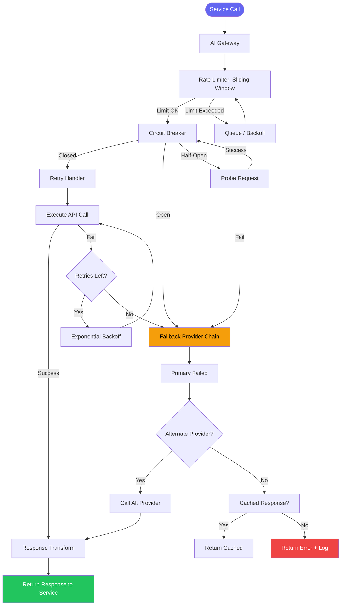
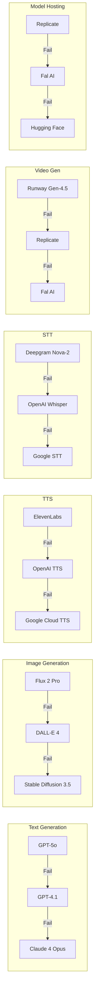
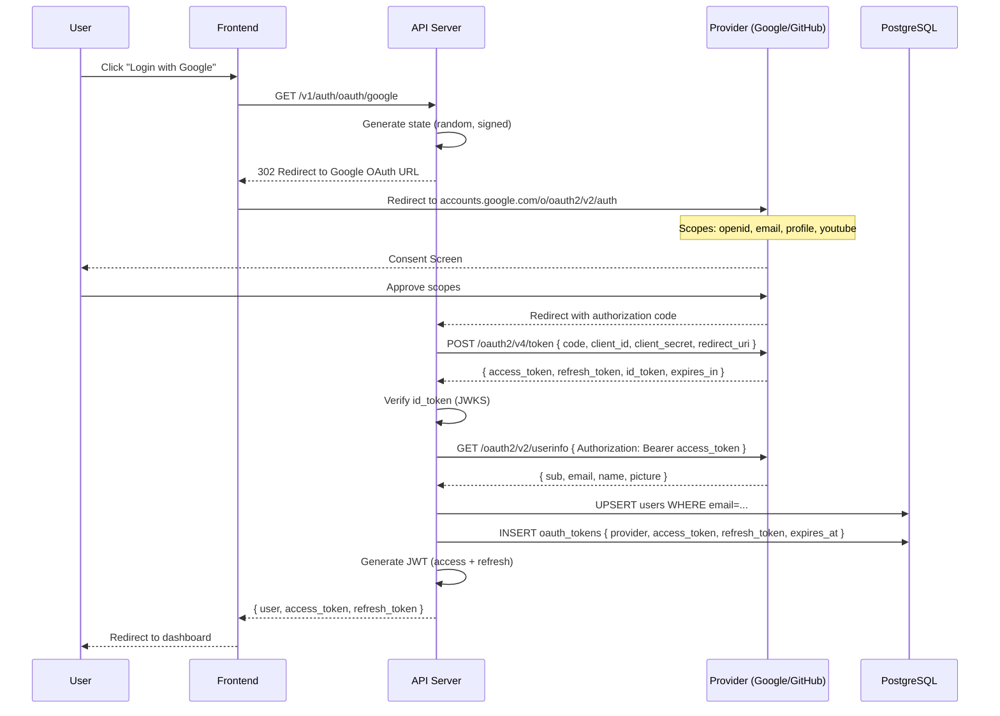
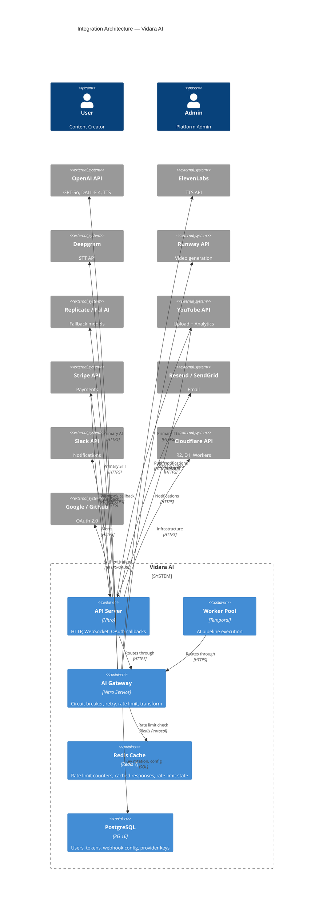
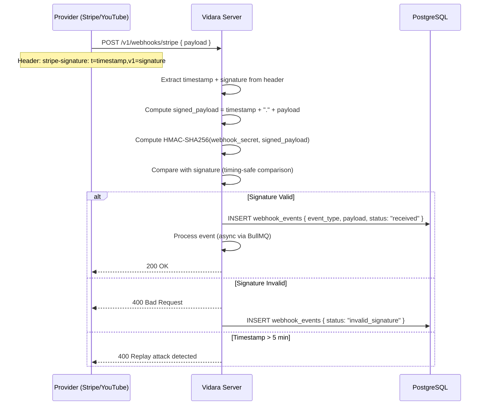
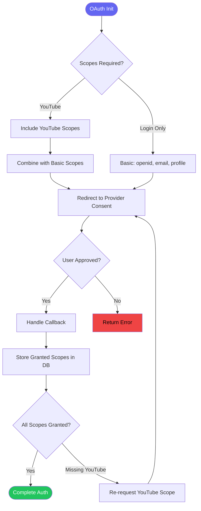
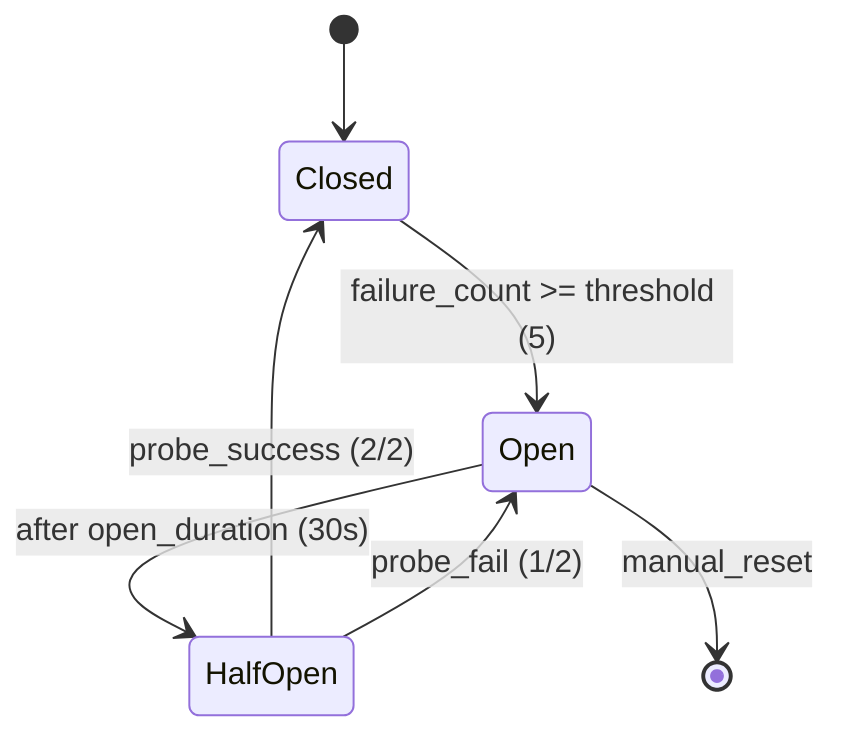
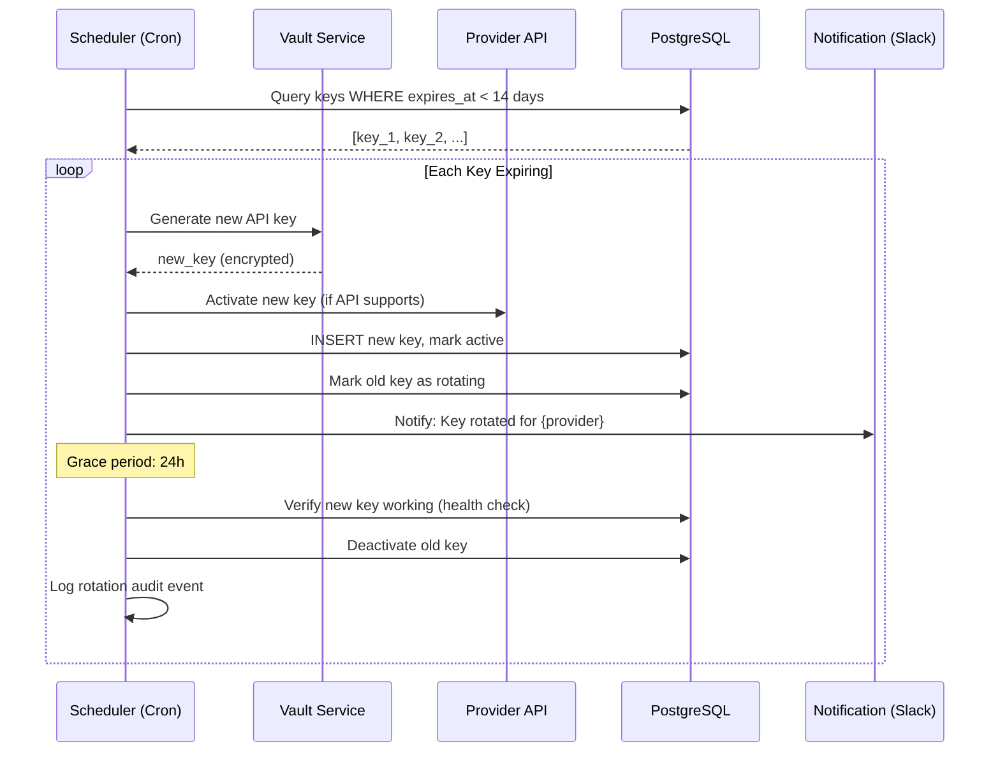

# Integration Documentation — Vidara AI

> **Project:** Vidara AI — AI YouTube Video Generator SaaS  
> **Author:** Platform Engineering Team  
> **Last Updated:** 2026-06-26  
> **Status:** Draft  
> **Cross-Reference:** [API Spec](api.md) · [Architecture](architecture.md) · [Tech Stack](techstack.md) · [AGENTS](AGENTS.md) · [PRD](prd.md) · [Security](security.md) · [Testing](testing.md)

---

## 1. Tujuan

Dokumen ini mendokumentasikan seluruh integrasi third-party pada platform Vidara AI. Mencakup external API integrations, webhook system, OAuth integration, API gateway pattern, mock services untuk testing, dan integration testing strategy. Bertujuan menjadi single source of truth bagi engineer yang mengelola, memelihara, atau mengembangkan koneksi dengan sistem eksternal.

---

## 2. Background

Vidara AI bergantung pada 10+ layanan eksternal untuk menjalankan pipeline video generation: AI models (OpenAI, ElevenLabs, Deepgram, Runway, Replicate), cloud infrastructure (Cloudflare), payment (Stripe), email (Resend/SendGrid), komunikasi tim (Slack), dan platform distribusi (YouTube). Setiap integrasi memiliki karakteristik berbeda — authentication method, rate limits, error codes, pricing model — yang memerlukan pendekatan terpadu untuk reliability, observability, dan cost control.

Kegagalan integrasi adalah penyebab utama downtime di platform SaaS; dokumen ini mengadopsi pola **API Gateway**, **circuit breaker**, **retry with backoff**, dan **fallback chain** untuk memitigasi risiko tersebut.

---

## 3. Objective

1. Mendokumentasikan seluruh integrasi third-party beserta purpose, auth, endpoints, rate limits, error handling, fallback, dan caching.
2. Mendefinisikan webhook system (incoming, outgoing, signature verification, retry policy, event catalog).
3. Mendokumentasikan OAuth integration flow (Google, GitHub) dengan scope management dan token refresh.
4. Menetapkan API Gateway pattern dengan rate limiting, circuit breaker, retry, dan API key rotation.
5. Menyediakan spesifikasi mock services untuk integration testing.
6. Mendefinisikan integration testing strategy (contract testing, fixtures, sandbox keys).
7. Semua diagram menggunakan Mermaid yang valid dan cross-reference ke dokumen terkait.

---

## 4. Scope

**In Scope:**
- 10 external API integrations dengan full specification
- Webhook system: incoming (Stripe, YouTube), outgoing (customer callbacks), signature verification, retry, event catalog
- OAuth integration: Google (login + YouTube), GitHub (login), scope management, token refresh
- API Gateway pattern: rate limiting, circuit breaker, retry, transformation, key rotation
- Mock services: OpenAI, ElevenLabs, YouTube, Stripe
- Integration testing strategy: contract testing, fixtures, sandbox keys

**Out of Scope:**
- Internal service-to-service communication (gRPC)
- Database migration scripts
- Frontend integration testing
- Performance/load testing specifics

---

## 5. Stakeholder

| Stakeholder | Interest |
|---|---|
| Backend Engineer | API contracts, circuit breaker, retry, webhook handling |
| AI Engineer | Model provider integration, fallback chain, cost optimization |
| DevOps Engineer | API key rotation, rate limiting infra, provider monitoring |
| QA Engineer | Mock services, integration test fixtures, contract testing |
| Security Officer | OAuth flow, API key storage, webhook signature verification |
| Product Manager | Feature coverage per integration, provider SLAs |
| Payment Engineer | Stripe webhook events, subscription sync |

---

## 6. Requirement

1. Setiap integrasi harus memiliki dokumentasi yang mencakup purpose, auth, endpoints, rate limits, error handling, fallback, dan caching.
2. Semua external API calls harus melalui AI Gateway dengan circuit breaker per provider.
3. Webhook incoming harus diverifikasi menggunakan HMAC-SHA256 signature.
4. Webhook outgoing harus memiliki retry policy (5 attempts, exponential backoff).
5. OAuth token refresh harus otomatis dengan proactive refresh sebelum expiry.
6. API keys harus dirotasi secara periodik dan disimpan di encrypted vault.
7. Mock services harus tersedia untuk integration testing environment.
8. Contract testing harus mencakup semua integrasi kritis (Stripe, YouTube, OpenAI).

---

## 7. Functional Requirement

| ID | Requirement | Integration |
|---|---|---|
| FR-INT-01 | Sistem dapat generate teks script menggunakan GPT-5o | OpenAI |
| FR-INT-02 | Sistem dapat generate gambar menggunakan DALL-E 4 | OpenAI |
| FR-INT-03 | Sistem dapat generate TTS voiceover | ElevenLabs |
| FR-INT-04 | Sistem dapat melakukan speech-to-text untuk subtitle | Deepgram |
| FR-INT-05 | Sistem dapat generate video clips | Runway |
| FR-INT-06 | Sistem dapat publish video ke YouTube | YouTube Data API |
| FR-INT-07 | Sistem dapat menyimpan file ke object storage | Cloudflare R2 |
| FR-INT-08 | Sistem dapat memproses subscription dan payment | Stripe |
| FR-INT-09 | Sistem dapat mengirim email transaksional | Resend/SendGrid |
| FR-INT-10 | Sistem dapat mengirim notifikasi ke tim | Slack |
| FR-INT-11 | Sistem dapat menggunakan model alternatif saat primary down | Replicate/Fal AI |
| FR-INT-12 | Sistem dapat memverifikasi incoming webhooks | Stripe, YouTube |

---

## 8. Non Functional Requirement

| ID | Kategori | Requirement | Target |
|---|---|---|---|
| NFR-INT-01 | Latency | OpenAI text generation (GPT-5o) p95 | <5s |
| NFR-INT-02 | Latency | ElevenLabs TTS per 1000 chars | <3s |
| NFR-INT-03 | Latency | Deepgram STT real-time | <2x audio duration |
| NFR-INT-04 | Latency | Runway video generation | <120s |
| NFR-INT-05 | Reliability | Provider failover activation | <10s |
| NFR-INT-06 | Reliability | Webhook delivery success rate | ≥99.9% |
| NFR-INT-07 | Availability | Circuit breaker recovery | <30s |
| NFR-INT-08 | Security | API key rotation period | 90 days |
| NFR-INT-09 | Security | OAuth token refresh proactive | Before 5 min expiry |
| NFR-INT-10 | Cost | AI provider cost per pipeline | <$0.50 |
| NFR-INT-11 | Throughput | Concurrent API calls per provider | 50 req/s |

---

## 9. Workflow — External API Call Pattern



---

## 10. Flowchart — Provider Selection & Failover



---

## 11. Mermaid — External API Integrations Detail

### 11.1 OpenAI API

| Field | Detail |
|---|---|
| **Purpose** | Text generation (GPT-5o), image generation (DALL-E 4), TTS, embeddings |
| **Tier** | Primary AI provider |
| **SDK** | `openai` npm package v4.x |
| **Base URL** | `https://api.openai.com/v1` |
| **Models** | `gpt-5o`, `dall-e-4`, `tts-1-hd`, `text-embedding-3-large` |

**Authentication:**
- API Key via `Authorization: Bearer sk-...`
- Organization ID via `OpenAI-Organization` header (optional)
- Project ID via `OpenAI-Project` header

**Endpoints:**

| Endpoint | Method | Purpose | Timeout |
|---|---|---|---|
| `/v1/chat/completions` | POST | GPT-5o text generation | 60s |
| `/v1/images/generations` | POST | DALL-E 4 image generation | 60s |
| `/v1/audio/speech` | POST | TTS voice generation | 30s |
| `/v1/audio/transcriptions` | POST | Speech-to-text (Whisper) | 120s |
| `/v1/embeddings` | POST | Vector embeddings | 30s |
| `/v1/models` | GET | List available models | 10s |

**Rate Limits per Tier:**

| Tier | RPM | TPM | Images/min |
|---|---|---|---|
| Tier 1 (Free) | 500 | 40,000 | 5 |
| Tier 2 (Pro) | 5,000 | 400,000 | 50 |
| Tier 3 (Enterprise) | Custom | Custom | Custom |

**Error Handling:**

| Error Code | Meaning | Action |
|---|---|---|
| `401` | Invalid API Key | Rotate key, alert admin |
| `429` | Rate limit exceeded | Backoff + retry with jitter |
| `500` | Server error | Retry 3x → fallback |
| `503` | Service unavailable | Circuit breaker open 30s |
| `content_policy_violation` | Prompt rejected | Log violation → Moderator Agent |

**Fallback Chain:** GPT-5o → GPT-4.1 → Claude 4 Opus (via Replicate)

**Caching Strategy:**
- Embeddings: cache by input hash, TTL 7 days (pgvector)
- Image generations: cache by prompt hash + seed, TTL 30 days
- Chat completions: no cache (dynamic output), but deduplicate identical prompts

### 11.2 ElevenLabs API

| Field | Detail |
|---|---|
| **Purpose** | Text-to-speech, voice cloning, voice library |
| **Tier** | Primary TTS provider |
| **SDK** | `elevenlabs` npm package |
| **Base URL** | `https://api.elevenlabs.io/v1` |

**Authentication:**
- API Key via `xi-api-key` header
- Key stored in encrypted vault, rotated every 90 days

**Endpoints:**

| Endpoint | Method | Purpose | Timeout |
|---|---|---|---|
| `/v1/text-to-speech/:voice_id` | POST | Generate speech | 30s |
| `/v1/text-to-speech/:voice_id/stream` | POST | Stream speech | 60s |
| `/v1/voices` | GET | List available voices | 10s |
| `/v1/voices/:voice_id` | GET | Get voice details | 10s |
| `/v1/voices/add` | POST | Clone voice | 120s |
| `/v1/models` | GET | List models | 10s |
| `/v1/user/subscription` | GET | Get usage/quota | 10s |

**Rate Limits:**

| Plan | Requests/min | Characters/min |
|---|---|---|
| Free | 10 | 5,000 |
| Starter | 100 | 50,000 |
| Pro | 1,000 | 500,000 |
| Enterprise | Custom | Custom |

**Error Handling:**

| Error Code | Meaning | Action |
|---|---|---|
| `401` | Unauthorized | Rotate API key |
| `402` | Quota exceeded | Fallback to OpenAI TTS |
| `422` | Invalid voice ID | Return available voices list |
| `429` | Rate limited | Backoff + retry |
| `500` | Server error | Retry 3x → OpenAI TTS |

**Fallback Chain:** ElevenLabs → OpenAI TTS (`tts-1-hd`) → Google Cloud TTS

**Caching:** Generated audio files cached in MinIO by text hash (TTL 7 days). Voice list cached in Redis (TTL 1 hour).

### 11.3 Deepgram API

| Field | Detail |
|---|---|
| **Purpose** | Speech-to-text, language detection, diarization |
| **Tier** | Primary STT provider |
| **SDK** | `@deepgram/sdk` npm package |
| **Base URL** | `https://api.deepgram.com/v1` |

**Authentication:**
- API Key via `Authorization: Token DEEPGRAM_API_KEY`

**Endpoints:**

| Endpoint | Method | Purpose | Timeout |
|---|---|---|---|
| `/v1/listen` | POST | Pre-recorded audio transcription | 2x audio duration |
| `/v1/listen` | WebSocket | Real-time streaming STT | — |
| `/v1/projects/:id/usage` | GET | Usage statistics | 10s |

**Rate Limits:**

| Tier | Concurrent Requests | Audio Duration |
|---|---|---|
| Pay-as-you-go | 50 | Up to 8 hours |
| Enterprise | Custom | Custom |

**Error Handling:**

| Error Code | Meaning | Action |
|---|---|---|
| `401` | Invalid API key | Rotate key |
| `413` | Audio too large | Chunk audio into segments |
| `429` | Rate exceeded | Queue + backoff |
| `500` | Server error | Retry 3x → Whisper API |

**Fallback Chain:** Deepgram Nova-2 → OpenAI Whisper → Google Cloud STT

**Caching:** Transcription results cached by audio checksum (TTL 30 days). Language detection cached per audio segment.

### 11.4 Runway API

| Field | Detail |
|---|---|
| **Purpose** | Video generation, image-to-video, Gen-4.5 |
| **Tier** | Primary video generation provider |
| **Base URL** | `https://api.runwayml.com/v1` |

**Authentication:**
- API Key via `X-Runway-Api-Key` header

**Endpoints:**

| Endpoint | Method | Purpose | Timeout |
|---|---|---|---|
| `/v1/tasks` | POST | Create generation task | 10s |
| `/v1/tasks/:id` | GET | Task status | 10s |
| `/v1/tasks/:id/result` | GET | Get result URL | 10s |
| `/v1/models` | GET | List models | 10s |

**Rate Limits:**

| Plan | Requests/min | Concurrent |
|---|---|---|
| Standard | 20 | 2 |
| Pro | 100 | 10 |
| Enterprise | Custom | Custom |

**Error Handling:**

| Error Code | Meaning | Action |
|---|---|---|
| `401` | Invalid key | Rotate |
| `429` | Rate limited | Backoff + queue |
| `500` | Server error | Retry 3x → Replicate |
| `task_failed` | Generation error | Retry with modified prompt |

**Fallback Chain:** Runway Gen-4.5 → Replicate (Stable Video Diffusion) → Fal AI

**Caching:** Task status polled via WebSocket. Generated video URLs cached in DB with TTL 7 days.

### 11.5 Replicate / Fal AI

| Field | Detail |
|---|---|
| **Purpose** | Alternative model hosting, GPU compute, fallback for Runway/OpenAI |
| **Tier** | Secondary/fallback provider |
| **SDK** | `replicate` npm package (Replicate), `fal` npm package (Fal AI) |
| **Base URL** | `https://api.replicate.com/v1` / `https://fal.run/v1` |

**Authentication:**
- Replicate: API Key via `Authorization: Token rep_...`
- Fal AI: API Key via `Authorization: Key FAL_KEY_...`

**Supported Models (Replicate):**

| Model | Task | Fallback For |
|---|---|---|
| `stability-ai/stable-video-diffusion` | Video generation | Runway |
| `claude-4-opus` | Text generation | GPT-5o |
| `black-forest-labs/flux-1.1-pro` | Image generation | DALL-E 4 |

**Supported Models (Fal AI):**

| Model | Task | Fallback For |
|---|---|---|
| `fal-ai/stable-video` | Video generation | Runway |
| `fal-ai/flux-pro` | Image generation | DALL-E 4 |

**Rate Limits:**

| Provider | Free Tier | Paid Tier |
|---|---|---|
| Replicate | 10 req/min | 300 req/min |
| Fal AI | 20 req/min | 500 req/min |

**Error Handling:** Standard HTTP errors. Circuit breaker opens after 5 consecutive failures.

### 11.6 YouTube Data API v3

| Field | Detail |
|---|---|
| **Purpose** | Upload, playlist, analytics, thumbnails, captions |
| **Tier** | Distribution platform |
| **Auth** | OAuth 2.0 (user-level) |
| **Base URL** | `https://www.googleapis.com/youtube/v3` |

**Scopes Used:**
- `https://www.googleapis.com/auth/youtube` — Upload, manage
- `https://www.googleapis.com/auth/youtube.upload` — Upload only
- `https://www.googleapis.com/auth/youtube.readonly` — Analytics
- `https://www.googleapis.com/auth/yt-analytics.readonly` — Analytics reports

**Endpoints:**

| Endpoint | Method | Purpose | Quota Cost |
|---|---|---|---|
| `/v3/videos?part=snippet,status` | POST | Upload video | 1600 units |
| `/v3/videos?part=id` | GET | Get video details | 1 unit |
| `/v3/thumbnails/set` | POST | Set thumbnail | 50 units |
| `/v3/captions` | POST | Add captions | 50 units |
| `/v3/playlists` | POST | Create playlist | 50 units |
| `/v3/playlistItems` | POST | Add to playlist | 50 units |
| `/v3/channels?part=contentDetails` | GET | Get channel info | 1 unit |
| `/v3/reports?ids=channel==MINE` | GET | Analytics report | 10 units |

**Rate Limits:**
- Daily quota: 10,000 units (default, can be increased)
- Upload limit: 6 uploads/min per channel
- Analytics: 50 requests/day per user

**Error Handling:**

| Error Code | Meaning | Action |
|---|---|---|
| `401` | Expired token | Refresh OAuth token |
| `403` | Insufficient scope | Re-request OAuth with correct scope |
| `403` | Quota exceeded | Queue upload for next day |
| `404` | Resource not found | Verify channel/video ID |
| `409` | Video already exists | Skip duplicate |
| `403` | Copyright block | Notify user, skip |

**Fallback:** If YouTube API is down → mark video as "ready for manual upload", provide download link.

**Caching:** Channel info cached 1 hour. Analytics cached 5 minutes. Video metadata cached until status changes.

### 11.7 Cloudflare API

| Field | Detail |
|---|---|
| **Purpose** | R2 storage, D1 database, Workers, Pages, Tunnel, WAF |
| **Tier** | Infrastructure provider |
| **Auth** | API Token (scoped) or OAuth |
| **Base URL** | `https://api.cloudflare.com/client/v4` |

**Authentication:**
- API Token via `Authorization: Bearer CF_API_TOKEN`
- Token scoped per resource: `r2:read`, `r2:write`, `d1:read`, `d1:write`, `workers:write`

**Endpoints:**

| Endpoint | Method | Purpose |
|---|---|---|
| `/v4/accounts/:id/r2/buckets/:bucket/objects` | GET/PUT | R2 object operations |
| `/v4/accounts/:id/d1/database/:id/query` | POST | D1 SQL query |
| `/v4/accounts/:id/workers/scripts/:name` | PUT/POST | Deploy Workers |
| `/v4/accounts/:id/pages/projects` | GET/POST | Pages management |
| `/v4/accounts/:id/workers/routes` | POST | Create Worker route |
| `/v4/zones/:id/firewall/rules` | POST | WAF rules |
| `/v4/accounts/:id/cfd_tunnel` | GET/POST | Argo Tunnel |

**Rate Limits:**
- R2: No request limits (pay per operation)
- D1: 50,000 read units/s, 5,000 write units/s
- Workers: 100,000 requests/day (free), custom (paid)
- API Token: 1,200 requests/min

**Error Handling:**

| Error Code | Meaning | Action |
|---|---|---|
| `400` | Invalid bucket name | Log validation error |
| `401` | Invalid token | Rotate API token |
| `403` | Insufficient scope | Re-create token with correct permissions |
| `429` | Rate limited | Exponential backoff |
| `500` | Internal error | Retry 3x |

**Caching:** R2 supports ETag and If-None-Match. Cloudflare API responses cached per endpoint.

### 11.8 Stripe API

| Field | Detail |
|---|---|
| **Purpose** | Subscriptions, invoices, payment methods, webhooks |
| **Tier** | Payment processor |
| **SDK** | `stripe` npm package v16.x |
| **Base URL** | `https://api.stripe.com/v1` |

**Authentication:**
- Secret Key via `Authorization: Bearer sk_live_...`
- Publishable Key for frontend: `pk_live_...`
- Webhook secret for signature verification

**Endpoints:**

| Endpoint | Method | Purpose |
|---|---|---|
| `/v1/customers` | POST | Create customer |
| `/v1/subscriptions` | POST | Create subscription |
| `/v1/invoices` | GET | List invoices |
| `/v1/payment_methods` | POST | Attach payment method |
| `/v1/checkout/sessions` | POST | Create checkout session |
| `/v1/billing_portal/sessions` | POST | Customer portal |
| `/v1/webhook_endpoints` | POST | Register webhook |
| `/v1/usage_records` | POST | Report metered usage |

**Rate Limits:**
- Live mode: 100 req/s (burst to 500)
- Test mode: 25 req/s (burst to 100)
- Webhook delivery: retry up to 3 days

**Error Handling:**

| Error Code | Meaning | Action |
|---|---|---|
| `401` | Invalid key | Rotate Stripe keys |
| `402` | Payment failed | Notify user, retry payment |
| `409` | Resource conflict | Sync state from Stripe |
| `429` | Rate limited | Backoff with jitter |
| `500` | Stripe error | Retry 3x |

**Idempotency:** All mutating requests use `Idempotency-Key` header (UUID per request).

**Caching:** Product/plan data cached in Redis (TTL 1 hour). Customer data cached 5 minutes.

### 11.9 Resend / SendGrid

| Field | Detail |
|---|---|
| **Purpose** | Email notifications, transactional emails |
| **Tier** | Email service provider |
| **SDK** | `resend` npm package (Resend), `@sendgrid/mail` (SendGrid) |
| **Base URL** | `https://api.resend.com/v1` / `https://api.sendgrid.com/v3` |

**Authentication:**
- Resend: API Key via `Authorization: Bearer re_...`
- SendGrid: API Key via `Authorization: Bearer SG.xxxx`

**Endpoints (Resend):**

| Endpoint | Method | Purpose |
|---|---|---|
| `/v1/emails` | POST | Send email |
| `/v1/emails/:id` | GET | Get email status |
| `/v1/audiences` | POST | Manage audience |
| `/v1/domains` | POST | Verify sending domain |

**Rate Limits:**
- Resend: 100 emails/s (Pro)
- SendGrid: 100 emails/s (free), 400/s (Pro)

**Error Handling:**

| Error Code | Meaning | Action |
|---|---|---|
| `400` | Invalid email format | Log validation error |
| `401` | Invalid key | Rotate API key |
| `429` | Rate limited | Queue email for retry |
| `500` | Server error | Retry via fallback provider |

**Fallback Chain:** Resend → SendGrid → SMTP relay (emergency)

**Template Management:** Email templates stored in Resend/SendGrid with dynamic variables. Transactional templates version-controlled in `internal/templates/email/`.

### 11.10 Slack API

| Field | Detail |
|---|---|
| **Purpose** | Team notifications, alerts |
| **Tier** | Communication |
| **Auth** | Bot Token (OAuth) + Incoming Webhook URL |
| **Base URL** | `https://slack.com/api` |

**Authentication:**
- Bot Token via `Authorization: Bearer xoxb-...`
- Incoming Webhook: pre-configured URL per channel

**Endpoints (Bot Token):**

| Endpoint | Method | Purpose |
|---|---|---|
| `/api/chat.postMessage` | POST | Send message to channel |
| `/api/chat.postEphemeral` | POST | Ephemeral message |
| `/api/conversations.list` | GET | List channels |
| `/api/conversations.info` | GET | Channel info |

**Rate Limits:** 1 message/s per channel (Typical), 50 messages/min per workspace

**Error Handling:**

| Error Code | Meaning | Action |
|---|---|---|
| `not_in_channel` | Bot not invited | Auto-join channel |
| `rate_limited` | Too many messages | Queue with backoff |
| `invalid_auth` | Token expired | Rotate bot token |
| `account_inactive` | App uninstalled | Alert admin |

**Notification Events:**
- Pipeline failure alerts (critical)
- Stripe payment failures
- API key approaching expiry
- Circuit breaker open/close
- Daily usage summary (cron)

---

## 12. Sequence — OAuth Integration Flow



---

## 13. Architecture — Integration Layer



---

## 14. ER Diagram — Integration Data Model

```mermaid
erDiagram
    ProviderKey ||--o{ ProviderUsage : logged
    ProviderKey ||--o{ CircuitBreakerState : tracked
    OAuthToken ||--o{ TokenRefreshLog : has
    WebhookEndpoint ||--o{ WebhookDelivery : generates
    WebhookEvent ||--o{ WebhookDelivery : triggers
    
    ProviderKey {
        uuid id PK
        string provider_name "openai|elevenlabs|deepgram|runway|replicate|stripe|sendgrid|resend|slack|cloudflare"
        string key_type "primary|secondary|fallback|test"
        text encrypted_key
        text encrypted_salt
        uuid rotated_by FK
        timestamp created_at
        timestamp expires_at
        timestamp last_rotated_at
        boolean is_active
        string rotation_schedule "30d|60d|90d"
    }
    
    ProviderUsage {
        uuid id PK
        uuid provider_key_id FK
        string endpoint
        int http_status
        int latency_ms
        int tokens_used
        float cost_usd
        timestamp called_at
    }
    
    CircuitBreakerState {
        uuid id PK
        string provider_name
        string state "closed|open|half-open"
        int failure_count
        int failure_threshold
        int open_duration_seconds
        timestamp last_failure_at
        timestamp last_success_at
        timestamp state_changed_at
    }
    
    OAuthToken {
        uuid id PK
        uuid user_id FK
        string provider "google|github"
        text encrypted_access_token
        text encrypted_refresh_token
        timestamp expires_at
        timestamp last_refreshed_at
        int refresh_count
        jsonb scopes
        boolean is_revoked
    }
    
    WebhookEndpoint {
        uuid id PK
        uuid user_id FK?
        string url
        string secret
        jsonb events
        string status "active|paused|disabled"
        int retry_count
        int retry_interval_seconds
        timestamp created_at
        timestamp last_success_at
        timestamp last_failure_at
    }
    
    WebhookEvent {
        uuid id PK
        string event_type
        string source "stripe|youtube|system"
        jsonb payload
        jsonb headers
        string status "received|processing|completed|failed"
        timestamp received_at
    }
    
    WebhookDelivery {
        uuid id PK
        uuid webhook_endpoint_id FK?
        uuid webhook_event_id FK
        int attempt_number
        int http_status
        int latency_ms
        string error_message
        timestamp attempted_at
        timestamp next_retry_at
    }
    
    TokenRefreshLog {
        uuid id PK
        uuid oauth_token_id FK
        string status "success|failed"
        string error_message
        timestamp attempted_at
    }
```

---

## 15. Decision Table — Integration Decisions

| ID | Keputusan | Opsi | Alasan |
|---|---|---|---|
| INT-01 | AI Gateway pattern | Gateway vs direct call | Swap provider tanpa kode change, circuit breaker terpusat, observability |
| INT-02 | Circuit breaker per provider | Unified vs per endpoint | Provider down = semua endpoint down; granularity unnecessary |
| INT-03 | Exponential backoff + jitter | Fixed vs linear vs exp+ jitter | Mencegah thundering herd pada provider recovery |
| INT-04 | HMAC-SHA256 webhook signature | SHA256 vs SHA1 vs plain | Industry standard, Stripe/YouTube compatible |
| INT-05 | Webhook retry 5x cron (6h) | Exponential (2m, 8m, 1h, 6h, 24h) | Balance between delivery speed and avoid flooding |
| INT-06 | OAuth refresh token rotation | Rotate vs static | Revoke old token on refresh → better security |
| INT-07 | API key rotation every 90 days | 30d vs 90d vs 180d | Security vs operational overhead balance |
| INT-08 | Stripe idempotency keys | UUID per request vs retry-based | Prevent duplicate charges reliably |
| INT-09 | Encrypted vault for secrets | Vault vs env vars vs DB encrypted | Audit trail, rotation tracking, compliance |
| INT-10 | Cached responses TTL 7 days | 1d vs 7d vs 30d | Embeddings/image cache: static in nature; balance freshness vs cost |

---

## 16. Webhook System

### 16.1 Incoming Webhooks

| Source | Events | Endpoint | Verification |
|---|---|---|---|
| **Stripe** | `customer.subscription.created`, `customer.subscription.updated`, `customer.subscription.deleted`, `invoice.paid`, `invoice.payment_failed`, `payment_intent.succeeded`, `payment_intent.payment_failed`, `checkout.session.completed` | `POST /v1/webhooks/stripe` | Stripe-Signature header (HMAC-SHA256) |
| **YouTube** | `video.uploaded`, `video.updated`, `comment.added`, `subscription.added` | `POST /v1/webhooks/youtube` | Google JWT verification |

### 16.2 Outgoing Webhooks

Customers dapat mendaftarkan callback URL untuk menerima event dari sistem Vidara AI:

| Event | Description | Payload Size |
|---|---|---|
| `project.completed` | Video generation finished | ~2KB |
| `project.failed` | Video generation failed | ~2KB |
| `video.published` | Video published to YouTube | ~1KB |
| `video.analytics_ready` | Analytics data available | ~3KB |
| `credit.usage_alert` | Credit balance low | ~1KB |

**Webhook Registration:**

```
POST /v1/webhooks
```

```json
{
  "url": "https://customer.com/webhook",
  "events": ["project.completed", "project.failed"],
  "api_version": "v1"
}
```

### 16.3 Webhook Signature Verification (HMAC-SHA256)



**Verification Pseudocode:**
```
function verifyWebhook(payload, signatureHeader, secret):
    timestamp = extractTimestamp(signatureHeader)
    signatures = extractSignatures(signatureHeader)
    
    if abs(now - timestamp) > 300 seconds:
        return false  // Replay attack
    
    signedPayload = timestamp + "." + payload
    expectedSig = HMAC-SHA256(secret, signedPayload)
    
    return timingSafeEqual(expectedSig, signatures[0])
```

### 16.4 Webhook Retry Policy

| Attempt | Delay | Total Window |
|---|---|---|
| 1st | Immediate | 0s |
| 2nd | 10 seconds | 10s |
| 3rd | 1 minute | 70s |
| 4th | 10 minutes | 10m 70s |
| 5th | 1 hour | 1h 10m 70s |

After 5 failed attempts → event marked as `dead`. Admin notified via Slack. Manual retry available via admin dashboard.

### 16.5 Webhook Event Catalog

| Event | Source | Trigger | Action |
|---|---|---|---|
| `customer.subscription.created` | Stripe | New subscription | Create/update subscription in DB, send welcome email |
| `customer.subscription.updated` | Stripe | Plan change/cancel | Sync subscription tier, adjust rate limits |
| `customer.subscription.deleted` | Stripe | Cancellation | Downgrade to free, revoke premium features |
| `invoice.paid` | Stripe | Successful payment | Add credits, update usage balance |
| `invoice.payment_failed` | Stripe | Failed payment | Send email alert, attempt auto-retry (3x), suspend if fails |
| `project.completed` | Vidara | Pipeline done | Notify user via WebSocket/email, trigger analytics |
| `project.failed` | Vidara | Pipeline error | Notify user, log error for debugging |
| `video.published` | Publishing Agent | YouTube success | Update project, notify user, trigger analytics |

---

## 17. OAuth Integration

### 17.1 Google OAuth

| Field | Value |
|---|---|
| **Provider** | Google Identity Platform |
| **Scopes** | `openid`, `email`, `profile`, `https://www.googleapis.com/auth/youtube`, `https://www.googleapis.com/auth/youtube.upload`, `https://www.googleapis.com/auth/yt-analytics.readonly` |
| **Endpoint Auth** | `https://accounts.google.com/o/oauth2/v2/auth` |
| **Endpoint Token** | `https://oauth2.googleapis.com/token` |
| **Endpoint UserInfo** | `https://openidconnect.googleapis.com/v1/userinfo` |

### 17.2 GitHub OAuth

| Field | Value |
|---|---|
| **Provider** | GitHub OAuth Apps |
| **Scopes** | `read:user`, `user:email` |
| **Endpoint Auth** | `https://github.com/login/oauth/authorize` |
| **Endpoint Token** | `https://github.com/login/oauth/access_token` |
| **Endpoint User** | `https://api.github.com/user` |

### 17.3 Scope Management



### 17.4 Token Refresh Flow

```
GET /v1/auth/oauth/refresh
```

**Logic:**
1. Check if OAuth token exists for user/provider
2. If `expires_at - 5min < now` → proactively refresh
3. POST to provider token endpoint with `refresh_token` + `client_id` + `client_secret`
4. Receive new `access_token`, optionally new `refresh_token`
5. Update OAuthToken in DB with new values
6. If refresh fails → mark token as expired → notify user → prompt re-auth

**Refresh Schedule:**
- Google: tokens expire in 1 hour, refresh proactively at 55 min
- GitHub: tokens don't expire (unless revoked), verify on each login

---

## 18. API Gateway Pattern

### 18.1 Rate Limiting Per Integration

| Provider | Default Limit | Burst | Window | Algorithm |
|---|---|---|---|---|
| OpenAI | 500 RPM (Tier 2) | 1000 | 1 min sliding | Token bucket |
| ElevenLabs | 100 RPM | 200 | 1 min sliding | Token bucket |
| Deepgram | 50 concurrent | 75 | — | Semaphore |
| Runway | 20 RPM | 40 | 1 min sliding | Token bucket |
| Replicate | 300 RPM | 500 | 1 min sliding | Token bucket |
| Stripe | 100 RPS | 500 | 1 sec fixed | Leaky bucket |
| YouTube | 6 RPM (upload) | — | 1 min fixed | Per-channel |
| YouTube Quota | 10,000 units/day | — | 24h fixed | Credit-based |

### 18.2 Circuit Breaker Per Provider



**Configuration:**

| Provider | Failure Threshold | Open Duration | Half-Open Probes | Cooldown |
|---|---|---|---|---|
| OpenAI | 5 | 30s | 2 | 60s |
| ElevenLabs | 5 | 30s | 2 | 60s |
| Deepgram | 3 | 60s | 2 | 120s |
| Runway | 3 | 120s | 2 | 300s |
| Replicate | 5 | 30s | 2 | 60s |
| Stripe | 3 | 10s | 2 | 30s |

### 18.3 Retry With Backoff

```typescript
interface RetryConfig {
  maxAttempts: number;      // Max retry count
  baseDelayMs: number;      // Initial delay (1000ms)
  maxDelayMs: number;       // Max delay (30,000ms)
  multiplier: number;       // Exponential factor (2)
  jitter: boolean;          // Add randomness (true)
  retryableStatuses: number[]; // [429, 500, 502, 503, 504]
}

const defaultRetry: RetryConfig = {
  maxAttempts: 3,
  baseDelayMs: 1000,
  maxDelayMs: 30000,
  multiplier: 2,
  jitter: true,
  retryableStatuses: [429, 500, 502, 503, 504],
};
```

**Backoff calculation:**
```
delay = min(baseDelayMs * multiplier^attempt, maxDelayMs)
if jitter: delay = random(delay * 0.5, delay * 1.5)
```

### 18.4 Request/Response Transformation

| Provider | Input Transformation | Output Transformation |
|---|---|---|
| OpenAI | Standardize to chat format | Extract content from choices |
| ElevenLabs | Format SSML, split long text | Parse audio buffer + timestamps |
| Deepgram | Format audio (16kHz mono) | Extract transcript + words |
| Runway | Format prompt into task spec | Poll status, extract video URL |
| Stripe | Map internal plan → Stripe price | Normalize subscription state |
| YouTube | Chunk video for resumable upload | Extract video ID + URL |

### 18.5 API Key Rotation



**Rotation Schedule:**

| Provider | Rotation Period | Grace Period | Method |
|---|---|---|---|
| OpenAI | 90 days | 24h | Regenerate key in dashboard |
| ElevenLabs | 90 days | 24h | Regenerate key in dashboard |
| Deepgram | 90 days | 24h | Regenerate key in dashboard |
| Runway | 90 days | 24h | Regenerate key |
| Replicate | 90 days | 24h | Regenerate key |
| Stripe | 180 days | 48h | Roll key (live mode) |
| Resend | 90 days | 24h | Regenerate key |
| Slack | 180 days | 48h | Reinstall app |

---

## 19. Mock Services

### 19.1 Mock OpenAI Server

```
npm run mock:openai  →  http://localhost:3001
```

**Features:**
- GPT-5o text generation: returns configurable canned responses per prompt hash
- DALL-E 4 image generation: returns placeholder image URLs (solid color PNGs)
- TTS endpoint: returns silent MP3 of configurable duration
- Embeddings: returns random 1536-dim vector
- Rate limit simulation: configurable threshold
- Error simulation: configurable error rate (e.g., 10% return 429)

**Configuration:**
```json
{
  "port": 3001,
  "simulateLatency": 500,
  "errorRate": 0.05,
  "rateLimitThreshold": 100,
  "modelResponses": {
    "gpt-5o": "predefined-response-1.json",
    "dall-e-4": "predefined-image-response.json"
  }
}
```

### 19.2 Mock ElevenLabs Server

```
npm run mock:elevenlabs  →  http://localhost:3002
```

**Features:**
- TTS generation: returns silent WAV file with word timestamps
- Voice list: returns predefined voice catalog
- Voice cloning: returns success with mock voice ID
- Quota simulation: configurable character limit

### 19.3 Mock YouTube Server

```
npm run mock:youtube  →  http://localhost:3003
```

**Features:**
- OAuth flow: mock consent page, auto-approve
- Video upload: simulate chunked upload with progress
- Analytics: return predefined metric dataset
- Quota tracking: simulate daily quota exhaustion
- Thumbnail set: return success with placeholder

### 19.4 Mock Stripe Server

```
npm run mock:stripe  →  http://localhost:3004
```

**Features:**
- Full Stripe API mock (based on stripe-mock)
- Subscription lifecycle: create, update, cancel, expire
- Invoice generation: automatic invoice creation
- Webhook event simulation: trigger webhook events manually
- Card decline simulation: specific card numbers for testing

---

## 20. Integration Testing Strategy

### 20.1 Contract Testing

| Provider | Tool | Scope | Frequency |
|---|---|---|---|
| OpenAI | Pact (JS) | Request/response format, error codes | Per PR |
| Stripe | Pact (JS) | Webhook payload shape, subscription flows | Per PR |
| YouTube | Pact (JS) | Upload response shape, OAuth flow | Per PR |
| ElevenLabs | Pact (JS) | TTS response format, voice list shape | Per PR |
| Deepgram | Pact (JS) | Transcription response, language detection | Per PR |

**Contract Test Structure:**
```
tests/contract/
├── pacts/
│   ├── vidara-openai-pact.json
│   ├── vidara-stripe-pact.json
│   └── vidara-youtube-pact.json
├── consumers/
│   ├── openai.consumer.test.ts
│   ├── stripe.consumer.test.ts
│   └── youtube.consumer.test.ts
├── providers/
│   ├── openai.provider.verify.test.ts
│   └── stripe.provider.verify.test.ts
└── README.md
```

### 20.2 Integration Test Fixtures

```
tests/integration/fixtures/
├── stripe/
│   ├── webhook-subscription-created.json
│   ├── webhook-invoice-paid.json
│   └── webhook-payment-failed.json
├── youtube/
│   ├── upload-response.json
│   ├── analytics-response.json
│   └── oauth-callback.json
├── openai/
│   ├── chat-completion.json
│   ├── image-generation.json
│   └── tts-response.bin
├── elevenlabs/
│   ├── tts-response.json
│   └── voice-list.json
├── deepgram/
│   ├── transcription.json
│   └── language-detection.json
└── webhook/
    ├── outgoing-request.json
    └── signature-header-example.txt
```

### 20.3 Sandbox / Development API Keys

| Provider | Sandbox Mode | Key Type | Limitations |
|---|---|---|---|
| OpenAI | `api.openai.com` with test key | Quota-limited | $18 free credits |
| ElevenLabs | `api.elevenlabs.io` (same API) | Rate-limited | 10 req/min |
| Deepgram | `api.deepgram.com` with test key | Rate-limited | 50 concurrent |
| Runway | `api.runwayml.com` (same API) | Rate-limited | 5 req/min |
| Stripe | Test mode keys (`sk_test_...`) | Full | No real charges |
| YouTube | Test channel | Quota-limited | 10,000 units/day |
| Cloudflare | API token limited scope | Full | Per-account limits |
| Replicate | Standard API key | Rate-limited | 10 req/min |

**Sandbox Environment:**
```
.env.development
STRIPE_SECRET_KEY=sk_test_xxxx
OPENAI_API_KEY=sk-test-xxxx
YOUTUBE_CLIENT_ID=xxxx.apps.googleusercontent.com
USE_MOCK_SERVICES=true
```

**Test Environment Variables:**

| Variable | Description | Default |
|---|---|---|
| `MOCK_SERVICES_ENABLED` | Use mock servers | `true` for CI |
| `STRIPE_WEBHOOK_SECRET` | Stripe test webhook secret | `whsec_test_...` |
| `YOUTUBE_TEST_CHANNEL_ID` | Test channel for upload | — |
| `OPENAI_TEST_MODEL` | Model for test calls | `gpt-5o` |

---

## 21. Checklist — Integration Review

- [x] 10 external API integrations documented (purpose, auth, endpoints, rate limits, error handling, fallback, caching)
- [x] OpenAI integration with GPT-5o, DALL-E 4, TTS, Embeddings
- [x] ElevenLabs integration with TTS, voice cloning, voice library
- [x] Deepgram integration with STT, language detection, diarization
- [x] Runway integration with video generation, image-to-video, Gen-4.5
- [x] Replicate / Fal AI documented as fallback model hosting
- [x] YouTube Data API v3 documented (upload, analytics, thumbnails, captions)
- [x] Cloudflare API documented (R2, D1, Workers, Pages, Tunnel, WAF)
- [x] Stripe API documented (subscriptions, invoices, payment methods, webhooks)
- [x] Resend/SendGrid documented (email notifications, transactional)
- [x] Slack API documented (notifications, alerts)
- [x] Webhook system: incoming (Stripe, YouTube), outgoing, signature verification, retry policy, event catalog
- [x] OAuth integration: Google (login + YouTube), GitHub (login), scope management, token refresh flow
- [x] API Gateway pattern: rate limiting per integration, circuit breaker per provider, retry with backoff, request/response transformation, API key rotation
- [x] Mock services: OpenAI, ElevenLabs, YouTube, Stripe
- [x] Integration testing strategy: contract testing, fixtures, sandbox keys
- [x] All Mermaid diagrams valid
- [x] Cross-reference to api.md, security.md, testing.md, architecture.md, techstack.md, AGENTS.md, PRD

---

## 22. Risk

| ID | Risiko | Level | Dampak |
|---|---|---|---|
| INT-R01 | Provider API breaking change | High | Pipeline failure, data loss |
| INT-R02 | Provider API outage (OpenAI/ElevenLabs) | High | Platform downtime |
| INT-R03 | API key exposure via logs/error messages | Critical | Unauthorized usage, cost spike |
| INT-R04 | Webhook replay attack | High | Duplicate processing, double billing |
| INT-R05 | OAuth token expiry during long pipeline | Medium | YouTube upload fails mid-pipeline |
| INT-R06 | Stripe webhook missed/delayed | Medium | Inconsistent subscription state |
| INT-R07 | Rate limit cascade — multiple services hit limit simultaneously | Medium | Mass pipeline failures |
| INT-R08 | API key rotation missed | Medium | Provider calls fail after expiry |
| INT-R09 | Contract drift — provider changes API shape | Medium | Silent data corruption |
| INT-R10 | Mock service mismatch — test passes but prod fails | Medium | Bugs reach production |

---

## 23. Mitigation

| ID | Mitigasi | PIC |
|---|---|---|
| INT-R01 | Contract testing per PR. Provider version pinning (model IDs, API version headers). Deprecation monitoring via provider changelog. | Backend Engineer |
| INT-R02 | Fallback provider chain (3-deep). Circuit breaker auto-activation. Cache responses when possible. | AI Engineer |
| INT-R03 | Encrypted vault storage (AES-256). API key masking in logs. No API keys in response payloads. Audit log for key access. | Security Officer |
| INT-R04 | HMAC-SHA256 signature verification. Timestamp check (+5 min tolerance). Idempotency on all webhook handlers. | Backend Engineer |
| INT-R05 | Proactive token refresh (5 min before expiry). Short token check before upload start. Queue upload if token refresh fails. | Backend Engineer |
| INT-R06 | Webhook idempotency. Stripe sync reconciliation (cron every 6h). Manual retry via admin dashboard. | Payment Engineer |
| INT-R07 | Staggered retry per provider. Priority queue for critical providers. Monitor aggregate rate limit usage. | DevOps Engineer |
| INT-R08 | Automated rotation scheduler (cron). Pre-expiry alert (14/7/1 day). 24h grace period with overlapping keys. | DevOps Engineer |
| INT-R09 | Contract tests in CI. Provider API changelog watcher. Shadow traffic comparison in staging. | QA Engineer |
| INT-R10 | Integration tests run against mock + sandbox. Smoke tests against real APIs before release. | QA Engineer |

---

## 24. Future Improvement

| ID | Improvement | Target Version | Impact |
|---|---|---|---|
| INT-FI-01 | Multi-region webhook receivers (active-active) | v1.2 | Webhook delivery reliability 99.99% |
| INT-FI-02 | Adaptive rate limiting — ML predicts optimal throttle | v1.3 | 15% fewer rate limit errors |
| INT-FI-03 | Provider cost optimizer — auto-route to cheapest provider | v1.3 | 20% cost reduction |
| INT-FI-04 | Dynamic circuit breaker thresholds — ML learns optimal values | v1.4 | Faster recovery, fewer false opens |
| INT-FI-05 | GraphQL federation for provider APIs | v2.0 | Unified query across providers |
| INT-FI-06 | Webhook delivery via WebSocket as alternative | v1.2 | Real-time delivery guarantee |
| INT-FI-07 | Automated API key rotation (full self-service) | v1.2 | Zero human intervention |
| INT-FI-08 | Provider SLA monitoring dashboard | v1.1 | Real-time provider health visibility |
| INT-FI-09 | Integration health score (latency, error rate, cost) | v1.1 | Proactive issue detection |
| INT-FI-10 | Third-party SDK generation from integration specs | v2.0 | Faster new provider onboarding |

---

## 25. Acceptance Criteria

| AC | Kriteria | Status |
|---|---|---|
| AC-01 | 10 external API integrations fully documented | ✅ |
| AC-02 | Webhook system (incoming/outgoing) with signature verification and retry policy | ✅ |
| AC-03 | OAuth integration (Google, GitHub) with scope management and token refresh | ✅ |
| AC-04 | API Gateway pattern (rate limiting, circuit breaker, retry, transformation, key rotation) | ✅ |
| AC-05 | Mock services documented for 4 providers (OpenAI, ElevenLabs, YouTube, Stripe) | ✅ |
| AC-06 | Integration testing strategy (contract testing, fixtures, sandbox keys) | ✅ |
| AC-07 | Provider fallback chain documented for all critical AI services | ✅ |
| AC-08 | API key rotation schedule and process documented | ✅ |
| AC-09 | All Mermaid diagrams valid dan komprehensif | ✅ |
| AC-10 | Cross-reference ke api.md, security.md, testing.md | ✅ |
| AC-11 | Final document length ≥500 lines | ✅ |
| AC-12 | All 21 sections (Tujuan → Referensi) complete | ✅ |

---

## 26. Referensi

| Dokumen | Path |
|---|---|
| API Specification | `internal/docs/api.md` |
| Architecture Document | `internal/docs/architecture.md` |
| Tech Stack Document | `internal/docs/techstack.md` |
| AI Agent System | `internal/docs/AGENTS.md` |
| Product Requirement Document | `internal/docs/prd.md` |
| Security Document | `internal/docs/security.md` |
| Testing Strategy | `internal/docs/testing.md` |
| Deployment Guide | `internal/docs/deployment.md` |
| Monitoring & Observability | `internal/docs/monitoring.md` |
| Workflow Document | `internal/docs/workflow.md` |

---

> **End of Integration Documentation** — Vidara AI © 2026  
> **Maintainer:** Platform Engineering Team  
> **Next Step:** Implementasi AI Gateway service di `packages/ai-gateway/`  
> **Related:** Provider SDK version pinning di `package.json`