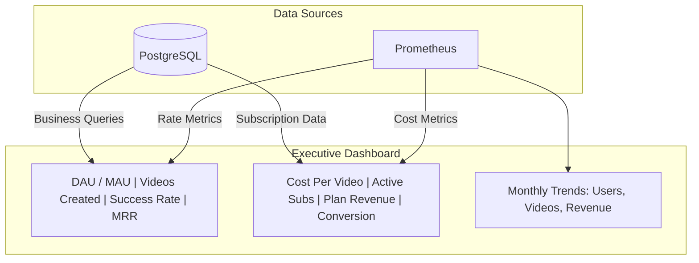
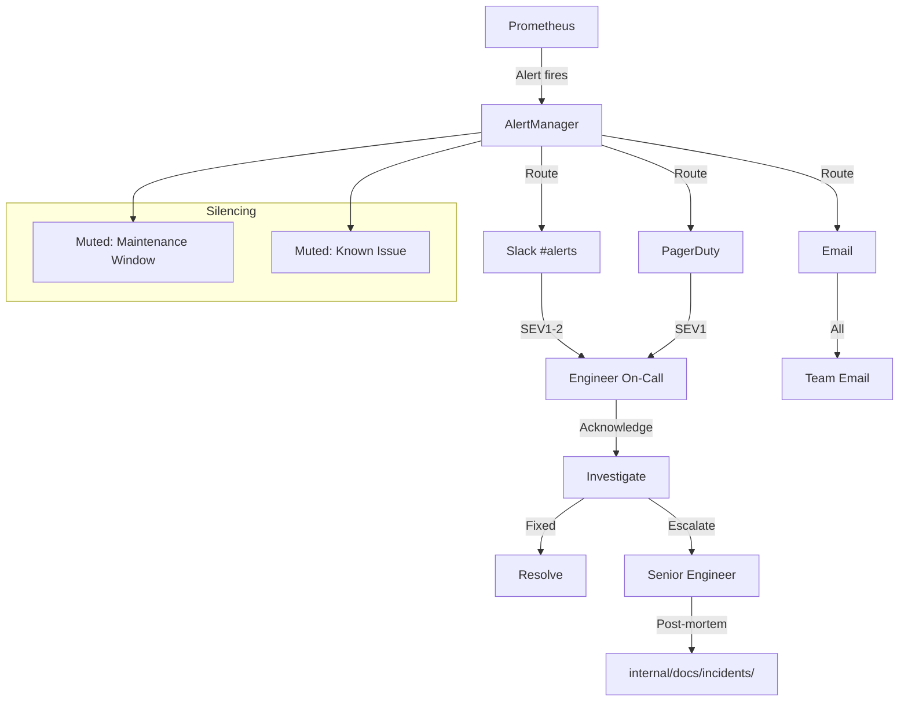
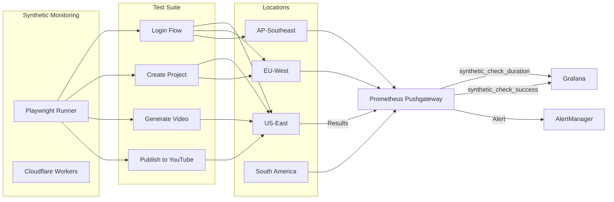
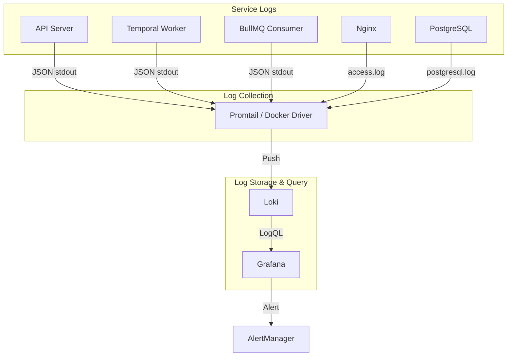
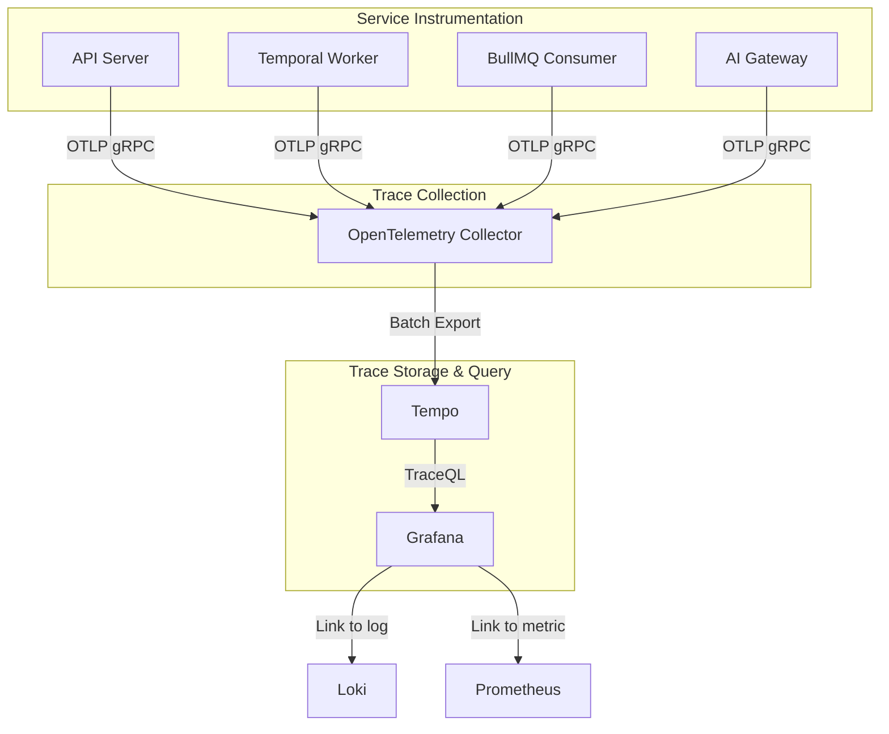
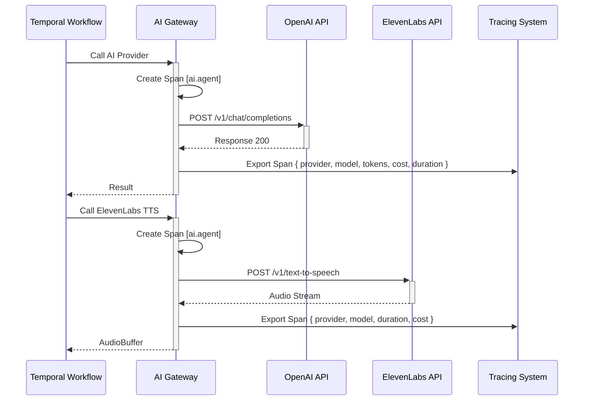

# Monitoring — Vidara AI

> **Project:** Vidara AI — AI YouTube Video Generator SaaS  
> **Author:** Platform Engineering Team  
> **Last Updated:** 2026-06-26  
> **Status:** Approved  
> **Cross-Reference:** [Architecture](architecture.md) · [Deployment](deployment.md) · [DevOps](devops.md) · [Cost Estimation](cost-estimation.md) · [Tech Stack](techstack.md) · [Workflow](workflow.md)

---

## 1. Tujuan

Dokumen ini mendefinisikan system monitoring strategy untuk Vidara AI. Mencakup metrik collection, Prometheus setup, Grafana dashboards, alerting rules, uptime monitoring, log management dengan Loki, dan distributed tracing dengan OpenTelemetry. Bertujuan memastikan sistem terpantau 24/7 dengan visibilitas penuh terhadap health, performance, dan cost.

---

## 2. Background

Vidara AI menjalankan pipeline AI yang kompleks (20 langkah, 6+ API eksternal) dengan video generation yang bisa memakan waktu 10-30 menit. Sistem memiliki SLO 99.9% availability dan <$0.50 per video. Monitoring yang efektif diperlukan untuk mendeteksi degradasi performa, mengidentifikasi bottleneck, mengoptimalkan biaya API, dan memastikan pipeline completion rate >95%.

---

## 3. Objective

1. Mendefinisikan monitoring philosophy berbasis RED dan USE method.
2. Mengkategorikan metrik ke 5 domain: Application, Business, AI, Infrastructure, Queue.
3. Menyediakan Prometheus configuration dengan service discovery dan recording rules.
4. Mendefinisikan 5 Grafana dashboards untuk berbagai stakeholder.
5. Menetapkan alerting rules dengan severity tiers dan runbook links.
6. Mendokumentasikan uptime monitoring dan synthetic monitoring strategy.
7. Mengintegrasikan log management (Loki) dan distributed tracing (OpenTelemetry).

---

## 4. Scope

**In Scope:**
- Monitoring philosophy: RED (Rate, Errors, Duration) untuk services, USE (Utilization, Saturation, Errors) untuk resources
- 5 metrik categories dengan definisi lengkap
- Prometheus configuration: targets, service discovery, recording rules, alerting rules
- 5 Grafana dashboards: Executive, Operations, AI Pipeline, Database, Cost
- Alerting rules table dengan severity dan runbook
- Uptime monitoring: Cloudflare Health Checks, Playwright synthetic monitoring
- Log management: Loki, structured logging, log levels
- Tracing: OpenTelemetry, distributed tracing across Temporal workflows
- Cost monitoring: per-user, per-model, per-video

**Out of Scope:**
- Application Performance Monitoring (APM) agent configuration
- Network-level monitoring (SNMP, netflow)
- Third-party SaaS monitoring tools (Datadog, New Relic)
- End-user real user monitoring (RUM)

---

## 5. Stakeholder

| Stakeholder | Interest |
|---|---|
| CTO | Business KPIs, cost trends, SLO compliance |
| DevOps Engineer | Infrastructure health, alerts, incident response |
| AI Engineer | Pipeline metrics, model degradation, token usage |
| Backend Engineer | API latency, error rates, queue health |
| Product Manager | User-facing metrics, conversion, active users |
| Finance Team | API cost, per-video cost, budget alerts |

---

## 6. Monitoring Philosophy

### 6.1 RED Method (Services)

RED method digunakan untuk mengukur health microservices dan API endpoints:

| Acronym | Metrik | Contoh |
|---|---|---|
| **R**ate | Requests per second | `http_requests_total / time` |
| **E**rrors | Failed requests per second | `http_requests_total{status=~"5.."} / time` |
| **D**uration | Latency distribution | `http_request_duration_seconds{p50,p95,p99}` |

**Target Services:**
- Nitro API Server (HTTP + WebSocket)
- Temporal Worker Pool
- BullMQ Consumer
- AI Gateway
- PostgreSQL
- Redis
- MinIO

### 6.2 USE Method (Resources)

USE method digunakan untuk mengukur health infrastruktur:

| Acronym | Metrik | Contoh |
|---|---|---|
| **U**tilization | % resource busy | `cpu_utilization`, `memory_usage` |
| **S**aturation | Queue/demand length | `load_average`, `disk_queue_depth` |
| **E**rrors | Error count | `disk_errors_total`, `network_drops_total` |

**Target Resources:**
- CPU (per core + aggregate)
- Memory (RAM + swap)
- Disk (usage %, IOPS, latency)
- Network (bandwidth, drops, errors)
- GPU (utilization, memory, temperature)
- Connection pools (PostgreSQL, Redis)

---

## 7. Metrics Categories — Application

### 7.1 HTTP Metrics

| Metrik | Type | Labels | Description |
|---|---|---|---|
| `http_requests_total` | Counter | `method`, `path`, `status`, `service` | Total HTTP requests |
| `http_request_duration_seconds` | Histogram | `method`, `path`, `service` | Request latency buckets (0.01, 0.05, 0.1, 0.25, 0.5, 1, 2.5, 5, 10) |
| `http_requests_in_flight` | Gauge | `service` | Concurrent requests |
| `http_response_size_bytes` | Summary | `method`, `path` | Response body size |

### 7.2 WebSocket Metrics

| Metrik | Type | Labels | Description |
|---|---|---|---|
| `ws_connections_total` | Counter | `service` | Total WebSocket connections established |
| `ws_connections_active` | Gauge | `service` | Current active WebSocket connections |
| `ws_messages_sent_total` | Counter | `event_type` | Messages sent to clients |
| `ws_messages_received_total` | Counter | `event_type` | Messages received from clients |
| `ws_connection_duration_seconds` | Histogram | `service` | Connection lifespan |

### 7.3 Throughput

| Metrik | Type | Labels | Description |
|---|---|---|---|
| `throughput_requests_per_minute` | Gauge | `endpoint` | Requests per minute (calculated) |
| `throughput_jobs_per_minute` | Gauge | `queue` | Jobs processed per minute |

---

## 8. Metrics Categories — Business

| Metrik | Type | Labels | Description |
|---|---|---|---|
| `videos_created_total` | Counter | `plan`, `user_tier` | Total videos created (all statuses) |
| `videos_published_total` | Counter | `plan` | Videos successfully published to YouTube |
| `videos_failed_total` | Counter | `step`, `reason` | Videos that failed at any pipeline step |
| `active_users_daily` | Gauge | — | Distinct users who interacted in last 24h |
| `active_users_monthly` | Gauge | — | Distinct users who interacted in last 30d |
| `conversion_rate` | Gauge | `source` | Signup → first video creation rate |
| `retention_rate_d7` | Gauge | — | Day-7 user retention |
| `retention_rate_d30` | Gauge | — | Day-30 user retention |
| `projects_per_user` | Histogram | — | Distribution of projects per user |
| `subscription_churn_rate` | Gauge | `plan` | Monthly subscription churn rate |
| `revenue_mrr_usd` | Gauge | `plan` | Monthly Recurring Revenue |
| `revenue_arpu_usd` | Gauge | — | Average Revenue Per User |

---

## 9. Metrics Categories — AI

### 9.1 Token Usage Per Agent

| Metrik | Type | Labels | Description |
|---|---|---|---|
| `ai_tokens_input_total` | Counter | `provider`, `model`, `agent` | Input tokens consumed |
| `ai_tokens_output_total` | Counter | `provider`, `model`, `agent` | Output tokens generated |
| `ai_tokens_total` | Counter | `provider`, `model`, `agent` | Total tokens (input + output) |
| `ai_tokens_per_video` | Histogram | `agent` | Token distribution per video generation |

### 9.2 Generation Latency

| Metrik | Type | Labels | Description |
|---|---|---|---|
| `ai_request_duration_seconds` | Histogram | `provider`, `model`, `agent` | AI API call latency |
| `ai_step_duration_seconds` | Histogram | `step` | Per-pipeline-step duration |
| `ai_pipeline_duration_seconds` | Histogram | — | End-to-end pipeline duration |
| `ai_queue_wait_seconds` | Histogram | `queue` | Time job spent in queue before processing |

### 9.3 Success Rate Per Model

| Metrik | Type | Labels | Description |
|---|---|---|---|
| `ai_requests_total` | Counter | `provider`, `model`, `agent` | Total AI API calls |
| `ai_requests_success_total` | Counter | `provider`, `model` | Successful API calls (2xx) |
| `ai_requests_failed_total` | Counter | `provider`, `model`, `error_code` | Failed API calls (4xx, 5xx, timeout) |
| `ai_success_rate` | Gauge | `provider`, `model` | Computed success rate (per 5m window) |
| `ai_circuit_breaker_state` | Gauge | `provider` | Circuit breaker state (0=closed, 1=open, 2=half-open) |

### 9.4 Cost Per Video

| Metrik | Type | Labels | Description |
|---|---|---|---|
| `ai_cost_total_usd` | Counter | `provider`, `model`, `agent` | Cumulative API cost |
| `ai_cost_per_video_usd` | Histogram | `provider` | Cost distribution per video |
| `ai_cost_per_user_usd` | Summary | `user_id` | API cost attributed to user |
| `ai_cost_per_step_usd` | Counter | `step` | Cost breakdown by pipeline step |

---

## 10. Metrics Categories — Infrastructure

### 10.1 Compute

| Metrik | Type | Labels | Description |
|---|---|---|---|
| `cpu_utilization_percent` | Gauge | `host`, `core` | CPU usage percentage |
| `cpu_load_average_1m` | Gauge | `host` | Load average (1 min) |
| `memory_usage_bytes` | Gauge | `host`, `type` | Memory usage by type (used, cached, buffered) |
| `memory_utilization_percent` | Gauge | `host` | Memory usage percentage |
| `swap_usage_bytes` | Gauge | `host` | Swap usage |
| `disk_usage_percent` | Gauge | `host`, `mount`, `device` | Disk usage percentage |
| `disk_io_seconds` | Counter | `host`, `device` | Disk I/O time |
| `disk_io_queue_depth` | Gauge | `host`, `device` | Pending disk I/O operations |
| `network_bytes_total` | Counter | `host`, `interface`, `direction` | Network throughput |
| `network_errors_total` | Counter | `host`, `interface` | Network error count |
| `network_drops_total` | Counter | `host`, `interface` | Packet drops |

### 10.2 GPU

| Metrik | Type | Labels | Description |
|---|---|---|---|
| `gpu_utilization_percent` | Gauge | `host`, `gpu_id` | GPU compute utilization |
| `gpu_memory_utilization_percent` | Gauge | `host`, `gpu_id` | GPU memory utilization |
| `gpu_temperature_celsius` | Gauge | `host`, `gpu_id` | GPU temperature |
| `gpu_power_watts` | Gauge | `host`, `gpu_id` | GPU power consumption |
| `gpu_fan_speed_percent` | Gauge | `host`, `gpu_id` | GPU fan speed |
| `gpu_encoder_utilization` | Gauge | `host`, `gpu_id` | NVENC encoder utilization |
| `gpu_decoder_utilization` | Gauge | `host`, `gpu_id` | NVDEC decoder utilization |

### 10.3 Connection Pools

| Metrik | Type | Labels | Description |
|---|---|---|---|
| `pg_connections_total` | Gauge | `host` | Total PostgreSQL connections |
| `pg_connections_active` | Gauge | `host` | Active PostgreSQL connections |
| `pg_connections_idle` | Gauge | `host` | Idle PostgreSQL connections |
| `pg_connections_waiting` | Gauge | `host` | Connections waiting for lock |
| `pg_pool_utilization_percent` | Gauge | `host` | Connection pool utilization (PgBouncer) |
| `redis_connected_clients` | Gauge | `host` | Redis connected clients |
| `redis_blocked_clients` | Gauge | `host` | Redis blocked clients |
| `redis_memory_usage_bytes` | Gauge | `host` | Redis memory usage |
| `minio_connections_total` | Gauge | `host` | MinIO concurrent requests |

---

## 11. Metrics Categories — Queue

| Metrik | Type | Labels | Description |
|---|---|---|---|
| `bullmq_queue_depth` | Gauge | `queue` | Number of jobs waiting in queue |
| `bullmq_active_jobs` | Gauge | `queue` | Jobs currently being processed |
| `bullmq_completed_jobs_total` | Counter | `queue` | Total completed jobs |
| `bullmq_failed_jobs_total` | Counter | `queue`, `error_code` | Total failed jobs |
| `bullmq_delayed_jobs` | Gauge | `queue` | Delayed/scheduled jobs |
| `bullmq_waiting_children` | Gauge | `queue` | Jobs waiting for child jobs |
| `bullmq_job_duration_seconds` | Histogram | `queue` | Job processing time |
| `bullmq_job_wait_time_seconds` | Histogram | `queue` | Time job spent waiting before processing |
| `bullmq_oldest_job_age_seconds` | Gauge | `queue` | Age of the oldest unprocessed job |
| `bullmq_queue_paused` | Gauge | `queue` | Whether queue is paused (1=paused) |
| `bullmq_dlq_depth` | Gauge | — | Dead letter queue count |
| `temporal_workflows_started_total` | Counter | `workflow_type` | Temporal workflows started |
| `temporal_workflows_completed_total` | Counter | `workflow_type`, `status` | Temporal workflows completed |
| `temporal_workflows_failed_total` | Counter | `workflow_type`, `reason` | Temporal workflow failures |
| `temporal_activity_execution_latency` | Histogram | `activity_type` | Temporal activity execution time |

### Queue Monitoring Diagram

```mermaid
flowchart LR
    subgraph "BullMQ Queues"
        Q1[(research)]
        Q2[(fact-check)]
        Q3[(script)]
        Q4[(image)]
        Q5[(voice)]
        Q6[(render)]
        Q7[(publish)]
    end

    subgraph "Prometheus Metrics"
        P1["bullmq_queue_depth{queue=\"render\"}"]
        P2["bullmq_failed_jobs_total"]
        P3["bullmq_job_duration_seconds"]
        P4["bullmq_oldest_job_age_seconds"]
    end

    subgraph "Alerting"
        A1["Queue Backlog >1000"]
        A2["Failure Rate >10%"]
        A3["Job Age >30min"]
    end

    Q1 & Q2 & Q3 & Q4 & Q5 & Q6 & Q7 --> P1
    Q1 & Q2 & Q3 --> P2
    Q6 --> P3
    Q6 --> P4

    P1 -->|Trigger| A1
    P2 -->|Trigger| A2
    P4 -->|Trigger| A3
```

---

## 12. Prometheus Setup

### 12.1 Metric Collection Targets

| Target | Endpoint | Scrape Interval | Service |
|---|---|---|---|
| Nitro API Server | `/metrics` | 15s | `api-server` |
| Temporal Worker | `/metrics` | 15s | `temporal-worker` |
| BullMQ Consumer | `/metrics` | 15s | `bull-consumer` |
| Node Exporter | `:9100/metrics` | 30s | `node-exporter` |
| PostgreSQL Exporter | `:9187/metrics` | 30s | `pg-exporter` |
| Redis Exporter | `:9121/metrics` | 30s | `redis-exporter` |
| MinIO Exporter | `:9000/minio/v2/metrics/cluster` | 30s | `minio` |
| GPU Exporter (DCGM) | `:9400/metrics` | 15s | `dcgm-exporter` |
| Temporal Server | `:8233/metrics` | 15s | `temporal-server` |
| BullMQ Exporter | Redis | 15s | `bull-exporter` |
| Cloudflare R2 | `:8080/metrics` | 60s | `r2-exporter` |

### 12.2 Service Discovery

```yaml
# docker-compose.prod.yml — Prometheus scrape configuration
scrape_configs:
  - job_name: 'api-server'
    static_configs:
      - targets: ['api:3000']
    metrics_path: '/metrics'
    relabel_configs:
      - source_labels: [__address__]
        target_label: instance
        regex: '(.*):.*'
        replacement: '${1}'

  - job_name: 'temporal-worker'
    static_configs:
      - targets: ['worker:9090']

  - job_name: 'node'
    static_configs:
      - targets: ['node-exporter:9100']

  - job_name: 'postgresql'
    static_configs:
      - targets: ['pg-exporter:9187']
    metric_relabel_configs:
      - source_labels: [datname]
        regex: 'template.*|postgres'
        action: drop

  - job_name: 'redis'
    static_configs:
      - targets: ['redis-exporter:9121']

  - job_name: 'minio'
    static_configs:
      - targets: ['minio:9000']
    metrics_path: '/minio/v2/metrics/cluster'

  - job_name: 'dcgm'
    static_configs:
      - targets: ['dcgm-exporter:9400']

  - job_name: 'temporal'
    static_configs:
      - targets: ['temporal:8233']
    metrics_path: '/metrics'
```

### 12.3 Recording Rules

```yaml
groups:
  - name: vidara_recording_rules
    interval: 30s
    rules:
      # API: error ratio per endpoint
      - record: job:http_errors:ratio_5m
        expr: |
          sum(rate(http_requests_total{status=~"5.."}[5m])) by (path, method)
          /
          sum(rate(http_requests_total[5m])) by (path, method)

      # API: p99 latency
      - record: job:http_request_duration:p99_5m
        expr: |
          histogram_quantile(0.99,
            sum(rate(http_request_duration_seconds_bucket[5m])) by (le, path)
          )

      # AI: success rate per provider (5m window)
      - record: job:ai_success_rate:5m
        expr: |
          sum(rate(ai_requests_success_total[5m])) by (provider)
          /
          sum(rate(ai_requests_total[5m])) by (provider)

      # Pipeline: completion rate
      - record: job:pipeline_completion_rate:1h
        expr: |
          sum(videos_published_total[1h])
          /
          sum(videos_created_total[1h])

      # Queue: oldest job age per queue
      - record: job:bullmq_oldest_job_age:max
        expr: max(bullmq_oldest_job_age_seconds) by (queue)

      # GPU: encoder utilization average
      - record: job:gpu_encoder_utilization:avg_5m
        expr: avg_over_time(gpu_encoder_utilization[5m])
```

### 12.4 Alerting Rules

```yaml
groups:
  - name: vidara_alerting_rules
    interval: 30s
    rules:
      - alert: HighErrorRate
        expr: job:http_errors:ratio_5m > 0.01
        for: 5m
        labels:
          severity: critical
        annotations:
          summary: 'API error rate >1% for 5 minutes'
          description: 'Error rate for {{ $labels.path }} is {{ $value | humanizePercentage }}'

      - alert: HighLatency
        expr: job:http_request_duration:p99_5m > 2
        for: 5m
        labels:
          severity: warning
        annotations:
          summary: 'API p99 latency >2s for 5 minutes'
          description: 'p99 latency for {{ $labels.path }} is {{ $value }}s'

      - alert: QueueBacklog
        expr: bullmq_queue_depth > 1000
        for: 10m
        labels:
          severity: critical
        annotations:
          summary: 'Queue backlog >1000 jobs for 10 minutes'
          description: 'Queue {{ $labels.queue }} has {{ $value }} pending jobs'

      - alert: ReplicationLag
        expr: pg_replication_lag_seconds > 30
        for: 5m
        labels:
          severity: critical
        annotations:
          summary: 'Database replication lag >30s'
          description: 'Replication lag is {{ $value }}s'

      - alert: CertificateExpiry
        expr: cert_expiry_days < 30
        for: 1h
        labels:
          severity: warning
        annotations:
          summary: 'SSL certificate expires in <30 days'
          description: 'Certificate for {{ $labels.domain }} expires in {{ $value }} days'

      - alert: DiskUsageHigh
        expr: disk_usage_percent > 85
        for: 5m
        labels:
          severity: warning
        annotations:
          summary: 'Disk usage >85%'
          description: 'Disk {{ $labels.device }} on {{ $labels.host }} is {{ $value }}% full'

      - alert: AIModelDegradation
        expr: job:ai_success_rate:5m < 0.90
        for: 10m
        labels:
          severity: critical
        annotations:
          summary: 'AI model failure rate >10%'
          description: 'Provider {{ $labels.provider }} success rate is {{ $value | humanizePercentage }}'

      - alert: WorkerDown
        expr: up{job="temporal-worker"} == 0
        for: 1m
        labels:
          severity: critical
        annotations:
          summary: 'Temporal worker is down'
          description: 'Instance {{ $labels.instance }} has been unreachable for 1 minute'

      - alert: GPUMemoryPressure
        expr: gpu_memory_utilization_percent > 90
        for: 5m
        labels:
          severity: warning
        annotations:
          summary: 'GPU memory utilization >90%'
          description: 'GPU {{ $labels.gpu_id }} memory at {{ $value }}%'

      - alert: CostAnomaly
        expr: rate(ai_cost_total_usd[1h]) > (avg(rate(ai_cost_total_usd[7d])) * 2)
        for: 30m
        labels:
          severity: warning
        annotations:
          summary: 'API cost spike detected'
          description: 'Hourly cost is 2x above 7-day average'
```

---

## 13. Grafana Dashboards — Executive Dashboard

**Audience:** CTO, Product Manager, Finance Team  
**Refresh:** 5 minutes  
**Retention:** 90 days

### Panels

| Panel | Metrik | Type | Description |
|---|---|---|---|
| Active Users (DAU/MAU) | `active_users_daily`, `active_users_monthly` | Stat + Graph | Daily and monthly active users |
| Videos Created (24h) | `rate(videos_created_total[24h])` | Stat | Video creation rate |
| Pipeline Success Rate | `job:pipeline_completion_rate:1h` | Gauge | Completion percentage (target >95%) |
| Revenue MRR | `revenue_mrr_usd` | Stat + Graph | Monthly recurring revenue trend |
| Avg Cost Per Video | `avg(ai_cost_per_video_usd)` | Stat | Cost efficiency metric (target <$0.50) |
| Active Subscriptions | `count(subscription_status == "active")` | Stat | Current subscriber count |
| Top Plans by Revenue | `sum(revenue_mrr_usd) by (plan)` | Bar chart | Revenue breakdown by plan tier |
| User Conversion Funnel | `conversion_rate` | Funnel | Signup → Activation → Retention |



---

## 14. Grafana Dashboards — Operations Dashboard

**Audience:** DevOps Engineer, Backend Engineer  
**Refresh:** 15 seconds  
**Retention:** 30 days (high-res), 90 days (downsampled)

### Panels

| Panel | Metrik | Type |
|---|---|---|
| API Request Rate (rps) | `rate(http_requests_total[5m])` | Time series |
| API Error Rate (%) | `job:http_errors:ratio_5m` | Time series |
| API Latency (p50/p95/p99) | `http_request_duration_seconds` | Time series + Stat |
| CPU Utilization (per host) | `cpu_utilization_percent` | Time series |
| Memory Utilization | `memory_utilization_percent` | Time series |
| Disk Usage | `disk_usage_percent` | Gauge list |
| Network Throughput | `rate(network_bytes_total[5m])` | Time series |
| Active WebSocket Connections | `ws_connections_active` | Stat + Time series |
| Connection Pool Utilization | `pg_pool_utilization_percent` | Gauge |
| GPU Utilization | `gpu_utilization_percent` | Time series |
| Uptime Status | `up` | State timeline |
| Alert Event Log | — | Annotation list |

### Operations Dashboard Layout

```mermaid
flowchart TD
    subgraph "Row 1 — Service Health"
        S1["API Request Rate"]
        S2["API Error Rate"]
        S3["API Latency (p50/p95/p99)"]
        S4["Active WebSockets"]
    end

    subgraph "Row 2 — Infrastructure"
        I1["CPU per Host"]
        I2["Memory per Host"]
        I3["Disk per Host"]
        I4["Network I/O"]
    end

    subgraph "Row 3 — Databases & GPU"
        D1["PostgreSQL Connections"]
        D2["Redis Memory"]
        D3["GPU Utilization"]
        D4["GPU Memory"]
    end

    subgraph "Row 4 — Alerts"
        A1["Active Alerts"]
        A2["Alert History (24h)"]
    end

    S1 --> S2 --> S3 --> S4
    I1 --> I2 --> I3 --> I4
    D1 --> D2 --> D3 --> D4
    A1 --> A2
```



---

## 15. Grafana Dashboards — AI Pipeline Dashboard

**Audience:** AI Engineer, Backend Engineer  
**Refresh:** 15 seconds  
**Retention:** 30 days

### Panels

| Panel | Metrik | Type |
|---|---|---|
| Pipeline Completion Rate (1h) | `job:pipeline_completion_rate:1h` | Stat + Time series |
| Niche Context Cache Hit Rate | `niche_cache_hit_ratio` | Gauge | 0-100% |
| Niche Context Retrieval Latency | `niche_retrieval_ms` | Histogram | p50/p95/p99 |
| Pipeline Duration (p50/p95/p99) | `ai_pipeline_duration_seconds` | Histogram + Stat |
| Active Pipelines | `bullmq_active_jobs` | Stat |
| Queue Depth (per queue) | `bullmq_queue_depth` | Bar chart |
| AI Provider Success Rate | `job:ai_success_rate:5m` | Time series |
| Token Consumption (per agent) | `rate(ai_tokens_total[5m])` | Stacked area |
| Cost Per Video (distribution) | `ai_cost_per_video_usd` | Heatmap |
| Circuit Breaker Status | `ai_circuit_breaker_state` | State timeline |
| Oldest Job Age | `bullmq_oldest_job_age_seconds` | Stat |
| Failed Jobs (per step) | `bullmq_failed_jobs_total` | Bar chart |
| DLQ Count | `bullmq_dlq_depth` | Stat |
| AI Latency (per provider) | `ai_request_duration_seconds` | Time series |

```mermaid
flowchart TD
    subgraph "Row 1 — Pipeline Summary"
        P1["Completion Rate"]
        P2["Pipeline Duration p95"]
        P3["Active Pipelines"]
        P4["Cost Per Video"]
    end

    subgraph "Row 2 — Queue Health"
        Q1["Queue Depth (bar chart)"]
        Q2["Oldest Job Age"]
        Q3["DLQ Count"]
        Q4["Failed Jobs (24h)"]
    end

    subgraph "Row 3 — AI Provider Performance"
        A1["OpenAI Success Rate"]
        A2["ElevenLabs Success Rate"]
        A3["Runway Success Rate"]
        A4["Deepgram Success Rate"]
    end

    subgraph "Row 4 — Cost & Token"
        C1["Token Consumption (stacked)"]
        C2["Cost Per Provider"]
        C3["Cost Per User (top 10)"]
        C4["Circuit Breaker States"]
    end

    P1 --> P2 --> P3 --> P4
    Q1 --> Q2 --> Q3 --> Q4
    A1 --> A2 --> A3 --> A4
    C1 --> C2 --> C3 --> C4
```



---

## 16. Grafana Dashboards — Database Dashboard

**Audience:** Database Engineer, DevOps Engineer  
**Refresh:** 30 seconds  
**Retention:** 30 days

### Panels

| Panel | Metrik | Type |
|---|---|---|
| Query Rate (reads/s, writes/s) | `rate(pg_queries_total[5m])` | Time series |
| Query Latency (p50/p95/p99) | `pg_query_duration_seconds` | Histogram |
| Active Connections | `pg_connections_active` | Time series |
| Connection Pool Usage | `pg_pool_utilization_percent` | Gauge |
| Cache Hit Ratio | `pg_cache_hit_ratio` | Gauge (target >99%) |
| Index Usage | `pg_index_usage_percent` | Bar chart per table |
| Replication Lag | `pg_replication_lag_seconds` | Time series |
| Transaction Rate | `rate(pg_transactions_total[5m])` | Time series |
| Table Size (top 10) | `pg_table_size_bytes` | Bar chart |
| Dead Tuples | `pg_dead_tuples_total` | Time series (autovacuum trigger) |
| Database Size Growth | `pg_database_size_bytes` | Time series |
| Slow Queries (>1s) | `pg_slow_queries_total` | Counter |

### Redis Panels

| Panel | Metrik | Type |
|---|---|---|
| Memory Usage | `redis_memory_usage_bytes` | Gauge + Stat |
| Hit Rate | `rate(redis_keyspace_hits_total[5m]) / (rate(redis_keyspace_misses_total[5m]) + rate(redis_keyspace_hits_total[5m]))` | Gauge |
| Connected Clients | `redis_connected_clients` | Stat |
| Command Rate | `rate(redis_commands_processed_total[5m])` | Time series |
| Key Expiry Rate | `rate(redis_expired_keys_total[5m])` | Time series |

---

## 17. Grafana Dashboards — Cost Dashboard

**Audience:** CTO, Finance Team  
**Refresh:** 1 hour  
**Retention:** 365 days

### Panels

| Panel | Metrik | Type |
|---|---|---|
| Total API Cost (MTD) | `sum(ai_cost_total_usd)` | Stat |
| Cost Per Provider (MTD) | `sum(ai_cost_total_usd) by (provider)` | Pie/Bar chart |
| Cost Per User (top 20) | `sum(ai_cost_per_user_usd) by (user_id)` | Bar chart |
| Cost Per Video (distribution) | `ai_cost_per_video_usd` | Heatmap |
| Daily Cost Trend | `increase(ai_cost_total_usd[24h])` | Time series |
| Budget vs Actual | `budget_allocated_usd - sum(ai_cost_total_usd)` | Stat |
| Cost Per Pipeline Step | `sum(ai_cost_per_step_usd) by (step)` | Bar chart |
| Projected Monthly Cost | `predict_linear(ai_cost_total_usd[7d], 86400 * 30)` | Stat |
| Infrastructure Cost (VPS/GPU) | `infra_cost_usd` | Stat |
| Cost Per Model | `sum(ai_cost_total_usd) by (model)` | Table |

```mermaid
flowchart TD
    subgraph "Cost Dashboard — Row 1"
        C1["Total API Cost (MTD)"]
        C2["Budget Remaining"]
        C3["Projected EOM Cost"]
        C4["Infra Cost (MTD)"]
    end

    subgraph "Row 2 — Breakdown"
        C5["Cost Per Provider"]
        C6["Cost Per Model"]
        C7["Cost Per Step"]
        C8["Daily Trend"]
    end

    subgraph "Row 3 — Attribution"
        C9["Top 20 Users by Cost"]
        C10["Cost Per Video Heatmap"]
        C11["Budget Alert Timeline"]
    end

    C1 --> C2 --> C3 --> C4
    C5 --> C6 --> C7 --> C8
    C9 --> C10 --> C11
```



---

## 18. Alerting Rules

| Alert Name | Condition | Severity | Response Time | Runbook Link |
|---|---|---|---|---|
| HighErrorRate | Error ratio >1% for 5min | Critical | 15 min | `runbooks/api-high-error-rate.md` |
| HighLatency | p99 latency >2s for 5min | Warning | 30 min | `runbooks/api-high-latency.md` |
| QueueBacklog | Queue depth >1000 for 10min | Critical | 15 min | `runbooks/queue-backlog.md` |
| ReplicationLag | Replication lag >30s for 5min | Critical | 15 min | `runbooks/db-replication-lag.md` |
| CertificateExpiry | TLS cert <30 days | Warning | 7 days | `runbooks/cert-renewal.md` |
| DiskUsageHigh | Disk usage >85% for 5min | Warning | 4 hours | `runbooks/disk-cleanup.md` |
| AIModelDegradation | AI success rate <90% for 10min | Critical | 15 min | `runbooks/ai-degradation.md` |
| WorkerDown | Worker unreachable for 1min | Critical | 10 min | `runbooks/worker-recovery.md` |
| GPUMemoryPressure | GPU mem >90% for 5min | Warning | 30 min | `runbooks/gpu-pressure.md` |
| CostAnomaly | Hourly cost >2x 7d avg | Warning | 1 hour | `runbooks/cost-anomaly.md` |
| PipelineStuck | Pipeline running >60min | Warning | 30 min | `runbooks/pipeline-stuck.md` |
| DLQNonEmpty | DLQ count >0 for 1 hour | Warning | 1 hour | `runbooks/dlq-processing.md` |
| PostgreSQLDown | `up{job="postgresql"} == 0` for 30s | Critical | 5 min | `runbooks/db-recovery.md` |
| RedisMemoryFull | Redis mem >90% for 5min | Warning | 15 min | `runbooks/redis-eviction.md` |
| RateLimitThreshold | 429 errors >5% for 5min | Warning | 30 min | `runbooks/rate-limit-review.md` |
| YouTubeQuotaExceeded | YouTube API 403 for 5min | Warning | 1 hour | `runbooks/youtube-quota.md` |
| TemporalServerDown | `up{job="temporal"} == 0` for 30s | Critical | 5 min | `runbooks/temporal-recovery.md` |

### Alert Flow Diagram



---

## 19. Uptime Monitoring

### 19.1 Cloudflare Health Checks

Cloudflare Health Checks digunakan sebagai first line of defense untuk mendeteksi origin downtime:

| Check | Endpoint | Interval | Threshold | Expected Status |
|---|---|---|---|---|
| API Health | `https://api.vidara.ai/health` | 30s | 3 failures → alert | 200 OK |
| API Readiness | `https://api.vidara.ai/ready` | 60s | 3 failures → alert | 200 OK |
| WebSocket | `wss://api.vidara.ai/ws` | 60s | 2 failures → alert | 101 Switching |
| Frontend | `https://app.vidara.ai` | 60s | 3 failures → alert | 200 OK |

### 19.2 Synthetic Monitoring (Playwright)

Synthetic monitoring menggunakan Playwright untuk mensimulasikan user flows dari berbagai lokasi geografis:

| Test | Flow | Frequency | SLO |
|---|---|---|---|
| User Login | Open app → Login via Google → Verify dashboard loads | Every 5 min | <5s page load |
| Video Creation | Login → Fill prompt → Submit → Verify queued status | Every 15 min | <10s end-to-end |
| Video Generation | Full pipeline: submit → wait → verify complete | Every 60 min | <30 min |
| YouTube Publish | Generate → Publish → Verify YouTube URL returned | Every 60 min | <30 min |
| Subscription Flow | Login → Open billing → Select plan → Verify upgrade | Every 30 min | <10s |
| File Upload | Login → Upload custom asset → Verify MinIO storage | Every 30 min | <5s |



---

## 20. Log Management (Loki)

### 20.1 Log Aggregation Architecture



### 20.2 Log Levels Per Service

| Service | Default Level | Debug Level | Audit Level |
|---|---|---|---|
| API Server | `info` | `debug` (on trace_id header) | `audit` (auth events) |
| Temporal Worker | `info` | `debug` (per pipeline_id) | — |
| BullMQ Consumer | `warn` | `info` (on demand) | — |
| AI Gateway | `info` | `debug` (per provider) | `audit` (cost tracking) |
| Nginx | `warn` | `info` (debug mode) | `audit` (access log) |
| PostgreSQL | `warn` | `info` (slow query log) | — |
| Redis | `warn` | `notice` (debug mode) | — |

### 20.3 Log Retention Policy

| Tier | Storage | Retention | Sampling | Cost |
|---|---|---|---|---|
| Hot | Local SSD / RAM | 7 days | No sampling | High |
| Warm | MinIO / R2 | 30 days | 1:10 for debug | Medium |
| Cold | Cloudflare R2 | 90 days | 1:100 for debug | Low |
| Archive | S3 Glacier | 1 year | Aggregated only | Minimal |

### 20.4 Loki Configuration

```yaml
# loki-config.yaml — Loki configuration for Vidara AI
auth_enabled: false

server:
  http_listen_port: 3100
  grpc_listen_port: 9095

ingester:
  lifecycler:
    ring:
      kvstore:
        store: inmemory
      replication_factor: 1
  chunk_idle_period: 15m
  chunk_retain_period: 30s
  max_chunk_age: 1h
  chunk_target_size: 1572864

schema_config:
  configs:
    - from: 2026-01-01
      store: boltdb-shipper
      object_store: filesystem
      schema: v12
      index:
        prefix: index_
        period: 24h

storage_config:
  boltdb_shipper:
    active_index_directory: /loki/index
    cache_location: /loki/cache
    shared_store: filesystem
  filesystem:
    directory: /loki/chunks

compactor:
  working_directory: /loki/compactor
  shared_store: filesystem
  retention_enabled: true

limits_config:
  reject_old_samples: true
  reject_old_samples_max_age: 168h
  max_entries_limit_per_query: 5000
  ingestion_rate_mb: 10
  ingestion_burst_size_mb: 20
  max_line_size: 256kb
```

### 20.5 Label Strategy

| Label | Description | Cardinality |
|---|---|---|
| `service` | Service name (api, worker, consumer) | Low (5) |
| `environment` | dev, staging, prod | Low (3) |
| `level` | debug, info, warn, error, fatal | Low (5) |
| `trace_id` | OpenTelemetry trace ID | High (unbounded) |
| `user_id` | Authenticated user ID | High (unbounded — use with caution) |
| `pipeline_id` | Video pipeline execution ID | Medium |
| `status` | HTTP status or job status | Low (10) |

> **Note:** Labels with high cardinality (`user_id`, `trace_id`) should only be used for filtering, not for grouping in LogQL queries. Use structured metadata instead.

---

## 21. Distributed Tracing (OpenTelemetry)

### 21.1 Architecture



### 21.2 Trace Propagation

| Context | Header Format | Propagation |
|---|---|---|
| W3C Trace Context | `traceparent: 00-<trace_id>-<span_id>-01` | HTTP, gRPC, Temporal |
| W3C Baggage | `baggage: user_id=..., pipeline_id=...` | Cross-service context |
| Temporal | Automatic via Temporal SDK | Workflow → Activity |

### 21.3 Sampling Strategy

| Strategy | Description | Rate | Cost |
|---|---|---|---|
| **Head-based** (high-traffic) | Probabilistic sampling at request entry | 5% of all requests | Low |
| **Tail-based** (errors) | Retain all traces with error status | 100% of errors | Medium |
| **Head-based** (slow paths) | Retain all traces with duration >p99 threshold | 100% of slow | Medium |
| **Head-based** (critical users) | Retain all traces for enterprise/paid users | 100% per user_id filter | High |

### 21.4 Span Attributes Per Service

**API Server:**
- `http.method`, `http.url`, `http.status_code`
- `http.request_content_length`, `http.response_content_length`
- `user.id`, `user.plan`, `user.tier`
- `request.id`, `pipeline.id`

**Temporal Worker:**
- `temporal.workflow.type`, `temporal.workflow.id`
- `temporal.activity.type`, `temporal.activity.id`
- `pipeline.step`, `pipeline.step_number`
- `ai.provider`, `ai.model`, `ai.request_id`
- `ai.tokens.input`, `ai.tokens.output`
- `ai.cost.usd`

**BullMQ Consumer:**
- `bullmq.queue`, `bullmq.job.id`
- `bullmq.job.attempts`, `bullmq.job.delay`

**AI Gateway:**
- `ai.provider`, `ai.model`, `ai.endpoint`
- `ai.circuit_breaker.state`
- `ai.retry.attempt`, `ai.retry.max_attempts`
- `ai.timeout.ms`

### 21.5 Temporal Workflow Tracing

Temporal workflow tracing provides end-to-end visibility of the video generation pipeline:

```
Pipeline Trace
  ├── Workflow: VideoPipelineWorkflow (trace_id = pipeline_id)
  │   ├── Activity: ResearchActivity
  │   │   ├── Span: AI_Gateway.callOpenAI(provider="openai", model="gpt-5o")
  │   │   └── Span: DB.updateProject(step="research")
  │   ├── Activity: FactCheckActivity
  │   ├── Activity: ScriptActivity
  │   │   └── Span: AI_Gateway.callOpenAI(provider="openai", model="gpt-5o")
  │   ├── Parallel Activities:
  │   │   ├── CharacterDesignActivity
  │   │   ├── BackgroundActivity
  │   │   └── ImageGenActivity
  │   │       └── Span: AI_Gateway.callProvider(provider="runway")
  │   ├── Activity: VoiceActivity
  │   │   └── Span: AI_Gateway.callProvider(provider="elevenlabs")
  │   ├── Activity: SubtitleActivity
  │   │   └── Span: AI_Gateway.callProvider(provider="deepgram")
  │   ├── Activity: RenderActivity
  │   │   └── Span: FFmpeg.Render(duration=300, resolution="1080p")
  │   ├── Activity: PublishActivity
  │   │   └── Span: YouTube.API.call(method="videos.insert")
  │   └── Activity: AnalyticsActivity
  │       └── Span: YouTube.API.call(method="analytics.report")
```

### 21.6 AI Agent Call Tracing

Setiap AI agent invocation direkam sebagai span terpisah dengan atribut berikut:

| Span Attribute | Description | Example |
|---|---|---|
| `ai.agent.name` | Agent name | `ScriptAgent` |
| `ai.agent.step` | Pipeline step number | `4` |
| `ai.agent.input` | Prompt hash (SHA256, not raw) | `a1b2c3...` |
| `ai.agent.output` | Response hash (SHA256, not raw) | `d4e5f6...` |
| `ai.agent.duration_ms` | Agent execution time | `45200` |
| `ai.agent.retry_count` | Retry attempts | `2` |
| `ai.agent.status` | Success / failed / fallback | `success` |
| `ai.agent.cost_usd` | Cost of this agent invocation | `0.042` |



### 21.7 Trace to Log Correlation

```json
{
  "timestamp": "2026-06-26T12:00:00.123Z",
  "level": "info",
  "service": "temporal-worker",
  "trace_id": "00-0af7651916cd43dd8448eb211c80319c-b7ad6b7169203331-01",
  "span_id": "b7ad6b7169203331",
  "user_id": "usr_abc123",
  "pipeline_id": "pipe_def456",
  "message": "Script generation completed",
  "metadata": {
    "agent": "ScriptAgent",
    "duration_ms": 45200,
    "tokens_in": 1200,
    "tokens_out": 4500,
    "cost_usd": 0.042,
    "model": "gpt-5o"
  }
}
```

### Cross-Reference Links

Dengan trace_id yang konsisten di metrics, logs, dan traces, engineer dapat:

1. **Metric → Trace:** Klik spike latency di Grafana → "View Trace" → Tempo
2. **Log → Trace:** Klik trace_id di Loki → "View Trace" → Tempo
3. **Trace → Log:** Klik span di Tempo → "View Logs" → Loki query filtered by trace_id
4. **Alert → Trace:** AlertManager → link ke dashboard dengan trace_id context

---

## 22. Referensi Dokumen Lain

| Dokumen | Path | Hubungan |
|---|---|---|
| Architecture Document | `internal/docs/architecture.md` | Infrastructure topology for monitoring targets |
| Deployment Guide | `internal/docs/deployment.md` | Prometheus/Grafana/Loki deployment configuration |
| DevOps Playbook | `internal/docs/devops.md` | Incident response, runbooks, on-call rotation |
| Cost Estimation | `internal/docs/cost-estimation.md` | Budget alerts, cost anomaly thresholds |
| Tech Stack Document | `internal/docs/techstack.md` | Technology choices for monitoring stack |
| Workflow Document | `internal/docs/workflow.md` | Pipeline metrics context, agent tracing |
| Database Document | `internal/docs/database.md` | Database metrics definitions |

---

> **End of Monitoring Document** — Vidara AI © 2026
