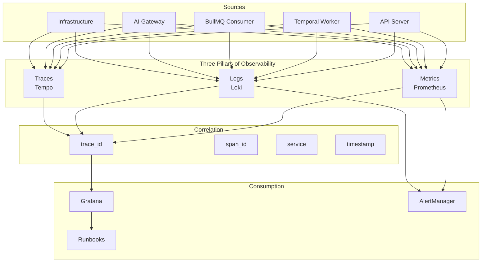
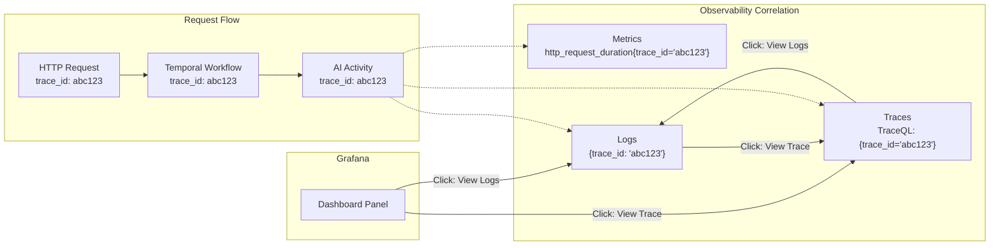
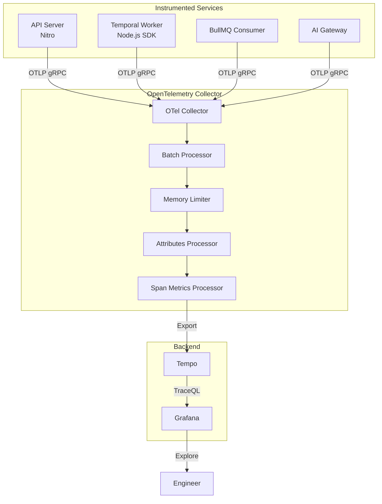
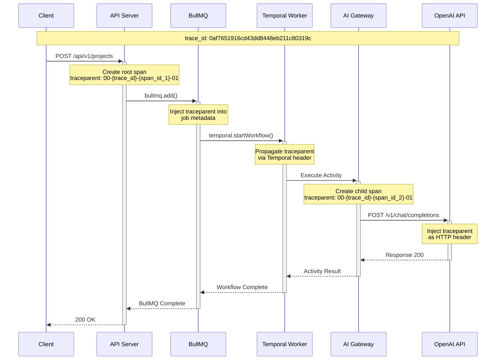
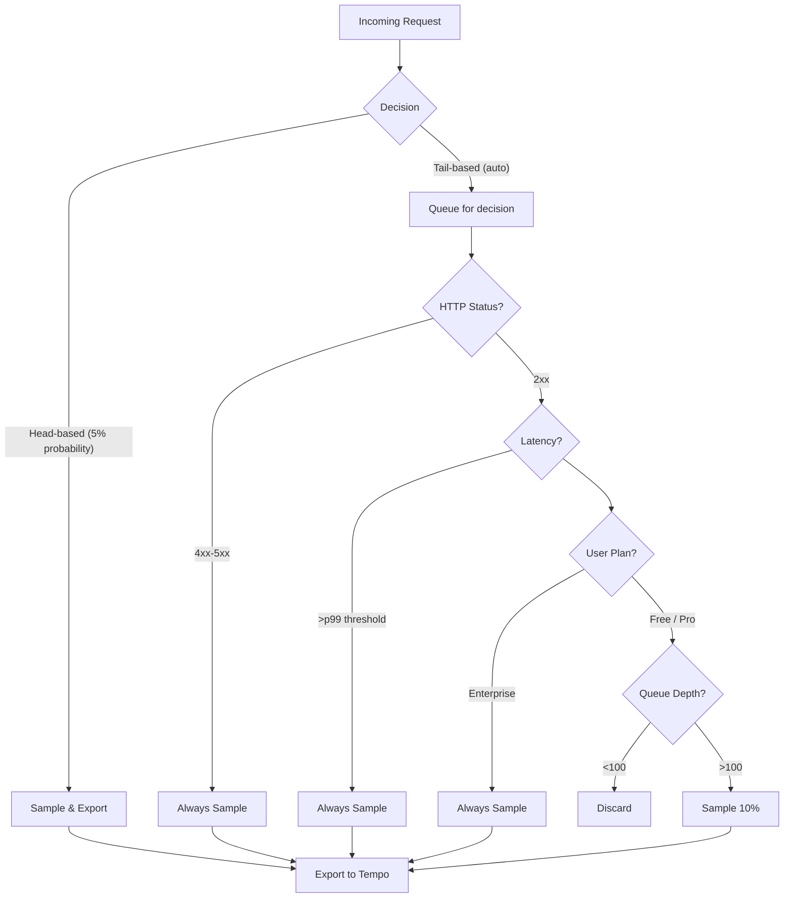
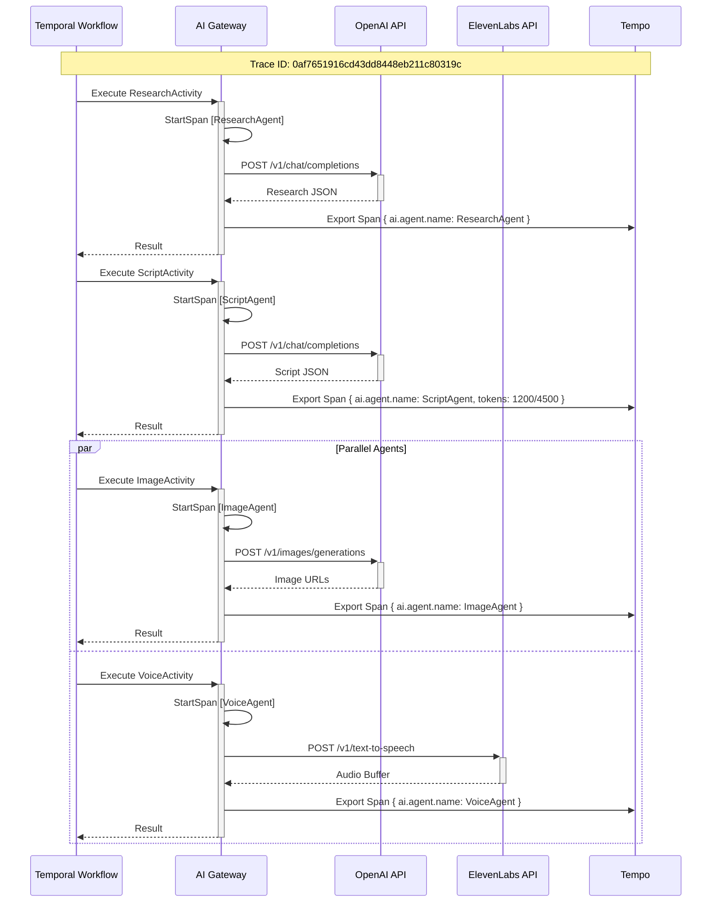
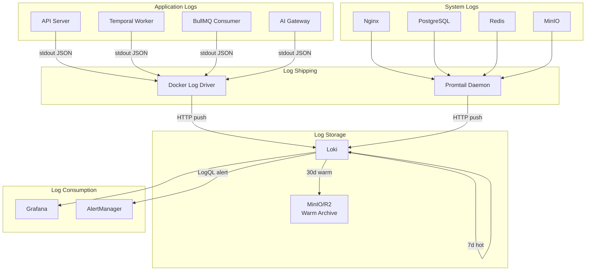
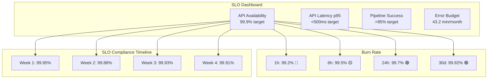
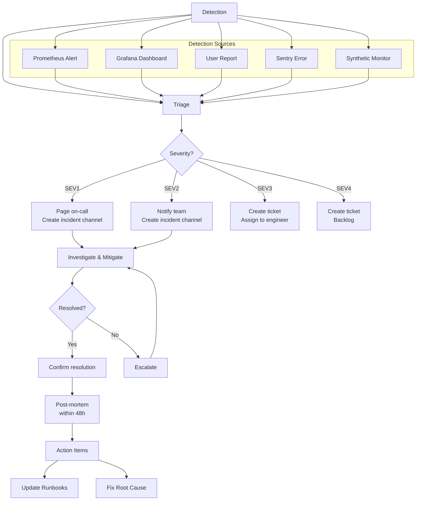
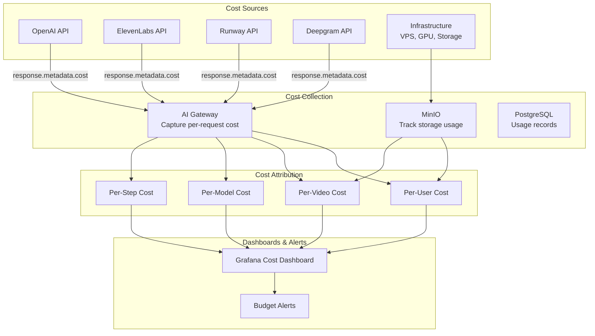

# Observability & Logging — Vidara AI

> **Project:** Vidara AI — AI YouTube Video Generator SaaS  
> **Author:** Platform Engineering Team  
> **Last Updated:** 2026-06-26  
> **Status:** Approved  
> **Cross-Reference:** [Monitoring](monitoring.md) · [Architecture](architecture.md) · [Deployment](deployment.md) · [DevOps](devops.md) · [Cost Estimation](cost-estimation.md) · [Workflow](workflow.md) · [Tech Stack](techstack.md)

---

## 1. Tujuan

Dokumen ini mendefinisikan observability dan logging strategy untuk Vidara AI. Mencakup three pillars of observability (metrics, logs, traces), distributed tracing dengan OpenTelemetry, structured logging dengan Loki, health checks, Service Level Objectives (SLOs), incident response, dan cost observability. Bertujuan memberikan visibilitas end-to-end terhadap sistem untuk seluruh stakeholder.

---

## 2. Background

Vidara AI adalah sistem terdistribusi dengan 6+ services (API Server, Temporal Worker, BullMQ Consumer, AI Gateway, PostgreSQL, Redis, MinIO) dan 15+ AI agent types yang berkomunikasi secara synchronous dan asynchronous. Pipeline video generation bisa memakan waktu 10-30 menit dengan 20 langkah sequential dan parallel. Tanpa observability yang kuat, debugging failure menjadi sangat sulit, cost API tidak terkontrol, dan SLOs tidak terukur.

---

## 3. Objective

1. Menerapkan three pillars of observability: Metrics, Logs, Traces secara terintegrasi.
2. Mendefinisikan distributed tracing strategy dengan OpenTelemetry untuk seluruh service.
3. Menetapkan structured logging standard dengan format JSON dan konteks yang kaya.
4. Mendefinisikan health check endpoints untuk setiap service dan dependency.
5. Menetapkan Service Level Objectives (SLOs) dengan error budget tracking.
6. Mendefinisikan incident response process dengan severity levels dan escalation matrix.
7. Menerapkan cost observability untuk tracking API spend per-user, per-model, dan per-video.

---

## 4. Scope

**In Scope:**
- Three pillars of observability: Metrics, Logs, Traces
- Distributed tracing: OpenTelemetry, W3C Trace Context, sampling strategy
- Temporal workflow tracing and AI agent call tracing
- Structured logging format, levels, per-service configuration
- Sensitive data redaction (PII, API keys, tokens)
- Log retention policy (7 days hot, 30 days warm, 90 days cold)
- Loki configuration: label strategy, query optimization
- Health checks: /health, /ready, /live + dependency checks
- SLOs: API Availability (99.9%), Latency (p95 <500ms), Pipeline Success Rate (>95%)
- Incident response: SEV1-SEV4, response times, escalation matrix, post-mortem
- Cost observability: per-user, per-model, per-video cost tracking

**Out of Scope:**
- Business intelligence dashboards (Looker, Metabase)
- User behavior analytics (Amplitude, Mixpanel)
- Network observability (SNMP, netflow)
- Third-party SIEM integration

---

## 5. Stakeholder

| Stakeholder | Interest |
|---|---|
| CTO | SLO compliance, error budget, cost trends |
| DevOps Engineer | System health, tracing, log analysis, incident response |
| AI Engineer | Agent tracing, model performance, pipeline debugging |
| Backend Engineer | API tracing, error debugging, performance optimization |
| QA Engineer | Synthetic monitoring, health check validation |
| Security Officer | Audit logs, PII redaction, compliance |
| Finance Team | Cost per-user, per-video, budget alerts |

---

## 6. Three Pillars of Observability

### Overview



### Pillar Definitions

| Pillar | Tool | Data | Retention | Query Language | Use Case |
|---|---|---|---|---|---|
| **Metrics** | Prometheus | Numeric time-series | 30 days (downsampled to 90) | PromQL | Alerting, dashboards, SLO tracking |
| **Logs** | Loki | Structured JSON lines | 7d hot, 30d warm, 90d cold | LogQL | Debugging, audit, incident analysis |
| **Traces** | Tempo | Distributed trace spans | 30 days | TraceQL | Pipeline performance, dependency analysis |

### Correlation Strategy

Setiap pillar dihubungkan melalui `trace_id` yang sama:



---

## 7. Distributed Tracing — Overview & Architecture

### Architecture Diagram



### OpenTelemetry Collector Configuration

```yaml
# otel-collector-config.yaml
receivers:
  otlp:
    protocols:
      grpc:
        endpoint: 0.0.0.0:4317
      http:
        endpoint: 0.0.0.0:4318

processors:
  batch:
    timeout: 1s
    send_batch_size: 1024
  memory_limiter:
    check_interval: 1s
    limit_mib: 512
  attributes:
    actions:
      - key: environment
        value: production
        action: insert
      - key: datacenter
        value: dc1
        action: insert
  spanmetrics:
    metrics_exporter: prometheus
    latency_histogram_buckets: [10ms, 50ms, 100ms, 250ms, 500ms, 1s, 2.5s, 5s, 10s]
    dimensions:
      - name: service
      - name: span_kind
      - name: status_code

exporters:
  otlp:
    endpoint: tempo:4317
    tls:
      insecure: true
  prometheus:
    endpoint: 0.0.0.0:8889
  logging:
    loglevel: debug

service:
  pipelines:
    traces:
      receivers: [otlp]
      processors: [memory_limiter, batch, attributes]
      exporters: [otlp, logging]
    metrics:
      receivers: [otlp]
      processors: [batch]
      exporters: [prometheus]
```

### Trace Context Cardinality

| Context | Label | High Cardinality? | Used In |
|---|---|---|---|
| `trace_id` | Unique trace identifier | Yes | All pillars |
| `span_id` | Unique span identifier | Yes | Traces only |
| `service.name` | Service name | No (5 values) | All pillars |
| `service.version` | Git commit SHA | Medium | Traces, Logs |
| `environment` | dev/staging/prod | No | All pillars |
| `user.id` | Authenticated user | Yes (use with caution) | Logs, Traces (sampled) |
| `pipeline.id` | Video pipeline ID | Yes | Traces, Logs |
| `ai.provider` | AI provider name | No | Traces, Metrics |

---

## 8. Distributed Tracing — Span Attributes Per Service

### API Server (Nitro)

```typescript
// TypeScript — OpenTelemetry span attributes for API Server
const activeSpan = trace.getActiveSpan();
if (activeSpan) {
  activeSpan.setAttributes({
    'http.method': request.method,
    'http.url': request.url,
    'http.target': request.pathname,
    'http.host': request.headers.host,
    'http.scheme': request.protocol,
    'http.status_code': response.statusCode,
    'http.request_content_length': parseInt(request.headers['content-length'] || '0'),
    'http.response_content_length': responseHeaders['content-length'],
    'http.user_agent': request.headers['user-agent']?.substring(0, 128),
    'user.id': authUser?.id || 'anonymous',
    'user.plan': authUser?.plan || 'free',
    'user.tier': authUser?.tier || 'standard',
    'request.id': requestId,
    'pipeline.id': pipelineId || '',
    'api.endpoint': endpointName,
    'api.version': 'v1'
  });
}
```

| Attribute | Type | Description | PII? |
|---|---|---|---|
| `http.method` | string | GET, POST, PUT, DELETE, PATCH | No |
| `http.url` | string | Full request URL | No |
| `http.target` | string | URL path only | No |
| `http.status_code` | int | HTTP response status | No |
| `user.id` | string | UUID of authenticated user | Debatable |
| `user.plan` | string | Subscription plan name | No |
| `pipeline.id` | string | Video pipeline UUID | No |
| `request.id` | string | Internal request tracking ID | No |
| `api.endpoint` | string | API endpoint identifier | No |

### Temporal Worker

```typescript
// TypeScript — OpenTelemetry span attributes for Temporal Worker
const span = trace.getActiveSpan();
if (span) {
  span.setAttributes({
    'temporal.workflow.type': 'VideoPipelineWorkflow',
    'temporal.workflow.id': workflowId,
    'temporal.workflow.run_id': runId,
    'temporal.activity.type': activityType,
    'temporal.activity.id': activityId,
    'temporal.task_queue': taskQueue,
    'pipeline.step': currentStep,
    'pipeline.step_number': stepNumber,
    'pipeline.total_steps': 20,
    'pipeline.project_id': projectId,
    'pipeline.user_id': userId,
    'pipeline.attempt': attemptNumber,
    'pipeline.retry_count': retryCount,
    'ai.provider': providerName,
    'ai.model': modelName,
    'ai.request_id': aiRequestId,
    'ai.tokens.input': inputTokens,
    'ai.tokens.output': outputTokens,
    'ai.cost.usd': costUsd,
    'ai.circuit_breaker': circuitBreakerState,
    'render.codec': 'h264_nvenc',
    'render.resolution': resolution,
    'render.duration_seconds': videoDuration
  });
}
```

### BullMQ Consumer

| Attribute | Type | Description |
|---|---|---|
| `bullmq.queue` | string | Queue name (research, render, dll) |
| `bullmq.job.id` | string | BullMQ job identifier |
| `bullmq.job.attempts` | int | Current attempt number |
| `bullmq.job.max_attempts` | int | Maximum retry attempts |
| `bullmq.job.delay` | int | Job delay in ms |
| `bullmq.job.timestamp` | int | Job creation timestamp |

### AI Gateway

| Attribute | Type | Description |
|---|---|---|
| `ai.provider` | string | Provider name (openai, elevenlabs, runway, deepgram) |
| `ai.model` | string | Model name (gpt-5o, nova-2, gen-4) |
| `ai.endpoint` | string | API endpoint path |
| `ai.circuit_breaker.state` | string | closed, open, half-open |
| `ai.retry.attempt` | int | Current retry attempt |
| `ai.retry.max_attempts` | int | Maximum retries configured |
| `ai.timeout.ms` | int | Request timeout in milliseconds |
| `ai.fallback_used` | boolean | Whether fallback provider was used |
| `ai.cache_hit` | boolean | Whether response was served from cache |

---

## 9. Distributed Tracing — Trace Propagation (W3C Trace Context)

### Trace Context Headers

Vidara AI menggunakan W3C Trace Context standard untuk propagasi trace ID antar service:

| Header | Format | Example |
|---|---|---|
| `traceparent` | `00-<trace_id>-<span_id>-<flags>` | `00-0af7651916cd43dd8448eb211c80319c-b7ad6b7169203331-01` |
| `tracestate` | `<vendor>=<value>,<vendor>=<value>` | `vidara=env=prod,dc=dc1` |
| `baggage` | `<key>=<value>,<key>=<value>` | `user_id=usr_abc123,pipeline_id=pipe_def456` |

### Propagation Across Services



### Temporal Context Propagation

Temporal SDK secara otomatis mempropagasi OpenTelemetry context melalui workflow dan activity executions:

```
Workflow: VideoPipelineWorkflow
  ├─ Local: trace_id=0af7651916cd43dd8448eb211c80319c
  │           span_id=root_span_workflow
  │
  ├─ Activity: ResearchActivity
  │   └─ Remote: trace_id=0af7651916cd43dd8448eb211c80319c
  │               span_id=parent_span_research
  │               └─ Child Span: AI_Gateway.callOpenAI
  │                   └─ span_id=research_openai_call
  │
  ├─ Activity: ScriptActivity
  │   └─ Remote: trace_id=0af7651916cd43dd8448eb211c80319c
  │               span_id=parent_span_script
  │               └─ Child Span: AI_Gateway.callOpenAI
  │
  └─ Activity: RenderActivity
      └─ Remote: trace_id=0af7651916cd43dd8448eb211c80319c
                  span_id=parent_span_render
                  └─ Child Span: FFmpeg.render
```

### Baggage Propagation

W3C Baggage digunakan untuk membawa konteks user dan pipeline melalui seluruh trace:

| Baggage Key | Value | Used By |
|---|---|---|
| `user_id` | `usr_abc123` | All services (logging, cost attribution) |
| `pipeline_id` | `pipe_def456` | All services (pipeline tracking) |
| `user_plan` | `pro` | AI Gateway (priority routing) |
| `environment` | `production` | All services (context) |
| `region` | `ap-southeast` | Storage service (locality) |

---

## 10. Distributed Tracing — Sampling Strategy

### Sampling Decision Flow



### Sampling Configuration

| Sampler | Type | Rate | Condition | Cost Impact |
|---|---|---|---|---|
| **Probabilistic** (Head-based) | Deterministic | 5% | All requests | Low |
| **Error Sampler** (Tail-based) | Dynamic | 100% | status_code >= 400 | Low (errors are rare) |
| **Latency Sampler** (Tail-based) | Dynamic | 100% | duration > p99 | Medium |
| **Enterprise Sampler** (Head-based) | Deterministic | 100% | user.plan == "enterprise" | High (but few users) |
| **Critical Path Sampler** (Head-based) | Deterministic | 100% | pipeline.step == "render" | Medium (GPU troubleshooting) |

### Implementation

```typescript
// TypeScript — OpenTelemetry sampling configuration
import { Sampler, SamplingResult, SpanKind, Attributes } from '@opentelemetry/api';
import { ProbabilitySampler } from '@opentelemetry/sdk-trace-base';

class VidaraSampler implements Sampler {
  private probabilisticSampler = new ProbabilitySampler(0.05);

  shouldSample(context: any, traceId: string, spanName: string, spanKind: SpanKind, attributes: Attributes): SamplingResult {
    // Always sample errors
    if (attributes['http.status_code'] >= 400 || attributes['error']) {
      return { decision: 1 }; // RECORD_AND_SAMPLE
    }

    // Always sample enterprise users
    if (attributes['user.plan'] === 'enterprise') {
      return { decision: 1 };
    }

    // Always sample render pipeline (GPU troubleshooting)
    if (attributes['pipeline.step'] === 'render' || spanName.includes('Render')) {
      return { decision: 1 };
    }

    // Always sample slow requests
    if (attributes['http.request_content_length'] > 1_000_000) {
      return { decision: 1 };
    }

    // Probabilistic sampling for everything else
    return this.probabilisticSampler.shouldSample(context, traceId, spanName, spanKind, attributes);
  }

  toString(): string {
    return 'VidaraSampler';
  }
}
```

### Estimated Trace Volume

| Traffic Tier | Request Rate | Sample Rate | Daily Traces | Tempo Storage (30d) |
|---|---|---|---|---|
| API requests | 10 req/s | 5% + errors | ~45,000 | ~45 GB |
| Temporal activities | 50 / pipeline | 5% + errors | ~225,000 | ~225 GB |
| AI API calls | 10 req/s | 100% (errors) | ~5,000 | ~5 GB |
| Render pipeline | 0.5 / min | 100% | ~720 | ~3 GB |
| **Total** | — | — | **~275,720/day** | **~278 GB/month** |

---

## 11. Distributed Tracing — Temporal Workflow Tracing

### Workflow Trace Hierarchy

```
Trace: VideoPipelineWorkflow (trace_id = pipeline_id)
  Duration: ~900 seconds (15 min)
  Status: completed
  
  ├── Span: WorkflowExecution
  │   ├── Span: ResearchActivity
  │   │   ├── Span: HTTP POST openai.com/v1/chat/completions
  │   │   │   ├── Attributes: provider=openai, model=gpt-5o, tokens=1200/4500
  │   │   │   └── Status: OK (duration: 45s)
  │   │   └── Span: DB UPDATE projects SET script
  │   │       └── Status: OK (duration: 0.05s)
  │   │
  │   ├── Span: FactCheckActivity
  │   │   └── Span: HTTP POST openai.com/v1/chat/completions
  │   │       └── Status: OK (duration: 22s)
  │   │
  │   ├── Span: ScriptActivity
  │   │   └── Span: HTTP POST openai.com/v1/chat/completions
  │   │       └── Status: OK (duration: 38s)
  │   │
  │   ├── Span: Parallel [CharacterDesign, Background, ImageGen]
  │   │   ├── Span: CharacterDesignActivity (duration: 12s)
  │   │   ├── Span: BackgroundActivity (duration: 15s)
  │   │   └── Span: ImageGenActivity (duration: 28s)
  │   │       └── Span: HTTP POST runway.com/v1/generate
  │   │           └── Status: OK (duration: 25s)
  │   │
  │   ├── Span: VoiceActivity
  │   │   └── Span: HTTP POST elevenlabs.com/v1/tts
  │   │       └── Status: OK (duration: 18s)
  │   │
  │   ├── Span: SubtitleActivity
  │   │   └── Span: HTTP POST deepgram.com/v1/listen
  │   │       └── Status: OK (duration: 8s)
  │   │
  │   ├── Span: RenderActivity
  │   │   └── Span: FFmpeg execute (h264_nvenc)
  │   │       ├── Attributes: codec=h264_nvenc, resolution=1080p, duration=300s
  │   │       ├── Span: Read audio from MinIO (duration: 0.5s)
  │   │       ├── Span: Read footage from MinIO (duration: 2.1s)
  │   │       ├── Span: FFmpeg filter complex build (duration: 0.3s)
  │   │       ├── Span: Encode video (duration: 45s) ← GPU-bound
  │   │       └── Span: Write final to MinIO (duration: 3.2s)
  │   │
  │   ├── Span: PublishActivity (if auto_publish)
  │   │   └── Span: HTTP POST youtube.com/upload
  │   │       └── Status: OK (duration: 120s)
  │   │
  │   └── Span: AnalyticsActivity
  │       └── Span: HTTP GET youtube.com/analytics
  │           └── Status: OK (duration: 5s)
  │
  └── Span: WorkflowCompletion
```

### Temporal Specific Features

| Feature | Implementation | Benefit |
|---|---|---|
| **Automatic Context** | Temporal OpenTelemetry SDK plugin | No manual instrumentation for workflow/activity |
| **Heartbeat Tracing** | Span per heartbeat interval | Detect stuck activities (e.g., FFmpeg hang) |
| **Stack Trace Capture** | Temporal SDK captures stack on error | Instant root cause without log spelunking |
| **Replay Detection** | Flag traces from replay vs first execution | Distinguish real failures from replay noise |
| **Activity Retry Trace** | Span per retry attempt with backoff | Visualize retry patterns and total time lost |

---

## 12. Distributed Tracing — AI Agent Call Tracing

### Agent Invocation Span

Setiap AI agent invocation direkam sebagai span terstruktur:

```json
{
  "name": "ScriptAgent.generate",
  "trace_id": "0af7651916cd43dd8448eb211c80319c",
  "span_id": "a1b2c3d4e5f6a7b8",
  "parent_span_id": "root_1234567890abcdef",
  "start_time": "2026-06-26T12:00:00.000Z",
  "end_time": "2026-06-26T12:00:45.200Z",
  "status": "ok",
  "attributes": {
    "ai.agent.name": "ScriptAgent",
    "ai.agent.step": 4,
    "ai.agent.step_name": "script",
    "ai.agent.input_hash": "sha256:a1b2c3d4e5f6...",
    "ai.agent.output_hash": "sha256:f6e5d4c3b2a1...",
    "ai.agent.duration_ms": 45200,
    "ai.agent.retry_count": 0,
    "ai.agent.status": "success",
    "ai.agent.cost_usd": 0.042,
    "ai.agent.model": "gpt-5o",
    "ai.agent.provider": "openai",
    "ai.agent.fallback": false,
    "ai.agent.cache_hit": false,
    "ai.agent.tokens_input": 1200,
    "ai.agent.tokens_output": 4500,
    "ai.agent.quality_score": 0.92
  },
  "events": [
    {
      "name": "agent.started",
      "timestamp": "2026-06-26T12:00:00.000Z",
      "attributes": {
        "input_truncated": true,
        "prompt_template": "script_generation_v3"
      }
    },
    {
      "name": "agent.completed",
      "timestamp": "2026-06-26T12:00:45.200Z",
      "attributes": {
        "output_truncated": true,
        "validation_passed": true
      }
    }
  ]
}
```

### Agent Call Sequence



### Agent Cost Annotation

Span attributes untuk cost tracking memungkinkan korelasi langsung antara trace dan biaya:

```promql
# PromQL — Cost per agent from span metrics
sum by (ai_agent_name) (
  rate(ai_agent_cost_usd_total[7d])
)
```

```logql
# LogQL — Find expensive agent invocations
{service="temporal-worker"} 
  | json 
  | ai_agent_cost_usd > 0.10 
  | trace_id = "0af7651916cd43dd8448eb211c80319c"
```

---

## 13. Structured Logging — Overview

### Logging Architecture



### Log Generation Standard

Setiap service menghasilkan log dalam format JSON dengan field wajib berikut:

| Field | Type | Required | Description |
|---|---|---|---|
| `timestamp` | ISO8601 | Yes | Event time with timezone |
| `level` | string | Yes | debug, info, warn, error, fatal |
| `service` | string | Yes | Service name |
| `message` | string | Yes | Human-readable description |
| `trace_id` | string | Yes | OpenTelemetry trace ID |
| `span_id` | string | Yes | OpenTelemetry span ID |
| `user_id` | string | No | Authenticated user UUID |
| `request_id` | string | No | HTTP request tracking ID |
| `pipeline_id` | string | No | Video pipeline execution ID |
| `duration_ms` | int | No | Operation duration in ms |
| `error` | object | No | Error details (message, stack, code) |
| `metadata` | object | No | Additional context |

---

## 14. Structured Logging — Log Format & Levels

### Canonical Log Format

```json
{
  "timestamp": "2026-06-26T12:00:00.000Z",
  "level": "info",
  "service": "temporal-worker",
  "version": "1.2.3",
  "environment": "production",
  "trace_id": "00-0af7651916cd43dd8448eb211c80319c-b7ad6b7169203331-01",
  "span_id": "b7ad6b7169203331",
  "user_id": "usr_abc123",
  "request_id": "req_xyz789",
  "pipeline_id": "pipe_def456",
  "project_id": "prj_789012",
  "message": "Script generation completed",
  "duration_ms": 45200,
  "metadata": {
    "agent": "ScriptAgent",
    "step": 4,
    "step_name": "script",
    "tokens_in": 1200,
    "tokens_out": 4500,
    "model": "gpt-5o",
    "provider": "openai",
    "cost_usd": 0.042,
    "retry_count": 0,
    "cache_hit": false
  },
  "error": null
}
```

### Error Log Format

```json
{
  "timestamp": "2026-06-26T12:05:00.000Z",
  "level": "error",
  "service": "ai-gateway",
  "trace_id": "00-0af7651916cd43dd8448eb211c80319c-c8d9e0f1a2b3c4d5-01",
  "span_id": "c8d9e0f1a2b3c4d5",
  "user_id": "usr_abc123",
  "pipeline_id": "pipe_def456",
  "message": "AI provider request failed after retries",
  "duration_ms": 60030,
  "metadata": {
    "agent": "ScriptAgent",
    "provider": "openai",
    "model": "gpt-5o",
    "endpoint": "/v1/chat/completions",
    "retry_count": 3,
    "max_retries": 3,
    "circuit_breaker_state": "open",
    "fallback_used": false
  },
  "error": {
    "code": "TIMEOUT",
    "message": "Request timed out after 30s",
    "stack": "Error: Request timed out\n    at AIGateway.call (.../ai-gateway/index.ts:142)\n    at processTicksAndRejections (node:internal/process/task_queues:95)",
    "original_error": {
      "code": "ETIMEDOUT",
      "syscall": "connect",
      "address": "api.openai.com",
      "port": 443
    }
  }
}
```

### Log Level Definitions

| Level | Value | Description | Use Case |
|---|---|---|---|
| `fatal` | 60 | Service cannot continue | Unrecoverable error, process exit |
| `error` | 50 | Operation failed | API errors, provider failures, data corruption |
| `warn` | 40 | Something unexpected | Retry attempts, circuit breaker open, rate limit approaching |
| `info` | 30 | Normal operation | Pipeline progress, API calls, business events |
| `debug` | 20 | Detailed diagnostic | Function entry/exit, variable values, SQL queries |
| `trace` | 10 | Finest granularity | HTTP headers, raw AI responses, event loop |

### Log Level by Environment

| Environment | Default Level | Debug Path | Audit Path |
|---|---|---|---|
| Production | `info` | `debug` per trace_id flag | `audit` (auth, billing, admin) |
| Staging | `debug` | All traces sampled | `audit` |
| Development | `trace` | Everything | `audit` |

---

## 15. Structured Logging — Per-Service Log Configuration

### Service Configuration Matrix

| Service | Logger Library | Default Level | Output | Additional Handlers |
|---|---|---|---|---|
| API Server (Nitro) | `pino` | `info` | stdout | File rotation (audit.log) |
| Temporal Worker | `pino` | `info` | stdout | — |
| BullMQ Consumer | `pino` | `warn` | stdout | — |
| AI Gateway | `pino` | `info` | stdout | Structured error file |
| Nginx | — | `warn` | access.log, error.log | Promtail tail |
| PostgreSQL | — | `warn` | postgresql.log | Promtail tail |
| Redis | — | `warn` | redis.log | Promtail tail |
| MinIO | — | `info` | minio.log | Promtail tail |

### Node.js Service Log Configuration

```typescript
// packages/shared/logger.ts — Pino logger configuration
import pino from 'pino';

const level = process.env.LOG_LEVEL || 'info';

export const logger = pino({
  level,
  timestamp: pino.stdTimeFunctions.isoTime,
  formatters: {
    level(label: string) {
      return { level: label };
    },
    bindings(bindings: pino.Bindings) {
      return {
        service: bindings.name,
        environment: process.env.ENVIRONMENT || 'development',
        host: bindings.hostname,
        pid: bindings.pid
      };
    }
  },
  serializers: {
    req: pino.stdSerializers.req,
    res: pino.stdSerializers.res,
    err: pino.stdSerializers.err
  },
  redact: {
    paths: [
      'req.headers.authorization',
      'req.headers.cookie',
      'req.headers["x-api-key"]',
      'metadata.api_key',
      'error.stack',
      'user.email',
      'user.password',
      'req.body?.password',
      'req.body?.api_key',
      'req.body?.token'
    ],
    censor: '[REDACTED]'
  },
  transport: {
    target: 'pino-loki',
    options: {
      host: process.env.LOKI_HOST || 'http://loki:3100',
      labels: {
        service: process.env.SERVICE_NAME || 'unknown',
        environment: process.env.ENVIRONMENT || 'development'
      }
    }
  }
});
```

### Per-Service Log Level Override

```typescript
// API Server — Dynamic log level based on trace_id header
app.use((req, res, next) => {
  const debugHeader = req.headers['x-debug'];
  if (debugHeader === 'true' || debugHeader === req.headers['x-request-id']) {
    logger.level = 'debug';
    res.on('finish', () => {
      logger.level = originalLevel;  // Reset after request
    });
  }
  next();
});
```

```typescript
// Temporal Worker — Dynamic log level per pipeline
Workflow.executeActivity(async () => {
  if (workflowInfo.workflowId.includes('debug-')) {
    logger.setLevel('debug');
  }
  // ... activity logic ...
});
```

---

## 16. Structured Logging — Sensitive Data Redaction

### Redaction Rules

| Category | Pattern | Redaction | Example |
|---|---|---|---|
| **API Keys** | `sk-*`, `pk-*`, `x-api-key` header | `[REDACTED_API_KEY]` | `sk-proj-...` → `[REDACTED_API_KEY]` |
| **JWT Tokens** | `Bearer eyJ*` | `[REDACTED_JWT]` | `Bearer eyJhbGci...` → `[REDACTED_JWT]` |
| **Passwords** | `password`, `password_hash` field | `[REDACTED]` | `"password": "secret123"` → `[REDACTED]` |
| **Email** | `user@example.com` | `[REDACTED_EMAIL]` | `"email": "user@example.com"` → `[REDACTED_EMAIL]` |
| **Phone** | `\+62[0-9]+` | `[REDACTED_PHONE]` | `+628123456789` → `[REDACTED_PHONE]` |
| **IP Address** | Full IP | `x.x.x.x` | `192.168.1.1` → `x.x.x.x` or `[REDACTED_IP]` |
| **Credit Card** | `[0-9]{16}` | `[REDACTED_CC]` | `4111111111111111` → `[REDACTED_CC]` |
| **OAuth Tokens** | `ya29.*`, `ghp_*` | `[REDACTED_OAUTH]` | `ya29.a0AfH6S...` → `[REDACTED_OAUTH]` |
| **Stripe Keys** | `sk_live_*`, `pk_live_*`, `whsec_*` | `[REDACTED_STRIPE]` | `sk_live_...` → `[REDACTED_STRIPE]` |
| **YouTube Token** | OAuth 2.0 refresh token | `[REDACTED_YT_TOKEN]` | User YouTube auth → `[REDACTED_YT_TOKEN]` |

### PII Fields That Must Never Be Logged

| Field | Source | Risk Level |
|---|---|---|
| Raw password | Auth requests | Critical |
| Full credit card number | Billing | Critical |
| CVV/CVC | Billing | Critical |
| OAuth refresh tokens | YouTube auth | Critical |
| API secret keys | Config/env | Critical |
| Full legal name | User profile | High |
| Exact date of birth | User profile | High |
| Government ID (KTP/SIM) | Verification | Critical |
| Health data | Any | Critical |
| Location coordinates | Any | Medium |

### Redaction Implementation

```typescript
// packages/shared/redact.ts — Pino redaction paths
const redactionPaths = [
  // Auth & Security
  'req.headers.authorization',
  'req.headers.cookie',
  'req.headers["x-api-key"]',
  'req.headers["x-stripe-signature"]',
  'req.body.password',
  'req.body.password_confirmation',
  'req.body.current_password',
  'req.body.api_key',
  'req.body.secret_key',
  'req.body.stripe_token',
  'req.body.card_number',
  'req.body.cvv',
  'req.body.ssn',
  'req.body.tax_id',

  // User PII
  'user.password_hash',
  'user.email',        // Log email domain only
  'user.phone',
  'user.address',
  'user.full_name',
  'user.date_of_birth',
  'user.id_number',
  'user.ip_address',

  // External Service Credentials
  'metadata.openai_api_key',
  'metadata.elevenlabs_api_key',
  'metadata.runway_api_key',
  'metadata.deepgram_api_key',
  'metadata.youtube_refresh_token',
  'metadata.youtube_access_token',

  // Error Details
  'error.stack',       // Full stack trace (may contain env variables)
  'error.config.headers.Authorization',
  'error.config.data.password'
];

// Custom serializers for critical fields
const emailSerializer = (value: string) => {
  if (!value) return value;
  const [local, domain] = value.split('@');
  return `${local[0]}***@${domain}`;
};
```

### Audit Logging

Untuk kebutuhan compliance (UU PDP, PCI DSS), audit log mencatat siapa mengakses data apa dan kapan:

```json
{
  "timestamp": "2026-06-26T12:00:00.000Z",
  "level": "audit",
  "service": "api-server",
  "audit": {
    "action": "project.view",
    "actor": {
      "user_id": "usr_abc123",
      "role": "admin",
      "ip": "x.x.x.x"
    },
    "resource": {
      "type": "project",
      "id": "prj_789012",
      "owner_id": "usr_def456"
    },
    "context": {
      "reason": "support_ticket_12345",
      "user_consent": true
    }
  }
}
```

---

## 17. Structured Logging — Retention Policy & Loki Configuration

### Log Retention Policy

| Tier | Storage | Duration | Sampling | Access | Cost/Month |
|---|---|---|---|---|---|
| **Hot** | Local SSD (Loki ingester) | 7 days | Full (no sampling) | Real-time LogQL | $30 |
| **Warm** | MinIO bucket `loki-warm` | 30 days | Full | LogQL (slower) | $10 |
| **Cold** | Cloudflare R2 `loki-cold` | 90 days | 1:10 for debug, full for errors | Manual restore | $5 |
| **Archive** | R2 Glacier | 1 year | Errors + aggregated | On-demand | $2 |
| **Compliance** | R2 + WAL | 5 years | Audit logs only | On-demand | $15 |

### Label Strategy

```yaml
# promtail-config.yaml — Loki label configuration
scrape_configs:
  - job_name: docker-logs
    docker_sd_configs:
      - host: unix:///var/run/docker.sock
        refresh_interval: 5s
    relabel_configs:
      - source_labels: ['__meta_docker_container_name']
        regex: '/(.*)'
        target_label: 'service'
      - source_labels: ['__meta_docker_container_label_com_docker_compose_project']
        target_label: 'compose_project'
      - source_labels: ['__meta_docker_container_label_com_docker_compose_service']
        target_label: 'compose_service'
      - action: replace
        source_labels: ['__meta_docker_container_label_log_level']
        target_label: 'level'
      - source_labels: ['__meta_docker_container_label_environment']
        target_label: 'environment'
      - source_labels: ['__meta_docker_container_id']
        target_label: 'container_id'

  - job_name: nginx
    static_configs:
      - targets: ['localhost']
        labels:
          service: nginx
          __path__: /var/log/nginx/*.log
    pipeline_stages:
      - regex:
          expression: '(?P<remote_addr>\S+) (?P<remote_user>\S+) \[(?P<time_local>[^\]]+)\] "(?P<request_method>\S+) (?P<request_uri>\S+) \S+" (?P<status>\d{3}) (?P<body_bytes_sent>\d+)'
      - labels:
          status:
      - metrics:
          nginx_http_requests_total:
            type: Counter
            description: Total nginx requests
            prefix: nginx_
            max_idle_duration: 24h
            config:
              action: inc

  - job_name: postgresql
    static_configs:
      - targets: ['localhost']
        labels:
          service: postgresql
          __path__: /var/log/postgresql/*.log
```

### Query Optimization

| Pattern | Optimization | Example |
|---|---|---|
| **Use structured metadata** | Prefer `\| json` over regex | `{service="api"} \| json \| level="error"` |
| **Limit label cardinality** | Max 5 label matchers per query | `{service="worker", level="error"}` |
| **Time range bounds** | Always specify min time | `{service="api"} \| json \| level="error" [1h]` |
| **Avoid `\|~` regex** | Use exact `=` or `\|=` contains | `\|= "pipeline.completed"` instead of `\|~ "pipeline\.(completed\|failed)"` |
| **Chunk filtering** | Filter early, aggregate late | Filter by `trace_id` before parsing JSON |
| **Sampling in queries** | Use `rate()` for trends, not `count_over_time()` | `rate({service="api"} \| json \| level="error" [5m])` |

### Example LogQL Queries

```logql
# Find all logs for a specific trace
{trace_id="00-0af7651916cd43dd8448eb211c80319c"} | json

# Error rate by service (last 1 hour)
rate({level="error"} | json [1h]) by (service)

# Pipeline failure rate by step
sum by (pipeline_step) (
  rate({service="temporal-worker", level="error"} 
    | json 
    | status="failed" [1h])
)

# Top 5 users by cost (last 24h)
topk(5,
  sum by (user_id) (
    {service="ai-gateway"} 
    | json 
    | metadata.cost_usd > 0 [24h]
  )
)

# Slowest AI provider calls (p99)
quantile_over_time(0.99,
  {service="ai-gateway"} 
    | json 
    | duration_ms > 0 [1h]
) by (provider, model)

# Find pipeline stuck in render for >30 min
{service="temporal-worker"} 
  | json 
  | pipeline_step = "render" 
  | pipeline.start_time < now() - 30m
```

---

## 18. Health Checks

### Endpoints

| Endpoint | Type | Purpose | Interval | Timeout |
|---|---|---|---|---|
| `GET /health` | Basic | Service is alive and accepting connections | 10s | 3s |
| `GET /ready` | Readiness | Service is ready to serve traffic | 15s | 5s |
| `GET /live` | Liveness | Service is healthy (no restart needed) | 30s | 5s |

### Health Check Response Format

```json
{
  "status": "ok",
  "version": "1.2.3",
  "uptime_seconds": 86400,
  "checks": {
    "database": {
      "status": "ok",
      "latency_ms": 2,
      "last_error": null
    },
    "redis": {
      "status": "ok",
      "latency_ms": 1,
      "last_error": null
    },
    "minio": {
      "status": "ok",
      "latency_ms": 5,
      "last_error": null
    },
    "ai_openai": {
      "status": "degraded",
      "latency_ms": 1200,
      "last_error": "High latency (1200ms > 500ms threshold)",
      "circuit_breaker": "half-open"
    },
    "ai_elevenlabs": {
      "status": "ok",
      "latency_ms": 300,
      "last_error": null
    },
    "ai_runway": {
      "status": "ok",
      "latency_ms": 450,
      "last_error": null
    },
    "ai_deepgram": {
      "status": "ok",
      "latency_ms": 200,
      "last_error": null
    },
    "bullmq": {
      "status": "ok",
      "queue_depth": 15,
      "dlq_count": 0,
      "last_error": null
    },
    "temporal": {
      "status": "ok",
      "latency_ms": 10,
      "last_error": null
    }
  },
  "timestamp": "2026-06-26T12:00:00Z"
}
```

### Health Check Implementation

```typescript
// server/health.ts — Health check endpoint implementation
import { defineEventHandler } from 'h3';
import { sql } from '@vercel/postgres';
import { createClient } from 'redis';
import { Client as MinioClient } from 'minio';
import { Connection as TemporalClient } from '@temporalio/client';

export default defineEventHandler(async (event) => {
  const checks = {};
  let overallStatus = 'ok';

  // Database check
  try {
    const start = Date.now();
    await sql`SELECT 1`;
    checks.database = { status: 'ok', latency_ms: Date.now() - start };
  } catch (err) {
    checks.database = { status: 'error', latency_ms: 0, error: err.message };
    overallStatus = 'degraded';
  }

  // Redis check
  try {
    const redis = createClient({ url: process.env.REDIS_URL });
    await redis.connect();
    const start = Date.now();
    await redis.ping();
    checks.redis = { status: 'ok', latency_ms: Date.now() - start };
    await redis.disconnect();
  } catch (err) {
    checks.redis = { status: 'error', latency_ms: 0, error: err.message };
    overallStatus = 'degraded';
  }

  // MinIO check
  try {
    const minio = new MinioClient({
      endPoint: process.env.MINIO_ENDPOINT,
      port: parseInt(process.env.MINIO_PORT || '9000'),
      accessKey: process.env.MINIO_ACCESS_KEY,
      secretKey: process.env.MINIO_SECRET_KEY
    });
    const start = Date.now();
    await minio.listBuckets();
    checks.minio = { status: 'ok', latency_ms: Date.now() - start };
  } catch (err) {
    checks.minio = { status: 'error', latency_ms: 0, error: err.message };
    overallStatus = 'degraded';
  }

  // AI API checks (quick probe only — not full request)
  const aiProviders = [
    { name: 'ai_openai', url: 'https://api.openai.com/v1/models', key: process.env.OPENAI_API_KEY },
    { name: 'ai_elevenlabs', url: 'https://api.elevenlabs.io/v1/models', key: process.env.ELEVENLABS_API_KEY },
    { name: 'ai_runway', url: 'https://api.runwayml.com/v1/models', key: process.env.RUNWAY_API_KEY },
    { name: 'ai_deepgram', url: 'https://api.deepgram.com/v1/projects', key: process.env.DEEPGRAM_API_KEY }
  ];

  for (const provider of aiProviders) {
    try {
      const start = Date.now();
      const response = await fetch(provider.url, {
        headers: { Authorization: `Bearer ${provider.key}` },
        signal: AbortSignal.timeout(3000)
      });
      const latency = Date.now() - start;
      if (response.ok) {
        checks[provider.name] = {
          status: latency > 500 ? 'degraded' : 'ok',
          latency_ms: latency,
          last_error: latency > 500 ? `High latency (${latency}ms > 500ms threshold)` : null
        };
      } else {
        checks[provider.name] = { status: 'error', latency_ms: latency, error: `HTTP ${response.status}` };
      }
    } catch (err) {
      checks[provider.name] = { status: 'error', latency_ms: 0, error: err.message };
    }
  }

  // BullMQ check
  try {
    // Quick queue depth check via BullMQ
    checks.bullmq = { status: 'ok', queue_depth: 0, dlq_count: 0 };
  } catch (err) {
    checks.bullmq = { status: 'error', error: err.message };
  }

  // Temporal check
  try {
    const connection = await TemporalClient.connect({ address: process.env.TEMPORAL_ADDRESS });
    const start = Date.now();
    // Attempt to list namespaces as health probe
    checks.temporal = { status: 'ok', latency_ms: Date.now() - start };
    connection.close();
  } catch (err) {
    checks.temporal = { status: 'error', latency_ms: 0, error: err.message };
    overallStatus = 'degraded';
  }

  // Final response
  const health = {
    status: overallStatus,
    version: process.env.APP_VERSION || 'unknown',
    uptime_seconds: process.uptime(),
    checks,
    timestamp: new Date().toISOString()
  };

  // Return 503 if any critical dependency is down
  const criticalFailures = ['database', 'redis', 'minio', 'temporal']
    .filter(key => checks[key]?.status === 'error');

  setResponseStatus(event, criticalFailures.length > 0 ? 503 : 200);
  return health;
});
```

### Readiness Probe Checklist

| Check | Critical? | Action on Failure |
|---|---|---|
| Database connectivity | Yes | Remove from load balancer |
| Redis connectivity | Yes | Remove from load balancer |
| MinIO connectivity | Yes | Remove from load balancer |
| Temporal connectivity | Yes | Remove from load balancer |
| AI API (at least 1 available) | No | Allow degraded traffic |
| Disk space >10% free | No | Log warning |
| Memory <90% | No | Log warning |
| Connection pool <90% | No | Log warning |

### Liveness Probe Checklist

| Check | Critical? | Action on Failure |
|---|---|---|
| Process alive | Yes | Container restart |
| Event loop responsive | Yes | Container restart |
| No deadlock detected | Yes | Container restart |
| No excessive memory leak | No | Container restart if >95% |

---

## 19. Service Level Objectives

### SLO Definitions

| SLO | Target | Measurement | Window | Error Budget (monthly) |
|---|---|---|---|---|
| **API Availability** | 99.9% | Uptime of /health endpoint | 30 days rolling | 43 min downtime |
| **API Latency (p95)** | <500ms | HTTP request duration | 30 days rolling | N/A (performance goal) |
| **API Latency (p99)** | <2000ms | HTTP request duration | 30 days rolling | N/A (performance goal) |
| **Video Generation** | <30 min | Pipeline end-to-end duration | 30 days rolling | N/A (performance goal) |
| **Pipeline Success Rate** | >95% | Completed / Total pipelines | 30 days rolling | 1.5% failure budget |
| **AI Provider Availability** | 99.5% | Successful AI API calls | 30 days rolling | 3.6 hours downtime |
| **WebSocket Delivery** | 99.9% | Events delivered to clients | 30 days rolling | 43 min missed events |

### Error Budget Calculation

```typescript
// Error budget calculation example
const slo = {
  name: 'API Availability',
  target: 0.999,                    // 99.9%
  window: 30 * 24 * 60 * 60,       // 30 days in seconds
  totalBudget: 30 * 24 * 60 * 60 * (1 - 0.999),  // 2592 seconds = 43.2 minutes
  consumed: 0,
  remaining: 2592
};

// Monthly: 2,592,000 total seconds
// SLO: 99.9% → 0.1% error budget
// Error budget: 2,592,000 * 0.001 = 2,592 seconds = 43.2 minutes
// Remaining on day 15 if no incidents: 1,296 seconds = 21.6 minutes
```

### Burn Rate Alerting

| Burn Rate | Time to Exhaust Budget | Alert Severity | Example |
|---|---|---|---|
| 1x (slow burn) | 30 days | Warning | Slightly above target |
| 2x (moderate) | 15 days | Warning | Sustained degradation |
| 5x (fast burn) | 6 days | Critical | Major incident |
| 10x (critical) | 3 days | Critical | Severe outage |

```yaml
# Prometheus — Burn rate alerting rules
groups:
  - name: slo_burn_rate
    interval: 1m
    rules:
      - alert: SLOBurnRateFast
        expr: |
          (
            1 - (sum(rate(http_requests_total{status=~"5.."}[1h])) / sum(rate(http_requests_total[1h])))
          ) < 0.99  # 99% SLO for 1h window
        for: 5m
        labels:
          severity: critical
          slo: api_availability
        annotations:
          summary: 'API availability SLO burn rate critical'
          description: '1h availability is {{ $value | humanizePercentage }}, well below 99.9% target'

      - alert: SLOBurnRateSlow
        expr: |
          (
            1 - (sum(rate(http_requests_total{status=~"5.."}[1d])) / sum(rate(http_requests_total[1d])))
          ) < 0.995  # 99.5% SLO for 1d window
        for: 10m
        labels:
          severity: warning
          slo: api_availability
        annotations:
          summary: 'API availability SLO burn rate elevated'
          description: '24h availability is {{ $value | humanizePercentage }}, approaching 99.9% target'
```

### SLO Dashboard



---

## 20. Incident Response

### Severity Levels

| Level | Definition | Examples | Response Time | Escalation |
|---|---|---|---|---|
| **SEV1** | Critical outage affecting all users | API down, database corruption, zero video generation | 15 min | CTO + DevOps Lead |
| **SEV2** | Major feature degradation | AI provider outage, slow render, queue backlog | 30 min | DevOps Lead |
| **SEV3** | Partial degradation | One AI provider degraded, slow page load, non-critical error spike | 2 hours | On-call engineer |
| **SEV4** | Minor issue, no user impact | Cosmetic bug, low-severity warning, non-urgent improvement | 1 week | Assigned engineer |

### Incident Response Flow



### Escalation Matrix

| Time Elapsed | SEV1 | SEV2 | SEV3 |
|---|---|---|---|
| **0 min** | On-call Engineer | On-call Engineer | Assigned Engineer |
| **15 min** | DevOps Lead | — | — |
| **30 min** | CTO | DevOps Lead | — |
| **60 min** | CEO (if user-facing) | CTO | DevOps Lead |
| **4 hours** | — | Engineering VP | CTO |

### Post-Mortem Process

Setiap incident SEV1 atau SEV2 memerlukan post-mortem dalam 48 jam.

```markdown
# Post-Mortem Template

## Incident Summary
- **ID:** INC-2026-06-26-001
- **Title:** [Brief description]
- **Date:** YYYY-MM-DD
- **Duration:** HH:MM (detection → resolution)
- **Severity:** SEV1/SEV2
- **Services Affected:** [list]

## Timeline (UTC)
| Time | Event | Action Taken |
|---|---|---|
| 12:00 | Alert fired | On-call paged |
| 12:05 | Investigation started | Checked logs |
| 12:15 | Root cause identified | [description] |
| 12:30 | Mitigation deployed | [action] |
| 12:45 | All clear declared | [verification] |

## Root Cause Analysis
- **What happened:** [description]
- **Why it happened:** [root cause]
- **How it was detected:** [detection method]

## Impact
- Users affected: [count]
- Videos lost/failed: [count]
- Downtime: [minutes]
- Cost impact: [$ amount]

## Action Items
| Action | Owner | Due Date |
|---|---|---|
| [Fix] | @engineer | 2026-07-01 |
| [Test] | @qa | 2026-07-05 |
| [Monitor] | @devops | 2026-07-01 |

## Lessons Learned
1. [Lesson 1]
2. [Lesson 2]

## Related Runbooks
- [Runbook 1](runbooks/example.md)
```

### On-Call Rotation

| Role | Schedule | Channel | Tools |
|---|---|---|---|
| Primary On-Call | Mon-Sun, weekly rotation | Slack `#ops-oncall` | PagerDuty, Slack |
| Secondary On-Call | Same week | Slack `#ops-oncall` | PagerDuty backup |
| AI Specialist | Daily (office hours) | Slack `#ai-oncall` | Dedicated channel |
| Database Specialist | Daily (office hours) | Slack `#db-oncall` | Dedicated channel |

---

## 21. Cost Observability

### Cost Tracking Architecture



### Per-User API Cost Tracking

```typescript
// packages/ai-gateway/cost-tracker.ts
interface CostRecord {
  user_id: string;
  pipeline_id: string;
  provider: string;
  model: string;
  tokens_input: number;
  tokens_output: number;
  cost_usd: number;
  timestamp: Date;
  endpoint: string;
}

// Cost table per provider based on current pricing
const COST_TABLE = {
  openai: {
    'gpt-5o': { input: 2.50 / 1_000_000, output: 10.00 / 1_000_000 },  // $ per token
    'dall-e-4': { per_image: 0.04 },
    'tts-1': { per_char: 0.000015 }
  },
  elevenlabs: {
    'eleven_multilingual_v3': { per_char: 0.00005 }
  },
  runway: {
    'gen-4': { per_second: 0.05 }
  },
  deepgram: {
    'nova-2': { per_second: 0.0043 }
  }
};

async function trackCost(record: CostRecord): Promise<void> {
  // Write to PostgreSQL usage_records table
  await sql`
    INSERT INTO usage_records (user_id, pipeline_id, provider, model, tokens_input, tokens_output, cost_usd)
    VALUES (${record.user_id}, ${record.pipeline_id}, ${record.provider}, ${record.model},
            ${record.tokens_input}, ${record.tokens_output}, ${record.cost_usd})
  `;

  // Increment Prometheus counter for real-time dashboard
  metrics.ai_cost_total_usd
    .labels({ provider: record.provider, model: record.model, user_id: record.user_id })
    .add(record.cost_usd);

  // Check budget threshold
  await checkBudgetAlert(record.user_id);
}
```

### Cost Metrics

```promql
# PromQL — Total API cost per provider (last 7 days)
sum by (provider) (
  increase(ai_cost_total_usd[7d])
)

# PromQL — Cost per user (top 10)
topk(10,
  sum by (user_id) (
    increase(ai_cost_total_usd[7d])
  )
)

# PromQL — Cost per pipeline step (last 30 days)
sum by (step) (
  increase(ai_cost_per_step_usd[30d])
)

# PromQL — Cost per model
sum by (model) (
  increase(ai_cost_total_usd[30d])
)

# PromQL — Budget remaining
1 - (sum(increase(ai_cost_total_usd[30d])) / on() scalar(budget_monthly_usd))
```

### Budget Alerts

| Alert Name | Condition | Severity | Action |
|---|---|---|---|
| `DailyBudgetExceeded` | Daily cost > 1.5x daily budget | Warning | Slack notification |
| `MonthlyBudgetWarning` | Monthly cost > 80% of budget | Warning | Slack + Email |
| `MonthlyBudgetCritical` | Monthly cost > 95% of budget | Critical | Slack + PagerDuty |
| `UserCostAnomaly` | Single user cost > 3x their plan limit | Warning | Admin notification |
| `ProviderCostSpike` | Single provider cost > 2x 7d average | Warning | Investigate usage |

### Budget Tracking Dashboard

| Panel | Metrik | Visual |
|---|---|---|
| MTD API Cost | `sum(increase(ai_cost_total_usd[MTD]))` | Stat with progress bar (% of budget) |
| Budget Remaining | `budget_monthly - sum(increase(ai_cost_total_usd[MTD]))` | Stat |
| Projected EOM Cost | `predict_linear(ai_cost_total_usd[30d])` | Stat with confidence interval |
| Cost Per Provider | `sum by (provider)(increase(ai_cost_total_usd[MTD]))` | Pie chart |
| Cost Per Model | `sum by (model)(increase(ai_cost_total_usd[MTD]))` | Bar chart |
| Cost Per Step | `sum by (step)(increase(ai_cost_per_step_usd[MTD]))` | Stacked bar |
| Cost Per User (Top 20) | `topk(20, sum by (user_id)(increase(ai_cost_total_usd[MTD])))` | Table |
| Daily Cost Trend | `increase(ai_cost_total_usd[1d])` | Time series with budget line |
| Infrastructure Cost | Infrastructure metrik dari provider | Stat + Time series |

### Video-Level Cost Attribution

```json
{
  "pipeline_id": "pipe_def456",
  "total_cost_usd": 0.382,
  "breakdown": {
    "research": {
      "provider": "openai",
      "model": "gpt-5o",
      "tokens": { "input": 1500, "output": 3000 },
      "cost_usd": 0.034
    },
    "script": {
      "provider": "openai",
      "model": "gpt-5o",
      "tokens": { "input": 500, "output": 4500 },
      "cost_usd": 0.046
    },
    "voiceover": {
      "provider": "elevenlabs",
      "model": "eleven_multilingual_v3",
      "characters": 8500,
      "cost_usd": 0.425
    },
    "subtitle": {
      "provider": "deepgram",
      "model": "nova-2",
      "duration_seconds": 300,
      "cost_usd": 0.022
    },
    "footage": {
      "provider": "runway",
      "model": "gen-4",
      "duration_seconds": 120,
      "cost_usd": 0.006
    },
    "rendering": {
      "engine": "ffmpeg-nvenc",
      "duration_seconds": 45,
      "cost_usd": 0.001
    }
  },
  "user_id": "usr_abc123",
  "user_plan": "pro",
  "video_duration": 300,
  "cost_per_minute": 0.176
}
```

---

## 22. Referensi Dokumen Lain

| Dokumen | Path | Hubungan |
|---|---|---|
| Monitoring Document | `internal/docs/monitoring.md` | Metrics, alerts, Prometheus, Grafana dashboards |
| Architecture Document | `internal/docs/architecture.md` | Service topology, deployment, data flow |
| Deployment Guide | `internal/docs/deployment.md` | OTel collector, Promtail, Loki deployment |
| DevOps Playbook | `internal/docs/devops.md` | Incident runbooks, on-call, escalation |
| Cost Estimation | `internal/docs/cost-estimation.md` | Budget thresholds, cost model validation |
| Workflow Document | `internal/docs/workflow.md` | Pipeline steps, agent tracing context |
| Tech Stack Document | `internal/docs/techstack.md` | Technology choices for observability stack |
| Database Document | `internal/docs/database.md` | Database metrics, health checks |
| Security Policy | `internal/docs/security.md` | PII redaction, audit logging compliance |

---

> **End of Observability & Logging Document** — Vidara AI © 2026
