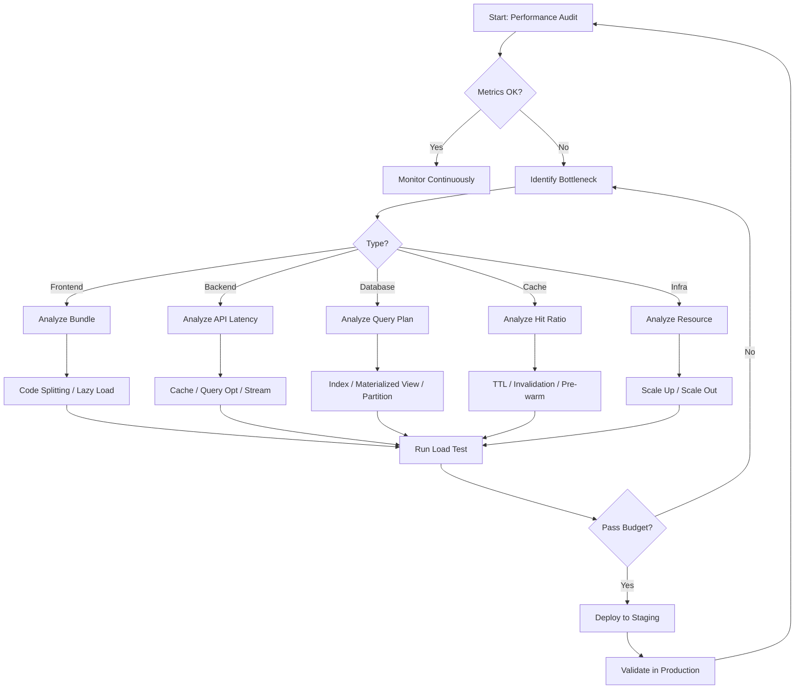
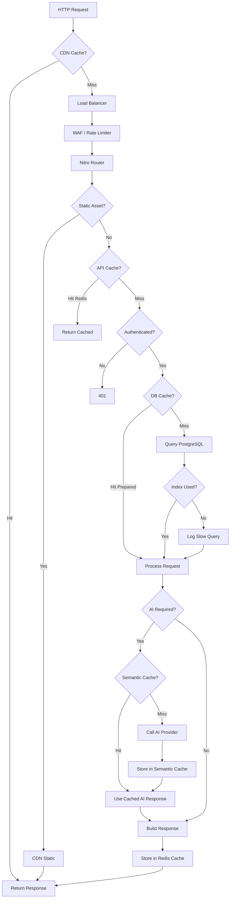
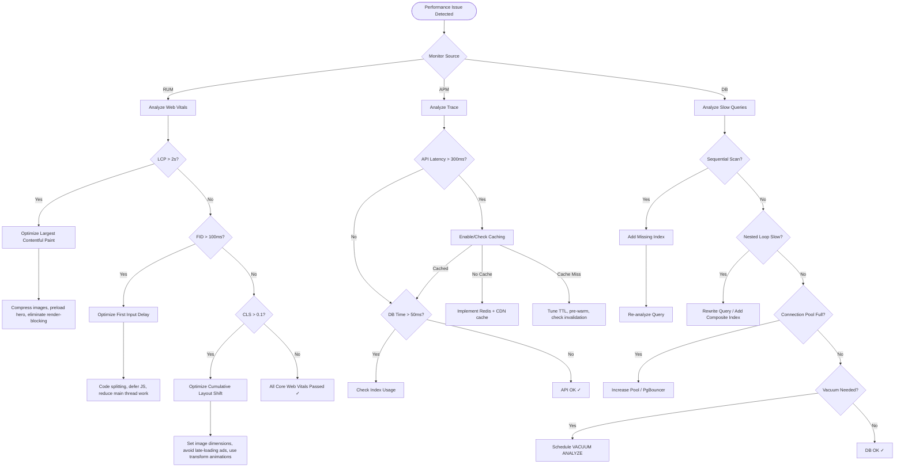
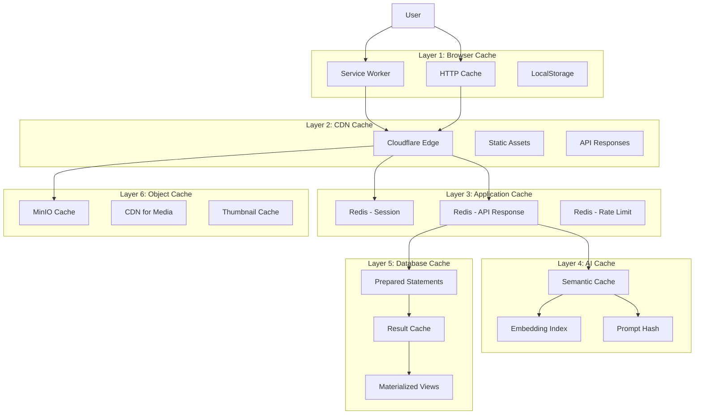
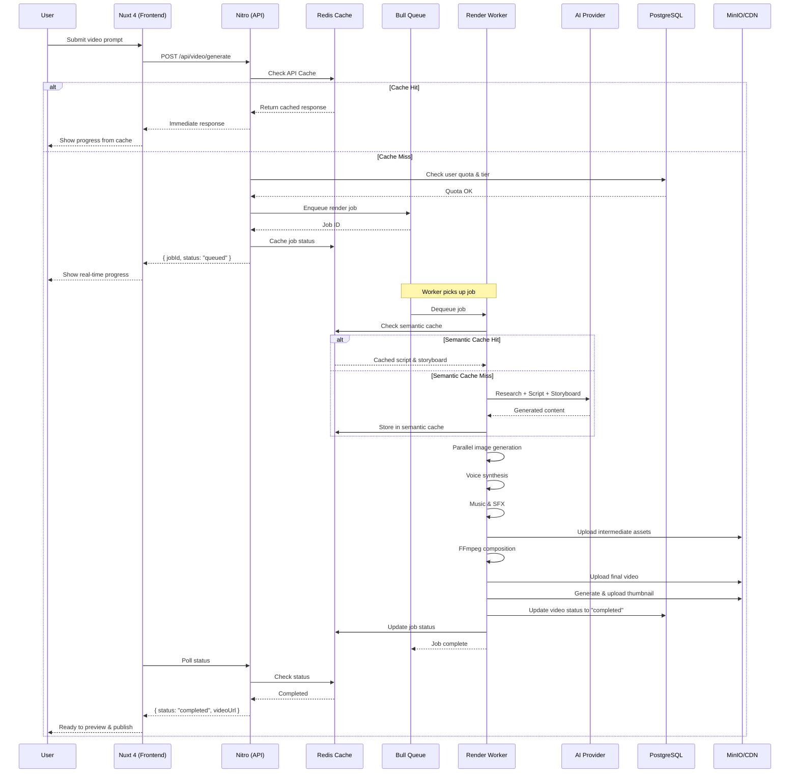
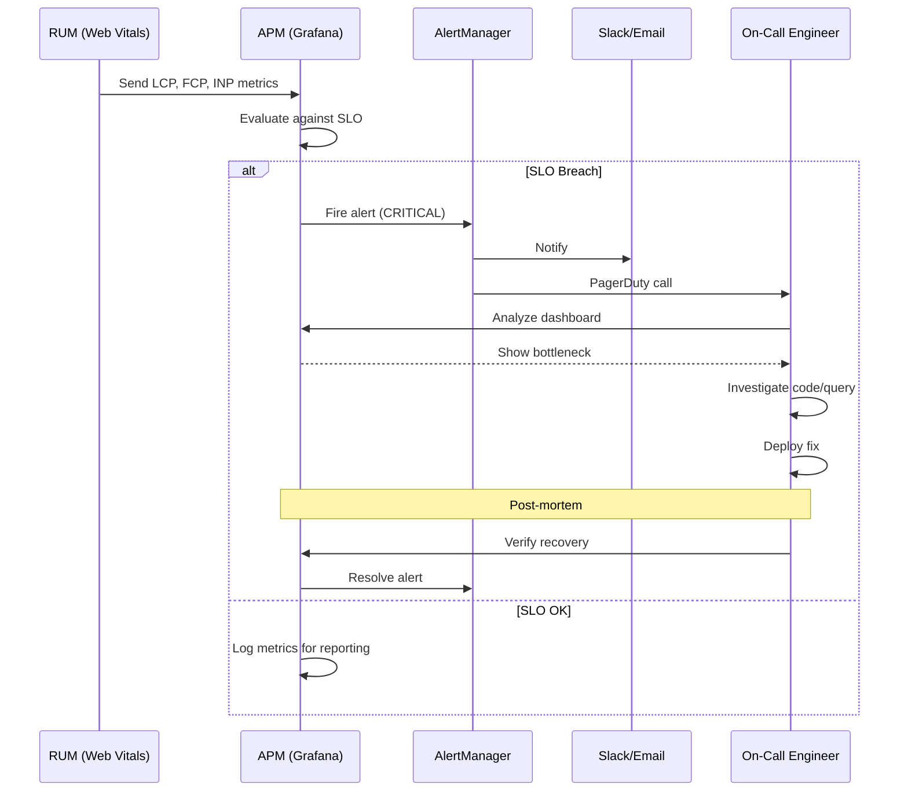
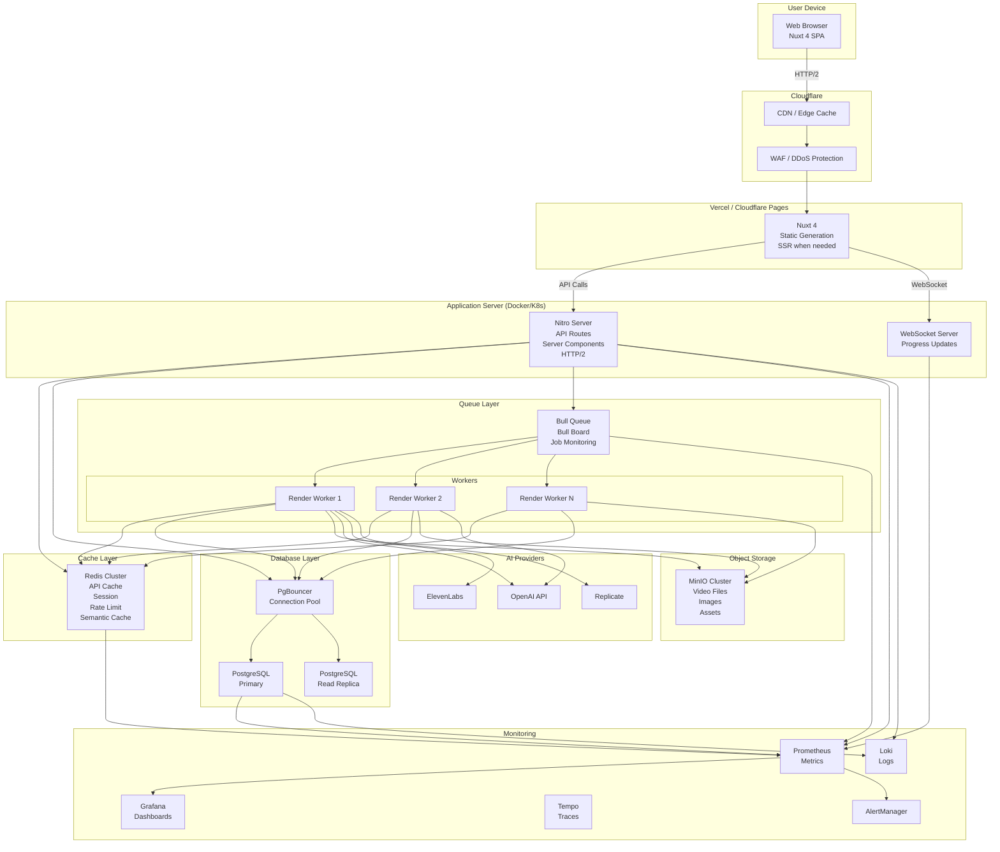
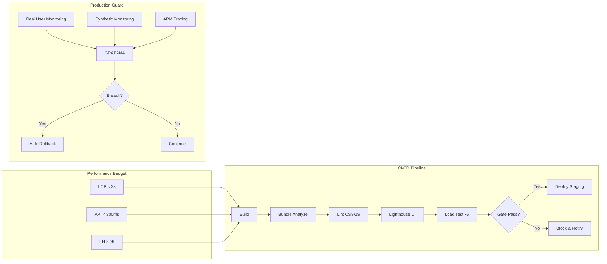
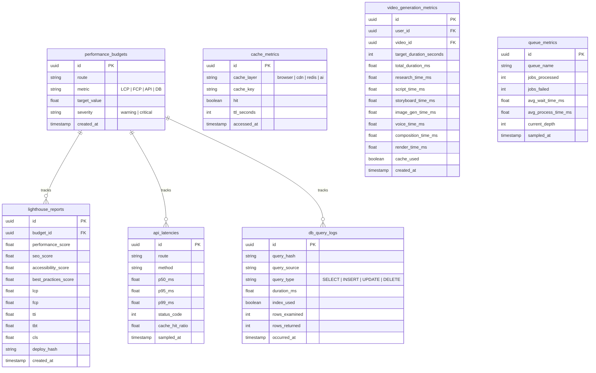

# PERFORMANCE — Vidara AI

> **Subtitle:** Performance Targets, Optimization Strategy & Scalability Plan
> **Project:** Vidara AI — AI YouTube Video Generator SaaS
> **Document Version:** 1.0.0
> **Last Updated:** 2026-06-26

---

## 1. Tujuan

Dokumen ini bertujuan untuk:

1. Menetapkan **performance targets** (NFR) yang harus dipenuhi oleh seluruh sistem Vidara AI.
2. Mendokumentasikan **strategi optimalisasi** di setiap layer (frontend, backend, database, cache, infrastruktur).
3. Menyusun **scalability plan** bertahap dari 100 hingga 1.000.000 pengguna.
4. Menentukan **load testing strategy** dan **performance monitoring** untuk menjaga SLA.
5. Menjadi acuan bagi tim engineering dalam implementasi, optimasi, dan evaluasi performa sistem.

---

## 2. Background

Vidara AI adalah SaaS AI yang mengubah prompt menjadi video YouTube secara otomatis. Proses ini melibatkan pipeline kompleks: riset, penulisan skrip, storyboard, image generation, voice synthesis, rendering, hingga upload. Setiap tahap memiliki potensi bottleneck yang dapat menurunkan kualitas pengalaman pengguna.

Masalah performa yang umum pada AI video generator SaaS:

| Masalah | Dampak |
|---------|--------|
| Video rendering lama (>1 jam) | Churn rate tinggi |
| API response lambat (>1 detik) | User experience buruk |
| Database query lambat | Halaman dashboard tidak responsif |
| Cache miss tinggi | Biaya API AI membengkak |
| Skalabilitas buruk | Downtime saat traffic spike |

Dokumen ini menjawab seluruh tantangan tersebut dengan pendekatan sistematis dan terukur.

---

## 3. Objective

| Objektif | Metrik | Target | Timeline |
|----------|--------|--------|----------|
| Memenuhi Core Web Vitals | LCP, FCP, INP | <2s LCP, <1s FCP, <100ms INP | Phase 7 |
| API response cepat | p50, p95, p99 | <300ms p50, <500ms p95, <1s p99 | Phase 7 |
| Lighthouse excellence | Performance, SEO, A11Y, BP | ≥95, ≥95, ≥90, ≥90 | Phase 7 |
| Video generation efisien | Waktu render per durasi | <15min (6min video), <20min (8min video), <30min (15min video) | Phase 8 |
| Queue processing reliable | Queuing delay, concurrency | <1min delay, 10 concurrent/user | Phase 8 |
| Database query optimal | p50, p95, p99 | <10ms p50, <50ms p95, <200ms p99 | Phase 7 |
| Cache hit ratio tinggi | API cache, AI cache | ≥90% API, ≥80% AI | Phase 7 |
| Niche context cache optimal | Niche cache hit ratio, retrieval latency | ≥95% cache hit, <10ms retrieval p50 | Phase 8 |
| Scalability terukur | User tiers | 100 → 1.000 → 10.000 → 100K → 1M | Phase 9–10 |

---

## 4. Scope

### In Scope

- Frontend optimization (Nuxt 4): code splitting, lazy loading, image optimization, bundle analysis, critical CSS, font optimization
- Backend optimization (Nitro): response caching, server components, API route caching, connection pooling, compression, streaming
- Database optimization (PostgreSQL): indexing strategy, query optimization, connection pooling, read replicas, materialized views, partitioning
- Cache strategy (multi-layer): browser, CDN, Redis, semantic AI cache, database query cache, object cache
- Scalability planning: 5-tier user growth model dengan arsitektur progresif
- Load testing (k6): scenario design, performance budgets, bottleneck identification
- Performance monitoring: RUM, Core Web Vitals, dashboards

### Out of Scope

- GPU hardware optimization (diurus oleh cloud provider)
- Network infrastructure optimization (diurus oleh Cloudflare)
- Third-party API latency (dimitigasi dengan caching dan fallback)
- Client-side device performance (dimitigasi dengan progressive enhancement)

---

## 5. Stakeholder

| Stakeholder | Peran | Ekspektasi |
|-------------|------|------------|
| End User | Pengguna Vidara AI | Halaman cepat, video selesai tepat waktu |
| Product Manager | Menentukan prioritas fitur | Performance tidak mengorbankan user experience |
| Frontend Engineer | Implementasi optimasi Nuxt 4 | Target Lighthouse ≥95 |
| Backend Engineer | Implementasi optimasi Nitro | API response <300ms |
| AI Engineer | Optimasi pipeline AI | Cache hit ratio ≥80% |
| DevOps Engineer | Infrastruktur & monitoring | Scalability plan terpenuhi |
| QA Engineer | Load testing & validasi | Seluruh performance budget terpenuhi |
| CTO / Tech Lead | Oversight teknis | SLA terpenuhi, biaya terkendali |

---

## 6. Requirement

### 6.1 Business Requirements

| ID | Requirement | Prioritas |
|----|-------------|-----------|
| BR-PERF-001 | Sistem harus mampu melayani 100 pengguna bersamaan tanpa degradasi | High |
| BR-PERF-002 | Waktu render video sesuai durasi — 6min (<15min), 8min (<20min), 15min (<30min) | High |
| BR-PERF-003 | Biaya operasional harus terkendali melalui cache optimization | Medium |
| BR-PERF-004 | Sistem harus scalable hingga 1.000.000 pengguna | High |
| BR-PERF-005 | Downtime karena performance issue tidak boleh >30 menit/bulan | High |

### 6.2 Technical Requirements

| ID | Requirement | Target |
|----|-------------|--------|
| TR-PERF-001 | Page load time (LCP) | <2s |
| TR-PERF-002 | First Contentful Paint (FCP) | <1s |
| TR-PERF-003 | Interaction to Next Paint (INP) | <100ms |
| TR-PERF-004 | API response time p50 | <300ms |
| TR-PERF-005 | API response time p95 | <500ms |
| TR-PERF-006 | API response time p99 | <1s |
| TR-PERF-007 | Database query p50 | <10ms |
| TR-PERF-008 | Database query p95 | <50ms |
| TR-PERF-009 | Database query p99 | <200ms |
| TR-PERF-010 | Cache hit ratio (API) | ≥90% |
| TR-PERF-011 | Cache hit ratio (AI) | ≥80% |
| TR-PERF-012 | Queue queuing delay | <1min |
| TR-PERF-013 | Concurrent renders per user | 10 |
| TR-PERF-014 | Lighthouse Performance | ≥95 |
| TR-PERF-015 | Lighthouse SEO | ≥95 |
| TR-PERF-016 | Lighthouse Accessibility | ≥90 |
| TR-PERF-017 | Lighthouse Best Practices | ≥90 |
| TR-PERF-018 | Video generation (10min) | <30min |
| TR-PERF-019 | Video generation (5min) | <10min |

---

## 7. Functional Requirement

| ID | Requirement | Komponen |
|----|-------------|----------|
| FR-PERF-001 | Sistem harus memiliki service worker untuk offline caching | PWA |
| FR-PERF-002 | Sistem harus mendukung HTTP/2 multiplexing | CDN / Server |
| FR-PERF-003 | Sistem harus memiliki response streaming untuk AI generation | Nitro |
| FR-PERF-004 | Sistem harus memiliki semantic cache untuk AI prompt serupa | Redis |
| FR-PERF-005 | Sistem harus memiliki progress indicator untuk setiap tahap rendering | Frontend |
| FR-PERF-006 | Sistem harus mampu auto-scale worker berdasarkan queue length | Kubernetes |
| FR-PERF-007 | Sistem harus memiliki slow query log otomatis | PostgreSQL |
| FR-PERF-008 | Sistem harus menyediakan performance dashboard real-time | Grafana |
| FR-PERF-009 | Sistem harus mengirim alert jika performance target dilanggar | Monitoring |
| FR-PERF-010 | Sistem harus mendukung stale-while-revalidate untuk API routes | Nitro |

---

## 8. Non Functional Requirement

### 8.1 Performance Targets Matrix

| Metrik | Target | Kritis | Metode Pengukuran |
|--------|--------|--------|-------------------|
| LCP | <2s | Yes | RUM (Web Vitals) |
| FCP | <1s | Yes | RUM (Web Vitals) |
| INP | <100ms | Yes | RUM (Web Vitals) |
| TTFB | <400ms | Yes | RUM + Synthetic |
| API p50 | <300ms | Yes | Grafana + Prometheus |
| API p95 | <500ms | Yes | Grafana + Prometheus |
| API p99 | <1s | No | Grafana + Prometheus |
| DB Query p50 | <10ms | Yes | PostgreSQL logs |
| DB Query p95 | <50ms | Yes | PostgreSQL logs |
| DB Query p99 | <200ms | No | PostgreSQL logs |
| Cache Hit Ratio API | ≥90% | Yes | Redis INFO |
| Cache Hit Ratio AI | ≥80% | Yes | Redis INFO |
| Queue Delay | <1min | Yes | Bull Board |
| Video 10min render | <30min | Yes | App metrics |
| Video 5min render | <10min | Yes | App metrics |
| Lighthouse Performance | ≥95 | Yes | CI/CD |
| Lighthouse SEO | ≥95 | Yes | CI/CD |
| Lighthouse A11Y | ≥90 | Yes | CI/CD |
| Lighthouse BP | ≥90 | Yes | CI/CD |
| Availability | ≥99.9% | Yes | Uptime monitoring |

### 8.2 Availability & Reliability

| Metrik | Target |
|--------|--------|
| Uptime | ≥99.9% (≈8.7 jam downtime/tahun) |
| Recovery Time | <15 menit |
| Recovery Point | <5 menit |
| Error Rate | <0.1% dari total request |

### 8.3 Scalability Requirements

| Tier | Users | Concurrent | Strategy |
|------|-------|------------|----------|
| Startup | 100 | 50 | Single server + basic cache |
| Growth | 1,000 | 500 | Cluster + Redis + read replicas |
| Mid | 10,000 | 5,000 | Auto-scaling + CDN + queue + sharding |
| Large | 100,000 | 50,000 | Multi-region + DB sharding + event sourcing |
| Enterprise | 1,000,000 | 500,000 | Global CDN + CQRS + event-driven + microservices |

---

## 9. Workflow

### 9.1 Performance Optimization Workflow



### 9.2 Video Generation Pipeline Performance Flow

```mermaid
flowchart LR
    subgraph Input
        A[User Prompt] --> B[Research Cache?]
    end
    
    subgraph Cache Layer
        B -->|Hit| C[Return Cached Script]
        B -->|Miss| D[Research Agent]
        D --> E[Fact Check]
        E --> F[Script Writer]
        F --> G[Cache Script]
    end
    
    subgraph Generation
        G --> H[Storyboard]
        H --> I[Scene Planning]
        I --> J[Parallel Image Gen]
        J --> K[Voice Synthesis]
        K --> L[Music & SFX]
    end
    
    subgraph Composition
        L --> M[Video Composer]
        M --> N[FFmpeg Render]
        N --> O[Thumbnail Gen]
    end
    
    subgraph Output
        O --> P[Quality Check]
        P --> Q[Upload Queue]
        Q --> R[YouTube Upload]
    end
    
    style C fill:#90EE90
    style G fill:#90EE90
```



---

## 10. Flowchart

### 10.1 Request Lifecycle dengan Caching



---

## 11. Mermaid Diagram

### 11.1 Performance Optimization Decision Tree



### 11.2 Cache Architecture



---

## 12. Sequence Diagram

### 12.1 Optimized Video Generation Request



### 12.2 Performance Monitoring Alert Flow



---

## 13. Architecture Diagram

### 13.1 Performance Optimization Architecture (C4 Level 2 — Container)



### 13.2 Performance Optimization Decision Architecture



---

## 14. ER Diagram — Performance Metrics Schema

> **Cross-reference:** Detail implementasi di `database.md`



---

## 15. Decision Table

### 15.1 Caching Decision Table

| Skenario | Cache Layer | TTL | Invalidation | Priority |
|----------|-------------|-----|--------------|----------|
| Static assets (JS, CSS) | Browser + CDN | 1 year | Versioned URL | High |
| Images | CDN + Browser | 30 days | Purge on update | High |
| API: Video list | Redis | 60s | On create/update | High |
| API: Dashboard stats | Redis | 300s | On periodic refresh | Medium |
| API: User profile | Redis | 180s | On profile update | High |
| AI: Research result | Semantic Cache | 24h | On content change | Critical |
| AI: Script output | Semantic Cache | 24h | On prompt change | Critical |
| AI: Image gen result | Object (MinIO) | Permanent | On regenerate | High |
| DB: Config/Setting | Prepared Statement | Session | On update | Medium |
| DB: Analytics | Materialized View | 1h | Refresh schedule | Medium |
| Session data | Redis | Session TTL | On logout | High |

### 15.2 Optimization Technique Decision Matrix

| Masalah | Teknik | Effort | Impact | Risiko | Priority |
|---------|--------|--------|--------|--------|----------|
| Bundle besar | Code splitting + tree shaking | Medium | High | Route mismatch | P0 |
| Gambar berat | Nuxt Image + WebP/AVIF | Low | High | Browser support | P0 |
| API lambat | Redis cache | Medium | High | Stale data | P0 |
| DB slow query | Index optimization | Medium | High | Index overhead | P0 |
| AI response lambat | Semantic cache | High | High | Cache miss penalty | P1 |
| Queue menumpuk | Auto-scaling worker | High | High | Cost | P1 |
| CDN miss | Pre-warm + TTL tuning | Low | Medium | Complexity | P1 |
| Font heavy | Subsetting + WOFF2 | Low | Medium | Missing glyphs | P2 |
| CSS besar | PurgeCSS + critical CSS | Medium | Medium | Missing styles | P2 |
| Service worker | PWA implementation | Medium | Medium | Cache invalidation | P2 |

### 15.3 Database Index Strategy Decision Table

| Query Pattern | Index Type | Columns | Est. Speedup | Trade-off |
|---------------|------------|---------|-------------|-----------|
| Video by user_id + created_at | B-tree (composite) | (user_id, created_at DESC) | 50-100x | Write overhead ~5% |
| Search by title/description | GIN (trigram) | (search_vector) | 10-50x | Index size ~30% of table |
| AI prompt hash lookup | B-tree | (prompt_hash) | 1000x | None significant |
| Time-series analytics | BRIN | (created_at) | 50x | Sequential scans only |
| Status filter (active users) | Partial B-tree | (user_id) WHERE is_active | 20x | Limited to filtered queries |
| JSONB metadata queries | GIN (jsonb_path_ops) | (metadata) | 10-100x | Index size large |
| Queue job status | B-tree (composite) | (status, priority, created_at) | 100x | Write overhead ~10% |

---

## 16. Checklist

### 16.1 Frontend Optimization Checklist

- [ ] **Code Splitting**: Route-based splitting di setiap halaman (`pages/`)
- [ ] **Component Lazy Loading**: Komponen heavy di-load on-demand (`defineAsyncComponent`)
- [ ] **Image Optimization**: Nuxt Image dengan format WebP/AVIF, responsive sizes, lazy loading
- [ ] **Bundle Analysis**: `npx nuxt analyze` di CI pipeline
- [ ] **Tree Shaking**: Unused CSS via PurgeCSS, unused components via ESLint
- [ ] **Critical CSS**: Inlining critical CSS untuk above-the-fold content
- [ ] **Preload/Preconnect**: Preload font, preconnect ke API/CDN origins
- [ ] **Font Optimization**: Subsetting (hanya karakter Latin + Indonesia), WOFF2 format
- [ ] **HTTP/2**: Pastikan server dan CDN mendukung HTTP/2 multiplexing
- [ ] **PWA Service Worker**: Offline page cache, asset precache via Workbox
- [ ] **Nuxt 4 Features**: Static generation untuk halaman publik, ISR untuk konten dinamis
- [ ] **Reduce JS**: Minimalisasi third-party scripts, defer non-critical JS
- [ ] **DOM Optimization**: Virtual scrolling untuk daftar video panjang (>100 items)

### 16.2 Backend Optimization Checklist

- [ ] **Response Caching**: Redis cache untuk semua GET API endpoints
- [ ] **HTTP Cache Headers**: `Cache-Control`, `ETag`, `Last-Modified` di setiap response
- [ ] **Server Components**: Gunakan Nuxt Server Components untuk komponen berat
- [ ] **API Route Caching**: `stale-while-revalidate` pattern untuk data yang tidak real-time
- [ ] **N+1 Prevention**: Gunakan eager loading (Prisma/Drizzle `include`/`join`)
- [ ] **Connection Pooling**: PgBouncer dengan 100-200 connections
- [ ] **Compression**: Brotli untuk static assets, Gzip untuk API responses
- [ ] **Response Streaming**: SSE/WebSocket untuk AI generation progress
- [ ] **Rate Limiting**: Redis-based rate limiter per user/IP
- [ ] **Query Optimization**: EXPLAIN ANALYZE sebelum deploy query baru

### 16.3 Database Optimization Checklist

- [ ] **Index Strategy**: Implementasi B-tree, GIN, GiST, BRIN, partial indexes sesuai pola query
- [ ] **Slow Query Log**: Aktifkan `log_min_duration_statement = 200ms`
- [ ] **Connection Pooling**: PgBouncer di mode transaction pooling
- [ ] **Read Replicas**: Analytics queries diarahkan ke read replica
- [ ] **Materialized Views**: Dashboard queries menggunakan materialized views, refresh periodik
- [ ] **Partitioning**: Tabel `video_generation_metrics` dipartisi per bulan
- [ ] **Vacuum Strategy**: `autovacuum` dengan tuning, `VACUUM ANALYZE` terjadwal
- [ ] **Prepared Statements**: Gunakan prepared statements untuk query berulang
- [ ] **Archive**: Data lama (>6 bulan) diarsipkan ke tabel terpisah

### 16.4 Cache Strategy Checklist

- [ ] **Browser Cache**: Immutable assets dengan versioned URLs, max-age 1 tahun
- [ ] **CDN Cache**: Cloudflare dengan cache rules per path pattern
- [ ] **Redis Cache**: Cluster Redis untuk API responses, session, rate limiting
- [ ] **Semantic Cache**: Cache hasil AI berdasarkan embedding similarity >0.95
- [ ] **Query Cache**: Prepared statements + result caching di application layer
- [ ] **Object Cache**: MinIO dengan CDN di depan untuk media assets
- [ ] **Cache Invalidation**: Webhook-based purge untuk konten yang diubah
- [ ] **Cache Pre-warm**: Warm cache untuk konten populer setelah deploy

### 16.5 Scalability Checklist

- [ ] **100 Users**: Deploy single server dengan Docker Compose, basic Redis cache
- [ ] **1,000 Users**: Cluster mode (3 nodes), Redis cache, PostgreSQL read replica
- [ ] **10,000 Users**: Auto-scaling group (K8s/Horizontal Pod Autoscaler), CDN, Bull queue, DB sharding preparation
- [ ] **100,000 Users**: Multi-region (US, EU, Asia), database sharding (by org_id), event sourcing
- [ ] **1,000,000 Users**: Global CDN, CQRS pattern, event-driven architecture, microservices per domain
- [ ] **Load Balancer**: Layer 7 (HAProxy/Nginx) dengan least-connections algorithm
- [ ] **GPU Workers**: Dedicated worker pool dengan GPU untuk rendering
- [ ] **Database Sharding**: Shard key = `org_id`, 4 shards awal, scale horizontal
- [ ] **Auto-scaling**: CPU >70% atau queue depth >100 trigger scale-up

### 16.6 Load Testing Checklist

- [ ] **Ramp-up Test**: 10 → 1000 users dalam 5 menit, hold 10 menit
- [ ] **Spike Test**: 0 → 2000 users dalam 30 detik
- [ ] **Soak Test**: 500 users selama 8 jam untuk deteksi memory leak
- [ ] **Stress Test**: Incremental hingga sistem failure, catat breaking point
- [ ] **Performance Budgets**: Setiap endpoint memiliki max latency budget
- [ ] **Bottleneck Report**: Automated report dari k6 hasil test
- [ ] **Capacity Planning**: Metrics-based recommendation untuk resource provisioning

### 16.7 Performance Monitoring Checklist

- [ ] **RUM Implementation**: `web-vitals` library di Nuxt, kirim ke analytics endpoint
- [ ] **Core Web Vitals Dashboard**: Grafana dashboard untuk LCP, FCP, INP, CLS
- [ ] **API Latency Dashboard**: p50, p95, p99 per endpoint
- [ ] **Database Performance Dashboard**: Slow query count, avg query time, index usage
- [ ] **Cache Hit Ratio Dashboard**: Per layer (browser, CDN, Redis, AI)
- [ ] **Video Generation Dashboard**: Pipeline stage duration, cache effectiveness
- [ ] **Queue Dashboard**: Queue depth, wait time, process time, failure rate
- [ ] **Alert Rules**: SLO breach → PagerDuty/Slack notification
- [ ] **Synthetic Monitoring**: Playwright/Lighthouse CI setiap 5 menit

---

## 17. Risk

| ID | Risk | Impact | Probability | Severity | Description |
|----|------|--------|------------|----------|-------------|
| R-PERF-001 | Cache invalidation menyebabkan stale data | High | Medium | High | Semantic cache mengembalikan hasil AI yang sudah outdated |
| R-PERF-002 | Traffic spike menyebabkan database overload | High | Medium | High | Viral video menyebabkan 10x traffic normal |
| R-PERF-003 | GPU worker tidak cukup saat peak | High | Medium | High | Queue menumpuk, render delay >1 jam |
| R-PERF-004 | Memory leak pada worker setelah render berulang | Medium | Medium | Medium | Worker crash setelah 100+ job |
| R-PERF-005 | CDN cache miss tinggi akibat TTL terlalu agresif | Medium | Low | Medium | Beban server meningkat, response lambat |
| R-PERF-006 | Database index bloat akibat write-heavy workload | Medium | Medium | Medium | Query performance degrading over time |
| R-PERF-007 | Third-party AI API latency spike | High | Medium | High | OpenAI/Replicate rate limit atau outage |
| R-PERF-008 | Ineffective caching strategy untuk diverse prompts | Medium | High | Medium | Semantic cache hit ratio rendah karena variasi prompt tinggi |
| R-PERF-009 | Bundle size membesar tanpa terkontrol | Low | Medium | Low | Developer menambah dependensi tanpa bundle analysis |
| R-PERF-010 | Cross-region latency untuk multi-region deployment | Medium | Low | Medium | Pengguna di Asia merasa lambat jika server di US |

---

## 18. Mitigation

| ID | Mitigation | Kontingensi | Owner | Timeline |
|----|------------|-------------|-------|----------|
| R-PERF-001 | Cache versioning + content hash + webhook-based purge | Force refresh via admin panel | Backend Engineer | Phase 7 |
| R-PERF-002 | Auto-scaling + connection pooling + query queue + CDN | Database read replica + query throttling | DevOps Engineer | Phase 7 |
| R-PERF-003 | Auto-scaling GPU worker pool + priority queue + spot instances | Fallback ke CPU rendering (slower) | DevOps Engineer | Phase 8 |
| R-PERF-004 | Memory limit per worker + healthcheck + auto-restart | Circuit breaker, isolate per-tenant | Backend Engineer | Phase 7 |
| R-PERF-005 | Dynamic TTL based on content popularity + pre-warm | Minimum TTL 60s fallback | DevOps Engineer | Phase 7 |
| R-PERF-006 | Scheduled `REINDEX` + `VACUUM ANALYZE` + index monitoring | Drop + rebuild index during maintenance window | Database Engineer | Phase 7 |
| R-PERF-007 | Multi-provider fallback + retry with backoff + response cache | Degraded mode: serve cached content | AI Engineer | Phase 7 |
| R-PERF-008 | Prompt normalization + embedding-based similarity threshold tuning | Exact match cache as backup | AI Engineer | Phase 8 |
| R-PERF-009 | Bundle size budget in CI + automated PR comment | Manual code review for large additions | Frontend Engineer | Phase 7 |
| R-PERF-010 | Multi-region deployment with DNS-based routing + edge caching | Route to nearest region with fallback | DevOps Engineer | Phase 10 |

---

## 19. Future Improvement

| Item | Deskripsi | Target Phase | Priority |
|------|-----------|-------------|----------|
| **Edge Computing** | Pindahkan beberapa logika ke Cloudflare Workers untuk mengurangi latency | Phase 10 | Low |
| **WebAssembly (WASM)** | Gunakan WASM untuk FFmpeg processing di edge untuk video pendek | Phase 10 | Low |
| **Predictive Prefetch** | ML model untuk memprediksi dan prefetch konten yang akan diakses user | Phase 10 | Medium |
| **Database Sharding** | Implementasi sharding horizontal untuk PostgreSQL | Phase 9 | High |
| **CQRS Pattern** | Separation of read/write models untuk skalabilitas maksimal | Phase 10 | High |
| **Event Sourcing** | Event store untuk audit trail dan replay kemampuan | Phase 10 | Medium |
| **Microservices Migration** | Split monolith menjadi domain-based microservices | Phase 10 | High |
| **GPU Optimization** | Custom GPU kernels untuk akselerasi rendering | Phase 9 | Medium |
| **Adaptive Quality** | Otomatis menyesuaikan kualitas render berdasarkan beban sistem | Phase 9 | Medium |
| **Quantum Computing** | Evaluasi quantum computing untuk komplex scene optimization (2027+) | Future | Low |

---

## 20. Acceptance Criteria

### 20.1 Phase 7 — Performance Optimization

| Criteria | Target | Verification |
|----------|--------|-------------|
| Lighthouse score ≥95 Performance | ≥95 | `npx lighthouse-ci` di CI |
| All Core Web Vitals pass | LCP<2s, FCP<1s, INP<100ms | RUM data dashboard |
| API response p50 <300ms | <300ms | Grafana API latency dashboard |
| Database query p50 <10ms | <10ms | PostgreSQL slow query log |
| Cache hit ratio API ≥90% | ≥90% | Redis INFO command |
| Cache hit ratio AI ≥80% | ≥80% | Redis with semantic cache metrics |
| Bundle size <200KB (JS initial) | <200KB | `npx nuxt analyze` |
| No N+1 queries in critical paths | 0 | Database query log analysis |

### 20.2 Phase 8 — Video Generation Performance

| Criteria | Target | Verification |
|----------|--------|-------------|
| 6min video rendered in <15min | <15min | App metrics dashboard |
| 8min video rendered in <20min | <20min | App metrics dashboard |
| 15min video rendered in <30min | <30min | App metrics dashboard |
| Queue delay <1min | <1min | Bull Board metrics |
| 10 concurrent renders per user | 10 | Load test validation |
| Video quality >= source spec | Pass | QA review per render |

### 20.3 Phase 9 — Scalability

| Criteria | Target | Verification |
|----------|--------|-------------|
| System handles 10,000 concurrent users | Pass | k6 load test |
| Auto-scaling activates under load | Within 2min | K8s HPA metrics |
| Database read replicas serve analytics | Query routed correctly | Integration test |
| Materialized views refresh <5min | <5min | Monitoring dashboard |

### 20.4 Phase 10 — Enterprise Scale

| Criteria | Target | Verification |
|----------|--------|-------------|
| Multi-region latency <500ms (p95) | <500ms | Synthetic monitoring |
| Database sharding operational | Pass | Integration test |
| CQRS pattern implemented | Pass | Architecture review |
| Event sourcing with replay capability | Pass | Disaster recovery drill |

---

## 21. Referensi

### Dokumen Internal

| Dokumen | Keterangan |
|---------|------------|
| `blueprint.md` | Arsitektur sistem secara keseluruhan |
| `testing.md` | **Cross-reference:** Detail test scenario untuk load testing, performance budget validation |
| `deployment.md` | **Cross-reference:** Infrastruktur deployment, auto-scaling configuration, CDN setup |
| `monitoring.md` | **Cross-reference:** Performance dashboard, alert rules, SLO definitions |
| `architecture.md` | C4 model, component interaction, deployment architecture |
| `database.md` | Index strategy, query optimization, partitioning detail |
| `observability.md` | Tracing, metrics, logging untuk performance observability |
| `cost-estimation.md` | Resource cost optimization, cache cost benefit analysis |
| `roadmap.md` | Timeline implementasi performance optimization |

### Referensi Eksternal

| Referensi | URL |
|-----------|-----|
| Web Vitals | https://web.dev/vitals/ |
| Lighthouse Performance Scoring | https://developer.chrome.com/docs/lighthouse/performance/ |
| Nuxt 4 Performance | https://nuxt.com/docs/getting-started/performance |
| Nitro Server | https://nitro.unjs.io/ |
| PostgreSQL Performance Tuning | https://wiki.postgresql.org/wiki/Performance_Optimization |
| Redis Caching Patterns | https://redis.io/docs/manual/patterns/ |
| k6 Load Testing | https://k6.io/docs/ |
| Cloudflare Caching | https://developers.cloudflare.com/cache/ |
| PgBouncer Documentation | https://www.pgbouncer.org/ |
| Brotli Compression | https://www.brotli.org/ |
| WebP & AVIF | https://developers.google.com/speed/webp |

---

## Appendix A: Performance Budget JSON

> File: `performance-budget.json` (used by Lighthouse CI and k6)

```json
{
  "budgets": [
    {
      "path": "/*",
      "resourceCounts": [
        {"resourceType": "stylesheet", "budget": 3},
        {"resourceType": "script", "budget": 10},
        {"resourceType": "font", "budget": 3},
        {"resourceType": "image", "budget": 20},
        {"resourceType": "document", "budget": 3}
      ],
      "resourceSizes": [
        {"resourceType": "total", "budget": 500},
        {"resourceType": "stylesheet", "budget": 50},
        {"resourceType": "script", "budget": 200},
        {"resourceType": "font", "budget": 100},
        {"resourceType": "image", "budget": 300}
      ],
      "timings": [
        {"metric": "interactive", "budget": 3000},
        {"metric": "first-contentful-paint", "budget": 1000},
        {"metric": "largest-contentful-paint", "budget": 2000}
      ]
    }
  ]
}
```

## Appendix B: k6 Load Test Template

> **Cross-reference:** Detail implementasi di `testing.md`

```javascript
// k6-load-test.js — Template untuk load testing Vidara AI
import http from 'k6/http';
import { check, sleep } from 'k6';
import { Rate, Trend } from 'k6/metrics';

const errorRate = new Rate('errors');
const apiLatency = new Trend('api_latency');

export const options = {
  stages: [
    { duration: '2m', target: 100 },  // ramp-up
    { duration: '5m', target: 100 },  // hold
    { duration: '2m', target: 500 },  // ramp-up
    { duration: '10m', target: 500 }, // hold
    { duration: '2m', target: 0 },    // ramp-down
  ],
  thresholds: {
    http_req_duration: ['p(95)<500', 'p(99)<1000'],
    errors: ['rate<0.01'],
  },
};

export default function () {
  const res = http.get(`${__ENV.BASE_URL}/api/v1/videos`, {
    headers: { Authorization: `Bearer ${__ENV.API_TOKEN}` },
  });

  check(res, {
    'status is 200': (r) => r.status === 200,
    'response time < 300ms': (r) => r.timings.duration < 300,
  });

  errorRate.add(res.status !== 200);
  apiLatency.add(res.timings.duration);

  sleep(1);
}
```

## Appendix C: Redis Cache Configuration

```bash
# Redis configuration untuk caching
maxmemory 4gb
maxmemory-policy allkeys-lru
activerehashing yes
lazyfree-lazy-eviction yes
lazyfree-lazy-expire yes

# Slow log
slowlog-log-slower-than 10000
slowlog-max-len 128
```

## Appendix D: PgBouncer Configuration

```ini
[databases]
vidara = host=localhost port=5432 dbname=vidara

[pgbouncer]
listen_addr = 0.0.0.0
listen_port = 6432
auth_type = scram-sha-256
auth_file = /etc/pgbouncer/userlist.txt

pool_mode = transaction
default_pool_size = 100
max_client_conn = 200
max_db_connections = 50

server_idle_timeout = 600
query_timeout = 30
```

---

> **Document Status:** ✅ Final
> **Next Review:** 2026-07-26
> **Maintainer:** DevOps Engineer & Full Stack Team
