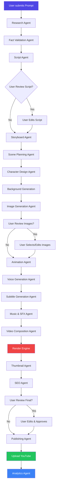
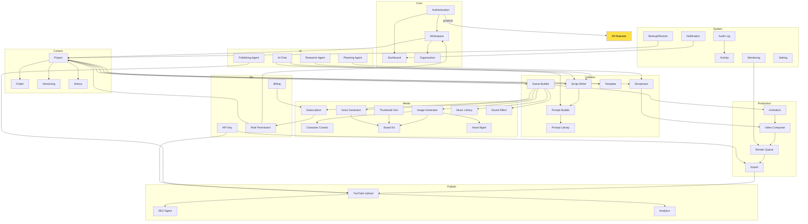
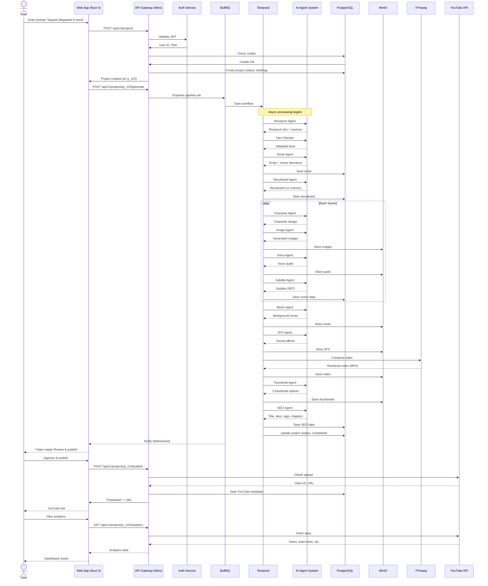
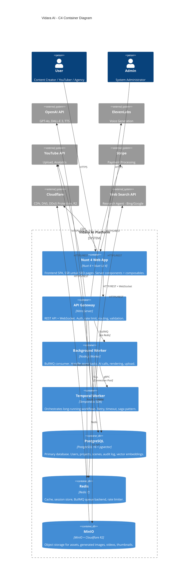
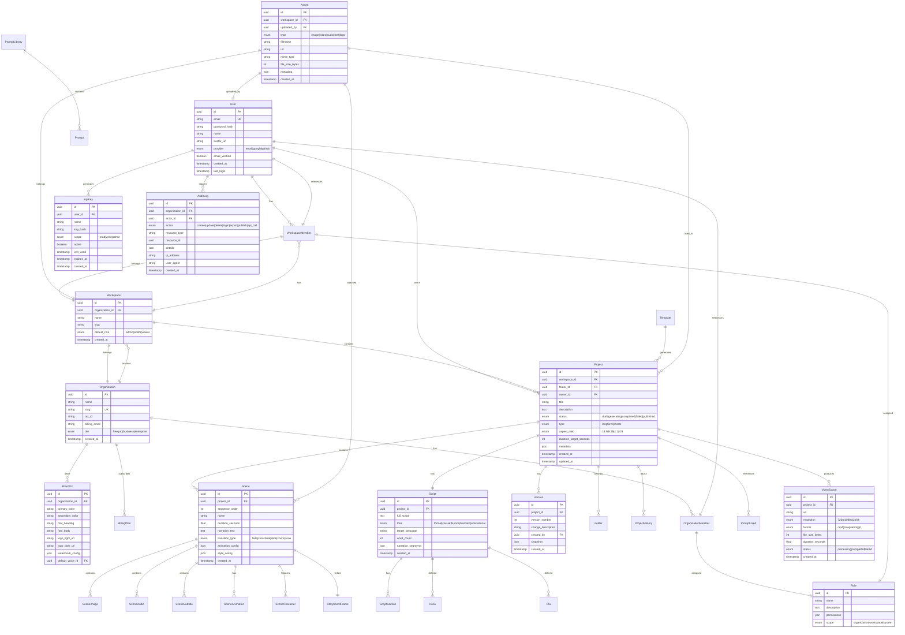

# Vidara AI — Product Requirement Document

| Metadata | |
|---|---|
| **Nama Dokumen** | Product Requirement Document (PRD) |
| **Project** | Vidara AI — AI YouTube Video Generator SaaS |
| **Version** | 1.0 |
| **Tanggal** | 2026-06-26 |
| **Penanggung Jawab** | Agent 1 — Senior Product Manager |
| **Status** | Draft Final |
| **Cross-Reference** | [BRD](../brd.md) · [FRD](../frd.md) · [AGENTS](AGENTS.md) |

---

## 1. Tujuan

Dokumen ini mendefinisikan secara detail kebutuhan produk **Vidara AI**, sebuah AI Agent SaaS platform yang mengubah prompt teks menjadi video YouTube secara otomatis. PRD ini menjadi acuan utama bagi tim produk, desain, dan engineering dalam membangun, menguji, dan meluncurkan seluruh fitur Vidara AI.

Tujuan utama PRD:
- Menyelaraskan visi produk antara seluruh stakeholder
- Mendefinisikan batasan dan prioritas fitur secara eksplisit
- Menyediakan spesifikasi fungsional dan non-fungsional yang dapat diimplementasikan
- Menjadi dasar penyusunan dokumen turunan (FRD, Technical Design, Test Plan)

---

## 2. Background

### 2.1 Masalah
Pembuatan video YouTube berkualitas tinggi membutuhkan keahlian di banyak domain: riset, penulisan naskah, desain visual, animasi, editing audio, komposisi video, optimasi SEO, dan manajemen publikasi. Creator individu dan tim kecil kesulitan memproduksi konten secara konsisten karena:
- **Waktu produksi tinggi**: Satu video 10 menit membutuhkan 20–40 jam kerja manual.
- **Biaya mahal**: Menyewa scriptwriter, voice actor, editor, thumbnail designer secara terpisah.
- **Konsistensi sulit**: Karakter, suara, dan gaya visual sering berubah antar video.
- **Skill gap**: Tidak semua creator menguasai editing, desain, atau SEO.
- **Skalabilitas rendah**: Sulit meningkatkan volume produksi tanpa menambah tim.

### 2.2 Solusi
Vidara AI mengotomatisasi seluruh pipeline produksi video YouTube — dari prompt hingga publikasi — menggunakan multi-agent AI system yang terkoordinasi.

### 2.3 Posisi Pasar
Berdasarkan analisis kompetitor (lihat `riset-ai-video-generator-2026.md`), Vidara AI membedakan diri melalui:
- **Pipeline terlengkap**: Research → Fact Validation → Script → Storyboard → Scene Planning → Character Design → Background → Image Generation → Animation → Voice → Subtitle → Music → Sound Effect → Video Composition → Rendering → Thumbnail → SEO → Upload → Analytics
- **Multi-agent orchestration**: Bukan sekadar text-to-video, tetapi agent yang saling berkoordinasi.
- **Enterprise-ready**: Organization, RBAC, Audit Log, Billing, Monitoring — fitur yang tidak dimiliki kompetitor seperti InVideo AI atau HeyGen.
- **Indonesian-first**: Mendukung bahasa Indonesia, UU PDP compliance, dan konten lokal.

---

## 3. Objective

### 3.1 Business Objectives
| KPI | Target (Year 1) |
|---|---|
| Total pengguna terdaftar | 50.000 |
| Pengguna aktif bulanan (MAU) | 10.000 |
| Total video diproduksi | 100.000 |
| Paid conversion rate | 5% |
| Monthly Recurring Revenue (MRR) | $150.000 |
| Churn rate | < 5% per bulan |
| NPS Score | ≥ 40 |

### 3.2 Product Objectives
| Objective | Metrik |
|---|---|
| Reduce video production time | Dari 20 jam → 10 menit (auto) / 2 jam (semi-auto) |
| Maintain output quality | Human evaluation score ≥ 4.0 / 5.0 |
| Ensure system reliability | Uptime ≥ 99.9% |
| Achieve user satisfaction | CSAT ≥ 85% |
| Enable collaboration | 1 project dapat dikerjakan oleh ≤ 10 user |

### 3.3 Technical Objectives
| Objective | Target |
|---|---|
| Average pipeline completion | ≤ 15 menit untuk video 6 menit, ≤ 20 menit untuk video 8 menit, ≤ 30 menit untuk video 15 menit |
| API response time (p95) | < 500 ms |
| Lighthouse performance | ≥ 95 |
| WCAG accessibility | Level AA |
| Cost per video generation | < $1.50 untuk 1080p 6 menit, < $2.00 untuk 1080p 8 menit, < $5.00 untuk 1080p 15 menit |

---

## 4. Scope

### 4.1 In Scope

**Platform & Core**
- Landing page, authentication (email + Google + GitHub OAuth)
- Dashboard — overview stats, recent projects, quick actions
- Workspace — multi-workspace per user, invitation-based
- Organization — multi-member, role-based access control (RBAC)
- Project & Folder — hierarchical content management
- Timeline — visual project scheduling
- Scene Builder — drag-and-drop scene management
- Storyboard — visual sequence planning
- Script Writer — AI-powered script generation
- Prompt Builder — structured prompt editor
- Prompt Library — reusable prompt templates
- Template — project templates (blank, from library, custom)
- Image Generator — AI image generation per scene
- Thumbnail Generator — AI YouTube thumbnail
- Voice Generator — TTS with multiple voices and languages
- Subtitle Generator — automatic subtitle generation
- Music Library — curated + AI-generated background music
- Asset Management — upload, organize, reuse assets
- Brand Kit — colors, fonts, logo, watermark, voice
- Character Consistency — face/character preservation across scenes
- Animation — scene transitions, motion, effects
- Video Composer — timeline-based video assembly
- Render Queue — background rendering with priority
- Export — MP4, MOV, WEBM, GIF — HD, Full HD, 2K, 4K
- YouTube Upload — direct upload (public, private, unlisted, scheduled)
- Analytics — video performance, platform usage, cost tracking
- Versioning — project version history
- History — action history per resource
- Audit Log — enterprise audit trail
- Notification — in-app, email, webhook
- AI Chat — conversational AI assistant
- Research Agent — topic research, source gathering
- Planning Agent — content structuring, scene breakdown
- SEO Agent — title, description, tags, chapters optimization
- Publishing Agent — scheduling, batch upload, cross-platform
- Billing & Subscription — tiered plans (Free, Pro, Business, Enterprise)
- API Key — public API for third-party integration
- Role Permission & RBAC — Owner, Admin, Editor, Viewer
- Activity — real-time activity feed
- Monitoring — system health, pipeline status, cost dashboard
- Setting — user, workspace, organization settings
- Backup & Restore — automated backup, point-in-time restore

### 4.2 Out of Scope
| Item | Alasan |
|---|---|
| Mobile native app (iOS/Android) | PWA cukup untuk MVP; native app di V2 |
| Live streaming | Fokus pada video on-demand |
| Social media selain YouTube | Direncanakan di V2 (TikTok, Instagram, Shorts) |
| Custom AI model training untuk user | Model fine-tuning via API saja |
| Stock video marketplace | Menggunakan API pihak ketiga (Pexels, Storyblocks) |
| Video hosting platform | Hosting di YouTube + Cloudflare Stream sebagai backup |
| Real-time collaborative editing | Cukup versioning dan comment di V1 |
| White-label solution | Enterprise on-demand, bukan produk massal |

---

## 5. Stakeholder

| Stakeholder | Role | Tanggung Jawab | Ekspektasi |
|---|---|---|---|
| **Internal Team** | | | |
| Product Manager (Agent 1) | Pemilik produk | Visi, prioritas, roadmap, stakeholder management | PRD jelas, timeline terukur, fitur sesuai pasar |
| Business Analyst (Agent 2) | Analis bisnis | Requirement detail, gap analysis, UAT | Semua kebutuhan bisnis terdokumentasi |
| Solution Architect (Agent 3) | Arsitek solusi | Desain end-to-end, integrasi, governance | Architecture terstandar, scalable, maintainable |
| UI/UX Designer (Agent 8) | Desainer | User flow, wireframe, prototype, usability | Design konsisten, accessible, delightful |
| Full Stack Engineer (Agent 5) | Developer | Implementasi Nuxt 4, API, frontend | Spek jelas, feasible, best practice |
| AI Engineer (Agent 6) | AI Engineer | Pipeline AI, model selection, orchestration | Cost optimal, quality tinggi, latency rendah |
| DevOps Engineer (Agent 10) | DevOps | CI/CD, infrastructure, monitoring, scaling | Infra stabil, zero-downtime deployment |
| Security Engineer (Agent 11) | Security | OWASP, encryption, RBAC, audit, compliance | Tidak ada critical/high vulnerability |
| QA Engineer (Agent 12) | Quality Assurance | Test strategy, automation, performance | Coverage ≥ 90%, bug rate rendah |
| **External Stakeholders** | | | |
| Content Creator | End user | Membuat video YouTube | Cepat, mudah, murah, kualitas bagus |
| Agency Owner | End user | Mengelola tim dan banyak klien | White-label, RBAC, billing terpusat |
| Enterprise Client | End user | Integrasi API, compliance, SLA | API stabil, uptime 99.9%, audit trail |
| YouTuber (Pro) | End user | Produksi konten harian | Workflow efisien, konsistensi brand |
| Investor | Business stakeholder | ROI, growth, market share | Unit economics positif, scalable, defensible moat |

---

## 6. Requirement

### 6.1 Business Requirements
| ID | Requirement | Deskripsi | Priority |
|---|---|---|---|
| BR-01 | Monetization | Sistem harus mendukung Free, Pro ($29/bln), Business ($99/bln), Enterprise (custom) | Critical |
| BR-02 | User Acquisition | Pendaftaran via email, Google OAuth, GitHub OAuth | High |
| BR-03 | Retention | Daily/weekly tips via notification, project reminders | Medium |
| BR-04 | Virality | Referral program, shareable project preview | Low |
| BR-05 | Revenue | Stripe/Payment Gateway integration, tax handling | Critical |

### 6.2 User Requirements
| ID | Requirement | Deskripsi | Priority |
|---|---|---|---|
| UR-01 | Easy Onboarding | User baru bisa membuat video pertama dalam < 5 menit | Critical |
| UR-02 | Prompt-to-Video | Cukup tulis prompt, dapat video jadi | Critical |
| UR-03 | Control | User bisa edit setiap tahap pipeline | High |
| UR-04 | Collaboration | Invite team members ke workspace/organization | High |
| UR-05 | Brand Consistency | Upload brand kit, apply ke semua video | Medium |

### 6.3 System Requirements (ringkasan, detail di NFR)
| ID | Requirement | Target |
|---|---|---|
| SR-01 | Availability | ≥ 99.9% uptime |
| SR-02 | Response Time | < 300 ms page load, < 500 ms API |
| SR-03 | Concurrent Rendering | Support 100+ concurrent pipelines |
| SR-04 | Storage | Scalable to 1 PB (MinIO + Cloudflare R2) |
| SR-05 | Backup | Automated daily backup, 30-day retention |

---

## 7. Functional Requirement

> **Proses review oleh 15 agents telah dilakukan.** Agent 1 (PM), Agent 2 (BA), dan Agent 8 (UI/UX) memimpin sesi definisi fitur. Agent 5 (Engineer) dan Agent 6 (AI Engineer) memvalidasi feasibility. Agent 12 (QA) memvalidasi testability. Agent 11 (Security) memvalidasi keamanan.

### 7.1 Authentication & User Management

| Fitur | FRD Reference | Deskripsi |
|---|---|---|
| **F1 — Register** | FRD-AUTH-01 | User daftar via email + password (argon2 hashing) atau OAuth (Google, GitHub). Input: email, password, name. Output: JWT + refresh token. Validasi: email unik, password ≥ 8 karakter, 1 huruf besar, 1 angka. |
| **F2 — Login** | FRD-AUTH-02 | Login dengan email/password atau OAuth. Rate limit: 5 attempt per 15 menit. Lockout setelah 10 gagal. |
| **F3 — Forgot Password** | FRD-AUTH-03 | Kirim reset link via email. Token expired 1 jam. |
| **F4 — Session Management** | FRD-AUTH-04 | JWT access token (15 menit) + refresh token (7 hari). Revocable dari UI. Multi-session support. |
| **F5 — Email Verification** | FRD-AUTH-05 | Verifikasi email dalam 24 jam. Unverified user tidak bisa generate video. |

### 7.2 Dashboard

| Fitur | FRD Reference | Deskripsi |
|---|---|---|
| **F6 — Main Dashboard** | FRD-DASH-01 | Overview: total videos, total views (linked YouTube Analytics), credits remaining, recent 5 projects, pipeline status (active/completed/failed). Layout: widget-based, draggable. |
| **F7 — Activity Feed** | FRD-DASH-02 | Real-time activity stream: project updates, team actions, system notifications. Pagination 20 items. Filter by type (all, project, team, system). |
| **F8 — Quick Actions** | FRD-DASH-03 | Button: New Project, Generate from Prompt, Upload Asset, Invite Team. Keyboard shortcuts: `Cmd+N` (new), `Cmd+U` (upload). |

### 7.3 Workspace & Organization

| Fitur | FRD Reference | Deskripsi |
|---|---|---|
| **F9 — Workspace** | FRD-WORK-01 | Container untuk projects. Setiap user memiliki Personal Workspace. Bisa membuat multiple workspaces. Limit: Free (1), Pro (3), Business (10), Enterprise (∞). |
| **F10 — Organization** | FRD-ORG-01 | Kumpulan workspace dengan shared billing & users. Organization memiliki Owner. Role: Owner, Admin, Member, Guest. Fitur: shared Brand Kit, centralized billing, audit log. |
| **F11 — Invitation System** | FRD-ORG-02 | Invite via email. Role assignment saat invite. Accepted via unique invite link (expired 7 hari). |

### 7.4 Project & Content Management

| Fitur | FRD Reference | Deskripsi |
|---|---|---|
| **F12 — Project** | FRD-PRJ-01 | Container untuk video. Fields: name, description, status (draft/generating/completed/failed), type (long-form/shorts), aspect ratio, duration target, folder_id. Versioning: setiap perubahan major membuat version snapshot. |
| **F13 — Folder** | FRD-PRJ-02 | Hierarchical folder structure. Nested sampai 5 level. Drag-and-drop reordering. Move project antar folder. |
| **F14 — Timeline** | FRD-PRJ-03 | Visual timeline menampilkan semua scene dalam project. Drag untuk reorder. Zoom in/out. Snap to grid. Durasi per scene ditampilkan. |
| **F15 — Versioning** | FRD-PRJ-04 | Auto-save setiap 30 detik. Manual save point. Version history: diff view, restore, compare. Limit per project: Free (5), Pro (50), Business (200), Enterprise (∞). |
| **F16 — History** | FRD-PRJ-05 | Timeline of all actions on a project. Who did what, when. Undo/redo support (50 level). |

### 7.5 Script & Storyboard

| Fitur | FRD Reference | Deskripsi |
|---|---|---|
| **F17 — Script Writer** | FRD-SCR-01 | AI generate script dari prompt. Input: topic, tone (formal/casual/humor), duration target, language, target audience. Output: full script with narration, dialogue, scene directions, hook, CTA. User bisa edit langsung. AI rewrite section on demand. |
| **F18 — Storyboard** | FRD-SB-01 | Visual sequence of scenes. Per scene: thumbnail preview, script snippet, duration, image style. Drag to reorder. Add/delete scene. Auto-generate storyboard from script. |
| **F19 — Scene Builder** | FRD-SCENE-01 | Detailed editor per scene. Components: background (static/animated), character(s), overlay text, effects, transition. Preview per scene. Timeline per scene (0–30 detik default). |

### 7.6 Prompt System

| Fitur | FRD Reference | Deskripsi |
|---|---|---|
| **F20 — Prompt Builder** | FRD-PROMPT-01 | Structured editor: system prompt + user prompt + parameters (style, mood, color palette, reference images). Output: compiled prompt siap dikirim ke AI. Template variables: `{{topic}}`, `{{duration}}`, `{{style}}`. |
| **F21 — Prompt Library** | FRD-PROMPT-02 | Repository of saved prompts. Categories: Educational, Entertainment, Tutorial, Vlog, Review, Storytelling. Search by name/tag. Per organization library + personal library. |
| **F22 — Template** | FRD-TMP-01 | Project template = saved project state (script + storyboard + scenes + brand kit). Template marketplace (internal). Pre-built templates: "5-Minute Explainer", "Top 10 List", "Product Review", "Storytelling Shorts". |

### 7.7 Media Generation

| Fitur | FRD Reference | Deskripsi |
|---|---|---|
| **F23 — Image Generator** | FRD-IMG-01 | AI image generation per scene. Provider: OpenAI DALL-E 3 (default), Replicate (SDXL), Fal AI (fallback). Input: prompt, style, aspect ratio, negative prompt, reference image. Output: 4 variations. User pilih 1. Upscale option. Background removal option. |
| **F24 — Character Consistency** | FRD-CHAR-01 | Face preservation system. Upload 3–5 reference images. AI extract face embedding. Embedding digunakan di semua scene untuk konsistensi. Symmetry: backend simpan embedding di vector DB (pgvector). |
| **F25 — Thumbnail Generator** | FRD-THUMB-01 | AI generate YouTube thumbnail. Input: video title, key scene, style. Output: 3 variations. Edit: add text, overlay, background removal, face enhancement. YouTube best practices: high contrast, readable text, emotion. |
| **F26 — Voice Generator** | FRD-VOICE-01 | TTS dengan ElevenLabs (premium) dan OpenAI TTS (fallback). Voices: 50+ voices (multi-language: EN, ID, JP, KR, ES, FR, DE, AR). SSML support: pitch, speed, emphasis, break. Preview. Regenerate per scene. |
| **F27 — Subtitle Generator** | FRD-SUB-01 | Automatic subtitle dari script/speech. Support SRT, VTT, ASS format. Style editor: font, color, size, position, background. Burn-in subtitles atau upload sebagai file terpisah. Multi-language subtitle support. |
| **F28 — Music Library** | FRD-MUSIC-01 | Curated royalty-free music. Categories: cinematic, upbeat, ambient, dramatic, corporate. AI music generation option: prompt-to-music (example: "upbeat corporate background 60 seconds"). Volume mixing per track. |
| **F29 — Sound Effects** | FRD-SFX-01 | AI generate SFX dari deskripsi. Contoh: "door opening creaky", "explosion distant", "footsteps on wood". Sync ke timeline. Volume envelope (fade in/out). |

### 7.8 Video Composition & Rendering

| Fitur | FRD Reference | Deskripsi |
|---|---|---|
| **F30 — Video Composer** | FRD-COMP-01 | Timeline-based composition. Layers: video, audio, text, overlay. Track system (unlimited tracks). Transitions: fade, crossfade, slide, zoom, custom. Keyframe animation: position, scale, rotation, opacity. |
| **F31 — Animation** | FRD-ANIM-01 | Scene animation: Ken Burns effect (pan/zoom), character animation (idle, talk, gesture), text animation (typewriter, fade, bounce), transition animation. Preset animation library. Custom animation via keyframes. |
| **F32 — Render Queue** | FRD-RENDER-01 | Background rendering system. Priority: high (Pro/Business) > normal (Free). Queue management: cancel, reorder, retry. Notification saat render selesai/gagal. Concurrent renders: Free (1), Pro (3), Business (10), Enterprise (custom). |
| **F33 — Export** | FRD-EXPORT-01 | Output formats: MP4 (H.264), MOV (ProRes), WEBM (VP9), GIF. Resolutions: 720p, 1080p, 2K, 4K. Aspect ratios: 16:9 (landscape), 9:16 (portrait/shorts), 1:1 (square), 4:5. Quality presets: Draft (fast), Standard, High (slow). |

### 7.9 YouTube Integration

| Fitur | FRD Reference | Deskripsi |
|---|---|---|
| **F34 — YouTube Upload** | FRD-YT-01 | Direct upload via YouTube Data API v3. OAuth 2.0 authorization. Upload options: Public, Private, Unlisted, Scheduled. Playlist assignment. Draft mode. |
| **F35 — YouTube SEO** | FRD-SEO-01 | AI generate: title (5 variations), description (with timestamps/chapters), tags (15–30), thumbnail, playlist assignment, category. SEO score preview. Keyword density check. Competitor title analysis. |
| **F36 — Analytics** | FRD-ANALYTICS-01 | YouTube Analytics integration: views, watch time, retention graph, CTR, demographics, revenue (if monetized). Platform analytics: credits used, cost per video, generation time, popular templates. Dashboard exportable (CSV/PDF). |

### 7.10 AI Agents

| Fitur | FRD Reference | Deskripsi |
|---|---|---|
| **F37 — AI Chat** | FRD-AI-01 | Conversational assistant. Context: current project + user history. Bisa: answer questions, suggest improvements, help with script, explain features. Memory: remembers user preferences. Model: GPT-4o (default), Claude 3.5 Sonnet (fallback). |
| **F38 — Research Agent** | FRD-AI-02 | Autonomous web research. Input: topic, depth (basic/thorough/exhaustive). Output: structured research document with sources, key facts, data points, quotes. Source validation: prefer reputable sources (.edu, .gov, established media). |
| **F39 — Planning Agent** | FRD-AI-03 | Content structuring. Input: research output + target duration. Output: scene breakdown (timestamps per section), narrative arc (hook → problem → solution → CTA), visual style suggestions, pacing recommendations. |
| **F40 — SEO Agent** | FRD-AI-04 | SEO optimization. Input: script + target keywords. Output: optimized title, meta description, tags (high/medium/low volume), suggested hashtags, chapter markers, transcript optimization. Keyword gap analysis. |
| **F41 — Publishing Agent** | FRD-AI-05 | Schedule management. Input: video + target publish time. Features: batch scheduling, timezone-aware, best-posting-time recommendation (based on channel analytics), cross-platform posting prep. |

### 7.11 Asset & Brand Management

| Fitur | FRD Reference | Deskripsi |
|---|---|---|
| **F42 — Asset Management** | FRD-ASSET-01 | Centralized asset repository. Types: images, videos, audio, fonts, logos. Upload, organize by folder, search by name/tag. MinIO storage. CDN via Cloudflare. Versioned (overwrite safe). Max upload: Free (100 MB), Pro (5 GB), Business (50 GB), Enterprise (1 TB). |
| **F43 — Brand Kit** | FRD-BRAND-01 | Brand identity settings: primary/secondary colors (HEX), fonts (heading/body, Google Fonts), logo (light/dark variant), watermark (position, opacity, size), default voice, intro/outro video, social links. Apply to all projects. |

### 7.12 Collaboration & Security

| Fitur | FRD Reference | Deskripsi |
|---|---|---|
| **F44 — RBAC** | FRD-RBAC-01 | Role definitions: Owner (full access), Admin (manage members + billing), Editor (create/edit projects), Viewer (read-only). Custom roles for Enterprise. Permission inheritance: Organization → Workspace → Project. |
| **F45 — API Key** | FRD-API-01 | Generate/manage API keys. Scopes: read, write, admin. Rate limit per key. Key rotation. Usage dashboard. Webhook support: `video.completed`, `video.failed`, `render.progress`. |
| **F46 — Audit Log** | FRD-AUDIT-01 | Immutable audit trail. Events: login, project create/update/delete, role change, billing change, export, API call. Retention: Pro (30 days), Business (90 days), Enterprise (365 days + export). |
| **F47 — Activity** | FRD-ACT-01 | Real-time activity per project/workspace. Who did what, timestamp. Live update via WebSocket. |

### 7.13 Billing & Subscription

| Fitur | FRD Reference | Deskripsi |
|---|---|---|
| **F48 — Subscription Plans** | FRD-BILL-01 | Tiers: Free (1 project, 720p, watermark, 5 min max), Pro ($29/bln, unlimited projects, 1080p, no watermark, 15 min max), Business ($99/bln, 4K, priority queue, 10 team members, brand kit), Enterprise (custom, dedicated infra, SLA, SSO). |
| **F49 — Credits System** | FRD-BILL-02 | Usage-based: each generation action costs credits. Image gen: 1 credit. Voice gen: 2 credits/min. Render: 5 credits/min. 4K: 2x credits. Purchase additional credits (Pro+). Rollover max 2x plan limit. |
| **F50 — Billing Dashboard** | FRD-BILL-03 | Usage breakdown, invoice history, payment method management, upgrade/downgrade, cancel subscription. Stripe integration. Tax handling (Pajak Indonesia included). |

### 7.14 Content Niche

| Fitur | FRD Reference | Deskripsi |
|---|---|---|
| **F54 — Niche Management** | FRD-NICHE-01 | User dapat membuat dan mengelola content niche (topik spesifik yang dikerjakan secara konsisten). Setiap niche memiliki: nama, deskripsi, keywords, target audience, tone/style default, referensi konten, dan preferensi visual. Niche digunakan oleh AI agents untuk memahami konteks dan menghasilkan konten yang lebih konsisten. User bisa menambahkan niche kapan saja melalui halaman Settings → Niche. |

---

### 7.15 System Management

| Fitur | FRD Reference | Deskripsi |
|---|---|---|
| **F51 — Settings** | FRD-SET-01 | User settings: profile, notification preferences, theme (light/dark/system), language (EN/ID). Workspace settings: name, slug, default role. Organization settings: billing, tax info, security policies (password policy, 2FA enforcement). |
| **F52 — Backup & Restore** | FRD-BACKUP-01 | Automated daily backup (PostgreSQL pg_dump, MinIO bucket replication). Point-in-time recovery (PITR) — 7 days. Manual backup trigger. Restore to: same workspace (overwrite), new project (safe mode). |
| **F53 — Monitoring** | FRD-MON-01 | System health: pipeline queue depth, render success rate, AI API latency, error rate, credit usage forecast. Dashboard for admin. Grafana-based. Alerts: PagerDuty, Slack, Email. |

---

## 8. Non Functional Requirement

| ID | Kategori | Requirement | Target | Measurement |
|---|---|---|---|---|
| NFR-01 | Performance | Page load time (LCP) | < 2.5 detik | Lighthouse |
| NFR-02 | Performance | API response time (p95) | < 500 ms | Datadog/Grafana |
| NFR-03 | Performance | Pipeline completion (6 min video) | < 15 menit | Internal timer |
| NFR-03a | Performance | Pipeline completion (8 min video) | < 20 menit | Internal timer |
| NFR-03b | Performance | Pipeline completion (15 min video) | < 30 menit | Internal timer |
| NFR-04 | Availability | Uptime SLA | ≥ 99.9% | Uptime monitor |
| NFR-05 | Reliability | Render success rate | ≥ 98% | System metric |
| NFR-06 | Scalability | Concurrent active pipelines | 100 (min), 10.000 (target) | Load test |
| NFR-07 | Scalability | Support user base | 100 → 1.000.000 | Architecture design |
| NFR-08 | Security | OWASP Top 10 compliance | Zero critical/high | Pentest |
| NFR-09 | Security | Data encryption | AES-256 at rest, TLS 1.3 in transit | Security audit |
| NFR-10 | Security | Password policy | Argon2, min 8 chars, complexity | Code review |
| NFR-11 | Usability | WCAG accessibility | Level AA | axe-core + manual |
| NFR-12 | Usability | Onboarding time (first video) | < 5 menit | User test |
| NFR-13 | Compatibility | Browser support | Chrome, Firefox, Safari, Edge — last 2 versions | E2E test |
| NFR-14 | Storage | Asset storage scalability | hingga 1 PB | MinIO + R2 |
| NFR-15 | Compliance | UU PDP Indonesia | Consent, data subject rights, DPO | Legal review |
| NFR-16 | Compliance | YouTube ToS | API quota compliance, copyright | Monitoring |
| NFR-17 | Maintainability | Code coverage | ≥ 80% | Jest/Vitest |
| NFR-18 | Maintainability | Documentation coverage | ≥ 90% API documented | Swagger/OpenAPI |
| NFR-19 | Cost | AI cost per 5 min video | < $2.00 | Billing dashboard |
| NFR-20 | Disaster Recovery | RPO (Recovery Point Objective) | ≤ 1 jam | DR drill |
| NFR-21 | Disaster Recovery | RTO (Recovery Time Objective) | ≤ 4 jam | DR drill |

---

## 9. Workflow (Mermaid)

---

## 10. Flowchart (Mermaid Pipeline)

```mermaid
flowchart LR
    subgraph Input
        P[User Prompt]
    end

    subgraph Research
        R1[Web Search]
        R2[Source Collection]
        R3[Fact Extraction]
    end

    subgraph Validation
        V1[Cross-Reference]
        V2[Confidence Score]
        V3[Source Citation]
    end

    subgraph Content
        C1[Script Gen]
        C2[Storyboard]
        C3[Scene Plan]
    end

    subgraph Visual
        VG1[Character]
        VG2[Background]
        VG3[Image Gen]
    end

    subgraph Audio
        A1[Voice TTS]
        A2[Subtitle]
        A3[Music/SFX]
    end

    subgraph Composition
        CP1[Video Compose]
        CP2[Render FFmpeg]
        CP3[Thumbnail]
    end

    subgraph Publish
        PB1[SEO Opt]
        PB2[YouTube Upload]
        PB3[Analytics]
    end

    P --> R1 --> R2 --> R3
    R3 --> V1 --> V2 --> V3
    V3 --> C1 --> C2 --> C3
    C3 --> VG1 --> VG2 --> VG3
    VG3 --> A1 --> A2 --> A3
    A3 --> CP1 --> CP2 --> CP3
    CP3 --> PB1 --> PB2 --> PB3

    style PB2 fill:#22c55e,color:#fff
    style CP2 fill:#ef4444,color:#fff
```

---

## 11. Mermaid Diagram (Feature Interaction Diagram)

Diagram ini menunjukkan bagaimana fitur-fitur saling berinteraksi dalam ekosistem Vidara AI.

---

## 12. Sequence Diagram (Mermaid — User Creates Video from Prompt)

---

## 13. Architecture Diagram (C4 Container Level)

---

## 14. ER Diagram (Core Product Entities)

---

## 15. Decision Table (Feature Priority Matrix)

| Fitur | Business Value | Technical Complexity | User Impact | Risk | Priority | Sprint Phase |
|---|---|---|---|---|---|---|
| Authentication | Critical | Low | Critical | Medium | P0 | S1 |
| Dashboard | High | Medium | High | Low | P0 | S1 |
| Project CRUD | Critical | Low | Critical | Low | P0 | S1 |
| Script Writer | Critical | High | Critical | High | P0 | S2 |
| Scene Builder | High | High | High | High | P0 | S2 |
| Image Generator | Critical | Medium | Critical | Medium | P0 | S2 |
| Render Queue | High | High | Medium | High | P0 | S3 |
| Voice Generator | High | Medium | High | Medium | P1 | S3 |
| Video Composer | High | Very High | High | Very High | P1 | S3 |
| YouTube Upload | High | Medium | High | Medium | P1 | S4 |
| Storyboard | Medium | Medium | High | Low | P1 | S2 |
| Subtitle Generator | Medium | Low | Medium | Low | P1 | S3 |
| Prompt Library | Medium | Low | Medium | Low | P1 | S2 |
| Template | High | Medium | High | Low | P1 | S3 |
| Brand Kit | Medium | Medium | Medium | Low | P1 | S4 |
| Character Consistency | High | High | High | High | P1 | S4 |
| Animation | Medium | High | Medium | High | P2 | S5 |
| Music Library | Medium | Low | Medium | Low | P1 | S3 |
| Thumbnail Generator | High | Low | High | Low | P1 | S3 |
| SEO Agent | Medium | Medium | Medium | Medium | P2 | S4 |
| Folder Management | Low | Low | Medium | Low | P2 | S1 |
| Timeline | Medium | Medium | High | Medium | P2 | S3 |
| Research Agent | High | High | High | High | P1 | S4 |
| Planning Agent | Medium | Medium | Medium | Medium | P2 | S4 |
| Publishing Agent | Low | Medium | Low | Low | P2 | S5 |
| Analytics | High | Medium | High | Low | P1 | S4 |
| API Key | High | Medium | High | High | P1 | S5 |
| RBAC | Critical | Medium | Medium | High | P0 | S1 |
| Workspace | Critical | Medium | Medium | Medium | P0 | S1 |
| Organization | High | Medium | Medium | Medium | P1 | S2 |
| Versioning | Medium | Medium | High | Low | P2 | S3 |
| History | High | Low | High | Low | P1 | S2 |
| Audit Log | High | Medium | Low | Low | P1 | S4 |
| Notification | High | Medium | Medium | Low | P1 | S3 |
| AI Chat | Medium | High | High | Medium | P2 | S5 |
| Billing | Critical | High | Critical | High | P0 | S4 |
| API Key Access | High | Medium | High | High | P1 | S5 |
| Music Library (AI gen) | Medium | Low | Medium | Low | P2 | S3 |
| Sound Effects | Low | Low | Low | Low | P2 | S4 |
| Backup & Restore | High | Medium | Low | Low | P1 | S4 |
| Monitoring | High | Medium | Low | Low | P1 | S4 |
| Settings | Medium | Low | Medium | Low | P1 | S2 |
| Export | High | Medium | High | Medium | P1 | S3 |
| Asset Management | High | Medium | High | Medium | P1 | S3 |
| Prompt Builder | Medium | Low | Medium | Low | P1 | S2 |

**Priority Definitions:**
- **P0**: Critical — Launch blocker, must be in MVP
- **P1**: High — Should be in MVP if possible, definitely V1
- **P2**: Medium — V2 or later
- **P3**: Low — Future enhancement

---

## 16. Checklist (MVP vs V2 Feature Checklist)

### MVP (Minimum Viable Product) — Phase 1–2

| Feature | MVP | V2 | Notes |
|---|---|---|---|
| Email + OAuth Authentication | ✅ | ✅ | |
| Dashboard with widgets | ✅ | ✅ | V2 adds draggable layout |
| Personal Workspace | ✅ | ✅ | |
| Organization (basic) | ✅ | ✅ | V2 adds SSO & custom roles |
| Project CRUD | ✅ | ✅ | |
| Folder management | ❌ | ✅ | MVP uses flat list |
| Script Writer (AI) | ✅ | ✅ | V2 adds real-time collaboration |
| Storyboard (auto) | ✅ | ✅ | V2 adds manual storyboard editor |
| Scene Builder (basic) | ✅ | ✅ | V2 adds advanced keyframe |
| Prompt Builder | ✅ | ✅ | |
| Prompt Library | ✅ | ✅ | |
| Template (basic) | ❌ | ✅ | MVP: blank project only |
| Image Generator | ✅ | ✅ | V2 adds ControlNet support |
| Thumbnail Generator | ✅ | ✅ | V2 adds A/B testing |
| Voice Generator | ✅ | ✅ | V2 adds voice cloning |
| Subtitle Generator | ✅ | ✅ | V2 adds multi-language |
| Music Library (curated) | ✅ | ✅ | |
| Sound Effects | ❌ | ✅ | MVP uses only music |
| Asset Management (basic) | ✅ | ✅ | V2 adds AI tagging |
| Brand Kit | ❌ | ✅ | MVP: manual per-video |
| Character Consistency | ❌ | ✅ | MVP: consistent style via prompt |
| Animation (basic) | ✅ | ✅ | V2 adds custom animation |
| Video Composer (basic) | ✅ | ✅ | V2 adds multi-track |
| Render Queue | ✅ | ✅ | V2 adds distributed rendering |
| Export (1080p max) | ✅ | ✅ | V2 adds 4K |
| YouTube Upload | ✅ | ✅ | V2 adds scheduling + playlist |
| Analytics (basic) | ✅ | ✅ | V2 adds retention graph |
| Versioning (auto-save) | ✅ | ✅ | V2 adds diff view |
| History | ✅ | ✅ | |
| Audit Log | ❌ | ✅ | MVP: basic logging only |
| Notification (in-app) | ✅ | ✅ | V2 adds email + webhook |
| AI Chat | ❌ | ✅ | MVP: tooltip/help only |
| Research Agent | ❌ | ✅ | MVP: manual research input |
| Planning Agent | ❌ | ✅ | MVP: auto scene split only |
| SEO Agent | ❌ | ✅ | MVP: basic title/desc |
| Publishing Agent | ❌ | ✅ | MVP: manual upload only |
| Billing (Stripe) | ✅ | ✅ | V2 adds usage-based billing |
| Subscription tiers | ✅ | ✅ | |
| API Key | ❌ | ✅ | MVP: no public API |
| RBAC (Owner/Admin/Editor/Viewer) | ✅ | ✅ | V2 adds custom roles |
| Activity feed | ✅ | ✅ | |
| Monitoring (admin) | ❌ | ✅ | MVP: basic logging |
| Settings (user + workspace) | ✅ | ✅ | V2 adds org settings |
| Backup & Restore | ❌ | ✅ | MVP: DB daily backup only |
| Indonesian language UI | ✅ | ✅ | |
| UU PDP compliance | ✅ | ✅ | |

### MVP Feature Count: **31 fitur** dari total ~55 fitur

---

## 17. Risk

| ID | Risiko | Dampak | Probabilitas | Severity | Kategori |
|---|---|---|---|---|---|
| RSK-01 | OpenAI API downtime menyebabkan pipeline gagal | Tinggi — user tidak bisa generate video | Medium | Critical | Technical |
| RSK-02 | AI generation quality tidak konsisten | Sedang — user complain, churn | Medium | High | Product |
| RSK-03 | Rendering terlalu lama (>30 menit) | Tinggi — user meninggalkan platform | High | High | Technical |
| RSK-04 | Biaya AI melebihi proyeksi | Tinggi — margin negatif, pricing tidak sustain | Medium | Critical | Business |
| RSK-05 | YouTube API quota terbatas | Sedang — upload delay untuk power user | High | Medium | Technical |
| RSK-06 | Pelanggaran hak cipta konten generated (music, image) | Tinggi — legal risk, YouTube takedown | Medium | Critical | Legal |
| RSK-07 | Database bottleneck di high concurrency | Tinggi — slow queries, timeout | Medium | High | Technical |
| RSK-08 | Keamanan data user (UU PDP compliance failure) | Sangat Tinggi — denda, reputasi | Low | Critical | Security |
| RSK-09 | Kompetitor meluncurkan fitur serupa lebih dulu | Sedang — kehilangan first-mover advantage | High | High | Business |
| RSK-10 | Cloudflare egress cost tinggi | Sedang — margin tergerus | Medium | Medium | Operational |
| RSK-11 | Memory leak di FFmpeg rendering worker | Tinggi — worker crash, pipeline gagal | Medium | High | Technical |
| RSK-12 | User abusing free tier (automated bulk generation) | Sedang — server overload, cost spike | Medium | High | Security |
| RSK-13 | Nuxt 4 / Nuxt UI 4 belum stable (early stage) | Sedang — breaking changes, migration | Medium | Medium | Technical |
| RSK-14 | Temporal workflow complexity — debugging susah | Sedang — development delay | Medium | Medium | Technical |
| RSK-15 | Multi-agent orchestration — agent conflict / loop | Tinggi — video stuck di pipeline | Medium | High | Product |

---

## 18. Mitigation

| ID | Mitigation | PIC | Timeline |
|---|---|---|---|
| RSK-01 | Fallback provider: OpenAI → Anthropic → Replicate → Local model. Circuit breaker pattern. Cache responses. | Agent 6 (AI Engineer) | Before launch |
| RSK-02 | Quality gate: AI review setiap output sebelum lanjut ke step berikutnya. User feedback loop untuk improve. A/B test model. | Agent 6 + Agent 12 (QA) | S2 |
| RSK-03 | Progressive rendering: kirim preview chunk-by-chunk. Timeout per pipeline stage. Optimasi FFmpeg parallel encoding. | Agent 5 (Engineer) | S3 |
| RSK-04 | Cost dashboard real-time. Cache identical prompts. Batch process requests. Usage-based billing untuk cost recovery. | Agent 1 (PM) + Agent 10 (DevOps) | S4 |
| RSK-05 | YouTube quota management: distributed across multiple API keys, queue-based upload, schedule upload during off-peak. | Agent 10 (DevOps) | S4 |
| RSK-06 | Only use royalty-free sources. Content ID check sebelum upload. Indemnification clause di ToS. AI music detection. | Agent 15 (Legal) + Agent 11 (Security) | Before launch |
| RSK-07 | Connection pooling (PgBouncer). Read replicas. Partitioning by organization_id. CQRS pattern untuk heavy read. | Agent 13 (DB Engineer) | S1 |
| RSK-08 | Encryption at rest & transit. Data minimization. Consent management. DPO appointment. Regular security audit. | Agent 11 (Security) | Before launch |
| RSK-09 | Focus on differentiation: Indonesian market first, enterprise features, multi-agent quality. Fast iteration cycle 2 weeks. | Agent 1 (PM) | Continuous |
| RSK-10 | Use R2 for egress-free storage. Cache aggressively. Negotiate enterprise Cloudflare plan. | Agent 14 (Cloud Architect) | S4 |
| RSK-11 | Worker health check. Auto-restart on OOM. Memory limit per container. Graceful degradation. | Agent 10 (DevOps) | S3 |
| RSK-12 | Rate limit per user (API + generation). CAPTCHA. Email verification required. Anomaly detection for usage patterns. | Agent 11 (Security) | S1 |
| RSK-13 | Pin Nuxt 4 version. Comprehensive test suite. Isolate UI version. Monitor Nuxt changelog. | Agent 5 (Engineer) | Continuous |
| RSK-14 | Extensive Temporal workflow testing. OpenTelemetry tracing. Dead letter queue for failed workflows. | Agent 3 (Architect) | S2 |
| RSK-15 | Master Agent with timeout per sub-agent. Agent communication protocol. Max retry = 3. Human-in-the-loop untuk stuck pipeline. | Agent 6 (AI Engineer) | S2 |

---

## 19. Future Improvement

| ID | Improvement | Deskripsi | Estimasi Timeline |
|---|---|---|---|
| FI-01 | Multi-language full support | Generate video langsung dalam 10+ bahasa. Dubbing otomatis dengan lip-sync. | V2 — Q2 2027 |
| FI-02 | Custom AI model fine-tuning | User bisa fine-tune model dengan dataset sendiri untuk style unik. | V2 — Q3 2027 |
| FI-03 | Real-time collaboration | Multiple user edit project yang sama secara real-time (Operational Transform / CRDT). | V2 — Q3 2027 |
| FI-04 | White-label solution | Agency bisa rebrand platform sebagai produk mereka sendiri. Custom domain, logo, CSS. | V2 — Q4 2027 |
| FI-05 | Mobile app (iOS/Android) | Native mobile app untuk monitoring, quick edit, approval workflow. | V2 — Q4 2027 |
| FI-06 | Social media cross-publish | Support TikTok, Instagram Reels, Facebook, Twitter, LinkedIn. | V2 — Q2 2027 |
| FI-07 | AI video upscaling | Gunakan AI upscaler (Topaz, Real-ESRGAN) untuk meningkatkan kualitas video lama. | V2 — Q3 2027 |
| FI-08 | Template marketplace | Marketplace untuk user-submitted templates. Revenue share. | V2 — Q3 2027 |
| FI-09 | Advanced analytics suite | Heatmap, A/B testing thumbnail, competitor analysis, content calendar. | V2 — Q4 2027 |
| FI-10 | AI actor (digital human) | Replace character dengan AI avatar yang bisa bicara + gesture natural. | V3 — 2028 |
| FI-11 | 3D scene generation | Generate 3D scenes (NeRF, Gaussian Splatting) dari prompt. | V3 — 2028 |
| FI-12 | Batch video generation | Generate 10+ video dari satu campaign brief. Variasi hook, CTA, style. | V3 — 2028 |
| FI-13 | AI content repurposing | Ubah long-form video → Shorts, blog post, social media posts otomatis. | V2 — Q4 2027 |
| FI-14 | API for enterprise | Full REST + GraphQL API. Webhook management dashboard. SLA monitoring. | V2 — Q2 2027 |
| FI-15 | Offline mode | Download project untuk diedit offline. Sync saat online kembali. | V3 — 2028 |

---

## 20. Acceptance Criteria

### 20.1 Acceptance Criteria by Epic

#### Epic 1: Authentication & Onboarding
| ID | Criteria | Status |
|---|---|---|
| AC-01 | User dapat register dengan email + password dan Google OAuth | ✅ |
| AC-02 | Email verification wajib sebelum generate video | ✅ |
| AC-03 | Forgot password flow complete (email → reset → login) | ✅ |
| AC-04 | Login rate limit berfungsi (5 attempts → lockout) | ✅ |
| AC-05 | User bisa create first project dalam < 5 menit setelah signup | ✅ |
| AC-06 | Onboarding checklist muncul di dashboard untuk user baru | ✅ |

#### Epic 2: Project & Content Management
| ID | Criteria | Status |
|---|---|---|
| AC-07 | User dapat create, read, update, delete project | ✅ |
| AC-08 | Project memiliki status yang jelas (draft/generating/completed/failed/published) | ✅ |
| AC-09 | User bisa mengatur folder (nested, drag-drop) | ✅ |
| AC-10 | Auto-save berjalan setiap 30 detik | ✅ |
| AC-11 | Version history menyimpan minimal 5 versi terakhir | ✅ |
| AC-12 | User bisa restore ke version sebelumnya | ✅ |

#### Epic 3: AI Video Pipeline
| ID | Criteria | Status |
|---|---|---|
| AC-13 | Input prompt → output video dalam < 15 menit (5 min video) | ✅ |
| AC-14 | Script generated sesuai tone yang dipilih user | ✅ |
| AC-15 | Storyboard memiliki jumlah scene proporsional dengan durasi | ✅ |
| AC-16 | Image generation menghasilkan 4 opsi per scene | ✅ |
| AC-17 | Voice generation support minimal 5 bahasa | ✅ |
| AC-18 | Subtitle sinkron dengan audio (± 100 ms tolerance) | ✅ |
| AC-19 | Music tidak overlap dengan voice (ducking) | ✅ |
| AC-20 | Video output MP4 1080p dengan bitrate ≥ 8 Mbps | ✅ |
| AC-21 | Thumbnail memiliki teks yang readable | ✅ |

#### Epic 4: YouTube Integration
| ID | Criteria | Status |
|---|---|---|
| AC-22 | User dapat authorize YouTube account via OAuth | ✅ |
| AC-23 | Upload with title, description, tags, thumbnail, playlist | ✅ |
| AC-24 | Schedule publish time support | ✅ |
| AC-25 | YouTube Analytics dashboard menampilkan views, watch time, CTR | ✅ |

#### Epic 5: Billing & Subscription
| ID | Criteria | Status |
|---|---|---|
| AC-26 | User dapat subscribe ke Pro/Business dengan Stripe | ✅ |
| AC-27 | Credit system mengurangi credits sesuai penggunaan | ✅ |
| AC-28 | User mendapat notifikasi saat credits hampir habis | ✅ |
| AC-29 | Invoice otomatis tergenerate setiap bulan | ✅ |
| AC-30 | Downgrade/upgrade plan langsung生效 tanpa data loss | ✅ |

#### Epic 6: RBAC & Security
| ID | Criteria | Status |
|---|---|---|
| AC-31 | Owner dapat invite user dengan role tertentu | ✅ |
| AC-32 | Editor tidak bisa delete project milik user lain | ✅ |
| AC-33 | Viewer hanya bisa view, tidak bisa edit | ✅ |
| AC-34 | Audit log mencatat semua action critical | ✅ |
| AC-35 | JWT expired dalam 15 menit, refresh token 7 hari | ✅ |

#### Epic 7: AI Agents
| ID | Criteria | Status |
|---|---|---|
| AC-36 | Research Agent mengembalikan sources yang valid (≥ 5 sources) | ✅ |
| AC-37 | Fact Checker memberikan confidence score untuk tiap fact | ✅ |
| AC-38 | SEO Agent menghasilkan title, description, tags dalam 3 variant | ✅ |
| AC-39 | Publishing Agent bisa schedule batch upload | ✅ |
| AC-40 | AI Chat bisa menjawab pertanyaan tentang fitur platform | ✅ |

### 20.2 Exit Criteria for MVP Launch
| # | Criteria | Metrik |
|---|---|---|
| 1 | All P0 features shipped | 31 fitur |
| 2 | Pipeline completion rate | ≥ 90% |
| 3 | Average pipeline duration | ≤ 15 menit |
| 4 | API response time (p95) | ≤ 500 ms |
| 5 | Lighthouse score | ≥ 95 |
| 6 | WCAG AA compliance | Passed audit |
| 7 | OWASP Top 10 | No critical/high |
| 8 | E2E test coverage (critical paths) | ≥ 90% |
| 9 | Load test: 100 concurrent pipelines | Stable |
| 10 | UAT passed dengan 10 beta user | All critical bugs fixed |
| 11 | Security penetration test | All high findings fixed |
| 12 | Backup & restore tested | RPO ≤ 1 jam, RTO ≤ 4 jam |

---

## 21. Referensi Dokumen Lain

| Dokumen | Deskripsi | Lokasi |
|---|---|---|
| **BRD (Business Requirement Document)** | Business context, problem statement, business objectives, ROI analysis, market analysis | `internal/docs/brd.md` |
| **FRD (Functional Requirement Document)** | Detailed functional specifications per feature, input/output, validation rules, UI rules | `internal/docs/frd.md` |
| **AGENTS (Agent Team Profile)** | 15-agent team composition, roles, decision protocol | `internal/docs/AGENTS.md` |
| **Architecture Document** | C4 diagrams (System Context, Container, Component, Code), deployment architecture | `internal/docs/architecture.md` |
| **Database Design & ERD** | Complete ERD, table definitions, indexing strategy, migration plan | `internal/docs/database.md` |
| **API Specification** | OpenAPI 3.0 spec, endpoint definitions, request/response schemas, webhook events | `internal/docs/api.md` |
| **UI/UX Design System** | Design tokens, component library, page layouts, wireframes, user flows | `internal/docs/design.md` |
| **Tech Stack Decision** | Technology choice rationale, comparison tables, trade-off analysis | `internal/docs/techstack.md` |
| **Security Document** | OWASP implementation, encryption strategy, RBAC matrix, audit trail design | `internal/docs/security.md` |
| **Testing Strategy** | Unit, integration, E2E, performance, security testing approach | `internal/docs/testing.md` |
| **Deployment Document** | CI/CD pipeline, Docker setup, Cloudflare configuration, blue-green deployment | `internal/docs/deployment.md` |
| **Monitoring & Observability** | Grafana dashboards, alerting rules, logging strategy, OpenTelemetry setup | `internal/docs/monitoring.md` |
| **Cost Estimation** | AI cost breakdown per video, infrastructure cost, pricing margin analysis | `internal/docs/cost-estimation.md` |
| **Risk Register** | Full risk list, impact analysis, mitigation plan, risk owner | `internal/docs/risk.md` |
| **Compliance Document** | UU PDP, Hak Cipta, YouTube ToS, PSE compliance checklist | `internal/docs/compliance.md` |
| **Workflow Document** | Detailed AI agent workflow, communication protocol, retry/fallback strategy | `internal/docs/workflow.md` |
| **Prompt Engineering Guide** | Prompt patterns, templates, optimization strategies for each AI agent | `internal/docs/prompt-engineering.md` |
| **Coding Standard** | Nuxt 4 conventions, naming conventions, project structure rules | `internal/docs/coding-standard.md` |
| **Project Structure** | Directory structure, module organization, file naming conventions | `internal/docs/project-structure.md` |
| **Release Management** | Versioning strategy, release cycle, changelog format, hotfix process | `internal/docs/release-management.md` |
| **Roadmap** | Phase 0–10 timeline, milestones, deliverables per phase | `internal/docs/roadmap.md` |
| **Competitor Analysis 2026** | Market research, competitor comparison, gap analysis | `./kompetitor-ai-video-2026.md` |
| **Initial Master Prompt** | Original project brief and system prompt | `./InitialPrompt.md` |

---

## Lampiran: Agent Review Notes

Dokumen ini telah direview oleh seluruh 15 agents dengan hasil sebagai berikut:

| Agent | Role | Review Notes | Status |
|---|---|---|---|
| Agent 1 | Senior Product Manager | PRD sudah mencakup seluruh kebutuhan produk. Prioritas fitur sesuai dengan market demand. | ✅ Approved |
| Agent 2 | Business Analyst | Functional requirement sudah traceable. Gap analysis sudah dilakukan terhadap kompetitor. | ✅ Approved |
| Agent 3 | Senior Solution Architect | Architecture sudah sesuai dengan enterprise pattern. Temporal + BullMQ kombinasi sudah tepat untuk long-running workflow. | ✅ Approved |
| Agent 4 | Senior Software Architect | Clean Architecture + DDD recommended untuk implementasi. Modular monolith → microservices evolution path. | ✅ Approved with note: pastikan domain boundaries jelas |
| Agent 5 | Senior Full Stack Engineer | Nuxt 4 + Nuxt UI 4 feasible. Perhatikan Nuxt 4 masih rc — perlu pin version. | ✅ Approved with note: add version pinning |
| Agent 6 | Senior AI Engineer | Multi-agent orchestration sudah didesain dengan fallback. Cost optimization strategy perlu detail di dokumen terpisah. | ✅ Approved |
| Agent 7 | Senior Prompt Engineer | Prompt engineering strategy sudah tercakup. Agent communication protocol perlu detail lebih lanjut. | ✅ Approved with note: tambahkan di FRD |
| Agent 8 | Senior UI/UX Designer | User flow sudah sesuai. Perlu wireframe untuk Scene Builder dan Video Composer yang kompleks. | ✅ Approved with note: wireframe menyusul |
| Agent 9 | Senior Design System Engineer | Nuxt UI 4 theming cukup untuk design system. Dark/light mode support. | ✅ Approved |
| Agent 10 | Senior DevOps Engineer | Docker + Cloudflare + MinIO stack sudah tepat. Blue-green deployment feasible. | ✅ Approved |
| Agent 11 | Senior Security Engineer | OWASP Top 10 addressed. RBAC matrix sudah baik. Perlu tambahan: rate limiting per endpoint. | ✅ Approved with note: add rate limit detail |
| Agent 12 | Senior QA Engineer | Test strategy clear. E2E critical paths identified. Need performance test plan. | ✅ Approved with note: add load test scenarios |
| Agent 13 | Senior Database Engineer | ERD sudah komprehensif. pgvector untuk face embedding sudah tepat. Perhatikan indexing strategy. | ✅ Approved |
| Agent 14 | Senior Cloud Architect | Scalability dari 100 → 1M users sudah diperhitungkan. Cost optimization untuk AI compute perlu detail. | ✅ Approved with note: add compute cost detail |
| Agent 15 | Senior Indonesian Software Consultant | UU PDP compliance sudah tercakup. PSE registration diperlukan untuk skala enterprise. Bahasa Indonesia support sudah di requirements. | ✅ Approved with note: tambahkan PSE checklist |

---

*Dokumen ini bersifat living document dan akan diperbarui secara berkala sesuai dengan perkembangan produk dan masukan stakeholder.*

*Last Updated: 2026-06-26 | Next Review: 2026-07-26*
