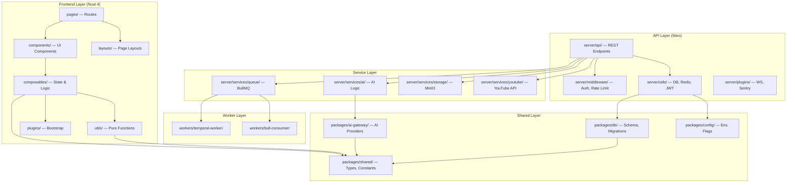
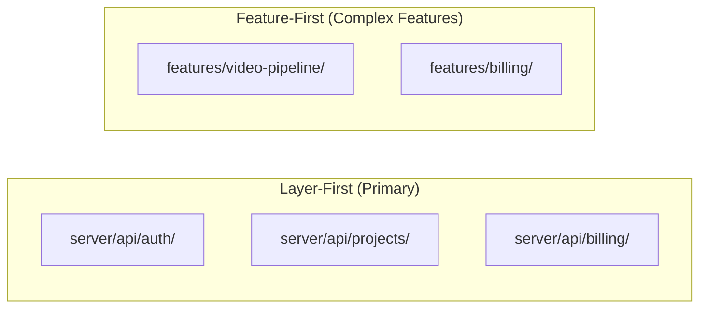
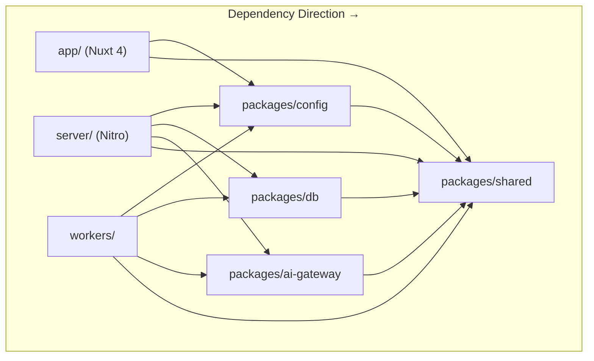
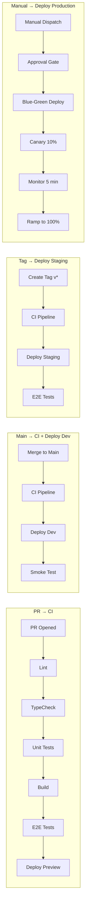
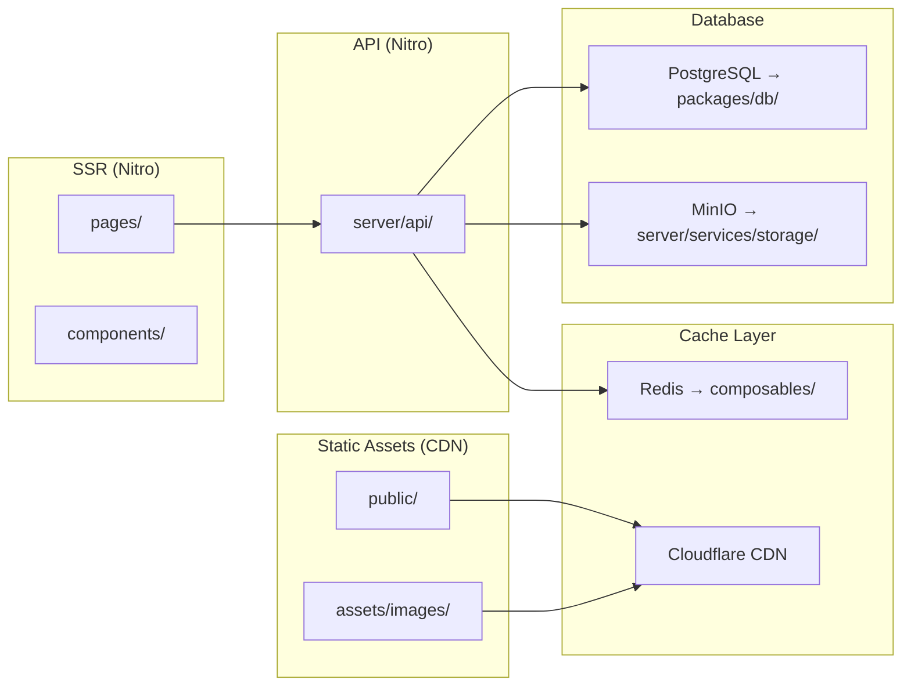

# Project Structure — Vidara AI

> **Project:** Vidara AI — AI YouTube Video Generator SaaS  
> **Author:** Platform Engineering Team  
> **Last Updated:** 2026-06-26  
> **Status:** Approved  
> **Cross-Reference:** [Tech Stack](techstack.md) · [Architecture](architecture.md) · [DevOps](devops.md) · [Coding Standard](coding-standard.md) · [Database](database.md)

---

## 1. Tujuan

Dokumen ini mendefinisikan directory structure dan code organization untuk project Vidara AI. Mencakup complete directory tree, purpose setiap directory, module boundaries, file naming conventions, import path aliases, code organization patterns, module dependency rules, scaling strategy, dan testing directory structure. Bertujuan memberikan panduan navigasi dan organisasi kode yang konsisten bagi seluruh tim.

---

## 2. Background

Vidara AI adalah monorepo berbasis Nuxt 4 dengan pnpm workspace. Struktur direktori mengikuti Nuxt 4 conventions dengan tambahan layer untuk packages (shared types, AI gateway, database), workers (Temporal, BullMQ), dan infrastructure (Docker, CI/CD, monitoring). Detail arsitektur lengkap di `architecture.md` dan tech stack di `techstack.md`.

---

## 3. Objective

1. Mendokumentasikan directory tree secara lengkap.
2. Menjelaskan purpose setiap directory dan file.
3. Mendefinisikan module boundaries dan dependency rules.
4. Menyediakan panduan file naming conventions per directory.
5. Mendokumentasikan import path aliases dan konfigurasinya.
6. Menjelaskan code organization patterns (feature-first vs layer-first).
7. Menyediakan panduan scaling the structure untuk fitur baru.
8. Mendokumentasikan testing directory structure.

---

## 4. Complete Directory Tree

```mermaid
graph TB
    subgraph "Vidara AI Monorepo Root"
        ROOT["📁 vidara-ai/"]
    end

    ROOT --> GITHUB[".github/"]
    ROOT --> ASSETS["assets/"]
    ROOT --> COMPONENTS["components/"]
    ROOT --> COMPOSABLES["composables/"]
    ROOT --> LAYOUTS["layouts/"]
    ROOT --> MIDDLEWARE["middleware/"]
    ROOT --> MODULES["modules/"]
    ROOT --> PAGES["pages/"]
    ROOT --> PLUGINS["plugins/"]
    ROOT --> PUBLIC["public/"]
    ROOT --> SERVER["server/"]
    ROOT --> UTILS["utils/"]
    ROOT --> PACKAGES["packages/"]
    ROOT --> WORKERS_ROOT["workers/"]
    ROOT --> TESTS["tests/"]
    ROOT --> SCRIPTS["scripts/"]
    ROOT --> DOCKER["docker/"]
    ROOT --> INTERNAL["internal/"]

    ROOT --> NUXT["nuxt.config.ts"]
    ROOT --> TSCONFIG["tsconfig.json"]
    ROOT --> ESLINT["eslint.config.js"]
    ROOT --> PACKAGE["package.json"]
    ROOT --> PNPM["pnpm-workspace.yaml"]
    ROOT --> DOCKER_COMPOSE["docker-compose.yml"]
    ROOT --> DOCKERFILE["Dockerfile"]
    ROOT --> ENV[".env.example"]
    ROOT --> GITIGNORE[".gitignore"]
    ROOT --> EDITORCONFIG[".editorconfig"]
    ROOT --> PRETTIER[".prettierrc"]
    ROOT --> VITEST["vitest.config.ts"]
    ROOT --> PLAYWRIGHT["playwright.config.ts"]

    GITHUB --> WORKFLOWS[".github/workflows/"]
    WORKFLOWS --> CI["ci.yml"]
    WORKFLOWS --> DEV_DEPLOY["deploy-dev.yml"]
    WORKFLOWS --> STG_DEPLOY["deploy-staging.yml"]
    WORKFLOWS --> PROD_DEPLOY["deploy-production.yml"]
    WORKFLOWS --> SEC_SCAN["security-scan.yml"]

    ASSETS --> CSS["assets/css/"]
    ASSETS --> FONTS["assets/fonts/"]
    ASSETS --> IMAGES["assets/images/"]
    CSS --> MAIN_CSS["main.css"]
    CSS --> TRANS_CSS["transitions.css"]
    IMAGES --> BRAND["brand/"]
    IMAGES --> ILLUSTRATIONS["illustrations/"]
    IMAGES --> ICONS["icons/"]

    COMPONENTS --> COMMON["common/"]
    COMPONENTS --> DASHBOARD["dashboard/"]
    COMPONENTS --> EDITOR["editor/"]
    COMPONENTS --> PIPELINE["pipeline/"]
    COMPONENTS --> AI_CATEGORY["ai/"]
    COMPONENTS --> BILLING["billing/"]

    LAYOUTS --> DEFAULT_LAYOUT["default.vue"]
    LAYOUTS --> AUTH_LAYOUT["auth.vue"]
    LAYOUTS --> WORKSPACE_LAYOUT["workspace.vue"]
    LAYOUTS --> ADMIN_LAYOUT["admin.vue"]
    LAYOUTS --> MINIMAL_LAYOUT["minimal.vue"]

    MIDDLEWARE --> AUTH_MW["auth.ts"]
    MIDDLEWARE --> ORG_MW["organization.ts"]
    MIDDLEWARE --> AUDIT_MW["audit.ts"]
    MIDDLEWARE --> SUB_MW["subscription.ts"]

    MODULES --> CUSTOM_MOD["custom-module/"]

    PAGES --> INDEX["index.vue"]
    PAGES --> AUTH_DIR["auth/"]
    PAGES --> DASHBOARD_PAGE["dashboard.vue"]
    PAGES --> WORKSPACE_PAGE["workspace.vue"]
    PAGES --> PROJECT_DIR["project/"]
    PAGES --> SETTINGS_DIR["settings/"]
    PAGES --> BILLING_DIR["billing/"]
    PAGES --> ANALYTICS_PAGE["analytics.vue"]

    AUTH_DIR --> LOGIN["login.vue"]
    AUTH_DIR --> REGISTER["register.vue"]
    AUTH_DIR --> CALLBACK["callback.vue"]

    PROJECT_DIR --> PROJECT_ID["[id]/"]
    PROJECT_ID --> PROJ_INDEX["index.vue"]
    PROJECT_ID --> PROJ_SCRIPT["script.vue"]
    PROJECT_ID --> PROJ_SCENES["scenes.vue"]
    PROJECT_ID --> PROJ_IMAGES["images.vue"]
    PROJECT_ID --> PROJ_VOICE["voice.vue"]
    PROJECT_ID --> PROJ_COMPOSE["compose.vue"]
    PROJECT_ID --> PROJ_THUMB["thumbnail.vue"]
    PROJECT_ID --> PROJ_PUBLISH["publish.vue"]

    SETTINGS_DIR --> SETTINGS_INDEX["index.vue"]
    SETTINGS_DIR --> PROFILE["profile.vue"]
    SETTINGS_DIR --> SETT_BILLING["billing.vue"]
    SETTINGS_DIR --> API_KEYS["api-keys.vue"]

    BILLING_DIR --> BILL_INDEX["index.vue"]
    BILLING_DIR --> PLANS["plans.vue"]
    BILLING_DIR --> INVOICES["invoices.vue"]

    SERVER --> API_DIR["api/"]
    SERVER --> SRV_MIDDLEWARE["middleware/"]
    SERVER --> SRV_UTILS["utils/"]
    SERVER --> SRV_SERVICES["services/"]
    SERVER --> WORKERS_DIR["workers/"]
    SERVER --> DATABASE_DIR["database/"]
    SERVER --> PLUGINS_DIR["plugins/"]
    SERVER --> ROUTES_DIR["routes/"]

    API_DIR --> AUTH_API["auth/"]
    API_DIR --> ORGS_API["organizations/"]
    API_DIR --> PROJ_API["projects/"]
    API_DIR --> VIDEOS_API["videos/"]
    API_DIR --> SCENES_API["scenes/"]
    API_DIR --> SCRIPTS_API["scripts/"]
    API_DIR --> PROMPTS_API["prompts/"]
    API_DIR --> IMAGES_API["images/"]
    API_DIR --> VOICES_API["voices/"]
    API_DIR --> ASSETS_API["assets/"]
    API_DIR --> TEMPLATES_API["templates/"]
    API_DIR --> RENDER_API["render/"]
    API_DIR --> YT_API["youtube/"]
    API_DIR --> BILL_API["billing/"]
    API_DIR --> ADMIN_API["admin/"]

    SRV_SERVICES --> AI_SVC["ai/"]
    SRV_SERVICES --> QUEUE_SVC["queue/"]
    SRV_SERVICES --> STORAGE_SVC["storage/"]
    SRV_SERVICES --> YT_SVC["youtube/"]

    WORKERS_DIR --> TEMPORAL["temporal/"]
    WORKERS_DIR --> BULLMQ["bullmq/"]

    DATABASE_DIR --> MIGRATIONS["migrations/"]
    DATABASE_DIR --> SEEDS["seeds/"]
    DATABASE_DIR --> SCHEMA_DIR["schema/"]

    PACKAGES --> SHARED["shared/"]
    PACKAGES --> AI_GATEWAY["ai-gateway/"]
    PACKAGES --> DB_PKG["db/"]
    PACKAGES --> CONFIG_PKG["config/"]

    WORKERS_ROOT --> TEMPORAL_WORKER["temporal-worker/"]
    WORKERS_ROOT --> BULL_CONSUMER["bull-consumer/"]

    TESTS --> UNIT["unit/"]
    TESTS --> INTEGRATION["integration/"]
    TESTS --> E2E["e2e/"]
    TESTS --> LOAD["load/"]

    SCRIPTS --> MIGRATE_SCRIPT["migrate.ts"]
    SCRIPTS --> SEED_SCRIPT["seed.ts"]
    SCRIPTS --> BENCH_SCRIPT["benchmark.ts"]
    SCRIPTS --> BACKUP_DIR["backup/"]
    SCRIPTS --> DEPLOY_DIR["deploy/"]
    SCRIPTS --> DR_DIR["dr/"]

    DOCKER --> DOCKER_WEB["Dockerfile.web"]
    DOCKER --> DOCKER_WORKER["Dockerfile.worker"]
    DOCKER --> NGINX_DIR["nginx/"]
    DOCKER --> COMPOSE_OVERRIDES["docker-compose.prod.yml"]
    DOCKER --> COMPOSE_STAGING["docker-compose.staging.yml"]
    DOCKER --> COMPOSE_MON["docker-compose.monitoring.yml"]

    INTERNAL --> DOCS["docs/"]
    DOCS --> ALL_DOCS["*.md"]
```



---

## 5. Directory Tree (Text)

```
vidara-ai/
│
├── .github/
│   └── workflows/
│       ├── ci.yml                    # CI pipeline: lint → typecheck → test → build → docker
│       ├── deploy-dev.yml            # Auto-deploy to dev.vidara.ai
│       ├── deploy-staging.yml        # Manual deploy to staging.vidara.ai
│       ├── deploy-production.yml     # Blue-green + canary to vidara.ai
│       └── security-scan.yml         # Weekly SAST + dependency + container scan
│
├── assets/
│   ├── css/
│   │   ├── main.css                  # Tailwind v4 imports, design tokens, @theme
│   │   └── transitions.css           # Page/route transition definitions
│   ├── fonts/                        # Self-hosted fonts (Inter, Plus Jakarta Sans)
│   └── images/
│       ├── brand/                    # Logo, favicon, brand assets
│       ├── illustrations/            # SVG illustrations for empty states, errors
│       └── icons/                    # Custom SVG icons (if not in Heroicons)
│
├── components/
│   ├── common/                       # Shared components: BaseButton, BaseInput, BaseModal
│   ├── dashboard/                    # Dashboard-specific: StatsCard, ActivityFeed, ProjectList
│   ├── editor/                       # Video editor: Timeline, Preview, ClipEditor, TrackPanel
│   ├── pipeline/                     # Pipeline UI: PipelineProgress, StepIndicator, StatusBadge
│   ├── ai/                           # AI-related: PromptInput, ScriptViewer, ImageGallery
│   └── billing/                      # Billing: PlanCard, InvoiceTable, SubscriptionForm
│
├── composables/
│   ├── useAuth.ts                    # Auth state, login, logout, token management
│   ├── useVideo.ts                   # Video generation pipeline state & control
│   ├── useOrganization.ts            # Organization context, member management
│   ├── useSubscription.ts            # Plan info, limits, billing portal
│   ├── useProject.ts                 # Project CRUD operations
│   ├── useWebSocket.ts               # WebSocket connection & event handlers
│   ├── useMediaUpload.ts             # File upload to MinIO with progress tracking
│   ├── useDebounce.ts                # Debounced reactive value
│   ├── useBreakpoints.ts             # Responsive breakpoint utilities
│   └── usePagination.ts              # Pagination state & logic
│
├── layouts/
│   ├── default.vue                   # Navbar + sidebar + footer, used by most pages
│   ├── auth.vue                      # Centered card layout for login/register
│   ├── workspace.vue                 # Full-screen editor layout (no sidebar)
│   ├── admin.vue                     # Admin panel with admin navigation
│   └── minimal.vue                   # Minimal blank canvas for landing pages
│
├── middleware/
│   ├── auth.ts                       # Global: redirects to /auth/login if unauthenticated
│   ├── organization.ts               # Global: loads organization context
│   ├── audit.ts                      # Global: logs page views to analytics
│   └── subscription.ts               # Global: checks plan limits before route access
│
├── modules/
│   └── custom-module/                # Custom Nuxt 4 module (example)
│       ├── module.ts                 # Module entry point
│       ├── runtime/                  # Runtime code (composables, components)
│       └── playground/               # Playground for module development
│
├── pages/
│   ├── index.vue                     → / (landing page)
│   ├── auth/
│   │   ├── login.vue                 → /auth/login
│   │   ├── register.vue              → /auth/register
│   │   └── callback.vue              → /auth/callback (OAuth callback)
│   ├── dashboard.vue                 → /dashboard
│   ├── workspace.vue                 → /workspace
│   ├── project/
│   │   └── [id]/
│   │       ├── index.vue             → /project/:id (overview)
│   │       ├── script.vue            → /project/:id/script
│   │       ├── scenes.vue            → /project/:id/scenes
│   │       ├── images.vue            → /project/:id/images
│   │       ├── voice.vue             → /project/:id/voice
│   │       ├── compose.vue           → /project/:id/compose
│   │       ├── thumbnail.vue         → /project/:id/thumbnail
│   │       └── publish.vue           → /project/:id/publish
│   ├── settings/
│   │   ├── index.vue                 → /settings (overview)
│   │   ├── profile.vue               → /settings/profile
│   │   ├── billing.vue               → /settings/billing
│   │   └── api-keys.vue              → /settings/api-keys
│   ├── billing/
│   │   ├── index.vue                 → /billing
│   │   ├── plans.vue                 → /billing/plans
│   │   └── invoices.vue              → /billing/invoices
│   └── analytics.vue                 → /analytics
│
├── plugins/
│   ├── api-client.ts                 # Provides $api (wrapped $fetch with auth)
│   ├── websocket.ts                  # Initializes WebSocket connection
│   ├── sentry.ts                     # Initializes Sentry error tracking
│   ├── toast.ts                      # Registers toast notification system
│   └── vue-query.ts                  # TanStack Vue Query setup for data fetching
│
├── public/
│   ├── favicon.ico                   # Browser tab icon
│   ├── robots.txt                    # SEO: crawler rules
│   └── _redirects                    # Netlify/Cloudflare Pages redirects
│
├── server/
│   ├── api/
│   │   ├── auth/                     # POST login, POST register, GET callback, POST refresh
│   │   ├── organizations/            # GET/POST/PATCH organizations
│   │   ├── projects/                 # CRUD projects, list, search
│   │   ├── videos/                   # GET video list, GET presigned URL
│   │   ├── scenes/                   # Scene management
│   │   ├── scripts/                  # Script generation & editing
│   │   ├── prompts/                  # Prompt templates & history
│   │   ├── images/                   # Image generation & management
│   │   ├── voices/                   # Voice selection & generation
│   │   ├── assets/                   # Asset upload & management
│   │   ├── templates/                # Project templates CRUD
│   │   ├── render/                   # Trigger render, get render status
│   │   ├── youtube/                  # YouTube auth, publish, analytics
│   │   ├── billing/                  # Subscription, invoices, usage
│   │   └── admin/                    # Admin dashboard, user management
│   ├── middleware/
│   │   ├── auth.ts                   # JWT verification
│   │   ├── rate-limit.ts             # Rate limiting via Redis
│   │   ├── cors.ts                   # CORS headers
│   │   ├── request-id.ts             # Trace ID generation
│   │   └── audit-log.ts              # API request logging
│   ├── utils/
│   │   ├── db.ts                     # PostgreSQL client (drizzle ORM)
│   │   ├── redis.ts                  # Redis client (ioredis)
│   │   ├── minio.ts                  # MinIO/S3 client
│   │   ├── temporal.ts               # Temporal client
│   │   ├── jwt.ts                    # JWT sign/verify utilities
│   │   ├── validation.ts             # Zod schema helpers
│   │   └── errors.ts                 # AppError classes
│   ├── services/
│   │   ├── ai/
│   │   │   ├── pipeline.ts           # AI pipeline orchestration logic
│   │   │   ├── script.ts             # Script generation service
│   │   │   ├── voiceover.ts          # TTS service
│   │   │   ├── subtitle.ts           # STT + translation service
│   │   │   ├── footage.ts            # Footage search/generation
│   │   │   └── thumbnail.ts          # Thumbnail generation
│   │   ├── queue/
│   │   │   ├── producer.ts           # BullMQ job producer
│   │   │   ├── consumer.ts           # BullMQ job consumer
│   │   │   └── queues.ts             # Queue definitions
│   │   ├── storage/
│   │   │   ├── object-store.ts       # MinIO operations
│   │   │   └── presigned-url.ts      # Presigned URL generation
│   │   └── youtube/
│   │       ├── auth.ts               # YouTube OAuth
│   │       ├── upload.ts             # Video upload
│   │       ├── analytics.ts          # Analytics fetch
│   │       └── quota.ts              # Quota management
│   ├── workers/
│   │   ├── temporal/
│   │   │   ├── workflows/            # Temporal workflow definitions
│   │   │   │   └── video-pipeline.workflow.ts
│   │   │   ├── activities/           # Temporal activity implementations
│   │   │   │   ├── script.activity.ts
│   │   │   │   ├── voiceover.activity.ts
│   │   │   │   ├── subtitle.activity.ts
│   │   │   │   ├── footage.activity.ts
│   │   │   │   ├── render.activity.ts
│   │   │   │   └── publish.activity.ts
│   │   │   └── index.ts
│   │   └── bullmq/
│   │       ├── queues.ts             # BullMQ queue definitions
│   │       ├── workers.ts            # BullMQ worker definitions
│   │       └── jobs.ts               # Job type definitions
│   ├── database/
│   │   ├── migrations/               # Drizzle Kit migration files
│   │   ├── seeds/
│   │   │   ├── users.seed.ts         # User seed data
│   │   │   ├── plans.seed.ts         # Plan seed data
│   │   │   └── prompts.seed.ts       # Prompt template seed data
│   │   ├── schema/
│   │   │   ├── users.schema.ts       # Users table schema
│   │   │   ├── projects.schema.ts    # Projects table schema
│   │   │   ├── assets.schema.ts      # Assets table schema
│   │   │   ├── subscriptions.schema.ts
│   │   │   ├── plans.schema.ts
│   │   │   ├── invoices.schema.ts
│   │   │   └── api-keys.schema.ts
│   │   └── client.ts                 # Drizzle ORM client initialization
│   └── plugins/
│       ├── websocket.ts              # WebSocket server setup
│       ├── sentry.ts                 # Sentry server-side setup
│       └── cors.ts                   # CORS configuration
│
├── utils/
│   ├── format.ts                     # formatDuration(), formatDate(), formatBytes()
│   ├── validation.ts                 # validateEmail(), validateUrl(), validatePrompt()
│   ├── slug.ts                       # generateSlug(), slugify()
│   ├── api-client.ts                 # Wrapper around $fetch with auth
│   ├── youtube.ts                    # YouTube URL parsing & formatting
│   └── constants.ts                  # Application-wide constants
│
├── packages/
│   ├── shared/
│   │   ├── src/
│   │   │   ├── types/
│   │   │   │   ├── project.ts        # Project, ProjectStatus, VideoConfig types
│   │   │   │   ├── user.ts           # User, AuthProvider, UserRole types
│   │   │   │   ├── video.ts          # Video, PipelineStep, RenderStatus types
│   │   │   │   ├── billing.ts        # Plan, Subscription, Invoice types
│   │   │   │   ├── api.ts            # ApiResponse, ApiError, PaginatedResponse
│   │   │   │   └── index.ts
│   │   │   ├── constants/
│   │   │   │   ├── plans.ts          # Plan config, limits, prices
│   │   │   │   ├── pipeline.ts       # Pipeline steps, timeouts, error codes
│   │   │   │   └── index.ts
│   │   │   ├── validators/
│   │   │   │   ├── project.ts        # Zod schemas for project API
│   │   │   │   ├── auth.ts           # Zod schemas for auth API
│   │   │   │   ├── billing.ts        # Zod schemas for billing API
│   │   │   │   └── index.ts
│   │   │   └── index.ts
│   │   ├── package.json
│   │   └── tsconfig.json
│   ├── ai-gateway/
│   │   ├── src/
│   │   │   ├── providers/
│   │   │   │   ├── openai.ts         # OpenAI provider (GPT-5o, DALL-E 4, TTS)
│   │   │   │   ├── elevenlabs.ts     # ElevenLabs provider (TTS)
│   │   │   │   ├── runway.ts         # Runway provider (Gen-4 video)
│   │   │   │   ├── deepgram.ts       # Deepgram provider (STT)
│   │   │   │   ├── flux.ts           # Flux 2 Pro provider (image)
│   │   │   │   └── index.ts
│   │   │   ├── circuit-breaker.ts    # Circuit breaker implementation
│   │   │   ├── retry-strategy.ts     # Retry with exponential backoff
│   │   │   ├── fallback-chain.ts     # Provider fallback chain logic
│   │   │   ├── rate-limiter.ts       # Per-provider rate limiting
│   │   │   └── index.ts
│   │   ├── __tests__/
│   │   ├── package.json
│   │   └── tsconfig.json
│   ├── db/
│   │   ├── src/
│   │   │   ├── client.ts             # Drizzle client with connection pooling
│   │   │   ├── schema/               # Shared database schema definitions
│   │   │   ├── migrations/           # Migration files
│   │   │   ├── seeds/                # Seed data
│   │   │   └── index.ts
│   │   ├── package.json
│   │   └── tsconfig.json
│   └── config/
│       ├── src/
│       │   ├── env.ts                # Environment variable loader
│       │   ├── redis.ts              # Redis connection config
│       │   ├── minio.ts              # MinIO connection config
│       │   ├── temporal.ts           # Temporal connection config
│       │   ├── feature-flags.ts      # Feature flag definitions
│       │   └── index.ts
│       ├── package.json
│       └── tsconfig.json
│
├── workers/
│   ├── temporal-worker/
│   │   ├── src/
│   │   │   ├── main.ts               # Temporal worker entry point
│   │   │   ├── activities/           # Activity implementations
│   │   │   └── workflows/            # Workflow definitions
│   │   ├── package.json
│   │   ├── tsconfig.json
│   │   └── Dockerfile
│   └── bull-consumer/
│       ├── src/
│       │   ├── main.ts               # BullMQ consumer entry point
│       │   └── processors/           # Job processors
│       ├── package.json
│       ├── tsconfig.json
│       └── Dockerfile
│
├── tests/
│   ├── unit/
│   │   ├── composables/              # Composable unit tests
│   │   ├── utils/                    # Utility function tests
│   │   ├── stores/                   # Pinia store tests
│   │   └── server/                   # Server route unit tests
│   ├── integration/
│   │   ├── api/                      # API integration tests
│   │   ├── database/                 # Database integration tests
│   │   └── pipeline/                 # Pipeline integration tests
│   ├── e2e/
│   │   ├── auth.e2e.spec.ts          # Auth flow E2E tests
│   │   ├── project.e2e.spec.ts       # Project CRUD E2E tests
│   │   ├── pipeline.e2e.spec.ts      # Pipeline flow E2E tests
│   │   └── billing.e2e.spec.ts       # Billing flow E2E tests
│   ├── load/
│   │   ├── api-load.js               # k6 API load test
│   │   ├── pipeline-load.js          # k6 pipeline load test
│   │   └── scenarios/                # Load test scenarios
│   └── mocks/
│       ├── server/                   # Mock server handlers
│       └── providers/                # Mock AI provider responses
│
├── scripts/
│   ├── migrate.ts                    # Database migration runner
│   ├── seed.ts                       # Database seed runner
│   ├── benchmark.ts                  # Performance benchmark runner
│   ├── backup/
│   │   ├── postgres-full.sh          # Full PostgreSQL dump
│   │   ├── postgres-wal.sh           # WAL archiving
│   │   └── verify-backup.sh          # Backup integrity check
│   ├── deploy/
│   │   ├── canary.sh                 # Canary traffic routing
│   │   ├── rollback.sh               # Deployment rollback
│   │   └── smoke-test.sh             # Post-deploy smoke test
│   └── dr/
│       ├── restore.sh                # Disaster recovery restore
│       └── verify.sh                 # DR verification
│
├── docker/
│   ├── Dockerfile.web                # Nuxt 4 production image
│   ├── Dockerfile.worker             # Temporal worker production image
│   ├── docker-compose.yml            # Base Docker Compose
│   ├── docker-compose.prod.yml       # Production overrides
│   ├── docker-compose.staging.yml    # Staging overrides
│   ├── docker-compose.monitoring.yml # Prometheus + Grafana + Loki
│   └── nginx/
│       ├── default.conf              # Nginx reverse proxy config
│       └── security-headers.conf     # Security headers snippet
│
├── internal/
│   └── docs/                         # Internal documentation
│       ├── techstack.md              # Tech stack decisions
│       ├── architecture.md           # C4 architecture diagrams
│       ├── devops.md                 # DevOps & CI/CD
│       ├── coding-standard.md        # Coding conventions
│       ├── project-structure.md      # This file
│       ├── database.md               # Database schema & ERD
│       ├── api.md                    # API specification
│       ├── deployment.md             # Deployment guide
│       ├── monitoring.md             # Monitoring setup
│       ├── observability.md          # Observability stack
│       ├── security.md               # Security architecture
│       ├── design.md                 # Design system
│       ├── wireframe.md              # Wireframes
│       ├── prd.md                    # Product requirements
│       ├── frd.md                    # Functional requirements
│       ├── brd.md                    # Business requirements
│       ├── blueprint.md              # Development blueprint
│       ├── workflow.md               # Pipeline workflow
│       ├── prompt-engineering.md     # AI prompt guide
│       ├── cost-estimation.md        # Cost estimation
│       ├── roadmap.md                # Project roadmap
│       ├── erd.md                    # Entity relationship diagram
│       └── AGENTS.md                 # AI agent system architecture
│
├── app.config.ts                     # Public app config (theme, defaults)
├── nuxt.config.ts                    # Main Nuxt 4 configuration
├── tsconfig.json                     # TypeScript configuration
├── eslint.config.js                  # ESLint flat config
├── tailwind.config.ts                # Tailwind CSS v4 config (extended)
├── vitest.config.ts                  # Vitest configuration
├── playwright.config.ts              # Playwright E2E configuration
├── docker-compose.yml                # Root Docker Compose
├── Dockerfile                        # Root Dockerfile (optional)
├── .env.example                      # Environment variables template
├── .editorconfig                     # Editor settings
├── .prettierrc                       # Prettier config
├── .gitignore                        # Git ignore rules
├── .npmrc                            # npm/pnpm config
├── package.json                      # Root package.json (pnpm workspace)
├── pnpm-workspace.yaml               # pnpm workspace definition
└── README.md                         # Project README
```

---

## 6. Purpose of Each Directory

### 6.1 Root Configuration Files

| File | Purpose | Referensi |
|---|---|---|
| `nuxt.config.ts` | Nuxt 4 configuration: modules, runtime config, build, server | `techstack.md` §15.1 |
| `tsconfig.json` | TypeScript strict configuration with path aliases | `coding-standard.md` §3.1 |
| `eslint.config.js` | ESLint flat config with Vue + TypeScript rules | `coding-standard.md` §10.1 |
| `vitest.config.ts` | Unit test configuration with coverage thresholds | `coding-standard.md` §8.4 |
| `playwright.config.ts` | E2E test configuration | `devops.md` §7.2 |
| `app.config.ts` | Public app config (theme, supported features) | `coding-standard.md` §5.9 |
| `docker-compose.yml` | Local development orchestration | `devops.md` §9.1 |
| `pnpm-workspace.yaml` | Monorepo workspace definition | `architecture.md` §15 |

### 6.2 `assets/` — Static Assets

CSS, fonts, images yang diproses oleh Vite/Nuxt.

| Subdirectory | Purpose |
|---|---|
| `css/main.css` | Tailwind v4 entry point: `@import 'tailwindcss'`, custom `@theme` tokens |
| `css/transitions.css` | Vue transition classes for page/route changes |
| `fonts/` | Self-hosted fonts (woff2) |
| `images/brand/` | Logo, icon, brand assets (SVG preferred) |
| `images/illustrations/` | SVG illustrations for empty states, hero sections, error pages |
| `images/icons/` | Custom SVG icons not available in Heroicons |

### 6.3 `components/` — Vue Components

Auto-imported oleh Nuxt 4. No manual import needed.

| Subdirectory | Scope | Example Components |
|---|---|---|
| `common/` | Shared across features | `BaseButton.vue`, `BaseInput.vue`, `BaseModal.vue`, `BaseTable.vue`, `EmptyState.vue`, `LoadingSpinner.vue` |
| `dashboard/` | Dashboard feature | `StatsCard.vue`, `ActivityFeed.vue`, `ProjectList.vue`, `QuickActions.vue` |
| `editor/` | Video editor workspace | `VideoTimeline.vue`, `PreviewPlayer.vue`, `ClipEditor.vue`, `TrackPanel.vue`, `Toolbar.vue` |
| `pipeline/` | Pipeline progress display | `PipelineProgress.vue`, `StepIndicator.vue`, `StatusBadge.vue`, `ProgressBar.vue` |
| `ai/` | AI interaction components | `PromptInput.vue`, `ScriptViewer.vue`, `ImageGallery.vue`, `VoiceSelector.vue`, `AISettings.vue` |
| `billing/` | Billing & subscription | `PlanCard.vue`, `InvoiceTable.vue`, `SubscriptionForm.vue`, `UsageMeter.vue` |

**Naming Convention:** PascalCase, multi-word (`VideoTimeline.vue`, not `Timeline.vue`)

### 6.4 `composables/` — Vue Composables

Auto-imported by Nuxt 4. Semua composables menggunakan prefix `use*`.

| Composable | Responsibility |
|---|---|
| `useAuth.ts` | Authentication state, login, register, logout, token refresh |
| `useVideo.ts` | Video pipeline state machine, pipeline control |
| `useOrganization.ts` | Current organization context, member list, roles |
| `useSubscription.ts` | Plan details, usage limits, billing portal URL |
| `useProject.ts` | Project CRUD, search, filtering |
| `useWebSocket.ts` | WebSocket connection lifecycle, event subscription |
| `useMediaUpload.ts` | File upload to MinIO with chunking and progress |
| `useDebounce.ts` | Generic debounced ref |
| `useBreakpoints.ts` | Tailwind breakpoint detection as reactive refs |
| `usePagination.ts` | Pagination state, page controls |

**Testing:** Setiap composable memiliki test file di `__tests__/` sibling atau di `tests/unit/composables/`.

### 6.5 `layouts/` — Page Layouts

Auto-imported by Nuxt 4. Define page structure with `<slot />`.

| Layout | Usage |
|---|---|
| `default.vue` | Most pages: navbar at top, sidebar on left, footer at bottom |
| `auth.vue` | Auth pages: centered card on gradient background |
| `workspace.vue` | Video editor: full-screen, no sidebar, minimal chrome |
| `admin.vue` | Admin panel: admin-specific navigation, wider sidebar |
| `minimal.vue` | Landing pages, marketing: header + content + footer |

### 6.6 `middleware/` — Route Middleware

Auto-imported by Nuxt 4. Runs before page navigation.

| Middleware | Type | Purpose |
|---|---|---|
| `auth.ts` | Global | Redirect unauthenticated users to `/auth/login` |
| `organization.ts` | Global | Fetch and attach organization context |
| `audit.ts` | Global | Log page views to analytics |
| `subscription.ts` | Global | Check plan limits, redirect if exceeded |

### 6.7 `pages/` — File-Based Routes

Nuxt 4 file-based routing. Setiap file menjadi route.

**Route Structure:**

```
/                       → index.vue (Landing)
/auth/login             → auth/login.vue
/auth/register          → auth/register.vue
/auth/callback          → auth/callback.vue  (OAuth)
/dashboard              → dashboard.vue
/workspace              → workspace.vue
/project/:id            → project/[id]/index.vue
/project/:id/script     → project/[id]/script.vue
/project/:id/scenes     → project/[id]/scenes.vue
/project/:id/images     → project/[id]/images.vue
/project/:id/voice      → project/[id]/voice.vue
/project/:id/compose    → project/[id]/compose.vue
/project/:id/thumbnail  → project/[id]/thumbnail.vue
/project/:id/publish    → project/[id]/publish.vue
/settings               → settings/index.vue
/settings/profile       → settings/profile.vue
/settings/billing       → settings/billing.vue
/settings/api-keys      → settings/api-keys.vue
/billing                → billing/index.vue
/billing/plans          → billing/plans.vue
/billing/invoices       → billing/invoices.vue
/analytics              → analytics.vue
```

### 6.8 `plugins/` — Nuxt Plugins

Run sekali saat aplikasi startup.

| Plugin | Purpose |
|---|---|
| `api-client.ts` | Provide `$api` — wrapped fetch with JWT auth, error handling |
| `websocket.ts` | Initialize WebSocket connection to Nitro server |
| `sentry.ts` | Initialize Sentry error tracking |
| `toast.ts` | Register toast notification composable |
| `vue-query.ts` | TanStack Vue Query for server state management |

### 6.9 `public/` — Public Static Files

Served directly (no processing).

| File | Purpose |
|---|---|
| `favicon.ico` | Browser tab icon |
| `robots.txt` | Search engine crawler rules |
| `_redirects` | SPA redirect rules for Cloudflare Pages |

### 6.10 `server/` — Nitro Server

Nuxt 4 server engine. Auto-imported, file-based routing.

**Subdirectory Structure:**

```
server/
├── api/                    # REST API endpoints (file-based routing)
│   ├── auth/               # Authentication endpoints
│   ├── projects/           # Project CRUD endpoints
│   ├── videos/             # Video management endpoints
│   └── ...
├── middleware/              # Server middleware
│   ├── auth.ts             # JWT verification
│   ├── rate-limit.ts       # Rate limiter
│   └── ...
├── utils/                  # Server-only utilities
│   ├── db.ts               # Database client
│   ├── redis.ts             # Redis client
│   └── ...
├── services/
│   ├── ai/                 # AI service layer
│   ├── queue/              # Queue service
│   ├── storage/            # Storage service
│   └── youtube/            # YouTube service
├── workers/
│   ├── temporal/           # Temporal workflow definitions
│   └── bullmq/             # BullMQ queue definitions
├── database/
│   ├── schema/             # Drizzle ORM schemas
│   ├── migrations/         # Migration files
│   └── seeds/              # Seed data
└── plugins/                # Nitro server plugins
```

### 6.11 `packages/` — Monorepo Packages

Shared libraries within the pnpm workspace.

| Package | Purpose | Dependencies |
|---|---|---|
| `@vidara/shared` | Types, constants, validators shared across all packages | 0 (pure TypeScript) |
| `@vidara/ai-gateway` | AI provider abstraction with circuit breaker & retry | `@vidara/shared` |
| `@vidara/db` | Database schema, migrations, client | `@vidara/shared` |
| `@vidara/config` | Shared configuration, env loader, feature flags | `@vidara/shared` |

### 6.12 `workers/` — Standalone Worker Processes

Docker containers yang berjalan terpisah dari server Nuxt.

| Worker | Purpose | Queue |
|---|---|---|
| `temporal-worker/` | Executes Temporal workflow activities | BullMQ → Temporal |
| `bull-consumer/` | Consumes BullMQ jobs, triggers Temporal | BullMQ |

### 6.13 `tests/` — Test Files

| Directory | Purpose | Framework |
|---|---|---|
| `tests/unit/` | Unit tests for composables, utils, stores, server routes | Vitest |
| `tests/integration/` | Integration tests for API, database, pipeline | Vitest |
| `tests/e2e/` | End-to-end browser tests | Playwright |
| `tests/load/` | Load and performance tests | k6 |
| `tests/mocks/` | Mock data and mock server handlers | MSW |

---

## 7. Module Boundaries

### 7.1 What Goes Where



### 7.2 Layer Responsibilities

| Layer | Responsibility | Can Access |
|---|---|---|
| **Frontend** | UI rendering, user interaction, client state | `packages/shared`, `composables/`, `utils/` |
| **API** | HTTP request handling, validation, auth | `server/utils/`, `server/services/`, all packages |
| **Service** | Business logic, AI orchestration, queue management | `server/utils/`, `packages/shared`, `packages/ai-gateway` |
| **Worker** | Background job execution, Temporal workflow | `packages/shared`, `packages/ai-gateway`, `server/utils/` |
| **Shared** | Pure types, constants, validation schemas | Nothing (zero dependencies) |

---

## 8. File Naming Conventions Per Directory

| Directory | Convention | Example |
|---|---|---|
| `components/` | `PascalCase.vue` | `VideoEditor.vue`, `ProjectCard.vue` |
| `composables/` | `use*.ts` | `useAuth.ts`, `useVideo.ts` |
| `utils/` | `kebab-case.ts` | `format-duration.ts`, `api-client.ts` |
| `pages/` | `kebab-case.vue`, `[param].vue` | `login.vue`, `[id].vue`, `script.vue` |
| `layouts/` | `kebab-case.vue` | `default.vue`, `workspace.vue` |
| `middleware/` | `kebab-case.ts` | `auth.ts`, `organization.ts` |
| `plugins/` | `kebab-case.ts` | `api-client.ts`, `websocket.ts` |
| `server/api/` | `kebab-case.{method}.ts` | `login.post.ts`, `[id].get.ts` |
| `server/middleware/` | `kebab-case.ts` | `rate-limit.ts`, `cors.ts` |
| `server/utils/` | `kebab-case.ts` | `db.ts`, `redis.ts` |
| `server/services/` | `kebab-case.ts` | `pipeline.ts`, `object-store.ts` |
| `server/database/schema/` | `kebab-case.schema.ts` | `users.schema.ts`, `projects.schema.ts` |
| `server/database/seeds/` | `kebab-case.seed.ts` | `users.seed.ts`, `plans.seed.ts` |
| `server/workers/temporal/` | `kebab-case.workflow.ts` / `.activity.ts` | `video-pipeline.workflow.ts`, `script.activity.ts` |
| `packages/*/src/` | `kebab-case.ts` | `project.ts`, `circuit-breaker.ts` |
| `tests/e2e/` | `*.e2e.spec.ts` | `auth.e2e.spec.ts` |
| `tests/unit/` | `*.test.ts` / `*.spec.ts` | `useAuth.test.ts` |
| `tests/load/` | `*.js` (k6) | `api-load.js` |
| `scripts/` | `kebab-case.sh` / `*.ts` | `postgres-full.sh`, `migrate.ts` |

---

## 9. Import Path Aliases

Konfigurasi di `tsconfig.json`:

```json
{
  "compilerOptions": {
    "paths": {
      "~/*": ["./app/*"],                          // Nuxt 4 app directory
      "@/*": ["./*"],                               // Root
      "@vidara/shared": ["./packages/shared/src"],   // Shared types
      "@vidara/shared/*": ["./packages/shared/src/*"],
      "@vidara/ai-gateway": ["./packages/ai-gateway/src"],
      "@vidara/ai-gateway/*": ["./packages/ai-gateway/src/*"],
      "@vidara/db": ["./packages/db/src"],
      "@vidara/db/*": ["./packages/db/src/*"],
      "@vidara/config": ["./packages/config/src"],
      "@vidara/config/*": ["./packages/config/src/*"]
    }
  }
}
```

**Usage Examples:**

```typescript
// ✅ Correct alias usage
import { ProjectStatus } from '@vidara/shared/types'
import { ProjectCreateSchema } from '@vidara/shared/validators/project'
import { createAIGateway } from '@vidara/ai-gateway'
import { db } from '@vidara/db/client'
import { loadEnv } from '@vidara/config/env'

import { useAuth } from '~/composables/useAuth'
import { formatDuration } from '~/utils/format'

import { ProjectCard } from '~/components/project/ProjectCard.vue'
import { databaseConfig } from '@/*/server/database/config'
```

---

## 10. Code Organization Patterns

### 10.1 Feature-First vs Layer-First

Vidara AI menggunakan **Layer-First** sebagai primary pattern untuk API layer dan **Feature-First** untuk complex features.



**Layer-First (Primary Pattern):**

```
server/api/
├── auth/                 # All auth-related endpoints
│   ├── login.post.ts
│   ├── register.post.ts
│   ├── callback.get.ts
│   └── refresh.post.ts
├── projects/             # All project-related endpoints
│   ├── index.get.ts
│   ├── index.post.ts
│   └── [id]/
│       ├── index.get.ts
│       ├── index.patch.ts
│       └── index.delete.ts
└── billing/              # All billing-related endpoints
    ├── subscription.get.ts
    ├── invoices.get.ts
    └── webhook.post.ts
```

**Feature-First (Complex Features — alternative):**

```
features/
├── video-pipeline/
│   ├── components/       # Pipeline-specific Vue components
│   │   ├── PipelineProgress.vue
│   │   └── StepStatus.vue
│   ├── composables/      # Pipeline-specific composables
│   │   └── usePipeline.ts
│   ├── stores/           # Pipeline-specific Pinia stores
│   │   └── pipeline.store.ts
│   ├── server/           # Pipeline-specific server routes
│   │   └── api/
│   │       ├── render.post.ts
│   │       └── status.get.ts
│   └── types/            # Pipeline-specific types
│       └── index.ts
└── billing/
    ├── components/
    │   ├── PlanCard.vue
    │   └── InvoiceTable.vue
    ├── composables/
    │   └── useBilling.ts
    ├── stores/
    │   └── billing.store.ts
    └── server/
        ├── api/
        │   ├── subscription.get.ts
        │   └── webhook.post.ts
        └── stripe/
            └── client.ts
```

**Kapan menggunakan masing-masing:**

| Pattern | Use When |
|---|---|
| **Layer-First** | Default untuk semua new features. Simple CRUD. |
| **Feature-First** | Complex feature dengan banyak components, composables, server routes. Feature team bekerja independent. |
| **Mixed** | Layer-first untuk API, feature-first untuk UI. Most common di Vidara AI. |

### 10.2 Component Organization Pattern

```vue
<template>
  <!-- Template section -->
</template>

<script setup lang="ts">
// 1. Imports (auto-imported don't need explicit import)
// 2. Props definition
const props = defineProps<{
  project: Project
  compact?: boolean
}>()

// 3. Emits definition
const emit = defineEmits<{
  'update:modelValue': [value: string]
  'delete': [id: string]
}>()

// 4. Composables
const { user } = useAuth()
const toast = useToast()

// 5. Refs & reactive state
const isEditing = ref(false)
const localValue = ref(props.project.title)

// 6. Computed
const formattedDate = computed(() => formatDate(props.project.createdAt))

// 7. Watchers
watch(() => props.project, (newVal) => {
  localValue.value = newVal.title
}, { deep: true })

// 8. Lifecycle
onMounted(() => {
  trackPageView('project-detail')
})

// 9. Methods
async function handleDelete() {
  await $fetch(`/api/projects/${props.project.id}`, { method: 'DELETE' })
  emit('delete', props.project.id)
  toast.add({ title: 'Project deleted', color: 'green' })
}
</script>

<style scoped>
/* Scoped styles — minimal, only when Tailwind cannot achieve */
.project-detail {
  transition: all 0.2s ease;
}
</style>
```

---

## 11. Module Dependency Rules



### 11.1 Strict Dependency Rules

| Rule | Enforcement | Violation Example |
|---|---|---|
| `packages/shared` must have ZERO dependencies | ESLint `import/no-extraneous-dependencies` | `shared` importing from `db` |
| `app/` must NOT import from `server/` | Path alias restriction | `app/` doing `import { db } from '@vidara/db'` |
| `server/` must NOT import from `app/` | Path alias restriction | `server/` doing `import { useAuth } from '~/composables/useAuth'` |
| No circular dependencies | CI with `dpdm` | `a → b → a` |
| Packages only depend on `shared` | Package.json audit | `ai-gateway` importing from `db` |

### 11.2 Enforced via CI

```bash
# scripts/verify-deps.sh
# Check no circular dependencies
pnpm exec dpdm packages/*/src/**/*.ts --circular --warning false

# Check package dependency rules
pnpm exec dependency-cruiser --config .dependency-cruiser.js src/
```

---

## 12. Scaling the Structure

### 12.1 Adding a New Feature

Template untuk menambah fitur baru:

```
# Step 1: Add types to packages/shared
packages/shared/src/types/feature-name.ts

# Step 2: Add validation schemas
packages/shared/src/validators/feature-name.ts

# Step 3: Add API routes
server/api/feature-name/
├── index.get.ts
├── index.post.ts
└── [id]/
    ├── index.get.ts
    └── index.patch.ts

# Step 4: Add service layer (if complex logic)
server/services/feature-name/
├── index.ts
└── helpers.ts

# Step 5: Add Vue components
components/feature-name/
├── FeatureList.vue
├── FeatureCard.vue
└── FeatureForm.vue

# Step 6: Add composable
composables/useFeatureName.ts

# Step 7: Add Pinia store (if needed)
stores/feature-name.store.ts

# Step 8: Add pages
pages/feature-name/
├── index.vue
├── [id].vue
└── create.vue

# Step 9: Add tests
tests/unit/composables/useFeatureName.test.ts
tests/integration/api/feature-name.integration.test.ts
tests/e2e/feature-name.e2e.spec.ts
```

### 12.2 Renaming/Moving Files

- **Components:** Update imports di semua file yang menggunakan (auto-import minimizies this)
- **Composables:** Rename file + function, update all usages
- **Server routes:** Rename file → route changes automatically
- **Packages:** Update `package.json` exports + `tsconfig.json` paths + all imports

### 12.3 Deprecating Files

1. Add JSDoc `@deprecated` tag
2. Create migration guide in commit message
3. Remove in next major version

---

## 13. Testing Directory Structure

### 13.1 Unit Tests (`tests/unit/`)

```
tests/unit/
├── composables/
│   ├── useAuth.test.ts
│   ├── useVideo.test.ts
│   ├── useProject.test.ts
│   └── usePagination.test.ts
├── utils/
│   ├── format.test.ts
│   ├── validation.test.ts
│   └── slug.test.ts
├── stores/
│   ├── project.store.test.ts
│   └── auth.store.test.ts
├── server/
│   ├── api/
│   │   ├── auth.test.ts
│   │   ├── projects.test.ts
│   │   └── billing.test.ts
│   └── services/
│       ├── pipeline.test.ts
│       └── youtube-auth.test.ts
└── packages/
    ├── shared/
    │   └── validators/
    │       ├── project.test.ts
    │       └── auth.test.ts
    └── ai-gateway/
        ├── circuit-breaker.test.ts
        └── retry-strategy.test.ts
```

### 13.2 Integration Tests (`tests/integration/`)

```
tests/integration/
├── api/
│   ├── auth-flow.test.ts          # Register → Login → Refresh → Logout
│   ├── project-crud.test.ts       # CRUD operations
│   ├── pipeline-flow.test.ts      # Full pipeline integration
│   └── billing-flow.test.ts       # Subscription → Invoice → Payment
├── database/
│   ├── migrations.test.ts          # Up/down migration integrity
│   └── seeds.test.ts               # Seed data verification
└── pipeline/
    ├── script-generation.test.ts   # GPT-5o → Save → Retrieve
    ├── voiceover.test.ts           # TTS → MinIO → Verify
    └── render.test.ts              # FFmpeg → Output → Checksum
```

### 13.3 E2E Tests (`tests/e2e/`)

```
tests/e2e/
├── auth.e2e.spec.ts                # Login with Google, Register, Logout
├── project.e2e.spec.ts             # Create, Edit, Delete project
├── pipeline.e2e.spec.ts            # Full pipeline: Prompt → Video Ready
├── billing.e2e.spec.ts             # Subscribe, Upgrade, Cancel
├── editor.e2e.spec.ts              # Timeline, Drag-drop, Preview
├── settings.e2e.spec.ts            # Profile, API keys, Preferences
├── admin.e2e.spec.ts               # Admin dashboard, User management
└── fixtures/                       # E2E test data
    ├── auth.fixture.ts
    ├── project.fixture.ts
    └── billing.fixture.ts
```

### 13.4 Load Tests (`tests/load/`)

```
tests/load/
├── scenarios/
│   ├── spike.js                    # Sudden traffic spike (100→1000 users)
│   ├── ramp-up.js                  # Gradual ramping (10→500 users)
│   ├── stress.js                   # Sustained load (200 users, 30 min)
│   └── soak.js                     # Long-duration test (50 users, 8 hours)
├── api-load.js                     # API endpoint stress test
├── pipeline-load.js                # Pipeline queue stress test
├── data/
│   └── test-payloads.json          # Sample request payloads
└── utils/
    └── helpers.js                  # k6 helper functions
```

### 13.5 Mocks (`tests/mocks/`)

```
tests/mocks/
├── server/
│   ├── handlers.ts                 # MSW request handlers
│   ├── server.ts                   # MSW server setup
│   └── data/
│       ├── users.ts                # Mock user data
│       ├── projects.ts             # Mock project data
│       └── billing.ts              # Mock billing data
└── providers/
    ├── openai.ts                   # Mock OpenAI API responses
    ├── elevenlabs.ts               # Mock ElevenLabs API responses
    ├── runway.ts                   # Mock Runway API responses
    └── deepgram.ts                 # Mock Deepgram API responses
```

---

## 14. Docker Structure

### 14.1 Dockerfiles

```
docker/
├── Dockerfile.web                   # Nuxt 4 production
│   # Stage 1: Install dependencies
│   # Stage 2: Build application
│   # Stage 3: Production image (distroless node)
│
├── Dockerfile.worker                # Temporal worker
│   # Stage 1: Install dependencies
│   # Stage 2: Build TypeScript
│   # Stage 3: Production image
│
└── nginx/
    ├── default.conf                 # Reverse proxy, static assets
    └── security-headers.conf        # CSP, HSTS, X-Frame-Options
```

### 14.2 Docker Compose Files

```yaml
# docker-compose.yml — Base (all envs)
services:
  api:          # Nitro server
  worker:       # Temporal worker
  postgres:     # PostgreSQL 16
  redis:        # Redis 7
  minio:        # MinIO object storage
  temporal:     # Temporal server
  temporal-ui:  # Temporal web UI
  nginx:        # Nginx reverse proxy
```

```yaml
# docker-compose.prod.yml — Production overrides
services:
  api:
    deploy:
      replicas: 3
      resources:
        limits:
          cpus: '2'
          memory: 4G
  postgres:
    volumes:
      - pgdata-prod:/var/lib/postgresql/data
```

---

## 15. Environment-Specific Overrides

### 15.1 Development

```
.env.development
nuxt.config.ts → dev mode
docker-compose.yml → all services
No SSL, hot-reload enabled
```

### 15.2 Staging

```
.env.staging
docker-compose.staging.yml → staging overrides
Cloudflare Tunnel → staging.vidara.ai
Separate DB, Redis, MinIO
```

### 15.3 Production

```
.env.production
docker-compose.prod.yml → prod overrides
Blue-green deployment
Cloudflare CDN + WAF
Auto-scaling
```

Referensi `devops.md` §7 — GitHub Actions workflows untuk environment promotion.

---

## 16. Documentation Structure (`internal/docs/`)

```
internal/docs/
├── AGENTS.md               # AI agent system architecture
├── api.md                  # API specification
├── architecture.md         # C4 architecture diagrams
├── blueprint.md            # Development workflow
├── brd.md                  # Business requirements
├── coding-standard.md      # Coding conventions ← you are here
├── cost-estimation.md      # Cost estimation
├── database.md             # Database schema
├── deployment.md           # Deployment guide
├── design.md               # Design system
├── devops.md               # DevOps & CI/CD
├── erd.md                  # Entity relationship diagram
├── frd.md                  # Functional requirements
├── monitoring.md           # Monitoring setup
├── observability.md        # Observability stack
├── prd.md                  # Product requirements
├── project-structure.md    # This file
├── prompt-engineering.md   # AI prompt guide
├── roadmap.md              # Project roadmap
├── techstack.md            # Technology stack decisions
├── wireframe.md            # UI wireframes
└── workflow.md             # Pipeline workflow
```

---

## 17. CI/CD Integration

Referensi `devops.md` §7 untuk detail GitHub Actions workflows.



---

## 18. Database Directory Structure

Referensi `database.md` untuk schema details dan `erd.md` untuk entity relationships.

```
server/database/
├── schema/                        # Drizzle ORM table definitions
│   ├── users.schema.ts            # Users table
│   ├── projects.schema.ts         # Projects table
│   ├── assets.schema.ts           # Generated assets table
│   ├── subscriptions.schema.ts    # Subscriptions table
│   ├── plans.schema.ts            # Plans/price tables
│   ├── invoices.schema.ts         # Billing invoices table
│   ├── api-keys.schema.ts         # API keys table
│   └── index.ts                   # Schema exports
├── migrations/                    # Auto-generated by drizzle-kit
│   ├── 0000_initial.sql
│   ├── 0001_add_projects.sql
│   ├── meta/
│   │   ├── _journal.json
│   │   └── ...
│   └── migration.sql
├── seeds/
│   ├── users.seed.ts              # Admin user, test users
│   ├── plans.seed.ts              # Free, Pro, Business, Enterprise
│   └── prompts.seed.ts            # Default prompt templates
├── client.ts                      # Drizzle ORM client setup
└── drizzle.config.ts              # Drizzle Kit configuration
```

---

## 19. Security-Focused Structure

Referensi `devops.md` §7.8 untuk security scanning.

```
# Critical security files
├── .env.example                   # No real secrets, only placeholders
├── .gitignore                     # Prevents .env, secrets, node_modules
├── eslint.config.js               # Security linting rules
├── server/middleware/
│   ├── auth.ts                    # JWT verification
│   ├── rate-limit.ts              # DoS protection
│   ├── cors.ts                    # CORS policy
│   ├── audit-log.ts               # Request audit trail
│   └── helmet.ts                  # Security headers
├── packages/shared/validators/
│   └── auth.ts                    # Input validation schemas
├── .github/workflows/
│   └── security-scan.yml          # Weekly security scanning
└── docker/nginx/
    └── security-headers.conf      # CSP, HSTS, X-Frame-Options
```

---

## 20. Performance-Critical Structure



**Performance Optimization Guidelines:**

- `public/` files served directly by CDN — no processing overhead
- `assets/` files processed by Vite in build — optimized at build time
- `pages/` rendered by Nitro SSR — minimal JS for initial load
- Heavy components in `components/` use `client:load` directive (Nuxt 4)
- API responses cached in Redis via `server/middleware/cache.ts`
- Image optimization via `NuxtImg` with Cloudflare Image Resizing

---

## 21. Checklist — Project Structure Compliance

- [ ] Directory tree matches Nuxt 4 conventions
- [ ] pnpm workspace configured correctly (`pnpm-workspace.yaml`)
- [ ] All path aliases defined in `tsconfig.json` and `nuxt.config.ts`
- [ ] File naming conventions followed per directory
- [ ] No circular dependencies between packages
- [ ] `packages/shared` has zero dependencies
- [ ] Server routes follow file-based routing conventions
- [ ] Components use multi-word PascalCase names
- [ ] Composables use `use*` prefix
- [ ] Layouts use kebab-case naming
- [ ] Middleware files in correct location
- [ ] Docker files structured for multi-stage builds
- [ ] Test structure mirrors source structure
- [ ] E2E tests in `tests/e2e/` with `.e2e.spec.ts` extension
- [ ] Load tests in `tests/load/` with k6
- [ ] Mocks separated by type (server vs provider)
- [ ] Documentation in `internal/docs/` with cross-references
- [ ] CI/CD workflows in `.github/workflows/`
- [ ] `.env.example` documents all environment variables
- [ ] Security middleware files in `server/middleware/`

---

## 22. Referensi Dokumen Lain

| Dokumen | Path | Konten Terkait |
|---|---|---|
| Tech Stack Document | `internal/docs/techstack.md` | Justifikasi Nuxt 4, packages, database choice |
| Architecture Document | `internal/docs/architecture.md` | C4 levels, container structure, deployment topology |
| DevOps Document | `internal/docs/devops.md` | CI/CD, Docker, monitoring, environment promotion |
| Coding Standard | `internal/docs/coding-standard.md` | Naming conventions, file patterns, code style |
| Database Document | `internal/docs/database.md` | Schema, migrations, seeding strategy |
| API Specification | `internal/docs/api.md` | API route structure, request/response formats |
| Deployment Guide | `internal/docs/deployment.md` | Environment setup, Docker Compose, blue-green |
| Workflow Document | `internal/docs/workflow.md` | Pipeline steps, queue architecture |
| ERD Document | `internal/docs/erd.md` | Entity relationships, indexes |

---

> **End of Project Structure Document** — Vidara AI © 2026  
> **Maintainer:** Platform Engineering Team  
> **Next Review:** 2026-09-26
