# RELEASE MANAGEMENT — Vidara AI

| Metadata | |
|---|---|
| **Nama Dokumen** | Release Management & Versioning Document |
| **Project** | Vidara AI — AI YouTube Video Generator SaaS |
| **Version** | 1.0 |
| **Tanggal** | 2026-06-26 |
| **Penanggung Jawab** | Agent 10 — Senior DevOps Engineer |
| **Status** | Final |
| **Cross-Reference** | [DevOps](devops.md) · [Deployment](deployment.md) · [Roadmap](roadmap.md) · [Architecture](architecture.md) · [Security](../internal/docs/security.md) · [Compliance](../internal/docs/compliance.md) |

---

## 1. Tujuan

Dokumen Release Management ini mendefinisikan secara komprehensif strategi versioning, siklus rilis, proses release, automation pipeline, environment strategy, feature flags, database migration, artifact repository, dan release checklist untuk Vidara AI. Bertujuan menjadi acuan utama bagi Product, Engineering, DevOps, dan QA team dalam mengelola siklus hidup software dari development hingga production dengan konsistensi, reliability, dan traceability.

---

## 2. Background

Vidara AI adalah platform SaaS multi-tenant kompleks dengan pipeline AI 20+ langkah, 15 specialized agents, dan 6+ integrasi API eksternal. Dengan target 99.9% uptime dan zero-downtime deployment, release management harus terstandarisasi dan terotomatisasi penuh. Setiap rilis berpotensi mempengaruhi pipeline produksi video, biaya AI API, dan pengalaman ribuan content creators. Dokumen ini terintegrasi erat dengan `devops.md` (CI/CD pipeline), `deployment.md` (infrastructure deployment), dan `roadmap.md` (phase planning).

---

## 3. Objective

1. Menstandarisasi versioning dengan Semantic Versioning 2.0.0 di seluruh artifacts.
2. Mendefinisikan release cycle yang predictable: 2-week sprints, monthly minor, quarterly major.
3. Mengotomatisasi release process: changelog generation, tagging, Docker image push, deployment trigger.
4. Memastikan zero-downtime deployment melalui canary dan blue-green strategy.
5. Mengelola feature flags untuk gradual rollout, A/B testing, dan kill switch.
6. Menyediakan rollback procedure yang aman dan teruji.
7. Mendokumentasikan release communication plan untuk internal dan eksternal stakeholder.

---

## 4. Scope

**In Scope:**
- Versioning strategy: SemVer, pre-release tags, version bump rules
- Release cycle: sprint cadence, release train, phase gates
- Release process: development → feature freeze → release branch → QA → staging → production
- Hotfix process: critical bug classification, expedited release
- Rollback procedure: automated rollback, database rollback, artifact rollback
- Release automation: GitHub Actions workflows for changelog, tag, release, Docker image, deploy
- Docker image tagging: latest, semver, major.minor, commit SHA
- Deployment pipeline triggers: event-driven, manual approval, scheduled
- Environment strategy: dev, staging, production with promotion gates
- Feature flags: LaunchDarkly integration, custom flags, gradual rollout, A/B testing, kill switch
- Database migrations: backward-compatible, expand-contract pattern, rollback scripts
- Artifact repository: GitHub Container Registry with versioned images
- Release checklist: pre-release, release, post-release stages
- Communication: release notes, changelog, internal announce, customer communication

**Out of Scope:**
- Infrastructure provisioning (documented in `deployment.md`)
- CI/CD pipeline implementation details (documented in `devops.md`)
- Agent-specific versioning (documented in `AGENTS.md`)
- Mobile app release management (planned V2)

---

## 5. Stakeholder

| Stakeholder | Interest |
|---|---|
| CTO / VP Engineering | Release governance, versioning policy, SLA compliance |
| Product Manager | Feature delivery timeline, release content, customer communication |
| DevOps Engineer | CI/CD pipeline, release automation, artifact management |
| QA Engineer | Release testing, regression validation, smoke tests |
| Security Engineer | Security scan gates, vulnerability patching timeline |
| Full Stack Engineer | Version numbering, changelog, migration scripts |
| Customer Success | Release notes, upgrade impact, customer communication |
| Enterprise Customers | SLA commitments, maintenance windows, upgrade schedule |

---

## 6. Versioning Strategy

### 6.1 Semantic Versioning (SemVer 2.0.0)

```
v<MAJOR>.<MINOR>.<PATCH>[-<PRERELEASE>.<BUILD_METADATA>]

v1.2.3
v1.2.3-alpha.1
v1.2.3-beta.2
v1.2.3-rc.3
v1.2.3+build.20260626
```

| Component | Rule | Example | When to Bump |
|---|---|---|---|
| **MAJOR** | Breaking API change, breaking DB migration, breaking UI change | `v1.0.0` → `v2.0.0` | Backward-incompatible changes to public API, database schema changes requiring downtime, removal of deprecated features, major UI redesign |
| **MINOR** | New feature, backward compatible | `v1.0.0` → `v1.1.0` | New API endpoint, new AI pipeline feature, new UI component, new integration, feature flag promotion |
| **PATCH** | Bug fix, security patch, performance improvement | `v1.0.0` → `v1.0.1` | Bug fixes, security vulnerability patches, performance optimizations, dependency updates |
| **PRERELEASE** | Pre-release for testing | `v1.0.0-alpha.1` | Alpha (internal testing), Beta (limited external), RC (release candidate) |
| **BUILD** | Build metadata | `v1.0.0+build.42` | CI build number, git commit count |

### 6.2 Pre-release Tagging Strategy

| Tag | Purpose | Audience | Duration | Deployment |
|---|---|---|---|---|
| `-alpha.N` | Feature incomplete, internal testing | Engineering team only | 1-2 sprints | Dev environment |
| `-beta.N` | Feature complete, bug fixes ongoing | Internal + beta testers | 1-2 weeks | Staging environment |
| `-rc.N` | Release candidate, final validation | QA + internal stakeholders | 3-5 days | Staging + preview |
| `(none)` | Production release | All users | Indefinite | Production |

```mermaid
flowchart LR
    Dev[Development] -->|alpha tags| Alpha[v0.1.0-alpha.1]
    Alpha -->|iterate| AlphaN[v0.1.0-alpha.N]
    AlphaN -->|feature freeze| Beta[v0.1.0-beta.1]
    Beta -->|bug fixes| BetaN[v0.1.0-beta.N]
    BetaN -->|QA pass| RC[v0.1.0-rc.1]
    RC -->|final validation| RC_N[v0.1.0-rc.N]
    RC_N -->|release approval| Prod[v1.0.0]
    
    style Prod fill:#22c55e,color:#fff
    style RC fill:#f59e0b,color:#000
    style Alpha fill:#6366f1,color:#fff
```

### 6.3 Version Bump Rules

| Trigger | Bump | Example |
|---|---|---|
| Breaking API change | MAJOR | `v1.5.0` → `v2.0.0` |
| Breaking database migration | MAJOR | `v1.5.0` → `v2.0.0` |
| New feature (non-breaking) | MINOR | `v1.5.0` → `v1.6.0` |
| Bug fix / security patch | PATCH | `v1.5.0` → `v1.5.1` |
| Hotfix on release branch | PATCH | `v1.5.0` → `v1.5.1` |
| Pre-release iteration | PRERELEASE increment | `v1.6.0-beta.1` → `v1.6.0-beta.2` |

### 6.4 Versioning per Phase (Cross-Reference: `roadmap.md` Section 2.3)

| Phase | Version Range | Example | Notes |
|---|---|---|---|
| Phase 0-1 (Research/Architecture) | `v0.0.x` | `v0.0.1` | No deployable artifacts |
| Phase 2-4 (Foundation/Core/AI) | `v0.1.x` - `v0.8.x` | `v0.3.2` | Active development, alpha tags |
| Phase 5 (Testing) | `v0.9.x-rc.N` | `v0.9.0-rc.1` | Release candidates |
| Phase 8 (Production) | `v1.x.x` | `v1.0.0` | First stable release |
| Phase 9 (Scaling) | `v1.x.x` | `v1.15.0` | Minor releases |
| Phase 10 (Enterprise) | `v2.x.x` | `v2.0.0` | Major enterprise features |

### 6.5 Version Manifest

Setiap rilis menghasilkan manifest file yang mendokumentasikan seluruh komponen:

```json
{
  "version": "v1.2.3",
  "release_date": "2026-06-26T10:00:00Z",
  "git_commit": "a1b2c3d4e5f6...",
  "git_branch": "release/v1.2.3",
  "docker_images": {
    "web": "ghcr.io/vidara-ai/web:v1.2.3",
    "worker": "ghcr.io/vidara-ai/worker:v1.2.3"
  },
  "dependencies": {
    "nuxt": "4.0.1",
    "node": "22.4.0",
    "postgres": "16.3",
    "redis": "7.2.5"
  },
  "features": ["pipeline-v2", "ai-fallback"],
  "migrations": ["20260626_add_video_status.sql"]
}
```

---

## 7. Release Cycle

### 7.1 Sprint Cadence

| Parameter | Value |
|---|---|
| Sprint duration | 2 weeks (Mon → Fri week 2) |
| Release train | Monthly minor release (every 2 sprints) |
| Quarterly major | Every 3 months (6 sprints) |
| Hotfix | As needed (expedited 24h SLA) |
| Sprint ceremonies | Planning (Mon), Daily standup, Review (Fri), Retro (Fri) |

### 7.2 Release Calendar

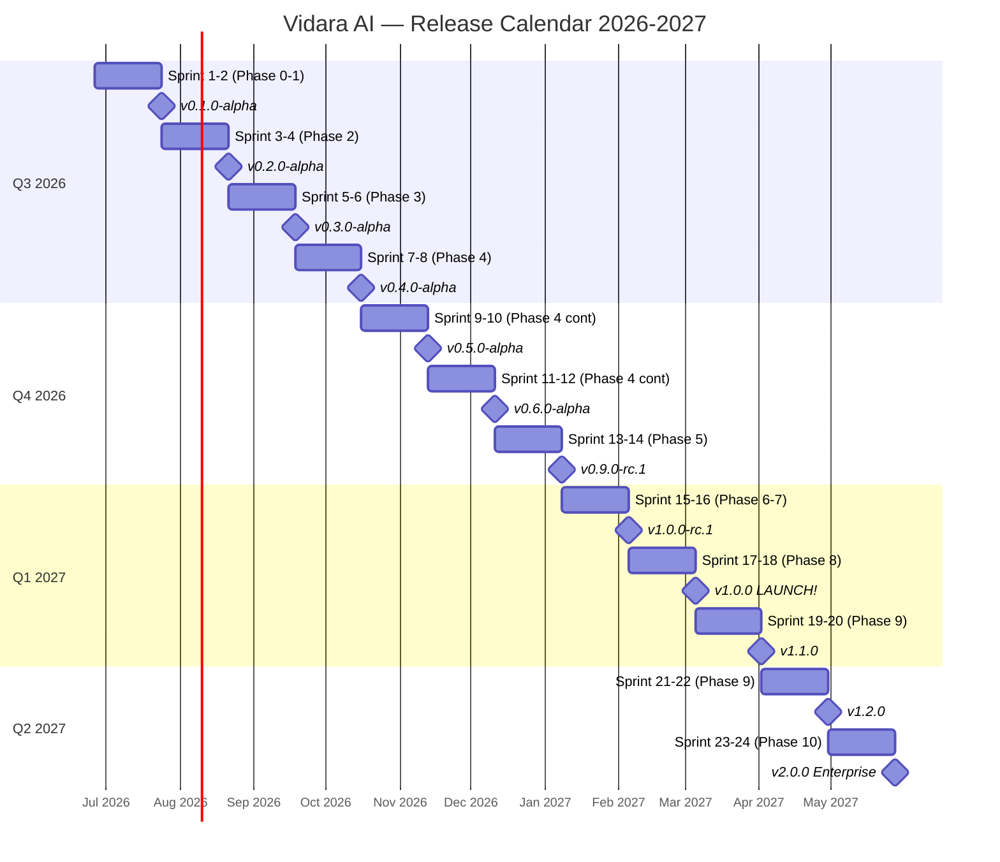

### 7.3 Release Train Model

Vidara AI menggunakan **Release Train** model — rilis terjadi pada jadwal tetap (setiap sprint ke-2), feature yang tidak siap dilewatkan ke rilis berikutnya:

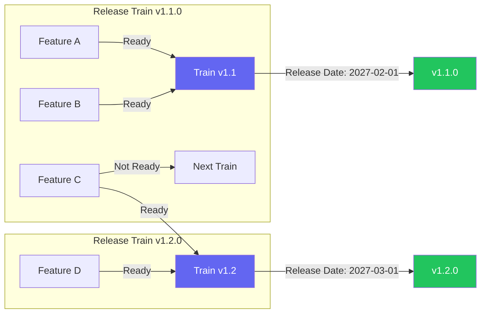

### 7.4 Major Release Timeline (Quarterly)

| Quarter | Major Version | Theme | Key Features | Cross-Reference |
|---|---|---|---|---|
| Q3 2026 | v0.x | Foundation & Core | Auth, workspace, scene builder, script writer | `roadmap.md` Phase 2-3 |
| Q4 2026 | v0.9.x | AI Pipeline | Image gen, voice, animation, composer, render | `roadmap.md` Phase 4-5 |
| Q1 2027 | v1.0.0 | Production Launch | Security, optimization, production deployment | `roadmap.md` Phase 6-8 |
| Q2 2027 | v2.0.0 | Enterprise | SSO, custom branding, dedicated infra, SLA | `roadmap.md` Phase 9-10 |

---

## 8. Release Process

### 8.1 Release Lifecycle

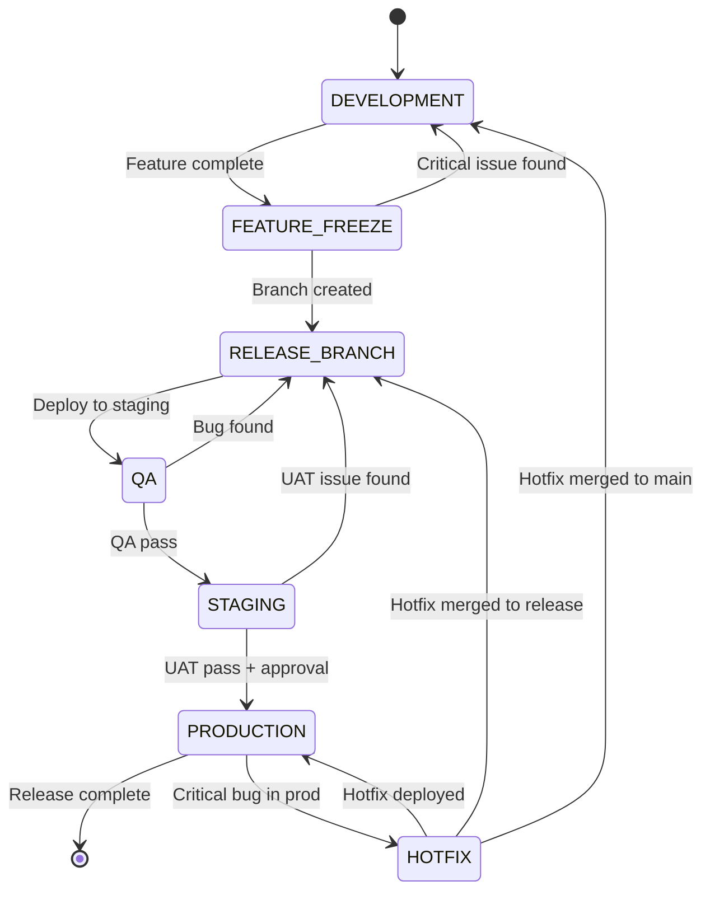

### 8.2 Stage-by-Stage Process

#### Stage 1: Development
| Activity | Owner | Duration |
|---|---|---|
| Feature implementation on `feat/*` branches | Engineering | Sprint duration |
| Code review (min 2 approvals) | Engineering Lead | < 24h |
| PR merge to `main` | Engineer | After approval |
| CI pipeline passes (lint, type, test, build, security scan) | GitHub Actions | ~10 min |
| Auto-deploy to dev environment | GitHub Actions | ~2 min |
| Dev smoke tests | QA Engineer | < 1h |

#### Stage 2: Feature Freeze
| Activity | Owner | Duration | Criteria |
|---|---|---|---|
| Feature freeze announcement | Release Manager | Day 1 | All `feat/*` branches merged |
| Release branch created: `release/vX.Y.Z` | DevOps | Day 1 | From `main` at freeze point |
| `main` reopens for next sprint features | DevOps | Day 1 | Feature freeze only applies to release |
| Version bump commit on release branch | DevOps | Day 1 | `pnpm version: bump minor` |

```bash
# Feature freeze procedure
git checkout -b release/v1.2.0 main
git commit --allow-empty -m "chore(release): feature freeze for v1.2.0"
pnpm version:v bump --minor
git tag v1.2.0-beta.1
git push origin release/v1.2.0 --tags
```

#### Stage 3: Release Branch
| Activity | Owner | Duration |
|---|---|---|
| Release branch protection: restrict writes | DevOps | Immediate |
| Cherry-pick approved fixes only | Engineering Lead | Per bug |
| Version bump to beta/rc | DevOps | Per iteration |
| Changelog generation | GitHub Actions | Automated |
| Release notes draft | Product Manager | Per iteration |

#### Stage 4: QA
| Activity | Owner | Duration | Criteria |
|---|---|---|---|
| Deploy release branch to staging | DevOps | ~5 min | Smoke tests pass |
| Regression test suite (full) | QA Engineer | 2-3 days | 100% E2E pass |
| Performance test (k6) | QA Engineer | 1 day | p95 < 500ms |
| Security scan (SAST, DAST, dependency) | Security Engineer | 1 day | Zero critical/high |
| Accessibility audit | QA Engineer | 1 day | WCAG AA pass |
| Bug tracking in GitHub Issues | QA Engineer | Continuous | Severity classification |
| QA sign-off | QA Lead | Required | All blockers resolved |

#### Stage 5: Staging (UAT)
| Activity | Owner | Duration | Criteria |
|---|---|---|---|
| Staging environment promotion | DevOps | ~5 min | QA pass |
| Internal UAT by stakeholders | Product Manager | 2-3 days | All AC met |
| Beta tester access (if applicable) | Customer Success | Per release | NDA + feedback form |
| Release candidate iteration | DevOps | Per UAT round | `v1.2.0-rc.N` |
| UAT sign-off | Product Manager | Required | No critical/high issues |
| Security final scan | Security Engineer | Required | Zero vulnerabilities |

#### Stage 6: Production
| Activity | Owner | Duration | Criteria |
|---|---|---|---|
| Pre-deployment backup | DevOps | ~5 min | Backup verified |
| Production approval gate | CTO / VP Eng | Required | UAT sign-off + security pass |
| Blue-green deployment | DevOps | ~10 min | Green instance healthy |
| Canary release (10% → 50% → 100%) | DevOps | ~15 min | Error rate < 1% |
| Database migration (if applicable) | Database Engineer | ~5 min | Backward compatible |
| Post-deployment smoke tests | DevOps | ~5 min | Health checks pass |
| Monitoring observation window | DevOps | 30 min | All metrics normal |
| Release announcement | Product Manager | After observation | Internal + external |

### 8.3 Release Stage Duration Summary

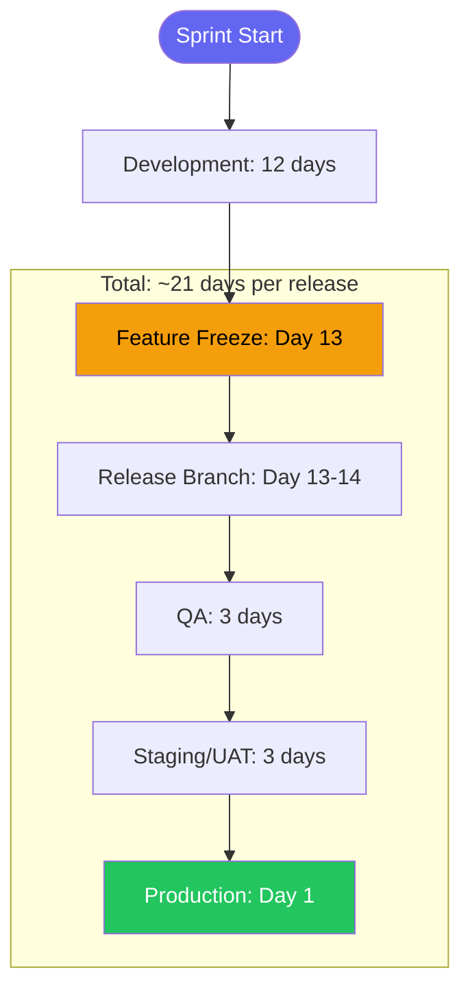

---

## 9. Hotfix Process

### 9.1 Hotfix Classification

| Severity | Definition | Examples | SLA | Approval |
|---|---|---|---|---|
| **Critical** | Service outage, data loss, security breach, payment failure | API 100% down, DB corruption, PII leak | Fix within 4h | CTO approval |
| **High** | Major feature broken, performance degradation, pipeline failure >10% | YouTube upload broken, render timeout, login failure | Fix within 24h | VP Eng approval |
| **Medium** | Minor feature issue with workaround | UI glitch, non-critical endpoint slow | Next patch release | Engineering Lead |
| **Low** | Cosmetic issue | Typo, minor styling | Next minor release | Engineer |

### 9.2 Hotfix Flow

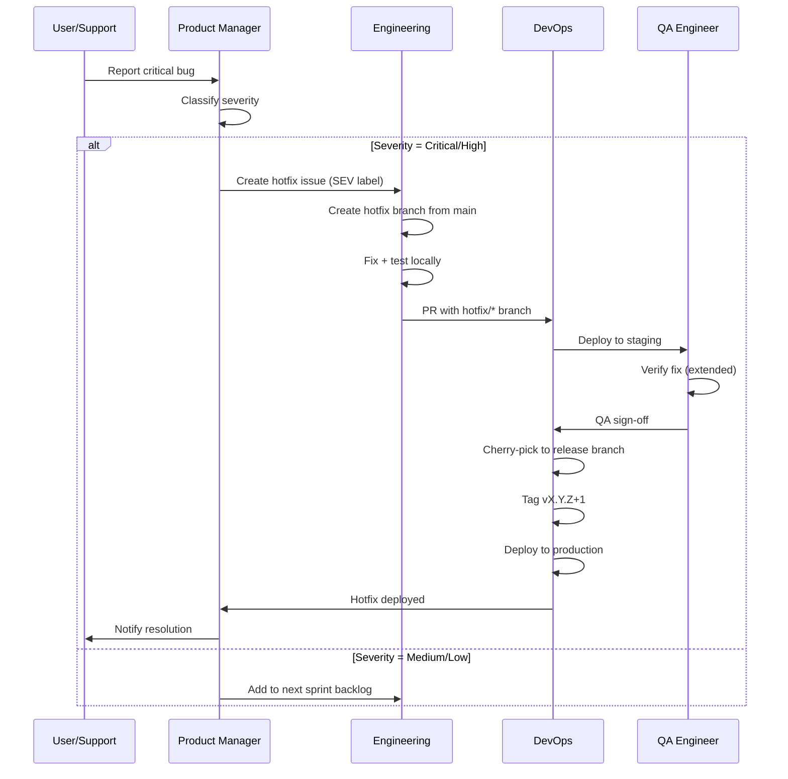

### 9.3 Hotfix Branch Naming

```
hotfix/<severity>-<short-description>
hotfix/critical-db-connection-pool
hotfix/high-pipeline-timeout
```

### 9.4 Hotfix Version Bump

| Scenario | Bump | Example |
|---|---|---|
| Critical fix on current release | PATCH | `v1.2.0` → `v1.2.1` |
| High fix on current release | PATCH | `v1.2.0` → `v1.2.1` |
| Fix on previous release (LTS) | PATCH on LTS branch | `v1.1.0` → `v1.1.1` |

### 9.5 Hotfix Checklist

- [ ] Severity classified and approved
- [ ] Hotfix branch created from `main` (not release branch)
- [ ] Fix implemented with unit test
- [ ] CI passes on hotfix branch
- [ ] Deployed to staging and verified by QA
- [ ] Cherry-picked to release branch (if active)
- [ ] Version bumped (PATCH)
- [ ] Deployed to production with expedited canary (5 min window)
- [ ] Post-deployment monitoring (30 min)
- [ ] Added to regression test suite
- [ ] Post-mortem if Critical severity

---

## 10. Rollback Procedure

### 10.1 Rollback Triggers

| Trigger | Threshold | Action |
|---|---|---|
| Error rate spike | > 5% 5xx in 2 min | Auto-rollback |
| Latency spike | p95 > 2s for 5 min | Auto-rollback |
| Pipeline failure rate | > 10% failure in 5 min | Manual rollback |
| Database migration error | Migration fails or data corruption | Auto-rollback migration |
| Canary health check fails | Green instance unhealthy | Auto-switch to blue |
| Security vulnerability | Zero-day discovered in release | Emergency rollback |

### 10.2 Rollback Types

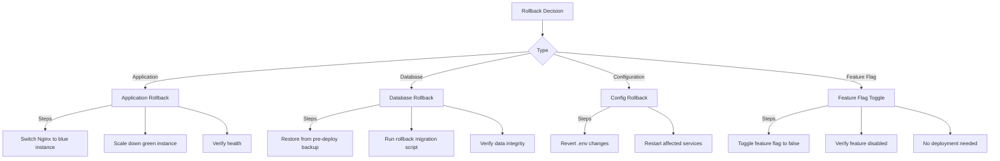

### 10.3 Application Rollback Procedure

```bash
# scripts/rollback/application.sh
#!/bin/bash
# Application rollback to previous version

set -euo pipefail

echo "=== Application Rollback Initiated: $(date) ==="

# 1. Identify current and previous versions
CURRENT=$(docker inspect api-green | jq -r '.[0].Config.Image')
PREVIOUS=$(docker inspect api-blue | jq -r '.[0].Config.Image')

echo "Current version: $CURRENT"
echo "Target version: $PREVIOUS"

# 2. Switch Nginx traffic back to blue
echo "Switching traffic to blue instance..."
docker compose -f docker-compose.prod.yml exec -T nginx \
    sed -i 's/set $api_upstream api:3001/set $api_upstream api:3000/g' /etc/nginx/conf.d/default.conf
docker compose -f docker-compose.prod.yml exec -T nginx nginx -s reload

# 3. Verify blue instance health
echo "Verifying blue instance..."
for i in {1..12}; do
    if curl -sf http://localhost:3000/api/health; then
        echo "Blue instance healthy"
        break
    fi
    if [ $i -eq 12 ]; then
        echo "CRITICAL: Blue instance unhealthy after rollback!"
        exit 1
    fi
    sleep 5
done

# 4. Scale down green instance
docker compose -f docker-compose.prod.yml stop api-green
docker compose -f docker-compose.prod.yml rm -f api-green

# 5. Monitoring observation
echo "Monitoring for 5 minutes..."
sleep 300

# 6. Verify error rate
ERROR_RATE=$(curl -s http://localhost:9090/api/v1/query?query=error_rate | jq '.data.result[0].value[1]')
if (( $(echo "$ERROR_RATE > 0.01" | bc -l) )); then
    echo "WARNING: Error rate still elevated after rollback: $ERROR_RATE"
fi

echo "=== Rollback complete: $(date) ==="
```

### 10.4 Database Rollback Procedure

```sql
-- packages/db/migrations/rollback/20260626_add_video_status.sql
-- Rollback script must be written for every migration

BEGIN;

-- Revert: ALTER TABLE videos ADD COLUMN status VARCHAR(20) DEFAULT 'draft';
ALTER TABLE videos DROP COLUMN IF EXISTS status;

-- Revert: CREATE INDEX idx_videos_status ON videos(status);
DROP INDEX IF EXISTS idx_videos_status;

COMMIT;
```

### 10.5 Rollback Testing

| Component | Frequency | Environment | Success Criteria |
|---|---|---|---|
| Application rollback | Every release | Staging | < 2 min to revert, zero data loss |
| Database rollback | Every migration | Staging | < 1 min, data integrity verified |
| Canary rollback | Every release | Production (canary) | < 30s to revert 10% traffic |
| Feature flag toggle | Every flag deploy | Production | < 1s, no deployment needed |

---

## 11. Release Automation

### 11.1 Automated Changelog Generation

```yaml
# .github/workflows/release-changelog.yml
name: Generate Changelog

on:
  push:
    tags:
      - 'v*'

jobs:
  changelog:
    name: Generate Release Changelog
    runs-on: ubuntu-24.04
    steps:
      - uses: actions/checkout@v4
        with:
          fetch-depth: 0

      - name: Generate Changelog
        id: changelog
        uses: mikepenz/release-changelog-builder-action@v5
        with:
          configuration: .github/changelog-config.json
          outputFile: CHANGELOG.md
          token: ${{ secrets.GITHUB_TOKEN }}

      - name: Create Release
        uses: softprops/action-gh-release@v2
        with:
          tag_name: ${{ github.ref_name }}
          body: ${{ steps.changelog.outputs.changelog }}
          prerelease: ${{ contains(github.ref_name, 'alpha') || contains(github.ref_name, 'beta') || contains(github.ref_name, 'rc') }}
          files: |
            CHANGELOG.md
            dist/vidara-${{ github.ref_name }}.tar.gz
```

### 11.2 Changelog Configuration

```json
{
  "categories": [
    { "title": "🚀 New Features", "labels": ["feat", "feature", "enhancement"] },
    { "title": "🐛 Bug Fixes", "labels": ["fix", "bug"] },
    { "title": "🔒 Security", "labels": ["sec", "security"] },
    { "title": "⚡ Performance", "labels": ["perf", "performance"] },
    { "title": "🛠 Maintenance", "labels": ["chore", "deps", "refactor"] },
    { "title": "📝 Documentation", "labels": ["docs"] },
    { "title": "🧪 Testing", "labels": ["test"] }
  ],
  "template": "# Changelog — {{release}}\n\n{{body}}",
  "pr_template": "- {{title}} (#{{number}}) by @{{author}}",
  "max_pull_requests": 200,
  "sort": "DESC"
}
```

### 11.3 Release Note Template

```markdown
# Vidara AI v{version} — {release_name}

**Release Date:** {date}
**Estimated Rollout:** {rollout_schedule}

## Summary
{1-2 paragraph summary of the release}

## What's New
- {Feature 1}: {description}
- {Feature 2}: {description}
- {Feature 3}: {description}

## Improvements
- {Improvement 1}: {description}
- {Improvement 2}: {description}

## Bug Fixes
- {Fix 1}: {description} (#{issue_number})
- {Fix 2}: {description} (#{issue_number})

## Security
- {Security fix}: {description} (#{issue_number})

## Breaking Changes
- {Breaking change}: {description} | {migration steps}

## Upgrade Notes
- {Note 1}: {description}
- {Note 2}: {description}

## Dependencies
- {Dependency update}: {version change}

## Known Issues
- {Issue 1}: {description} (tracking: #{issue_number})

## Rollout Schedule
| Stage | Date | Traffic % |
|---|---|---|
| Canary (internal) | {date} | 10% |
| Staged rollout | {date} | 25% → 50% |
| Full rollout | {date} | 100% |

## Artifacts
| Component | Image Tag |
|---|---|
| Web | `ghcr.io/vidara-ai/web:v{version}` |
| Worker | `ghcr.io/vidara-ai/worker:v{version}` |

---

[Full Changelog](https://github.com/vidara-ai/vidara/releases/tag/v{version})
```

### 11.4 Tag and Release Creation

```yaml
# .github/workflows/release-tag.yml
name: Create Release Tag

on:
  workflow_dispatch:
    inputs:
      version:
        description: 'Release version (e.g., v1.2.3)'
        required: true
      prerelease:
        description: 'Pre-release type (alpha/beta/rc/none)'
        required: true
        default: 'none'
      iteration:
        description: 'Pre-release iteration number'
        required: false
        default: '1'

jobs:
  tag:
    name: Create Tag and Release
    runs-on: ubuntu-24.04
    permissions:
      contents: write
    steps:
      - uses: actions/checkout@v4
        with:
          fetch-depth: 0

      - name: Validate Version
        run: |
          if ! [[ ${{ github.event.inputs.version }} =~ ^v[0-9]+\.[0-9]+\.[0-9]+$ ]]; then
            echo "Invalid version format. Must be vMAJOR.MINOR.PATCH"
            exit 1
          fi

      - name: Create Tag
        run: |
          TAG="${{ github.event.inputs.version }}"
          if [ "${{ github.event.inputs.prerelease }}" != "none" ]; then
            TAG="$TAG-${{ github.event.inputs.prerelease }}.${{ github.event.inputs.iteration }}"
          fi
          git tag $TAG
          git push origin $TAG
          echo "tag=$TAG" >> $GITHUB_OUTPUT

      - name: Create GitHub Release
        uses: softprops/action-gh-release@v2
        with:
          tag_name: ${{ steps.tag.outputs.tag }}
          generate_release_notes: true
          prerelease: ${{ github.event.inputs.prerelease != 'none' }}
```

### 11.5 Docker Image Tagging

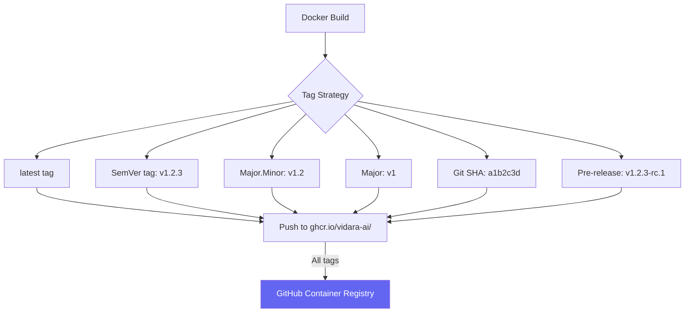

| Tag | Purpose | Retention | Updated |
|---|---|---|---|
| `latest` | Default pull tag | 90 days | Every main push |
| `v1.2.3` | Exact version reference | 365 days | Every release |
| `v1.2` | Minor version latest | 365 days | Every minor release |
| `v1` | Major version latest | 365 days | Every major release |
| `a1b2c3d` | Git commit reference | 180 days | Every main push |
| `v1.2.3-rc.1` | Pre-release | 30 days | Pre-release |
| `pr-123` | PR preview | Until PR merge | Every PR push |

### 11.6 Deployment Pipeline Triggers

| Trigger | Workflow | Environment | Approval |
|---|---|---|---|
| Push to `main` (CI pass) | `deploy-dev.yml` | Development | Auto |
| PR opened/updated | `preview.yml` | Preview (ephemeral) | Auto |
| Manual dispatch with version | `deploy-staging.yml` | Staging | None |
| Manual dispatch with version + approval | `deploy-production.yml` | Production | Required |
| Tag created `v*` | `release-changelog.yml` | Artifact | Auto |
| Cron (daily backup) | `backup.yml` | All | Auto |
| Cron (weekly security scan) | `security-scan.yml` | All | Auto |

---

## 12. Environment Strategy

### 12.1 Environment Overview

| Environment | Domain | Purpose | Deploy Strategy | Data | Access | Uptime SLA |
|---|---|---|---|---|---|---|
| **Development** | dev.vidara.ai | Daily development, integration testing | Auto on PR merge to main | Anonymized test data | Engineering team | Best effort |
| **Preview** | pr-N.dev.vidara.ai | Per-PR ephemeral environment | Auto on PR open/update | Fresh seed data | PR author + reviewers | Ephemeral |
| **Staging** | staging.vidara.ai | Pre-production validation, UAT, performance testing | Manual workflow | Synthetic data + subset of prod | Internal stakeholders + beta | 99.5% |
| **Production** | vidara.ai | Live user traffic | Manual + approval gate + canary | Real user data | All users | 99.9% |

### 12.2 Environment Promotion Flow

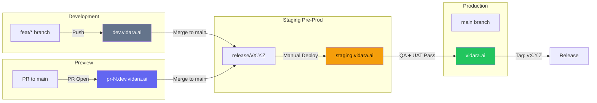

### 12.3 Ephemeral Preview per PR

Setiap Pull Request ke `main` secara otomatis mendapatkan preview environment:

```yaml
# Preview environment provisioning
preview:
  domain: pr-{number}.dev.vidara.ai
  ttl: 72 hours (or until PR closed)
  services:
    - Nuxt 4 app (Cloudflare Pages)
    - PostgreSQL ephemeral (Docker)
    - Redis ephemeral (Docker)
  seed_data: true (basic test data)
  notifications:
    - comment on PR with preview URL
    - Slack notification to channel
```

### 12.4 Environment Configuration Matrix

| Configuration | Dev | Preview | Staging | Production |
|---|---|---|---|---|
| Node version | 22 | 22 | 22 | 22 |
| PostgreSQL | 16-alpine | 16-alpine | 16 with replica | 16 with replica + PgBouncer |
| Redis | 7-alpine | 7-alpine | 7 with Sentinel | 7 cluster with Sentinel |
| MinIO | Single instance | Single instance | Single instance | Erasure coded cluster |
| Temporal | Dev server | Dev server | HA cluster | HA cluster (3 nodes) |
| Log level | debug | debug | info | warn |
| Sentry tracing | 1.0 sample rate | 1.0 sample rate | 0.5 sample rate | 0.2 sample rate |
| API rate limit | 1000/min | 100/min | 200/min | 100/min |
| Canary deployment | N/A | N/A | N/A | 10% → 50% → 100% |

### 12.5 Environment Provisioning Checklist

- [ ] Cloudflare DNS records created (dev, staging, prod subdomains)
- [ ] SSL certificates provisioned (Cloudflare Origin CA)
- [ ] Docker Compose stack deployed
- [ ] PostgreSQL database initialized with schema
- [ ] Redis instance configured with persistence
- [ ] MinIO buckets created
- [ ] Temporal server deployed and configured
- [ ] Environment variables populated (secrets from vault)
- [ ] Monitoring stack deployed (Prometheus, Grafana, Loki)
- [ ] Health check endpoints configured
- [ ] Backup automation configured
- [ ] Access control configured (VPN, SSH keys, WAF rules)

---

## 13. Canary Deployment Strategy

### 13.1 Canary Stages

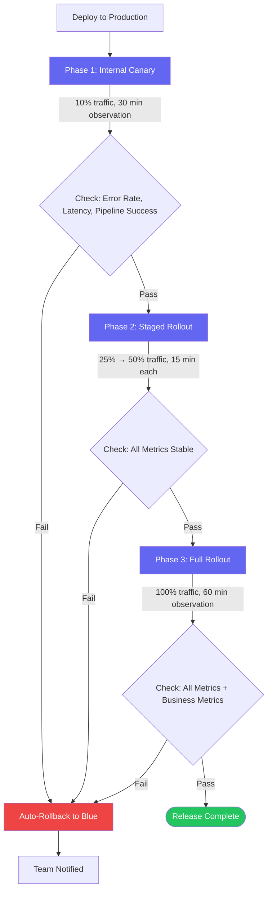

### 13.2 Canary Configuration

| Parameter | Internal Canary | Staged Rollout | Full Rollout |
|---|---|---|---|
| Traffic percentage | 10% | 25% → 50% | 100% |
| Duration | 30 min | 15 min per step | 60 min |
| User segment | Internal team + beta | Random (sticky session) | All users |
| Metrics watch | Error rate, p95 latency, pipeline success | + Business metrics | + Revenue/cost |
| Rollback on | Error rate > 1%, latency > 2s, pipeline failure > 5% | Same + MRR change > 2% | Same |
| Notification | Slack #deploy | Slack #general | Email to all |

### 13.3 Canary Script

```bash
# scripts/deploy/canary.sh
#!/bin/bash
# Usage: ./canary.sh --percent=10 --upstream=api-green

set -euo pipefail

PERCENT=${1#--percent=}
UPSTREAM=${2#--upstream=}
NGINX_CONF="/etc/nginx/conf.d/default.conf"

# Calculate weights
BLUE_WEIGHT=$((100 - PERCENT))
GREEN_WEIGHT=$PERCENT

# Update Nginx upstream with weighted load balancing
cat > "$NGINX_CONF" << EOF
upstream api_servers {
    random two least_conn;
    server api:3000 weight=$BLUE_WEIGHT;
    server api:3001 weight=$GREEN_WEIGHT;
}
EOF

# Reload Nginx
nginx -s reload

echo "Canary: $PERCENT% traffic to $UPSTREAM"
```

---

## 14. Feature Flags

### 14.1 Flag Architecture

```mermaid
flowchart TD
    subgraph "Flag Sources"
        FF_Code[Code-based Flags<br/>packages/config/flags.ts]
        FF_Env[Environment Flags<br/>.env files]
        FF_DB[Database Flags<br/>feature_flags table]
        FF_LaunchDarkly[LaunchDarkly<br/>(Phase 9+)]
    end
    
    subgraph "Flag Resolution"
        Resolver[Feature Flag Resolver]
    end
    
    subgraph "Flag Consumers"
        API[API Routes]
        UI[UI Components]
        Workers[Temporal Workers]
        Pipeline[Pipeline Agents]
    end
    
    FF_Code --> Resolver
    FF_Env --> Resolver
    FF_DB --> Resolver
    FF_LaunchDarkly --> Resolver
    
    Resolver --> API
    Resolver --> UI
    Resolver --> Workers
    Resolver --> Pipeline
```

### 14.2 Flag Types

| Flag Type | Source | Persistence | Scope | Toggle Latency |
|---|---|---|---|---|
| **Release flag** | Code + DB | Session (cookie) | Per-user | 1 deployment cycle |
| **Experiment flag** | LaunchDarkly | SDK cache | Per-user, percentage | ~1s |
| **Ops flag** | Environment variable | Process lifetime | Per-environment | Restart required |
| **Permission flag** | Database | Persistent | Per-organization | ~1 min (cache TTL) |
| **Kill switch** | Environment + Monitoring | Real-time | Global | ~5s |

### 14.3 Flag Inventory

| Flag | Type | Default | Owner | Description | Rollout Plan |
|---|---|---|---|---|---|
| `new-pipeline-v2` | Release | false | AI Engineer | Enable new Temporal workflow v2 | Beta → 25% → 50% → 100% |
| `ai-fallback` | Ops | true | DevOps | Enable fallback to secondary AI providers | Always on |
| `publish-youtube` | Release | true | Product | Enable YouTube publish feature | Always on (launch) |
| `video-chunking` | Experiment | false | AI Engineer | Enable chunked video rendering | A/B test → 50% → 100% |
| `self-serve-billing` | Release | false | Product | Enable customer self-serve billing portal | Beta → 10% → 50% → 100% |
| `enterprise-sso` | Permission | false | Product | Enable SAML/OIDC SSO | Per-org enable |
| `dark-mode` | Release | true | Design | Dark mode toggle | 100% (all users) |
| `kill-ai-provider-openai` | Kill switch | false | DevOps | Emergency disable OpenAI provider | Manual toggle |
| `maintenance-mode` | Kill switch | false | DevOps | Read-only mode for maintenance | Manual toggle |
| `new-dashboard-v2` | Experiment | false | Product | New dashboard layout | A/B test 50% |

### 14.4 Flag Lifecycle

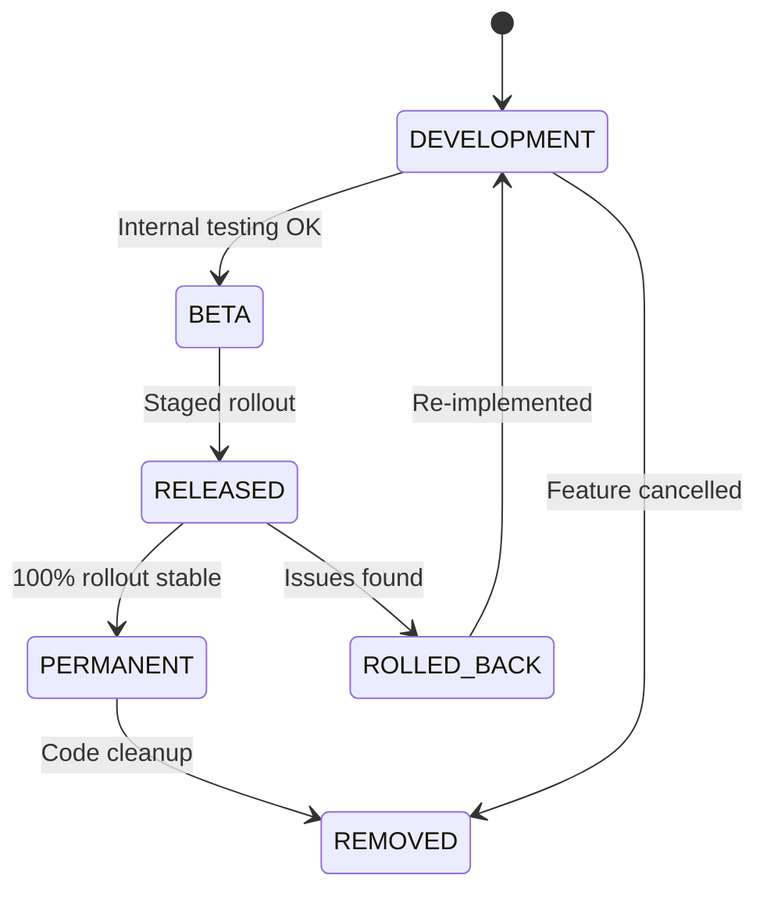

### 14.5 A/B Testing

| Experiment | Variant A (Control) | Variant B (Treatment) | Metric | Sample Size | Duration |
|---|---|---|---|---|---|
| Pipeline timeout | 30 min | 45 min | Completion rate | 1000 users | 2 weeks |
| Thumbnail style | Standard | Bold text overlay | CTR | 500 videos | 1 week |
| Voice model | ElevenLabs v2 | ElevenLabs v2 turbo | Quality score | 500 users | 1 week |
| Pricing page | Current layout | New layout | Conversion rate | 1000 visitors | 2 weeks |

### 14.6 Kill Switch Protocol

```bash
# scripts/ops/kill-switch.sh
#!/bin/bash
# Emergency kill switch for AI provider

set -euo pipefail

PROVIDER=${1#--provider=}
ACTION=${2#--action=}

case "$PROVIDER" in
    openai)
        if [ "$ACTION" = "disable" ]; then
            echo "DISABLING OpenAI provider..."
            export KILL_AI_PROVIDER_OPENAI=true
            echo "OpenAI provider disabled. All traffic routed to fallback."
        elif [ "$ACTION" = "enable" ]; then
            echo "ENABLING OpenAI provider..."
            unset KILL_AI_PROVIDER_OPENAI
            echo "OpenAI provider enabled."
        fi
        ;;
    elevenlabs)
        if [ "$ACTION" = "disable" ]; then
            export KILL_AI_PROVIDER_ELEVENLABS=true
            echo "ElevenLabs disabled."
        fi
        ;;
    *)
        echo "Unknown provider. Use: openai, elevenlabs, deepgram"
        exit 1
        ;;
esac

# Restart affected services
docker compose -f docker-compose.prod.yml restart temporal-worker
```

---

## 15. Database Migrations

### 15.1 Migration Principles

| Principle | Description | Violation Consequence |
|---|---|---|
| **Backward compatible** | Old code must work with new schema | Rollback impossible, deployment order matters |
| **Zero-downtime** | Migration must not lock tables or require downtime | Service interruption |
| **Expand-contract** | Add new schema first, migrate data, remove old schema | Data loss on rollback |
| **Rollback script** | Every migration must have a rollback | Cannot undo failed migration |
| **Versioned** | Migration files are sequential and immutable | Inconsistent state across environments |

### 15.2 Expand-Contract Pattern

```sql
-- Step 1: EXPAND — Add new column (backward compatible)
-- Old code still uses 'body', new code starts using 'content'
ALTER TABLE videos ADD COLUMN content TEXT;
CREATE INDEX CONCURRENTLY idx_videos_content ON videos(content);

-- Step 2: MIGRATE — Backfill data (online, batched)
-- Run as background job, not in migration transaction
UPDATE videos SET content = body WHERE content IS NULL AND body IS NOT NULL;
-- Monitor: SELECT count(*) FROM videos WHERE content IS NULL;

-- Step 3: CONTRACT — Remove old column (after all code is updated)
-- Deployed in NEXT release after confirming no code references 'body'
ALTER TABLE videos DROP COLUMN body;
```

### 15.3 Migration File Naming

```
YYYYMMDD_HHMMSS_description.sql
YYYYMMDD_HHMMSS_description.rollback.sql

20260626_120000_add_video_status.sql
20260626_120000_add_video_status.rollback.sql
```

### 15.4 Migration Directory Structure

```
packages/db/migrations/
├── 20260626_120000_add_video_status.sql
├── 20260626_120000_add_video_status.rollback.sql
├── 20260701_083000_create_index_videos_user_id.sql
├── 20260701_083000_create_index_videos_user_id.rollback.sql
├── seeds/
│   ├── 001_initial_plans.sql
│   └── 002_default_templates.sql
└── functions/
    └── video_pipeline_stats.sql
```

### 15.5 Zero-Downtime Migration Best Practices

| Operation | Safe (Online) | Needs Careful Planning | Requires Downtime |
|---|---|---|---|
| Add column (nullable) | ✅ | | |
| Add column (default value) | ✅ (PostgreSQL 11+) | | |
| Add index | ✅ (CONCURRENTLY) | | |
| Add constraint (NOT NULL) | | ✅ (check first) | |
| Add foreign key | | ✅ (NOT VALID, then VALIDATE) | |
| Drop column | | | ✅ (2-step expansion) |
| Rename column | | | ✅ (add new, drop old) |
| Split table | | | ✅ (view + trigger pattern) |
| Change column type | | | ✅ (add new, migrate, drop old) |

### 15.6 Migration Automation

```yaml
# .github/workflows/db-migration.yml
name: Database Migration

on:
  workflow_dispatch:
    inputs:
      environment:
        description: 'Target environment'
        required: true
        type: choice
        options: [staging, production]
      dry_run:
        description: 'Dry run (no actual changes)'
        type: boolean
        default: true

jobs:
  migrate:
    runs-on: ubuntu-24.04
    environment: ${{ github.event.inputs.environment }}
    steps:
      - uses: actions/checkout@v4
      
      - name: Run Migration (Dry Run)
        if: ${{ github.event.inputs.dry_run == 'true' }}
        run: |
          echo "Dry run mode — no changes applied"
          # Validate SQL syntax
          for f in packages/db/migrations/*.sql; do
            if [[ ! "$f" =~ \.rollback\.sql$ ]]; then
              echo "Validating: $f"
              docker run --rm -i postgres:16-alpine psql -f - <<< "$(cat $f)" || true
            fi
          done

      - name: Run Migration (Live)
        if: ${{ github.event.inputs.dry_run == 'false' }}
        uses: appleboy/ssh-action@v1.0.3
        with:
          host: ${{ secrets[format('{0}_HOST', github.event.inputs.environment)] }}
          username: ${{ secrets[format('{0}_USER', github.event.inputs.environment)] }}
          key: ${{ secrets[format('{0}_SSH_KEY', github.event.inputs.environment)] }}
          script: |
            cd /opt/vidara
            # Pre-migration backup
            ./scripts/backup/postgres-full.sh
            # Run migrations
            docker compose exec -T api pnpm db:migrate
            # Verify
            docker compose exec -T api pnpm db:verify
```

---

## 16. Artifact Repository

### 16.1 GitHub Container Registry (GHCR)

| Component | Image | Base |
|---|---|---|
| Web (Nuxt 4 + Nitro) | `ghcr.io/vidara-ai/web` | `node:22-alpine` |
| Worker (Temporal) | `ghcr.io/vidara-ai/worker` | `node:22-alpine` |
| Tools (Migration, Seed) | `ghcr.io/vidara-ai/tools` | `node:22-alpine` |

### 16.2 Image Retention Policy

| Tag Pattern | Retention | Exemption |
|---|---|---|
| `v*.*.*` (semver) | 365 days | Last 3 major versions |
| `v*.*.*-*` (pre-release) | 30 days | Latest pre-release |
| `latest` | 90 days | Always keep |
| `pr-*` (preview) | 7 days | Active PR |
| `*` (other) | 30 days | None |

### 16.3 Artifact Verification

Setiap artifact yang dipromosikan ke production harus melalui verification chain:

```bash
# scripts/verify/artifact.sh
#!/bin/bash
# Verify Docker image before production deployment

IMAGE=$1
EXPECTED_SHA=$2

# 1. Pull image
docker pull "$IMAGE"

# 2. Verify SHA
ACTUAL_SHA=$(docker inspect "$IMAGE" | jq -r '.[0].Id' | cut -d: -f2)
if [ "$ACTUAL_SHA" != "$EXPECTED_SHA" ]; then
    echo "SHA mismatch! Expected: $EXPECTED_SHA, Got: $ACTUAL_SHA"
    exit 1
fi

# 3. Verify build info
BUILD_INFO=$(docker run --rm "$IMAGE" cat /app/.build-info.json)
BUILD_VERSION=$(echo "$BUILD_INFO" | jq -r '.version')
echo "Artifact verified: $IMAGE (version: $BUILD_VERSION)"

# 4. Vulnerability scan
trivy image --severity CRITICAL,HIGH --exit-code 1 "$IMAGE"
echo "Vulnerability scan passed"
```

---

## 17. Release Checklist

### 17.1 Pre-Release Checklist

```markdown
## Pre-Release Checklist — v{version}

### Code Freeze
- [ ] All feature branches merged to `main`
- [ ] Release branch created: `release/v{version}`
- [ ] `main` reopened for next sprint features
- [ ] Release branch protected (restrict direct pushes)

### Code Quality
- [ ] All CI checks pass (lint, type-check, test, build)
- [ ] Code coverage ≥ 80% (no regression)
- [ ] No TODOs, FIXMEs, or debug code in release
- [ ] All PRs have required approvals (min 2)

### Testing
- [ ] Full regression test suite passed (E2E 100%)
- [ ] Performance test passed (p95 < 500ms)
- [ ] Load test at 2x expected traffic passed
- [ ] Cross-browser test passed (Chrome, Firefox, Safari, Edge)
- [ ] Mobile responsive test passed
- [ ] Accessibility audit passed (WCAG AA)

### Security
- [ ] SAST scan (CodeQL) — zero critical/high findings
- [ ] DAST scan (ZAP) — zero critical/high findings
- [ ] Dependency scan (Trivy) — zero critical/high CVEs
- [ ] Secret scan (Gitleaks) — zero findings
- [ ] OWASP Top 10 checklist completed
- [ ] Penetration test passed (if applicable)

### Changelog & Documentation
- [ ] Changelog generated and reviewed
- [ ] Release notes drafted and approved
- [ ] API documentation updated (if applicable)
- [ ] Migration guide written (if breaking changes)
- [ ] Upgrade notes documented

### Infrastructure
- [ ] Pre-deployment database backup executed
- [ ] Pre-deployment snapshot taken
- [ ] Monitoring dashboards verified
- [ ] Alert rules verified for new features
- [ ] Rollback script tested on staging
- [ ] Capacity review: expected traffic within limits

### Approval
- [ ] QA sign-off
- [ ] Security sign-off
- [ ] Product Manager sign-off
- [ ] CTO/VP Engineering sign-off
```

### 17.2 Release Day Checklist

```markdown
## Release Day Checklist — v{version}

### Pre-Deploy (T-60 min)
- [ ] Notify internal team: release starting
- [ ] Verify staging still healthy
- [ ] Run pre-deploy backup
- [ ] Verify backup integrity
- [ ] Confirm canary target version

### Deploy (T-0)
- [ ] Deploy green instance
- [ ] Green instance health check
- [ ] Switch blue → green (blue-green complete)
- [ ] Run database migration (if applicable)
- [ ] Verify migration success

### Canary (T+10 min)
- [ ] Canary 10% traffic
- [ ] Monitor error rate (30 min)
- [ ] Monitor latency p95 (30 min)
- [ ] Monitor pipeline success rate (30 min)
- [ ] Monitor business metrics (if applicable)

### Rollout (T+40 min)
- [ ] Ramp to 25% traffic
- [ ] Ramp to 50% traffic
- [ ] Ramp to 100% traffic
- [ ] Scale down blue instance

### Post-Deploy (T+60 min)
- [ ] Verify all health checks
- [ ] Verify Sentry error rate normal
- [ ] Verify Grafana dashboards
- [ ] Run smoke tests on production
- [ ] Mark release as complete
```

### 17.3 Post-Release Checklist

```markdown
## Post-Release Checklist — v{version}

### Verification (T+24h)
- [ ] No critical/high errors in Sentry
- [ ] Error budget consumption < 10%
- [ ] Pipeline success rate > 95%
- [ ] API latency p95 < 500ms
- [ ] No performance regression
- [ ] Customer support tickets normal range

### Communication
- [ ] Release notes published (internal)
- [ ] Changelog updated
- [ ] Customer announcement (if applicable)
- [ ] Documentation updated
- [ ] Known issues tracked in GitHub Issues

### Cleanup
- [ ] Feature flags for 100% rollout promoted to permanent (code cleanup issue created)
- [ ] Release branch archived
- [ ] Old Docker images cleaned up (pre-release tags)
- [ ] Temporary monitoring alerts removed

### Retrospective
- [ ] Release retrospective scheduled
- [ ] Metrics collected (time to deploy, bug rate, rollback count)
- [ ] Action items tracked
```

---

## 18. Communication

### 18.1 Internal Communication

| Audience | Channel | Content | Timing |
|---|---|---|---|
| Engineering team | Slack #engineering | Release version, breaking changes, migration notes | 1 week before release |
| Engineering team | Slack #deploy | Release start, canary progress, deploy complete | Real-time during deploy |
| All internal | Slack #general | Release announcement, features summary | After deploy complete |
| Internal stakeholders | Email | Release notes, known issues, upgrade timeline | Day of release |
| Customer Success | Slack #cs | Customer-facing changes, potential support impact | 1 day before release |
| Security team | Slack #security | Security fixes, vulnerability patches | Before release |

### 18.2 External Communication

| Audience | Channel | Content | Timing |
|---|---|---|---|
| Beta users | Email + in-app banner | Feature highlights, upgrade instructions | Day of release |
| Pro/Business users | Email + in-app notification | New features, improvements, SLA updates | Day of release |
| Enterprise customers | Email + Slack (dedicated) | Release notes, migration guide, maintenance window | 1 week before release |
| All users | Changelog page (vidara.ai/changelog) | Public changelog | Within 24h of release |
| Developers | API changelog | API changes, deprecations, new endpoints | With release tag |
| Social media | Twitter/LinkedIn | Major feature announcements | Per major/minor release |

### 18.3 Release Announcement Template

```markdown
---
Subject: [Vidara AI] v{version} Release — {feature_summary}
To: {audience_segment}
---

Hi {name},

We're excited to announce the release of Vidara AI v{version}, now rolling out to all users.

## What's New
{feature_highlights}

## Improvements
{improvements}

## Bug Fixes
{bug_fixes_summary}

## Upgrade Notes
{upgrade_notes}

This release will be rolled out gradually over the next 48 hours. You can track the rollout on our status page: status.vidara.ai

For the full changelog, visit: https://vidara.ai/changelog/v{version}

Questions? Reach out to support@vidara.ai

— The Vidara AI Team
```

### 18.4 Changelog Publication

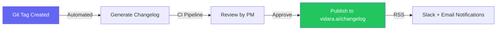

---

## 19. Release Metrics & SLOs

### 19.1 Release Metrics

| Metric | Target | Measurement | Goal |
|---|---|---|---|
| Deployment frequency | ≥ 2 per month | Releases per month | Faster time-to-market |
| Lead time for changes | < 24h from commit to production | Average time from merge to prod | Rapid delivery |
| Change failure rate | < 15% | % of releases causing degraded service | Quality |
| Mean time to recover (MTTR) | < 1 hour | Average time from incident to resolution | Reliability |
| Rollback rate | < 5% | % of releases rolled back | Release quality |
| Hotfix rate | < 10% | % of releases requiring hotfix within 7 days | Test coverage |

### 19.2 Release SLOs

| SLO | Target | Window | Measurement |
|---|---|---|---|
| Release on schedule | ≥ 90% | Rolling 3 months | Releases delivered on planned date |
| Canary success rate | ≥ 95% | Rolling 6 months | Canary passes without rollback |
| Zero-downtime deployment | 100% | Per release | No user-facing downtime during deploy |
| Release notes published | ≤ 24h after release | Per release | Release notes available publicly |
| Hotfix turnaround | ≤ 4h (Critical), ≤ 24h (High) | Per incident | Time from report to fix in production |

---

## 20. Roles & Responsibilities

| Role | Release Responsibilities |
|---|---|
| **Release Manager** | Overall release coordination, milestone tracking, gate approvals, communication |
| **Product Manager** | Feature priority, release content, release notes, customer communication |
| **Engineering Lead** | Code quality, feature completion, code review, technical decision |
| **DevOps Engineer** | CI/CD pipeline, deployment execution, environment management, rollback |
| **QA Engineer** | Test planning, regression testing, performance testing, sign-off |
| **Security Engineer** | Security scanning, vulnerability assessment, security sign-off |
| **Database Engineer** | Migration scripts, data integrity, rollback scripts |
| **Customer Success** | Customer communication, upgrade support, feedback collection |

---

## 21. Referensi Dokumen Lain

| Dokumen | Path | Konten Terkait |
|---|---|---|
| DevOps & CI/CD | `internal/docs/devops.md` | CI/CD pipeline, GitHub Actions workflows, container registry, environment management |
| Deployment & Infrastructure | `internal/docs/deployment.md` | Blue-green deployment, Docker setup, Cloudflare, Nginx, monitoring |
| Roadmap Document | `internal/docs/roadmap.md` | Phase planning, timeline, milestones, feature priority |
| Architecture Document | `internal/docs/architecture.md` | System architecture, C4 diagrams, container structure |
| Security Architecture | `internal/docs/security.md` | Security scanning, vulnerability management, audit |
| Compliance Document | `internal/docs/compliance.md` | Regulatory compliance, data protection, audit requirements |
| Database Document | `internal/docs/database.md` | Database migration strategy, schema design |
| Workflow Document | `internal/docs/workflow.md` | Pipeline steps, agent workflow, queue architecture |
| Tech Stack Document | `internal/docs/techstack.md` | Technology choices, versions, dependencies |

---

> **End of Release Management Document** — Vidara AI © 2026  
> **Maintainer:** Agent 10 — Senior DevOps Engineer  
> **Next Review:** 2026-09-26  
> **Related:** [DevOps](devops.md) · [Deployment](deployment.md) · [Roadmap](roadmap.md)
