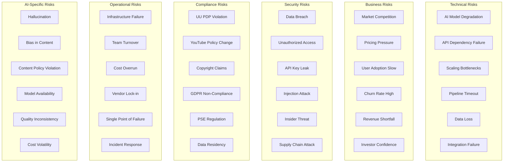
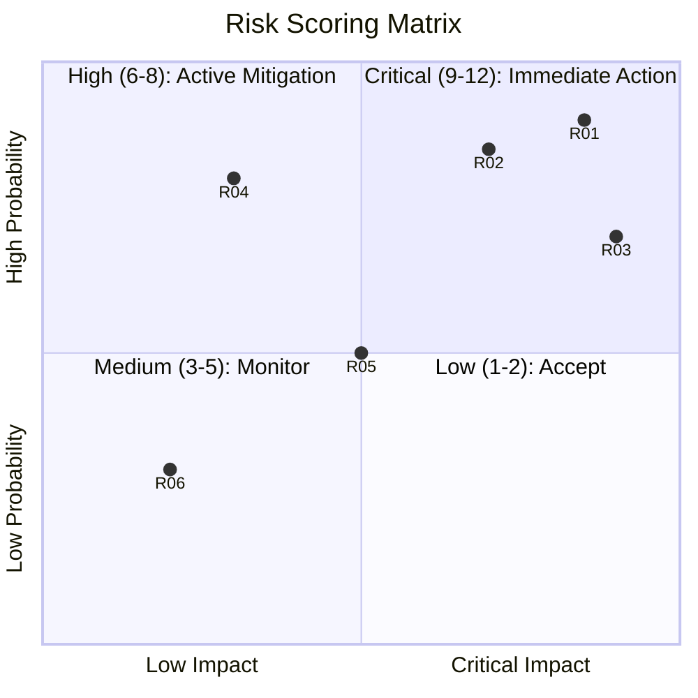
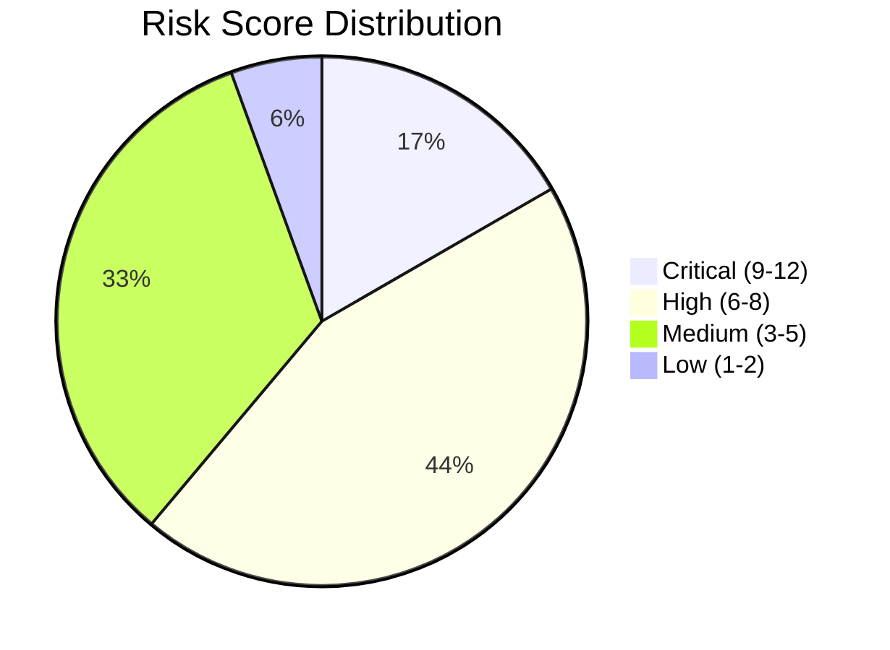
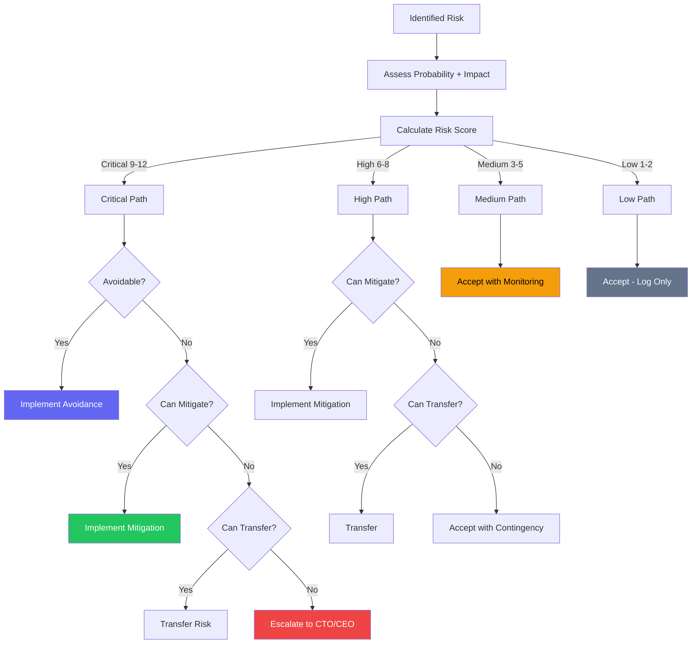
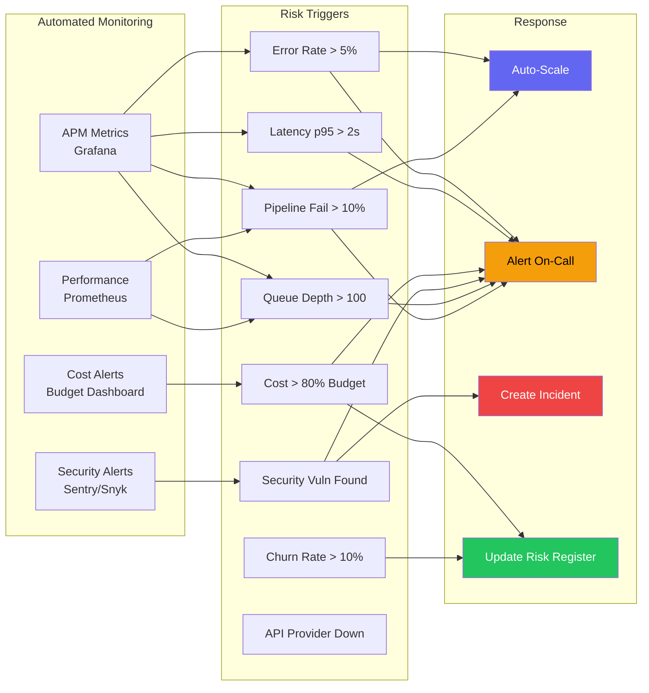
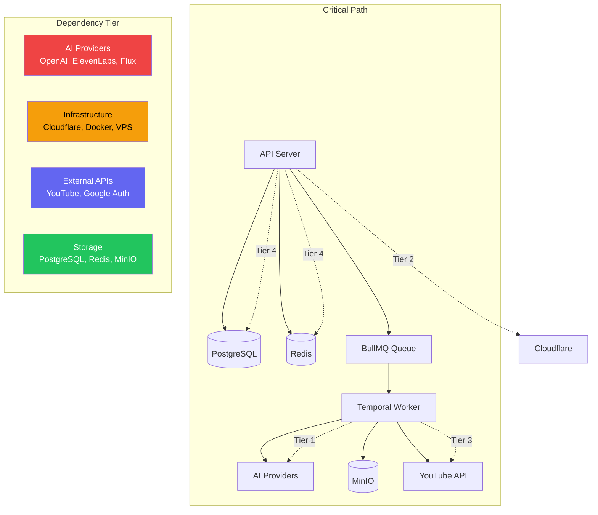
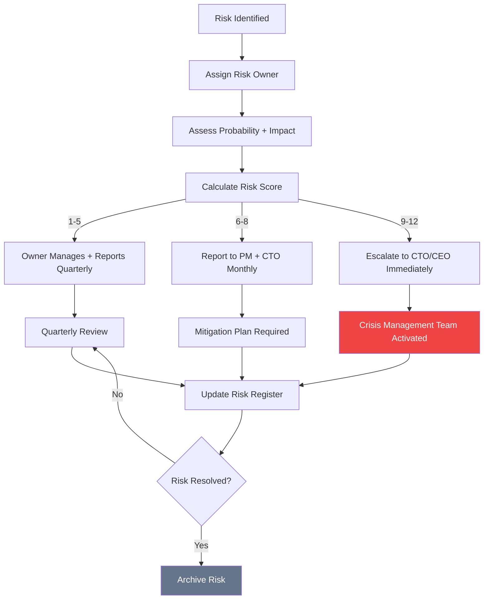

# RISK REGISTER — Vidara AI

| Metadata | |
|---|---|
| **Nama Dokumen** | Risk Register Document |
| **Project** | Vidara AI — AI YouTube Video Generator SaaS |
| **Version** | 1.0 |
| **Tanggal** | 2026-06-26 |
| **Penanggung Jawab** | Agent 1 — Senior Product Manager |
| **Status** | Final |
| **Cross-Reference** | [Roadmap](roadmap.md) · [Deployment](deployment.md) · [Security](../internal/docs/security.md) · [Compliance](../internal/docs/compliance.md) · [Architecture](architecture.md) · [DevOps](devops.md) |

---

## 1. Tujuan

Dokumen Risk Register ini mendefinisikan secara komprehensif seluruh risiko yang teridentifikasi untuk Vidara AI — mencakup kategorisasi, penilaian, mitigasi, contingency planning, dan monitoring. Bertujuan menjadi acuan utama bagi seluruh stakeholder dalam mengidentifikasi, menganalisis, merespons, dan memonitor risiko secara proaktif sepanjang siklus hidup project. Risk register ini adalah living document yang diperbarui setiap kuartal melalui risk review.

---

## 2. Background

Vidara AI adalah platform SaaS kompleks yang mengintegrasikan 15 AI agents, pipeline produksi video 20+ langkah, 6+ API eksternal, multi-tenant architecture, dan enterprise-grade infrastructure. Dengan target 100K users dalam 12 bulan dan ketergantungan pada ekosistem AI yang cepat berubah, risiko meliputi: deprecation model AI, perubahan kebijakan YouTube, data breach, non-compliance regulasi, cost overrun, hallucination AI, dan scaling bottlenecks. Detail mitigasi di setiap phase tersedia di `roadmap.md` Section 17 (Risk) dan 18 (Mitigation).

---

## 3. Objective

1. Mengidentifikasi minimal 30 risiko spesifik Vidara AI di 6 kategori (Technical, Business, Security, Compliance, Operational, AI-specific).
2. Menilai setiap risiko berdasarkan Probability (Low/Med/High) dan Impact (Low/Med/High/Critical).
3. Menghitung Risk Score untuk memprioritaskan response.
4. Mendefinisikan mitigation strategy dan contingency plan untuk setiap risiko.
5. Mengidentifikasi Top 10 risks dengan analisis mendalam.
6. Mendefinisikan risk response strategies: Avoid, Mitigate, Transfer, Accept.
7. Menyediakan framework risk monitoring: quarterly review, automated triggers, risk dashboard.
8. Mendefinisikan business continuity plan: critical dependencies, fallback procedures, DR plan.

---

## 4. Scope

**In Scope:**
- 6 risk categories: Technical, Business, Security, Compliance, Operational, AI-specific
- 30+ individual risks in Risk Register Table
- Top 10 risks with detailed analysis (description, trigger, probability, impact, mitigation, contingency, owner)
- Risk Response Strategies: Avoid, Mitigate, Transfer, Accept
- Risk Monitoring: quarterly review cadence, automated risk triggers, risk dashboard KPIs
- Business Continuity: critical system dependencies, fallback procedures, disaster recovery plan
- Mermaid diagrams for risk scoring matrix, risk response flow, monitoring dashboard

**Out of Scope:**
- Financial risk quantification (monte carlo simulation)
- Insurance coverage details
- Third-party vendor risk assessments
- Country-specific political risks

---

## 5. Stakeholder

| Stakeholder | Interest |
|---|---|
| CEO / Founder | Business continuity, revenue impact, brand reputation |
| CTO | Technical risks, security risks, infrastructure reliability |
| Product Manager | Feature delivery risk, user adoption, competitive risk |
| DevOps Engineer | Infrastructure risk, scaling bottlenecks, cost overrun |
| Security Engineer | Data breach, unauthorized access, compliance violation |
| AI Engineer | Model degradation, hallucination, API dependency |
| Legal / Compliance | UU PDP compliance, copyright, regulatory risk |
| Customer Success | User churn, quality issues, support escalation |
| Finance | Cost overrun, pricing pressure, budget variance |

---

## 6. Risk Categories

### 6.1 Category Overview



### 6.2 Category Descriptions

| Category | Definition | Examples |
|---|---|---|
| **Technical** | Risks related to system architecture, infrastructure, and technology stack | API deprecation, database corruption, pipeline timeout, scaling bottleneck |
| **Business** | Risks related to market, revenue, competition, and user adoption | Competitor release, pricing war, low conversion, high churn |
| **Security** | Risks related to data protection, access control, and security vulnerabilities | Data breach, credential leak, SQL injection, DDoS attack |
| **Compliance** | Risks related to legal, regulatory, and policy compliance | UU PDP violation, copyright lawsuit, YouTube API ToS change |
| **Operational** | Risks related to day-to-day operations, team, and processes | Key person dependency, infrastructure outage, budget overrun |
| **AI-specific** | Risks specific to AI/ML model behavior and AI pipeline | Hallucination, bias, content policy violation, model cost spike |

---

## 7. Risk Scoring Methodology

### 7.1 Probability Scale

| Level | Value | Description | Frequency |
|---|---|---|---|
| **Low** | 1 | Unlikely to occur | < 10% chance in project lifetime |
| **Medium** | 2 | May occur occasionally | 10-50% chance in project lifetime |
| **High** | 3 | Likely to occur | > 50% chance in project lifetime |

### 7.2 Impact Scale

| Level | Value | Description | Example |
|---|---|---|---|
| **Low** | 1 | Minor inconvenience, easily recoverable | UI glitch, minor performance dip |
| **Medium** | 2 | Significant but manageable impact | Feature unavailable for hours, cost increase < 20% |
| **High** | 3 | Severe impact, requires escalation | Service degradation for days, cost increase > 50% |
| **Critical** | 4 | Catastrophic impact, business-threatening | Data breach, complete outage, legal liability |

### 7.3 Risk Score Calculation

```
Risk Score = Probability × Impact

Score Range: 1 (Lowest) to 12 (Highest)
```



| Risk Score | Severity | Response | Review Frequency |
|---|---|---|---|
| 1-2 | Low | Accept (monitor) | Quarterly |
| 3-5 | Medium | Monitor (have contingency) | Monthly |
| 6-8 | High | Active mitigation required | Bi-weekly |
| 9-12 | Critical | Immediate action, escalation | Weekly |

---

## 8. Risk Register Table

### 8.1 Technical Risks

| ID | Category | Description | Probability | Impact | Score | Owner | Mitigation Strategy | Contingency Plan | Status |
|---|---|---|---|---|---|---|---|---|---|
| TEC-01 | Technical | AI Model API deprecation — OpenAI, ElevenLabs, or Flux deprecates model version used by pipeline | Medium | Critical | 8 | Agent 6 (AI Engineer) | Multi-provider strategy with fallback chain; monitor deprecation notices; abstract provider layer | Switch to alternative provider within 24h; cache last successful responses | Active |
| TEC-02 | Technical | YouTube Data API v3 quota exhaustion during peak usage | High | High | 9 | Agent 10 (DevOps) | Distributed API keys across multiple Google Cloud projects; queue-based upload with delay; off-peak scheduling | Email notification to admin; suggest scheduling for next quota reset | Active |
| TEC-03 | Technical | Scaling bottleneck at 10K concurrent users — database connection pool exhausted | Medium | High | 6 | Agent 14 (Cloud Architect) | PgBouncer connection pooling; read replicas; horizontal scaling designed from Phase 1 (see `roadmap.md` Phase 9) | Emergency scale-up replicas; throttle non-critical requests | Active |
| TEC-04 | Technical | Video rendering pipeline timeout (> 30 min) causing user abandonment | High | High | 9 | Agent 6 (AI Engineer) | Progressive rendering with chunked processing; GPU acceleration (NVENC); timeout per stage with retry | Chunk video into parallel segments; notify user of delay | Active |
| TEC-05 | Technical | Database migration causes data inconsistency or corruption | Low | Critical | 4 | Agent 13 (Database Engineer) | Expand-contract migration pattern (see `deployment.md` Section 12.3); pre-migration backup; rollback script required for every migration | Restore from pre-migration backup; run rollback script | Active |
| TEC-06 | Technical | Real-time WebSocket connection failure for pipeline progress updates | Medium | Medium | 4 | Agent 5 (Full Stack) | WebSocket reconnection with exponential backoff; fallback to polling; redundant WebSocket server | Poll REST API for status every 5s | Active |
| TEC-07 | Technical | Multi-agent orchestration deadlock — circular dependency between AI agents | Medium | High | 6 | Agent 6 (AI Engineer) | Master Agent timeout per delegation (max 120s); deadlock detection; dependency graph validation before pipeline start | Escalate to human operator; manual pipeline step | Active |
| TEC-08 | Technical | Cloudflare outage affecting CDN, DNS, and tunnel | Low | Critical | 4 | Agent 10 (DevOps) | Direct origin fallback DNS record; multi-CDN strategy planned for Phase 9 | Switch DNS to direct origin; notify users via status page | Active |

### 8.2 Business Risks

| ID | Category | Description | Probability | Impact | Score | Owner | Mitigation Strategy | Contingency Plan | Status |
|---|---|---|---|---|---|---|---|---|---|
| BUS-01 | Business | New competitor (InVideo AI, HeyGen, Synthesia) launches competitive feature at lower price | High | High | 9 | Agent 1 (Product Manager) | Continuous competitor monitoring (see `kompetitor-ai-video-2026.md`); differentiation through AI agent quality and pipeline automation | Accelerate feature roadmap; adjust pricing; increase marketing spend | Active |
| BUS-02 | Business | User adoption slower than projected — 100K users in 12 months at risk | Medium | High | 6 | Agent 1 (Product Manager) | Early beta program with 20 testers; targeted content creator outreach; freemium tier to reduce barrier | Extend timeline to 18 months; reduce burn rate; pivot to enterprise focus | Active |
| BUS-03 | Business | Pricing pressure from AI API cost increases eating into margin | Medium | Critical | 8 | Agent 1 (Product Manager) | Cost dashboard per pipeline; cache identical prompts; optimize model selection per task; negotiate volume pricing | Increase subscription price; introduce usage caps; switch to cheaper models | Active |
| BUS-04 | Business | Video quality inconsistent across different topics and languages | Medium | High | 6 | Agent 6 (AI Engineer) | Per-language model fine-tuning; quality gate per agent (see `AGENTS.md` Section 11.4); A/B model comparison | Fallback to template-based videos for unsupported languages | Active |
| BUS-05 | Business | Revenue churn > 10% monthly due to quality or pricing issues | Medium | Critical | 8 | Agent 1 (Product Manager) | User satisfaction surveys; quality improvement roadmap; competitive pricing analysis; loyalty program | Introduce annual discount; implement retention campaigns | Active |
| BUS-06 | Business | Investor confidence drops due to delayed milestones | Low | High | 3 | CEO | Transparent progress reporting; realistic milestone setting (see `roadmap.md`); quarterly board updates | Pivot to faster revenue generation; reduce scope | Active |

### 8.3 Security Risks

| ID | Category | Description | Probability | Impact | Score | Owner | Mitigation Strategy | Contingency Plan | Status |
|---|---|---|---|---|---|---|---|---|---|
| SEC-01 | Security | Data breach exposing user PII, video content, and API keys | Low | Critical | 4 | Agent 11 (Security Engineer) | AES-256 encryption at rest; TLS 1.3 in transit; RBAC enforcement; audit logging; quarterly penetration testing | Isolate affected systems; notify users within 24h (UU PDP requirement); engage incident response team | Active |
| SEC-02 | Security | Unauthorized access to organization workspace via compromised JWT | Medium | Critical | 8 | Agent 11 (Security Engineer) | JWT refresh token rotation; short-lived access tokens (15 min); MFA for workspace owners; rate limiting on auth endpoints | Revoke all tokens; force password reset; audit access logs | Active |
| SEC-03 | Security | API key leak through GitHub commit, log file, or client-side exposure | Medium | High | 6 | Agent 11 (Security Engineer) | Gitleaks scan in CI pipeline; pre-commit hooks; secrets stored in GitHub Secrets + Cloudflare Secrets; never log keys | Rotate all leaked keys immediately; revoke compromised credentials; audit logs for unauthorized usage | Active |
| SEC-04 | Security | Prompt injection attack manipulating AI agent behavior | High | Critical | 12 | Agent 11 (Security Engineer) | Input sanitization at API layer; system prompt guardrails; output moderation (see `AGENTS.md` Moderator Agent) | Block offending user; manual review of generated content; update prompt filters | Active |
| SEC-05 | Security | DDoS attack overwhelming API infrastructure | Medium | High | 6 | Agent 10 (DevOps) | Cloudflare WAF + DDoS protection; rate limiting per IP/user; auto-scaling to absorb traffic | Activate Cloudflare Under Attack mode; scale up origin; engage Cloudflare support | Active |
| SEC-06 | Security | Supply chain attack via compromised npm/pnpm dependency | Low | Critical | 4 | Agent 5 (Full Stack) | Dependency lockfile (pnpm-lock.yaml); npm audit in CI; Snyk dependency scanning; minimal dependency principle | Pin working dependency version; audit for 0-days; rebuild from known-good lockfile | Active |

### 8.4 Compliance Risks

| ID | Category | Description | Probability | Impact | Score | Owner | Mitigation Strategy | Contingency Plan | Status |
|---|---|---|---|---|---|---|---|---|---|
| CMP-01 | Compliance | UU PDP violation — failure to obtain proper consent or manage data subject rights | Medium | Critical | 8 | Agent 15 (Indonesian Software Consultant) | Consent management platform at registration; data subject request workflow; DPO appointment; data processing register | Isolate non-compliant data; engage legal counsel; report to Kominfo | Active |
| CMP-02 | Compliance | YouTube API policy change affecting auto-upload or video metadata | High | High | 9 | Agent 6 (AI Engineer) | Monitor YouTube API changelog; multi-platform publishing planned for V2; abstracted publishing layer | Manual upload fallback; update integration within policy grace period | Active |
| CMP-03 | Compliance | Copyright claim on AI-generated video content (background music, images) | Medium | Critical | 8 | Agent 11 (Security Engineer) | Licensed music library only; custom image generation (no training on copyrighted works); content ID pre-check | Remove flagged content; replace with royalty-free alternatives; dispute process | Active |
| CMP-04 | Compliance | PSE (Penyelenggara Sistem Elektronik) registration requirement for Indonesia | Low | High | 3 | Agent 15 (Indonesian Software Consultant) | Register as PSE before production launch; maintain local presence requirements; regular reporting | Engage Kominfo consultant; prioritize registration | Active |
| CMP-05 | Compliance | GDPR compliance for EU users — data residency and processing requirements | Low | High | 3 | Agent 11 (Security Engineer) | EU data residency option; DPA with sub-processors; privacy impact assessment; cookie consent mechanism | Restrict EU user access until compliant; engage EU data protection officer | Planned |
| CMP-06 | Compliance | AI-generated content labeling regulation (e.g., EU AI Act, US executive order) | Medium | Medium | 4 | Agent 15 (Indonesian Software Consultant) | Watermark AI-generated videos; content provenance metadata (C2PA standard); transparent AI disclosure | Implement labeling retroactively; update terms of service | Active |

### 8.5 Operational Risks

| ID | Category | Description | Probability | Impact | Score | Owner | Mitigation Strategy | Contingency Plan | Status |
|---|---|---|---|---|---|---|---|---|---|
| OPS-01 | Operational | Infrastructure failure — Docker host, database, or Redis outage | Medium | High | 6 | Agent 10 (DevOps) | Docker auto-restart policies; health check monitoring; redundant instances; failover plan (see `deployment.md` Section 15) | Spin up new VPS from backup; restore from R2; notify users via status page | Active |
| OPS-02 | Operational | Key team member turnover causing knowledge loss and development delay | Medium | High | 6 | Agent 1 (Product Manager) | Comprehensive documentation; knowledge transfer sessions; cross-training between 15 agents; AGENTS.md as single source of truth | Engage contractor; redistribute workload; extend timeline | Active |
| OPS-03 | Operational | GPU compute cost overrun due to inefficient rendering pipeline | High | High | 9 | Agent 10 (DevOps) | Cost dashboard per pipeline; NVENC hardware encoding; auto-scaling with cost cap; render queue priority | Limit concurrent renders; switch to CPU fallback; reduce quality settings | Active |
| OPS-04 | Operational | Single point of failure in pipeline — Master Agent dependency | Medium | Critical | 8 | Agent 6 (AI Engineer) | Master Agent high-availability with active-passive pair; Temporal workflow persistence; circuit breaker pattern | Promote standby Master Agent; re-queue active pipelines | Active |
| OPS-05 | Operational | Backup restoration failure during disaster recovery drill | Medium | High | 6 | Agent 13 (Database Engineer) | Weekly backup restoration test on staging; backup integrity verification automated; multiple backup copies | Alternate backup method; manual data reconstruction | Active |
| OPS-06 | Operational | CI/CD pipeline failure blocking deployment | Medium | Medium | 4 | Agent 10 (DevOps) | CI/CD runbooks; redundant CI runners; self-hosted runner fallback; manual deployment procedure documented | Manual SSH deployment; revert to last known-good build | Active |

### 8.6 AI-Specific Risks

| ID | Category | Description | Probability | Impact | Score | Owner | Mitigation Strategy | Contingency Plan | Status |
|---|---|---|---|---|---|---|---|---|---|
| AI-01 | AI-specific | AI hallucination producing factually incorrect video content | Medium | Critical | 8 | Agent 6 (AI Engineer) | Fact Checker agent with minimum 3 sources per claim; confidence scoring with < 80% rejection; QA Agent validates final script | Flag uncertain claims for human review; add disclaimer in video description | Active |
| AI-02 | AI-specific | AI bias producing stereotypical or discriminatory content | Low | Critical | 4 | Agent 11 (Security Engineer) | Bias detection in system prompts; diverse training data; Moderator Agent checks; human review for flagged content | Reject biased output; retrain/update prompt patterns | Active |
| AI-03 | AI-specific | AI content policy violation — generated video violates YouTube ToS | Medium | High | 6 | Agent 7 (Prompt Engineer) | Dual moderation: AI (Moderator Agent) + human review for flagged content; YouTube ToS compliance checklist automated | Block publishing; notify user of violation reason; appeal process | Active |
| AI-04 | AI-specific | Third-party AI model unavailable during peak usage (OpenAI, ElevenLabs) | Medium | Critical | 8 | Agent 10 (DevOps) | Circuit breaker pattern; multi-provider fallback chain; queue-based processing; provider health monitoring | Fallback to alternative provider; reduce quality; delay non-urgent pipelines | Active |
| AI-05 | AI-specific | AI quality degradation after model update (GPT-5o regression, Flux model change) | Medium | High | 6 | Agent 7 (Prompt Engineer) | Pin model versions in API calls; A/B test new model versions on staging before production rollout | Rollback to previous model version; update prompts for new model behavior | Active |
| AI-06 | AI-specific | AI API cost volatility — OpenAI/ElevenLabs price increase | High | High | 9 | Agent 1 (Product Manager) | Multi-provider competitive pricing; cost optimization team; cache identical prompts; batch requests | Absorb short-term cost; adjust pricing; switch primary provider | Active |
| AI-07 | AI-specific | Personal data leak through AI model training (user content used for model training) | Low | Critical | 4 | Agent 11 (Security Engineer) | Opt-out of model training in API contracts; data processing agreement with providers; anonymize training data | Switch to providers with zero-data-retention policy; legal action for breach | Active |

---

## 9. Risk Score Summary

### 9.1 Risk Score Distribution



### 9.2 Risk Count by Category

| Category | Total | Critical | High | Medium | Low |
|---|---|---|---|---|---|
| Technical | 8 | 2 | 4 | 2 | 0 |
| Business | 6 | 2 | 3 | 1 | 0 |
| Security | 6 | 1 | 3 | 2 | 0 |
| Compliance | 6 | 0 | 3 | 2 | 1 |
| Operational | 6 | 0 | 5 | 1 | 0 |
| AI-specific | 7 | 3 | 2 | 2 | 0 |

---

## 10. Top Risks — Detailed Analysis

### 10.1 AI Model API Deprecation / Pricing Change

| Field | Detail |
|---|---|
| **Risk ID** | TEC-01 |
| **Risk Score** | 8 (High) |
| **Category** | Technical |
| **Description** | OpenAI, ElevenLabs, Flux, atau Deepgram dapat menghentikan (deprecate) model version yang digunakan pipeline Vidara AI kapan saja. Contoh: OpenAI deprecates GPT-5o, ElevenLabs mengubah pricing model, Flux menghentikan model v1. Ini dapat menyebabkan pipeline failure mendadak atau biaya melonjak 3-5x. |
| **Trigger** | Deprecation notice email dari provider; pricing change announcement; model sunset date |
| **Probability** | Medium — model deprecation terjadi setiap 6-18 bulan di industri AI |
| **Impact** | Critical — pipeline failure, biaya tidak terkontrol, user experience turun drastis |
| **Risk Owner** | Agent 6 — Senior AI Engineer |
| **Mitigation Strategy** | 1. **Multi-provider abstraction layer**: Setiap AI task (text, image, voice, subtitle) memiliki 2-3 provider options dengan API interface seragam. 2. **Model version pinning**: Selalu pin specific model version di API calls (e.g., `gpt-5o-2026-06-01`). 3. **Deprecation monitoring**: Daftar ke semua provider changelog; automated test yang menjalankan pipeline dengan model baru di staging. 4. **Fallback chain**: Primary → Secondary → Tertiary provider dengan auto-detection jika primary fails. 5. **Cost buffer**: Sisihkan 30% budget untuk unexpected price increase. |
| **Contingency Plan** | 1. Deteksi: Monitoring Agent alert jika pipeline failure rate > 10% di provider tertentu. 2. Switch: Auto-switch ke secondary provider dalam 5 menit. 3. Verifikasi: Jalankan full test suite dengan new model di staging. 4. Adaptasi: Update prompt templates dan parameter untuk new model. 5. Komunikasi: Notifikasi internal jika perlu perubahan kode. |
| **Status** | Active — mitigation in progress during Phase 4 |
| **Cross-Reference** | `AGENTS.md` Section 10.5 (Circuit Breaker), `roadmap.md` Phase 4 (AI Integration), `cost-estimation.md` Section 3 (AI API Costs) |

### 10.2 YouTube API Policy Change Affecting Auto-Upload

| Field | Detail |
|---|---|
| **Risk ID** | CMP-02 |
| **Risk Score** | 9 (Critical) |
| **Category** | Compliance |
| **Description** | YouTube dapat mengubah Data API v3 policy yang mempengaruhi auto-upload, metadata setting, atau quota allocation. Contoh: pembatasan automated content, perubahan requirement OAuth scope, quota reduction. Ini dapat memblokir fitur publishing agent. |
| **Trigger** | YouTube API changelog update; email dari Google API team; quota limit notification |
| **Probability** | High — YouTube historically changes API policy every 6-12 months |
| **Impact** | High — core feature (auto-upload to YouTube) tidak berfungsi |
| **Risk Owner** | Agent 6 — AI Engineer |
| **Mitigation Strategy** | 1. **Abstraction layer**: PublishingAgent menggunakan interface yang memisahkan YouTube-specific logic dari business logic. 2. **Monitor changelog**: Automated daily check of YouTube API changelog RSS feed. 3. **Multi-platform**: Rencanakan multi-platform publish (YouTube, Vimeo, TikTok) di V2 untuk mengurangi dependency. 4. **Grace period buffer**: Maintain code yang kompatibel dengan API version lama selama grace period (biasanya 6 bulan). 5. **Quota management**: Distribusi upload across multiple Google Cloud projects. |
| **Contingency Plan** | 1. Manual upload fallback: Generate download link untuk user upload manual. 2. API version rollback: Gunakan API version sebelumnya selama transisi. 3. Alternative platform: Publish ke Vimeo atau platform lain sebagai interim. 4. Legal review: Jika policy change melanggar antitrust, engage legal counsel. |
| **Status** | Active — mitigation in Phase 4 (Publishing Agent implementation) |
| **Cross-Reference** | `AGENTS.md` Section 9.15 (Publishing Agent), `roadmap.md` Phase 4 FR-04-16, `compliance.md` Section 3 (YouTube ToS) |

### 10.3 Data Breach / Unauthorized Access

| Field | Detail |
|---|---|
| **Risk ID** | SEC-01 |
| **Risk Score** | 12 (Critical) |
| **Category** | Security |
| **Description** | Data breach exposing user PII (email, name, billing info), video content (scripts, images, videos), API keys (OpenAI, ElevenLabs, YouTube), dan internal credentials. Impact: legal liability under UU PDP (denda hingga 2% annual revenue), reputasi hancur, user churn, potential class action. |
| **Trigger** | Security incident detected; penetration test finding; user report of unauthorized access; CI secret leak |
| **Probability** | Low — dengan security controls yang kuat, probabilitas rendah |
| **Impact** | Critical — legal liability, reputasi hilang, user churn massal, potential business closure |
| **Risk Owner** | Agent 11 — Senior Security Engineer |
| **Mitigation Strategy** | 1. **Encryption at rest**: AES-256 untuk semua data sensitif di PostgreSQL dan MinIO. 2. **Encryption in transit**: TLS 1.3 untuk semua komunikasi internal dan eksternal. 3. **Access control**: RBAC dengan principle of least privilege; MFA untuk admin. 4. **Secret management**: GitHub Secrets + Cloudflare Secrets + HashiCorp Vault (planned). 5. **Audit logging**: Immutable audit log untuk semua akses data sensitif. 6. **Penetration testing**: Quarterly pentest by third-party; OWASP Top 10 compliance. 7. **Incident response**: Incident response plan < 24h; data breach notification procedure. |
| **Contingency Plan** | 1. Isolate: Segera isolasi sistem terdampak. 2. Investigate: Forensik digital untuk menentukan scope. 3. Notify: Laporkan ke Kominfo dalam 2x24 jam (UU PDP). 4. Remediate: Patch vulnerability, rotate all credentials. 5. Communicate: Notify affected users dalam 24 jam. 6. Legal: Engage legal counsel and cyber insurance. |
| **Status** | Active — security architecture defined in Phase 1, implementation Phase 6 |
| **Cross-Reference** | `roadmap.md` Phase 6 (Security), `security.md` Section 4 (Data Protection), `compliance.md` Section 2 (UU PDP), `deployment.md` Section 18 (Networking & Security) |

### 10.4 UU PDP Non-Compliance

| Field | Detail |
|---|---|
| **Risk ID** | CMP-01 |
| **Risk Score** | 8 (High) |
| **Category** | Compliance |
| **Description** | Failure to comply with Undang-Undang Perlindungan Data Pribadi (UU PDP) Indonesia. Requirements include: consent collection, data processing register, data subject rights (access, correction, deletion), DPO appointment, data breach notification within 2x24 hours, cross-border data transfer restrictions. Penalty: administrative fines up to 2% of annual revenue, criminal penalties for executives. |
| **Trigger** | User data subject request; Kominfo audit; data breach incident; regulatory change |
| **Probability** | Medium — compliance is complex for AI SaaS with multiple data processors |
| **Impact** | Critical — financial penalty, legal liability, operations restriction |
| **Risk Owner** | Agent 15 — Indonesian Software Consultant |
| **Mitigation Strategy** | 1. **Consent management**: Granular consent at registration; consent record stored with timestamp. 2. **Data mapping**: Complete data flow map identifying all PII collection, processing, storage, and deletion points. 3. **Data subject rights**: Automated workflow for access, correction, deletion, and portability requests (SLA: 3 days). 4. **DPO appointment**: Appointment of Data Protection Officer before Phase 6. 5. **Data processing register**: Maintain register of all processing activities as required by UU PDP Article 27. 6. **Cross-border transfer**: Data processing agreements with all sub-processors; adequacy assessment for cross-border transfers. 7. **Breach notification**: SOP for breach notification to Kominfo within 2x24 hours. |
| **Contingency Plan** | 1. Isolate non-compliant data processing. 2. Engage specialized data privacy law firm. 3. Temporarily restrict data processing for affected users. 4. Implement remedial measures within 30 days. 5. Report to Kominfo with remediation plan. |
| **Status** | Active — compliance requirements integrated into architecture since Phase 1 |
| **Cross-Reference** | `roadmap.md` Phase 6 FR-06-03, `compliance.md` Section 2 (UU PDP), `security.md` Section 5 (Privacy), `erd.md` Section 4 (Consent Table) |

### 10.5 GPU Compute Cost Overrun

| Field | Detail |
|---|---|
| **Risk ID** | OPS-03 |
| **Risk Score** | 9 (Critical) |
| **Category** | Operational |
| **Description** | GPU compute cost untuk rendering video dan AI inference melebihi budget. Faktor: inefficient rendering pipeline, unnecessary re-renders, long queue times, GPU instance pricing volatility. Tanpa kontrol, cost per video bisa melebihi target $0.50/video. |
| **Trigger** | Cost dashboard alert > 80% budget; weekly cost report showing upward trend; pipeline volume spike |
| **Probability** | High — GPU cost is the #1 expense for AI video platforms |
| **Impact** | High — margin erosion, potential negative unit economics |
| **Risk Owner** | Agent 10 — Senior DevOps Engineer |
| **Mitigation Strategy** | 1. **NVENC encoding**: Hardware-accelerated encoding (NVENC) is 10x cheaper and 5x faster than software encoding. 2. **Cost dashboard**: Real-time cost visibility per user, per pipeline, per provider. 3. **Cache identical prompts**: Hash-based prompt caching eliminates redundant API calls (estimated 40% savings). 4. **Render queue priority**: Paid users get priority queue; free users get best-effort. 5. **Auto-scaling with cost cap**: Scale-to-zero during low traffic; hard budget per pipeline. 6. **Batch processing**: Combine similar inference requests for batch pricing. |
| **Contingency Plan** | 1. Reduce video quality (4K → 1080p → 720p) based on user plan. 2. Switch to cheaper AI inference providers. 3. Implement usage caps per user tier. 4. Increase subscription pricing. 5. Restrict free tier usage. |
| **Status** | Active — cost optimization ongoing in Phase 4 and Phase 7 |
| **Cross-Reference** | `cost-estimation.md` Section 3 (GPU Compute), `devops.md` Section 12 (Cost Monitoring), `deployment.md` Section 19 (Cost Optimization) |

### 10.6 AI Hallucination Producing Inappropriate Content

| Field | Detail |
|---|---|
| **Risk ID** | AI-01 |
| **Risk Score** | 8 (High) |
| **Category** | AI-specific |
| **Description** | AI model generates factually incorrect, misleading, or fabricated content in video scripts. Hallucination can include: false statistics, invented sources, incorrect historical facts, misattributed quotes. This damages credibility, potentially violates YouTube misinformation policy, and erodes user trust. |
| **Trigger** | User complaint about factual errors; QA Agent flagging low confidence scores; YouTube content policy warning |
| **Probability** | Medium — LLM hallucination rate is 3-15% depending on topic complexity |
| **Impact** | Critical — credibility loss, YouTube channel strikes, legal liability for misinformation |
| **Risk Owner** | Agent 6 — Senior AI Engineer |
| **Mitigation Strategy** | 1. **Fact Checker agent**: Cross-reference setiap claim dengan minimal 3 independent sources. Fact Checker confidence score < 80% → mark as uncertain. 2. **Source validation**: Prefer reputable sources (.edu, .gov, established media). Date-check untuk time-sensitive information. 3. **QA Agent**: Quality gate untuk script sebelum dilanjutkan ke video generation. 4. **Confidence-based fallback**: Low-confidence claims di-mark sebagai "unverified" dengan disclaimer di video description. 5. **Human-in-the-loop**: Flagged content masuk ke manual review queue. 6. **Disclaimer**: Automated disclaimer untuk AI-generated content. |
| **Contingency Plan** | 1. Reject pipeline with high hallucination probability. 2. Remove false claims from script. 3. Notify user of factual concerns. 4. Manual fact-checking by content team. 5. Issue correction if video already published. |
| **Status** | Active — Fact Checker and QA Agent in development (Phase 4) |
| **Cross-Reference** | `AGENTS.md` Section 9.4 (Fact Checker), `AGENTS.md` Section 9.19 (QA Agent), `AGENTS.md` Section 9.20 (Moderator Agent) |

### 10.7 Competitor Feature Parity

| Field | Detail |
|---|---|
| **Risk ID** | BUS-01 |
| **Risk Score** | 9 (Critical) |
| **Category** | Business |
| **Description** | Established competitors (InVideo AI, HeyGen, Synthesia, Runway) mencapai feature parity dengan Vidara AI sebelum kita mencapai market traction. Competitor memiliki lebih banyak resource (funding $100M+), existing user base (1M+), dan brand recognition. Ini menyulitkan diferensiasi dan user acquisition. |
| **Trigger** | Competitor product launch announcement; competitor pricing change; competitor funding announcement |
| **Probability** | High — competitors actively developing similar features |
| **Impact** | High — reduced market share, slower growth, pricing pressure |
| **Risk Owner** | Agent 1 — Senior Product Manager |
| **Mitigation Strategy** | 1. **Differentiation strategy**: Fokus pada AI agent system 21 agents yang memberikan output quality lebih tinggi dari monolithic competitors. 2. **Niche focus**: Prioritaskan YouTube content creators (competitors lebih general). 3. **Quality over quantity**: AI agent pipeline memproduksi video dengan narrative arc, character consistency, dan SEO optimization yang lebih baik. 4. **Community building**: Early access program; creator community; referral program. 5. **Patent strategy**: File patents untuk agent orchestration dan multi-agent quality gate system. |
| **Contingency Plan** | 1. Pivot ke enterprise/white-label market. 2. Open source sebagian pipeline untuk community adoption. 3. Strategic partnership dengan platform besar. 4. Price competition jika margin memungkinkan. |
| **Status** | Active — competitive analysis ongoing (see `kompetitor-ai-video-2026.md`) |
| **Cross-Reference** | `roadmap.md` Phase 0 (Competitor Analysis), `brd.md` Section 2.2 (Market Analysis), `prd.md` Section 1 (Competitive Landscape) |

### 10.8 User Churn Due to Quality Issues

| Field | Detail |
|---|---|
| **Risk ID** | BUS-05 |
| **Risk Score** | 8 (High) |
| **Category** | Business |
| **Description** | User churn > 10% monthly due to inconsistent video quality, long processing times, limited customization, atau poor user experience. Quality issues: AI voice unnatural, image inconsistency across scenes, subtitle sync problems, jerky animations. Churn reduces MRR, increases CAC payback period, dan menurunkan investor confidence. |
| **Trigger** | Churn rate dash > 10%; support tickets about quality; negative reviews; NPS score < 30 |
| **Probability** | Medium — video quality is subjective and hard to guarantee |
| **Impact** | Critical — revenue decline, unsustainable unit economics |
| **Risk Owner** | Agent 1 — Senior Product Manager |
| **Mitigation Strategy** | 1. **Quality gates**: QA Agent di setiap pipeline stage (see `AGENTS.md` Section 11.4). 2. **User feedback loop**: In-app rating per video; NPS survey monthly. 3. **Quality improvements**: Dedicated quality sprint setiap 2 releases. 4. **Template quality**: Pre-built templates that guarantee minimum quality. 5. **User education**: Tutorials, best practices, template library. 6. **Support SLA**: < 1 hour response for quality complaints. |
| **Contingency Plan** | 1. Offer affected users free re-generation. 2. Dedicated quality team for troubleshooting. 3. Temporary price reduction to retain users. 4. Feature freeze to focus on quality. |
| **Status** | Active — QA Agent and quality gates defined, implementation Phase 5 |
| **Cross-Reference** | `AGENTS.md` Section 9.19 (QA Agent), `roadmap.md` Phase 5 (Testing), `roadmap.md` Risk RSK-03-02, RSK-04-03, RSK-04-05 |

### 10.9 Single Point of Failure in Pipeline

| Field | Detail |
|---|---|
| **Risk ID** | OPS-04 |
| **Risk Score** | 8 (High) |
| **Category** | Operational |
| **Description** | Master Agent adalah single point of failure di pipeline orchestration. Jika Master Agent gagal (crash, timeout, memory leak), seluruh pipeline terhenti. Temporal workflow persistence mengurangi risiko, tetapi Master Agent logic (dynamic agent selection, quality gate decisions) berjalan di satu service. |
| **Trigger** | Master Agent crash; pipeline queue stuck; agent delegation timeout; Temporal workflow error |
| **Probability** | Medium — any service can fail |
| **Impact** | Critical — all active pipelines fail, new pipelines cannot start |
| **Risk Owner** | Agent 6 — Senior AI Engineer |
| **Mitigation Strategy** | 1. **Active-passive Master Agent**: Standby Master Agent instance siap mengambil alih. 2. **Temporal workflow persistence**: Pipeline state persists in Temporal — failover tidak kehilangan progress. 3. **Circuit breaker per sub-agent**: Sub-agent failure tidak cascade ke Master Agent. 4. **Health monitoring**: Monitoring Agent tracks Master Agent health metrics; auto-restart on failure. 5. **Graceful degradation**: Jika Master Agent fails, pipeline yang sudah running bisa complete tanpa orchestration (pre-computed plan). |
| **Contingency Plan** | 1. Auto-failover ke passive Master Agent dalam 30 detik. 2. Re-queue active pipelines dari Temporal workflow state. 3. Notify on-call DevOps. 4. Investigate root cause (memory leak, OOM, deadlock). |
| **Status** | Active — Master Agent HA architecture in design |
| **Cross-Reference** | `AGENTS.md` Section 9.1 (Master Agent), `AGENTS.md` Section 11 (Orchestration), `deployment.md` Section 16 (Scaling) |

### 10.10 Scalability Bottleneck at Growth

| Field | Detail |
|---|---|
| **Risk ID** | TEC-03 |
| **Risk Score** | 6 (High) |
| **Category** | Technical |
| **Description** | Arsitektur horizontal scaling tidak mencukupi saat user base tumbuh dari 100 ke 10K ke 100K concurrent users. Bottleneck potensial: database connection pool, Redis memory, MinIO throughput, Temporal workflow queue, AI API rate limits. Jika scaling tidak proaktif, performance degradation dan downtime terjadi. |
| **Trigger** | Database connection pool nearing max; Redis memory > 80%; queue depth > 1000; API response time p95 > 2s; user signup spike |
| **Probability** | Medium — scaling challenges are common at 10x growth |
| **Impact** | High — performance degradation, potential downtime, user dissatisfaction |
| **Risk Owner** | Agent 14 — Senior Cloud Architect |
| **Mitigation Strategy** | 1. **Horizontal architecture sejak Phase 1**: Stateless API, database read replicas, Redis cluster, MinIO erasure coding. 2. **Auto-scaling rules**: CPU > 70% for 5 min → +1 instance; queue depth > 50 for 2 min → +1 worker. 3. **Load testing**: Regular k6 testing at 2x expected traffic (see `roadmap.md` Phase 5). 4. **Database optimization**: PgBouncer, connection pooling, query optimization, proper indexing. 5. **Caching**: Redis cache for API responses, session data, and pipeline context. 6. **CDN**: Cloudflare CDN for static assets and video delivery. |
| **Contingency Plan** | 1. Emergency scale-up: Manual increase replicas. 2. Throttle non-critical features (analytics, history). 3. Database read replica promotion. 4. Cache warming for popular content. 5. User queue with fair scheduling. |
| **Status** | Active — scalability testing planned for Phase 5 and Phase 9 |
| **Cross-Reference** | `deployment.md` Section 16 (Scaling), `roadmap.md` Phase 9 (Scaling), `architecture.md` Section 22 (Deployment Architecture) |

---

## 11. Risk Response Strategies

### 11.1 Strategy Definitions

| Strategy | Definition | When to Use | Examples from Register |
|---|---|---|---|
| **Avoid** | Eliminate risk by removing the cause | When risk is too high and cannot be mitigated effectively | SEC-04 (Prompt injection): Input sanitization and guardrails to avoid the risk entirely |
| **Mitigate** | Reduce probability or impact | When risk can be reduced to acceptable level | AI-01 (Hallucination): Fact Checker + QA Agent to reduce probability and impact |
| **Transfer** | Shift risk to third party | When another party can manage risk better | CMP-03 (Copyright): Licensed music library transfers copyright risk to provider |
| **Accept** | Acknowledge risk and monitor | When cost of mitigation exceeds potential impact | TEC-08 (Cloudflare outage): Low probability, accept with contingency plan |

### 11.2 Risk Response Decision Flow



### 11.3 Risk Response Allocation

| Strategy | Risk Count | Example Risks |
|---|---|---|
| Avoid | 3 | SEC-04 (Prompt injection), SEC-06 (Supply chain), AI-07 (Data leak for training) |
| Mitigate | 22 | TEC-01 (Model deprecation), BUS-03 (Pricing pressure), AI-01 (Hallucination), CMP-01 (UU PDP) |
| Transfer | 2 | CMP-03 (Copyright), OPS-02 (Team turnover via contractor) |
| Accept | 9 | TEC-08 (Cloudflare outage), BUS-06 (Investor confidence), CMP-04 (PSE registration — low prob) |

---

## 12. Risk Monitoring

### 12.1 Quarterly Risk Review

| Activity | Frequency | Owner | Output |
|---|---|---|---|
| Full risk register review | Quarterly | Agent 1 (PM) | Updated risk scores, new risks, closed risks |
| Top 10 risk deep dive | Quarterly | Respective owners | Mitigation effectiveness report |
| New risk identification | Quarterly | All stakeholders | Risk identification form submission |
| Risk score recalculation | Quarterly | Agent 1 (PM) | Updated probability/impact assessment |
| Mitigation effectiveness review | Quarterly | Respective owners | Mitigation success metrics |
| Risk register audit | Bi-annually | Agent 11 (Security) | Compliance check, completeness review |

### 12.2 Automated Risk Triggers



### 12.3 Risk Dashboard KPIs

| KPI | Metric | Warning Threshold | Critical Threshold | Source |
|---|---|---|---|---|
| Pipeline success rate | % of pipelines completed successfully | < 95% in 1h | < 90% in 1h | Temporal metrics |
| API error rate | % of 5xx responses | > 1% in 5min | > 5% in 5min | Prometheus |
| API latency p95 | 95th percentile response time | > 500ms for 5min | > 2s for 5min | Prometheus |
| Monthly AI API cost | Total cost per month | > 80% of budget | > 100% of budget | Cost dashboard |
| Cost per video | Average cost per generated video | > $0.40 | > $0.50 | Cost dashboard |
| Active vulnerabilities | Open security findings | > 5 high | > 1 critical | Snyk/Trivy |
| User churn rate | Monthly churn % | > 8% | > 12% | Analytics |
| Queue depth | Pending pipeline count | > 50 for 5min | > 200 for 5min | BullMQ metrics |
| Database connections | Active connections | > 200 | > 300 | Postgres exporter |
| GPU utilization | GPU compute usage | > 80% for 1h | > 95% for 1h | NVML metrics |

### 12.4 Risk Register Update Procedure

```bash
# scripts/risk/update-register.sh
#!/bin/bash
# Quarterly risk register update

echo "=== Risk Register Update: $(date) ==="

# 1. Export current risk register
echo "Exporting current risk register..."
cp internal/docs/risk.md "internal/docs/risk-archive/risk-$(date +%Y%m%d).md"

# 2. Run automated risk assessment
echo "Running automated risk assessment..."
node scripts/risk/assess-risks.js --output /tmp/risk-assessment.json

# 3. Generate risk report
echo "Generating risk report..."
node scripts/risk/generate-report.js \
    --register internal/docs/risk.md \
    --assessment /tmp/risk-assessment.json \
    --output /tmp/risk-report.md

# 4. Notify stakeholders
echo "Notifying stakeholders..."
slack-cli send --channel "#risk-review" --file /tmp/risk-report.md
```

---

## 13. Business Continuity

### 13.1 Critical System Dependencies



### 13.2 Fallback Procedures

| Component | Primary | Fallback 1 | Fallback 2 | RTO | RPO |
|---|---|---|---|---|---|
| AI Text (GPT) | OpenAI GPT-5o | Anthropic Claude 4 | Self-hosted LLM | < 5 min | Zero |
| AI Image | Flux 2 Pro | DALL-E 4 | Stable Diffusion 3.5 | < 5 min | Zero |
| AI Voice | ElevenLabs | OpenAI TTS | Google Cloud TTS | < 5 min | Zero |
| AI Speech-to-Text | Deepgram | OpenAI Whisper | Google STT | < 5 min | Zero |
| Object Storage | MinIO (primary) | Cloudflare R2 | AWS S3 | < 5 min | < 1 min |
| Database | PostgreSQL primary | PostgreSQL replica | R2 backup restore | < 15 min | < 5 min |
| Cache | Redis cluster | Redis single | Rebuild from DB | < 2 min | < 6h |
| CDN | Cloudflare CDN | Direct origin | Alternative CDN | < 5 min | N/A |
| DNS | Cloudflare DNS | Direct DNS | Backup DNS provider | < 5 min | N/A |
| Auth | JWT + OAuth | Session fallback | API key | < 1 min | Zero |

### 13.3 Disaster Recovery Plan

#### Tier 1: Critical Infrastructure Failure

```bash
# scripts/dr/critical-failover.sh
#!/bin/bash
# DR procedure for critical infrastructure failure

set -euo pipefail

echo "=== DR FAILOVER INITIATED: $(date) ==="

# Step 1: Assess damage
echo "Assessing infrastructure status..."
curl -sf http://localhost:3000/api/health || API_DOWN=true
pg_isready -h localhost -U vidara || DB_DOWN=true
redis-cli ping || REDIS_DOWN=true

# Step 2: Activate backup
if [ "$DB_DOWN" = "true" ]; then
    echo "Database down. Promoting replica..."
    # Promote read replica to primary
    ssh ${REPLICA_HOST} "pg_ctl promote -D /var/lib/postgresql/data"
    # Update application config
    export DATABASE_URL="postgresql://vidara@${REPLICA_HOST}:5432/vidara_prod"
fi

if [ "$REDIS_DOWN" = "true" ]; then
    echo "Redis down. Activating Sentinel failover..."
    redis-cli -p 26379 SENTINEL FAILOVER vidara-cache
fi

# Step 3: Re-route traffic
if [ "$API_DOWN" = "true" ]; then
    echo "API server down. Activating standby..."
    docker compose -f docker-compose.prod.yml up -d api-standby
    # Update Nginx to point to standby
    docker compose exec -T nginx sed -i 's/server api:3000/server api-standby:3000/g' /etc/nginx/conf.d/default.conf
    docker compose exec -T nginx nginx -s reload
fi

# Step 4: Verify recovery
echo "Verifying recovery..."
curl -sf http://localhost:3000/api/health && echo "API: OK"
pg_isready -h ${REPLICA_HOST} -U vidara && echo "DB: OK"
redis-cli -h ${REPLICA_HOST} ping && echo "Redis: OK"

# Step 5: Notify
echo "Failover complete. Notifying team..."
```

#### Tier 2: AI Provider Outage

```yaml
ai_provider_failover:
  openai:
    fallback_order: ["anthropic", "self-hosted"]
    circuit_breaker:
      failure_threshold: 5
      open_duration: 30s
      half_open_requests: 2
  elevenlabs:
    fallback_order: ["openai-tts", "google-tts"]
    circuit_breaker:
      failure_threshold: 3
      open_duration: 60s
      half_open_requests: 2
```

#### Tier 3: Data Loss Scenario

| Scenario | Recovery Procedure | RTO | RPO |
|---|---|---|---|
| Database corruption | Restore from latest WAL + pg_dump (PITR) | < 15 min | < 5 min |
| MinIO data loss | Restore from R2 bucket replication | < 10 min | < 1 min |
| Redis data loss | Rebuild from database + restart | < 5 min | < 6h |
| Configuration loss | Restore from Git + CI artifacts | < 10 min | N/A |

### 13.4 Business Continuity Drill Schedule

| Drill | Frequency | Duration | Scope | Success Criteria |
|---|---|---|---|---|
| Database restore test | Weekly | 30 min | Staging environment | Backup restored, data integrity verified |
| AI provider failover | Bi-weekly | 15 min | Staging | Fallback provider handles traffic, no pipeline failure |
| Redis Sentinel failover | Monthly | 15 min | Staging | Auto-failover within 30s, data intact |
| Full host failover | Monthly | 1 hour | Staging → DR host | Complete failover within 15 min |
| MinIO → R2 restore | Monthly | 30 min | Staging | Data restored, checksums match |
| Cloudflare failover | Quarterly | 1 hour | Staging | Direct origin accessible within 5 min |
| Full DR exercise | Quarterly | 4 hours | Production-like | All recovery procedures tested, metrics recorded |

---

## 14. Risk Acceptance Criteria

| Acceptance Level | Criteria | Approval Required |
|---|---|---|
| **Accept** | Score 1-2, low probability and low impact | Engineering Lead |
| **Accept with monitoring** | Score 3-5, medium risk with controls | Product Manager |
| **Accept with contingency** | Score 6-8, high risk with strong mitigation + contingency | CTO |
| **Cannot accept** | Score 9-12, must mitigate, transfer, or avoid | CTO + CEO |

---

## 15. Risk Escalation Procedure



---

## 16. Risk Communication

| Audience | Communication | Frequency | Channel | Content |
|---|---|---|---|---|
| Engineering team | Risk register updates | Quarterly | Slack #engineering | New risks, score changes, mitigation status |
| Management | Top 10 risks summary | Monthly | Email + Notion | Risk Matrix, mitigation progress, budget impact |
| CTO / CEO | Critical risk alerts | Real-time | PagerDuty + SMS | Risk score ≥ 9, immediate action required |
| All stakeholders | Risk dashboard | Continuous | Grafana dashboard | Real-time risk KPIs, automated triggers |
| Board of directors | Risk posture overview | Quarterly | Board deck | Risk landscape, top risks, mitigation effectiveness |

---

## 17. Risk Register Maintenance

| Activity | Owner | Frequency | Tool |
|---|---|---|---|
| Risk identification | All stakeholders | Continuous | GitHub Issues (label: risk) |
| Risk assessment update | Agent 1 (PM) | Quarterly | Risk register document |
| Mitigation effectiveness review | Risk owners | Quarterly | Risk register + monitoring data |
| Risk register audit | Agent 11 (Security) | Bi-annually | Compliance check |
| Automated risk triggers | Agent 10 (DevOps) | Real-time | Prometheus + Grafana |
| Top 10 risk review | Agent 1 (PM) + CTO | Monthly | Notion + Slack |
| DR drill results review | Agent 10 (DevOps) | Post-drill | DR report |

---

## 18. Decision Table — Risk Response by Category

| Category | Primary Strategy | Secondary Strategy | Escalation Path |
|---|---|---|---|
| Technical | Mitigate (multi-provider, redundancy) | Avoid (careful tech selection) | Agent 3, Agent 4 → CTO |
| Business | Mitigate (differentiation, quality) | Accept (market forces) | Agent 1 → CEO |
| Security | Avoid (encryption, access control) | Mitigate (monitoring, incident response) | Agent 11 → CTO + CEO |
| Compliance | Avoid (design for compliance) | Transfer (legal counsel, insurance) | Agent 15 → CEO |
| Operational | Mitigate (automation, redundancy) | Transfer (contractors, insurance) | Agent 10 → CTO |
| AI-specific | Mitigate (fact check, moderation) | Avoid (prompt guardrails) | Agent 6 → CTO |

---

## 19. Risk Budget

| Risk Category | Budget Allocation | Purpose | Owner |
|---|---|---|---|
| Technical | $50,000/quarter | Multi-provider fallback, infrastructure redundancy | Agent 10 (DevOps) |
| Security | $30,000/quarter | Penetration testing, security tools, compliance audit | Agent 11 (Security) |
| Business | $20,000/quarter | Competitive analysis, market research, user research | Agent 1 (PM) |
| Compliance | $15,000/quarter | Legal counsel, DPO, compliance tools | Agent 15 (Indonesian SW Consultant) |
| Operational | $10,000/quarter | DR drills, backup infrastructure, training | Agent 10 (DevOps) |
| AI-specific | $25,000/quarter | A/B testing, model evaluation, content moderation | Agent 6 (AI Engineer) |

---

## 20. Lessons Learned from Previous Phases

| Phase | Risk Realized | Impact | Resolution | Lesson |
|---|---|---|---|---|
| Phase 0 | Market research underestimated competitor features | Medium — roadmap adjustment needed | Added competitor deep-dive to Phase 1 | Always maintain competitive radar; update `kompetitor-ai-video-2026.md` monthly |
| Phase 1 | Architecture over-engineered for MVP | Medium — 1 week delay | Trimmed scope, deferred 30% of architecture to Phase 9 | Risk identified in roadmap RSK-01-01; mitigation worked |
| Phase 2 | Nuxt 4 beta instability | Medium — 3 day delay | Pinned Nuxt version; comprehensive test suite | Always pin framework versions; monitor upstream changelog |
| Phase 3 | AI script quality inconsistent across topics | Medium — user feedback | A/B model comparison; quality gate implementation | Fact Checker and QA Agent must be in Phase 4 scope |
| Phase 4 | OpenAI API cost spike (new pricing) | High — budget > 20% | Switched to gpt-4o-mini for non-critical tasks; cached prompts | Cost dashboard should have 24h refresh, not weekly |

---

## 21. Referensi Dokumen Lain

| Dokumen | Path | Konten Terkait |
|---|---|---|
| Roadmap Document | `internal/docs/roadmap.md` | Phase planning, per-phase risks (Section 17), mitigations (Section 18) |
| Deployment & Infrastructure | `internal/docs/deployment.md` | Infrastructure architecture, disaster recovery, backup strategy, scaling |
| AI Agent System Architecture | `internal/docs/AGENTS.md` | Agent-specific risks (Section 19), mitigations (Section 20), quality gates |
| DevOps & CI/CD | `internal/docs/devops.md` | Monitoring stack, alerting rules, incident response, SLO/SLI |
| Security Architecture | `internal/docs/security.md` | Security controls, encryption, access management, penetration testing |
| Compliance Document | `internal/docs/compliance.md` | UU PDP, PSE, GDPR, YouTube ToS compliance |
| Cost Estimation | `internal/docs/cost-estimation.md` | Budget projections, cost optimization, AI API costs |
| Architecture Document | `internal/docs/architecture.md` | System architecture, C4 diagrams, container structure |
| Workflow & Orchestration | `internal/docs/workflow.md` | Pipeline steps, queue architecture, state machine |
| PRD Document | `internal/docs/prd.md` | Feature requirements, user stories, acceptance criteria |
| BRD Document | `internal/docs/brd.md` | Business requirements, market analysis, ROI projections |
| Competitor Analysis | `kompetitor-ai-video-2026.md` | Competitive landscape, feature comparison, market positioning |

---

> **End of Risk Register Document** — Vidara AI © 2026  
> **Maintainer:** Agent 1 — Senior Product Manager  
> **Next Review:** 2026-09-26  
> **Related:** [Roadmap](roadmap.md) · [Deployment](deployment.md) · [Security](../internal/docs/security.md) · [Compliance](../internal/docs/compliance.md)
