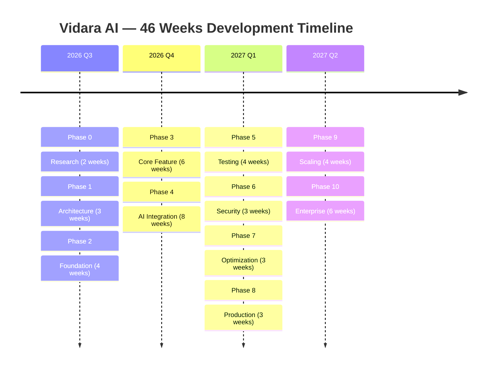
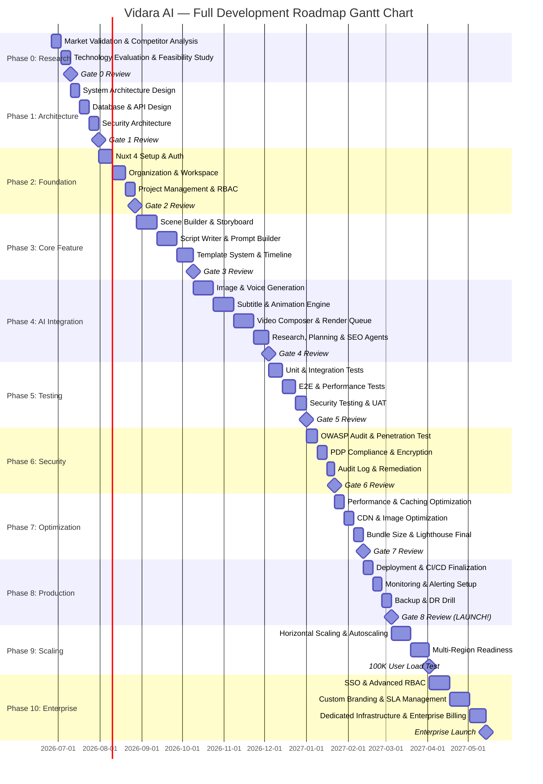
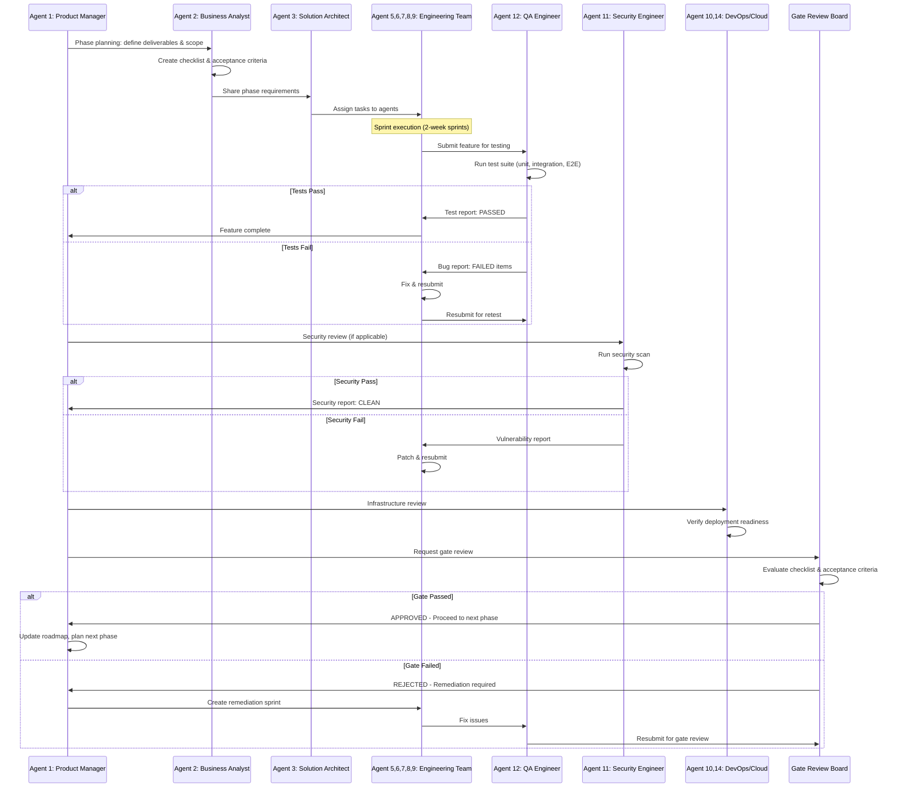
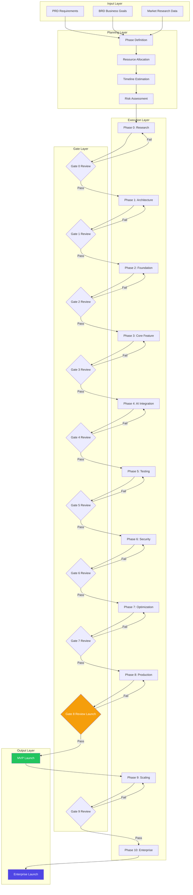
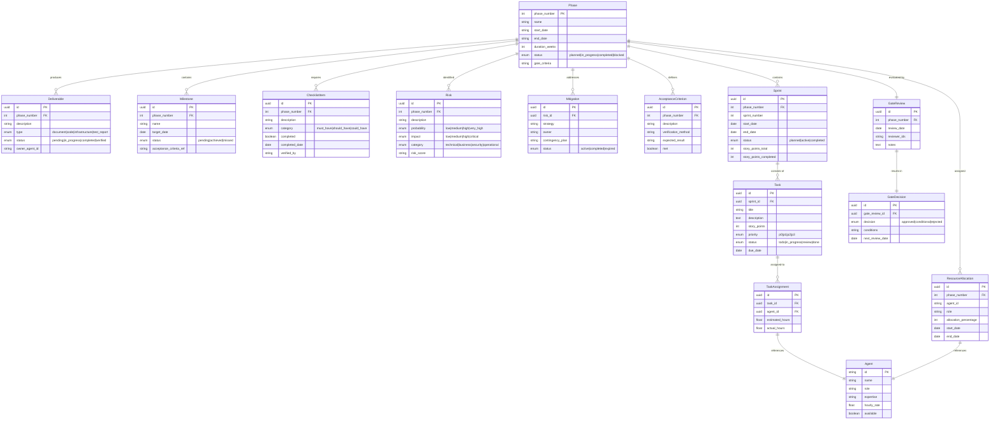

# ROADMAP — Vidara AI

| Metadata | |
|---|---|
| **Nama Dokumen** | Roadmap Document |
| **Project** | Vidara AI — AI YouTube Video Generator SaaS |
| **Version** | 1.0 |
| **Tanggal** | 2026-06-26 |
| **Penanggung Jawab** | Agent 1 — Senior Product Manager |
| **Status** | Final |
| **Cross-Reference** | [PRD](prd.md) · [BRD](brd.md) · [Tech Stack](techstack.md) · [Architecture](architecture.md) · [AGENTS](AGENTS.md) |

---

## 1. Tujuan

Dokumen Roadmap ini mendefinisikan secara eksplisit keseluruhan perjalanan pengembangan **Vidara AI** — dari riset awal hingga enterprise-scale deployment. Setiap phase mencakup deliverables, milestone, checklist, risk, mitigation, acceptance criteria, dan resource planning. Roadmap ini menjadi acuan utama bagi seluruh stakeholder — Product, Engineering, Design, QA, Security, DevOps, dan Management — dalam melacak progress, mengalokasikan resource, dan mengelola ekspektasi timeline.

Tujuan utama roadmap:
- Menyelaraskan visi dan timeline antara 15 agents dan seluruh stakeholder
- Menyediakan mekanisme tracking yang terukur (deliverables, milestone, checklist)
- Mengidentifikasi dan memitigasi risiko di setiap phase secara proaktif
- Memastikan resource allocation optimal dengan simulated roleplay 15 agents
- Menjadi living document yang diperbarui setiap akhir phase

---

## 2. Background

### 2.1 Mengapa Roadmap Ini Diperlukan

Berdasarkan analisis PRD (`prd.md:15-24`) dan BRD (`brd.md:29-42`), Vidara AI adalah platform SaaS kompleks yang mengintegrasikan 15 AI agents, pipeline produksi video 20+ langkah, multi-tenant architecture, dan enterprise-grade infrastructure. Tanpa roadmap yang ketat, risiko utama meliputi:

- **Feature creep**: Tanpa phase yang jelas, fitur terus bertambah tanpa delivery
- **Resource conflict**: 15 agents dengan keahlian berbeda perlu koordinasi waktu
- **Technical debt**: Arsitektur yang buruk di awal menyebabkan rewrite mahal di kemudian hari
- **Market miss**: Jika MVP terlalu lama, kompetitor (InVideo AI, HeyGen, Synthesia) menguasai pasar
- **Budget overrun**: Biaya AI API dan infrastructure membengkak tanpa phase planning

### 2.2 Metodologi

Roadmap menggunakan pendekatan **Phase-Gate Methodology** — setiap phase memiliki gate review sebelum melanjutkan ke phase berikutnya. Setiap gate memerlukan approval dari minimal 3 agents (Agent 1 — PM, Agent 3 — Architect, Agent 10 — DevOps).

### 2.3 Timeline Overview

| Phase | Durasi | Start | End | Gate |
|---|---|---|---|---|
| Phase 0: Research | 2 weeks | 2026-06-26 | 2026-07-09 | Market validation pass |
| Phase 1: Architecture | 3 weeks | 2026-07-10 | 2026-07-30 | Architecture review pass |
| Phase 2: Foundation | 4 weeks | 2026-07-31 | 2026-08-27 | Auth + Workspace working |
| Phase 3: Core Feature | 6 weeks | 2026-08-28 | 2026-10-08 | Scene builder MVP ready |
| Phase 4: AI Integration | 8 weeks | 2026-10-09 | 2026-12-03 | Full pipeline operational |
| Phase 5: Testing | 4 weeks | 2026-12-04 | 2026-12-31 | All tests pass ≥90% |
| Phase 6: Security | 3 weeks | 2027-01-01 | 2027-01-21 | Pentest zero critical |
| Phase 7: Optimization | 3 weeks | 2027-01-22 | 2027-02-11 | Lighthouse ≥95 |
| Phase 8: Production | 3 weeks | 2027-02-12 | 2027-03-04 | Deployed to production |
| Phase 9: Scaling | 4 weeks | 2027-03-05 | 2027-04-01 | 100K user ready |
| Phase 10: Enterprise | 6 weeks | 2027-04-02 | 2027-05-13 | Enterprise launch |

**Total estimated timeline: 46 weeks (~10.5 months)**

---

## 3. Objective

### 3.1 Business Objectives (Cross-Reference: BRD BO-01 to BO-06)

| ID | Objective | Target | Aligned Phase |
|---|---|---|---|
| RO-01 | Market validation lengkap dengan analisis 15+ kompetitor | Validated TAM/SAM/SOM | Phase 0 |
| RO-02 | Arsitektur tervalidasi untuk scale dari 100 ke 1M users | Architecture Decision Records lengkap | Phase 1 |
| RO-03 | Foundation platform siap: auth, organization, workspace, RBAC | 100% coverage auth flows | Phase 2 |
| RO-04 | Core feature MVP: scene builder, storyboard, script writer | User bisa buat video dari prompt | Phase 3 |
| RO-05 | Full AI pipeline: image, voice, subtitle, animation, composer | Pipeline completion ≥85% | Phase 4 |
| RO-06 | Software quality: unit, integration, E2E, performance test | Code coverage ≥80%, E2E pass 100% | Phase 5 |
| RO-07 | Security compliance: OWASP, PDP, encryption, audit | Zero critical vulnerabilities | Phase 6 |
| RO-08 | Performance optimization: Lighthouse ≥95, bundle <500KB | Lighthouse score ≥95 | Phase 7 |
| RO-09 | Production deployment with monitoring and alerting | Uptime ≥99.9% in first month | Phase 8 |
| RO-10 | Horizontal scaling and autoscaling infrastructure | 100K concurrent user ready | Phase 9 |
| RO-11 | Enterprise features: SSO, custom branding, dedicated infra | Enterprise SLA ≥99.95% | Phase 10 |

### 3.2 Technical Objectives (Cross-Reference: PRD NFR-01 to NFR-21)

| ID | Objective | Target | Measurement |
|---|---|---|---|
| TO-01 | API response time p95 | <500ms | Grafana |
| TO-02 | Page load LCP | <2.5s | Lighthouse |
| TO-03 | Pipeline completion per durasi | 6 min (<15min), 8 min (<20min), 15 min (<30min) | Internal timer |
| TO-04 | AI cost per durasi | 6 min (<$1.50), 8 min (<$2.00), 15 min (<$5.00) | Billing dashboard |
| TO-05 | Uptime SLA | ≥99.9% | Uptime monitor |
| TO-06 | Render success rate | ≥98% | System metric |
| TO-07 | Code coverage | ≥80% | Vitest |
| TO-08 | WCAG accessibility | Level AA | axe-core |

---

## 4. Scope

### 4.1 In Scope (per Phase)

| Phase | In Scope |
|---|---|
| Phase 0 | Market research, competitor analysis, technology evaluation, feasibility study |
| Phase 1 | System architecture, database design, API design, security architecture, tech stack finalization |
| Phase 2 | Nuxt 4 project setup, authentication (email + OAuth), organization CRUD, workspace CRUD, project management, RBAC |
| Phase 3 | Scene builder UI, storyboard editor, script writer AI integration, prompt builder, template system, timeline |
| Phase 4 | Image generation, voice generation, subtitle generation, animation engine, video composer, research agent, planning agent, SEO agent, publishing agent, render queue |
| Phase 5 | Unit testing, integration testing, E2E testing (Playwright), performance testing (k6), security testing, UAT with beta users |
| Phase 6 | OWASP Top 10 audit, penetration testing, PDP compliance, data encryption (AES-256), audit log implementation, DPO appointment |
| Phase 7 | Performance optimization, caching layer (Redis), CDN configuration, image optimization, bundle size reduction, Lighthouse optimization |
| Phase 8 | Production deployment (staging → production), monitoring (Grafana + Prometheus), alerting (PagerDuty), backup automation, CI/CD finalization |
| Phase 9 | Horizontal scaling (multi-instance), autoscaling configuration, multi-region readiness, load testing 100K users |
| Phase 10 | SSO (SAML/OIDC), advanced RBAC (custom roles), custom branding (white-label), SLA management, dedicated infrastructure, enterprise billing |

### 4.2 Out of Scope (Phase 11+)

| Item | Alasan | Target |
|---|---|---|
| Mobile native app (iOS/Android) | PWA cukup; native app membutuhkan dedicated mobile team | V2 — Q3 2027 |
| Live streaming platform | Fokus on-demand video | V2 — Q4 2027 |
| Social media selain YouTube | TikTok, Instagram, Shorts integration | V2 — Q3 2027 |
| Custom AI model training untuk user | Model fine-tuning via API; dedicated infra on-demand | V3 — Q1 2028 |
| Video hosting platform | Hosting via YouTube + Cloudflare Stream | V2 — Q2 2027 |
| Real-time collaborative editing | Versioning + comment cukup di V1 | V2 — Q4 2027 |

---

## 5. Stakeholder

### 5.1 Stakeholder Matrix (Cross-Reference: PRD Section 5, BRD Section 5)

| Role | Agent ID | Phase Terlibat | R | A | C | I |
|---|---|---|---|---|---|---|
| **CEO / Founder** | — | Semua Phase | Final decision | — | — | I |
| **CTO** | — | Semua Phase | Architecture governance | — | — | I |
| **Senior Product Manager** | Agent 1 | Semua Phase | Product vision, roadmap | A | C | R |
| **Business Analyst** | Agent 2 | Phase 0,1,3,5,6 | Requirements, UAT | A | C | R |
| **Senior Solution Architect** | Agent 3 | Phase 1,2,4,7,9 | Solution design, governance | A | C | R |
| **Senior Software Architect** | Agent 4 | Phase 1,2,3,4,7 | Software architecture | A | C | R |
| **Senior Full Stack Engineer** | Agent 5 | Phase 2,3,4,7,8 | Implementation | A | C | R |
| **Senior AI Engineer** | Agent 6 | Phase 3,4,6,9 | AI pipeline, orchestration | A | C | R |
| **Senior Prompt Engineer** | Agent 7 | Phase 3,4 | Prompt design, optimization | A | C | R |
| **Senior UI/UX Designer** | Agent 8 | Phase 2,3,4,7 | User experience, usability | A | C | R |
| **Senior Design System Eng** | Agent 9 | Phase 2,3,7 | Design system, components | A | C | R |
| **Senior DevOps Engineer** | Agent 10 | Phase 1,2,7,8,9 | CI/CD, infrastructure | A | C | R |
| **Senior Security Engineer** | Agent 11 | Phase 1,2,6,8 | Security, compliance | A | C | R |
| **Senior QA Engineer** | Agent 12 | Phase 3,4,5,6 | Testing, quality gates | A | C | R |
| **Senior Database Engineer** | Agent 13 | Phase 1,2,4,7,9 | Database, data architecture | A | C | R |
| **Senior Cloud Architect** | Agent 14 | Phase 1,7,8,9,10 | Cloud infrastructure, scaling | A | C | R |
| **Indonesian Software Cons.** | Agent 15 | Phase 0,1,6,10 | Local compliance, market | A | C | R |

**RACI:** R = Responsible, A = Accountable, C = Consulted, I = Informed

---

## 6. Requirement

### 6.1 Phase-Level Requirements

| ID | Requirement | Phase | Priority | Cross-Reference |
|---|---|---|---|---|
| REQ-00 | Market research must validate TAM ≥$500M | 0 | Critical | BRD Section 2.2 |
| REQ-01 | Architecture must support C4 model documentation | 1 | High | ARCH Section 1 |
| REQ-02 | Auth system must support email + Google + GitHub OAuth | 2 | Critical | PRD F1-F5 |
| REQ-03 | Workspace must support multi-tenant with RBAC | 2 | Critical | PRD F9-F11 |
| REQ-04 | Scene builder must support drag-and-drop timeline | 3 | Critical | PRD F19 |
| REQ-05 | Script writer must generate from prompt with tone control | 3 | Critical | PRD F17 |
| REQ-06 | Image generation must support 4 variations per scene | 4 | High | PRD F23 |
| REQ-07 | Voice generation must support 50+ voices multilingual | 4 | High | PRD F26 |
| REQ-08 | Research agent must do web search with source validation | 4 | High | PRD F38 |
| REQ-09 | Video composer must support multi-track timeline | 4 | Critical | PRD F30 |
| REQ-10 | Unit test coverage ≥80% across all packages | 5 | High | PRD NFR-17 |
| REQ-11 | E2E tests must cover all critical user flows | 5 | Critical | PRD NFR-13 |
| REQ-12 | OWASP Top 10 vulnerability scan must show zero critical | 6 | Critical | PRD NFR-08 |
| REQ-13 | Lighthouse Performance score must be ≥95 | 7 | High | PRD NFR-01 |
| REQ-14 | Production uptime must be ≥99.9% after launch | 8 | Critical | PRD NFR-04 |
| REQ-15 | System must scale to 100K concurrent users | 9 | High | PRD NFR-06 |
| REQ-16 | Enterprise must support SAML/OIDC SSO | 10 | High | BRD BR-09 |

---

## 7. Functional Requirement

### 7.1 Per-Phase Functional Requirements

**Phase 0 — Research:**
- FR-00-01: Competitor analysis document covering ≥15 competitors
- FR-00-02: Technology evaluation matrix with ≥3 options per category
- FR-00-03: Market sizing report (TAM, SAM, SOM)
- FR-00-04: User persona document (minimum 3 personas)
- FR-00-05: Technical feasibility study for AI pipeline

**Phase 1 — Architecture:**
- FR-01-01: C4 Level 1-4 architecture diagrams (Mermaid)
- FR-01-02: Database schema for all core entities (ERD)
- FR-01-03: OpenAPI 3.1 specification for all public endpoints
- FR-01-04: Security architecture document (threat model)
- FR-01-05: Technical Decision Records minimum 10 TDRs

**Phase 2 — Foundation:**
- FR-02-01: User registration with email/password + OAuth
- FR-02-02: JWT-based authentication with refresh token rotation
- FR-02-03: Email verification flow (resend, expiry 24h)
- FR-02-04: Password reset flow (token expiry 1h)
- FR-02-05: Organization CRUD with role-based access
- FR-02-06: Workspace CRUD with invitation system
- FR-02-07: Project CRUD with folder hierarchy (5 levels)
- FR-02-08: RBAC with 4 default roles (Owner, Admin, Editor, Viewer)

**Phase 3 — Core Feature:**
- FR-03-01: Scene builder with drag-and-drop scene management
- FR-03-02: Storyboard editor with visual panel layout
- FR-03-03: AI script writer with tone, duration, language parameters
- FR-03-04: Prompt builder with structured system + user prompt
- FR-03-05: Prompt library with categories and search
- FR-03-06: Template system (blank, from library, custom)
- FR-03-07: Timeline view with zoom, snap-to-grid

**Phase 4 — AI Integration:**
- FR-04-01: Image generator (DALL-E 3, Replicate SDXL, Fal AI)
- FR-04-02: Character consistency system (pgvector embeddings)
- FR-04-03: Thumbnail generator with 3 variations
- FR-04-04: Voice generator (ElevenLabs, OpenAI TTS) — 50+ voices
- FR-04-05: Subtitle generator (SRT, VTT, ASS) with style editor
- FR-04-06: Music library (curated + AI-generated)
- FR-04-07: Sound effect generator
- FR-04-08: Animation engine (Ken Burns, transitions, keyframes)
- FR-04-09: Video composer (multi-track timeline)
- FR-04-10: Render queue with priority system
- FR-04-11: Export (MP4, MOV, WEBM, GIF — 720p to 4K)
- FR-04-12: YouTube upload with OAuth 2.0
- FR-04-13: Research agent (web search, source collection)
- FR-04-14: Planning agent (scene breakdown, narrative arc)
- FR-04-15: SEO agent (title, desc, tags, chapters)
- FR-04-16: Publishing agent (scheduling, batch)

**Phase 5 — Testing:**
- FR-05-01: Unit test suite for all packages (Vitest)
- FR-05-02: Integration test suite for API endpoints
- FR-05-03: E2E test suite for critical user flows (Playwright)
- FR-05-04: Performance test suite (k6) — 100 to 10K concurrent
- FR-05-05: Security test suite (SAST, DAST, dependency scan)

**Phase 6 — Security:**
- FR-06-01: OWASP Top 10 automated scan (ZAP, Snyk, Trivy)
- FR-06-02: Penetration test report (manual + automated)
- FR-06-03: PDP compliance checklist completed
- FR-06-04: AES-256 encryption at rest implementation
- FR-06-05: TLS 1.3 enforcement
- FR-06-06: Audit log with immutable storage

**Phase 7 — Optimization:**
- FR-07-01: SSR caching (Nitro route caching)
- FR-07-02: Redis caching layer (session, API response)
- FR-07-03: Cloudflare CDN configuration
- FR-07-04: Image optimization (WebP/AVIF, responsive)
- FR-07-05: Bundle size optimization (code splitting, tree shaking)
- FR-07-06: Lighthouse audit remediation

**Phase 8 — Production:**
- FR-08-01: CI/CD pipeline (GitHub Actions → staging → production)
- FR-08-02: Docker Compose production configuration
- FR-08-03: Monitoring stack (Grafana, Prometheus, Loki, Sentry)
- FR-08-04: Alerting (PagerDuty, Slack, Email)
- FR-08-05: Backup automation (PostgreSQL, MinIO, Redis)
- FR-08-06: Disaster recovery runbook

**Phase 9 — Scaling:**
- FR-09-01: Horizontal pod autoscaling (CPU/memory based)
- FR-09-02: Read replica configuration (PostgreSQL)
- FR-09-03: Redis cluster with Sentinel
- FR-09-04: MinIO erasure coding cluster
- FR-09-05: Load testing validated at 100K concurrent users

**Phase 10 — Enterprise:**
- FR-10-01: SAML 2.0 / OIDC SSO integration
- FR-10-02: Custom role definitions (advanced RBAC)
- FR-10-03: White-label custom branding (domain, logo, CSS)
- FR-10-04: SLA dashboard with uptime reporting
- FR-10-05: Dedicated worker pool for enterprise tenants
- FR-10-06: Enterprise billing (invoice, PO, annual contract)

---

## 8. Non Functional Requirement

| ID | Kategori | Requirement | Target | Phase |
|---|---|---|---|---|
| NFR-00 | Research | Market report accuracy | ±10% of actual market size | 0 |
| NFR-01 | Architecture | Documentation completeness | C4 Level 1-4 all documented | 1 |
| NFR-02 | Performance | Page load time (LCP) | <2.5s | 2 |
| NFR-03 | Performance | API response time (p95) | <500ms | 2 |
| NFR-04 | Performance | Pipeline completion (6 min / 8 min / 15 min video) | <15 min / <20 min / <30 min | 4 |
| NFR-05 | Availability | Uptime SLA | ≥99.9% | 8 |
| NFR-06 | Reliability | Render success rate | ≥98% | 4 |
| NFR-07 | Scalability | Concurrent active pipelines | 100 (min) → 10,000 (target) | 9 |
| NFR-08 | Security | OWASP Top 10 compliance | Zero critical/high | 6 |
| NFR-09 | Security | Data encryption | AES-256 at rest, TLS 1.3 in transit | 6 |
| NFR-10 | Security | Password hashing | Argon2 | 2 |
| NFR-11 | Usability | WCAG accessibility | Level AA | 3 |
| NFR-12 | Usability | Onboarding first video | <5 menit | 3 |
| NFR-13 | Compatibility | Browser support | Chrome, Firefox, Safari, Edge — last 2 | 5 |
| NFR-14 | Storage | Asset storage scalability | Up to 1 PB | 9 |
| NFR-15 | Compliance | UU PDP Indonesia | Consent, data subject rights, DPO | 6 |
| NFR-16 | Compliance | YouTube ToS compliance | API quota, copyright | 4 |
| NFR-17 | Maintainability | Code coverage | ≥80% | 5 |
| NFR-18 | Maintainability | API documentation | ≥90% endpoints documented | 1 |
| NFR-19 | Cost | AI cost per durasi (6 min / 8 min / 15 min) | <$1.50 / <$2.00 / <$5.00 | 4 |
| NFR-20 | DR | RPO | ≤1 hour | 8 |
| NFR-21 | DR | RTO | ≤4 hours | 8 |
| NFR-22 | Enterprise | SSO SAML/OIDC compliance | All major IdPs supported | 10 |
| NFR-23 | Enterprise | Enterprise SLA | ≥99.95% uptime | 10 |

---

## 9. Workflow

### 9.1 Phase Execution Workflow

Setiap phase dalam roadmap mengikuti workflow berikut:

```
┌─────────────────────────────────────────────────────────────────────┐
│                      PHASE EXECUTION WORKFLOW                        │
├─────────────────────────────────────────────────────────────────────┤
│                                                                      │
│  ┌──────────┐   ┌──────────┐   ┌──────────┐   ┌──────────┐        │
│  │ Phase    │──▶│ Sprint   │──▶│ Daily    │──▶│ Review   │        │
│  │ Planning │   │ Execution│   │ Standup  │   │ Demo     │        │
│  └──────────┘   └──────────┘   └──────────┘   └──────────┘        │
│       │              │              │              │                │
│       ▼              ▼              ▼              ▼                │
│  ┌──────────┐   ┌──────────┐   ┌──────────┐   ┌──────────┐        │
│  │ Resource │   │ Agent    │   │ Blocker  │   │ Gate     │        │
│  │ Allocation│  │ Assignment│   │ Triage   │   │ Review   │        │
│  └──────────┘   └──────────┘   └──────────┘   └──────────┘        │
│                                                    │                │
│                                                    ▼                │
│                                           ┌──────────────┐         │
│                                           │ Pass Gate?   │         │
│                                           │ Yes → Next   │         │
│                                           │ No → Remediate│        │
│                                           └──────────────┘         │
│                                                                      │
└─────────────────────────────────────────────────────────────────────┘
```

### 9.2 Inter-Phase Dependency Flow

```
Phase 0 ──→ Phase 1 ──→ Phase 2 ──→ Phase 3 ──→ Phase 4
  │            │                          ↑            │
  │            │                          │            │
  │            └──────────────────────────┘            │
  │                                                    │
  ▼                                                    ▼
Phase 5 ←──────────────────────────────────── Phase 4 (continued)
  │
  ▼
Phase 6 ──→ Phase 7 ──→ Phase 8 ──→ Phase 9 ──→ Phase 10
```

**Key dependencies:**
- Phase 1 (Architecture) must complete before Phase 2 (Foundation)
- Phase 2 (Foundation) must complete before Phase 3 (Core Feature) and Phase 4 (AI Integration)
- Phase 3 and Phase 4 can run partially in parallel for non-conflicting features
- Phase 5 (Testing) requires Phase 3 and Phase 4 completions
- Phase 6 (Security) requires Phase 5 pass (stable codebase)
- Phase 8 (Production) requires Phase 6 and Phase 7 completions

---

## 10. Flowchart — Mermaid Timeline



---

## 11. Mermaid Diagram — Gantt Chart



---

## 12. Sequence Diagram — Phase Execution Lifecycle



---

## 13. Architecture Diagram — Roadmap Decision Flow



---

## 14. ER Diagram — Roadmap Data Model



---

## 15. Decision Table — Feature Priority by Phase

| Feature | Phase | Business Value | Complexity | User Impact | Risk | Priority | Resource (Agent) |
|---|---|---|---|---|---|---|---|
| Market Research | 0 | High | Low | Medium | Low | P0 | 1, 2, 15 |
| Competitor Analysis | 0 | High | Low | Low | Low | P0 | 1, 2 |
| Tech Evaluation | 0 | High | Medium | Low | Medium | P0 | 3, 4, 14 |
| System Architecture | 1 | Critical | High | Medium | Medium | P0 | 3, 4, 13 |
| Database Design | 1 | Critical | High | Low | High | P0 | 13, 3 |
| API Design | 1 | Critical | Medium | Medium | Medium | P0 | 4, 5 |
| Security Architecture | 1 | Critical | Medium | Low | High | P0 | 11, 3 |
| Authentication | 2 | Critical | Medium | Critical | Medium | P0 | 5, 11 |
| Organization | 2 | Critical | Medium | High | Medium | P0 | 5, 8 |
| Workspace | 2 | Critical | Medium | High | Medium | P0 | 5, 8 |
| RBAC | 2 | Critical | Medium | Medium | High | P0 | 5, 11 |
| Project Management | 2 | Critical | Low | Critical | Low | P0 | 5, 8 |
| Scene Builder | 3 | Critical | High | Critical | High | P0 | 5, 8, 9 |
| Storyboard | 3 | High | Medium | High | Low | P0 | 5, 8 |
| Script Writer | 3 | Critical | High | Critical | High | P0 | 5, 6, 7 |
| Prompt Builder | 3 | High | Medium | High | Low | P1 | 5, 7 |
| Prompt Library | 3 | Medium | Low | Medium | Low | P1 | 5 |
| Template System | 3 | High | Medium | High | Low | P1 | 5, 8 |
| Image Generator | 4 | Critical | Medium | Critical | Medium | P0 | 6, 5 |
| Character Consistency | 4 | High | High | High | High | P1 | 6, 13 |
| Thumbnail Generator | 4 | High | Low | High | Low | P1 | 6, 5 |
| Voice Generator | 4 | High | Medium | High | Medium | P1 | 6, 5 |
| Subtitle Generator | 4 | Medium | Low | Medium | Low | P1 | 5 |
| Music Library | 4 | Medium | Low | Medium | Low | P1 | 6 |
| Sound Effects | 4 | Low | Low | Low | Low | P2 | 6 |
| Animation Engine | 4 | High | High | High | High | P1 | 6, 5 |
| Video Composer | 4 | Critical | Very High | Critical | Very High | P0 | 5, 6 |
| Render Queue | 4 | High | High | High | High | P0 | 5, 10 |
| Export | 4 | High | Medium | High | Medium | P1 | 5 |
| YouTube Upload | 4 | High | Medium | High | Medium | P1 | 5, 6 |
| Research Agent | 4 | High | High | High | High | P1 | 6, 7 |
| Planning Agent | 4 | Medium | Medium | High | Medium | P2 | 6, 7 |
| SEO Agent | 4 | Medium | Medium | Medium | Medium | P2 | 6, 7 |
| Publishing Agent | 4 | Low | Medium | Low | Low | P2 | 5, 6 |
| Unit Tests | 5 | Critical | Medium | Low | Low | P0 | 12, 5, 6 |
| Integration Tests | 5 | Critical | Medium | Low | Medium | P0 | 12, 5 |
| E2E Tests | 5 | Critical | High | Low | Medium | P0 | 12, 5 |
| Performance Tests | 5 | High | Medium | Low | Low | P1 | 12, 10 |
| OWASP Audit | 6 | Critical | Medium | Low | High | P0 | 11 |
| Penetration Test | 6 | Critical | High | Low | High | P0 | 11 |
| PDP Compliance | 6 | Critical | Medium | Low | High | P0 | 11, 15 |
| Encryption | 6 | Critical | Medium | Low | Medium | P0 | 11, 5 |
| Audit Log | 6 | High | Medium | Low | Low | P1 | 5, 11 |
| Performance Optimization | 7 | High | Medium | High | Low | P0 | 5, 10 |
| Caching Layer | 7 | High | Medium | Medium | Medium | P1 | 5, 13 |
| CDN Configuration | 7 | High | Low | Medium | Low | P1 | 10, 14 |
| Image Optimization | 7 | Medium | Low | High | Low | P1 | 5 |
| Bundle Size | 7 | High | Medium | High | Low | P1 | 5, 9 |
| Production Deployment | 8 | Critical | High | Critical | High | P0 | 10, 5, 14 |
| Monitoring | 8 | Critical | Medium | Low | Low | P0 | 10 |
| Alerting | 8 | High | Low | Low | Low | P1 | 10 |
| Backup Automation | 8 | Critical | Medium | Low | Medium | P0 | 10, 13 |
| CI/CD Finalization | 8 | Critical | Medium | Low | Medium | P0 | 10 |
| Horizontal Scaling | 9 | High | High | Medium | High | P1 | 10, 14 |
| Autoscaling | 9 | High | Medium | Medium | Medium | P1 | 10, 14 |
| Multi-Region | 9 | Medium | High | Low | High | P2 | 14, 10 |
| Load Test 100K | 9 | High | Medium | Low | Medium | P1 | 12, 10 |
| SSO (SAML/OIDC) | 10 | High | High | Medium | High | P1 | 5, 11 |
| Advanced RBAC | 10 | High | Medium | Medium | Low | P1 | 5 |
| Custom Branding | 10 | Medium | Medium | High | Low | P2 | 8, 9, 5 |
| SLA Dashboard | 10 | Medium | Medium | Low | Low | P2 | 10, 5 |
| Dedicated Infrastructure | 10 | High | High | Low | High | P1 | 14, 10 |
| Enterprise Billing | 10 | High | Medium | Medium | Medium | P1 | 5 |

---

## 16. Checklist

### Phase 0: Research
- [ ] Market sizing report completed (TAM, SAM, SOM)
- [ ] Competitor analysis covering ≥15 competitors
- [ ] 15 competitors mapped in feature comparison matrix
- [ ] Technology evaluation with ≥3 options per category
- [ ] User persona document (3+ personas)
- [ ] Technical feasibility study signed off
- [ ] Risk assessment for AI pipeline
- [ ] Budget projection for AI API costs
- [ ] Regulatory landscape analysis (PDP, PSE)
- [ ] Gate 0 review passed

### Phase 1: Architecture
- [ ] C4 Level 1 System Context diagram
- [ ] C4 Level 2 Container diagram
- [ ] C4 Level 3 Component diagram
- [ ] C4 Level 4 Code structure
- [ ] Database ERD for all core entities
- [ ] OpenAPI 3.1 specification (all endpoints)
- [ ] Security architecture document
- [ ] Threat model (STRIDE)
- [ ] Technical Decision Records (min 10)
- [ ] Technology stack finalized (see `techstack.md`)
- [ ] Gate 1 review passed

### Phase 2: Foundation
- [ ] Nuxt 4 project initialized with pnpm workspace
- [ ] Nuxt UI 4 design system integrated
- [ ] Email/password authentication working
- [ ] Google OAuth working
- [ ] GitHub OAuth working
- [ ] JWT with refresh token rotation
- [ ] Email verification flow
- [ ] Password reset flow
- [ ] Organization CRUD API + UI
- [ ] Workspace CRUD API + UI
- [ ] Invitation system (email invite)
- [ ] Project CRUD API + UI
- [ ] Folder hierarchy (5 levels)
- [ ] RBAC with 4 default roles
- [ ] Dashboard with widgets
- [ ] Activity feed
- [ ] Gate 2 review passed

### Phase 3: Core Feature
- [ ] Scene builder with drag-and-drop
- [ ] Storyboard editor
- [ ] AI script writer integration
- [ ] Prompt builder UI
- [ ] Prompt library with categories
- [ ] Template system (3+ pre-built templates)
- [ ] Timeline view
- [ ] Asset management basic
- [ ] Brand kit basic
- [ ] Versioning (auto-save)
- [ ] History tracking
- [ ] User settings (profile, theme)
- [ ] Onboarding tutorial
- [ ] Gate 3 review passed

### Phase 4: AI Integration
- [ ] Image generator (multi-provider)
- [ ] Character consistency via pgvector
- [ ] Thumbnail generator
- [ ] Voice generator (ElevenLabs + OpenAI TTS)
- [ ] Subtitle generator
- [ ] Music library (curated + AI)
- [ ] Sound effect generator
- [ ] Animation engine
- [ ] Video composer (multi-track)
- [ ] Render queue with priority
- [ ] Export (MP4, MOV, WEBM, GIF)
- [ ] YouTube upload
- [ ] Research agent
- [ ] Planning agent
- [ ] SEO agent
- [ ] Publishing agent
- [ ] AI chat assistant
- [ ] Brand kit full implementation
- [ ] Gate 4 review passed

### Phase 5: Testing
- [ ] Unit test suite (Vitest)
- [ ] Integration test suite
- [ ] E2E test suite (Playwright)
- [ ] Performance test suite (k6)
- [ ] Code coverage ≥80%
- [ ] E2E critical flow pass 100%
- [ ] API response time p95 <500ms
- [ ] Load test 100 concurrent users
- [ ] Cross-browser test (Chrome, Firefox, Safari, Edge)
- [ ] Accessibility audit (WCAG AA)
- [ ] UAT with 20 beta users
- [ ] Bug tracking and resolution
- [ ] Gate 5 review passed

### Phase 6: Security
- [ ] OWASP Top 10 automated scan
- [ ] SAST scan (SonarQube/Snyk)
- [ ] DAST scan (ZAP)
- [ ] Dependency vulnerability scan
- [ ] Manual penetration test
- [ ] PDP compliance checklist
- [ ] Data encryption AES-256 at rest
- [ ] TLS 1.3 enforcement
- [ ] Audit log immutable storage
- [ ] RBAC enforcement verified
- [ ] Rate limiting verified
- [ ] Session management verified
- [ ] DPO appointment
- [ ] Privacy policy updated
- [ ] Terms of service updated
- [ ] Gate 6 review passed

### Phase 7: Optimization
- [ ] Lighthouse Performance ≥95
- [ ] Lighthouse Accessibility ≥95
- [ ] Lighthouse SEO ≥95
- [ ] Lighthouse Best Practices ≥95
- [ ] SSR caching implemented
- [ ] Redis caching layer active
- [ ] Cloudflare CDN configured
- [ ] Image optimization (WebP/AVIF)
- [ ] Bundle size <500KB (gzipped)
- [ ] Code splitting implemented
- [ ] Lazy loading implemented
- [ ] Critical CSS inlined
- [ ] Gate 7 review passed

### Phase 8: Production
- [ ] Staging environment ready
- [ ] Production environment ready
- [ ] CI/CD pipeline (GitHub Actions)
- [ ] Docker Compose production config
- [ ] Nginx configuration
- [ ] SSL/TLS certificates
- [ ] Grafana dashboards
- [ ] Prometheus metrics
- [ ] Loki log aggregation
- [ ] Sentry error tracking
- [ ] PagerDuty alerting
- [ ] Slack notifications
- [ ] PostgreSQL automated backup
- [ ] MinIO backup to R2
- [ ] Disaster recovery runbook
- [ ] DR drill completed
- [ ] Blue-green deployment tested
- [ ] Rollback procedure tested
- [ ] Gate 8 review passed (LAUNCH)

### Phase 9: Scaling
- [ ] Horizontal pod autoscaling
- [ ] Read replica configuration
- [ ] Redis cluster with Sentinel
- [ ] MinIO erasure coding (EC:4)
- [ ] Connection pooling (PgBouncer)
- [ ] Database indexing optimization
- [ ] Load test 1,000 concurrent users
- [ ] Load test 10,000 concurrent users
- [ ] Load test 100,000 concurrent users
- [ ] Multi-region readiness assessment
- [ ] CDN performance validation
- [ ] Cost optimization review
- [ ] Gate 9 review passed

### Phase 10: Enterprise
- [ ] SAML 2.0 SSO integration
- [ ] OIDC SSO integration
- [ ] Tested with Okta, Azure AD, Google Workspace
- [ ] Custom role definitions (advanced RBAC)
- [ ] White-label custom domain
- [ ] White-label custom logo + CSS
- [ ] SLA dashboard
- [ ] Uptime reporting
- [ ] Dedicated worker pool
- [ ] Dedicated database instance option
- [ ] Enterprise billing (invoice, PO)
- [ ] Annual contract management
- [ ] Audit log export (CSV, JSON, PDF)
- [ ] Enterprise security review
- [ ] Enterprise launch announcement
- [ ] Gate 10 review passed

---

## 17. Risk

| ID | Phase | Risiko | Probabilitas | Dampak | Severity Score | Kategori |
|---|---|---|---|---|---|---|
| RSK-00-01 | 0 | Market research inaccurate — TAM overestimated | Medium | High | 12 | Business |
| RSK-00-02 | 0 | Technology feasibility fails for key AI pipeline step | Low | Critical | 10 | Technical |
| RSK-01-01 | 1 | Architecture over-engineered for MVP scope | Medium | Medium | 9 | Technical |
| RSK-01-02 | 1 | C4 diagrams not aligned with actual implementation | Medium | Medium | 9 | Process |
| RSK-02-01 | 2 | Nuxt 4 / Nuxt UI 4 unstable (early stage framework) | Medium | High | 12 | Technical |
| RSK-02-02 | 2 | OAuth provider breaking changes | Low | High | 8 | Technical |
| RSK-02-03 | 2 | RBAC complexity causes development delay | Medium | Medium | 9 | Technical |
| RSK-03-01 | 3 | Scene builder performance issues with complex scenes | High | High | 16 | Technical |
| RSK-03-02 | 3 | AI script quality inconsistent across topics | Medium | High | 12 | Product |
| RSK-03-03 | 3 | Template system too rigid, limiting user creativity | Medium | Medium | 9 | Product |
| RSK-04-01 | 4 | AI API costs exceed $2.00 per video target | Medium | Critical | 15 | Business |
| RSK-04-02 | 4 | OpenAI API downtime blocks pipeline | Medium | Critical | 15 | Technical |
| RSK-04-03 | 4 | Video rendering timeout (>30 min) | High | High | 16 | Technical |
| RSK-04-04 | 4 | Multi-agent orchestration causes workflow deadlock | Medium | High | 12 | Technical |
| RSK-04-05 | 4 | Character consistency fails across scenes | Medium | Medium | 9 | Product |
| RSK-04-06 | 4 | YouTube API quota limit reached for power users | High | Medium | 12 | Technical |
| RSK-05-01 | 5 | Test coverage target ≥80% not achievable within phase | Medium | Medium | 9 | Process |
| RSK-05-02 | 5 | E2E flaky tests requiring constant maintenance | High | Medium | 12 | Technical |
| RSK-06-01 | 6 | Penetration test finds critical vulnerabilities | Medium | Critical | 15 | Security |
| RSK-06-02 | 6 | PDP compliance gap requires major architectural change | Low | Critical | 10 | Security |
| RSK-07-01 | 7 | Lighthouse score stuck below 95 for key pages | Medium | Medium | 9 | Technical |
| RSK-07-02 | 7 | Bundle size optimization breaks existing components | Low | High | 8 | Technical |
| RSK-08-01 | 8 | Production deployment has extended downtime | Medium | Critical | 15 | Operational |
| RSK-08-02 | 8 | Monitoring stack misses critical alert | Medium | High | 12 | Operational |
| RSK-08-03 | 8 | Database migration causes data inconsistency | Low | Critical | 10 | Technical |
| RSK-09-01 | 9 | Horizontal scaling reveals database bottleneck | High | High | 16 | Technical |
| RSK-09-02 | 9 | Autoscaling doesn't trigger fast enough during spike | Medium | High | 12 | Technical |
| RSK-10-01 | 10 | SSO integration breaks with certain IdPs | Medium | High | 12 | Technical |
| RSK-10-02 | 10 | Custom branding causes performance regression | Low | Medium | 6 | Technical |
| RSK-10-03 | 10 | Enterprise SLA commitment exceeds infrastructure capability | Medium | Critical | 15 | Operational |

**Severity Score = Probabilitas × Dampak (1–5 each, max 25)**

---

## 18. Mitigation

| Risk ID | Mitigation Strategy | Owner | Trigger | Contingency |
|---|---|---|---|---|
| RSK-00-01 | Use multiple market research sources (Gartner, Forrester, internal survey); validate with 50+ creator interviews | Agent 1 | Research draft <50% confidence | Commission custom market research firm |
| RSK-00-02 | Build proof-of-concept for each critical AI pipeline step before Phase 1 commitment | Agent 6 | PoC failure rate >30% | Restructure pipeline to use proven third-party APIs |
| RSK-01-01 | Set clear MVP boundaries; defer non-essential complexity to Phase 9-10; regular architecture review | Agent 3 | Architecture scope >120% of MVP needs | Trim architecture to essentials, document deferred items |
| RSK-01-02 | Maintain architecture.md as living document; enforce C4 diagrams in CI (mermaid-validator) | Agent 4 | CI validation fails | Manual review + architecture sync meeting |
| RSK-02-01 | Pin Nuxt 4 version in package.json; comprehensive test suite; isolate UI framework version | Agent 5 | Breaking change detected | Lock version until tested; wrap incompatible API |
| RSK-02-02 | Use generic OAuth library (next-auth equivalent for Nuxt); monitor changelog | Agent 5 | OAuth flow fails | Fallback to email/password only; patch provider |
| RSK-02-03 | Implement RBAC incrementally (Owner first, add roles later); use PostgreSQL row-level security | Agent 5 | RBAC >2 sprints | Ship with Owner + Admin only; defer Editor/Viewer |
| RSK-03-01 | Implement virtual scrolling for scene list; lazy-load scene previews; limit max scenes (50) | Agent 5 | Scene render >500ms | Reduce animation complexity; show placeholder |
| RSK-03-02 | Implement quality gate with A/B model comparison; human evaluation score >4.0 | Agent 6 | Script score <3.5/5 | Fallback to curated script templates; manual rewrite option |
| RSK-03-03 | Design templates as flexible starting points; allow full override of all template values | Agent 8 | User feedback indicates rigidity | Add "blank project" as prominent option |
| RSK-04-01 | Cost dashboard real-time; cache identical prompts; batch similar requests; set hard budget per user | Agent 7 | Cost >$2.00/video avg | Increase pricing; switch to cheaper model; limit quality |
| RSK-04-02 | Circuit breaker pattern (5 failures → fallback); multi-provider strategy; queue retry 3x | Agent 6 | Provider downtime >5 min | Fallback to secondary AI provider; notify admin |
| RSK-04-03 | Progressive rendering (chunk-by-chunk preview); FFmpeg GPU acceleration; timeout per stage | Agent 10 | Render >20 min | Chunk video into segments; render in parallel |
| RSK-04-04 | Master Agent with timeout per sub-agent (60s); dead letter queue; max retry = 3 | Agent 6 | Workflow stuck >5 min | Human-in-the-loop intervention; manual pipeline step |
| RSK-04-05 | Face embedding validation before generation; reference image quality check | Agent 6 | Consistency score <0.8 | Use consistent style prompt instead of character-specific |
| RSK-04-06 | Distributed across multiple YouTube API keys; queue-based upload; off-peak scheduling | Agent 10 | API quota >80% | Send email notification; suggest scheduling for next day |
| RSK-05-01 | Prioritize critical path tests first; enforce coverage gate in CI (≥70% merge, ≥80% release) | Agent 12 | Coverage <70% at mid-phase | Add extra sprint for test completion |
| RSK-05-02 | Use Playwright trace viewer for debugging; retry flaky tests (max 3); quarantine unstable tests | Agent 12 | Flaky rate >10% | Weekly flaky test review; rewrite unstable selectors |
| RSK-06-01 | Conduct OWASP review early in Phase 2-4; continuous SAST scanning; fix critical immediately | Agent 11 | Critical finding in pentest | Stop feature work; fix critical within 48h; re-pentest |
| RSK-06-02 | Embed PDP requirements in Phase 1 architecture; involve Agent 15 in all data design decisions | Agent 15 | PDP gap identified | Isolate non-compliant feature; defer until compliant |
| RSK-07-01 | Lighthouse CI in every PR; performance budget enforced; performance regression = block merge | Agent 5 | Score <90 | Identify largest offender; optimize or remove component |
| RSK-07-02 | Comprehensive component test coverage for bundle optimization; visual regression testing | Agent 9 | Visual regression detected | Revert bundle change; optimize differently |
| RSK-08-01 | Blue-green deployment; rollback script tested in staging; deployment window (off-peak) | Agent 10 | Deploy fails >15 min | Rollback to previous version; notify users via status page |
| RSK-08-02 | Multi-channel alerting (PagerDuty + Slack + Email); redundant monitoring hosts | Agent 10 | Alert missed >5 min | On-call escalation (primary → secondary → CTO) |
| RSK-08-03 | Use pgroll or gh-ost for zero-downtime migrations; test migration in staging first | Agent 13 | Migration script error | Manual rollback via pg_dump restore |
| RSK-09-01 | Implement read replicas early (Phase 2); partition large tables (audit_log, generation_log) by month | Agent 13 | Query latency >200ms | Add read replica; optimize slow query; add index |
| RSK-09-02 | Pre-warm instances during known peak hours; HPA with custom metrics (queue depth) | Agent 10 | Scale-up >120s | Increase minimum replica count; over-provision 20% |
| RSK-10-01 | Test with top 5 IdPs (Okta, Azure AD, Google Workspace, OneLogin, Keycloak) | Agent 5 | IdP integration fails | Support OIDC standard only; custom integration on request |
| RSK-10-02 | Performance test with branding enabled/disabled; lazy-load custom assets | Agent 5 | Performance regression >10% | Cache branded assets aggressively; simplify branding options |
| RSK-10-03 | Infrastructure capacity planning for each enterprise client; dedicated cluster option | Agent 14 | SLA at risk | Isolate enterprise tenants to dedicated infrastructure |

---

## 19. Future Improvement (Post-Roadmap)

| ID | Improvement | Description | Target Phase | Timeline |
|---|---|---|---|---|
| FI-01 | Multi-platform publishing | TikTok, Instagram Reels, YouTube Shorts, Twitter/X video | Phase 11 | Q3 2027 |
| FI-02 | Real-time collaboration | CRDT-based collaborative editing (like Google Docs) | Phase 11 | Q3 2027 |
| FI-03 | Custom AI model fine-tuning | User uploads dataset → fine-tuned model for unique style | Phase 11 | Q4 2027 |
| FI-04 | AI video analysis & repurposing | Analyze existing video → generate new variations | Phase 11 | Q4 2027 |
| FI-05 | White-label marketplace | Creators sell templates, assets, voices on marketplace | Phase 12 | Q1 2028 |
| FI-06 | Mobile native apps | iOS (Swift) and Android (Kotlin) native apps | Phase 12 | Q1 2028 |
| FI-07 | Live streaming integration | Live video with AI-generated overlays and captions | Phase 12 | Q2 2028 |
| FI-08 | Advanced analytics with AI insights | Predictive analytics, trend forecasting, content strategy | Phase 12 | Q2 2028 |
| FI-09 | API for third-party developers | Public API for integrating Vidara AI into external tools | Phase 11 | Q3 2027 |
| FI-10 | Multi-language dubbing | Auto dubbing with lip-sync in 20+ languages | Phase 13 | Q3 2028 |

---

## 20. Acceptance Criteria

### Global Acceptance Criteria (All Phases)

| AC ID | Criteria | Verification Method |
|---|---|---|
| AC-00 | Each phase must complete all checklist items | Phase gate review |
| AC-01 | All deliverables produced and stored in `internal/docs/` | File existence check |
| AC-02 | Each phase gate review passed with ≥3 agent approvals | Gate review meeting minutes |
| AC-03 | No critical/high severity bugs remaining at phase end | Bug tracker report |
| AC-04 | All Mermaid diagrams valid and render correctly | Mermaid validator CI |
| AC-05 | Cross-references to PRD (`prd.md`) and BRD (`brd.md`) verified | Link checker |
| AC-06 | Each risk identified has corresponding mitigation | Risk register audit |
| AC-07 | Resource allocation documented and approved | Resource planning doc |
| AC-08 | Phase documented in roadmap.md with all 7 elements | Document review |

### Phase-Specific Acceptance Criteria

**Phase 0:**
| AC ID | Criteria | Expected Result |
|---|---|---|
| AC-00-01 | Market research document covers TAM, SAM, SOM | TAM ≥$500M, SAM ≥$150M, SOM ≥$30M |
| AC-00-02 | Competitor analysis covers ≥15 competitors with feature matrix | Matrix complete with all columns |
| AC-00-03 | Technology feasibility study signed off by Agent 3 + Agent 4 | Both signatures obtained |
| AC-00-04 | User personas validated with real creator interviews | ≥3 personas with real quotes |
| AC-00-05 | Budget projection within ±20% of actual costs | Projection document approved |

**Phase 1:**
| AC ID | Criteria | Expected Result |
|---|---|---|
| AC-01-01 | C4 Level 1-4 diagrams complete | All 4 levels in `architecture.md` |
| AC-01-02 | OpenAPI 3.1 spec covers all MVP endpoints | ≥50 endpoints documented |
| AC-01-03 | Database ERD normalized to 3NF | Normalization validated by Agent 13 |
| AC-01-04 | Security threat model covers STRIDE categories | All 6 categories analyzed |
| AC-01-05 | Tech stack finalized and approved | `techstack.md` signed off |

**Phase 2:**
| AC ID | Criteria | Expected Result |
|---|---|---|
| AC-02-01 | User can register, login, verify email | E2E test pass |
| AC-02-02 | User can create organization and workspace | E2E test pass |
| AC-02-03 | User can invite member to workspace | Invitation received and accepted |
| AC-02-04 | User can create, edit, delete projects | CRUD operations working |
| AC-02-05 | RBAC enforces permissions correctly | Role-based access test pass |
| AC-02-06 | Dashboard loads <3s with 5 projects | Lighthouse test pass |

**Phase 3:**
| AC ID | Criteria | Expected Result |
|---|---|---|
| AC-03-01 | Scene builder drag-and-drop works with 20 scenes | No performance degradation |
| AC-03-02 | AI script generates coherent 5-min script | Human evaluation ≥4.0/5 |
| AC-03-03 | Prompt builder compiles to valid AI prompt | Prompt accepted by AI API |
| AC-03-04 | Template system creates project from template | All scenes created correctly |
| AC-03-05 | Timeline view renders correctly with zoom | Snapping and zoom working |

**Phase 4:**
| AC ID | Criteria | Expected Result |
|---|---|---|
| AC-04-01 | Image generator produces 4 variations per scene | All 4 rendered |
| AC-04-02 | Voice generator produces natural speech (MOS ≥4.0) | MOS verified by test panel |
| AC-04-03 | Video composer assembles full video | Duration matches target ±10% |
| AC-04-04 | Render queue processes 10 concurrent jobs | All complete within 30 min |
| AC-04-05 | YouTube upload with OAuth 2.0 works | Video appears on YouTube |
| AC-04-06 | Research agent returns valid sources | All sources verifiable |
| AC-04-07 | Pipeline completion rate ≥85% | 85 of 100 test runs succeed |

**Phase 5:**
| AC ID | Criteria | Expected Result |
|---|---|---|
| AC-05-01 | Unit test coverage ≥80% | Vitest coverage report |
| AC-05-02 | E2E tests for all critical flows pass 100% | Playwright report all green |
| AC-05-03 | API p95 response time <500ms | k6 report |
| AC-05-04 | 100 concurrent users handled without errors | Load test report |
| AC-05-05 | Cross-browser tests pass on Chrome, Firefox, Safari, Edge | Playwright matrix |

**Phase 6:**
| AC ID | Criteria | Expected Result |
|---|---|---|
| AC-06-01 | OWASP Top 10 scan — zero critical/high | ZAP + Snyk report |
| AC-06-02 | Manual pentest — zero critical findings | Pentest report |
| AC-06-03 | PDP compliance checklist — 100% items checked | Compliance document |
| AC-06-04 | AES-256 encryption verified at rest | Encryption audit |
| AC-06-05 | TLS 1.3 enforced | SSL Labs test A+ |

**Phase 7:**
| AC ID | Criteria | Expected Result |
|---|---|---|
| AC-07-01 | Lighthouse Performance ≥95 | Lighthouse CI |
| AC-07-02 | Lighthouse Accessibility ≥95 | Lighthouse CI |
| AC-07-03 | Bundle size <500KB gzipped | Bundle analyzer |
| AC-07-04 | Cloudflare CDN serving static assets | CDN cache hit ratio ≥80% |
| AC-07-05 | All images served as WebP/AVIF | Image audit |

**Phase 8:**
| AC ID | Criteria | Expected Result |
|---|---|---|
| AC-08-01 | Production deployment successful with zero downtime | Deployment log |
| AC-08-02 | Monitoring stack shows all services healthy | Grafana dashboard |
| AC-08-03 | Alerting triggers correctly for test failure | Alert received within 1 min |
| AC-08-04 | Backup restored successfully in DR drill | Restore verified within RTO |
| AC-08-05 | CI/CD pipeline passes for all branches | GitHub Actions green |

**Phase 9:**
| AC ID | Criteria | Expected Result |
|---|---|---|
| AC-09-01 | System handles 1,000 concurrent users | k6 test pass |
| AC-09-02 | System handles 10,000 concurrent users | k6 test pass |
| AC-09-03 | Autoscaling triggers within 60s of load spike | CloudWatch/Docker logs |
| AC-09-04 | Response time degradation <20% at peak | Comparison report |
| AC-09-05 | Multi-region readiness assessment complete | Assessment document |

**Phase 10:**
| AC ID | Criteria | Expected Result |
|---|---|---|
| AC-10-01 | SSO works with Okta, Azure AD, Google Workspace | All 3 IdPs tested |
| AC-10-02 | Custom roles created and enforced | Role-based access test pass |
| AC-10-03 | Custom branding (domain, logo, CSS) applied | Visual verification |
| AC-10-04 | SLA dashboard shows ≥99.95% uptime | Dashboard verified |
| AC-10-05 | Enterprise billing generates correct invoices | Invoice accuracy 100% |

---

## 21. Resource Planning — 15 Agents Roleplay

### Agent Team Simulation

The following is a roleplay simulation of the 15-agent team discussing resource allocation across all 10 phases. Each agent provides their perspective based on their expertise.

---

**Agent 1 (Senior Product Manager):**
"Let's align resource allocation with business priorities. Phase 0 and 1 require heavy strategic input from Agents 1, 2, 3, 4. Phase 2-4 are engineering-heavy — Agents 5, 6, 7, 8, 9 need peak allocation. Security (Agent 11) is critical in Phase 6 but needs to be embedded from Phase 2. I recommend we allocate Agents 3 and 4 across multiple phases for architectural continuity. My allocation: 100% in Phase 0-2 for planning, reducing to 50% in Phase 3-5, then 30% advisory in Phase 6-10."

**Agent 2 (Business Analyst):**
"I need 100% allocation in Phase 0 for market research and requirements gathering. In Phase 1, I work with Agents 3 and 4 to translate business requirements to technical specs. Phase 2-4 requires my input for feature validation — 50% allocation. Phase 5 is critical for UAT coordination — 100%. Phase 6 for compliance requirements — 50%. My key deliverable is the requirements traceability matrix linking BRD → PRD → Roadmap."

**Agent 3 (Senior Solution Architect):**
"Phase 1 is my domain — I need 100% to design the end-to-end architecture. Phase 2 requires 50% to guide foundation implementation. Phase 4 needs 30% for AI pipeline architecture. Phase 7 needs 30% for optimization architecture review. Phase 9-10 needs 50% for scaling and enterprise architecture. I'll delegate C4 Level 4 (code structure) to Agent 4 once the container diagram is finalized."

**Agent 4 (Senior Software Architect):**
"I align with Agent 3 but focus on code-level architecture. Phase 1: 80% for software architecture patterns. Phase 2: 80% for Nuxt 4 project structure and module design. Phase 3: 60% for scene builder and storyboard architecture. Phase 4: 40% for video composer code architecture. Phase 7: 50% for optimization. I'll enforce clean architecture patterns — repository pattern, dependency injection, and separation of concerns."

**Agent 5 (Senior Full Stack Engineer):**
"I'm the primary implementer. Phase 2: 100% — auth, organization, workspace, project CRUD. Phase 3: 100% — scene builder, storyboard, script writer, prompt builder. Phase 4: 80% — video composer, render queue, export, YouTube upload. Phase 7: 100% — performance optimization. Phase 8: 50% — deployment support. I'll work closely with Agent 9 (Design System) for UI components and Agent 13 (DB Engineer) for schema optimization."

**Agent 6 (Senior AI Engineer):**
"My peak is Phase 3-4. Phase 3: 60% for AI script writer integration. Phase 4: 100% — image gen, voice gen, subtitle, animation, research agent, planning agent, SEO agent. Phase 2: 30% for setting up AI infrastructure (Temporal, BullMQ, AI Gateway). I need Agent 7 (Prompt Engineer) at 100% during Phase 4 for prompt optimization. Key concern: AI API cost management — I'll implement cost tracking per pipeline."

**Agent 7 (Senior Prompt Engineer):**
"I support Agent 6 fully. Phase 3: 80% — prompt templates for script writer, prompt builder design. Phase 4: 100% — prompt engineering for all AI agents (research, image, voice, SEO). Phase 2: 20% — prompt library structure. Phase 6: 30% — prompt injection prevention. My focus: chain-of-thought prompting for multi-agent coordination, context window optimization, and cost-per-token reduction through prompt compression."

**Agent 8 (Senior UI/UX Designer):**
"Phase 2: 100% — auth flows, dashboard, workspace UI. Phase 3: 100% — scene builder, storyboard, script editor UX. Phase 4: 80% — video composer, render queue, export UX. Phase 7: 50% — UX optimization for performance. Phase 10: 50% — enterprise UI customization. I'll ensure WCAG AA compliance from the start — Agent 9 implements my design tokens. Key flows: onboarding <5 minutes, prompt-to-video in minimum clicks."

**Agent 9 (Senior Design System Engineer):**
"I implement Agent 8's designs. Phase 2: 100% — Nuxt UI 4 theming, design tokens, component library. Phase 3: 80% — scene builder components, storyboard components. Phase 4: 60% — video player, timeline components. Phase 7: 100% — bundle optimization, code splitting. Phase 10: 50% — white-label theming. I'll maintain a Storybook component library with visual regression testing."

**Agent 10 (Senior DevOps Engineer):**
"Phase 1: 50% — infrastructure architecture review. Phase 2: 30% — development environment setup. Phase 4: 50% — render infrastructure, queue infrastructure. Phase 7: 80% — CDN, caching infrastructure. Phase 8: 100% — production deployment, monitoring, CI/CD. Phase 9: 100% — scaling infrastructure, autoscaling. Phase 10: 50% — dedicated infrastructure. I need Agent 14 (Cloud Architect) for cloud strategy."

**Agent 11 (Senior Security Engineer):**
"Phase 1: 100% — security architecture, threat modeling. Phase 2: 50% — auth security, RBAC implementation review. Phase 4: 30% — AI pipeline security review. Phase 6: 100% — OWASP audit, pentest, PDP compliance. Phase 8: 50% — production security review. Phase 10: 50% — SSO security, enterprise compliance. I'll run automated SAST/DAST scans weekly from Phase 2 onward — not waiting until Phase 6."

**Agent 12 (Senior QA Engineer):**
"Phase 3: 50% — early test planning, test case creation. Phase 4: 50% — AI pipeline test planning. Phase 5: 100% — all testing activities. Phase 6: 50% — security test validation. Phase 7: 50% — performance regression testing. Phase 8: 50% — production verification testing. I'll implement CI quality gates: unit tests must pass before merge, E2E tests must pass before release."

**Agent 13 (Senior Database Engineer):**
"Phase 1: 100% — database schema design, indexing strategy, migration planning. Phase 2: 50% — auth tables, organization tables implementation. Phase 3: 30% — project tables, scene tables. Phase 4: 50% — AI pipeline data model, vector embeddings (pgvector), asset storage model. Phase 7: 50% — query optimization, connection pooling. Phase 9: 100% — read replicas, partitioning, sharding strategy. My key risk: PostgreSQL connection pool exhaustion at scale."

**Agent 14 (Senior Cloud Architect):**
"Phase 1: 80% — cloud infrastructure architecture, cost modeling. Phase 7: 50% — CDN strategy, edge computing. Phase 8: 80% — production cloud infrastructure. Phase 9: 100% — multi-region, global scaling. Phase 10: 100% — dedicated enterprise infrastructure. I recommend Cloudflare for edge (CDN, R2, Workers) and bare-metal/GPU cloud for rendering. Cost projection: infrastructure at 100 users = $500/mo, at 100K users = $15K/mo."

**Agent 15 (Senior Indonesian Software Consultant):**
"Phase 0: 100% — Indonesian market analysis, regulatory landscape, competitor mapping. Phase 1: 50% — PDP/PSE compliance requirements in architecture. Phase 6: 100% — PDP compliance audit, PSE registration. Phase 10: 50% — enterprise compliance for Indonesian clients. Critical requirements: UU PDP data subject rights (access, deletion, portability), consent management, PSE registration deadline, content moderation for Indonesian-language content, and localization for Indonesian payments (GoPay, OVO, QRIS in Phase 2)."

---

### Resource Allocation Matrix (Person-Weeks per Phase)

| Agent | Role | P0 | P1 | P2 | P3 | P4 | P5 | P6 | P7 | P8 | P9 | P10 | Total |
|---|---|---|---|---|---|---|---|---|---|---|---|---|---|
| Agent 1 | Product Manager | 2 | 2 | 2 | 3 | 4 | 2 | 0.5 | 0.5 | 1 | 1 | 1 | **19** |
| Agent 2 | Business Analyst | 2 | 1.5 | 1 | 1.5 | 2 | 2 | 1 | 0 | 0.5 | 0.5 | 0.5 | **12.5** |
| Agent 3 | Solution Architect | 1 | 3 | 1.5 | 0.5 | 1 | 0 | 0 | 1 | 0.5 | 1.5 | 2 | **12** |
| Agent 4 | Software Architect | 0 | 3 | 2 | 2 | 1.5 | 0 | 0 | 1 | 0.5 | 1 | 1.5 | **12.5** |
| Agent 5 | Full Stack Engineer | 0 | 1 | 4 | 6 | 6 | 1 | 0 | 3 | 1.5 | 1 | 2 | **25.5** |
| Agent 6 | AI Engineer | 0.5 | 0.5 | 1 | 2 | 7 | 1 | 0 | 0 | 0 | 0.5 | 0 | **12.5** |
| Agent 7 | Prompt Engineer | 0 | 0 | 0.5 | 2 | 6 | 0.5 | 0.5 | 0 | 0 | 0 | 0 | **9.5** |
| Agent 8 | UI/UX Designer | 0 | 0 | 2 | 3 | 3 | 0.5 | 0 | 1 | 0 | 0 | 1 | **10.5** |
| Agent 9 | Design System Eng | 0 | 0 | 2 | 2 | 2 | 0 | 0 | 2 | 0 | 0 | 1 | **9** |
| Agent 10 | DevOps Engineer | 0 | 0.5 | 0.5 | 0 | 1 | 0.5 | 0 | 1.5 | 3 | 3.5 | 1.5 | **12** |
| Agent 11 | Security Engineer | 0 | 1.5 | 1 | 0 | 0.5 | 0.5 | 3 | 0 | 1 | 0 | 1 | **8.5** |
| Agent 12 | QA Engineer | 0 | 0 | 0 | 1 | 1 | 4 | 1 | 1 | 0.5 | 0.5 | 0 | **9** |
| Agent 13 | Database Engineer | 0 | 2 | 1 | 0.5 | 1 | 0 | 0 | 1 | 0.5 | 2 | 0.5 | **8.5** |
| Agent 14 | Cloud Architect | 0 | 1 | 0 | 0 | 0 | 0 | 0 | 0.5 | 1.5 | 3 | 3 | **9** |
| Agent 15 | Indonesian Consultant | 1 | 0.5 | 0 | 0 | 0 | 0 | 1.5 | 0 | 0 | 0 | 1 | **4** |

**Total Person-Weeks: 173.5**

### Team Composition Recommendation

| Phase | Core Team | Support Team | Lead Agent |
|---|---|---|---|
| Phase 0 | 1, 2, 15 | 3, 4, 6, 14 | Agent 1 (PM) |
| Phase 1 | 3, 4, 11, 13 | 1, 2, 10, 14, 15 | Agent 3 (Architect) |
| Phase 2 | 5, 8, 9 | 1, 3, 4, 10, 11, 13 | Agent 5 (Engineer) |
| Phase 3 | 5, 6, 7, 8 | 1, 2, 4, 9, 12, 13 | Agent 5 (Engineer) |
| Phase 4 | 5, 6, 7, 8, 9 | 1, 2, 3, 10, 11, 12, 13 | Agent 6 (AI Engineer) |
| Phase 5 | 12 | 1, 2, 5, 6, 7, 10, 11 | Agent 12 (QA) |
| Phase 6 | 11, 15 | 1, 2, 5, 7, 12 | Agent 11 (Security) |
| Phase 7 | 5, 9, 10 | 1, 3, 4, 8, 12, 13, 14 | Agent 5 (Engineer) |
| Phase 8 | 10, 14 | 1, 5, 11, 12, 13 | Agent 10 (DevOps) |
| Phase 9 | 10, 13, 14 | 1, 3, 4, 5, 12 | Agent 14 (Cloud Architect) |
| Phase 10 | 5, 10, 14 | 1, 3, 4, 8, 9, 11, 15 | Agent 1 (PM) |

---

## 22. Referensi Dokumen Lain

| Dokumen | Path | Deskripsi | Cross-Reference |
|---|---|---|---|
| Product Requirement Document | `internal/docs/prd.md` | Detailed product requirements, features, specifications | All phases — feature definitions |
| Business Requirement Document | `internal/docs/brd.md` | Business objectives, market analysis, stakeholder needs | Phase 0 — market validation |
| Tech Stack Document | `internal/docs/techstack.md` | Technology choices, comparisons, justifications | Phase 1 — architecture decisions |
| Architecture Document | `internal/docs/architecture.md` | C4 architecture, ERD, deployment, scalability | Phase 1 — architecture reference |
| Agent Team Profile | `internal/docs/AGENTS.md` | 15 agent roles, responsibilities, decision protocol | Phase 2-10 — resource planning |
| API Specification | `internal/docs/api-spec.md` | OpenAPI 3.1 specification | Phase 1 — API design |
| Security Policy | `internal/docs/security.md` | Security architecture, OWASP, encryption | Phase 6 — security audit |
| Deployment Guide | `internal/docs/deployment.md` | CI/CD, Docker, deployment procedures | Phase 8 — production |
| Disaster Recovery Plan | `internal/docs/disaster-recovery.md` | RTO, RPO, backup, recovery runbook | Phase 8 — DR drill |
| Monitoring Setup | `internal/docs/monitoring.md` | Grafana, Prometheus, Loki, Sentry, alerting | Phase 8 — monitoring |
| Competitor Analysis | `kompetitor-ai-video-2026.md` | 15+ competitor analysis | Phase 0 — market research |
| AI Video Research 2026 | `riset-ai-video-generator-2026.md` | AI video generation market research | Phase 0 — technology evaluation |

---

> **End of Roadmap Document** — Vidara AI © 2026
>
> *Dokumen ini adalah living document. Setiap perubahan harus melalui Gate Review dan disetujui oleh minimal Agent 1 (PM), Agent 3 (Architect), dan Agent 10 (DevOps).*
>
> *Last Updated: 2026-06-26 | Version: 1.0 | Next Review: End of Phase 0*
