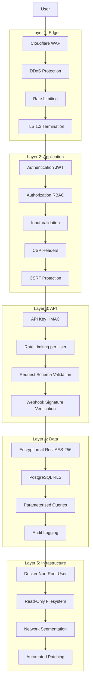
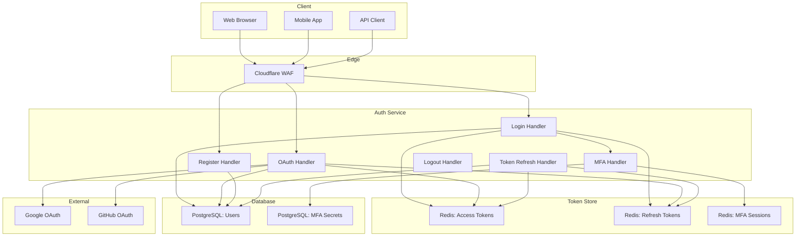
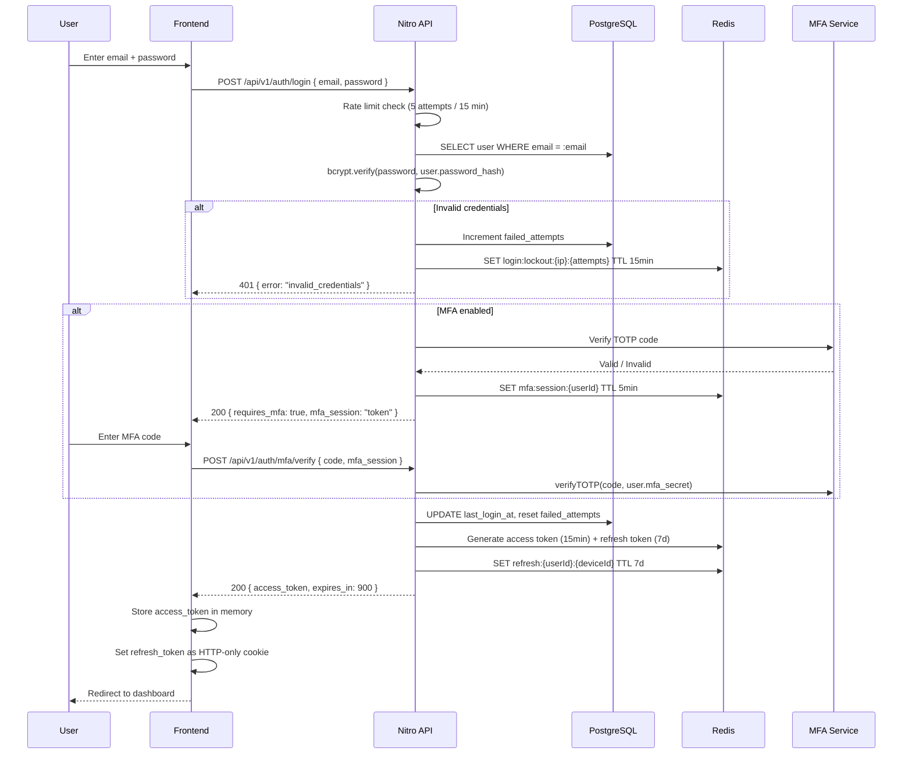
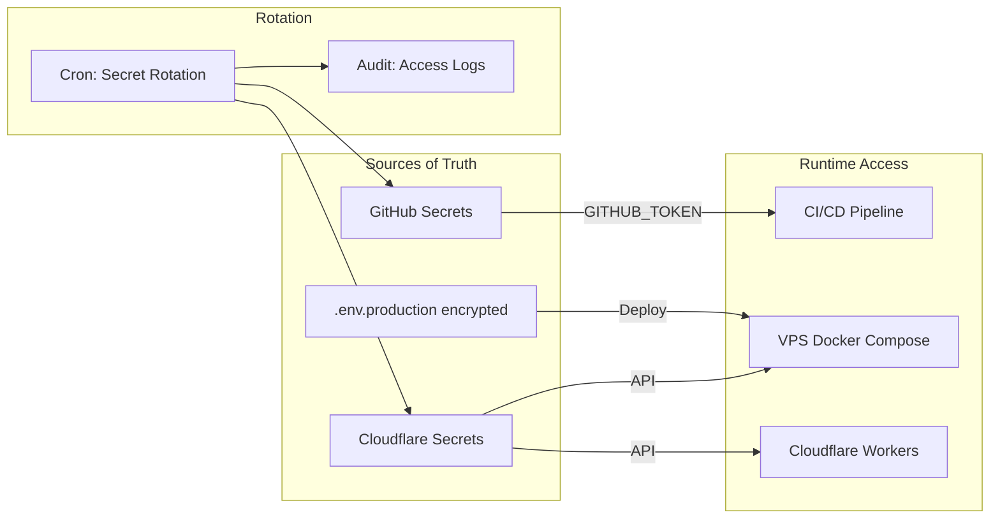
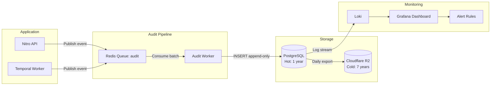
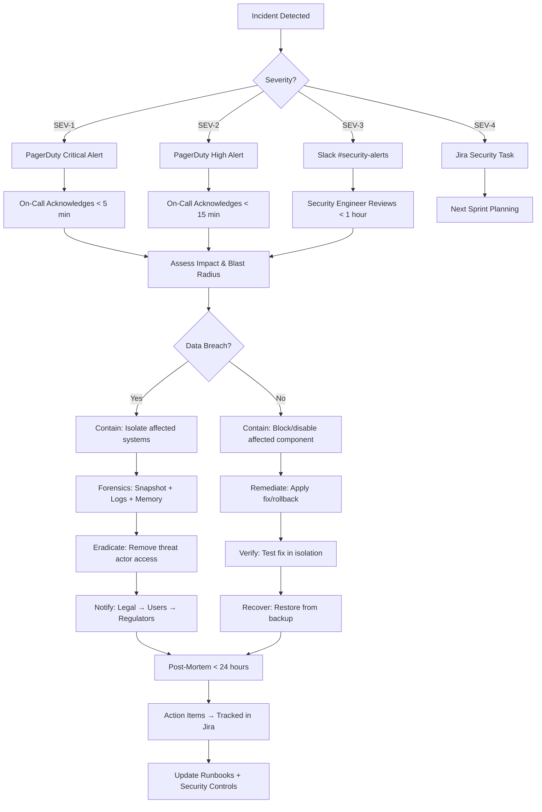

# Security Architecture — Vidara AI

> **Project:** Vidara AI — AI YouTube Video Generator SaaS  
> **Author:** Agent 11 — Senior Security Engineer  
> **Last Updated:** 2026-06-26  
> **Status:** Final  
> **Cross-Reference:** [Architecture](architecture.md) · [DevOps](devops.md) · [FRD](frd.md) · [Tech Stack](techstack.md) · [Database](database.md) · [Deployment](deployment.md)

---

## 1. Tujuan

Dokumen Security Architecture ini mendefinisikan seluruh kebijakan, kontrol, dan implementasi keamanan untuk platform Vidara AI. Mencakup security principles, OWASP Top 10 (2021) mitigation, authentication & authorization architecture, data protection, API security, infrastructure security, audit logging, incident response, dan compliance mapping. Bertujuan menjadi panduan utama bagi seluruh tim dalam membangun dan mengoperasikan platform yang aman, compliant, dan resilient terhadap threat.

---

## 2. Background

Vidara AI adalah SaaS multi-tenant yang memproses data sensitif: kredensial YouTube (OAuth tokens), API keys pihak ketiga (OpenAI, ElevenLabs, Runway, Deepgram), konten video user, data pembayaran (via Stripe), dan data pribadi pengguna (email, nama, profile pictures). Platform berinteraksi dengan 8+ API eksternal dan menyimpan file besar di object storage. Dengan arsitektur yang dijelaskan di `architecture.md` dan pipeline deployment di `devops.md`, attack surface mencakup: web application, REST API, WebSocket, AI pipeline workers, object storage, dan integrasi third-party.

---

## 3. Objective

1. Mendefinisikan security principles yang menjadi fondasi semua keputusan keamanan.
2. Memetakan dan memitigasi seluruh item OWASP Top 10 (2021) secara spesifik.
3. Mendesain authentication system yang aman (JWT, OAuth 2.0, MFA, session management).
4. Mendesain authorization system dengan RBAC + Row-Level Security (RLS).
5. Melindungi data at rest dan in transit dengan encryption standar industri.
6. Mengamankan API endpoint dengan rate limiting, validation, dan CORS.
7. Mendokumentasikan audit logging dengan immutable trail.
8. Menyediakan incident response plan dengan classification dan runbook.
9. Memetakan compliance requirements (SOC 2, ISO 27001, GDPR, UU PDP).
10. Semua diagram Mermaid valid dan cross-reference ke dokumen terkait.

---

## 4. Scope

**In Scope:**
- Security principles: defense in depth, least privilege, zero trust, secure by default
- OWASP Top 10 (2021): seluruh 10 kategori dengan mitigation spesifik
- Authentication: JWT, OAuth 2.0 / OpenID Connect, MFA, session management, password policies
- Authorization: RBAC (6 roles), permission matrix, PostgreSQL RLS, API key permissions
- Data protection: encryption at rest (AES-256), encryption in transit (TLS 1.3), PII handling, secret management
- API security: rate limiting, request validation, CORS, API key hashing, webhook signatures, idempotency
- Infrastructure security: Cloudflare WAF, Docker security, network security, automated patching
- Audit logging: security events, immutable trail, retention policy
- Incident response: SEV1-SEV4 classification, runbooks, forensics, communication template
- Compliance mapping: OWASP, SOC 2, ISO 27001, GDPR, UU PDP

**Out of Scope:**
- Physical security of data centers (handled by Cloudflare/VPS provider)
- Third-party vendor security audits (handled via vendor assessments)
- End-user device security (BYOD policy)
- AI model-specific security (model poisoning, adversarial attacks)
- Smart contract security (if any future web3 integration)

---

## 5. Stakeholder

| Stakeholder | Interest |
|---|---|
| CTO | Enterprise security posture, compliance, risk management |
| Security Engineer | Security controls implementation, monitoring, incident response |
| DevOps Engineer | Infrastructure security, container security, patching, WAF |
| Full Stack Engineer | Secure coding practices, input validation, auth implementation |
| AI Engineer | API key management, AI provider security, model output safety |
| Database Engineer | Encryption at rest, RLS policies, audit trails, backup security |
| Product Manager | Security features roadmap, user trust, compliance requirements |
| Legal & Compliance | Regulatory compliance (GDPR, UU PDP), data processing agreements |
| External Auditors | SOC 2 / ISO 27001 audit readiness, evidence collection |

---

## 6. Requirement

1. Semua komunikasi jaringan harus menggunakan TLS 1.3 dengan cipher suite modern.
2. Semua password harus di-hash dengan bcrypt (cost factor ≥12).
3. Semua secrets (API keys, tokens) harus di luar codebase dan di-access via secret manager.
4. Setiap request API harus melewati authentication dan authorization check.
5. Semua input user harus divalidasi dan disanitasi sebelum diproses.
6. Semua akses ke database harus melalui parameterized queries (SQLi prevention).
7. Semua logs keamanan harus immutable dan di-retain minimal 1 tahun.
8. Semua container harus berjalan sebagai non-root user dengan read-only filesystem.
9. Incident response harus didokumentasikan dengan severity classification dan runbook.
10. Dependency scanning harus automated dalam CI/CD pipeline.

---

## 7. Functional Requirement

| FR ID | Deskripsi |
|---|---|
| FR-SEC-01 | Sistem mendukung registrasi dengan email/password dan OAuth (Google, GitHub) |
| FR-SEC-02 | Sistem mengeluarkan JWT access token (15 menit) dan refresh token (7 hari) |
| FR-SEC-03 | Sistem mendukung MFA dengan TOTP dan SMS backup codes |
| FR-SEC-04 | Sistem menerapkan RBAC dengan 6 roles dan permission matrix |
| FR-SEC-05 | Sistem mengimplementasikan PostgreSQL Row-Level Security (RLS) |
| FR-SEC-06 | Sistem mendukung API keys dengan scope dan permission terbatas |
| FR-SEC-07 | Sistem melakukan rate limiting per user, per IP, per endpoint |
| FR-SEC-08 | Sistem memvalidasi semua input request dengan JSON Schema |
| FR-SEC-09 | Sistem memverifikasi webhook signatures dengan HMAC-SHA256 |
| FR-SEC-10 | Sistem mendukung idempotency keys untuk semua mutation endpoints |
| FR-SEC-11 | Sistem melakukan audit logging untuk semua security events |
| FR-SEC-12 | Sistem meng-enkripsi semua data sensitif di database dengan AES-256 |
| FR-SEC-13 | Sistem mendeteksi dan memblokir brute force login attempts |
| FR-SEC-14 | Sistem menyediakan endpoint untuk rotasi API keys dan secrets |

---

## 8. Non Functional Requirement

| NFR ID | Kategori | Target |
|---|---|---|
| NFR-SEC-01 | Authentication latency (p95) | <500ms |
| NFR-SEC-02 | Token verification latency (p95) | <10ms |
| NFR-SEC-03 | Rate limiting overhead | <5ms per request |
| NFR-SEC-04 | Audit log write latency | <100ms |
| NFR-SEC-05 | MFA setup time | <30s |
| NFR-SEC-06 | Session timeout enforcement accuracy | ±5s |
| NFR-SEC-07 | API key hashing throughput | 10,000 keys/second |
| NFR-SEC-08 | Encryption key rotation period | 90 days |
| NFR-SEC-09 | Security scan completion in CI | <10 min |
| NFR-SEC-10 | Incident detection to alert latency | <1 min |

---

## 9. Security Principles

### 9.1 Defense in Depth

Vidara AI menerapkan multiple layers of security controls:



### 9.2 Least Privilege

- Setiap user, service, dan process hanya mendapatkan minimum permissions yang diperlukan.
- API keys memiliki scoped permissions (read-only, write-specific, admin).
- Database accounts: read-only untuk analytics, read-write untuk API server, admin-only untuk migrations.
- Container processes: non-root user, no `--privileged` flag, no `CAP_SYS_ADMIN`.
- Temporal workers: hanya bisa mengakses queue dan database yang diperlukan.

### 9.3 Zero Trust

- Never trust, always verify. Setiap request harus diautentikasi dan diotorisasi.
- Network segmentation: internal services tidak boleh diakses dari public internet.
- Service-to-service communication menggunakan mutual TLS (mTLS) untuk workload identity.
- Semua akses ke database melewati connection pool dengan credential rotation.
- Continuous verification: setiap request dicek JWT validity, rate limit status, dan permission.

### 9.4 Secure by Default

- Semua fitur baru harus memiliki security review sebelum deployment.
- Default configuration adalah yang paling aman (fail closed).
- Error messages tidak boleh mengekspos internal details (stack traces, DB schema).
- Semua endpoints yang tidak memerlukan autentikasi harus di-whitelist secara eksplisit.
- Encryption enabled by default untuk semua data at rest dan in transit.

---

## 10. OWASP Top 10 (2021) Mitigation

### 10.1 A01: Broken Access Control

**Risk:** User bisa mengakses resource yang bukan miliknya.

**Mitigation:**
- **RBAC System**: 6 roles dengan permission matrix (lihat Section 12).
- **PostgreSQL RLS**: Row-level security di setiap tabel multi-tenant.
  ```sql
  -- Contoh RLS policy untuk projects table
  CREATE POLICY project_isolation ON projects
      FOR ALL
      USING (workspace_id IN (
          SELECT workspace_id FROM workspace_members
          WHERE user_id = current_setting('app.current_user_id')::uuid
      ));
  ```
- **API Gateway**: Setiap request diverifikasi JWT claims + permission check di middleware.
- **Direct Object Reference (IDOR) Prevention**: UUID v7 untuk semua resource IDs (tidak bisa ditebak).
- **Path Traversal Prevention**: Semua file paths di-normalisasi dan divalidasi dengan `path.resolve()` + `path.normalize()`.
- **Referensi**: Implementation detail di `architecture.md` Section 19 (C4 Component — Auth Module).

### 10.2 A02: Cryptographic Failures

**Risk:** Data sensitif terekspos karena encryption lemah atau tidak ada.

**Mitigation:**
- **Encryption at Rest**:
  - Database: AES-256 via PostgreSQL `pgcrypto` extension untuk PII columns.
  - Object Storage: Server-side encryption (SSE-S3) untuk semua video assets.
  - Secrets: Cloudflare Secrets + environment variables terenkripsi.
- **Encryption in Transit**:
  - TLS 1.3 minimum, cipher suite: `TLS_AES_256_GCM_SHA384`.
  - HSTS header: `max-age=31536000; includeSubDomains; preload`.
  - mTLS untuk internal service communication.
- **Key Management**:
  - Encryption keys di-rotate setiap 90 hari.
  - Keys disimpan di Cloudflare Secrets — never in codebase.
  - Key hierarchy: Master Key → Data Encryption Keys → Per-record IV.

### 10.3 A03: Injection

**Risk:** Attacker menyisipkan kode berbahaya via input fields.

**Mitigation:**
- **SQL Injection (SQLi)**:
  - 100% parameterized queries via Drizzle ORM. Tidak ada raw string concatenation.
  - Stored procedures untuk complex operations.
  - Input validation: semua input numeric dikonversi ke Number, semua string di-escape.
- **Cross-Site Scripting (XSS)**:
  - Content Security Policy (CSP): `default-src 'self'; script-src 'self'; style-src 'self' 'unsafe-inline'`
  - Output encoding: Nuxt 4 auto-escapes all template expressions (`{{ }}`).
  - DOMPurify untuk user-generated HTML content (descriptions, comments).
  - `X-Content-Type-Options: nosniff` header.
- **Command Injection**:
  - Tidak ada `exec()` atau `spawn()` dengan user input.
  - FFmpeg commands menggunakan prepared arguments array, bukan string concatenation.
  - Path validation sebelum file operations.
- **NoSQL Injection**: Validasi query structure untuk Redis.
- **LDAP Injection**: Tidak ada direct LDAP integration (OAuth digunakan).

### 10.4 A04: Insecure Design

**Risk:** Architectural flaws yang memungkinkan abuse.

**Mitigation:**
- **Threat Modeling**: Setiap fitur baru harus melalui STRIDE threat modeling session.
- **Security Review Process**:
  1. Developer menulis security consideration di PR description.
  2. Security Engineer me-review PR untuk potential threats.
  3. Automated SAST scanning di CI (CodeQL).
  4. Penetration testing setiap quarter (internal + external).
- **Security Champions Program**: Setiap squad memiliki security champion.
- **Design Review Checklist**: Authentication, authorization, input validation, data protection, logging.
- **API Design**: `POST`, `PUT`, `DELETE` endpoints require CSRF token untuk browser clients.

### 10.5 A05: Security Misconfiguration

**Risk:** Default atau insecure configuration mengekspos sistem.

**Mitigation:**
- **Hardened Defaults**:
  - HTTP headers: `X-Frame-Options: DENY`, `X-XSS-Protection: 0`, `Referrer-Policy: strict-origin-when-cross-origin`.
  - CORS: whitelist specific origins only (`https://vidara.ai`, `https://app.vidara.ai`, `https://api.vidara.ai`).
  - No default credentials: semua password di-generate random saat setup.
- **Automated Config Scanning**:
  - Trivy untuk container vulnerability scanning.
  - `security-scan.yml` di CI (lihat `devops.md` Section 7.8).
  - Cloudflare WAF dengan OWASP Core Rule Set.
- **Environment Separation**: Development, staging, production memiliki konfigurasi terpisah dan credentials berbeda.

### 10.6 A06: Vulnerable & Outdated Components

**Risk:** Known vulnerabilities di dependencies.

**Mitigation:**
- **Dependency Scanning**:
  - `pnpm audit --prod` di CI untuk Node.js dependencies.
  - Dependabot untuk automated dependency update PRs.
  - Trivy untuk OS-level packages di Docker images.
  - Weekly full security scan via `security-scan.yml` workflow.
- **SBOM (Software Bill of Materials)**:
  - Generate SBOM setiap release: `pnpm sbom:generate`.
  - Store SBOM di CI artifacts untuk audit trail.
  - CycloneDX format untuk industry compliance.
- **Update Policy**:
  - Critical CVEs: patch within 24 jam.
  - High CVEs: patch within 7 hari.
  - Medium/Low: patch within next sprint.
  - Automated PRs untuk patch updates.

### 10.7 A07: Identification & Authentication Failures

**Risk:** Credential theft, session hijacking, brute force.

**Mitigation:**
- **JWT Management**:
  - Access token: 15 menit, short-lived.
  - Refresh token: 7 hari, stored in Redis with device fingerprint.
  - Token rotation: setiap refresh token digunakan, yang lama di-revoke.
  - JWT signing: RS256 dengan key rotation setiap 30 hari.
- **OAuth 2.0 / OpenID Connect**:
  - Providers: Google, GitHub, YouTube (scoped).
  - State parameter untuk CSRF protection.
  - PKCE (Proof Key for Code Exchange) untuk mobile clients.
- **Password Policies**:
  - Minimum length: 12 characters.
  - Complexity: minimal 1 uppercase, 1 lowercase, 1 number, 1 special character.
  - Hash: bcrypt dengan cost factor 12.
  - Password history: last 5 passwords disimpan untuk prevent reuse.
- **MFA (Multi-Factor Authentication)**:
  - TOTP via authenticator apps (Google Authenticator, Authy, 1Password).
  - Backup codes: 8 codes, single-use, regenerated setelah habis.
  - SMS fallback (dengan rate limit: max 3 SMS per jam per user).
- **Session Management**:
  - Session store: Redis dengan TTL sesuai config.
  - Concurrent session limit: max 5 sessions per user.
  - Device fingerprinting: User-Agent + IP + device ID hash.
  - Force logout: admin bisa revoke all sessions untuk user tertentu.
- **Account Lockout**:
  - Failed login threshold: 5 attempts dalam 15 menit.
  - Progressive delay: 1s → 5s → 15s → 30s → 60s.
  - Lockout duration: 15 menit (auto-unlock).
  - Notification: email ke user saat lockout terjadi.

### 10.8 A08: Software & Data Integrity Failures

**Risk:** Data atau software dimodifikasi tanpa deteksi.

**Mitigation:**
- **Digital Signatures**:
  - Semua webhook payloads ditandatangani dengan HMAC-SHA256.
  - Integrity verification di receiver sebelum processing.
- **Checksums**:
  - Setiap file upload memiliki SHA-256 checksum.
  - Checksum diverifikasi saat download untuk detect corruption.
  - Asset integrity check: periodic re-checksum seluruh stored files.
- **CI/CD Pipeline Integrity**:
  - Signed commits menggunakan GPG keys.
  - Build artifacts diverifikasi dengan checksum.
  - Supply chain security: lockfile (pnpm-lock.yaml) committed dan diverifikasi di CI.
- **Database Integrity**:
  - CHECK constraints untuk data validation di database level.
  - Foreign key constraints untuk referential integrity.
  - Immutable audit log rows (INSERT-only, signed hash chain).

### 10.9 A09: Security Logging & Monitoring Failures

**Risk:** Security incidents tidak terdeteksi.

**Mitigation:**
- **Audit Log Events** (minimal):
  - Login success/failure
  - Logout
  - Password change
  - MFA enable/disable
  - Permission changes (role assignment, API key creation)
  - Data access patterns (admin viewing user data)
  - API calls ke sensitive endpoints
  - Failed authorization attempts
  - Rate limit violations
  - Configuration changes
  - User account creation/deletion
- **Immutable Audit Trail**:
  - Append-only table: INSERT dengan `FORBID_DELETE` trigger.
  - Signed log chain: setiap row hash = SHA256(prev_hash + event_data).
  - No UPDATE or DELETE operations allowed.
- **SIEM Integration**:
  - Logs dikirim ke Loki (lihat `devops.md` Section 11).
  - Alert rules di Prometheus untuk security events.
  - Grafana dashboards untuk security monitoring.
- **Retention Policy**:
  - Hot storage (Loki): 1 tahun, queryable real-time.
  - Cold storage (R2 archive): 7 tahun untuk compliance.
  - Backup audit logs: daily export ke R2.

### 10.10 A10: Server-Side Request Forgery (SSRF)

**Risk:** Attacker memaksa server melakukan request ke internal resources.

**Mitigation:**
- **URL Validation**:
  - Semua URLs dari user input divalidasi dengan allowlist domains.
  - IP address validation: reject private IP ranges (10.0.0.0/8, 172.16.0.0/12, 192.168.0.0/16, 127.0.0.0/8).
  - DNS rebinding protection: resolve dan validate IP sebelum request.
- **Network Segmentation**:
  - Internal services (database, Redis, MinIO) di isolated network — tidak accessible dari public.
  - AI Gateway sebagai proxy: tidak ada direct egress dari worker ke internal network.
  - Cloudflare Tunnel untuk semua inbound traffic — tidak ada public IP langsung ke server.
- **URL Allowlist**:
  - `api.openai.com`, `api.elevenlabs.io`, `api.runwayml.com`, `api.deepgram.com`, `www.googleapis.com`.
  - Semua URLs diverifikasi terhadap allowlist sebelum HTTP call dibuat.
- **Rate Limiting on Outbound**: Maximum 50 outbound requests per second per worker.

---

## 11. Authentication

### 11.1 Authentication Architecture



### 11.2 JWT Token Specification

| Parameter | Access Token | Refresh Token |
|---|---|---|
| **Format** | JWT (JSON Web Token) | JWT (JSON Web Token) |
| **Algorithm** | RS256 (RSA 2048-bit) | RS256 (RSA 2048-bit) |
| **Expiry** | 15 menit | 7 hari |
| **Storage (Client)** | In-memory (Nuxt state) | HTTP-only Secure SameSite=Strict cookie |
| **Rotation** | — | Rotated setiap digunakan |
| **Claims** | `sub`, `email`, `role`, `workspace_id`, `org_id`, `iat`, `exp` | `sub`, `kid`, `iat`, `exp`, `token_version` |
| **Revocation** | Via Redis blacklist (TTL 15 menit) | Via Redis delete |

```json
// Access Token Payload
{
  "sub": "user_uuid",
  "email": "user@example.com",
  "role": "workspace_admin",
  "workspace_id": "ws_uuid",
  "org_id": "org_uuid",
  "iat": 1719360000,
  "exp": 1719360900,
  "token_version": 2
}
```

### 11.3 Login Flow



### 11.4 Password Policy

| Policy | Value |
|---|---|
| Minimum length | 12 characters |
| Maximum length | 128 characters |
| Complexity | Uppercase + Lowercase + Number + Special |
| Hash algorithm | bcrypt |
| bcrypt cost factor | 12 (~250ms per hash) |
| Password history | Last 5 passwords |
| Maximum age | 90 days (optional, configurable per org) |
| Common password check | Against HaveIBeenPwned API (k-anonymity) |

### 11.5 Brute Force Protection

| Treshold | Action | Duration |
|---|---|---|
| 5 failed attempts per email | Account lockout | 15 menit |
| 10 failed attempts per IP | IP block (WAF level) | 1 jam |
| 20 failed attempts per IP | Permanent IP block (manual review) | Until reviewed |
| 3 failed MFA attempts | MFA lockout | 30 menit |
| Excessive API calls | Rate limit (see Section 14.1) | Per endpoint |

---

## 12. Authorization (RBAC)

### 12.1 Role Definitions

| Role | Level | Description |
|---|---|---|
| **Super Admin** | System | Full platform access, billing management, all organizations |
| **Org Admin** | Organization | Manage organization settings, users, billing, all workspaces |
| **Workspace Admin** | Workspace | Manage workspace settings, members, projects |
| **Editor** | Workspace | Create and edit projects, generate videos |
| **Viewer** | Workspace | View projects and analytics, no edit/create |
| **API User** | API Key | Programmatic access with scoped permissions |

### 12.2 Permission Matrix

| Resource | Action | Super Admin | Org Admin | Ws Admin | Editor | Viewer | API User |
|---|---|---|---|---|---|---|---|
| **Users** | Create | ✓ | ✓ | ✓ | ✗ | ✗ | ✗ |
| | Read | ✓ | ✓ | ✓ | ✓ | ✓ | ✓ |
| | Update | ✓ | ✓ | ✓ | ✗ | ✗ | ✗ |
| | Delete | ✓ | ✓ | ✗ | ✗ | ✗ | ✗ |
| **Projects** | Create | ✓ | ✓ | ✓ | ✓ | ✗ | ✓* |
| | Read | ✓ | ✓ | ✓ | ✓ | ✓ | ✓* |
| | Update | ✓ | ✓ | ✓ | ✓ | ✗ | ✓* |
| | Delete | ✓ | ✓ | ✓ | ✓ | ✗ | ✓* |
| **Workspaces** | Create | ✓ | ✓ | ✓ | ✗ | ✗ | ✗ |
| | Read | ✓ | ✓ | ✓ | ✓ | ✓ | ✗ |
| | Update | ✓ | ✓ | ✓ | ✗ | ✗ | ✗ |
| | Delete | ✓ | ✓ | ✓ | ✗ | ✗ | ✗ |
| **Organization** | Create | ✓ | ✓ | ✗ | ✗ | ✗ | ✗ |
| | Read | ✓ | ✓ | ✓ | ✓ | ✓ | ✗ |
| | Update | ✓ | ✓ | ✗ | ✗ | ✗ | ✗ |
| | Delete | ✓ | ✗ | ✗ | ✗ | ✗ | ✗ |
| **Billing** | Read | ✓ | ✓ | ✗ | ✗ | ✗ | ✗ |
| | Update | ✓ | ✓ | ✗ | ✗ | ✗ | ✗ |
| **API Keys** | Create | ✓ | ✓ | ✓ | ✗ | ✗ | ✗ |
| | Read | ✓ | ✓ | ✓ | ✓ | ✗ | ✗ |
| | Delete | ✓ | ✓ | ✓ | ✗ | ✗ | ✗ |
| **Audit Logs** | Read | ✓ | ✓ | ✓ | ✗ | ✗ | ✗ |
| **AI Agents** | Configure | ✓ | ✓ | ✓ | ✗ | ✗ | ✗ |

*\* = Scoped to API key's assigned permissions*

### 12.3 PostgreSQL Row-Level Security (RLS)

```sql
-- Enable RLS on all multi-tenant tables
ALTER TABLE projects ENABLE ROW LEVEL SECURITY;
ALTER TABLE assets ENABLE ROW LEVEL SECURITY;
ALTER TABLE api_keys ENABLE ROW LEVEL SECURITY;

-- User can only access projects in their workspaces
CREATE POLICY project_workspace_isolation ON projects
    FOR ALL
    USING (
        workspace_id IN (
            SELECT workspace_id FROM workspace_members
            WHERE user_id = current_setting('app.current_user_id')::uuid
        )
    )
    WITH CHECK (
        workspace_id IN (
            SELECT workspace_id FROM workspace_members
            WHERE user_id = current_setting('app.current_user_id')::uuid
            AND role IN ('workspace_admin', 'editor')
        )
    );

-- API keys visible only to their owner
CREATE POLICY api_key_owner_isolation ON api_keys
    FOR ALL
    USING (
        user_id = current_setting('app.current_user_id')::uuid
        OR current_setting('app.current_user_role')::text = 'super_admin'
    );
```

### 12.4 API Key Permissions

API keys memiliki scoped permissions yang ditentukan saat pembuatan:

```json
{
  "key_name": "ci-cd-pipeline",
  "permissions": {
    "projects": ["create", "read"],
    "assets": ["read"],
    "ai_pipeline": ["trigger"],
    "webhooks": ["receive"]
  },
  "rate_limits": {
    "rpm": 100,
    "rpd": 10000
  },
  "ip_restrictions": ["203.0.113.0/24"],
  "expires_at": "2027-01-01T00:00:00Z"
}
```

API keys di-hash dengan SHA-256 sebelum disimpan di database. Plaintext key hanya ditampilkan sekali saat creation.

---

## 13. Data Protection

### 13.1 Encryption at Rest

| Data Store | Encryption Method | Key Management |
|---|---|---|
| PostgreSQL | AES-256 via `pgcrypto` + TDE | Cloudflare Secrets, rotated 90 hari |
| Redis | Native encryption (Redis 7 AES) | Redis ACL + TLS |
| MinIO (Object Storage) | Server-side AES-256 | MinIO KMS + Cloudflare R2 SSE |
| Backups (R2) | AES-256 server-side | Cloudflare managed keys |
| Secrets (env vars) | Cloudflare Secrets encryption | Cloudflare HSM-backed |

**Sensitive columns encrypted with pgcrypto:**

```sql
-- PII columns encrypted at column level
CREATE TABLE users (
    id UUID PRIMARY KEY DEFAULT gen_random_uuid(),
    email TEXT NOT NULL,  -- plaintext for lookup, hashed for search
    email_hash TEXT NOT NULL,  -- SHA-256 for uniqueness check
    password_hash TEXT NOT NULL,  -- bcrypt hash
    display_name TEXT,
    -- Encrypted PII
    phone_encrypted BYTEA,  -- pgp_sym_encrypt(phone, :encryption_key)
    mfa_secret_encrypted BYTEA,  -- pgp_sym_encrypt(secret, :encryption_key)
    created_at TIMESTAMPTZ NOT NULL DEFAULT NOW()
);
```

### 13.2 Encryption in Transit

| Connection | Protocol | Cipher Suite | Certificate |
|---|---|---|---|
| User → Cloudflare | TLS 1.3 | TLS_AES_256_GCM_SHA384 | Cloudflare Edge Certificate |
| Cloudflare → Origin | TLS 1.3 | TLS_AES_256_GCM_SHA384 | Let's Encrypt (auto-renew) |
| API → PostgreSQL | TLS 1.3 | TLS_AES_256_GCM_SHA384 | Self-signed (internal CA) |
| API → Redis | TLS 1.3 | TLS_AES_256_GCM_SHA384 | Self-signed (internal CA) |
| API → MinIO | HTTPS | TLS_AES_256_GCM_SHA384 | MinIO auto-generated |
| Service-to-Service | mTLS | TLS_AES_256_GCM_SHA384 | Internal PKI |

### 13.3 PII Handling

| PII Data | Collection | Storage | Retention | Masking |
|---|---|---|---|---|
| Email | Required | `pgcrypto` encrypted | Account lifetime | `j***@example.com` |
| Name | Required | Plaintext (searchable) | Account lifetime | `J*** D***` |
| Phone | Optional | `pgcrypto` encrypted | Account lifetime | `+62-***-***-1234` |
| IP Address | Auto-collected | Redis (session) | 30 days | `203.0.113.***` |
| User-Agent | Auto-collected | Redis (session) | 30 days | Full (not PII) |
| Payment data | Stripe tokenized | Stripe (never stored locally) | N/A | N/A |
| YouTube OAuth tokens | Required for publish | `pgcrypto` encrypted | Until revoke | `ya29.***` |
| AI API keys | Required for service | Cloudflare Secrets | Service lifetime | N/A (never exposed) |

### 13.4 Secret Management



**Rules:**
1. No secrets in codebase — not even in comments or example files.
2. No secrets in Docker images — injected at runtime via environment variables.
3. No secrets in logs — automatic redaction by logging middleware.
4. Secret rotation: every 90 days (automated via cron + Cloudflare API).
5. Access audit: every secret access logged with timestamp, actor, and reason.

---

## 14. API Security

### 14.1 Rate Limiting

| Tier | Global RPM | Per-Endpoint RPM | Burst |
|---|---|---|---|
| Free | 60 | 10 (AI endpoints) | 5 |
| Pro | 300 | 60 (AI endpoints) | 10 |
| Business | 1000 | 200 (AI endpoints) | 30 |
| Enterprise | 5000 | Custom | Custom |

**Implementation:**
- Algorithm: Sliding window (Redis sorted sets).
- Key: `ratelimit:{identifier}:{endpoint_group}`.
- Identifier: authenticated = user_id, unauthenticated = IP.
- Response headers: `X-RateLimit-Limit`, `X-RateLimit-Remaining`, `X-RateLimit-Reset`.
- Over limit response: `429 Too Many Requests` dengan `Retry-After` header.

### 14.2 Request Validation

```typescript
// Schema validation dengan Zod (server-side)
import { z } from 'zod';

const CreateProjectSchema = z.object({
    title: z.string().min(3).max(200).trim(),
    description: z.string().max(2000).optional(),
    prompt: z.string().min(50).max(10000),
    target_duration: z.number().int().min(60).max(3600),
    resolution: z.enum(['720p', '1080p', '4k']),
    language: z.string().length(2),
    visibility: z.enum(['private', 'unlisted', 'public']).default('private'),
}).strict();
```

**Request Size Limits:**
- API request body: max 1MB.
- File upload: max 500MB per file, max 5 files per upload.
- URL length: max 2048 characters.
- Headers: max 100 headers, max 8KB total.

### 14.3 CORS Configuration

```typescript
// Nitro CORS configuration
export default defineNitroConfig({
    cors: {
        origin: [
            'https://vidara.ai',
            'https://app.vidara.ai',
            'https://api.vidara.ai',
            /^https:\/\/.*\.vidara\.ai$/,
            /^https:\/\/pr-\d+\.dev\.vidara\.ai$/,
        ],
        methods: ['GET', 'POST', 'PUT', 'PATCH', 'DELETE', 'OPTIONS'],
        allowedHeaders: [
            'Authorization',
            'Content-Type',
            'X-Request-Id',
            'X-Idempotency-Key',
            'X-Api-Key',
        ],
        exposedHeaders: [
            'X-Request-Id',
            'X-RateLimit-Limit',
            'X-RateLimit-Remaining',
        ],
        credentials: true,
        maxAge: 7200,  // 2 hours preflight cache
    },
});
```

### 14.4 API Key Hashing

```typescript
// API key generation and hashing
import { createHash, randomBytes } from 'node:crypto';

function generateApiKey(): { plaintext: string; hash: string; prefix: string } {
    const key = `vid_${randomBytes(32).toString('base64url')}`;
    const hash = createHash('sha256').update(key).digest('hex');
    const prefix = key.substring(0, 8);  // "vid_abc1" — for identification only
    return { plaintext: key, hash, prefix };
}

function verifyApiKey(plaintext: string, storedHash: string): boolean {
    const hash = createHash('sha256').update(plaintext).digest('hex');
    return timingSafeEqual(hash, storedHash);
}
```

### 14.5 Webhook Signature Verification (HMAC-SHA256)

```typescript
// Webhook signature generation (sender)
function signWebhook(payload: string, secret: string): string {
    const hmac = createHmac('sha256', secret);
    hmac.update(payload);
    return `sha256=${hmac.digest('hex')}`;
}

// Webhook signature verification (receiver)
function verifyWebhookSignature(
    payload: string,
    signature: string,
    secret: string
): boolean {
    const expected = signWebhook(payload, secret);
    return timingSafeEqual(expected, signature);
}
```

**Webhook headers:** `X-Webhook-Signature`, `X-Webhook-Timestamp`, `X-Webhook-Event`.
**Replay protection:** Timestamp must be within ±5 minutes of server time.

### 14.6 Idempotency Keys

- All `POST`, `PUT`, `PATCH`, `DELETE` endpoints support `X-Idempotency-Key` header.
- Key stored in Redis with TTL 24 jam.
- If same key received within TTL, return cached response (not re-execute).
- Response includes `X-Idempotency-Replayed: true` header for duplicate requests.

---

## 15. Infrastructure Security

### 15.1 Cloudflare WAF Configuration

```yaml
# Cloudflare WAF Rules
rules:
  - name: "OWASP Core Rule Set"
    action: block
    phase: "http_request"
    ruleset: "cloudflare_owasp_crs"
    score_threshold: 5  # Block if anomaly score > 5
  
  - name: "Rate Limiting — API"
    action: block
    characteristics: ["cf.unique_visitor_ip"]
    period: 60
    requests_threshold: 100
    origin_traffic: true
  
  - name: "Rate Limiting — Auth"
    action: block
    characteristics: ["cf.unique_visitor_ip"]
    period: 900
    requests_threshold: 10
    match:
      path: "/api/v1/auth/*"
  
  - name: "Block TOR Exit Nodes"
    action: block
    field: "cf.client.bot"
    value: "tor"
  
  - name: "Block Known Bad IPs"
    action: block
    field: "ip.src"
    in_list: "threat_intel_feeds"
  
  - name: "SQLi Prevention"
    action: block
    field: "http.request.body.raw"
    matches: "sql_injection_patterns"
  
  - name: "XSS Prevention"
    action: block
    field: "http.request.uri"
    matches: "xss_patterns"
  
  - name: "Bot Fight Mode"
    action: "js_challenge"
    field: "cf.client.bot"
    value: true
```

### 15.2 Docker Security

```dockerfile
# Dockerfile.web — Hardened container
FROM node:22-alpine AS build

FROM node:22-alpine
RUN addgroup -S vidara && adduser -S vidara -G vidara

# Security hardening
RUN apk add --no-cache --update ca-certificates \
    && rm -rf /var/cache/apk/* \
    && chmod 700 /etc/ssl

WORKDIR /app
COPY --from=build /app/.output ./

# Non-root user
USER vidara:vidara

# Read-only filesystem compatible
RUN mkdir -p /tmp && chmod 1777 /tmp

# Security labels
LABEL org.opencontainers.image.source="https://github.com/vidara-ai/vidara"
LABEL org.opencontainers.image.vendor="Vidara AI"
LABEL org.opencontainers.image.version="${VERSION}"

HEALTHCHECK --interval=30s --timeout=3s --start-period=5s --retries=3 \
    CMD wget --no-verbose --tries=1 --spider http://localhost:3000/api/health || exit 1

EXPOSE 3000
CMD ["node", "server/index.mjs"]
```

**Docker Compose Security Settings:**
```yaml
services:
  api:
    image: ghcr.io/vidara-ai/web:${IMAGE_TAG:-latest}
    user: "1000:1000"  # Non-root user
    read_only: true     # Read-only filesystem
    tmpfs:
      - /tmp:noexec,nosuid,size=100M
    cap_drop:
      - ALL              # Drop all capabilities
    cap_add:
      - NET_BIND_SERVICE  # Only add what's needed
    security_opt:
      - no-new-privileges:true
      - seccomp:docker/seccomp.json
    environment:
      - NODE_ENV=production
    logging:
      driver: "json-file"
      options:
        max-size: "10m"
        max-file: "3"
```

### 15.3 Network Security

```mermaid
flowchart TB
    subgraph "Public Internet"
        USR[User]
        ATT[Attacker]
    end
    
    subgraph "Cloudflare Edge"
        WAF[WAF + DDoS]
        CDN[CDN Cache]
        TUN[Cloudflare Tunnel]
    end
    
    subgraph "DMZ"
        LB[Internal Nginx LB]
    end
    
    subgraph "Application Network"
        API1[Nitro API]
        API2[Nitro API]
        WS[WebSocket Hub]
    end
    
    subgraph "Internal Network (Isolated)"
        DB[PostgreSQL:6432]
        RD[Redis:6379]
        MN[MinIO:9000]
        TMP[Temporal:7233]
    end
    
    subgraph "Worker Network (Isolated)"
        WK1[Temporal Worker]
        WK2[BullMQ Consumer]
        AIGW[AI Gateway]
    end
    
    subgraph "External APIs"
        OA[OpenAI]
        EL[ElevenLabs]
        RW[Runway]
        DG[Deepgram]
        YT[YouTube]
    end
    
    USR --> WAF
    ATT --> WAF
    WAF --> CDN
    CDN --> TUN
    TUN --> LB
    LB --> API1
    LB --> API2
    
    API1 -->|Firewall: allow port 6432 only from API subnet| DB
    API1 -->|Firewall: allow port 6379 only from API subnet| RD
    API1 -->|Firewall: allow port 9000 only from API subnet| MN
    API1 -->|Firewall: allow port 7233 only from API subnet| TMP
    
    API2 --> DB
    API2 --> RD
    API2 --> MN
    API2 --> TMP
    
    WK1 --> AIGW
    WK2 --> AIGW
    
    AIGW --> OA
    AIGW --> EL
    AIGW --> RW
    AIGW --> DG
    AIGW --> YT
    
    WK1 --> DB
    WK1 --> RD
    WK1 --> MN
    
    note right of TUN: No public IP for origin servers
    note right of DB: Internal DNS only, no public route
    note right of AIGW: Only allowlisted external domains
```

**Firewall Rules:**
- Inbound: only ports 443 (Cloudflare), 22 (admin VPN, restricted IPs).
- Outbound: only allowlisted external API domains (OpenAI, etc.).
- Internal: strict network policies between service tiers.
- VPN Required: SSH access to production only via WireGuard VPN.

### 15.4 Automated Security Updates

| Component | Update Strategy | Frequency |
|---|---|---|
| OS packages | Unattended upgrades (security only) | Daily |
| Node.js | Automated PR via Dependabot | Weekly |
| Docker images | Rebuild on base image update | Weekly |
| PostgreSQL | Minor: auto, Major: planned migration | Quarterly |
| Redis | Minor: auto, Major: planned migration | Quarterly |
| TLS certificates | Let's Encrypt auto-renewal | Every 60 days |
| Cloudflare WAF rules | Managed ruleset auto-update | Real-time |

---

## 16. Audit Logging

### 16.1 Security Events

| Event Category | Events | Retention |
|---|---|---|
| **Authentication** | Login success, login failure, logout, MFA verify, MFA failure, password change | 1 year hot / 7 years cold |
| **Authorization** | Permission change, role assignment, role revocation, API key create, API key delete | 1 year hot / 7 years cold |
| **Data Access** | Admin data view, bulk export, project delete, workspace delete | 1 year hot / 7 years cold |
| **Configuration** | WAF rule change, rate limit change, encryption key rotation, secret access | 1 year hot / 7 years cold |
| **API Calls** | All 4xx/5xx responses, sensitive endpoint access, rate limit violations | 90 days hot / 1 year cold |
| **User Management** | User create, user delete, account lockout, account unlock | 1 year hot / 7 years cold |
| **Billing** | Subscription change, invoice paid, payment failure, refund | 3 years (compliance) |

### 16.2 Immutable Audit Trail

```sql
-- Audit log table — append-only
CREATE TABLE audit_logs (
    id BIGSERIAL PRIMARY KEY,
    event_id UUID NOT NULL DEFAULT gen_random_uuid(),
    event_type TEXT NOT NULL,  -- 'auth.login', 'auth.login.failed', etc.
    actor_id UUID,             -- user who performed action
    actor_ip INET,
    actor_user_agent TEXT,
    resource_type TEXT,        -- 'project', 'workspace', 'user', etc.
    resource_id UUID,
    action TEXT NOT NULL,      -- 'create', 'read', 'update', 'delete'
    old_values JSONB,          -- previous state (if update)
    new_values JSONB,          -- new state (if create/update)
    status TEXT NOT NULL,      -- 'success', 'failure', 'pending'
    error_message TEXT,
    metadata JSONB,
    -- Immutable chain
    prev_hash TEXT NOT NULL,
    row_hash TEXT NOT NULL,    -- SHA256(prev_hash || event_data || timestamp)
    created_at TIMESTAMPTZ NOT NULL DEFAULT NOW()
);

-- Trigger to prevent modification
CREATE OR REPLACE FUNCTION prevent_audit_log_modification()
RETURNS TRIGGER AS $$
BEGIN
    RAISE EXCEPTION 'Audit logs are append-only. Modification denied.';
END;
$$ LANGUAGE plpgsql;

CREATE TRIGGER trg_prevent_audit_update
    BEFORE UPDATE ON audit_logs
    FOR EACH ROW EXECUTE FUNCTION prevent_audit_log_modification();

CREATE TRIGGER trg_prevent_audit_delete
    BEFORE DELETE ON audit_logs
    FOR EACH ROW EXECUTE FUNCTION prevent_audit_log_modification();
```

### 16.3 Audit Log Flow



---

## 17. Incident Response

### 17.1 Incident Classification

| Severity | Definition | Response Time | Examples |
|---|---|---|---|
| **SEV-1** | Complete service outage, data breach confirmed, payment system failure | <5 min | Unauthorized data access, ransomware, database deleted, PCI data exposed |
| **SEV-2** | Major feature degradation, potential data exposure, active attack detected | <15 min | DDoS attack, API key leak, account takeover wave, encryption failure |
| **SEV-3** | Security alert requiring investigation, minor vulnerability | <1 hour | Failed login spike, port scan detected, dependency CVE, config drift |
| **SEV-4** | Security improvement, policy violation, best practice deviation | Next sprint | Missing security header, outdated TLS cipher, stale permissions |

### 17.2 Incident Response Runbook



### 17.3 Forensics Procedure

1. **Preserve Evidence** — Take disk snapshot, memory dump, network capture.
2. **Timeline Reconstruction** — Correlate audit logs, application logs, network logs, cloud provider logs.
3. **Root Cause Analysis** — Identify initial access vector, privilege escalation path, data exfiltration method.
4. **Impact Assessment** — Determine data accessed, systems affected, user impact, regulatory reporting obligations.
5. **Containment Verification** — Confirm threat actor access revoked, persistence mechanisms removed.
6. **Documentation** — Full incident report with timeline, evidence, findings, remediation steps.

### 17.4 Communication Template

```markdown
# Security Incident Report — INC-{ID}

**Severity:** {SEV-1|SEV-2|SEV-3|SEV-4}
**Detected At:** {datetime UTC}
**Reported By:** {name}
**Status:** {Active|Contained|Resolved}

## Summary
{1-2 paragraphs describing the incident}

## Impact
- Affected Users: {count}
- Data Compromised: {types of data}
- Systems Affected: {list}
- Regulatory Notification Required: {Yes/No}

## Timeline
| Time (UTC) | Event |
|---|---|
| 12:00 | Alert triggered: unusual API key usage |
| 12:02 | On-call acknowledged |
| 12:05 | Identified compromised API key |
| 12:07 | Revoked compromised key |
| 12:10 | Rotated all associated secrets |

## Root Cause
{Detailed analysis}

## Containment Actions
1. {action}
2. {action}

## Remediation
1. {short-term fix}
2. {long-term fix}

## Lessons Learned
{What went well, what could be improved}

## Action Items
- [ ] {action} | Owner: {name} | Due: {date}
```

---

## 18. Compliance Mapping

### 18.1 OWASP Top 10 → Vidara Control

| OWASP Category | Vidara Control | Status |
|---|---|---|
| A01 Broken Access Control | RBAC + RLS + UUID + Permission Matrix | ✅ |
| A02 Cryptographic Failures | AES-256 + TLS 1.3 + Key Rotation | ✅ |
| A03 Injection | Parameterized Queries + CSP + ORM | ✅ |
| A04 Insecure Design | STRIDE Threat Modeling + Security Review | ✅ |
| A05 Security Misconfiguration | Hardened Defaults + Config Scanning | ✅ |
| A06 Vulnerable Components | Dependency Scan + SBOM + Dependabot | ✅ |
| A07 Auth Failures | JWT + OAuth 2.0 + MFA + Rate Limiting | ✅ |
| A08 Data Integrity | HMAC Signatures + SHA-256 Checksums | ✅ |
| A09 Logging & Monitoring | Immutable Audit Logs + SIEM + Alerts | ✅ |
| A10 SSRF | URL Allowlist + Network Segmentation | ✅ |

### 18.2 SOC 2 → Vidara Control

| SOC 2 Criteria | Vidara Control | Evidence |
|---|---|---|
| **CC1** Control Environment | Security Policy + Code of Conduct | Policy docs |
| **CC2** Communication | Incident Communication Template | IR runbook |
| **CC3** Risk Assessment | Quarterly Threat Modeling + Pen Test | Reports |
| **CC4** Monitoring | SIEM + Weekly Security Scan | Grafana + GitHub |
| **CC5** Control Activities | RBAC + MFA + Encryption + Code Review | GitHub PRs |
| **CC6** Logical & Physical Access | JWT + API Keys + VPN + WAF | Access logs |
| **CC7** System Operations | CI/CD + Monitoring + Incident Response | Runbooks |
| **CC8** Change Management | PR Review + Feature Flags + Blue-Green | GitHub Actions |
| **CC9** Risk Mitigation | Third-party Vendor Assessment + Insurance | Vendor docs |

### 18.3 ISO 27001 → Vidara Control

| ISO 27001 Clause | Vidara Control |
|---|---|
| **A.5** Information Security Policies | Security Policy document |
| **A.6** Organization of Information Security | Roles & Responsibilities matrix |
| **A.7** Human Resource Security | Background checks, NDA, training |
| **A.8** Asset Management | Asset inventory, classification, handling |
| **A.9** Access Control | RBAC, MFA, JWT, API keys, RLS |
| **A.10** Cryptography | AES-256, TLS 1.3, Key rotation |
| **A.11** Physical Security | Cloudflare data centers (SOC 2 certified) |
| **A.12** Operations Security | CI/CD, monitoring, backup, malware protection |
| **A.13** Communications Security | TLS, HSTS, CORS, network segmentation |
| **A.14** System Acquisition & Development | Secure SDLC, threat modeling, code review |
| **A.15** Supplier Relationships | Vendor assessments, SLAs, DPAs |
| **A.16** Incident Management | Incident response plan, classification |
| **A.17** Business Continuity | DR plan, backup strategy, RTO/RPO |
| **A.18** Compliance | GDPR, UU PDP, SOC 2, ISO 27001 |

### 18.4 GDPR → Vidara Control

| GDPR Article | Vidara Control |
|---|---|
| **Art. 5** Principles | Data minimization, purpose limitation, storage limitation |
| **Art. 6** Lawfulness | Consent during registration, legitimate interest |
| **Art. 15** Right of Access | User data export endpoint |
| **Art. 16** Right to Rectification | Profile edit functionality |
| **Art. 17** Right to Erasure | Account deletion with data purge |
| **Art. 20** Right to Portability | JSON export of all user data |
| **Art. 25** Data Protection by Design | Encryption by default, RBAC, audit logs |
| **Art. 30** Records of Processing | Data flow mapping, processing register |
| **Art. 32** Security of Processing | AES-256, TLS 1.3, RBAC, MFA, WAF |
| **Art. 33** Breach Notification | 72-hour notification procedure |
| **Art. 35** DPIA | Privacy impact assessment for new features |

### 18.5 UU PDP → Vidara Control

| UU PDP Pasal | Vidara Control |
|---|---|
| **Pasal 4** Types of Personal Data | Classification: general vs. specific data |
| **Pasal 5** Consent | Explicit consent during registration |
| **Pasal 12** Data Subject Rights | Access, rectification, deletion, portability |
| **Pasal 15** Data Protection Principles | Purpose limitation, data minimization |
| **Pasal 20** Encryption Obligation | AES-256 for PII, TLS 1.3 for transit |
| **Pasal 29** Breach Notification | 3×24 hours notification procedure |
| **Pasal 36** Cross-border Transfer | Data stored in Indonesia node (planned) |
| **Pasal 46** Sanctions | Compliance team, DPO appointment |

---

## 19. Risk

| Risk ID | Risiko | Level | Dampak |
|---|---|---|---|
| SEC-R01 | Unauthorized data access via compromised JWT | Critical | Full account takeover, data breach |
| SEC-R02 | SQL injection via raw query | Critical | Database exfiltration |
| SEC-R03 | API key leakage in logs/git | High | Unauthorized API access, cost abuse |
| SEC-R04 | SSRF to internal metadata service | High | Cloud provider credentials exposed |
| SEC-R05 | Brute force login attack | Medium | Account compromise (low-sophistication) |
| SEC-R06 | DDoS attack on API | Medium | Service degradation |
| SEC-R07 | Dependency zero-day exploit | High | RCE via compromised package |
| SEC-R08 | Container escape vulnerability | Critical | Host-level compromise |
| SEC-R09 | Insider threat (malicious admin) | Medium | Data exfiltration by authorized user |
| SEC-R10 | Third-party provider compromise | High | Supply chain attack via AI API |
| SEC-R11 | Misconfigured S3 bucket (MinIO) | High | Public access to video assets |
| SEC-R12 | Regulatory non-compliance (UU PDP) | Medium | Legal penalties, business suspension |
| SEC-R13 | Insecure direct object reference (IDOR) | High | User A accesses User B's projects |
| SEC-R14 | Session fixation / hijacking | Medium | Account access without credentials |

---

## 20. Mitigation

| Risk ID | Mitigasi | Referensi |
|---|---|---|
| SEC-R01 | Short-lived JWT (15 min), refresh token rotation, Redis blacklist | Section 11.2 |
| SEC-R02 | 100% parameterized queries via Drizzle ORM, no raw SQL | Section 10.3 |
| SEC-R03 | GitHub secret scanning (gitleaks), log redaction middleware, env-only secrets | Section 13.4 |
| SEC-R04 | URL allowlist, private IP blocking, network segmentation, Cloudflare Tunnel | Section 10.10 |
| SEC-R05 | Account lockout (5 attempts/15 min), progressive delay, MFA | Section 11.5 |
| SEC-R06 | Cloudflare DDoS protection, WAF, auto-scaling | Section 15.1 |
| SEC-R07 | Automated dependency scanning (Trivy, pnpm audit), SBOM, Dependabot | Section 10.6 |
| SEC-R08 | Non-root user, read-only filesystem, dropped capabilities, seccomp | Section 15.2 |
| SEC-R09 | Dual-control admin actions, immutable audit logs, break-glass procedure | Section 16.2 |
| SEC-R10 | Vendor security assessment, circuit breaker, fallback providers | `architecture.md` Section 18 |
| SEC-R11 | MinIO bucket policy validation, automated config scanning | Section 15.2 |
| SEC-R12 | DPO appointment, data mapping, UU PDP compliance checklist | Section 18.5 |
| SEC-R13 | UUID v7 (non-sequential), RLS policies, authorization middleware | Section 12.3 |
| SEC-R14 | HttpOnly Secure SameSite cookies, device fingerprint, concurrent session limit | Section 11.3 |

---

## 21. Future Improvement

| Item | Target | Impact |
|---|---|---|
| Bug bounty program (HackerOne) | Q3 2026 | External security validation |
| WebAuthn / FIDO2 passkey support | Q4 2026 | Phishing-resistant MFA |
| Zero-trust network access (ZTNA) | Q1 2027 | Eliminate VPN dependency |
| Automated compliance evidence collection | Q1 2027 | SOC 2 Type II readiness |
| AI model security (red-team testing, adversarial robustness) | Q2 2027 | Prevent prompt injection, model poisoning |
| Hardware security module (HSM) for key management | Q2 2027 | FIPS 140-2 Level 3 compliance |
| Real-time security dashboard (SIEM) | Q3 2027 | Faster incident detection |
| Just-in-time (JIT) access for admin operations | Q3 2027 | Reduce standing privileges |
| Data Loss Prevention (DLP) for outbound traffic | Q4 2027 | Prevent data exfiltration |
| Quantum-safe cryptography migration plan | Q1 2028 | Post-quantum readiness |

---

## 22. Acceptance Criteria

| AC | Kriteria | Status |
|---|---|---|
| AC-01 | Security principles (defense in depth, least privilege, zero trust, secure by default) documented | ✅ |
| AC-02 | OWASP Top 10 (2021) mitigation mapped for all 10 categories | ✅ |
| AC-03 | Authentication architecture with JWT, OAuth, MFA, session management documented | ✅ |
| AC-04 | RBAC with 6 roles, permission matrix, RLS policies documented | ✅ |
| AC-05 | Data protection (encryption at rest & transit, PII handling, secret management) documented | ✅ |
| AC-06 | API security (rate limiting, validation, CORS, webhooks, idempotency) documented | ✅ |
| AC-07 | Infrastructure security (WAF, Docker, network, patching) documented | ✅ |
| AC-08 | Audit logging with immutable trail documented | ✅ |
| AC-09 | Incident response with SEV1-SEV4 classification, runbook, forensics, comms template | ✅ |
| AC-10 | Compliance mapping (OWASP, SOC 2, ISO 27001, GDPR, UU PDP) documented | ✅ |
| AC-11 | Risk register (14 risks) and mitigation documented | ✅ |
| AC-12 | Semua Mermaid diagrams valid dan cross-reference ke architecture.md, devops.md, frd.md | ✅ |

---

## 23. Referensi Dokumen Lain

| Dokumen | Path | Konten Terkait |
|---|---|---|
| Architecture Document | `internal/docs/architecture.md` | Deployment topology, C4 container diagrams, AI Gateway |
| DevOps Document | `internal/docs/devops.md` | Security scanning CI/CD, secret management, monitoring stack |
| FRD Document | `internal/docs/frd.md` | Functional security requirements, RBAC features, audit features |
| Tech Stack Document | `internal/docs/techstack.md` | Technology choices, version numbers, library versions |
| Database Document | `internal/docs/database.md` | RLS policies, encryption functions, audit table schema |
| Deployment Document | `internal/docs/deployment.md` | TLS configuration, Docker security, network setup |
| BRD Document | `internal/docs/brd.md` | Business requirements for security, compliance |
| PRD Document | `internal/docs/prd.md` | Product security features (MFA, RBAC, audit) |
| Observability Document | `internal/docs/observability.md` | Monitoring, alerting, SIEM dashboards |

---

> **End of Security Architecture Document** — Vidara AI © 2026  
> **Maintainer:** Agent 11 — Senior Security Engineer  
> **Next Review:** 2026-09-26 (Quarterly)
