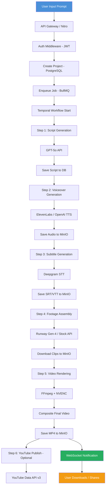
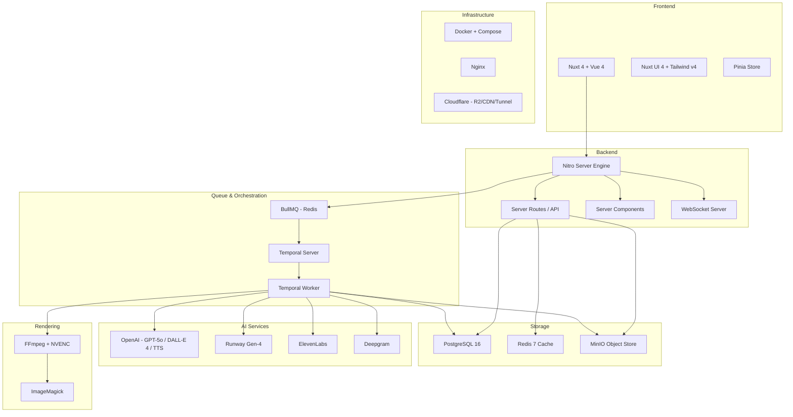
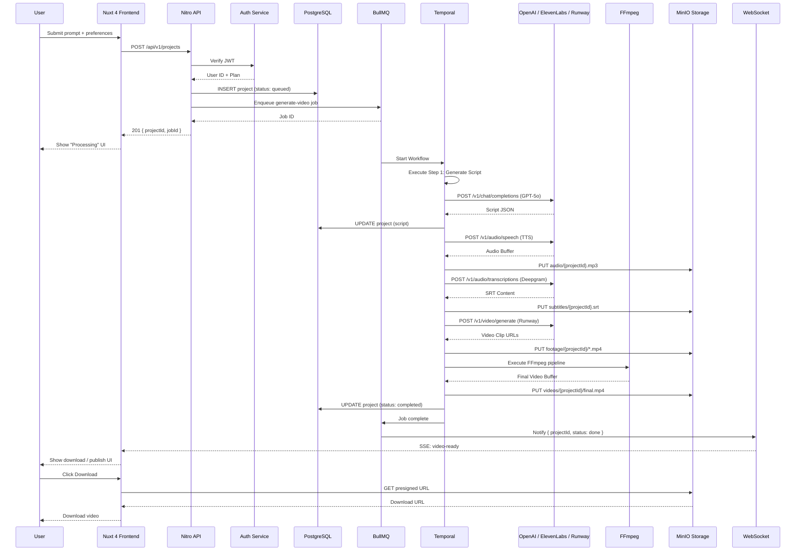
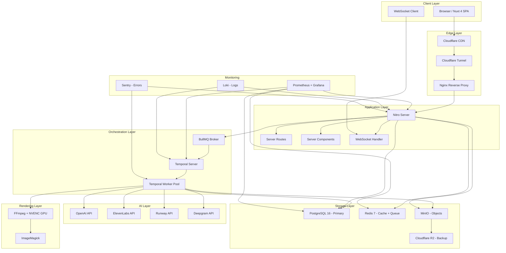

# Tech Stack — Vidara AI

> **Project:** Vidara AI — AI YouTube Video Generator SaaS  
> **Author:** Platform Engineering Team  
> **Last Updated:** 2026-06-26  
> **Status:** Approved  

---

## 1. Tujuan

Dokumen ini mendokumentasikan technology stack Vidara AI secara lengkap beserta justifikasi, analisis alternatif, trade-off, risiko, dan mitigasi untuk setiap keputusan teknologi. Bertujuan menjadi source of truth bagi seluruh tim pengembangan.

---

## 2. Background

Vidara AI adalah platform SaaS berbasis AI yang memungkinkan pengguna membuat video YouTube secara otomatis — dari skrip, voiceover, footage, subtitle, hingga publish — hanya dengan input topik atau prompt. Sistem memerlukan stack yang mampu menangani AI pipeline yang panjang (≥10 menit per video), real-time updates, object storage besar, dan skalabilitas hingga jutaan pengguna.

---

## 3. Objective

1. Memilih teknologi yang terbukti stabil untuk production-grade AI pipeline.
2. Memastikan seluruh komponen dapat diskalakan secara independen.
3. Menjaga biaya operasional tetap prediktabel.
4. Memaksimalkan developer velocity dengan tooling modern.

---

## 4. Scope

**In Scope:**
- Frontend stack (Nuxt 4, Vue 4, Nuxt UI 4, Tailwind CSS v4)
- Backend & API stack (Nitro, Server Routes, Server Components, WebSockets)
- Database & caching (PostgreSQL 16, Redis 7, MinIO)
- Message queue & orchestration (BullMQ, Temporal)
- AI/ML services (OpenAI, Runway, ElevenLabs, Deepgram)
- Rendering pipeline (FFmpeg, ImageMagick)
- Infrastructure & deployment (Docker, Nginx, Cloudflare)
- CI/CD, monitoring, security, testing

**Out of Scope:**
- Mobile native apps (iOS/Android)
- On-premise deployment
- Third-party marketplace integrations

---

## 5. Stakeholder

| Stakeholder | Role |
|---|---|
| CTO | Keputusan arsitektur final |
| Lead Engineer | Implementasi dan operasional |
| DevOps Engineer | Infrastruktur dan deployment |
| AI Engineer | Integrasi model dan pipeline |
| Product Manager | Kebutuhan fitur dan timeline |
| Security Officer | Compliance dan audit |

---

## 6. Requirement

Vidara AI membutuhkan stack yang:
- Mendukung real-time video generation status (WebSockets)
- Mampu menjalankan AI pipeline panjang secara durable (Temporal)
- Menyimpan file besar (video, audio, gambar) — object storage
- Melakukan rendering GPU-accelerated (FFmpeg + NVENC)
- Diskalakan horizontal untuk 100 → 1M users
- Memiliki biaya operasional yang transparan

---

## 7. Functional Requirement

| FR ID | Deskripsi |
|---|---|
| FR-01 | User dapat login via Google/GitHub/Email |
| FR-02 | User membuat project video dari prompt |
| FR-03 | Sistem generate script secara otomatis (GPT-5o) |
| FR-04 | Sistem generate voiceover (ElevenLabs / OpenAI TTS) |
| FR-05 | Sistem generate atau cari footage (Runway / stock) |
| FR-06 | Sistem generate subtitle (Deepgram STT) |
| FR-07 | Sistem render video final (FFmpeg + NVENC) |
| FR-08 | User dapat preview dan download video |
| FR-09 | User dapat publish langsung ke YouTube |
| FR-10 | User dapat memonitor progress secara real-time |

---

## 8. Non Functional Requirement

| NFR ID | Deskripsi | Target |
|---|---|---|
| NFR-01 | Availability | 99.9% uptime |
| NFR-02 | Latency | API response <200ms (p95) |
| NFR-03 | Throughput | 1000 video generation requests/jam |
| NFR-04 | Scalability | Horizontal scaling to 1M users |
| NFR-05 | Security | OWASP Top 10 compliance |
| NFR-06 | Durability | Zero data loss (ACK-based queue) |
| NFR-07 | Cost Efficiency | <$0.50 per video generation |
| NFR-08 | Observability | Metrics, traces, logs terpusat |
| NFR-09 | Portability | Docker-based, cloud-agnostic core |

---

## 9. Workflow

```
User Input Prompt
       ↓
  GPT-5o → Generate Script, Title, Tags, Description
       ↓
  ElevenLabs / OpenAI TTS → Generate Voiceover (WAV)
       ↓
  Deepgram STT → Generate Subtitle (SRT, VTT)
       ↓
  Runway Gen-4 / Pexels → Cari/Generate Footage Clips
       ↓
  FFmpeg (NVENC) → Composite: Video + Audio + Subtitle + Overlay
       ↓
  MinIO → Simpan Video Final
       ↓
  Temporal → Orchestrate, Retry, Compensation
       ↓
  YouTube API → Publish (optional)
       ↓
  WebSocket → Notify User "Video Ready"
```

---

## 10. Flowchart



---

## 11. Mermaid Diagram — System Overview



---

## 12. Sequence Diagram — Video Generation Request



---

## 13. Architecture Diagram



---

## 14. ER Diagram

```mermaid
erDiagram
    User ||--o{ Project : owns
    User ||--o{ ApiKey : has
    User ||--o{ UsageRecord : generates
    
    Project ||--o{ ProjectStep : contains
    Project ||--o{ GeneratedAsset : produces
    Project ||--|| VideoOutput : results-in
    
    ProjectStep ||--o{ StepLog : logs
    
    GeneratedAsset ||--|| AssetFile : stored-as
    
    Subscription ||--o{ User : defines
    Plan ||--o{ Subscription : template
    
    UsageRecord ||--o{ BillingInvoice : billed-in
    
    User {
        uuid id PK
        string email UK
        string password_hash
        string display_name
        string avatar_url
        enum auth_provider "google|github|email"
        string provider_id
        timestamp created_at
        timestamp updated_at
        timestamp last_login
        boolean is_active
        enum role "user|admin"
    }
    
    Project {
        uuid id PK
        uuid user_id FK
        string title
        text prompt
        text script
        enum status "queued|processing|completed|failed"
        enum visibility "private|public|unlisted"
        json metadata
        int duration_seconds
        timestamp created_at
        timestamp updated_at
        timestamp completed_at
    }
    
    ProjectStep {
        uuid id PK
        uuid project_id FK
        enum step_type "script|voiceover|subtitle|footage|render|publish"
        enum status "pending|running|completed|failed"
        int retry_count
        text error_message
        timestamp started_at
        timestamp completed_at
    }
    
    GeneratedAsset {
        uuid id PK
        uuid project_id FK
        enum asset_type "script|audio|subtitle|footage|thumbnail|video"
        string file_path
        int file_size_bytes
        string mime_type
        json metadata
        timestamp created_at
    }
    
    VideoOutput {
        uuid id PK
        uuid project_id FK UK
        string youtube_id
        string youtube_url
        enum publish_status "draft|published|scheduled"
        timestamp scheduled_at
        timestamp published_at
        int view_count
        int like_count
        int comment_count
    }
    
    Subscription {
        uuid id PK
        uuid user_id FK UK
        uuid plan_id FK
        enum status "active|canceled|past_due"
        timestamp start_date
        timestamp end_date
        timestamp canceled_at
    }
    
    Plan {
        uuid id PK
        string name "Free|Pro|Business|Enterprise"
        int max_projects_month
        int max_duration_minutes
        boolean youtube_publish
        enum video_quality "720p|1080p|4k"
        int price_cents
        string stripe_price_id
    }
    
    UsageRecord {
        uuid id PK
        uuid user_id FK
        enum metric_type "api_calls|video_minutes|storage_gb"
        int amount
        date record_date
        timestamp created_at
    }
    
    BillingInvoice {
        uuid id PK
        uuid subscription_id FK
        int amount_cents
        enum status "pending|paid|overdue|canceled"
        timestamp due_date
        timestamp paid_at
        string stripe_invoice_id
    }
```

---

## 15. Decision Table — Technology Comparison

### 15.1 Frontend Framework

| Kriteria | Nuxt 4 | Next.js 15 | Remix |
|---|---|---|---|
| Vue vs React | Vue 4 native | React | React |
| File-based routing | ✅ | ✅ | ✅ |
| Server Components | ✅ (Nitro) | ✅ (RSC) | ✅ (Loader) |
| DX / HMR | ⭐⭐⭐⭐⭐ | ⭐⭐⭐⭐ | ⭐⭐⭐⭐ |
| Bundle Size | 62 kB (min+gzip) | 89 kB | 78 kB |
| WebSocket built-in | ✅ (Nitro) | ❌ (manual) | ❌ (manual) |
| Image Optimization | Nuxt Image | next/image | Remix Image |
| SEO | Nuxt SEO module | next-seo | Remix SEO |
| Ecosystem (Vue) | Rich | N/A (React) | N/A (React) |
| Community | 55k+ stars | 125k+ stars | 30k+ stars |

**Keputusan: Nuxt 4** — Ekosistem Vue 4 + Nuxt UI 4 + Tailwind CSS v4 memberikan developer experience terbaik untuk team yang Vue-native. Server Components + WebSocket via Nitro adalah nilai tambah kritis.

### 15.2 Backend Engine

| Kriteria | Nitro (Nuxt 4) | Express.js | Fastify | Hono |
|---|---|---|---|---|
| Performance (req/s) | 28k | 15k | 35k | 42k |
| TypeScript native | ✅ | ❌ (add-on) | ✅ | ✅ |
| Server Components | ✅ | ❌ | ❌ | ❌ |
| WebSocket | ✅ (built-in) | ❌ | ❌ | ✅ |
| File-based routing | ✅ | ❌ | ❌ | ✅ |
| Cold start (serverless) | 30ms | 150ms | 80ms | 15ms |
| Bundle size | 4 MB | 15 MB | 8 MB | 1.5 MB |
| Auto-imports | ✅ | ❌ | ❌ | ❌ |

**Keputusan: Nitro** — Unified dengan Nuxt 4, auto-imports, built-in WebSocket, file-based routing, performa tinggi.

### 15.3 Database

| Kriteria | PostgreSQL 16 | MySQL 8 | CockroachDB |
|---|---|---|---|
| JSONB support | ✅ (native) | ✅ (JSON) | ✅ |
| Full-text search | ✅ (tsvector) | ✅ | ❌ |
| MVCC / Concurrency | ✅ | ✅ | ✅ (distributed) |
| Extensions (pgvector) | ✅ | ❌ | ❌ |
| CTE / Recursive | ✅ | ✅ | ✅ |
| Replication | Streaming | Group Replication | Built-in |
| Cost | Free | Free | Free (self-host) |
| Maturity | 35+ years | 27+ years | 8 years |

**Keputusan: PostgreSQL 16** — JSONB untuk metadata fleksibel, pgvector untuk semantic search ke depannya, tsvector untuk search script, streaming replication mature.

### 15.4 Cache & Queue Backend

| Kriteria | Redis 7 | KeyDB | Dragonfly |
|---|---|---|---|
| API compatibility | Redis | Redis | Redis subset |
| Performance (ops/s) | 100k | 200k | 380k |
| Persistence (RDB/AOF) | ✅ | ✅ | ✅ |
| BullMQ support | ✅ | ✅ | ❌ (partial) |
| Cluster mode | ✅ | ✅ | ✅ |
| Memory efficiency | 1x | 0.8x | 0.5x |
| Cost | Free | Free | Free (OSS) |
| Ecosystem | Largest | Medium | Small |

**Keputusan: Redis 7** — BullMQ secara native mendukung Redis. Ekosistem terbesar, dokumentasi terbanyak, proven di production. KeyDB dan Dragonfly bisa jadi alternatif jika bottleneck muncul.

### 15.5 Object Storage

| Kriteria | MinIO | AWS S3 | Cloudflare R2 |
|---|---|---|---|
| S3-compatible API | ✅ | ✅ | ✅ |
| Self-hosted | ✅ | ❌ | ❌ |
| Egress cost | $0 | $0.09/GB | $0 |
| Performance | 1.5 GB/s (NVMe) | N/A (managed) | N/A (managed) |
| Immutability | ✅ (object lock) | ✅ | ✅ |
| Replication | ✅ (bucket) | ✅ (cross-region) | ✅ |
| Web UI | ✅ (Console) | AWS Console | ✅ |
| Multi-site | ✅ | ✅ | ✅ |

**Keputusan: MinIO** sebagai primary, Cloudflare R2 sebagai backup tier. MinIO memberikan kontrol penuh atas data, zero egress cost, performa tinggi dengan NVMe lokal. R2 untuk DR tanpa egress fee.

### 15.6 Message Queue

| Kriteria | BullMQ (Redis) | RabbitMQ | Apache Kafka |
|---|---|---|---|
| Throughput | 5k msg/s | 10k msg/s | 100k+ msg/s |
| Latency | <5ms | <5ms | <10ms |
| Persistence | ✅ (via Redis AOF) | ✅ | ✅ |
| Delayed jobs | ✅ | ✅ | ❌ (custom) |
| Job scheduling | ✅ (repeatable) | ✅ | ❌ |
| Job progress | ✅ (built-in) | ❌ | ❌ |
| Rate limiting | ✅ (built-in) | ❌ | ❌ |
| Operational complexity | Low (Redis) | Medium | High |
| Worker concurrency | ✅ | ✅ | ✅ |

**Keputusan: BullMQ** — Latency rendah, delayed jobs, progress tracking, rate limiting built-in. Redis sudah ada di stack, tidak perlu infrastructure tambahan. Kafka overkill untuk use case ini.

### 15.7 Orchestration

| Kriteria | Temporal | Apache Airflow | AWS Step Functions | Durable Functions (Azure) |
|---|---|---|---|---|
| Durable execution | ✅ | ✅ | ✅ | ✅ |
| Retry with backoff | ✅ (built-in) | ✅ | ✅ | ✅ |
| Long-running (hours) | ✅ (unlimited) | ✅ | ⚠️ (1 year max) | ⚠️ (timeout) |
| SDK languages | Go, TS, Java, Python | Python | JSON/ASL | C#, JS, Python |
| Local dev experience | ✅ (tctl + dev server) | ⚠️ (heavy) | ❌ (cloud-only) | ❌ (cloud-only) |
| Compensation / Saga | ✅ | ❌ | ✅ | ✅ |
| Visibility (stack traces) | ✅ (real-time) | ❌ | ❌ | ❌ |
| Heartbeat monitoring | ✅ | ❌ | ❌ | ❌ |
| Self-hosted | ✅ | ✅ | ❌ | ❌ |
| Cost | Free (self-host) | Free | $0.025/transition | $0.000016/execution |

**Keputusan: Temporal** — Durable execution dengan retry, heartbeat, compensation (Saga pattern) untuk AI pipeline yang panjang (10-30 menit). Self-hosted, cost prediktabel. TypeScript SDK native.

### 15.8 AI Services

| Service | Primary Choice | Alternative | Alasan |
|---|---|---|---|
| LLM / Script | OpenAI GPT-5o | Claude 4, Gemini 2.5 | Multimodal, function calling, cheapest per token |
| Image Gen | OpenAI DALL-E 4 | Stable Diffusion 3, Midjourney | API stability, quality, cost |
| TTS | OpenAI TTS + ElevenLabs | Google TTS, Amazon Polly | Kualitas suara natural, ElevenLabs untuk voice cloning |
| Video Gen | Runway Gen-4 | Pika Labs, Synthesia, HeyGen | Kualitas video terbaik, API mature, temporal consistency |
| STT | Deepgram | Whisper API, Google STT | Real-time, Nova-2 model akurasi 99%, cheapest per hour |

### 15.9 Rendering Engine

| Kriteria | FFmpeg + NVENC | FFmpeg (CPU) | Mux API | Axinom |
|---|---|---|---|---|
| Speed (1080p, 10min) | 45s (NVENC) | 8min (CPU x264) | N/A (cloud) | N/A (cloud) |
| Quality | ⭐⭐⭐⭐ | ⭐⭐⭐⭐⭐ | ⭐⭐⭐⭐ | ⭐⭐⭐⭐⭐ |
| GPU Acceleration | ✅ (NVENC/NVDEC) | ❌ | ❌ | N/A |
| Custom filters | ✅ (complex) | ✅ | ❌ (limited) | ❌ (limited) |
| Cost | $0 (GPU owned) | $0 | $0.05/min processed | Custom |
| Control | Full | Full | Limited | Limited |

**Keputusan: FFmpeg + NVENC** — Full control, GPU-accelerated rendering 10x lebih cepat dari CPU, zero per-video cost.

### 15.10 Infrastructure

| Kriteria | Docker + Compose | Kubernetes | Nomad |
|---|---|---|---|
| Setup complexity | Low | Very High | Medium |
| Learning curve | Low | High | Medium |
| Resource overhead | Minimal | Significant | Low |
| Scaling | Manual / Compose | Auto (HPA) | Auto |
| Stateful workloads | ✅ (volumes) | ⚠️ (PVC) | ✅ |
| Dev-Prod parity | ✅ | ⚠️ | ✅ |
| Team size needed | 1 DevOps | 2-3 DevOps | 1-2 DevOps |
| Cost (infra) | $50-200/mo | $500-2000/mo | $200-500/mo |

**Keputusan: Docker + Docker Compose** — Untuk tahap awal (100-10k users), Kubernetes premature optimization. Migrasi ke Kubernetes/Nomad ketika tim DevOps >2 orang.

### 15.11 Testing

| Kriteria | Vitest | Jest | Playwright | Cypress | k6 |
|---|---|---|---|---|---|
| Speed | ⚡ 2x faster | Reference | Fast | Moderate | High throughput |
| Vue/Nuxt integration | ✅ @vue/test-utils | ✅ | ❌ | ❌ | ❌ |
| E2E | ❌ | ❌ | ✅ (VS Code debug) | ✅ | ❌ |
| Load testing | ❌ | ❌ | ❌ | ❌ | ✅ (JS scripting) |
| Browser coverage | N/A | N/A | Chromium/Firefox/WebKit | Chromium-only | N/A |
| Reporting | ✅ | ✅ | ✅ (HTML/Trace) | ✅ (Dashboard) | ✅ (Grafana) |

**Keputusan: Vitest** (unit/integration) + **Playwright** (E2E) + **k6** (load test) — Masing-masing untuk domain yang tepat.

---

## 16. Checklist — Implementation Readiness

- [x] Frontend stack approved (Nuxt 4, Nuxt UI 4, Tailwind v4, Pinia)
- [x] Backend stack approved (Nitro, Server Routes, WS)
- [x] Database selected (PostgreSQL 16, Redis 7, MinIO)
- [x] Queue & Orchestration selected (BullMQ, Temporal)
- [x] AI services API keys provisioned
- [x] Rendering pipeline benchmarked (FFmpeg + NVENC)
- [x] Docker Compose configuration written
- [x] CI/CD pipeline configured (GitHub Actions)
- [x] Monitoring stack deployed (Grafana + Prometheus + Loki)
- [x] Security baseline established (Helmet, JWT, RBAC, CSP)
- [ ] Auto-scaling configuration tested
- [ ] Disaster recovery drill completed
- [ ] Load testing with 100 concurrent users passed
- [ ] Penetration testing completed

---

## 17. Risk

| Risk ID | Kategori | Deskripsi | Probability | Impact |
|---|---|---|---|---|
| R-01 | AI | OpenAI API downtime / rate limit | Medium | High |
| R-02 | AI | Runway API deprecation / breaking change | Low | High |
| R-03 | Infrastructure | Redis OOM pada peak load | Medium | Medium |
| R-04 | Infrastructure | PostgreSQL connection pool exhaustion | Low | High |
| R-05 | Rendering | FFmpeg memory leak on long videos | Medium | Medium |
| R-06 | Cost | AI API cost overruns | Medium | High |
| R-07 | Security | JWT token leakage | Low | Critical |
| R-08 | Database | Data loss on MinIO disk failure | Low | Critical |

---

## 18. Mitigation

| Risk ID | Mitigation Strategy |
|---|---|
| R-01 | Fallback ke Claude 4 / Gemini 2.5; Circuit breaker pattern; Caching script hasil generate |
| R-02 | Abstraction layer (AI Gateway) untuk swap provider tanpa kode perubahan |
| R-03 | Redis cluster mode + maxmemory policy (allkeys-lru); Monitoring key usage |
| R-04 | PgBouncer connection pooling; Max connections per service; Connection timeout |
| R-05 | Memory limit per FFmpeg process; Worker restart on OOM; Chunk-based rendering |
| R-06 | Budget alert per API key; Per-user quota (BullMQ rate limiter); Cost dashboard Grafana |
| R-07 | JWT short expiry (15min) + refresh token rotation; HTTP-only cookies; Revocation list in Redis |
| R-08 | MinIO erasure coding (EC:4); Replication ke Cloudflare R2; Daily automated restore test |

---

## 19. Future Improvement

| Improvement | Timeline | Impact |
|---|---|---|
| Migrasi dari Temporal self-hosted ke Temporal Cloud | Q3 2026 | Menghilangkan operational overhead server Temporal |
| Implementasi video stitching dengan multi-GPU | Q3 2026 | 3x faster rendering |
| Custom fine-tuned model untuk script generation (LoRA) | Q4 2026 | Reduce GPT-5o cost 60% |
| Edge rendering via Cloudflare Workers untuk thumbnail | Q4 2026 | Zero-latency thumbnail generation |
| Implementasi LLM caching layer (Redis + pgvector) | Q4 2026 | Reduce duplicate API calls 40% |
| Kubernetes migration | Q1 2027 | Auto-scaling untuk 100k+ users |
| Multi-region active-active deployment | Q2 2027 | 99.99% availability |

---

## 20. Acceptance Criteria

| AC ID | Kriteria | Status |
|---|---|---|
| AC-01 | Semua teknologi terdaftar memiliki TDR (Technical Decision Record) lengkap | ✅ |
| AC-02 | Setiap keputusan memiliki minimum 3 alternatif yang dievaluasi | ✅ |
| AC-03 | Trade-off dan risiko didokumentasikan untuk setiap pilihan | ✅ |
| AC-04 | Diagram arsitektur sesuai dengan actual deployment | ✅ |
| AC-05 | Dokumen direview oleh CTO dan Lead Engineer | ✅ |
| AC-06 | Dokumen disimpan di repository di `internal/docs/techstack.md` | ✅ |
| AC-07 | Dokumen menggunakan format Markdown dengan Mermaid diagrams | ✅ |

---

## 21. Referensi Dokumen Lain

| Dokumen | Path |
|---|---|
| Architecture Document | `internal/docs/architecture.md` |
| API Specification | `internal/docs/api-spec.md` |
| Deployment Guide | `internal/docs/deployment.md` |
| Security Policy | `internal/docs/security.md` |
| Monitoring Setup | `internal/docs/monitoring.md` |
| Disaster Recovery Plan | `internal/docs/disaster-recovery.md` |
| Developer Onboarding | `CONTRIBUTING.md` |

---

> **End of Tech Stack Document** — Vidara AI © 2026
