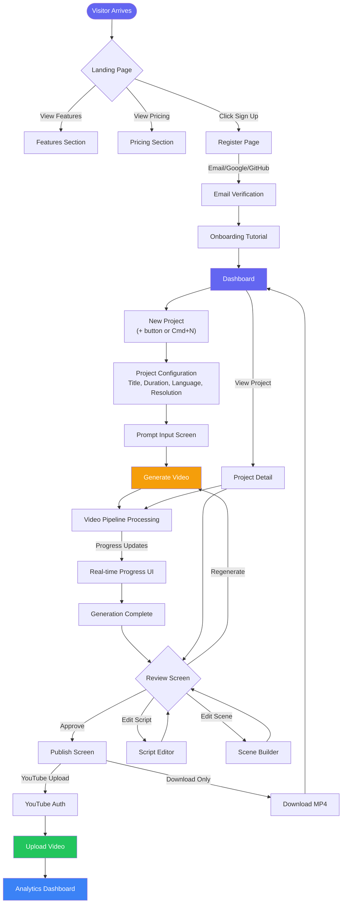
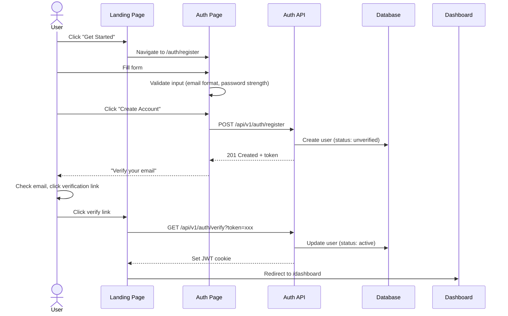
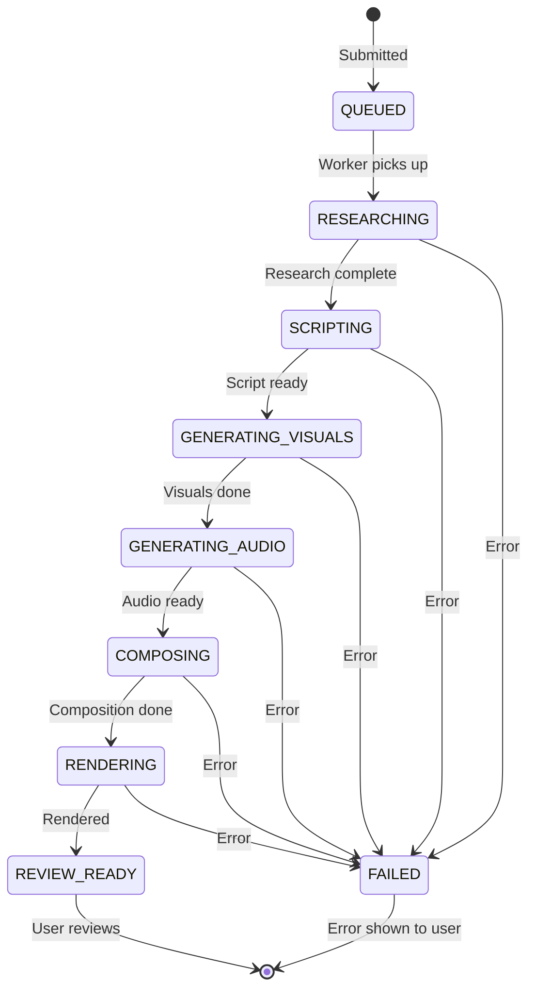
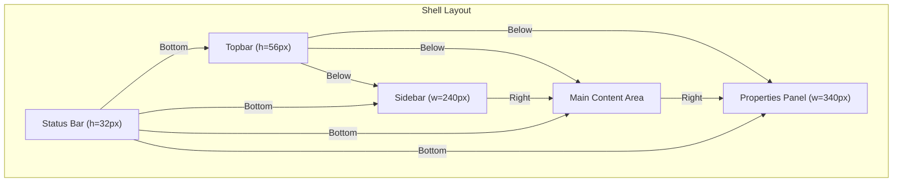

# Wireframe & Layout Specification — Vidara AI

> **Project:** Vidara AI — AI YouTube Video Generator SaaS  
> **Author:** Agent 8 (Senior UI/UX Designer)  
> **Last Updated:** 2026-06-26  
> **Status:** Draft  
> **Cross-Reference:** [Design System](design.md) · [PRD](../prd.md) · [Architecture](../architecture.md) · [Workflow](../workflow.md)

---

## 1. User Flow — End-to-End Journey

### 1.1 Complete User Journey Flowchart



### 1.2 User Flow by Persona

| Persona | Primary Flow | Key Screens |
|---|---|---|
| **Solo Creator** | Register → Dashboard → New Project → Prompt → Generate → Review → Download | Dashboard, Prompt, Pipeline, Review |
| **Agency Owner** | Register → Create Org → Invite Team → Assign Roles → Create Workspace → Manage Projects | Organization, Team, Workspace, Billing |
| **Enterprise Client** | Register → API Key → Integrate → Webhook → Monitor | API Keys, Webhook Config, Analytics |
| **Faceless Channel** | Register → Template → Bulk Generate → Schedule → Publish → Monitor | Template Library, Batch, Schedule |

---

## 2. Landing Page

### 2.1 Layout Structure

```
┌──────────────────────────────────────────────────────────────┐
│  Navbar: [Logo] [Features] [Pricing] [About] [Sign In] [CTA] │
├──────────────────────────────────────────────────────────────┤
│  Hero Section                                                 │
│  ┌─────────────────────────────────────────────────────────┐  │
│  │  Headline: "AI That Creates YouTube Videos From          │  │
│  │  Prompt to Publish in Minutes"                          │  │
│  │  Subheadline: "Research, Script, Visuals, Voice,        │  │
│  │  Subtitles, Music, Thumbnail, SEO — All Automated"      │  │
│  │  [Email Input] [Get Started Free]  →  No credit card    │  │
│  │  ┌──────────────────────────────────────────────────┐   │  │
│  │  │  Demo Video (Product walkthrough 60s)             │   │  │
│  │  └──────────────────────────────────────────────────┘   │  │
│  └─────────────────────────────────────────────────────────┘  │
├──────────────────────────────────────────────────────────────┤
│  Social Proof: "Trusted by 10,000+ creators worldwide"        │
│  [Logo Cloud] -> [Logos of 12 companies/creators]             │
├──────────────────────────────────────────────────────────────┤
│  How It Works (3-step)                                        │
│  ┌──────────┐    ┌──────────┐    ┌──────────┐                │
│  │  1. Input │    │  2. AI    │    │  3. Publish│             │
│  │  Prompt   │───▶│  Pipeline │───▶│  to YouTube│             │
│  │  1 min    │    │  5-10 min │    │  1 click   │             │
│  └──────────┘    └──────────┘    └──────────┘                │
├──────────────────────────────────────────────────────────────┤
│  Features Grid (3x2)                                          │
│  ┌──────────┐ ┌──────────┐ ┌──────────┐                     │
│  │ AI Script │ │ AI Voice  │ │ AI Visual │                     │
│  └──────────┘ └──────────┘ └──────────┘                     │
│  ┌──────────┐ ┌──────────┐ ┌──────────┐                     │
│  │ Subtitle  │ │ Thumbnail│ │ SEO Opt  │                     │
│  └──────────┘ └──────────┘ └──────────┘                     │
├──────────────────────────────────────────────────────────────┤
│  Pricing Section (3 plans)                                    │
│  ┌──────────┐ ┌──────────┐ ┌──────────┐                     │
│  │  Free     │ │  Pro     │ │ Business │  [Enterprise]       │
│  │  $0/mo    │ │  $29/mo  │ │  $99/mo  │  Custom            │
│  │  [CTA]    │ │  [CTA]   │ │  [CTA]   │  [Contact]         │
│  └──────────┘ └──────────┘ └──────────┘                     │
├──────────────────────────────────────────────────────────────┤
│  FAQ Section                                                  │
│  ┌─────────────────────────────────────────────────────────┐  │
│  │  Q: How long does it take to generate a video?          │  │
│  │  A: Typically 5-10 minutes for a 10-minute video.       │  │
│  │  ─────────────────────────────────────────────────────  │  │
│  │  Q: What languages are supported?                       │  │
│  │  A: English, Indonesian, and 8+ more languages.         │  │
│  └─────────────────────────────────────────────────────────┘  │
├──────────────────────────────────────────────────────────────┤
│  Footer: [Logo] [Links] [Social] [Copyright]                  │
└──────────────────────────────────────────────────────────────┘
```

### 2.2 Key Interactions

| Element | Interaction |
|---|---|
| Navbar CTA | Scrolls to pricing or opens auth modal |
| Hero input | Email capture for waitlist or direct signup |
| Feature cards | Hover reveals animation preview |
| Pricing toggle | Monthly/Annual toggle with savings badge |
| FAQ items | Accordion expand/collapse |

---

## 3. Login & Register

### 3.1 Login Page

```
┌──────────────────────────────────────────────┐
│                                              │
│              ┌──────────────┐                │
│              │  Vidara Logo  │                │
│              └──────────────┘                │
│         Welcome back! Sign in                 │
│                                              │
│  Email: [________________________]           │
│  Password: [________________________]        │
│                                              │
│  [Sign In]                                   │
│                                              │
│  ──────────── or continue with ────────────  │
│                                              │
│  [G Google] [G GitHub]                       │
│                                              │
│  Forgot password?  |  Don't have an account? │
│                              Sign up →       │
└──────────────────────────────────────────────┘
```

### 3.2 Register Page

```
┌──────────────────────────────────────────────┐
│                                              │
│              ┌──────────────┐                │
│              │  Vidara Logo  │                │
│              └──────────────┘                │
│        Create your free account              │
│                                              │
│  Full name: [______________________]         │
│  Email: [________________________]           │
│  Password: [________________________]        │
│  ─── Strength: ●●●○○○ ───                   │
│                                              │
│  ☑ I agree to Terms of Service and Privacy   │
│                                              │
│  [Create Account]                            │
│                                              │
│  ──────────── or continue with ────────────  │
│                                              │
│  [G Google] [G GitHub]                       │
│                                              │
│  Already have an account?  Sign in →         │
└──────────────────────────────────────────────┘
```

### 3.3 Auth Flow



---

## 4. Dashboard

### 4.1 Main Dashboard Layout

```
┌────────────────────────────────────────────────────────────────┐
│  Topbar: [Breadcrumb: Dashboard]  [🔍 Search] [🔔] [👤 John]  │
├──────────┬─────────────────────────────────────────────────────┤
│ Sidebar  │  ┌──────┐ ┌──────┐ ┌──────┐ ┌──────┐               │
│ [Logo]   │  │ 👁️    │ │ 🎬   │ │ ⏱️   │ │ 📈   │               │
│ ──────── │  │ Views │ │Videos│ │Watch │ │ CTR  │               │
│ Dashboard│  │ 1.2M  │ │ 42   │ │ 8:32 │ │ 12%  │               │
│ Projects │  │ ↑12%  │ │ ↑3   │ │ ↑5%  │ │ ↓2%  │               │
│ Templates│  └──────┘ └──────┘ └──────┘ └──────┘               │
│ Assets   │                                                     │
│ ──────── │  ┌───────────────┐  ┌───────────────┐               │
│ AI Agents│  │ Recent Activity │  │ Pipeline Status│              │
│ Settings │  │ ● Vid "SEO..."│  │ 🟢 All systems  │              │
│ Billing  │  │   just completed│  │ operational     │              │
│ ──────── │  │ ● Vid "Pod..."│  │ Queue: 3 ahead   │              │
│ Upgrade  │  │   rendering... │  │ Render: 1 active │              │
│          │  └───────────────┘  └───────────────┘               │
│          │                                                     │
│          │  ┌────────────────────────────────────────────┐     │
│          │  │ Recent Projects (last 5)                   │     │
│          │  │ ┌────────┐ ┌────────┐ ┌────────┐          │     │
│          │  │ │ Title A │ │ Title B │ │ Title C │          │     │
│          │  │ │ 2 days  │ │ 5 days  │ │ 1 week  │          │     │
│          │  │ └────────┘ └────────┘ └────────┘          │     │
│          │  └────────────────────────────────────────────┘     │
│          │                                                     │
│          │  [New Project]  [Generate from Prompt]  [Upload]    │
└──────────┴─────────────────────────────────────────────────────┘
```

### 4.2 Widget Specifications

| Widget | Data Source | Refresh | Interaction |
|---|---|---|---|
| Stat Cards | Database + YouTube API | 5 min | Click → detailed breakdown |
| Activity Feed | Database (ProjectHistory) | Real-time (WebSocket) | Click → open project |
| Pipeline Status | BullMQ + Temporal | Real-time (WebSocket) | Click → queue detail |
| Recent Projects | Database | On page load | Click → project detail |

---

## 5. Workspace (Project Listing)

### 5.1 Workspace Layout

```
┌────────────────────────────────────────────────────────────────┐
│  Topbar: Workspace: "My Content"  [New Folder] [New Project]   │
│          [Filter] [Sort: Newest▼] [View: Grid▼]               │
├────────────────────────────────────────────────────────────────┤
│  Folder Breadcrumb: All Projects > Q3 Campaign >               │
│  ──────────────────────────────────────────────────────────────│
│  ┌──────────┐ ┌──────────┐ ┌──────────┐ ┌──────────┐          │
│  │ 📁       │ │ 📁       │ │ 🎬       │ │ 🎬       │          │
│  │ Campaign │ │ Tutorials│ │ "SEO     │ │ "Podcast │          │
│  │ 12 items │ │ 8 items  │ │  Guide"  │ │  Setup"  │          │
│  │          │ │          │ │ 1080p ✅ │ │ 720p ⏳  │          │
│  └──────────┘ └──────────┘ └──────────┘ └──────────┘          │
│  ┌──────────┐ ┌──────────┐ ┌──────────┐ ┌──────────┐          │
│  │ 🎬       │ │ 🎬       │ │ 🎬       │ │ 📁       │          │
│  │ "Review  │ │ "How to  │ │ "Top 10  │ │ Archived │          │
│  │  Product"│ │  Meditate"│ │  Tools"  │ │ 5 items  │          │
│  │ 📝 draft │ │ ✅ done  │ │ ❌ failed│ │          │          │
│  └──────────┘ └──────────┘ └──────────┘ └──────────┘          │
└────────────────────────────────────────────────────────────────┘
```

### 5.2 View Modes

| Mode | Description | Best For |
|---|---|---|
| **Grid** | 4-column card layout | Small projects (<50) |
| **List** | Table with sortable columns | Large projects (>50) |
| **Timeline** | Gantt chart by creation/generation date | Scheduling view |

---

## 6. Project Detail

### 6.1 Project Detail Layout

```
┌────────────────────────────────────────────────────────────────┐
│  Topbar: Projects > "How to Start a Podcast"  [Edit] [Delete]  │
├──────────┬─────────────────────────────────────────────────────┤
│ Sidebar  │  Project Info                                        │
│ (minimal)│  ┌──────────────────────────────────────────────┐   │
│          │  │  Status: Completed ✅                         │   │
│ Overview │  │  Created: June 20, 2026                      │   │
│ Script   │  │  Duration: 8:32  |  Resolution: 1080p        │   │
│ Scenes   │  │  Language: English  |  Credits: 45            │   │
│ Timeline │  └──────────────────────────────────────────────┘   │
│ Export   │                                                     │
│          │  ┌──────────────────────────────────────────────┐   │
│          │  │  Video Preview                                │   │
│          │  │  ┌────────────────────────────────────────┐  │   │
│          │  │  │                                        │  │   │
│          │  │  │     [▶️ Play button centered]          │  │   │
│          │  │  │                                        │  │   │
│          │  │  └────────────────────────────────────────┘  │   │
│          │  │  [▶ Play] [⏸ Pause] [Download MP4] [Share] │   │
│          │  └──────────────────────────────────────────────┘   │
│          │                                                     │
│          │  Quick Actions                                       │
│          │  [Edit Script] [Edit Scenes] [Regenerate] [Publish]  │
└──────────┴─────────────────────────────────────────────────────┘
```

---

## 7. Video Pipeline (Full-Screen Production View)

### 7.1 Pipeline Processing View

```
┌────────────────────────────────────────────────────────────────┐
│  ✨ Generating: "How to Start a Podcast in 2026"             │
│  Estimated time: 4m 30s remaining                              │
├────────────────────────────────────────────────────────────────┤
│  ┌──────────────────────────────────────────────────────────┐  │
│  │  Pipeline Progress                                        │  │
│  │  ┌──────────────────────────────────────────────────────┐ │  │
│  │  │ ▓▓▓▓▓▓▓▓▓▓▓▓▓▓▓▓▓▓▓▓▓▓▓▓░░░░░░░░░░░░░░ 65%        │ │  │
│  │  └──────────────────────────────────────────────────────┘ │  │
│  │                                                          │  │
│  │  Steps:                                                   │  │
│  │  ✅ Research (12s)  ✅ Script (45s)  ⏳ Visuals (62%)    │  │
│  │  ⬜ Audio  ⬜ Composition  ⬜ Render  ⬜ Thumbnail         │  │
│  └──────────────────────────────────────────────────────────┘  │
│                                                               │
│  ┌─────────────────────────┐  ┌────────────────────────────┐  │
│  │ Agent Activity          │  │ Intermediate Preview        │  │
│  │                         │  │                             │  │
│  │ 10:32:15 Script Agent   │  │  ┌──────────────────────┐  │  │
│  │   Generating narrative  │  │  │  Current scene being │  │  │
│  │ 10:32:18 Script Agent   │  │  │  generated...        │  │  │
│  │   ✅ Hook done          │  │  │                      │  │  │
│  │ 10:32:22 Image Agent    │  │  │  [Live preview of    │  │  │
│  │   Drawing scene 3/12   │  │  │   latest completed   │  │  │
│  │ 10:32:25 Voice Agent    │  │  │   scene/image]       │  │  │
│  │   Synthesizing speech   │  │  └──────────────────────┘  │  │
│  │ 10:32:30 Image Agent    │  │                             │  │
│  │   ✅ Scene 3 done       │  │  [Cancel] [Pause Queue]     │  │
│  └─────────────────────────┘  └────────────────────────────┘  │
└────────────────────────────────────────────────────────────────┘
```

### 7.2 Pipeline State Machine (User-Facing)



---

## 8. Script Editor

### 8.1 Script Editor Layout

```
┌────────────────────────────────────────────────────────────────┐
│  Script Editor — "How to Start a Podcast"  Status: ✅ Complete │
│  [✏️ Edit] [↻ Rewrite Section] [✨ AI Suggestions] [💾 Save]   │
├────────────────────────┬───────────────────────────────────────┤
│  Scene Navigation      │  Rich Text Editor                     │
│  (Mini storyboard)     │                                       │
│                         │  # How to Start a Podcast in 2026     │
│  ┌─────┐ ┌─────┐       │                                       │
│  │ 🖼️  │ │ 🖼️  │       │  ## Hook (0:00-0:15)                  │
│  │  1   │ │  2  │       │  Did you know that 75% of people     │
│  └─────┘ └─────┘       │  want to start a podcast but only     │
│  ┌─────┐ ┌─────┐       │  10% actually do it? The difference   │
│  │ 🖼️  │ │ 🖼️  │       │  is...                              │
│  │  3   │ │  4  │       │                                       │
│  └─────┘ └─────┘       │  ## Section 1: Why Podcast? (0:15-2:00)│
│  ┌─────┐ ┌─────┐       │  The first thing you need to          │
│  │ 🖼️  │ │ 🖼️  │       │  understand is that podcasting is     │
│  │  5   │ │  6  │       │  not just about talking...            │
│  └─────┘ └─────┘       │                                       │
│  ┌─────┐               │  ## Section 2: Equipment (2:00-4:30)   │
│  │ +   │               │  You don't need a $500 microphone...   │
│  │ Add  │               │                                       │
│  └─────┘               │                                       │
│                         │  Words: 850  |  Est. Duration: 7:00   │
│                         │  Tone: Educational  |  Language: EN   │
└────────────────────────┴───────────────────────────────────────┘
```

### 8.2 Key Interactions

| Interaction | Behavior |
|---|---|
| Click scene thumb | Jump to that scene's text in editor |
| Highlight text | Show floating toolbar (Bold, Italic, Link, AI Rewrite) |
| AI Rewrite | Opens inline edit with 3 variants |
| Drag scene thumb | Reorder scenes |
| Word count | Updates in real-time, triggers duration recalc |

---

## 9. Scene Builder (Storyboard View)

### 9.1 Storyboard Grid View

```
┌────────────────────────────────────────────────────────────────┐
│  Storyboard — "How to Start a Podcast"  (12 scenes)           │
│  [Grid View ●] [List View ○] [Timeline ○]  [+ Add Scene]      │
├────────────────────────────────────────────────────────────────┤
│  ┌──────┐  ┌──────┐  ┌──────┐  ┌──────┐                       │
│  │ 🖼️   │  │ 🖼️   │  │ 🖼️   │  │ 🖼️   │                       │
│  │Scene1 │  │Scene2 │  │Scene3 │  │Scene4 │                       │
│  │Hook   │  │WhyPod │  │Equip  │  │Softwr │                       │
│  │15s    │  │45s    │  │60s    │  │30s    │                       │
│  │Fade   │  │Cross  │  │Cut    │  │Slide  │                       │
│  └──────┘  └──────┘  └──────┘  └──────┘                       │
│  ┌──────┐  ┌──────┐  ┌──────┐  ┌──────┐                       │
│  │ 🖼️   │  │ 🖼️   │  │ 🖼️   │  │ 🖼️   │                       │
│  │Scene5 │  │Scene6 │  │Scene7 │  │Scene8 │                       │
│  │Record │  │Edit   │  │Publish│  │Promot │                       │
│  │45s    │  │60s    │  │30s    │  │30s    │                       │
│  │Zoom   │  │Fade   │  │Cross  │  │Cut    │                       │
│  └──────┘  └──────┘  └──────┘  └──────┘                       │
│  ┌──────┐  ┌──────┐  ┌──────┐  ┌──────┐                       │
│  │ 🖼️   │  │ 🖼️   │  │ 🖼️   │  │   ┌──┐                       │
│  │Scene9 │  │Scene10│  │Scene11│  │   │+ │                       │
│  │Analyt │  │CTA    │  │Outro  │  │   │12│                       │
│  │30s    │  │15s    │  │15s    │  │   └──┘                       │
│  │Slide  │  │Fade   │  │Fade   │  │ Add Scene│                   │
│  └──────┘  └──────┘  └──────┘  └──────────┘                   │
└────────────────────────────────────────────────────────────────┘
```

### 9.2 Scene Detail (Expanded)

```
┌────────────────────────────────────────────────────────────────┐
│  Scene 3: Equipment Setup (60s)  ┃ Transition: Crossfade      │
├────────────┬───────────────────────────────────┬───────────────┤
│  Preview   │  Scene Content                     │ Properties    │
│            │                                    │               │
│  ┌──────┐  │  Narration:                         │ Duration: 60s│
│  │      │  │  "You don't need a $500 microphone │ Transition:   │
│  │ 🖼️  │  │   to start. Here's what you actually │ [Crossfade▼] │
│  │      │  │   need..."                         │               │
│  │      │  │                                    │ Background:   │
│  └──────┘  │  ┌──────────────────────────────┐  │ [Studio ▼]   │
│            │  │  AI Image: Podcast Setup      │  │               │
│  [Regen]   │  │  [🖼️ Studio with mic, laptop]│  │ Character:    │
│            │  └──────────────────────────────┘  │ [Host ▼]     │
│            │                                    │               │
│            │  Voice: Narration (neutral)        │ Music:        │
│            │  [▶ Preview 0:32 - 0:45]           │ [Upbeat ▼]   │
│            │                                    │ Volume: 25%   │
└────────────┴───────────────────────────────────┴───────────────┘
```

---

## 10. Image Generator

### 10.1 Image Generator Layout

```
┌────────────────────────────────────────────────────────────────┐
│  Image Generator — Scene 3: "Equipment Setup"                  │
├─────────────┬──────────────────────────────────────────────────┤
│  Prompt     │  Generated Results (4 variations)                │
│  Input      │                                                   │
│             │  ┌──────────┐ ┌──────────┐                       │
│  [🧑‍🎨      │  │ Image A  │ │ Image B  │                       │
│   Describe  │  │   (1)    │ │   (2)    │                       │
│   the image │  └──────────┘ └──────────┘                       │
│   you want  │  ┌──────────┐ ┌──────────┐                       │
│   to gene-  │  │ Image C  │ │ Image D  │                       │
│   rate...]  │  │   (3)    │ │   (4)    │                       │
│             │  └──────────┘ └──────────┘                       │
│  Style:     │                                                   │
│  [Cinematic │  Selected: Image B  [Upscale] [Edit] [Use This]  │
│   ▼]        │                                                   │
│             │                                                   │
│  Ratio:     │  ┌──────────────────────────────────────────┐    │
│  [16:9 ▼]   │  │  Image Preview (selected)                 │    │
│             │  │                                            │    │
│  [Generate] │  │         [Full preview of Image B]         │    │
│             │  │                                            │    │
│  Used: 12   │  └──────────────────────────────────────────┘    │
│  credits    │                                                   │
└─────────────┴──────────────────────────────────────────────────┘
```

---

## 11. Voice Studio

### 11.1 Voice Studio Layout

```
┌────────────────────────────────────────────────────────────────┐
│  Voice Studio — Scene 3: "Equipment Setup"                     │
├──────────────────┬─────────────────────────────────────────────┤
│  Voice Selection │  Waveform + Preview                          │
│                   │                                              │
│  ┌─────────────┐ │  ┌──────────────────────────────────────┐   │
│  │ Search voice │ │  │  Waveform Visualization              │   │
│  └─────────────┘ │  │  ││││││││││││││││││││││││││││      │   │
│                   │  │  ││││││││││││││││││││││││││││      │   │
│  ┌──────────────┐ │  │  └──────────────────────────────────────┘   │
│  │ 🎙️ James    │ │  │  0:00                            0:45   │   │
│  │ English (US) │ │  │                                              │
│  │ Neutral      │ │  │  [▶ Play] [⏸ Pause] [⏹ Stop]              │   │
│  │ ──────────  │ │  │                                              │   │
│  │ ⭐ Selected  │ │  │  ┌──────────────────────────────────────┐   │
│  └──────────────┘ │  │  │  Script Sync                          │   │
│  ┌──────────────┐ │  │  │  You don't need a $500 micro...      │   │
│  │ 🎙️ Sarah    │ │  │  │  ■■■■■■■■■■■■■■■■■■■■░░░░░░░░░░    │   │
│  │ English (US) │ │  │  │  To start, here's what you act...   │   │
│  │ Warm         │ │  │  │  ■■■■■■■■■■■■■░░░░░░░░░░░░░░░░░░    │   │
│  │ ──────────  │ │  └──────────────────────────────────────┘   │   │
│  │ Currently   │ │                                              │   │
│  │ generating  │ │  Voice Settings                               │   │
│  └──────────────┘ │  ┌──────────────────────────────┐           │   │
│  ┌──────────────┐ │  │ Speed: [====●=========] 1.0x  │           │   │
│  │ 🎙️ Ethan    │ │  │ Pitch: [====●=========] 1.0x  │           │   │
│  │ English (UK) │ │  │ Emotion: [Neutral ▼]          │           │   │
│  │ Authoritative│ │  │ Pause: [●───] Normal          │           │   │
│  └──────────────┘ │  └──────────────────────────────┘           │   │
│                   │                                              │   │
│  24 voices loaded │  [Apply to Scene] [Apply to All Scenes]      │   │
└───────────────────┴──────────────────────────────────────────────┘
```

---

## 12. Video Composer (Timeline + Preview)

### 12.1 Video Composer Layout

```
┌────────────────────────────────────────────────────────────────┐
│  Video Composer — "How to Start a Podcast"  [Save] [Render]    │
├──────────────────┬─────────────────────────────────────────────┤
│  Scene List      │  Preview                                    │
│                  │  ┌──────────────────────────────────────┐   │
│  Scene 1 [🎬]    │  │                                      │   │
│  Scene 2 [🎬]    │  │          ▶ Video Preview             │   │
│  Scene 3 [🎬]    │  │                                      │   │
│  Scene 4 [🎬]    │  │                                      │   │
│  Scene 5 [🎬]    │  └──────────────────────────────────────┘   │
│  Scene 6 [🎬]    │  ┌──────────────────────────────────────┐   │
│  Scene 7 [🎬]    │  │  Timeline                             │   │
│  Scene 8 [🎬]    │  │                                      │   │
│  Scene 9 [🎬]    │  │  [Scene1|Scene2|Scene3|Scene4|...]   │   │
│  Scene10 [🎬]    │  │  [▓▓▓▓▓▓|▓▓▓▓▓▓▓|▓▓▓▓|▓▓▓▓▓▓▓▓|...]│   │
│  Scene11 [🎬]    │  │  0:00     2:00     4:00     6:00     │   │
│  Scene12 [🎬]    │  └──────────────────────────────────────┘   │
│  [+ Add]         │                                              │
│                  │  ┌──────────────────────────────────────┐   │
│                  │  │  Audio Tracks                         │   │
│                  │  │  Voiceover ━━━━━━━━━━━━━━━━━━━━━━━━  │   │
│                  │  │  Music     ════════════               │   │
│                  │  │  SFX       ──  ──  ──                │   │
│                  │  └──────────────────────────────────────┘   │
└──────────────────┴─────────────────────────────────────────────┘
```

### 12.2 Timeline Zoom Levels

| Level | Pixels Per Second | Visible Duration |
|---|---|---|
| Frame | 100px/s | ~10s |
| Fine | 50px/s | ~20s |
| Normal | 20px/s | ~50s |
| Overview | 5px/s | ~3 min |
| Full | 1px/s | ~15 min |

---

## 13. Thumbnail Editor

### 13.1 Thumbnail Editor Layout

```
┌────────────────────────────────────────────────────────────────┐
│  Thumbnail Editor — "How to Start a Podcast"                   │
├─────────────────────┬──────────────────────────────────────────┤
│  Generated Options  │  Canvas Editor                            │
│                     │                                           │
│  ┌────────────┐     │  ┌────────────────────────────────────┐  │
│  │ Thumb A    │     │  │                                    │  │
│  │ [🖼️]      │     │  │    1280 × 720 (16:9)              │  │
│  │ CTR: 12%  │     │  │                                    │  │
│  └────────────┘     │  │   [Your thumbnail canvas]         │  │
│  ┌────────────┐     │  │                                    │  │
│  │ Thumb B    │     │  │                                    │  │
│  │ [🖼️]      │     │  └────────────────────────────────────┘  │
│  │ CTR: 8%   │     │                                           │
│  └────────────┘     │  ┌────────────────────────────────────┐  │
│  ┌────────────┐     │  │  Tools                              │  │
│  │ Thumb C    │     │  │  [Add Text] [Add Shape] [Crop]      │  │
│  │ [🖼️]      │     │  │  [Filter] [Background Removal]      │  │
│  │ CTR: 15%  │     │  │  [Undo] [Redo] [Reset]             │  │
│  └────────────┘     │  └────────────────────────────────────┘  │
│                     │                                           │
│  [Regenerate All]   │  Text Overlay:                            │
│                     │  Title: [___________________________]     │
│                     │  Hook: [___________________________]      │
│                     │  Font: [Inter ▼] Color: [■ White]       │
│                     │                                           │
│                     │  [Save as Default] [Use for Video]        │
└─────────────────────┴──────────────────────────────────────────┘
```

---

## 14. YouTube Upload

### 14.1 YouTube Upload Layout

```
┌────────────────────────────────────────────────────────────────┐
│  Publish to YouTube — "How to Start a Podcast"                 │
├────────────────────────────────────────────────────────────────┤
│  Step 1: YouTube Account                                        │
│  ┌──────────────────────────────────────────────────────────┐  │
│  │  ✅ Connected as: My Channel (user@gmail.com)             │  │
│  │  [Switch Account] [Disconnect]                           │  │
│  └──────────────────────────────────────────────────────────┘  │
│                                                               │
│  Step 2: Video Details                                         │
│  ┌──────────────────────────────────────────────────────────┐  │
│  │  Title: [How to Start a Podcast in 2026: Complete Guide] │  │
│  │  Description: [______________________________________]   │  │
│  │  Tags: podcast, podcasting, start podcast, ...          │  │
│  │  ─────────────────────────────────────────────────────  │  │
│  │  Thumbnail: [🖼️ Thumb B selected] [Change]              │  │
│  │  Playlist: [How to Start a Podcast ▼]                   │  │
│  │  Category: [Education ▼]                                 │  │
│  └──────────────────────────────────────────────────────────┘  │
│                                                               │
│  Step 3: Visibility & Schedule                                 │
│  ┌──────────────────────────────────────────────────────────┐  │
│  │  ○ Public                                                 │  │
│  │  ○ Unlisted                                               │  │
│  │  ● Private                                                │  │
│  │  ○ Scheduled: [Date: _______] [Time: _______]             │  │
│  │  ☑ Notify subscribers                                     │  │
│  └──────────────────────────────────────────────────────────┘  │
│                                                               │
│  Step 4: Monetization                                          │
│  ┌──────────────────────────────────────────────────────────┐  │
│  │  ☑ Video is made for kids (COPPA compliance)             │  │
│  │  ☑ Contains paid promotion                               │  │
│  │  License: [Standard YouTube License ▼]                   │  │
│  └──────────────────────────────────────────────────────────┘  │
│                                                               │
│  SEO Score: 85/100  [Optimization Tips]  [Publish]             │
└────────────────────────────────────────────────────────────────┘
```

---

## 15. Analytics Dashboard

### 15.1 Analytics Dashboard Layout

```
┌────────────────────────────────────────────────────────────────┐
│  Analytics — "How to Start a Podcast"  [Export CSV] [PDF]     │
├───────────────┬────────────────────────────────────────────────┤
│  Date Range   │  Performance Overview                          │
│  [Last 30d ▼] │  ┌──────┐ ┌──────┐ ┌──────┐ ┌──────┐        │
│               │  │ 👁️   │ │ ⏱️   │ │ 📈  │ │ 💬   │        │
│  Channel:     │  │Views │ │Watch │ │Retent│ │Engage│        │
│  [All ▼]      │  │ 12.4K│ │ 892h │ │58%   │ │ 342  │        │
│               │  └──────┘ └──────┘ └──────┘ └──────┘        │
│  Compare:     │                                               │
│  [Previous▼]  │  ┌──────────────────────────────────────┐     │
│               │  │  Views Over Time (Line Chart)          │     │
│  Filters:     │  │  │                                    │     │
│  ☐ Views      │  │  │    ╱╲        ╱╲                    │     │
│  ☐ Watch Time │  │  │   ╱  ╲  ╱╲  ╱  ╲                  │     │
│  ☐ Retention  │  │  │  ╱    ╲╱  ╲╱    ╲                 │     │
│  ☐ Demography │  │  └──────────────────────────────────────┘     │
│               │                                               │
│               │  ┌─────────────┐  ┌─────────────┐             │
│               │  │ Retention    │  │ Traffic      │             │
│               │  │ Graph        │  │ Sources      │             │
│               │  │ ┌─────────┐  │  │ ┌─────────┐ │             │
│               │  │ │ ▓▓▓▓▓▓▓ │  │  │ │ Search  │ │             │
│               │  │ │ ▓▓▓▓▓   │  │  │ │ Browse  │ │             │
│               │  │ │ ▓▓▓▓    │  │  │ │ Suggest │ │             │
│               │  │ └─────────┘  │  │ └─────────┘ │             │
│               │  └─────────────┘  └─────────────┘             │
└───────────────┴────────────────────────────────────────────────┘
```

### 15.2 Metrics Definitions

| Metric | Definition | Source |
|---|---|---|
| Views | Total YouTube views in period | YouTube API |
| Watch Time | Total hours watched | YouTube API |
| Retention | Average percentage viewed | YouTube API |
| CTR | Thumbnail click-through rate | YouTube API |
| Engagement | Likes + Comments + Shares | YouTube API |

---

## 16. Niche Management

### 16.1 Niche List Page

```
┌────────────────────────────────────────────────────────────────┐
│  Content Niches                                    [+ Add New] │
│                                                               │
│  ┌──────────────────────────────────────────────────────────┐  │
│  │  🔴 Sejarah Nusantara          Projects: 15   [Edit]  ✕  │  │
│  │  Video edukasi sejarah kerajaan                          │  │
│  │  Keywords: sejarah, kerajaan, nusantara, budaya          │  │
│  │  Target: 18-40 tahun · Bahasa Indonesia · General        │  │
│  │  Default Niche ✓                                         │  │
│  └──────────────────────────────────────────────────────────┘  │
│  ┌──────────────────────────────────────────────────────────┐  │
│  │  🟢 Tech Review                    Projects: 8   [Edit] ✕  │  │
│  │  Review gadget dan teknologi terbaru                     │  │
│  │  Keywords: tech, review, gadget, smartphone, AI          │  │
│  │  Target: 18-35 tahun · Indonesia · Tech Enthusiast       │  │
│  └──────────────────────────────────────────────────────────┘  │
│  ┌──────────────────────────────────────────────────────────┐  │
│  │  🟡 Kuliner Nusantara              Projects: 3   [Edit] ✕  │  │
│  │  Review makanan dan resep tradisional                     │  │
│  │  Keywords: kuliner, makanan, resep, tradisional           │  │
│  │  Target: 25-45 tahun · Indonesia · Food Lover             │  │
│  └──────────────────────────────────────────────────────────┘  │
└────────────────────────────────────────────────────────────────┘
```

### 16.2 Add/Edit Niche Form

```
┌────────────────────────────────────────────────────────────────┐
│  Add New Niche                                      [Cancel]  │
│                                                               │
│  ┌──────────────────────────────────────────────────────────┐  │
│  │  Step 1: Basic Info                Step 2: Audience       │  │
│  │  Step 3: Style & Visual            Step 4: Review         │  │
│  └──────────────────────────────────────────────────────────┘  │
│                                                               │
│  ┌──────────────────────────────────────────────────────────┐  │
│  │  Step 1: Basic Info                                      │  │
│  │                                                          │  │
│  │  Niche Name: [_____________________________]             │  │
│  │  Description: [_____________________________]            │  │
│  │              [_____________________________]             │  │
│  │                                                          │  │
│  │  Keywords: [sejarah] [kerajaan] [nusantara] [budaya] [+] │  │
│  │  Type keyword and press Enter                            │  │
│  │                                                          │  │
│  │  Brand Kit: [Sejarah Brand ▼] (optional)                 │  │
│  │                                                          │  │
│  │                                    [Next: Audience  →]   │  │
│  └──────────────────────────────────────────────────────────┘  │
└────────────────────────────────────────────────────────────────┘
```

---

## 17. Settings


### 17.1 Settings Page Layout

```
┌────────────────────────────────────────────────────────────────┐
│  Settings                                                      │
│  [Profile] [Workspace] [Organization] [Niche] [Billing] [Security]     │
├────────────────────────────────────────────────────────────────┤
│  Workspace Settings                                            │
│  ┌──────────────────────────────────────────────────────────┐  │
│  │  Workspace Name: [My Content                      ]      │  │
│  │  Workspace Slug: my-content                              │  │
│  │  Default Role: [Editor ▼]                                │  │
│  │  ─────────────────────────────────────────────────────  │  │
│  │  Members (5)                                              │  │
│  │  ┌────────────────────────────────────────────────────┐  │  │
│  │  │ John Doe     john@email.com    Owner       ────   │  │  │
│  │  │ Jane Smith   jane@email.com    Editor   [Remove]  │  │  │
│  │  │ Bob Wilson   bob@email.com     Viewer   [Remove]  │  │  │
│  │  │ [Invite Member]                                    │  │  │
│  │  └────────────────────────────────────────────────────┘  │  │
│  └──────────────────────────────────────────────────────────┘  │
│                                                               │
│  Brand Kit                                                     │
│  ┌──────────────────────────────────────────────────────────┐  │
│  │  Colors: Primary [■ #6366F1] Secondary [■ #0EA5E9]      │  │
│  │  Fonts: Heading [Inter] Body [Inter]                     │  │
│  │  Logo: [Upload]  Current: [logo.svg]                     │  │
│  │  Watermark: Position [Bottom Right ▼] Opacity [30%]     │  │
│  └──────────────────────────────────────────────────────────┘  │
│                                                               │
│  [Save Changes]                                                │
└────────────────────────────────────────────────────────────────┘
```

---

## 18. Billing & Subscription

### 17.1 Billing Page Layout

```
┌────────────────────────────────────────────────────────────────┐
│  Billing & Subscription                                        │
├────────────────────────────────────────────────────────────────┤
│  Current Plan                                                   │
│  ┌──────────────────────────────────────────────────────────┐  │
│  │  🎖️ Pro Plan — $29/month                                 │  │
│  │  Next billing: July 26, 2026                              │  │
│  │  [Upgrade to Business] [Cancel Subscription]              │  │
│  └──────────────────────────────────────────────────────────┘  │
│                                                               │
│  Usage This Month                                               │
│  ┌──────────────────────────────────────────────────────────┐  │
│  │  ┌──────────────────────┐  ┌──────────────────────┐     │  │
│  │  │  Videos Generated     │  │  Credits Used         │     │  │
│  │  │  12 / 50             │  │  540 / 2,000          │     │  │
│  │  │  ▓▓▓▓▓▓▓▓▓▓▓▓▓░░░░░│  │  ▓▓▓▓▓▓▓▓▓▓▓▓▓▓░░░░░ │     │  │
│  │  │  24% used            │  │  27% used             │     │  │
│  │  └──────────────────────┘  └──────────────────────┘     │  │
│  │  ┌──────────────────────┐  ┌──────────────────────┐     │  │
│  │  │  Storage              │  │  Team Members         │     │  │
│  │  │  2.3 GB / 10 GB      │  │  3 / 5                 │     │  │
│  │  │  ▓▓▓▓▓▓▓▓░░░░░░░░░░░│  │  ▓▓▓▓▓▓▓▓░░░░░░░░░░░ │     │  │
│  │  │  23% used            │  │  60% used             │     │  │
│  │  └──────────────────────┘  └──────────────────────┘     │  │
│  └──────────────────────────────────────────────────────────┘  │
│                                                               │
│  Invoice History                                                │
│  ┌──────────────────────────────────────────────────────────┐  │
│  │  Date          Amount     Status     Invoice             │  │
│  │  June 26, 2026  $29.00    ✅ Paid    [Download]          │  │
│  │  May 26, 2026   $29.00    ✅ Paid    [Download]          │  │
│  │  Apr 26, 2026   $29.00    ✅ Paid    [Download]          │  │
│  └──────────────────────────────────────────────────────────┘  │
│                                                               │
│  Payment Method                                                 │
│  ┌──────────────────────────────────────────────────────────┐  │
│  │  💳 Visa ending in 4242  Exp: 08/28                     │  │
│  │  [Update Payment Method]                                 │  │
│  └──────────────────────────────────────────────────────────┘  │
└────────────────────────────────────────────────────────────────┘
```

---

## 19. Layout Structure

### 18.1 Core Layout Anatomy



### 18.2 Layout Variants

| Layout Name | Sidebar | Properties Panel | Status Bar | Used In |
|---|---|---|---|---|
| **Dashboard** | ✅ (240px) | ❌ | ❌ | Dashboard, Projects |
| **Editor** | ✅ (240px) | ✅ (340px) | ✅ | Video Composer, Scene Builder |
| **Settings** | ✅ (240px) | ❌ | ❌ | Settings, Billing |
| **Auth** | ❌ | ❌ | ❌ | Login, Register |
| **Landing** | ❌ | ❌ | ❌ | Landing Page |
| **Fullscreen** | ❌ | ❌ | ❌ | Pipeline Processing |

### 18.3 Dimensions

| Element | Desktop | Tablet | Mobile |
|---|---|---|---|
| Topbar height | 56px | 56px | 48px |
| Sidebar width | 240px | 240px (overlay) | Full screen (drawer) |
| Properties panel | 340px | 340px (overlay) | Bottom sheet |
| Status bar | 32px | 32px | Hidden |
| Min main width | 680px | 480px | 320px |

---

## 20. Navigation

### 19.1 Sidebar Navigation Tree

```
📋 V I D A R A   A I                           ← Logo + App Name

Workspace: [My Content ▼]                      ← Workspace Switcher
───────────────────────────────────────────────

📊 Dashboard                                    ← Main navigation
🎬 Projects                                    ← Active indicator
📁 Templates                                   ← Sub-items: [My Templates, Library]
📦 Assets                                      ← Sub-items: [Images, Audio, Videos]
🤖 AI Agents                                   ← Sub-items: [Chat, Prompt Library]
───────────────────────────────────────────────
⚙️ Settings                                    ← Secondary navigation
💳 Billing & Subscription                      ← With upgrade badge
📖 Help & Documentation                        ← External link icon
───────────────────────────────────────────────
                                                 ← Upgrade CTA
[⭐ Upgrade to Pro]                             ← Distinctive styling
  AI credits: 45/200 remaining                  ← Usage indicator
```

### 19.2 Topbar Actions

```
[Breadcrumb]                          [🔍] [🔔 3] [⏱️] [👤]
Dashboard > Projects                   Search  Alerts   Recent   Profile

← Breadcrumb: Collapsible, max 3 levels
→ Search: Cmd+K shortcut, modal overlay with recent searches
→ Alerts: Dropdown with notification list
→ Recent: Quick access to last 5 projects
→ Profile: Dropdown [Settings, Billing, Logout]
```

### 19.3 Navigation Behavior

| Navigation Type | Transition | Animation |
|---|---|---|
| Sidebar link click | Route change | 200ms page fade-in |
| Topbar dropdown | Overlay | 150ms scale + fade |
| Back button | History back | 200ms slide right |
| Breadcrumb click | Route jump | No animation |
| Mobile menu toggle | Drawer slide | 300ms slide from left |

---

## 21. Empty States

### 20.1 Empty State Illustrations

| Screen | Illustration | Heading | Description | Action |
|---|---|---|---|---|
| **No Projects** | 🎬 Empty folder with document icon | "No projects yet" | "Create your first video and it will appear here" | [Create Project] |
| **No Assets** | 📦 Empty box | "No assets uploaded" | "Upload images, audio, or video files for your projects" | [Upload Asset] |
| **No Templates** | 📋 Blank template | "No templates saved" | "Save a project as a template to reuse it later" | [Browse Library] |
| **No Analytics** | 📊 Empty chart | "No analytics data" | "Publish a video to see performance metrics" | [Go to Projects] |
| **No Team Members** | 👥 Empty avatar group | "No team members" | "Invite collaborators to your workspace" | [Invite Members] |
| **No Notifications** | 🔔 Bell with no waves | "All caught up" | "We'll notify you when something needs attention" | — |

### 20.2 Empty State Design Pattern

```
┌──────────────────────────────────────────────────────────────┐
│                                                              │
│                     [🎬 Illustration]                        │
│                                                              │
│                   No projects yet                             │
│                                                              │
│          Create your first video and it will                 │
│          appear here. It only takes a few minutes.           │
│                                                              │
│              [🎯 Create Your First Video]                   │
│                                                              │
│              Or learn how it works →                         │
│                                                              │
└──────────────────────────────────────────────────────────────┘
```

---

## 22. Loading States

### 21.1 Skeleton Screens per Page

| Page | Skeleton Pattern | Elements |
|---|---|---|
| **Dashboard** | 4 stat card skeletons (icon + 2 lines) + activity feed (5 rows) + recent projects (3 cards) | 12 skeleton elements |
| **Workspace** | 8 project card skeletons (image + title + status) | 8 skeleton elements |
| **Project Detail** | Video player skeleton (16:9 rect) + info skeleton (4 lines) | 5 skeleton elements |
| **Script Editor** | Text skeleton (15 lines of varying width) + scene nav skeleton (4 thumbnails) | 19 skeleton elements |
| **Scene Builder** | 8 scene card skeletons with overlay text | 8 skeleton elements |
| **Video Composer** | Preview skeleton (16:9) + timeline skeleton (3 tracks) + scene list (8 items) | 12 skeleton elements |

### 21.2 Dashboard Skeleton Example

```
┌────────────────────────────────────────────────────────────────┐
│  Topbar: [══] [══] [═] [═] [═]                                  │
├──────────┬─────────────────────────────────────────────────────┤
│ [══]     │  ┌──────┐ ┌──────┐ ┌──────┐ ┌──────┐               │
│ [══]     │  │  ◌◌◌  │ │  ◌◌◌  │ │  ◌◌◌  │ │  ◌◌◌  │               │
│ [══]     │  │  ──  │ │  ──  │ │  ──  │ │  ──  │               │
│ [══]     │  └──────┘ └──────┘ └──────┘ └──────┘               │
│ [══]     │                                                     │
│ [══]     │  ┌──────────────────────────────────────────────┐   │
│ [══]     │  │  ─────────────────────────────────────────    │   │
│ [══]     │  │  ─────────────────────                        │   │
│          │  │  ─────────────────────────────────────────    │   │
│          │  │  ─────────────────────                        │   │
│          │  │  ────────────────────────────────             │   │
│          │  └──────────────────────────────────────────────┘   │
│          │                                                     │
│          │  ┌────────┐ ┌────────┐ ┌────────┐                  │
│          │  │  ◌◌◌◌  │ │  ◌◌◌◌  │ │  ◌◌◌◌  │                  │
│          │  │  ────  │ │  ────  │ │  ────  │                  │
│          │  └────────┘ └────────┘ └────────┘                  │
└──────────┴─────────────────────────────────────────────────────┘
```

Legend: `══` = skeleton bar, `◌◌◌` = skeleton circle, `──` = skeleton text line

---

## 23. Error States

### 22.1 Error Page Layouts

| Error Type | Illustration | Heading | Description | Action |
|---|---|---|---|---|
| **404 Not Found** | 🗺️ Compass | "Page not found" | "The page you're looking for doesn't exist" | [Back to Dashboard] |
| **500 Server Error** | 🔧 Wrench | "Something went wrong" | "Our team has been notified. Please try again" | [Try Again] [Contact Support] |
| **Network Error** | 📡 Satellite dish | "Connection lost" | "Please check your internet connection" | [Retry Connection] |
| **403 Forbidden** | 🔒 Lock | "Access denied" | "You don't have permission to view this page" | [Request Access] [Go Back] |
| **429 Rate Limit** | ⏳ Hourglass | "Too many requests" | "Please wait a moment before trying again" | [Retry in 30s] |
| **Payment Required** | 💳 Card | "Upgrade required" | "This feature requires a paid subscription" | [View Plans] |
| **Video Generation Failed** | ❌ Error badge | "Generation failed" | "Reason: API timeout. You can retry or edit." | [Retry] [Edit Script] |

### 22.2 Error Page Template

```
┌──────────────────────────────────────────────────────────────┐
│                                                              │
│                     [🗺️ Illustration]                        │
│                                                              │
│                     404 — Page not found                      │
│                                                              │
│          The page you're looking for doesn't exist           │
│          or has been moved.                                  │
│                                                              │
│              [🏠 Back to Dashboard]                         │
│                                                              │
│              Or try searching →                              │
│                                                              │
└──────────────────────────────────────────────────────────────┘
```

### 22.3 Inline Error States

| Component | Error Pattern | Recovery |
|---|---|---|
| **Form Field** | Red border + error text below | Fix validation, auto-clear on input |
| **API Call** | Error toast + retry button | Auto-retry 3x, then manual retry |
| **File Upload** | Red badge on failed file + error reason | Remove + re-upload |
| **AI Generation** | Step marked as failed with error detail | Manual retry per step |
| **WebSocket** | Disconnected indicator in topbar | Auto-reconnect with exponential backoff |
| **Image Load** | Broken image placeholder | Retry load or regenerate |

---

## 24. Mobile Adaptation

### 23.1 Key Mobile Differences

| Feature | Desktop | Mobile |
|---|---|---|
| **Sidebar** | Always visible (240px) | Drawer overlay (full width), hamburger trigger |
| **Topbar** | Full width with all actions | Condensed (hamburger + logo + search icon) |
| **Properties Panel** | Right side (340px) | Bottom sheet (60% height) |
| **Project Grid** | 4-column grid | 1-column list |
| **Stat Cards** | 4 in a row | 2 in a row, scrollable |
| **Video Editor** | 3-column layout | Stacked layout (preview top, timeline bottom) |
| **Script Editor** | Side-by-side (editor + suggestions) | Stacked, suggestion as bottom sheet |
| **Timeline** | Horizontal scroll, full width | Vertical scene list with tap to expand |
| **Modals** | Centered overlay | Full-screen drawer from bottom |
| **Data Tables** | Sortable, filterable columns | Card list with swipe actions |
| **Drag & Drop** | Full support | Long press + drag, or tap to reorder (buttons) |
| **Keyboard Shortcuts** | Full support | Not applicable (on-screen actions instead) |

### 23.2 Mobile Layout — Dashboard

```
┌──────────────────────────────┐
│ [☰] V I D A R A   [🔍] [👤]│  ← Condensed topbar
├──────────────────────────────┤
│                              │
│  ┌──────┐ ┌──────┐          │
│  │ 👁️ 1.2M│ │ 🎬 42 │          │
│  └──────┘ └──────┘          │
│  ┌──────┐ ┌──────┐          │
│  │ ⏱️ 8:32│ │ 📈 12%│          │
│  └──────┘ └──────┘          │
│                              │
│  Recent Projects             │
│  ┌────────────────────────┐  │
│  │ 🎬 How to Start a...   │  │
│  │   2 days ago  ✅ 8:32  │  │
│  └────────────────────────┘  │
│  ┌────────────────────────┐  │
│  │ 🎬 SEO Guide 2026     │  │
│  │   5 days ago  ✅ 12:15 │  │
│  └────────────────────────┘  │
│                              │
│  [➕ New Project (FAB)]      │  ← Floating action button
└──────────────────────────────┘
│  [📊][🎬][📁][⚙️]  │  ← Bottom navigation bar
└──────────────────────────────┘
```

### 23.3 Mobile Bottom Navigation

| Tab | Icon | Active Route |
|---|---|---|
| Dashboard | 📊 | `/dashboard` |
| Projects | 🎬 | `/projects` |
| Templates | 📁 | `/templates` |
| Settings | ⚙️ | `/settings` |

### 23.4 Responsive Breakpoint Behaviors

| Breakpoint | Sidebar | Properties Panel | Grid | Navigation |
|---|---|---|---|---|
| `>1280px` | Visible (240px) | Visible (340px) | 4-column | Sidebar |
| `1024-1280px` | Visible (240px) | Toggle via button | 3-column | Sidebar |
| `768-1024px` | Collapsed (icons) | Overlay drawer | 2-column | Sidebar icons |
| `640-768px` | Overlay drawer | Bottom sheet | 2-column | Bottom nav |
| `<640px` | Overlay drawer | Bottom sheet (60%) | 1-column | Bottom nav |

---

## 25. Accessibility Considerations in Wireframes

| Wireframe | Accessibility Feature |
|---|---|
| Landing Page | Skip-to-content link, semantic headings h1→h6 |
| Login/Register | `autocomplete` attributes, error announcements via `aria-live` |
| Dashboard | Focus order: stat cards → activity → actions |
| Workspace | Card grid: `aria-label` on each project card |
| Video Composer | Timeline: keyboard navigable with arrow keys |
| Script Editor | Rich text: toolbar `aria-label`, focus management |
| Scene Builder | Drag-and-drop: keyboard alternative via move up/down buttons |
| Settings | Tab panel: correct `aria-controls` and `role="tablist"` |
| Modals/Drawers | Focus trap, `aria-modal="true"`, escape to close |
| Data Tables | Sortable headers with `aria-sort`, scroll announcement |
| Empty States | `role="status"` with polite announcement |

---

## 26. Cross-Reference Summary

| Document | Key References in This Document |
|---|---|
| **techstack.md** | Nuxt 4 framework for layouts, Tailwind CSS for responsive grid, Nuxt UI 4 for base components |
| **prd.md** | F6-Dashboard, F9-Workspace, F30-Video Composer, F34-YouTube Upload, F36-Analytics |
| **architecture.md** | C4 Container: Web App (Nuxt 4), C4 Component: page templates |
| **design.md** | Full reference to design tokens, color system, typography, spacing, component library |
| **workflow.md** | Pipeline states in Section 7 (Video Pipeline), agent activity stream |

---

## 27. Future Wireframe Improvements

| Improvement | Timeline | Impact |
|---|---|---|
| High-fidelity Figma prototypes for all 17 pages | V1.1 | Developer handoff |
| Interactive prototype with user flow testing | V1.1 | Usability validation |
| Micro-interaction specifications per component | V1.1 | Development fidelity |
| Mobile-specific wireframes for all pages | V1.0 | Mobile parity |
| Accessibility annotation layer on wireframes | V1.0 | WCAA compliance |
| RTL layout exploration for Arabic market | V2.0 | Market expansion |

---

## 28. Acceptance Criteria

| AC | Kriteria | Status |
|---|---|---|
| AC-01 | User flow Mermaid diagram covers signup → first video → publish | ✅ |
| AC-02 | 16 page wireframes documented with textual layout descriptions | ✅ |
| AC-03 | Layout structure defined for shell, sidebar, topbar, properties panel | ✅ |
| AC-04 | Navigation tree documents all sidebar links and topbar actions | ✅ |
| AC-05 | Empty states defined for 6 key scenarios | ✅ |
| AC-06 | Loading states (skeletons) defined per page | ✅ |
| AC-07 | Error states defined for 7 error types | ✅ |
| AC-08 | Mobile adaptation with key differences and responsive behaviors | ✅ |
| AC-09 | Cross-references to techstack.md, prd.md, architecture.md, design.md | ✅ |
| AC-10 | All Mermaid diagrams valid and renderable | ✅ |

---

## 29. Referensi Dokumen Lain

| Dokumen | Path |
|---|---|
| Design System & UI/UX | `internal/docs/design.md` |
| Product Requirement Document | `internal/docs/prd.md` |
| Tech Stack Document | `internal/docs/techstack.md` |
| Architecture Document | `internal/docs/architecture.md` |
| Workflow & Orchestration | `internal/docs/workflow.md` |
| BRD Document | `internal/docs/brd.md` |
| FRD Document | `internal/docs/frd.md` |

---

> **End of Wireframe & Layout Specification Document** — Vidara AI © 2026
