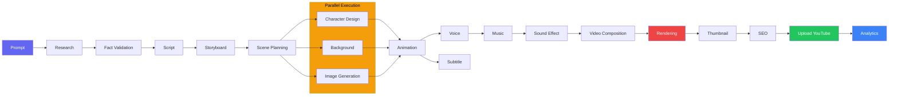
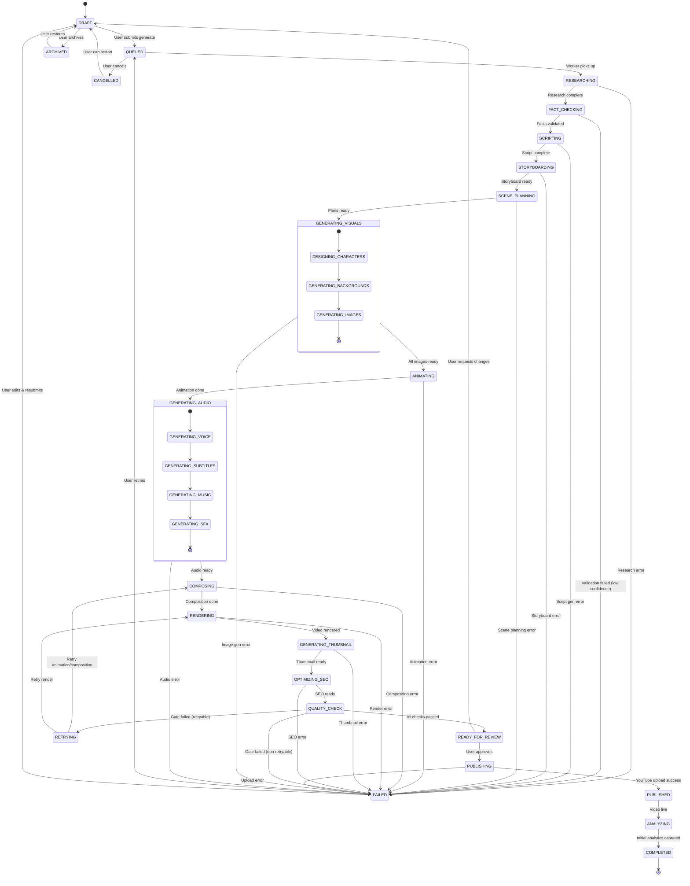
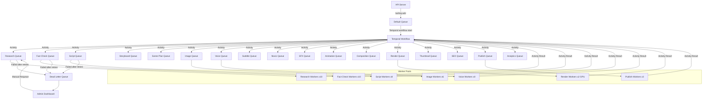
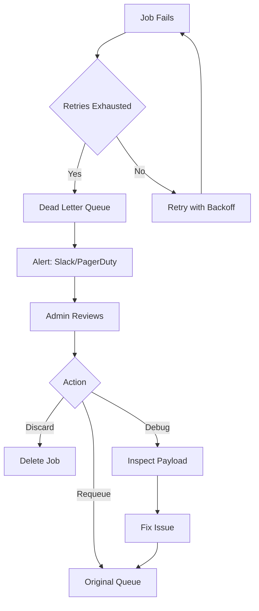

# Workflow & Orchestration — Vidara AI

> **Project:** Vidara AI — AI YouTube Video Generator SaaS  
> **Author:** Platform Engineering Team  
> **Last Updated:** 2026-06-26  
> **Status:** Draft  
> **Cross-Reference:** [Architecture](architecture.md) · [Agents](AGENTS.md) · [PRD](prd.md) · [API](api.md)

---

## 1. Tujuan

Dokumen ini mendefinisikan workflow dan orchestration system untuk Vidara AI. Mencakup core pipeline 20 langkah, AI agent roles, state machine, event map, queue architecture, error handling, dan recovery strategy. Bertujuan menjadi blueprint bagi seluruh AI pipeline orchestration.

---

## 2. Background

Vidara AI menjalankan pipeline pembuatan video YouTube yang kompleks dengan 20 langkah berurutan. Setiap langkah melibatkan satu atau lebih AI agent yang menghasilkan output spesifik. Pipeline harus reliable (failure tolerance 99.9%), observable (setiap langkah terpantau), dan recoverable (auto-retry + dead letter queue). Orchestration menggunakan Temporal.io untuk durability dan BullMQ untuk buffering.

---

## 3. Objective

1. Mendefinisikan core pipeline 20 langkah dari Prompt → Analytics.
2. Mendokumentasikan peran dan tanggung jawab 20 AI agents.
3. Menyediakan state machine dengan valid Mermaid state diagram.
4. Mendefinisikan event map dengan producer & consumer untuk setiap event.
5. Mendokumentasikan queue architecture dengan BullMQ queues per agent.
6. Menetapkan error handling strategy: retry, fallback, dead letter queue.

---

## 4. Scope

**In Scope:**
- Core pipeline 20 langkah (Prompt → Research → Fact Validation → Script → Storyboard → Scene Planning → Character Design → Background → Image Generation → Animation → Voice → Subtitle → Music → Sound Effect → Video Composition → Rendering → Thumbnail → SEO → Upload YouTube → Analytics)
- 20 AI agents dengan role definitions
- State machine dengan semua states dan transitions
- Event map dengan producer/consumer matrix
- Queue architecture (BullMQ queues per agent)
- Error handling, retry, circuit breaker, dead letter queue

**Out of Scope:**
- Frontend state management
- Database schema details
- Deployment topology
- Specific AI model architecture

---

## 5. Stakeholder

| Stakeholder | Interest |
|---|---|
| AI Engineer | Agent behavior, orchestration logic, error handling |
| Backend Engineer | Queue architecture, event routing, Temporal workflows |
| DevOps Engineer | Queue monitoring, DLQ alerts, scaling workers |
| QA Engineer | Pipeline test scenarios, failure injection |
| Product Manager | Pipeline steps, timeout SLAs |
| Solution Architect | End-to-end flow consistency |

---

## 6. Requirement

1. Pipeline harus memiliki maksimal 20 langkah sequential (beberapa bisa parallel).
2. Setiap langkah harus memiliki timeout, retry policy, dan fallback.
3. State machine harus mendefinisikan semua states dengan valid transitions.
4. Event map harus mapping setiap event ke producer dan consumer.
5. Queue architecture harus dedicated queue per agent.
6. Error handling harus mencakup retry (exponential backoff), circuit breaker, dan dead letter queue.
7. Semua diagram harus menggunakan Mermaid yang valid.

---

## 7. Core Pipeline — Overview

```
Prompt → Research → Fact Validation → Script → Storyboard → Scene Planning →
  ┌─────────────────────────────────────────────────────┐
  │  Character Design → Background → Image Generation   │ (Parallel)
  └─────────────────────────────────────────────────────┘
  → Animation → Voice → Subtitle → Music → Sound Effect
  → Video Composition → Rendering → Thumbnail → SEO
  → Upload YouTube → Analytics
```

### Pipeline Flow Diagram



---

## 8. Pipeline Step Detail

### Step 1: Prompt

| Field | Description |
|---|---|
| **Input** | User prompt text (min 50 chars) + config (language, duration, resolution) |
| **Agent** | Master Agent (parsing & validation) |
| **Output** | Parsed prompt JSON with extracted entities, keywords, and intent |
| **Timeout** | 5 seconds |
| **Retry** | 0 (no retry — validation only) |
| **Error** | PROMPT_TOO_SHORT, PROMPT_INVALID |

### Step 2: Research

| Field | Description |
|---|---|
| **Input** | Parsed prompt, keywords, target language |
| **Agent** | Research Agent |
| **Output** | Research document with facts, sources, quotes, data points |
| **Timeout** | 60 seconds |
| **Retry** | 3 (exponential backoff: 2s, 4s, 8s) |
| **Fallback** | Use cached research from similar prompts |
| **Error** | RESEARCH_TIMEOUT, RESEARCH_NO_RESULTS |

### Step 3: Fact Validation

| Field | Description |
|---|---|
| **Input** | Research document |
| **Agent** | Fact Checker Agent |
| **Output** | Validated facts with confidence score (0-100%) per claim |
| **Timeout** | 30 seconds |
| **Retry** | 3 |
| **Fallback** | Flag low-confidence claims for human review |
| **Error** | VALIDATION_FAILED |

### Step 4: Script Generation

| Field | Description |
|---|---|
| **Input** | Validated research, tone config, target duration |
| **Agent** | Script Agent |
| **Output** | Full script with hook, sections, narration, CTA, scene directions |
| **Timeout** | 120 seconds |
| **Retry** | 2 |
| **Fallback** | Use shorter script template |
| **Error** | SCRIPT_GENERATION_FAILED |

### Step 5: Storyboard

| Field | Description |
|---|---|
| **Input** | Script with scene directions |
| **Agent** | Storyboard Agent |
| **Output** | Visual storyboard: scene panels, camera angles, transitions |
| **Timeout** | 60 seconds |
| **Retry** | 2 |
| **Fallback** | Generate text-only storyboard |
| **Error** | STORYBOARD_FAILED |

### Step 6: Scene Planning

| Field | Description |
|---|---|
| **Input** | Script + storyboard |
| **Agent** | Scene Agent |
| **Output** | Scene breakdown: per-scene timing, visual style, character presence |
| **Timeout** | 30 seconds |
| **Retry** | 2 |
| **Fallback** | Default scene split (every 30s) |
| **Error** | SCENE_PLANNING_FAILED |

### Step 7: Character Design

| Field | Description |
|---|---|
| **Input** | Scene plan, character descriptions, brand kit |
| **Agent** | Character Design Agent (sub-agent of Image Agent) |
| **Output** | Character reference sheets, face embeddings (pgvector) |
| **Timeout** | 60 seconds |
| **Retry** | 2 |
| **Fallback** | Use stock character template |
| **Error** | CHARACTER_DESIGN_FAILED |

### Step 8: Background

| Field | Description |
|---|---|
| **Input** | Scene plan, setting descriptions |
| **Agent** | Image Agent (background sub-task) |
| **Output** | Background images per scene |
| **Timeout** | 60 seconds |
| **Retry** | 2 |
| **Fallback** | Use gradient/abstract background |
| **Error** | BACKGROUND_FAILED |

### Step 9: Image Generation

| Field | Description |
|---|---|
| **Input** | Scene descriptions, character refs, background images |
| **Agent** | Image Agent |
| **Output** | Full scene images (character + background composited) |
| **Timeout** | 120 seconds per scene |
| **Retry** | 2 |
| **Fallback** | Use lower quality model (DALL-E 3 → Stable Diffusion) |
| **Error** | IMAGE_GENERATION_FAILED |

### Step 10: Animation

| Field | Description |
|---|---|
| **Input** | Scene images, animation config (Ken Burns, transitions) |
| **Agent** | Animation Agent |
| **Output** | Animated video clips per scene |
| **Timeout** | 180 seconds |
| **Retry** | 2 |
| **Fallback** | Static image with crossfade |
| **Error** | ANIMATION_FAILED |

### Step 11: Voiceover

| Field | Description |
|---|---|
| **Input** | Script narration, voice config (voice_id, emotion, speed) |
| **Agent** | Voice Agent |
| **Output** | Audio file (MP3/WAV) + word-level timestamps |
| **Timeout** | 120 seconds |
| **Retry** | 3 |
| **Fallback** | OpenAI TTS (fallback from ElevenLabs) |
| **Error** | VOICEOVER_FAILED |

### Step 12: Subtitle

| Field | Description |
|---|---|
| **Input** | Voiceover audio, original script |
| **Agent** | Subtitle Agent |
| **Output** | SRT/VTT subtitle file with timestamps |
| **Timeout** | 60 seconds |
| **Retry** | 2 |
| **Fallback** | Generate from script text (no sync) |
| **Error** | SUBTITLE_FAILED |

### Step 13: Music

| Field | Description |
|---|---|
| **Input** | Scene moods, target duration, genre preferences |
| **Agent** | Music Agent |
| **Output** | Background music audio file |
| **Timeout** | 90 seconds |
| **Retry** | 2 |
| **Fallback** | Curated royalty-free library track |
| **Error** | MUSIC_FAILED |

### Step 14: Sound Effect

| Field | Description |
|---|---|
| **Input** | Scene actions (door, footsteps, explosion, etc.) |
| **Agent** | Sound Effect Agent |
| **Output** | SFX audio clips with scene sync timing |
| **Timeout** | 60 seconds |
| **Retry** | 1 |
| **Fallback** | Library SFX |
| **Error** | SFX_FAILED |

### Step 15: Video Composition

| Field | Description |
|---|---|
| **Input** | Animated clips, voiceover, subtitles, music, SFX |
| **Agent** | Composer Agent |
| **Output** | Composed video ready for rendering |
| **Timeout** | 300 seconds |
| **Retry** | 2 |
| **Fallback** | Basic composition (stack layers) |
| **Error** | COMPOSITION_FAILED |

### Step 16: Rendering

| Field | Description |
|---|---|
| **Input** | Composed project, render config (resolution, codec) |
| **Agent** | Render Engine (FFmpeg GPU-accelerated) |
| **Output** | Final video file (MP4 H.264/HEVC/AV1) |
| **Timeout** | 600 seconds (10 min) |
| **Retry** | 2 |
| **Fallback** | Software encoding (CPU) |
| **Error** | RENDER_FAILED |

### Step 17: Thumbnail

| Field | Description |
|---|---|
| **Input** | Video keyframe, title, brand kit |
| **Agent** | Thumbnail Agent |
| **Output** | 3 thumbnail variations with overlay text |
| **Timeout** | 30 seconds |
| **Retry** | 2 |
| **Fallback** | Auto-crop from video frame |
| **Error** | THUMBNAIL_FAILED |

### Step 18: SEO

| Field | Description |
|---|---|
| **Input** | Video script, title draft, target keywords |
| **Agent** | SEO Agent |
| **Output** | Optimized title, description, tags, chapters, transcript |
| **Timeout** | 30 seconds |
| **Retry** | 2 |
| **Fallback** | Use title from project metadata |
| **Error** | SEO_FAILED |

### Step 19: Upload YouTube

| Field | Description |
|---|---|
| **Input** | Video file, thumbnail, SEO metadata, publish config |
| **Agent** | Publishing Agent |
| **Output** | YouTube video ID and URL |
| **Timeout** | 600 seconds (10 min for upload) |
| **Retry** | 3 (with chunked upload resume) |
| **Fallback** | Mark as "ready for manual upload" |
| **Error** | YOUTUBE_UPLOAD_FAILED |

### Step 20: Analytics

| Field | Description |
|---|---|
| **Input** | YouTube video ID |
| **Agent** | Analytics Agent |
| **Output** | Initial analytics snapshot (views, retention, CTR) |
| **Timeout** | 30 seconds |
| **Retry** | 3 (YouTube API quota-aware) |
| **Fallback** | Schedule analytics fetch for later |
| **Error** | ANALYTICS_FAILED |

---

## 9. AI Agent Workflow — Role Definitions

### Niche Context Injection

Sebelum pipeline dimulai, sistem memuat konteks niche yang dipilih user:

1. Sistem membaca `project.niche_id` dari database project
2. Load Niche Profile dari tabel `niches` (name, keywords, target_audience, default_style, visual_preferences)
3. Cache niche context di Redis dengan TTL pipeline duration
4. Inject niche context ke system prompt setiap agent dengan format:
   ```
   [NICHE_PROFILE]
   name: Sejarah Nusantara
   keywords: sejarah, kerajaan, nusantara, budaya
   audience: 18-40 tahun, bahasa Indonesia, general
   tone: educational
   visual: cinematic
   [/NICHE_PROFILE]
   ```
5. Niche keywords → Research Agent untuk menyempurnakan pencarian topik
6. Niche tone → Script Agent untuk menyesuaikan gaya narasi dan hook
7. Niche visual → Image Agent untuk konsistensi style dan color palette
8. Niche audience → SEO Agent untuk optimasi kata kunci dan target demografis
9. Niche default_style.music_mood → Music Agent untuk pemilihan musik yang sesuai

### Master Agent

| Role | Orchestration, delegation, quality check |
|---|---|
| **Responsibilities** | Parsing user prompt, delegating to sub-agents, collecting results, quality gate validation, error decision (retry vs fallback vs fail) |
| **Communication** | Synchronous (Temporal activity) dengan semua agents |
| **State** | Holds pipeline context (project_id, step, artifacts) |
| **Quality Check** | Validates setiap agent output sebelum melanjutkan ke step berikutnya |
| **Timeout** | 10 menit per pipeline |

### Research Agent

| Role | Web search, content gathering |
|---|---|
| **Responsibilities** | Web search via API (Google/Bing), content extraction, source collection, research brief generation |
| **Model** | GPT-5o + Web Search API |
| **Tools** | Web search, HTML parser, PDF extractor |
| **Output Format** | Structured JSON with facts, sources, quotes, confidence |

### Planner Agent

| Role | Structure, timeline, resource allocation |
|---|---|
| **Responsibilities** | Menentukan scene structure, timing allocation per scene, resource estimation (credits, duration) |
| **Model** | GPT-5o |
| **Output** | Scene breakdown plan with metadata |

### Fact Checker

| Role | Validation, source verification |
|---|---|
| **Responsibilities** | Cross-reference setiap claim dengan minimal 3 sources, confidence scoring, flag uncertain claims |
| **Model** | GPT-5o + custom fact-check pipeline |
| **Output** | Validated facts array with confidence scores |
| **Threshold** | Confidence ≥80% = auto-accept; 50-80% = flag; <50% = reject |

### Script Agent

| Role | Narrative writing, hook, CTA, SEO |
|---|---|
| **Responsibilities** | Generate full script with hook (first 15s), narrative arc, scene transitions, CTA, voice direction, SEO keywords |
| **Model** | GPT-5o |
| **Context** | Research document, validated facts, target audience, tone config |
| **Output** | Script JSON with sections, duration estimates |

### Storyboard Agent

| Role | Visual planning, shot composition |
|---|---|
| **Responsibilities** | Generate visual storyboard panels, camera angle recommendations, transition types between scenes |
| **Model** | GPT-5o (description) + Image model (preview) |
| **Output** | Storyboard JSON with scene visuals description |

### Scene Agent

| Role | Scene breakdown, timing |
|---|---|
| **Responsibilities** | Split script into scenes, assign durations per scene, determine visual style per scene |
| **Model** | GPT-5o |
| **Output** | Scene array with metadata |

### Image Agent

| Role | Generate images per scene |
|---|---|
| **Responsibilities** | Generate images untuk setiap scene, handle character consistency, background generation, style consistency |
| **Model** | Flux 2 Pro (primary), DALL-E 4 (fallback) |
| **Sub-tasks** | Character design, background, scene composition |
| **Output** | Image URLs with metadata |

### Voice Agent

| Role | TTS generation, emotion, pacing |
|---|---|
| **Responsibilities** | Convert script narration to speech, apply emotion and pacing, generate word-level timestamps |
| **Model** | ElevenLabs (primary), OpenAI TTS (fallback) |
| **Output** | Audio file URL + timestamp JSON |

### Subtitle Agent

| Role | Speech-to-text, timing, styling |
|---|---|
| **Responsibilities** | Generate subtitles from voiceover audio, sync timestamps, apply styling, multi-language support |
| **Model** | Deepgram (STT), GPT-5o (translation) |
| **Output** | SRT/VTT file URL |

### Animation Agent

| Role | Transitions, motion, effects |
|---|---|
| **Responsibilities** | Apply Ken Burns effect, scene transitions (fade/crossfade/slide/zoom), text overlays, motion graphics |
| **Engine** | FFmpeg + custom animation engine |
| **Output** | Animated clip URLs |

### Composer Agent

| Role | Video assembly |
|---|---|
| **Responsibilities** | Assemble animated clips, voiceover, music, SFX, subtitles into single timeline, apply audio mixing (−14dB LUFS) |
| **Engine** | FFmpeg complex filter graph |
| **Output** | Composed video ready for rendering |

### Thumbnail Agent

| Role | Thumbnail generation with text |
|---|---|
| **Responsibilities** | Generate 3 thumbnail variations with CTR-optimized design, text overlay, brand compliance |
| **Model** | GPT Image / Flux Pro |
| **Output** | 3 thumbnail image URLs |

### SEO Agent

| Role | Title, description, tags optimization |
|---|---|
| **Responsibilities** | Generate optimized title (5 variants), description with chapters/timestamps, tags (15-30), transcript, keyword analysis |
| **Model** | GPT-5o |
| **Output** | SEO metadata JSON |

### Publishing Agent

| Role | YouTube upload, scheduling |
|---|---|
| **Responsibilities** | OAuth 2.0 with YouTube, chunked upload, set metadata, visibility control, scheduling, playlist assignment |
| **API** | YouTube Data API v3 |
| **Output** | YouTube video ID + URL |

### Analytics Agent

| Role | Performance tracking, insights |
|---|---|
| **Responsibilities** | Fetch YouTube Analytics, store snapshots, generate insight reports, trend analysis |
| **API** | YouTube Analytics API |
| **Schedule** | Initial fetch (immediate), daily snapshot, weekly report |
| **Output** | Analytics data JSON |

### Memory Agent

| Role | Context persistence, learning |
|---|---|
| **Responsibilities** | Store inter-session context, user preferences, past project patterns, agent performance metrics |
| **Storage** | PostgreSQL (structured) + Redis (volatile) |
| **Output** | Context injection into agent prompts |

### Context Agent

| Role | Conversation state management |
|---|---|
| **Responsibilities** | Maintain conversation thread, inject relevant history, manage token windows, summarize when needed |
| **Storage** | Redis (TTL-based) |
| **Output** | Context window for agent prompts |

### QA Agent

| Role | Quality checks, validation |
|---|---|
| **Responsibilities** | Validate output quality per step: audio sync, resolution check, duration match, content safety, brand compliance |
| **Thresholds** | Audio sync ≤100ms offset, resolution ≥720p, duration ±5% target |
| **Output** | Pass/Fail with details |

### Moderator Agent

| Role | Content moderation, compliance |
|---|---|
| **Responsibilities** | Detect harmful content, policy violations (YouTube ToS, UU PDP), copyright check, hate speech, NSFW |
| **Model** | GPT-5o + custom classifier |
| **Output** | Moderation verdict: pass / flag / reject |
| **Action** | Flagged → human review; Rejected → pipeline halted with explanation |

### Monitoring Agent

| Role | System health, alerts |
|---|---|
| **Responsibilities** | Track pipeline metrics, agent latency, error rates, queue depth, credit usage, cost per pipeline |
| **Output** | Metrics to Prometheus/Grafana |
| **Alerts** | Slack/PagerDuty on threshold breach |

### Agent Communication Flow

```mermaid
sequenceDiagram
    participant MA as Master Agent
    participant RA as Research Agent
    participant FC as Fact Checker
    participant SA as Script Agent
    participant IA as Image Agent
    participant VA as Voice Agent
    participant QA as QA Agent

    MA->>RA: Research(prompt)
    RA-->>MA: ResearchResult
    MA->>FC: Validate(research)
    FC-->>MA: ValidatedFacts
    MA->>SA: WriteScript(facts, config)
    SA-->>MA: Script
    MA->>QA: ValidateScript(script)
    QA-->>MA: ScriptQuality

    MA->>IA: GenerateImages(scenes)
    IA-->>MA: Images
    MA->>VA: GenerateVoice(script)
    VA-->>MA: Voiceover

    alt Quality Check Failed
        MA->>QA: Revalidate
        QA-->>MA: RetryNeeded
        MA->>IA: RetryGenerate(images, feedback)
    else All Passed
        MA->>QA: FinalValidation(all_artifacts)
        QA-->>MA: AllGood
    end

    MA->>MA: PipelineComplete
```



---

## 10. Agent Orchestration Architecture

```mermaid
flowchart TD
    subgraph "Temporal Workflow"
        MA[Master Agent Workflow]
        MA -->|Activity| RA[Research Activity]
        MA -->|Activity| FA[Fact Check Activity]
        MA -->|Activity| SA[Script Activity]
        MA -->|Activity| SBA[Storyboard Activity]
        MA -->|Activity| SPA[Scene Plan Activity]
        MA -->|Parallel| CD[Character Design Activity]
        MA -->|Parallel| BG[Background Activity]
        MA -->|Parallel| IG[Image Gen Activity]
        MA -->|Activity| AN[Animation Activity]
        MA -->|Activity| VO[Voice Activity]
        MA -->|Activity| SU[Subtitle Activity]
        MA -->|Activity| MU[Music Activity]
        MA -->|Activity| SF[SFX Activity]
        MA -->|Activity| CO[Composition Activity]
        MA -->|Activity| RE[Render Activity]
        MA -->|Activity| TH[Thumbnail Activity]
        MA -->|Activity| SE[SEO Activity]
        MA -->|Activity| PU[Publish Activity]
        MA -->|Activity| AL[Analytics Activity]
    end

    subgraph "BullMQ Queues"
        Q1[(Research Queue)]
        Q2[(Fact Check Queue)]
        Q3[(Script Queue)]
        Q4[(Storyboard Queue)]
        Q5[(Image Queue)]
        Q6[(Voice Queue)]
        Q7[(Render Queue)]
    end

    subgraph "Workers"
        W1[Research Worker]
        W2[Fact Check Worker]
        W3[Script Writer Worker]
        W4[Image Gen Worker]
        W5[Voice Gen Worker]
        W6[Render Worker]
    end

    RA --> Q1
    FA --> Q2
    SA --> Q3
    SBA --> Q4
    CD & BG & IG --> Q5
    VO --> Q6
    RE --> Q7

    Q1 --> W1
    Q2 --> W2
    Q3 --> W3
    Q4 --> W3
    Q5 --> W4
    Q6 --> W5
    Q7 --> W6

    W1 & W2 & W3 & W4 & W5 & W6 -->|Result| MA
```



---

## 11. State Machine — Video Processing States



---

## 12. State Transition Table

| From | To | Trigger | Condition |
|---|---|---|---|
| DRAFT | QUEUED | User clicks generate | Credits sufficient |
| DRAFT | ARCHIVED | User archives | — |
| ARCHIVED | DRAFT | User restores | — |
| QUEUED | RESEARCHING | BullMQ picks up job | Worker available |
| QUEUED | CANCELLED | User cancels | Before processing starts |
| RESEARCHING | FACT_CHECKING | Research activity returns | Success |
| RESEARCHING | FAILED | Research timeout/error | Retries exhausted |
| FACT_CHECKING | SCRIPTING | Validation passes | Confidence ≥80% |
| FACT_CHECKING | FAILED | Validation fails | Confidence <50% |
| SCRIPTING | STORYBOARDING | Script activity returns | Success |
| SCRIPTING | FAILED | Script error | Retries exhausted |
| GENERATING_VISUALS | ANIMATING | All sub-tasks complete | Parallel tasks done |
| GENERATING_VISUALS | FAILED | Any visual sub-task fails | Retries exhausted |
| QUALITY_CHECK | RETRYING | Gate fails (retryable) | Retry count < max |
| QUALITY_CHECK | READY_FOR_REVIEW | All gates pass | — |
| READY_FOR_REVIEW | PUBLISHING | User approves | YouTube connected |
| PUBLISHING | PUBLISHED | YouTube upload success | 201 from API |
| PUBLISHING | FAILED | Upload fails | Retries exhausted |
| COMPLETED | [*] | — | Terminal state |

---

## 13. Error Handling

### 13.1 Retry Strategy

| Error Type | Max Retries | Backoff | Description |
|---|---|---|---|
| TRANSIENT (timeout, rate limit, 5xx) | 3 | Exponential (2s, 4s, 8s) | Server-side temporary failure |
| PROVISIONING (model busy, quota) | 5 | Exponential (10s, 30s, 90s, 270s, 810s) | Resource not available |
| VALIDATION (confidence low) | 2 | Immediate | Quality check failure |
| FATAL (auth, invalid input) | 0 | — | Non-retryable |

### 13.2 Circuit Breaker

| Parameter | Value |
|---|---|
| Failure Threshold | 5 consecutive failures |
| Open Duration | 30 seconds |
| Half-open Requests | 2 requests |
| Per | Provider (OpenAI, ElevenLabs, Runway, Flux, Deepgram) |

### 13.3 Fallback Chain

```
Primary (Flux 2 Pro) → Secondary (DALL-E 4) → Tertiary (Stable Diffusion)
Primary (ElevenLabs) → Secondary (OpenAI TTS)
Primary (Runway) → Secondary (Remotion animation)
Primary (Deepgram) → Secondary (Whisper API)
```

### 13.4 Dead Letter Queue

| Field | Description |
|---|---|
| **Storage** | Redis (BullMQ DLQ) + PostgreSQL (persistent) |
| **Retention** | 7 days in Redis, 30 days in PostgreSQL |
| **Alert** | PagerDuty/Slack when DLQ count > 10 in 1 hour |
| **Manual Retry** | Admin UI: requeue from DLQ |
| **Max DLQ Entries** | 1000 (oldest auto-purged) |

---

## 14. Event Map

| Event | Producer | Consumer(s) | Description |
|---|---|---|---|
| `pipeline.started` | Master Agent | WebSocket Hub, Analytics Agent | Pipeline initialized |
| `pipeline.completed` | Master Agent | WebSocket Hub, Notification Agent, Billing Agent | Pipeline finished |
| `pipeline.failed` | Master Agent | WebSocket Hub, Notification Agent, DLQ | Pipeline errored |
| `pipeline.cancelled` | API Server | Master Agent, WebSocket Hub | User cancelled |
| `agent.research.completed` | Research Agent | Master Agent | Research done |
| `agent.fact_check.completed` | Fact Checker | Master Agent | Validation done |
| `agent.script.completed` | Script Agent | Master Agent | Script ready |
| `agent.storyboard.completed` | Storyboard Agent | Master Agent | Storyboard ready |
| `agent.scene_plan.completed` | Scene Agent | Master Agent | Scene plan ready |
| `agent.image.completed` | Image Agent | Master Agent | All images generated |
| `agent.voice.completed` | Voice Agent | Master Agent | Voiceover ready |
| `agent.subtitle.completed` | Subtitle Agent | Master Agent | Subtitles ready |
| `agent.music.completed` | Music Agent | Master Agent | Music ready |
| `agent.sfx.completed` | SFX Agent | Master Agent | Sound effects ready |
| `agent.animation.completed` | Animation Agent | Master Agent | Animation done |
| `agent.composition.completed` | Composer Agent | Master Agent | Composition done |
| `render.progress` | Render Engine | WebSocket Hub | Render % update |
| `render.completed` | Render Engine | Master Agent, WebSocket Hub | Render done |
| `render.failed` | Render Engine | Master Agent, DLQ | Render failed |
| `agent.thumbnail.completed` | Thumbnail Agent | Master Agent | Thumbnail ready |
| `agent.seo.completed` | SEO Agent | Master Agent | SEO metadata ready |
| `quality_gate.passed` | QA Agent | Master Agent | Quality check passed |
| `quality_gate.failed` | QA Agent | Master Agent | Quality check failed |
| `upload.progress` | Publishing Agent | WebSocket Hub | Upload % progress |
| `upload.completed` | Publishing Agent | Master Agent, WebSocket Hub | Upload done |
| `upload.failed` | Publishing Agent | Master Agent, DLQ | Upload failed |
| `analytics.captured` | Analytics Agent | Master Agent, Dashboard | Analytics snapshot |
| `moderation.flagged` | Moderator Agent | Admin Notification | Content flagged |
| `moderation.rejected` | Moderator Agent | Master Agent, User Notification | Content rejected |
| `credits.deducted` | Billing Agent | Master Agent, WebSocket Hub | Credits consumed |
| `notification.send` | Notification Agent | Email Service, WebSocket Hub | User notification |

---

## 15. Queue Architecture — BullMQ

### 15.1 Queues

| Queue Name | Agents | Priority | Concurrency | Description |
|---|---|---|---|---|
| `research` | Research Agent | 5 | 10 | Web search and content gathering |
| `fact-check` | Fact Checker | 5 | 10 | Fact validation |
| `script` | Script Agent, Storyboard Agent, Scene Agent | 5 | 8 | Content generation |
| `image` | Image Agent (character, background, scene) | 4 | 6 | Image generation (GPU-bound) |
| `voice` | Voice Agent | 4 | 8 | TTS generation |
| `subtitle` | Subtitle Agent | 3 | 10 | Subtitle generation |
| `music` | Music Agent | 3 | 4 | Music generation |
| `sfx` | SFX Agent | 2 | 4 | Sound effect generation |
| `animation` | Animation Agent | 3 | 4 | Video animation (GPU-bound) |
| `composition` | Composer Agent | 3 | 4 | Video composition (CPU-bound) |
| `render` | Render Engine | 2 | 2 | Final rendering (GPU-bound, max 2 concurrent) |
| `thumbnail` | Thumbnail Agent | 4 | 8 | Thumbnail generation |
| `seo` | SEO Agent | 5 | 10 | SEO optimization |
| `publish` | Publishing Agent | 2 | 3 | YouTube upload (quota-aware) |
| `analytics` | Analytics Agent | 1 | 5 | Analytics fetching |
| `default` | Master Agent | 5 | 20 | Default queue for orchestration tasks |
| `dlq` | — | 0 | 1 | Dead letter queue (manual processing) |

### 15.2 Queue Configuration

```javascript
// Per-queue BullMQ configuration
{
  research: {
    defaultJobOptions: {
      attempts: 3,
      backoff: { type: 'exponential', delay: 2000 },
      timeout: 60000,
      removeOnComplete: true,
      removeOnFail: false
    },
    limiter: { max: 10, duration: 1000 } // 10 jobs/sec
  },
  render: {
    defaultJobOptions: {
      attempts: 2,
      backoff: { type: 'exponential', delay: 10000 },
      timeout: 600000, // 10 minutes
      removeOnComplete: true,
      removeOnFail: false
    },
    limiter: { max: 2, duration: 1000 } // Max 2 concurrent renders
  },
  publish: {
    defaultJobOptions: {
      attempts: 3,
      backoff: { type: 'exponential', delay: 5000 },
      timeout: 600000,
      removeOnComplete: true,
      removeOnFail: false
    },
    limiter: { max: 3, duration: 1000 }
  }
}
```

### 15.3 Queue Architecture Diagram



---

## 16. Temporal Workflow Definitions

### 16.1 VideoPipelineWorkflow

```typescript
// Pseudocode — Temporal Workflow
async function VideoPipelineWorkflow(payload: PipelinePayload) {
  const ctx = new PipelineContext(payload);
  
  // Emit pipeline started
  await emit('pipeline.started', ctx);
  
  // Step 1-3: Research & Validation
  ctx.research = await executeActivity('ResearchActivity', payload.prompt, {
    retry: { maximumAttempts: 3 },
    timeout: '60s'
  });
  await emit('pipeline.progress', { step: 'research', progress: 15 });
  
  ctx.facts = await executeActivity('FactCheckActivity', ctx.research, {
    retry: { maximumAttempts: 3 },
    timeout: '30s'
  });
  await emit('pipeline.progress', { step: 'fact_check', progress: 25 });
  
  // Step 4-6: Content
  ctx.script = await executeActivity('ScriptActivity', ctx.facts, payload.config, {
    timeout: '120s'
  });
  await emit('pipeline.progress', { step: 'script', progress: 35 });
  
  ctx.storyboard = await executeActivity('StoryboardActivity', ctx.script, { timeout: '60s' });
  await emit('pipeline.progress', { step: 'storyboard', progress: 40 });
  
  ctx.scenePlan = await executeActivity('ScenePlanActivity', ctx.script, ctx.storyboard, { timeout: '30s' });
  await emit('pipeline.progress', { step: 'scene_planning', progress: 45 });
  
  // Step 7-9: Visuals (Parallel)
  const [characters, backgrounds, images] = await Promise.all([
    executeActivity('CharacterDesignActivity', ctx.scenePlan),
    executeActivity('BackgroundActivity', ctx.scenePlan),
    executeActivity('ImageGenActivity', ctx.scenePlan)
  ]);
  ctx.visuals = { characters, backgrounds, images };
  await emit('pipeline.progress', { step: 'image_generation', progress: 60 });
  
  // Step 10: Animation
  ctx.animations = await executeActivity('AnimationActivity', ctx.visuals, { timeout: '180s' });
  await emit('pipeline.progress', { step: 'animation', progress: 65 });
  
  // Step 11-14: Audio (Voice + Subtitle are dependent; Music + SFX parallel)
  ctx.voiceover = await executeActivity('VoiceActivity', ctx.script);
  await emit('pipeline.progress', { step: 'voiceover', progress: 70 });
  
  ctx.subtitles = await executeActivity('SubtitleActivity', ctx.voiceover, ctx.script);
  await emit('pipeline.progress', { step: 'subtitle', progress: 75 });
  
  const [music, sfx] = await Promise.all([
    executeActivity('MusicActivity', ctx.scenePlan),
    executeActivity('SFXActivity', ctx.scenePlan)
  ]);
  ctx.audio = { music, sfx };
  await emit('pipeline.progress', { step: 'music', progress: 80 });
  
  // Step 15-16: Composition & Render
  ctx.composition = await executeActivity('CompositionActivity', {
    animations: ctx.animations,
    voiceover: ctx.voiceover,
    subtitles: ctx.subtitles,
    music: ctx.music,
    sfx: ctx.sfx
  }, { timeout: '300s' });
  await emit('pipeline.progress', { step: 'composition', progress: 85 });
  
  ctx.renderedVideo = await executeActivity('RenderActivity', ctx.composition, payload.config, {
    timeout: '600s'
  });
  await emit('pipeline.progress', { step: 'rendering', progress: 90 });
  
  // Step 17-18: Thumbnail & SEO
  ctx.thumbnail = await executeActivity('ThumbnailActivity', ctx.renderedVideo, payload.config);
  ctx.seo = await executeActivity('SEOActivity', ctx.script, payload.config);
  await emit('pipeline.progress', { step: 'seo', progress: 95 });
  
  // Quality Gate
  const qualityResult = await executeActivity('QualityGateActivity', ctx);
  if (!qualityResult.passed) {
    if (qualityResult.retryable) {
      throw new RetryableError('Quality gate failed');
    }
    throw new NonRetryableError('Quality gate failed: ' + qualityResult.reason);
  }
  
  // Step 19: Publish (if auto-publish enabled)
  if (payload.config.auto_publish) {
    ctx.publishResult = await executeActivity('PublishActivity', ctx, { timeout: '600s' });
    await emit('pipeline.progress', { step: 'publishing', progress: 98 });
    
    // Step 20: Analytics
    ctx.analytics = await executeActivity('AnalyticsActivity', ctx.publishResult.videoId);
    await emit('pipeline.progress', { step: 'analytics', progress: 100 });
  }
  
  // Complete
  await emit('pipeline.completed', ctx);
  return ctx;
}
```

---

## 17. Parallel Execution Strategy

```mermaid
gantt
    title Video Pipeline Timeline — 10 Minute Target
    dateFormat  X
    axisFormat %s

    section Validation
    Research           :a1, 0, 10
    Fact Check         :a2, after a1, 5

    section Content
    Script             :a3, after a2, 15
    Storyboard         :a4, after a3, 8
    Scene Planning     :a5, after a4, 5

    section Visuals (Parallel)
    Character Design   :a6, after a5, 10
    Background Gen     :a7, after a5, 10
    Image Gen          :a8, after a5, 20

    section Animation
    Animation          :a9, after a8, 15

    section Audio
    Voiceover          :a10, after a3, 12
    Subtitle           :a11, after a10, 5
    Music              :a12, after a5, 10
    SFX                :a13, after a5, 8

    section Composition
    Composition        :a14, after a9, 10

    section Render
    Rendering          :a15, after a14, 30

    section Finishing
    Thumbnail          :a16, after a15, 5
    SEO                :a17, after a3, 5
    Quality Gate       :a18, after a15, 3

    section Publish
    YouTube Upload     :a19, after a18, 20
    Analytics          :a20, after a19, 3
```



**Total estimated time:** ~110s (research → complete) untuk pipeline non-render. Render 30s untuk video 480p/5 menit. Total ~140s dengan render.

---

## 18. Concurrency & Scaling

| Resource | Max Concurrent | Scaling Strategy |
|---|---|---|
| Research Workers | 10 | Fixed pool (API-bound, low cost) |
| Fact Check Workers | 10 | Fixed pool (API-bound) |
| Script Writers | 8 | Fixed pool (LLM API-bound) |
| Image Gen Workers | 6 | Fixed pool (GPU API-bound) |
| Voice Gen Workers | 8 | Fixed pool (API-bound) |
| Render Workers | 2 | GPU-bound, queue-based |
| Upload Workers | 3 | YouTube quota-aware |
| Queue Consumers | Auto | BullMQ concurrency per queue |

---

## 19. Monitoring & Observability

### 19.1 Key Metrics

| Metric | Threshold | Alert |
|---|---|---|
| Pipeline success rate | <95% | Warning |
| Pipeline success rate | <90% | Critical |
| Avg pipeline duration | >15 min | Warning |
| Queue depth (any queue) | >50 | Warning |
| Queue depth (render) | >10 | Critical |
| Dead letter queue count | >10 in 1h | Critical |
| Agent timeout rate | >5% | Warning |
| AI provider error rate | >10% | Critical |
| Credit consumption | >200% of projection | Warning |

### 19.2 Tracing

- **Tool:** OpenTelemetry + Grafana Tempo
- **Trace per:** Pipeline execution (trace ID = pipeline_id)
- **Span per:** Agent activity, queue wait, render step
- **Tags:** project_id, user_id, agent_name, queue_name

### 19.3 Logging

```json
{
  "timestamp": "2026-06-26T12:00:00Z",
  "level": "info",
  "pipeline_id": "pipe_abc123",
  "project_id": "prj_abc123",
  "user_id": "usr_abc123",
  "step": "script",
  "agent": "ScriptAgent",
  "status": "completed",
  "duration_ms": 45000,
  "retry_count": 0,
  "input_tokens": 1200,
  "output_tokens": 4500,
  "cost_usd": 0.15,
  "error": null
}
```

---

## 20. Recovery Procedures

### 20.1 Pipeline Failure Recovery

| Failure | Action | Recovery Time |
|---|---|---|
| Agent timeout | Retry with exponential backoff (max 3) | +2-8s |
| Provider 5xx | Circuit breaker → fallback provider | +30s |
| Provider 429 | Backoff with Retry-After header | +variable |
| Queue crash | BullMQ Redis persistence + auto-restart | <5s |
| Worker crash | Docker auto-restart + health check | <10s |
| Temporal server fail | HA mode (3 nodes) + retry | <5s |
| YouTube quota exceeded | Defer upload, schedule for next window | +24h |
| GPU render OOM | Split render into segments | +60s |
| Corrupted artifact | Re-generate from last checkpoint | +step_time |

### 20.2 Dead Letter Queue Recovery



---

## 21. Future Improvement

| Item | Target Version | Impact |
|---|---|---|
| Adaptive parallelism (auto-detect parallelizable steps) | v1.1 | 20% faster pipeline |
| Intelligent retry (ML-based retry decision) | v1.2 | Higher success rate |
| Predictive queue scaling (auto-scale workers based on queue depth) | v1.2 | Cost optimization |
| Multi-region Temporal cluster | v1.1 | HA across regions |
| Agent fallback ranking (dynamic fallback based on cost/latency) | v1.2 | Cost reduction |
| Human-in-the-loop for quality gate failures | v1.1 | Better output quality |
| Pipeline checkpointing (resume from failed step) | v1.2 | Reduce rework cost |

---

## 22. Acceptance Criteria

| AC | Kriteria | Status |
|---|---|---|
| AC-01 | Core pipeline 20 langkah defined with input/output/timeout | ✅ |
| AC-02 | 20 AI agents defined with responsibilities | ✅ |
| AC-03 | State machine with valid Mermaid diagram covers all states | ✅ |
| AC-04 | Event map covers all pipeline events with producer/consumer | ✅ |
| AC-05 | Queue architecture defines BullMQ queues per agent | ✅ |
| AC-06 | Error handling covers retry, fallback, circuit breaker, DLQ | ✅ |
| AC-07 | All Mermaid diagrams validated | ✅ |
| AC-08 | Cross-references to architecture.md, agents.md, frd.md, prd.md | ✅ |

---

## 23. Referensi

| Dokumen | Path |
|---|---|
| Architecture Document | `internal/docs/architecture.md` |
| Agent Team Profile | `internal/docs/AGENTS.md` |
| Product Requirement Document | `internal/docs/prd.md` |
| API Specification | `internal/docs/api.md` |
| Tech Stack Document | `internal/docs/techstack.md` |
| BRD Document | `internal/docs/brd.md` |

---

> **End of Workflow & Orchestration Document** — Vidara AI © 2026
